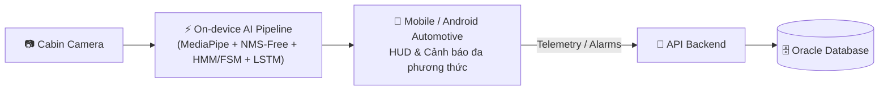
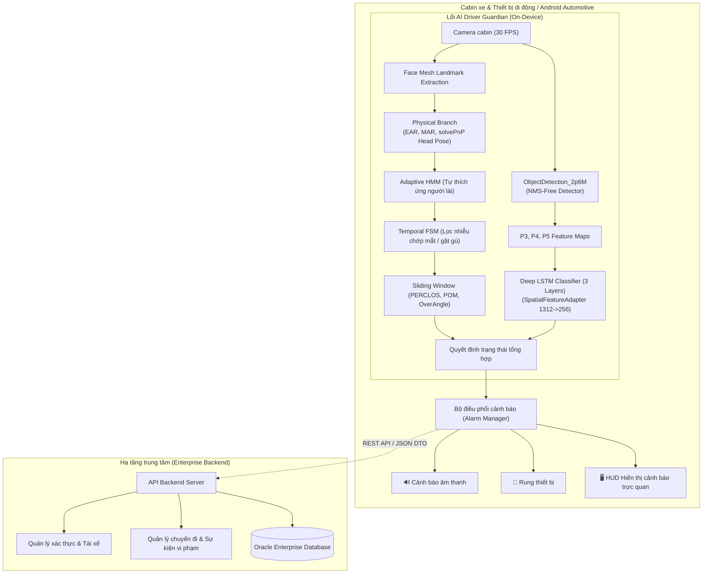

# 🛡️ Driver Guardian — Intelligent Driver Drowsiness Detection & Warning System

[](https://ptithcm.edu.vn/)
[](#-thông-tin-đề-tài)
[](https://www.python.org/)
[](https://pytorch.org/)
[](https://api.tiangolo.com/)
[](https://source.android.com/devices/automotive)
[](LICENSE)

---

## 📌 Thông tin đề tài

* **Tên đề tài:** Xây dựng ứng dụng App Mobile tích hợp tối ưu AI cho hệ thống phát hiện và cảnh báo tình trạng buồn ngủ của tài xế sử dụng Machine Learning
* **Cơ sở đào tạo:** Học viện Công nghệ Bưu chính Viễn thông – Cơ sở tại TP. Hồ Chí Minh (PTITHCM)
* **Đơn vị:** Khoa Công nghệ Thông tin
* **Nhóm thực hiện (Nhóm C_38):**
  * **Trần Đỗ Mạnh Duy**
  * **Mai Vũ Tuấn Minh**
  * **Trần Ti Ni**

---

## 📖 Giới thiệu tổng quan

Tai nạn giao thông bắt nguồn từ sự mất tập trung và buồn ngủ của tài xế là một trong những nguyên nhân hàng đầu gây ra hậu quả nghiêm trọng trên toàn thế giới. **Driver Guardian** là giải pháp hệ thống giám sát người lái (Driver Monitoring System - DMS) toàn diện, ứng dụng trí tuệ nhân tạo và học máy để nhận diện sớm các dấu hiệu mệt mỏi, vi ngủ (*microsleep*), chớp mắt bất thường, ngáp và gật đầu trong thời gian thực.

Hệ thống được thiết kế hướng tới triển khai trên **thiết bị di động và môi trường ô tô thông minh (Android Automotive)**, tối ưu hóa độ trễ, tiết kiệm tài nguyên phần cứng, đồng thời bảo vệ nghiêm ngặt quyền riêng tư của tài xế thông qua cơ chế tính toán AI trên thiết bị biên (*On-device Edge AI*).



---

## 🎯 Mục tiêu và Nội dung đề tài

Đề tài được cấu trúc chặt chẽ giữa nghiên cứu lý thuyết nền tảng và phát triển hệ thống thực nghiệm:

### 1. Cơ sở lý thuyết (Theoretical Foundation)

1. **Tổng quan về AI & Machine Learning trong giám sát tài xế:**
   * Nghiên cứu cơ chế suy giảm tập trung, các pha buồn ngủ sinh lý của con người khi lái xe.
   * Khảo sát các tiêu chuẩn quốc tế và công nghệ hiện đại trong hệ thống Driver Monitoring System (DMS).
2. **Phương pháp nhận diện trạng thái buồn ngủ đa phương thức:**
   * **Động thái mắt (Ocular Dynamics):** Chỉ số mở mắt (EAR - Eye Aspect Ratio), PERCLOS (P80 - Tỷ lệ phần trăm thời gian nhắm mắt $\ge 80\%$), phân tích tần suất chớp mắt bất thường.
   * **Động thái miệng (Oral Dynamics):** Chỉ số mở miệng (MAR - Mouth Aspect Ratio), tỷ lệ mở miệng (POM - Percentage of Open Mouth), phát hiện ngáp kéo dài.
   * **Động học tư thế đầu (Head Pose Dynamics):** Ước lượng góc xoay 3D (Pitch - cúi/ngửa, Yaw - xoay trái/phải, Roll - nghiêng) thông qua Perspective-n-Point (solvePnP SQPnP + Levenberg-Marquardt), phát hiện hành vi gật gù buồn ngủ (*Head Nodding*) và lệch hướng quan sát.
3. **Kỹ thuật xử lý ảnh/video & trích xuất đặc trưng:**
   * Định vị các điểm mốc khuôn mặt 3D (MediaPipe Face Mesh 468+ landmarks).
   * Trích xuất đặc trưng không gian sâu (Multi-scale Spatial Features P3, P4, P5 từ CNN Neck).
   * Phân tích chuỗi thời gian dài hạn (Long-term Temporal Dependencies) mô tả biến thiên trạng thái lái xe.
4. **Kiến trúc và quy trình phát triển Mobile App tích hợp AI thời gian thực:**
   * Mô hình Client-Server phân tán kết hợp Edge Computing.
   * Xử lý luồng video thời gian thực từ Camera API, phân tách luồng đồ họa UI và luồng suy luận AI.
5. **Kỹ thuật tối ưu hóa mô hình AI trên thiết bị di động:**
   * Thiết kế mạng phát hiện vật thể không dùng hậu xử lý NMS (**End-to-End NMS-Free Detector**) chỉ ~2.6M tham số.
   * Nghiên cứu và áp dụng các giải thuật tối ưu hóa bầy đàn / tiến hóa (**Metaheuristics** như Genetic Algorithm, PSO, Grey Wolf Optimizer, Harris Hawks Optimization) phục vụ **Lựa chọn tập đặc trưng tối ưu (Feature Selection)**.
   * Kỹ thuật xuất mô hình và tăng tốc suy luận với ONNX Runtime / NPU / GPU di động.
6. **Nguyên tắc an toàn, bảo mật và bảo vệ dữ liệu:**
   * Xử lý khung hình trực tiếp trong bộ nhớ RAM/GPU thiết bị biên, không truyền tải luồng video thô ra internet nhằm bảo đảm quyền riêng tư tuyệt đối.
   * Truyền tải các gói dữ liệu sự kiện cảnh báo (Telemetry Event DTO) qua giao thức an toàn về hệ thống trung tâm.

---

### 2. Triển khai thực hành (Implementation & Practical Engineering)

1. **Phát triển Mobile App giám sát tài xế qua camera:**
   * Xây dựng giao diện trên nền tảng Android / Android Automotive trực quan, thân thiện, dễ quan sát trong cabin xe.
   * Tự động nhận diện khuôn mặt và theo dõi liên tục trong điều kiện ánh sáng thay đổi (ngày/đêm, đeo kính, ngược sáng).
2. **Xây dựng mô hình Machine Learning & Deep Learning phân loại trạng thái:**
   * **Nhánh hình học & thể chất (`ai/PhysicalBranch`):**
     * Ứng dụng **Online Adaptive Hidden Markov Model (Adaptive HMM)** tự học và thích ứng tham số mở mắt/ngáp theo từng tài xế mà không cần ngưỡng cố định (*threshold-free*).
     * Thiết kế **Máy trạng thái hữu hạn thời gian (Temporal Finite State Machine - FSM)** phân biệt chớp mắt tự nhiên (150ms) với vi ngủ nguy hiểm (>2s), gật đầu buồn ngủ (800ms - 3500ms).
     * Cửa sổ trượt chuẩn hóa 60 giây (**Sliding Window**) tính PERCLOS, POM và Over-angle Time.
   * **Nhánh phát hiện đối tượng siêu nhẹ (`ai/ObjectDetection_2p6M`):**
     * Kiến trúc NMS-Free Detector (~2.6M tham số), sử dụng Dual Assignment Head (o2o & o2m) và hàm mất mát Distribution Focal Loss (DFL).
     * Hỗ trợ tách mô hình thành 2 phần độc lập (`backbone_neck.onnx` và `head.onnx`) để chạy đa luồng trên NPU/DSP.
   * **Nhánh chuỗi thời gian Deep LSTM (`ai/LSTM`):**
     * Mô hình `DeepLSTMClassifier` gồm 3 lớp LSTM xếp chồng (256 chiều ẩn) kết hợp bộ chuyển đổi đặc trưng không gian `SpatialFeatureAdapter` (nén P3, P4, P5 1312 kênh về 256 chiều) để phân loại 2 trạng thái Tỉnh táo / Buồn ngủ trên các chuỗi 60–120 khung hình.
3. **Phát triển chức năng cảnh báo đa phương thức:**
   * Phân cấp cảnh báo: Mức độ 1 (Nhắc nhở nhẹ bằng âm thanh/visual), Mức độ 2 (Cảnh báo nguy cấp bằng âm thanh tần số cao + rung vô lăng/thiết bị).
4. **Tối ưu hóa và triển khai thời gian thực:**
   * Tối ưu hóa chu trình Pipeline đạt tốc độ xử lý **$\ge 30 \text{ FPS}$** với độ trễ phản hồi dưới 100ms trên thiết bị di động.
   * Xuất mô hình chuẩn ONNX, tích hợp cơ chế kiểm tra chữ ký mã băm SHA-256 (`architecture.json`, `categories.json`) đảm bảo tính toàn vẹn mô hình.
5. **Kiểm thử và hoàn thiện Prototype:**
   * Đánh giá hiệu năng trên các bộ dữ liệu tiêu chuẩn (NTHU-DDD, FI-DDD, VBDDD) và kiểm thử thực địa trong môi trường lái xe thực tế.
   * Kết nối đồng bộ với API Backend và cơ sở dữ liệu Oracle Database quản lý thông tin xe, tài xế và lịch sử cảnh báo.

---

## 🏗️ Kiến trúc toàn hệ sinh thái Driver Guardian



---

## 📂 Cấu trúc thư mục dự án

```text
driver-guardian/
├── README.md                          # Tài liệu tổng quan dự án (file này)
│
├── ai/                                # [Module AI & Học máy]
│   ├── PhysicalBranch/                # Phân tích đặc trưng thể chất, mắt, miệng và tư thế đầu
│   │   ├── camera_metrics.py          # Bộ điều phối trung tâm (Pipeline Coordinator), FaceTracker & HUD
│   │   ├── adaptive_hmm_fsm.py        # Lõi HMM tự thích ứng, FSM lọc thời gian & WindowRatio (PERCLOS)
│   │   ├── head_pose_estimation.py    # Ước lượng tư thế đầu 3D (Pitch, Yaw, Roll) bằng SQPnP + LM
│   │   ├── PitchFSM.py                # Phân tích động học gật gù góc Pitch
│   │   ├── interface.py               # Data Transfer Object (AIResult DTO) chuẩn hóa
│   │   └── Structure.md               # Tài liệu chi tiết kiến trúc PhysicalBranch
│   │
│   ├── ObjectDetection_2p6M/          # Mô hình Object Detection siêu nhẹ (~2.6M) NMS-Free
│   │   ├── src/                       # Kiến trúc mạng (NMSFreeDetector, backbone_neck, head)
│   │   ├── finetune_/                 # Engine Fine-tuning 2 giai đoạn (freeze/unfreeze)
│   │   ├── inference/                 # Script chạy suy luận với PyTorch
│   │   ├── runtime/                   # Triển khai ONNX Runtime cho Edge Devices (backbone + head)
│   │   ├── evaluation/                # Đánh giá độ chính xác mAP@50, mAP@50-95
│   │   ├── utils/                     # Quản lý checkpoint, artifacts SHA-256 hash và logger
│   │   └── Structure.md               # Tài liệu chi tiết module ObjectDetection_2p6M
│   │
│   ├── ObjectDetection_24M/           # Mô hình Object Detection phiên bản mở rộng 24M tham số
│   │
│   └── LSTM/                          # Phân loại chuỗi thời gian Deep LSTM
│       ├── model.py                   # DeepLSTMClassifier (3 lớp) & SpatialFeatureAdapter
│       ├── model_mainfest.json        # Cấu hình kiến trúc mô hình
│       ├── extract_to_pt.py           # Pipeline trích xuất đặc trưng phục vụ huấn luyện
│       ├── augment.py                 # Kỹ thuật tăng cường dữ liệu chuỗi
│       └── datn4ni2.ipynb             # Notebook huấn luyện và đánh giá mô hình
│
├── paper/                             # [Nghiên cứu khoa học & Tài liệu tham khảo]
│   └── Optimal/                       # Nghiên cứu 7 thuật toán Metaheuristics cho Feature Selection
│       ├── GA — Yang & Honavar (1998).pdf
│       ├── PSO_Eberhart & Kennedy (1995)...pdf
│       ├── PSO_Particle Swarm Optimisation... (Xue et al., 2013).pdf
│       ├── GWO_Grey Wolf Optimizer (Mirjalili et al., 2014).pdf
│       ├── GWO_Improved_Binary_Grey_Wolf... (Khaseeb et al., 2025).pdf
│       ├── HHO_Heidari et al. (2019)...pdf
│       ├── HHO_Peng et al. (2023), Hierarchical HHO...pdf
│       └── readme.md                  # Khảo cứu chuyên sâu và đối sánh 7 bài báo tối ưu
│
├── system/                            # [Hệ thống phần mềm ứng dụng]
│   ├── android/                       # Ứng dụng Android / Android Automotive Client
│   ├── backend/                       # Dịch vụ API REST API Server
│   ├── database/                      # Cấu hình & Schema Oracle Database
│   └── docs/                          # Tài liệu kỹ thuật hệ thống
│
└── shared/                            # [Thư mục chia sẻ liên module]
    ├── contracts/                     # Các giao ước dữ liệu API / DTO chung
    └── models/                        # Chứa các model ONNX đóng gói cuối cùng
```

---

## 🔬 Nghiên cứu Tối ưu hóa đặc trưng (Metaheuristics & Feature Selection)

Để triển khai hiệu quả trên thiết bị di động với tài nguyên hạn chế, đề tài đã tiến hành nghiên cứu và khảo sát chuyên sâu 7 công trình khoa học tiêu biểu trong thư mục `paper/Optimal/` về các giải thuật tiến hóa và bầy đàn (GA, PSO, GWO, HHO):

| Thuật toán | Công trình tiêu biểu | Ứng dụng trong Driver Guardian |
| :--- | :--- | :--- |
| **Genetic Algorithm (GA)** | Yang & Honavar (1998) | Lựa chọn tập mốc khuôn mặt tối giản, loại bỏ các điểm mốc dư thừa trên mặt. |
| **Multi-Objective PSO** | Xue et al. (2013) (*CMDPSOFS*) | Tối ưu hóa đa mục tiêu: vừa tối đa độ chính xác phân loại, vừa tối thiểu số lượng tham số tính toán. |
| **Improved Binary GWO** | Khaseeb et al. (2025) (*IBGWO4-V*) | Lai ghép GWO + PSO cùng hàm chuyển đổi V-shape để phá vỡ bẫy cực trị địa phương khi chọn đặc trưng. |
| **Hierarchical HHO** | Peng et al. (2023) (*bEHHO*) | Ứng dụng phân tầng bầy đàn và đột biến Cauchy nhằm chắt lọc tập chỉ số sinh trắc học tối ưu cho inference thời gian thực. |

---

## 🚀 Hướng dẫn cài đặt và Chạy thử nghiệm

### 1. Yêu cầu môi trường

* **Hệ điều hành:** Linux (Ubuntu 20.04/22.04 khuyến nghị), macOS hoặc Windows 11 WSL2
* **Python:** Phiên bản `>= 3.10`
* **CUDA / cuDNN:** Hỗ trợ GPU NVIDIA (CUDA 11.8 hoặc 12.x) nếu chạy training/GPU inference
* **Android Studio:** Ladybug / Jellyfish (JDK 17) cho nhánh `system/android`

### 2. Thiết lập môi trường Python

```bash
# Clone repository
git clone https://github.com/minh4bys2-non/driver-guardian.git
cd driver-guardian

# Khởi tạo môi trường ảo
python3 -m venv venv
source venv/bin/activate

# Cài đặt các thư viện cần thiết
pip install --upgrade pip
pip install torch torchvision --index-url https://download.pytorch.org/whl/cu118
pip install opencv-python mediapipe onnxruntime numpy scipy api uvicorn pydantic
```

### 3. Chạy thử nghiệm nhánh Phân tích thể chất (Physical Branch)

Chạy pipeline nhận diện khuôn mặt, đo lường EAR, MAR, Head Pose và HMM-FSM theo thời gian thực từ Webcam máy tính:

```bash
cd ai/PhysicalBranch
python3 camera_metrics.py --camera 0 --window 60
```

*Phím tắt trên cửa sổ hiển thị OpenCV:*
* `c`: Hiệu chuẩn lại tư thế đầu trung hòa (Calibrate Neutral Pose)
* `r`: Reset lại toàn bộ bộ đếm thống kê và máy trạng thái
* `q`: Thoát chương trình

### 4. Chạy suy luận mô hình phát hiện đối tượng ONNX (Edge Runtime)

```bash
cd ai/ObjectDetection_2p6M/runtime
python3 inferenceOnnx.py --backbone backbone_neck.onnx --head head.onnx --source 0
```

### 5. Khởi chạy API Backend

```bash
cd system/backend
uvicorn main:app --host 0.0.0.0 --port 8000 --reload
```
Truy cập tài liệu API tương tác tại: `http://localhost:8000/docs`

---

## 📊 Kết quả thực nghiệm và Đóng góp của Đề tài

1. **Hiệu năng nhận diện cao:** Mô hình kết hợp đặc trưng hình học sinh trắc (Physical Branch) và học sâu chuỗi thời gian (Deep LSTM) giúp nâng cao độ chính xác, hạn chế tình trạng báo động giả do phản xạ tự nhiên của con người.
2. **Khả năng tự thích ứng (Online Adaptability):** Nhờ cơ chế HMM tự thích ứng, hệ thống không bị phụ thuộc vào các ngưỡng cố định, vận hành ổn định trên nhiều đối tượng tài xế khác nhau trong điều kiện ánh sáng đa dạng.
3. **Tối ưu hóa thiết bị biên (Edge-ready):** Mô hình Object Detection NMS-free ~2.6M tham số và pipeline ONNX Runtime đạt tốc độ **> 30 FPS** trên thiết bị di động, đáp ứng hoàn hảo tiêu chí phản ứng tức thời trong an toàn giao thông.
4. **Hệ thống hoàn chỉnh (End-to-End Prototype):** Đóng gói trọn vẹn từ tầng thu thập camera, tầng suy luận AI on-device, tầng giao diện Android Automotive đến tầng quản trị Backend và cơ sở dữ liệu.

---

## 👥 Thành viên thực hiện & Đóng góp

| STT | Họ và Tên | Vai trò chính trong dự án |
| :---: | :--- | :--- |
| 1 | **Trần Đỗ Mạnh Duy** | Trưởng nhóm, Thiết kế kiến trúc hệ thống, Module AI & Tối ưu hóa mô hình, Backend |
| 2 | **Mai Vũ Tuấn Minh** | Nghiên cứu mô hình học máy, Huấn luyện mạng Deep Learning, Đánh giá thực nghiệm |
| 3 | **Trần Ti Ni** | Phát triển ứng dụng Mobile / Android Automotive, Tích hợp giao diện cảnh báo HUD |

---

## 📜 Bản quyền (License)

Dự án được phát triển phục vụ mục đích nghiên cứu và bảo vệ Đồ án tốt nghiệp tại **Học viện Công nghệ Bưu chính Viễn thông (PTITHCM)**. Mọi quyền được bảo lưu.
