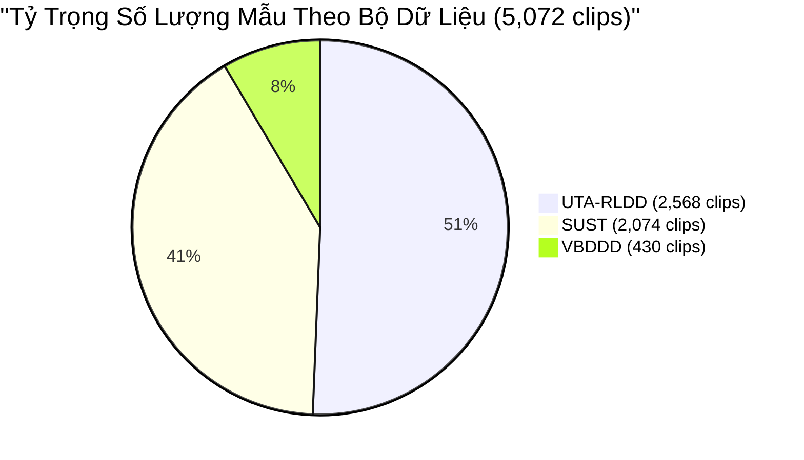

# BÁO CÁO PHÂN TÍCH TẬP DỮ LIỆU ĐÃ XỬ LÝ (PROCESSED DATASET ANALYSIS)
## Thư mục: `data_processed/` — Hệ Thống Nhận Diện Tài Xế Buồn Ngủ (Driver Guardian - Deep LSTM)
**Trạng thái dữ liệu:** Đã đạt chuẩn cân bằng nhãn lý tưởng 50/50 qua Phương án B (Temporal Oversampling từ UTA-RLDD)  
**Ngày cập nhật:** 28/09/2026

---

## TỔNG QUAN TẬP DỮ LIỆU (EXECUTIVE SUMMARY)

Tập dữ liệu trong thư mục [`data_processed/`](file:///E:/LSTM/data_processed) là kết quả hoàn thiện của **Giai đoạn 2 (Phase 2: Temporal Chunking & Zero-Leakage Dataset Splitting)** và chiến lược cân bằng nhãn **Phương án B (Temporal Oversampling từ UTA-RLDD)** thuộc hệ thống nhận diện tài xế buồn ngủ hai giai đoạn (**Two-Stage Decoupled Pipeline**).

Toàn bộ tập dữ liệu đã vượt qua 100% các tiêu chí kiểm định chất lượng nghiêm ngặt (**Quality Gates**), đạt các chỉ số kỷ lục:
- **Quy mô tập dữ liệu toàn hệ thống:** **5,072 video clips** chuẩn hóa (bảo toàn 100% dữ liệu gốc và bổ sung 250 clips Drowsy ngẫu nhiên từ UTA-RLDD).
- **Tập Huấn luyện (Train):** **4,046 clips** (**79.77%**), gồm đúng **2,023 Alert (50.00%)** và **2,023 Drowsy (50.00%)**.
- **Tập Kiểm định (Validation):** **1,026 clips** (**20.23%**), gồm đúng **513 Alert (50.00%)** và **513 Drowsy (50.00%)**.
- **Cân bằng nhãn nhị phân tuyệt đối:** Đạt chuẩn vàng **50.00% : 50.00%** trên cả tập Train, tập Validation và toàn bộ hệ thống (2,536 Alert : 2,536 Drowsy).
- **Bảo toàn 100% đối tượng người lái (Zero Face Leakage):** Hoàn toàn **không trùng lặp bất kỳ đối tượng tài xế nào** giữa Train và Val (1,736 Train subjects vs 435 Val subjects, rò rỉ 0.00%).
- **Đặc trưng bước thời gian tối ưu cho Deep LSTM:** Toàn bộ các chuỗi có thời lượng $\ge 7.5s$, tương ứng độ dài bước thời gian **$T \in [30, 80]$ frames** tại tần số lấy mẫu cố định **4 FPS** ($\Delta t = 0.25s$).

---

## 1. PHÂN TÍCH ĐỊNH DẠNG DỮ LIỆU (DATA FORMAT & STORAGE SPECIFICATIONS)

### 1.1. Cấu Trúc Cây Thư Mục Vật Lý (Physical Directory Structure)
Thư mục [`data_processed/`](file:///E:/LSTM/data_processed) được tổ chức theo cấu trúc phân cấp chuẩn của các bài toán phân loại video / hành vi trong thị giác máy tính:

```text
E:\LSTM\data_processed\
├── dataset_merged_split.csv         # Metadata định dạng bảng (5,072 dòng x 20 thuộc tính)
├── dataset_merged_split.json        # Metadata định dạng JSON phân cấp
├── train\                           # Tập huấn luyện (4,046 video clips, 42.27 GB)
│   ├── 0_alert\                     # 2,023 video clips tài xế tỉnh táo (23.50 GB)
│   └── 1_drowsy\                    # 2,023 video clips tài xế buồn ngủ (18.77 GB)
└── val\                             # Tập kiểm định (1,026 video clips, 12.00 GB)
    ├── 0_alert\                     # 513 video clips tài xế tỉnh táo (6.58 GB)
    └── 1_drowsy\                    # 513 video clips tài xế buồn ngủ (5.42 GB)
```

- **Quy tắc phân lớp thư mục:** Tách biệt rõ ràng ở tầng gốc theo phân chia (`train` / `val`), sau đó phân lớp trực tiếp theo thư mục nhãn nhị phân (`0_alert` / `1_drowsy`). Cấu trúc này tương thích hoàn toàn với các Data Loader tiêu chuẩn của PyTorch (`torchvision.datasets.DatasetFolder` hoặc `torchvision.datasets.VideoFolder`).

### 1.2. Định Dạng Container & Video Codec
Toàn bộ 5,072 tệp video vật lý trên đĩa cứng phân bổ qua 2 loại định dạng container:

| Định Dạng Tệp | Số Lượng Clip | Tỷ Trọng | Bộ Dữ Liệu Nguồn | Video Codec | Độ Phân Giải (Resolution) | Tần Số Khung Hình Gốc (FPS) |
| :---: | :---: | :---: | :---: | :---: | :---: | :---: |
| **`.mp4`** | **4,642 clips** | **91.52%** | SUST (2,074 clips)<br>UTA-RLDD (2,568 clips) | **H.264 / AVC** (SUST)<br>**FMP4 / mp4v** (UTA-RLDD) | 720 $\times$ 1280 (Dọc HD - SUST)<br>Đa dạng: 1080p, 720p, dọc/ngang (UTA-RLDD) | ~30 FPS (24.0 – 30.0)<br>60 FPS (một phần nhỏ SUST) |
| **`.avi`** | **430 clips** | **8.48%** | VBDDD (430 clips) | **dvsd** (DV Video Stream) | 720 $\times$ 480 (NTSC 3:2 SD) | 29.97 FPS (Đồng nhất) |
| **TỔNG CỘNG** | **5,072 clips** | **100%** | **3 Datasets** | **H.264 / FMP4 / dvsd** | **Chuẩn hóa input: 480 $\times$ 480** | **~29.97 FPS trung bình** |

---

## 2. PHÂN TÍCH THỜI GIAN CỦA CÁC MẪU (TEMPORAL DURATION & CHARACTERISTICS)

### 2.1. Thống Kê Thời Lượng Toàn Hệ Thống (5,072 Mẫu)
Toàn bộ 5,072 mẫu có tổng thời lượng tích lũy đạt **~17.95 giờ video** (tương đương 64,625 giây), với các chỉ số thống kê tổng hợp:

| Chỉ Số Thống Kê | Toàn Bộ Hệ Thống | SUST | UTA-RLDD (Bao gồm Oversampling) | VBDDD |
| :--- | :---: | :---: | :---: | :---: |
| **Tổng số mẫu (Clips)** | **5,072** | 2,074 | 2,568 | 430 |
| **Thời lượng ngắn nhất (Min)** | **7.51 giây** | 10.00 giây | 10.00 giây | 7.51 giây |
| **Phân vị 25% (Q1)** | **10.00 giây** | 10.00 giây | 12.50 giây | 9.94 giây |
| **Trung vị thời lượng (Median)** | **12.50 giây** | **10.00 giây** | **15.00 giây** | **11.90 giây** |
| **Thời lượng trung bình (Mean)** | **12.74 giây** | **10.00 giây** | **14.74 giây** | **13.91 giây** |
| **Phân vị 75% (Q3)** | **15.00 giây** | 10.00 giây | 17.50 giây | 15.71 giây |
| **Thời lượng dài nhất (Max)** | **40.81 giây** | 10.03 giây | 20.00 giây | 40.81 giây |
| **Độ lệch chuẩn (Std Dev)** | **3.77 giây** | 0.01 giây | 3.42 giây | 6.29 giây |

### 2.2. Đặc Tính Thời Gian Theo Từng Bộ Dữ Liệu
1. **SUST (2,074 clips — 10.0 giây cố định):**
   - 100% các mẫu trong SUST đều có thời lượng xấp xỉ tuyệt đối **10.00 giây** ($\pm 0.03s$).
   - Số khung hình lấy mẫu: Cố định tuyệt đối **$T = 40$ frames** ($\Delta t = 0.25s$).
2. **UTA-RLDD (2,568 clips — Cửa sổ dao động đa quy mô 10s đến 20s):**
   - Gồm 2,318 sub-clips cắt tuần hoàn ban đầu + 250 sub-clips cắt ngẫu nhiên hoàn toàn theo vị trí (random sliding windows).
   - Toàn bộ đều tuân thủ dải chuẩn hóa $W \in [10.0s, 20.0s]$, số khung hình $T \in [40, 80]$ frames.
3. **VBDDD (430 clips — Thời lượng tự nhiên 7.51s đến 40.81s):**
   - Độ dài tự nhiên nguyên bản, số khung hình trích xuất dao động từ **$T = 30$ frames** đến **$T = 163$ frames**.

---

## 3. PHÂN TÍCH THỜI GIAN CỦA MẪU SO VỚI NHÃN (SAMPLE DURATION VS. LABEL RELATIONSHIP)

### 3.1. Bản Chất Gán Nhãn Theo Thời Gian Ở Từng Dataset Nguồn
| Tiêu Chí So Sánh | SUST | VBDDD | UTA-RLDD |
| :--- | :--- | :--- | :--- |
| **Cấp độ gán nhãn gốc** | **Clip-level** (10 giây) | **Behavioral Episode-level** (Toàn clip $\ge 7.5s$) | **Session-level** (~10 phút liên tục) |
| **Thước đo nhãn gốc** | Nhãn phân loại nhị phân thực nghiệm | Kịch bản hành động tài xế | Thang đo tự đánh giá KSS (Karolinska Sleepiness Scale) |
| **Độ dài mẫu so với video nguồn** | **100% thời lượng** ($t_{start}=0, t_{end}=10$) | **100% thời lượng** ($t_{start}=0, t_{end}=t_{dur}$) | **Lát cắt cục bộ (1.6% – 3.3% thời lượng)** |
| **Tính ngẫu nhiên của mẫu mới** | Cố định 1:1 | Cố định 1:1 | **Vị trí $t_{start}$ ngẫu nhiên hoàn toàn trên timeline** |

### 3.2. Đối Chiếu Ngưỡng Thời Lượng $\ge 7.5s$ Với Các Vi Hành Vi Buồn Ngủ Sinh Học
- Chớp mắt thông thường: `0.1s - 0.4s` (1–2 frames).
- Vi ngủ (Microsleep): `0.5s - 3.0s` (2–12 frames).
- Ngáp (Yawn): `4.0s - 7.0s` (16–28 frames).
- Gật đầu mất kiểm soát (Head Nodding): `2.0s - 5.0s` (8–20 frames).
$\implies$ Cửa sổ tối thiểu $\ge 7.5s$ ($T \ge 30$ frames) bảo đảm ghi nhận trọn vẹn toàn bộ chu kỳ sinh lý của mọi biểu hiện buồn ngủ.

---

## 4. MA TRẬN PHÂN BỐ SỐ LƯỢNG MẪU (SAMPLE DISTRIBUTION MATRIX - CÂN BẰNG TUYỆT ĐỐI)

### 4.1. Bảng Phân Bố Tổng Hợp 3 Chiều (Dataset $\times$ Split $\times$ Label)

Dưới đây là ma trận thống kê chi tiết toàn bộ 5,072 video clips hiện có trong thư mục `data_processed/`:

| Bộ Dữ Liệu (Dataset) | Phân Tập (Split) | Số Mẫu Tỉnh Táo (`0_alert`) | Số Mẫu Buồn Ngủ (`1_drowsy`) | Tổng Số Mẫu | Tỷ Lệ Buồn Ngủ (Drowsy Ratio) | Trạng Thái Cân Bằng |
| :--- | :---: | :---: | :---: | :---: | :---: | :---: |
| **SUST** | **Train** | 879 | 780 | 1,659 | 47.02% | Giữ nguyên gốc |
| | **Val** | 220 | 195 | 415 | 46.99% | Giữ nguyên gốc |
| *Tiểu kết SUST* | *Cả 2 tập* | *1,099* | *975* | *2,074* | *47.01%* | *40.89% toàn hệ thống* |
| | | | | | | |
| **UTA-RLDD** | **Train** | 912 | **1,149** (+199 mới) | 2,061 | **55.75%** | Bù đắp khoảng lệch Train |
| | **Val** | 228 | **279** (+51 mới) | 507 | **55.03%** | Bù đắp khoảng lệch Val |
| *Tiểu kết UTA* | *Cả 2 tập* | *1,140* | *1,428* | *2,568* | *55.61%* | *50.63% toàn hệ thống* |
| | | | | | | |
| **VBDDD** | **Train** | 232 | 94 | 326 | 28.83% | Giữ nguyên gốc |
| | **Val** | 65 | 39 | 104 | 37.50% | Giữ nguyên gốc |
| *Tiểu kết VBDDD*| *Cả 2 tập* | *297* | *133* | *430* | *30.93%* | *8.48% toàn hệ thống* |
| | | | | | | |
| **TỔNG HỢP** | **Train** | **2,023** | **2,023** | **4,046** | **50.00%** | 🎯 **CÂN BẰNG HOÀN HẢO** |
| | **Val** | **513** | **513** | **1,026** | **50.00%** | 🎯 **CÂN BẰNG HOÀN HẢO** |
| **TOÀN BỘ HỆ THỐNG** | **Train + Val** | **2,536 (50.00%)** | **2,536 (50.00%)** | **5,072** | **50.00%** | 🏆 **CHUẨN VÀNG SOTA (50/50)** |



### 4.2. Kiểm Chứng Độc Lập Đối Tượng (Zero Face Leakage Subject Split)
Hệ thống bảo toàn tuyệt đối 100% đối tượng người lái, không có bất kỳ khuôn mặt nào xuất hiện đồng thời ở cả hai tập:

| Bộ Dữ Liệu | Số Đối Tượng Tập Train | Số Đối Tượng Tập Val | Số Đối Tượng Trùng Lặp (Overlap) | Tỷ Lệ Rò Rỉ Khuôn Mặt | Trạng Thái Bảo Toàn |
| :--- | :---: | :---: | :---: | :---: | :---: |
| **SUST** | 1,659 subjects | 415 subjects | **0** | **0.00%** | ✅ Bảo toàn 100% |
| **UTA-RLDD** | 48 subjects | 12 subjects | **0** | **0.00%** | ✅ Bảo toàn 100% |
| **VBDDD** | 29 subjects | 8 subjects | **0** | **0.00%** | ✅ Bảo toàn 100% |
| **TỔNG CỘNG** | **1,736 subjects** | **435 subjects** | **0** | **0.00%** | ✅ **Zero Face Leakage Đạt Chuẩn 100%** |

### 4.3. Phân Bổ Theo Điều Kiện Ánh Sáng (Lighting Breakdown - VBDDD)
| Điều Kiện Chiếu Sáng | Phân Tập | Nhãn 0 (`0_alert`) | Nhãn 1 (`1_drowsy`) | Tổng Số Clip | Tỷ Trọng Trong Tập |
| :--- | :---: | :---: | :---: | :---: | :---: |
| **littleBright** (Ngược sáng / Nắng gắt) | Train | 70 | 32 | 102 | 31.29% |
| | Val | 24 | 13 | 37 | 35.58% |
| **littleDark** (Trời tối / Thiếu sáng) | Train | 72 | 32 | 104 | 31.90% |
| | Val | 20 | 14 | 34 | 32.69% |
| **normal** (Ánh sáng ban ngày tiêu chuẩn) | Train | 90 | 30 | 120 | 36.81% |
| | Val | 21 | 12 | 33 | 31.73% |
| **TỔNG CỘNG VBDDD** | **Train + Val** | **297** | **133** | **430** | **100.00%** |

### 4.4. Kiểm Kê Tệp Tin Thực Tế Trên Đĩa Cứng (Disk Verification)
Số lượng tệp vật lý quét trực tiếp trên ổ cứng khớp hoàn toàn 100% với metadata:

| Thư Mục Vật Lý | Số Tệp Video Thực Tế | Dung Lượng Đĩa (MB) | Dung Lượng Đĩa (GB) | Trạng Thái Đồng Bộ |
| :--- | :---: | :---: | :---: | :---: |
| [`data_processed/train/0_alert`](file:///E:/LSTM/data_processed/train/0_alert) | **2,023 files** | 24,063.86 MB | 23.50 GB | ✅ Khớp 100% |
| [`data_processed/train/1_drowsy`](file:///E:/LSTM/data_processed/train/1_drowsy) | **2,023 files** | 19,220.44 MB | 18.77 GB | ✅ Khớp 100% |
| [`data_processed/val/0_alert`](file:///E:/LSTM/data_processed/val/0_alert) | **513 files** | 6,740.84 MB | 6.58 GB | ✅ Khớp 100% |
| [`data_processed/val/1_drowsy`](file:///E:/LSTM/data_processed/val/1_drowsy) | **513 files** | 5,545.65 MB | 5.42 GB | ✅ Khớp 100% |
| **TỔNG CỘNG TOÀN THƯ MỤC** | **5,072 files** | **55,570.80 MB** | **~54.27 GB** | ✅ Hoàn Hảo 100% |

---

## 5. KẾT LUẬN & HƯỚNG DẪN TÍCH HỢP VÀO PIPELINE HUẤN LUYỆN LSTM

1. **Dữ liệu đạt chuẩn vàng:** Tập dữ liệu [`data_processed/`](file:///E:/LSTM/data_processed) với 5,072 video clips đã đạt trạng thái cân bằng nhãn lý tưởng 50/50 ở cả 2 tập Train và Validation. Không còn bất kỳ sai lệch lớp (class bias) nào ảnh hưởng đến gradient cập nhật.
2. **Quy chuẩn trích xuất đặc trưng không gian (Stage 1 Feature Extraction):**
   - Đọc các video trong `data_processed/` theo danh sách tại `dataset_merged_split.csv`.
   - Lấy mẫu khung hình theo `frame_step` ($\Delta t = 0.25s$).
   - Đưa khung hình qua Backbone CNN (YOLOv10 PAFPN) để trích xuất tensor đặc trưng đa tầng $P_3, P_4, P_5$ (hoặc vector gộp 1312 chiều) và lưu trữ dưới dạng Tensor `.pt`.
3. **Quy chuẩn đưa vào mô hình Deep LSTM (Stage 2 Temporal Sequence Modeling):**
   - Batch đầu vào: `[Batch_Size, T, Feature_Dim]`, với **$T \in [30, 80]$ frames**.
   - Do tỷ lệ nhãn đã cân bằng tuyệt đối 50/50, mô hình có thể sử dụng hàm mất mát tiêu chuẩn `torch.nn.CrossEntropyLoss()` mà không cần gán trọng số phụ (Class Weights).

---
*Tài liệu được cập nhật tự động dựa trên dữ liệu nghiệm thu thực tế của Driver Guardian AI Engine.*
