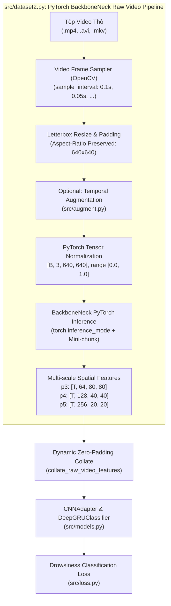

# BÁO CÁO PHÂN TÍCH YÊU CẦU: XÂY DỰNG DATASET NẠP VIDEO THÔ & TRÍCH XUẤT ĐẶC TRƯNG PYTORCH BACKBONENECK TRỰC TIẾP

**Mã tài liệu:** `analsys_raw_video_backboneneck_dataset.md`  
**Dự án:** Hệ Thống Nhận Diện Tài Xế Buồn Ngủ (Driver Guardian - Deep GRU / LSTM)  
**Tệp mục tiêu:** [`src/dataset2.py`](file:///D:/Project/DATN/driver-guardian/ai/LSTM/src/dataset2.py)  
**Mô hình trích xuất nguồn:** Lớp `BackboneNeck` trong [`D:\Project\DATN\driver-guardian\ai\ObjectDetection_2p6M\runtime\convertor.py`](file:///D:/Project/DATN/driver-guardian/ai/ObjectDetection_2p6M/runtime/convertor.py)  
**Mô hình hạ tầng tiếp nhận:** [`src/models.py`](file:///D:/Project/DATN/driver-guardian/ai/LSTM/src/models.py) (`CNNAdapter`, `DeepGRUClassifier`)  
**Ngày thực hiện:** 04/10/2026  
**Quy chuẩn áp dụng:** [`AGENTS.md`](file:///D:/Project/DATN/driver-guardian/ai/LSTM/AGENTS.md) — Bước 1: Khảo sát & Phân tích (Discovery)  

---

## 1. TỔNG QUAN & MỤC TIÊU NHIỆM VỤ (EXECUTIVE SUMMARY)

### 1.1. Yêu cầu của người dùng
Người dùng yêu cầu tạo tệp [`src/dataset2.py`](file:///D:/Project/DATN/driver-guardian/ai/LSTM/src/dataset2.py) với các mục tiêu cốt lõi:
1. **Nạp trực tiếp tập dữ liệu từ video thô (Raw Video Direct Loading):** Đọc trực tiếp các tệp video (`.mp4`, `.avi`, `.mkv`, `.mov`) từ cấu trúc thư mục dataset hoặc tệp manifest (CSV/JSON) mà không phụ thuộc vào các tệp trích xuất trung gian (`.h5` hay `.pt`).
2. **Trích xuất đặc trưng trực tiếp qua mô hình PyTorch `BackboneNeck`:** Tích hợp mô hình PyTorch `BackboneNeck` được định nghĩa trong [`D:\Project\DATN\driver-guardian\ai\ObjectDetection_2p6M\runtime\convertor.py`](file:///D:/Project/DATN/driver-guardian/ai/ObjectDetection_2p6M/runtime/convertor.py) để trích xuất trực tiếp các bản đồ đặc trưng không gian đa tỷ lệ (`p3`, `p4`, `p5`) từ từng khung hình video theo luồng thời gian thực.
3. **Thời gian lấy mẫu tùy chỉnh (Customizable Sampling Interval):** Cung cấp tham số cấu hình linh hoạt chu kỳ lấy mẫu khung hình thời gian (`sample_interval`, đơn vị giây, ví dụ 0.1s ~ 10 FPS, 0.05s ~ 20 FPS, 0.2s ~ 5 FPS...) tự động thích nghi với FPS gốc của từng video.
4. **Tương thích toàn diện với luồng huấn luyện DeepGRU:** Đầu ra của Dataset và hàm gom batch (`collate_fn`) phải tương thích 100% với kiến trúc `CNNAdapter` và `DeepGRUClassifier` trong [`src/models.py`](file:///D:/Project/DATN/driver-guardian/ai/LSTM/src/models.py) thông qua tensor đặc trưng động đa kênh và tensor `seq_lens`.

---

### 1.2. So sánh Kiến trúc: 3 Biến thể Pipeline Dữ liệu trong Dự án

| Tiêu chí | Chế độ Offline HDF5 ([`src/dataset.py`](file:///D:/Project/DATN/driver-guardian/ai/LSTM/src/dataset.py)) | Chế độ Online ONNX Runtime ([`src/dataset1.py`](file:///D:/Project/DATN/driver-guardian/ai/LSTM/src/dataset1.py)) | Chế độ Online PyTorch BackboneNeck ([`src/dataset2.py`](file:///D:/Project/DATN/driver-guardian/ai/LSTM/src/dataset2.py)) |
| :--- | :--- | :--- | :--- |
| **Dữ liệu nguồn** | Tệp HDF5 `.h5` đã trích xuất sẵn | Video thô (`.mp4`, `.avi`, `.mkv`) | Video thô (`.mp4`, `.avi`, `.mkv`) |
| **Động cơ trích xuất** | Đã trích xuất trước (Offline Pre-extracted) | `onnxruntime` (`backbone_neck.onnx`) | **PyTorch Native `nn.Module` (`BackboneNeck`)** |
| **Trọng số mô hình** | Lưu trong tệp H5 | File đồ thị ONNX tĩnh (`.onnx`) | File PyTorch Checkpoint (`.pt`) có metadata |
| **Phụ thuộc bên ngoài** | Thư viện `h5py` | Thư viện `onnxruntime` / `onnxruntime-gpu` | **Chỉ cần PyTorch chuẩn (`torch`, `torchvision`), không cần runtime ONNX** |
| **Khả năng Fine-tuning** | Đóng băng 100% | Không thể lan truyền gradient ngược vào backbone | **Mở đường cho End-to-End Fine-tuning hoặc PyTorch AMP (Autocast)** |
| **Dung lượng lưu trữ đĩa** | Tốn dung lượng lớn (hàng chục GB H5) | Không tốn dung lượng đĩa phụ trội | **Không tốn dung lượng đĩa phụ trội** |
| **Cơ chế tối ưu** | Lazy H5 file handle + Dynamic padding | Lazy ORT Session per-worker + Mini-chunk | **Lazy PyTorch Model Loading + Mini-chunk Streaming Inference** |



---

## 2. KHẢO SÁT & PHÂN TÍCH KỸ THUẬT MÔ HÌNH BACKBONENECK

### 2.1. Cấu trúc và Nguồn gốc Lớp `BackboneNeck`
Theo tệp [`D:\Project\DATN\driver-guardian\ai\ObjectDetection_2p6M\runtime\convertor.py`](file:///D:/Project/DATN/driver-guardian/ai/ObjectDetection_2p6M/runtime/convertor.py):

```python
class BackboneNeck(nn.Module):
    def __init__(self, model):
        super().__init__()
        self.backbone, self.neck = model.backbone, model.neck

    def forward(self, x):
        return self.neck(*self.backbone(x))
```

- **Đầu vào $x$:** Tensor 4D `[B, 3, 640, 640]` kiểu `float32`, giá trị chuẩn hóa $[0.0, 1.0]$.
- **Thành phần Backbone:** `model.backbone(x)` trích xuất 3 mức đặc trưng không gian:
  - Cấp 3 ($c3$): Độ phân giải $80 \times 80$, 64 kênh.
  - Cấp 4 ($c4$): Độ phân giải $40 \times 40$, 128 kênh.
  - Cấp 5 ($c5$): Độ phân giải $20 \times 20$, 256 kênh.
- **Thành phần Neck:** `model.neck(c3, c4, c5)` là mạng PAFPN (Path Aggregation Feature Pyramid Network) dung hợp đặc trưng từ trên xuống (top-down) và từ dưới lên (bottom-up), sinh ra bộ 3 tensor đa tỷ lệ:
  - `p3`: `[B, 64, 80, 80]`
  - `p4`: `[B, 128, 40, 40]`
  - `p5`: `[B, 256, 20, 20]`

### 2.2. Cơ chế Khởi tạo & Tải Trọng số từ Checkpoint PyTorch
Quy trình nạp mô hình từ tệp checkpoint `.pt` được thực hiện như sau:
1. Đọc tệp checkpoint qua `torch.load(checkpoint_path, map_location="cpu", weights_only=True)`.
2. Kiểm tra siêu dữ liệu metadata qua hàm `validate_metadata(checkpoint_path, checkpoint)` trong `ai.ObjectDetection_2p6M.utils.artifacts`. Nếu checkpoint không chứa metadata chuẩn (ví dụ khi người dùng truyền model checkpoint tùy biến), cung cấp cơ chế dự phòng an toàn (fallback) nạp cấu hình mặc định tương thích `NMSFreeDetector`.
3. Khởi tạo đối tượng `NMSFreeDetector(**architecture_params, img_size=640)`.
4. Nạp trọng số từ khóa `ema` (nếu có) hoặc `model`:
   ```python
   state_dict = checkpoint.get("ema") or checkpoint.get("model") or checkpoint
   model.load_state_dict(state_dict)
   ```
5. Đóng gói vào lớp `BackboneNeck(model).eval()` và đóng băng gradient (`requires_grad = False`) cho toàn bộ tham số khi sử dụng làm bộ trích xuất đặc trưng thuần túy (Feature Extractor).

### 2.3. Đường dẫn Checkpoint Mặc định
Trong hệ thống hiện hữu, checkpoint finetune tốt nhất đã được huấn luyện sẵn nằm tại:
`D:\Project\DATN\driver-guardian\ai\ObjectDetection_2p6M\checkpoints\2bfb6cc36ef5ab822a944006c746e5d348d67e387501c9027df5b957cf124031\de0c5b23e1ae749b972f10cb5f3e21e2ccf37bd334eb7a7c3091c460073ff310\finetune\best.pt`

---

## 3. CÁC THÁCH THỨC KỸ THUẬT TRỌNG YẾU & PHƯƠNG ÁN GIẢI QUYẾT

### 3.1. Thách thức 1: Đụng độ CUDA Context và Serialization trong PyTorch DataLoader (CRITICAL)
- **Bản chất vấn đề:**
  - Trên hệ điều hành Windows, PyTorch đa tiến trình (`DataLoader` với `num_workers > 0`) sử dụng chế độ tạo tiến trình `spawn`.
  - Nếu mô hình PyTorch `BackboneNeck` được đưa lên GPU (`cuda`) ngay trong hàm `__init__` của `Dataset` ở tiến trình chính (main process), khi DataLoader phân nhánh (spawn) các worker con, việc serialize/deserialize CUDA context sẽ gây ra lỗi nghiêm trọng:
    `RuntimeError: Cannot re-initialize CUDA in forked/spawned subprocess. To use CUDA with multiprocessing, you must use the 'spawn' start method and initialize CUDA inside the worker process.`
  - Hơn nữa, nếu có $N$ worker cùng giữ một bản sao mô hình trên GPU, bộ nhớ VRAM sẽ bị chiếm dụng gấp $N$ lần, dễ dẫn đến hiện tượng Out-Of-Memory (OOM).
- **Giải pháp thiết kế:**
  1. **Lazy Loading theo Tiến trình (Process-safe Lazy Instantiation):**
     - Trong `__init__`, chỉ lưu trữ các tham số cấu hình: `checkpoint_path`, `device`, `device_id`, `chunk_size`, `use_fp16`, `img_size`.
     - Chỉ khởi tạo và nạp mô hình vào GPU/CPU bên trong phương thức nội bộ `_get_extractor()` khi worker thực sự gọi `__getitem__` lần đầu tiên.
  2. **Cấu hình Thực thi Đa năng:**
     - **Chế độ khuyến nghị khi chạy GPU:** Đặt `num_workers = 0` (chạy trên luồng chính). GPU tận dụng 100% băng thông mà không tốn chi phí IPC truyền tensor lớn giữa các tiến trình con.
     - **Chế độ CPU Workers:** Cho phép cấu hình `device="cpu"` trong Dataset để các worker con trích xuất đặc trưng trên CPU, giải phóng 100% VRAM GPU cho luồng huấn luyện DeepGRU.
     - **Chế độ Tự động (`device="auto"`):** Tự động chuyển về GPU nếu khả dụng và `num_workers == 0`, hoặc fallback về CPU an toàn.

### 3.2. Thách thức 2: Quản lý VRAM khi Suy luận Video Dài (Mini-Chunk Streaming)
- **Bản chất vấn đề:**
  - Một video clip thời lượng 10-30 giây có thể chứa $T = 100 - 300$ khung hình sau khi lấy mẫu.
  - Nếu gom toàn bộ $T$ khung hình thành một tensor duy nhất `[T, 3, 640, 640]` đưa vào mô hình qua forward pass, bộ nhớ kích hoạt (activation memory) và các bản đồ đặc trưng trung gian của Backbone & PAFPN sẽ gây tràn bộ nhớ VRAM (OOM).
- **Giải pháp thiết kế:**
  - Áp dụng kỹ thuật **Mini-Chunk Streaming Inference**: Cắt lát chuỗi khung hình theo từng đoạn nhỏ (mặc định `chunk_size = 16`).
  - Sử dụng ngữ cảnh suy luận tối ưu nhất của PyTorch: `with torch.inference_mode():` (loại bỏ hoàn toàn tính toán đồ thị autograd, nhanh hơn và tiết kiệm RAM hơn `torch.no_grad()`).
  - Hỗ trợ Mixed Precision / FP16 (`torch.amp.autocast('cuda')` hoặc cast về `float16`) giúp giảm một nửa dung lượng VRAM khi chạy trên GPU hiện đại có Tensor Cores.
  - Nối các chunk kết quả lại dọc theo trục thời gian $T$.

### 3.3. Thách thức 3: Tần số Lấy mẫu Khung hình Thời gian (Customizable Temporal Sampling)
- **Bản chất vấn đề:** Các video thu thập từ nhiều nguồn (SUST, UTA-RLDD, DROWSY, webcam) có FPS gốc rất khác nhau ($15, 25, 30, 60 \text{ FPS}$).
- **Giải pháp thiết kế:**
  - Tham số cấu hình `sample_interval` (đơn vị: giây, mặc định `0.1s` tương ứng $10 \text{ FPS}$).
  - Tự động tính bước nhảy khung hình:
    $$\text{step} = \max\left(1, \text{round}(\text{fps} \times \text{sample\_interval})\right)$$
  - Sử dụng thuật toán `letterbox` giữ nguyên tỷ lệ khung hình thực tế, padding viền xám $(114, 114, 114)$ chuẩn 640x640, tránh làm méo biến dạng mắt và miệng tài xế.

### 3.4. Thách thức 4: Tương thích Hoàn hảo với Kiến trúc Mô hình DeepGRU & CNNAdapter
- **Bản chất vấn đề:**
  - Mô hình `CNNAdapter` trong [`src/models.py`](file:///D:/Project/DATN/driver-guardian/ai/LSTM/src/models.py) nhận đầu vào là bộ 3 tensor `(p3, p4, p5)`.
  - Độ dài thời gian $T$ của các video là không cố định.
- **Giải pháp thiết kế:**
  - Hàm `collate_raw_video_features` thực hiện Zero-Padding dọc theo trục thời gian về $T_{\max} = \max_i(T_i)$ cho từng batch.
  - Sinh ra tensor `seq_lens` $[B]$ ghi nhận độ dài thực tế của từng mẫu video để các khối `TemporalAttentionPooling` trong `src/models.py` tạo attention mask chính xác, triệt tiêu hoàn toàn ảnh hưởng của các frame zero-padding.

---

## 4. THIẾT KẾ CẤU TRÚC MÃ NGUỒN `src/dataset2.py`

Tệp [`src/dataset2.py`](file:///D:/Project/DATN/driver-guardian/ai/LSTM/src/dataset2.py) sẽ được thiết kế mô-đun hóa, sạch sẽ theo đúng quy chuẩn Python Script trong [`AGENTS.md`](file:///D:/Project/DATN/driver-guardian/ai/LSTM/AGENTS.md):

```text
src/dataset2.py
│
├── 1. Imports, Setup & Multi-platform Environment
│   ├── UTF-8 stdout/stderr handling cho Windows
│   └── Sys.path configuration cho phép import ai.ObjectDetection_2p6M
│
├── 2. Data Structures & Helper Classes
│   ├── RawVideoSample (dataclass lưu thông tin mẫu: path, video_id, split, label, fps, duration)
│   └── letterbox() (Hàm căn chỉnh kích thước ảnh giữ nguyên tỷ lệ aspect ratio 640x640)
│
├── 3. PyTorch BackboneNeck Feature Extractor Engine
│   └── PyTorchBackboneNeckExtractor
│       ├── __init__(checkpoint_path, device, device_id, chunk_size, use_fp16, img_size)
│       ├── _load_model() (Nạp checkpoint, xác thực metadata, nạp NMSFreeDetector và BackboneNeck)
│       ├── extract_chunks(frames_rgb) -> (p3, p4, p5) (Suy luận theo mini-chunk với torch.inference_mode)
│       └── close() / to(device)
│
├── 4. PyTorch Dataset Implementation
│   └── RawVideoBackboneNeckDataset(Dataset)
│       ├── __init__(dataset_dir, split, sample_interval, seq_len, checkpoint_path, ...)
│       ├── _discover_samples() (Quét thư mục phân tầng hoặc đọc tệp manifest CSV/JSON)
│       ├── _sample_video_frames(video_path) -> (frames_rgb, fps, duration)
│       ├── __len__()
│       └── __getitem__(idx) -> ((p3, p4, p5), label, seq_len, meta)
│
├── 5. Collate Function & DataLoader Factory
│   ├── collate_raw_video_features(batch) -> ((b_p3, b_p4, b_p5), b_lbl, b_len, b_meta)
│   └── build_raw_video_dataloaders(dataset_dir, checkpoint_path, batch_size, ...)
│
└── 6. Verification & Self-Contained Unit Tests (if __name__ == "__main__")
    ├── Test 1: Tạo mock video đa tần số FPS qua cv2.VideoWriter
    ├── Test 2: Kiểm thử giải mã & lấy mẫu khung hình theo sample_interval
    ├── Test 3: Nạp mô hình PyTorch BackboneNeck & trích xuất đặc trưng (p3, p4, p5)
    ├── Test 4: Gom batch động (collate_fn) với Zero-Padding & Seq Lens
    ├── Test 5: Forward & Backward pass End-to-End với CNNAdapter + DeepGRUClassifier
    └── Tự động dọn dẹp thư mục mock tạm
```

---

## 5. KẾ HOẠCH KIỂM THỬ & TIÊU CHÍ NGHIỆM THU

### 5.1. Kịch bản Kiểm thử Tự động (Self-Contained Test Suite)
Được nhúng trực tiếp trong khối `if __name__ == "__main__":` của [`src/dataset2.py`](file:///D:/Project/DATN/driver-guardian/ai/LSTM/src/dataset2.py):
1. **Kiểm tra tính đúng đắn khi nạp mô hình:** Nạp thành công mô hình `BackboneNeck` từ checkpoint finetune thực tế `best.pt`.
2. **Kiểm tra định dạng và kích thước tensor đầu ra:**
   - `p3`: `[T, 64, 80, 80]`
   - `p4`: `[T, 128, 40, 40]`
   - `p5`: `[T, 256, 20, 20]`
3. **Kiểm tra cơ chế Dynamic Zero-Padding Collate:** Gom 2 mẫu video có $T_1 \ne T_2$, kiểm tra shape batch đạt `[2, T_max, C, H, W]` và padding bằng 0.
4. **Kiểm tra End-to-End Training Flow:** Chạy thử forward và backward pass với mô hình phân loại buồn ngủ (`CNNAdapter` và `DeepGRUClassifier`), bảo đảm tính toàn vẹn của đồ thị lan truyền gradient.

### 5.2. Tiêu chuẩn Tuân thủ Checklist Chất lượng (AGENTS.md)
- [x] Sử dụng `pathlib.Path` cho toàn bộ xử lý đường dẫn, bảo đảm tương thích Windows và Linux.
- [x] Sử dụng Type Hints và Google Style Docstrings chuẩn mực.
- [x] Áp dụng Lazy Initialization an toàn tuyệt đối với multiprocessing trong PyTorch DataLoader.
- [x] Xử lý ngoại lệ đầy đủ khi mở video, tải checkpoint và giải phóng bộ nhớ GPU.
- [x] Không lưu trữ rác, tự động giải phóng tài nguyên sau khi kiểm thử.

---

## 6. KẾT LUẬN & ĐỀ XUẤT TIẾP THEO

Báo cáo phân tích đã làm rõ toàn bộ yêu cầu, sự khác biệt kiến trúc giữa mô hình ONNX và PyTorch BackboneNeck, cũng như các giải pháp tối ưu hóa bộ nhớ và đa tiến trình cho tệp [`src/dataset2.py`](file:///D:/Project/DATN/driver-guardian/ai/LSTM/src/dataset2.py).

> [!IMPORTANT]
> **Yêu cầu phê duyệt từ Người dùng (User Approval):**  
> Theo quy chuẩn làm việc tại **Mục 5 của [`AGENTS.md`](file:///D:/Project/DATN/driver-guardian/ai/LSTM/AGENTS.md)**:
> - **Bước 1 (Discovery):** Hoàn thành tài liệu phân tích [`docs/analsys/analsys_raw_video_backboneneck_dataset.md`](file:///D:/Project/DATN/driver-guardian/ai/LSTM/docs/analsys/analsys_raw_video_backboneneck_dataset.md).
> - **Bước 2 (Planning):** Chỉ được thực hiện tạo `docs/plan/plan_raw_video_backboneneck_dataset.md` khi người dùng đã xem xét và đồng ý với nội dung phân tích này.
>
> Kính mời bạn xem xét bản phân tích trên. Nếu bạn đồng ý, tôi sẽ tiến hành **Bước 2: Lập kế hoạch chi tiết (`docs/plan/plan_raw_video_backboneneck_dataset.md`)**.
