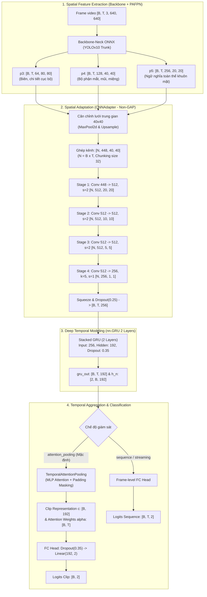

# BÁO CÁO KHẢO SÁT & PHÂN TÍCH ĐẶC TẢ: MÔ HÌNH DEEPGRUCLASSIFIER VÀ CÁC KHỐI LIÊN QUAN

**Mã tài liệu:** `analsys_deepgru_spec.md`  
**Dự án:** Hệ Thống Giám Sát và Cảnh Báo Tài Xế Buồn Ngủ (Driver Guardian)  
**Tệp mục tiêu:** [`src/models.py`](file:///D:/Project/DATN/driver-guardian/ai/LSTM/src/models.py)  
**Các khối cấu thành:** [`CNNAdapter`](file:///D:/Project/DATN/driver-guardian/ai/LSTM/src/models.py#L9-L269), [`TemporalAttentionPooling`](file:///D:/Project/DATN/driver-guardian/ai/LSTM/src/models.py#L270-L308), [`DeepGRUClassifier`](file:///D:/Project/DATN/driver-guardian/ai/LSTM/src/models.py#L309-L457)  
**Tệp liên quan:** [`configs/config.py`](file:///D:/Project/DATN/driver-guardian/ai/LSTM/configs/config.py), [`src/dataset.py`](file:///D:/Project/DATN/driver-guardian/ai/LSTM/src/dataset.py), [`src/train.py`](file:///D:/Project/DATN/driver-guardian/ai/LSTM/src/train.py), [`src/loss.py`](file:///D:/Project/DATN/driver-guardian/ai/LSTM/src/loss.py)  
**Quy chuẩn áp dụng:** [`AGENTS.md`](file:///D:/Project/DATN/driver-guardian/ai/LSTM/AGENTS.md) — Bước 1: Khảo sát & Phân tích (Discovery)  
**Ngày thực hiện:** 03/10/2026  

---

## 1. MỤC TIÊU VÀ PHẠM VI KHẢO SÁT

### 1.1. Mục tiêu khảo sát
Mục tiêu của nhiệm vụ là phân tích và xây dựng **Tài liệu Đặc tả Kỹ thuật (Technical Specification Document)** toàn diện, chi tiết và chuẩn hóa cho mô hình học sâu `DeepGRUClassifier` cùng toàn bộ các khối kiến trúc bổ trợ trong [`src/models.py`](file:///D:/Project/DATN/driver-guardian/ai/LSTM/src/models.py).

Tài liệu đặc tả này sẽ đóng vai trò là "Single Source of Truth" (chuẩn kỹ thuật duy nhất) phục vụ:
1. **R&D & Training Pipeline:** Đảm bảo tính nhất quán về kích thước tensor, luồng truyền dữ liệu, hàm mất mát và tối ưu hóa giữa quá trình trích xuất đặc trưng và huấn luyện mô hình.
2. **Quality Assurance & Verification:** Cung cấp thông số chuẩn về số lượng tham số, FLOPs, độ phức tạp tính toán và các ca kiểm thử biên (edge cases).
3. **Deployment & Edge Optimization:** Chuẩn bị đặc tả I/O, dynamic axes, kiểu dữ liệu (FP32/FP16) để xuất khẩu mô hình sang ONNX, TensorRT trên thiết bị nhúng (Nvidia Jetson / Edge AI).

---

## 2. VỊ TRÍ HỆ THỐNG VÀ KIẾN TRÚC TỔNG THỂ

Trong kiến trúc tổng thể của Driver Guardian, bài toán phát hiện buồn ngủ đòi hỏi xử lý đồng thời hai chiều thông tin:
1. **Không gian (Spatial):** Nhận diện các trạng thái tinh tế trên khuôn mặt (mức độ khép mi mắt, chuyển động vành môi ngáp, tư thế đầu nghiêng ngả).
2. **Thời gian (Temporal):** Mô hình hóa động học diễn biến theo chuỗi $T = 120$ khung hình (12 giây ở 10 FPS), phân biệt giữa một cái chớp mắt sinh lý tự nhiên (0.2 - 0.4s) và một cơn buồn ngủ nguy hiểm (nhắm mắt $\ge 1.5$s, ngáp liên tục, gật đầu).

---

## 3. KHẢO SÁT VÀ PHÂN TÍCH CHI TIẾT CÁC KHỐI

### 3.1. Khối 1: `CNNAdapter` (Spatial Feature Adapter)
- **Tập tin:** [`src/models.py` (dòng 9 - 269)](file:///D:/Project/DATN/driver-guardian/ai/LSTM/src/models.py#L9-L269)
- **Vai trò:** Hợp nhất đặc trưng không gian đa tỷ lệ từ 3 tầng PAFPN ($p_3, p_4, p_5$) thành vector đặc trưng cô đọng $x_t \in \mathbb{R}^{256}$ cho từng khung hình.

#### A. Triết lý thiết kế cốt lõi (Non-GAP Paradigm)
- **Vấn đề của Global Average Pooling (GAP):** Trong bài toán nhận diện khuôn mặt và hành vi buồn ngủ, việc áp dụng GAP sẽ tính trung bình toàn bộ không gian $H \times W$, làm triệt tiêu hoàn toàn tọa độ và tương quan tương đối giữa hai mắt, mí mắt và khuôn miệng.
- **Giải pháp:** Sử dụng **Phễu tích chập phân tầng (`hierarchical_conv_pyramid`)** với bước trượt `stride=2` để mô hình tự học tương quan từ chi tiết cục bộ (mí mắt) $\to$ tương quan vùng (mắt - mũi - miệng) $\to$ toàn thể cấu trúc khuôn mặt và góc nghiêng đầu. Tầng cuối cùng sử dụng tích chập học được với kernel $5 \times 5$ (thay vì pooling) để gom tụ về $1 \times 1$.

#### B. Cấu trúc các tầng con (Sub-layers)
1. **Căn chỉnh không gian (`_align_spatial_features`):**
   - $p_3$ ($80 \times 80$) $\xrightarrow{\text{MaxPool2d}(k=2, s=2)}$ $40 \times 40$ (64 kênh).
   - $p_4$ ($40 \times 40$) giữ nguyên kích thước (128 kênh).
   - $p_5$ ($20 \times 20$) $\xrightarrow{\text{Bilinear Upsample}(\text{scale}=2)}$ $40 \times 40$ (256 kênh).
   - Ghép nối kênh: $64 + 128 + 256 = 448$ kênh tại kích thước không gian $40 \times 40$.
2. **Phễu tích chập phân tầng 4 giai đoạn:**
   - **Stage 1:** `Conv2d(448, 512, k=3, s=2, p=1)` $\to$ `BatchNorm2d(512)` $\to$ `SiLU` $\to [N, 512, 20, 20]$.
   - **Stage 2:** `Conv2d(512, 512, k=3, s=2, p=1)` $\to$ `BatchNorm2d(512)` $\to$ `SiLU` $\to [N, 512, 10, 10]$.
   - **Stage 3:** `Conv2d(512, 512, k=3, s=2, p=1)` $\to$ `BatchNorm2d(512)` $\to$ `SiLU` $\to [N, 512, 5, 5]$.
   - **Stage 4:** `Conv2d(512, 256, k=5, s=1, p=0)` $\to$ `BatchNorm2d(256)` $\to$ `SiLU` $\to [N, 256, 1, 1]$.
   - Squeeze: $[N, 256, 1, 1] \to [N, 256]$.
3. **Cơ chế Chunking chống tràn VRAM:**
   - Khi xử lý chuỗi video 5D với $N = B \times T$ (ví dụ $B=8, T=120 \Rightarrow N=960$ frames), việc forward đồng thời sẽ làm bùng nổ VRAM ($> 4\text{GB}$).
   - `CNNAdapter` chia nhỏ $N$ thành các chunk kích thước $32$ (`chunk_size=32`), duy trì đỉnh VRAM dưới $200\text{MB}$, tương thích an toàn tuyệt đối trên GPU phổ thông (RTX 3050 Laptop 4GB).
4. **Nhánh hỗ trợ đa chế độ (Multi-modal Compatibility):**
   - Hỗ trợ tensor 5D $[B, T, C, H, W]$ (chuỗi video).
   - Hỗ trợ tensor 4D $[N, C, H, W]$ (đơn frame).
   - Hỗ trợ tensor vector 3D $[B, T, C]$ và 2D $[B, C]$ nạp từ dataset HDF5 đã tiền xử lý thông qua nhánh chiếu tuyến tính `linear_project` (`Linear(448, 256) -> LayerNorm(256) -> SiLU`).

---

### 3.2. Khối 2: `TemporalAttentionPooling` (Attention Pooling)
- **Tập tin:** [`src/models.py` (dòng 270 - 308)](file:///D:/Project/DATN/driver-guardian/ai/LSTM/src/models.py#L270-L308)
- **Vai trò:** Gom tụ chuỗi trạng thái ẩn thời gian $H \in \mathbb{R}^{B \times T \times 192}$ thành một vector đại diện clip $c \in \mathbb{R}^{B \times 192}$, đồng thời loại bỏ nhiễu padding.

#### A. Công thức toán học
1. **Điểm chú ý thô (Raw Attention Scores):**
   $$u_{i, t} = W_2 \tanh(W_1 h_{i, t} + b_1) + b_2$$
   - $W_1 \in \mathbb{R}^{96 \times 192}, b_1 \in \mathbb{R}^{96}$
   - $W_2 \in \mathbb{R}^{1 \times 96}, b_2 \in \mathbb{R}^{1}$
2. **Triệt tiêu nhiễu Zero-Padding (Masking):**
   $$u_{i, t} \leftarrow \begin{cases} -10^4 & \text{nếu } t \ge L_i \text{ và dtype = float16} \\ -10^9 & \text{nếu } t \ge L_i \text{ và dtype = float32} \end{cases}$$
3. **Phân phối trọng số chú ý (Normalized Attention Weights):**
   $$\alpha_{i, t} = \frac{\exp(u_{i, t})}{\sum_{k=1}^T \exp(u_{i, k})} \in [0, 1], \quad \sum_{t=1}^T \alpha_{i, t} = 1.0$$
   Nhờ giá trị âm cực lớn tại các khung hình padding, $\alpha_{i, t} = 0.0$ tuyệt đối $\forall t \ge L_i$.
4. **Gom tụ đặc trưng đại diện clip (Weighted Sum Aggregation):**
   $$c_i = \sum_{t=1}^T \alpha_{i, t} h_{i, t} = \text{bmm}(\boldsymbol{\alpha}_i, H_i) \in \mathbb{R}^{192}$$

#### B. Khả năng giải thích được (Explainable AI - XAI)
- Bằng cách đặt cờ `return_weights=True`, mô hình trả về ma trận $\boldsymbol{\alpha} \in \mathbb{R}^{B \times T}$. Trọng số này có thể vẽ trực tiếp lên timeline để chỉ rõ tại khung hình thứ mấy tài xế có dấu hiệu buồn ngủ nghiêm trọng nhất.

---

### 3.3. Khối 3: `DeepGRUClassifier` (End-to-End Temporal Classifier)
- **Tập tin:** [`src/models.py` (dòng 309 - 457)](file:///D:/Project/DATN/driver-guardian/ai/LSTM/src/models.py#L309-L457)
- **Vai trò:** Lớp bao bọc (wrapper) tích hợp end-to-end toàn bộ pipeline xử lý không gian - thời gian và phân loại hành vi.

#### A. Cấu trúc mạng nơ-ron
1. **Bộ chuyển đổi không gian:** `self.spatial_adapter = CNNAdapter(...)` (hoặc bypass nếu đầu vào là vector đặc trưng đã nén).
2. **Mạng hồi quy Deep GRU:**
   - 2 lớp xếp chồng (`num_layers=2`), kích thước đầu vào `input_size=256`, kích thước ẩn `hidden_size=192`.
   - `batch_first=True`.
   - `dropout=0.35` giữa lớp 1 và lớp 2 (chống quá khớp).
3. **Bộ gom tụ thời gian:** `self.temporal_pooling = TemporalAttentionPooling(hidden_dim=192)`.
4. **Đầu ra phân loại (FC Classification Head):**
   - `nn.Sequential(nn.Dropout(0.35), nn.Linear(192, 2))`.

#### B. Phương thức khởi tạo thuận tiện (Factory Methods)
1. `from_config(cls, config: TrainConfig) -> DeepGRUClassifier`: Tự động khởi tạo mô hình chuẩn từ cấu hình hệ thống mà không cần truyền thủ công từng tham số.
2. `from_checkpoint(cls, checkpoint_path: Union[str, Path], map_location: str = "cpu") -> DeepGRUClassifier`: Nạp mô hình từ file `.pt`/`.pth`, tự động suy luận kích thước `input_dim`, `hidden_dim`, `num_layers` từ `state_dict` và `config`.

#### C. Chế độ phân loại linh hoạt (Dual Supervision Modes)
- **Chế độ Clip-level (`supervision_mode="attention_pooling"`):** Dự đoán 1 nhãn tổng thể cho toàn clip $[B, 2]$, lý tưởng cho bài toán phát hiện buồn ngủ theo cửa sổ 12s.
- **Chế độ Sequence/Streaming (`supervision_mode="sequence"` hoặc `return_sequence=True`):** Dự đoán nhãn cho từng khung hình $[B, T, 2]$, hỗ trợ giám sát liên tục theo thời gian thực (real-time stream) và tái sử dụng trạng thái ẩn $h_n$.

---

## 4. BẢNG TỔNG HỢP THAM SỐ VÀ CẤU TRÚC TÍNH TOÁN THỰC TẾ

Đã tiến hành nghiệm chứng thực tế trên mã nguồn với cấu hình chuẩn của hệ thống (`TrainConfig`):

| Thành phần con | Lớp PyTorch / Module | Kích thước trọng số (Weight Shapes) | Số tham số (Parameters) | Tỷ lệ (%) |
| :--- | :--- | :--- | :--- | :--- |
| **CNNAdapter** | `pyramid_stage1` (Conv2d + BN) | $[512, 448, 3, 3] + [512 \times 2]$ | $2,065,408$ | 19.22% |
| | `pyramid_stage2` (Conv2d + BN) | $[512, 512, 3, 3] + [512 \times 2]$ | $2,360,320$ | 21.96% |
| | `pyramid_stage3` (Conv2d + BN) | $[512, 512, 3, 3] + [512 \times 2]$ | $2,360,320$ | 21.96% |
| | `pyramid_stage4` (Conv2d + BN) | $[256, 512, 5, 5] + [256 \times 2]$ | $3,277,568$ | 30.50% |
| | `scale_attention` (Linear x 2) | $[256, 256] + [3, 256]$ | $66,563$ | 0.62% |
| | `linear_project` (Linear + LN) | $[256, 448] + [256 \times 2]$ | $115,200$ | 1.07% |
| | **Tổng CNNAdapter** | — | **10,245,379** | **95.34%** |
| **Deep GRU** | Layer 0 ($ih, hh, \text{bias}$) | $3 \times [192, 256] + 3 \times [192, 192] + 2 \times [576]$ | $259,200$ | 2.41% |
| | Layer 1 ($ih, hh, \text{bias}$) | $3 \times [192, 192] + 3 \times [192, 192] + 2 \times [576]$ | $222,336$ | 2.07% |
| | **Tổng GRU (2 layers)** | — | **481,536** | **4.48%** |
| **Attention Pooling** | `attn.0` (Linear 192 $\to$ 96) | $[96, 192] + [96]$ | $18,528$ | 0.17% |
| | `attn.2` (Linear 96 $\to$ 1) | $[1, 96] + [1]$ | $97$ | < 0.01% |
| | **Tổng Pooling** | — | **18,625** | **0.17%** |
| **FC Head** | `fc_out.1` (Linear 192 $\to$ 2) | $[2, 192] + [2]$ | **386** | < 0.01% |
| **TOÀN BỘ MÔ HÌNH** | **DeepGRUClassifier** | — | **10,745,926** | **100.0%** |

> [!NOTE]
> - Nếu sử dụng dữ liệu đặc trưng đã trích xuất sẵn từ HDF5 (`[B, T, 256]`), mạng chỉ cần forward qua **Deep GRU + Attention Pooling + FC Head**, tiêu tốn chỉ **500,547 tham số (~0.5M params)**, cho tốc độ huấn luyện cực nhanh (hàng nghìn frames/giây).
> - Khi xử lý end-to-end từ feature maps 5D qua `CNNAdapter`, mô hình huy động toàn bộ 10.75M tham số để học tương quan không gian tinh vi.

---

## 5. MA TRẬN THEO DÕI BIẾN ĐỔI KÍCH THƯỚC TENSOR (SHAPES TRACE)

Giả sử batch size $B=2$, độ dài chuỗi $T=120$, độ dài thực tế `seq_lens = [120, 80]`:

| Tầng / Bước tính toán | Đầu vào (Input Shape) | Thao tác / Hàm biến đổi | Đầu ra (Output Shape) | Ghi chú |
| :--- | :--- | :--- | :--- | :--- |
| **1. Đầu vào không gian** | $p_3: [2, 120, 64, 80, 80]$ $p_4: [2, 120, 128, 40, 40]$ $p_5: [2, 120, 256, 20, 20]$ | Reshape gộp $N = B \times T = 240$ | $p_3: [240, 64, 80, 80]$ $p_4: [240, 128, 40, 40]$ $p_5: [240, 256, 20, 20]$ | Chuẩn bị chia chunk |
| **2. Căn chỉnh & Ghép** | $p_3, p_4, p_5$ | MaxPool2d($p_3$) + Upsample($p_5$) + `torch.cat` | $[240, 448, 40, 40]$ | Thực hiện theo chunks $32$ |
| **3. Conv Pyramid** | $[240, 448, 40, 40]$ | 4 Stages Conv + SiLU + BN | $[240, 256, 1, 1]$ | Không dùng GAP |
| **4. Flatten & Reshape** | $[240, 256, 1, 1]$ | Squeeze + Dropout + Reshape $(B, T)$ | $[2, 120, 256]$ | Chuỗi vector không gian |
| **5. Deep GRU** | $[2, 120, 256]$ | `nn.GRU(256, 192, num_layers=2)` | `gru_out: [2, 120, 192]` `h_n: [2, 2, 192]` | Mô hình hóa thời gian |
| **6. Attention Scores** | `gru_out: [2, 120, 192]` | `attn(gru_out).squeeze(-1)` | $[2, 120]$ | Điểm thô $u_{i, t}$ |
| **7. Masking** | $[2, 120]$ & `seq_lens=[120, 80]` | `masked_fill(~mask, -1e9)` | $[2, 120]$ | Vị trí $t \ge 80$ gán $-10^9$ |
| **8. Softmax** | $[2, 120]$ | `F.softmax(scores, dim=-1)` | $[2, 120]$ | Vị trí $t \ge 80$ có $\alpha = 0.0$ |
| **9. Attention BMM** | $\alpha: [2, 1, 120]$ & `gru_out: [2, 120, 192]` | `torch.bmm` + Squeeze | $[2, 192]$ | Vector đại diện clip $c$ |
| **10. FC Head** | $[2, 192]$ | `Dropout(0.35) -> Linear(192, 2)` | $[2, 2]$ | Logits phân loại |

---

## 6. PHÂN TÍCH CÁC TRƯỜNG HỢP BIÊN VÀ ĐIỂM CẦN LƯU Ý KHI ĐẶC TẢ

1. **An toàn kiểu dữ liệu (Numerical Stability in FP16 / Half Precision):**
   - Giá trị cực đại biểu diễn được của FP16 là $\approx 65,504$. Việc gán $-1e9$ trong FP16 sẽ gây tràn số (Underflow/Overflow) dẫn tới `NaN`.
   - Trong [`src/models.py` dòng 300](file:///D:/Project/DATN/driver-guardian/ai/LSTM/src/models.py#L300), logic đã tự thích ứng: `-1e4` cho float16 và `-1e9` cho float32. Cần đặc tả rõ quy tắc này.
2. **Hành vi suy luận thời gian thực (Streaming Inference):**
   - Khi chạy camera trực tiếp, hệ thống không nhận nguyên clip $120$ frames mà nhận từng frame đơn lẻ.
   - Khi đó, cần truyền $h_{t-1}$ vào `h_0`, lấy $h_t$ từ `h_n` và đặt `return_sequence=True` hoặc trích xuất logit frame để kích hoạt cảnh báo trễ pha tối thiểu.
3. **Xuất khẩu ONNX:**
   - Cần cấu hình Dynamic Axes cho cả 3 chiều: batch size (`batch_size`), sequence length (`time_steps`), và spatial dimensions (nếu dùng 5D).

---

## 7. ĐỀ XUẤT NỘI DUNG TÀI LIỆU ĐẶC TẢ HOÀN CHỈNH SẼ TRIỂN KHAI

Sau khi bản phân tích này được chấp thuận, tài liệu đặc tả chính thức (sẽ được lập kế hoạch ở Bước 2 và viết ở Bước 3) sẽ bao gồm các phần chuẩn hóa sau:

1. **Tổng quan kiến trúc & Mục tiêu thiết kế:** Động học buồn ngủ, sơ đồ luồng dữ liệu end-to-end, triết lý non-GAP.
2. **Đặc tả chi tiết Khối `CNNAdapter`:**
   - Cấu hình đầu vào, toán học căn chỉnh không gian.
   - Bảng thông số chi tiết từng tầng của Hierarchical Conv Pyramid.
   - Kỹ thuật Chunking quản lý VRAM.
   - Giao diện I/O và các chế độ đầu vào (2D, 3D, 4D, 5D).
3. **Đặc tả chi tiết Khối `TemporalAttentionPooling`:**
   - Công thức Additive Attention.
   - Cơ chế Masking bảo toàn tính đúng đắn cho chuỗi biến độ dài và Zero-Padding.
   - Hướng dẫn trích xuất trọng số cho Explainable AI (XAI).
4. **Đặc tả chi tiết Khối `DeepGRUClassifier`:**
   - Cấu trúc GRU xếp chồng, Regularization (Dropout).
   - Hai chế độ giám sát: Clip-level Attention vs Sequence-level Streaming.
   - Factory methods: `from_config` và `from_checkpoint`.
5. **Đặc tả giao diện lập trình (API & Type Contracts):**
   - Chi tiết chữ ký hàm `__init__`, `forward`.
   - Bảng giải thích chi tiết từng tham số và kiểu dữ liệu.
6. **Bảng tổng hợp tham số, FLOPs và Bộ nhớ (Complexity & Memory Footprint):**
   - Thống kê tham số chính xác từng module.
   - Đo đạc FLOPs và độ trễ trên CPU/GPU.
7. **Hướng dẫn tích hợp và Xuất khẩu (ONNX / Edge Deployment):**
   - Script mẫu xuất khẩu ONNX với dynamic axes.
   - Hướng dẫn kiểm tra tính toàn vẹn (Verification Test).

---

## 8. KẾT LUẬN VÀ KIẾN NGHỊ BƯỚC TIẾP THEO

Bản khảo sát và phân tích đã làm rõ toàn bộ cấu trúc toán học, kiến trúc mạng, giao diện lập trình, số lượng tham số thực tế (10,745,926 tham số) và luồng dữ liệu của `DeepGRUClassifier` cùng 2 khối liên quan trong [`src/models.py`](file:///D:/Project/DATN/driver-guardian/ai/LSTM/src/models.py).

Tuân thủ nghiêm ngặt quy trình làm việc trong [`AGENTS.md`](file:///D:/Project/DATN/driver-guardian/ai/LSTM/AGENTS.md):
- **Bước 1 (Discovery):** Đã hoàn tất việc phân tích và lưu trữ tại `docs/analsys/analsys_deepgru_spec.md`.
- **Bước tiếp theo:** Chờ người dùng xác nhận bản phân tích này để tiến hành **Bước 2: Lập kế hoạch thực hiện (`docs/plan/plan_deepgru_spec.md`)**.
