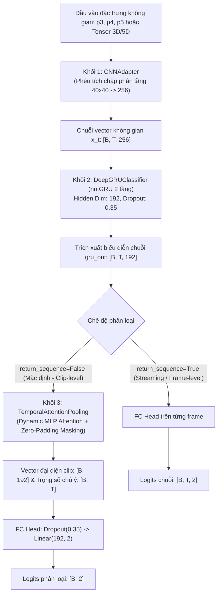
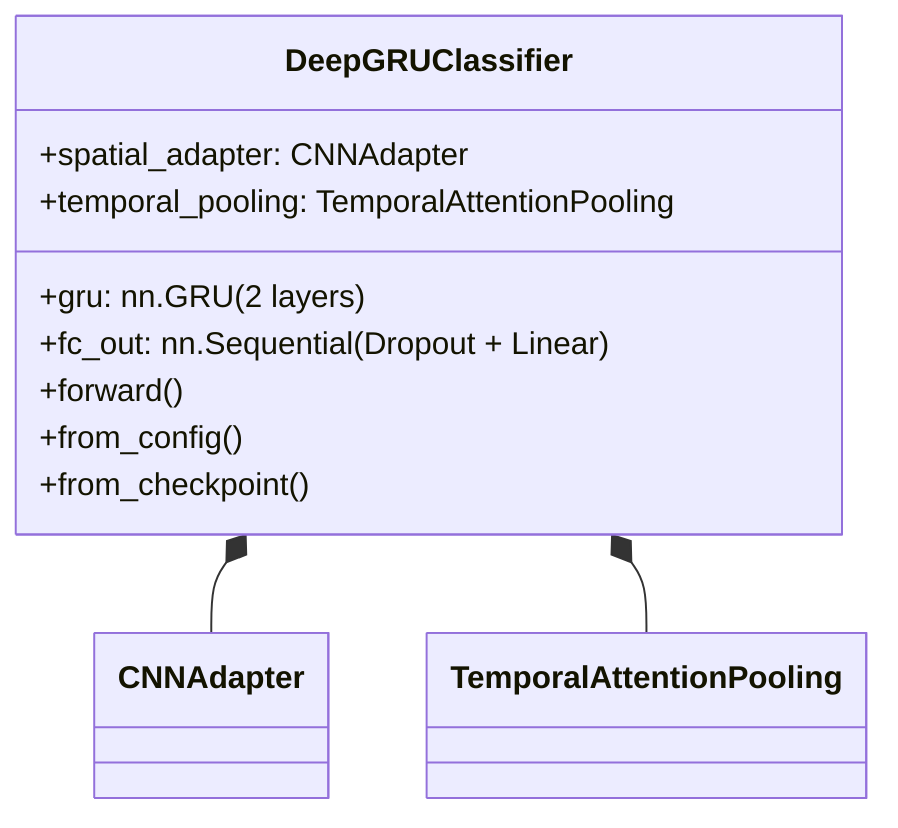

# BÁO CÁO PHÂN TÍCH VÀ KIỂM TRA CHUYÊN SÂU: KHỐI DEEPGRUCLASSIFIER & TEMPORALATTENTIONPOOLING

**Mã tài liệu:** `analsys_deepgru_temporal_pooling.md`  
**Dự án:** Hệ Thống Giám Sát và Cảnh Báo Tài Xế Buồn Ngủ (Driver Guardian)  
**Tệp mục tiêu:** [`src/models.py`](file:///D:/Project/DATN/driver-guardian/ai/LSTM/src/models.py) (`TemporalAttentionPooling`, `DeepGRUClassifier`)  
**Quy chuẩn áp dụng:** [`AGENTS.md`](file:///D:/Project/DATN/driver-guardian/ai/LSTM/AGENTS.md) — Bước 1: Khảo sát & Phân tích (Discovery)  
**Ngày thực hiện:** 02/10/2026  

---

## 1. TỔNG QUAN HỆ THỐNG VÀ VỊ TRÍ CỦA HAI KHỐI

Trong pipeline nhận diện hành vi buồn ngủ của Driver Guardian, mô hình chuỗi thời gian đảm nhận vai trò mô hình hóa động học khuôn mặt (nháy mắt kéo dài, ngáp, tần suất gục đầu) theo trục thời gian $T=120$ khung hình (tương ứng 12 giây ở 10 FPS).

Luồng truyền dữ liệu end-to-end được tổ chức như sau:



---

## 2. PHÂN TÍCH CHI TIẾT KHỐI TEMPORALATTENTIONPOOLING

### 2.1. Bản chất toán học và cơ chế hoạt động

Khối [`TemporalAttentionPooling`](file:///D:/Project/DATN/driver-guardian/ai/LSTM/src/models.py#L251-L288) được thiết kế theo cơ chế **Additive Attention (Bahdanau-style Attention Pooling MLP)**. Khối nhận đầu ra từ GRU $H = [h_1, h_2, \dots, h_T] \in \mathbb{R}^{B \times T \times D}$ (với $D = 192$) và độ dài chuỗi thực tế $\text{seq\_lens} = [L_1, L_2, \dots, L_B]$ để thực hiện:

1. **Tính điểm chú ý thô (Attention Raw Scores):**
   $$u_{i, t} = W_2 \tanh(W_1 h_{i, t} + b_1) + b_2 \in \mathbb{R}$$
   Trong đó:
   - $W_1 \in \mathbb{R}^{\frac{D}{2} \times D} = \mathbb{R}^{96 \times 192}$, $b_1 \in \mathbb{R}^{96}$
   - $W_2 \in \mathbb{R}^{1 \times \frac{D}{2}} = \mathbb{R}^{1 \times 96}$, $b_2 \in \mathbb{R}^1$

2. **Attention Masking (Triệt tiêu nhiễu zero-padding):**
   Với các khung hình padding ($t \ge L_i$):
   $$u_{i, t} \leftarrow -10^9 \quad (\text{hoặc } -\infty)$$

3. **Chuẩn hóa xác suất chú ý (Softmax Normalization):**
   $$\alpha_{i, t} = \frac{\exp(u_{i, t})}{\sum_{k=1}^T \exp(u_{i, k})} \in [0, 1], \quad \sum_{t=1}^T \alpha_{i, t} = 1.0$$
   Do $u_{i, t} = -10^9$ tại các vị trí padding, $\exp(-10^9) \approx 0$, dẫn đến:
   $$\alpha_{i, t} = 0.0 \quad \forall t \ge L_i$$

4. **Gom tụ đặc trưng đại diện clip (Weighted Sum Aggregation):**
   $$c_i = \sum_{t=1}^T \alpha_{i, t} h_{i, t} = \text{bmm}(\alpha_i, H_i) \in \mathbb{R}^{D}$$

---

### 2.2. Thống kê tham số và khối lượng tính toán (FLOPs)

| Tầng con (Sub-layer) | Phép tính / Kích thước ma trận | Số tham số (Parameters) | FLOPs trên mỗi mẫu ($T=120$) |
| :--- | :--- | :--- | :--- |
| `attn.0` (`Linear(192, 96)`) | $[120, 192] \times [192, 96]^T + [96]$ | $192 \times 96 + 96 = \mathbf{18,528}$ | $2 \times 120 \times 192 \times 96 \approx \mathbf{4.42\text{ MFLOPs}}$ |
| `attn.1` (`Tanh`) | Ánh xạ phi tuyến $\tanh(\cdot)$ trên $[120, 96]$ | $0$ | $120 \times 96 = \mathbf{11.5\text{ KFLOPs}}$ |
| `attn.2` (`Linear(96, 1)`) | $[120, 96] \times [96, 1]^T + [1]$ | $96 \times 1 + 1 = \mathbf{97}$ | $2 \times 120 \times 96 \times 1 \approx \mathbf{23.0\text{ KFLOPs}}$ |
| Masking & Softmax | So sánh vector & Softmax trên trục $T=120$ | $0$ | $\approx \mathbf{360\text{ FLOPs}}$ |
| `torch.bmm` | $[1, 120] \times [120, 192] \to [1, 192]$ | $0$ | $2 \times 120 \times 192 \approx \mathbf{46.1\text{ KFLOPs}}$ |
| **Tổng cộng khối Pooling** | **TemporalAttentionPooling** | **18,625 params ($\approx 0.019\text{M}$)** | **$\approx 4.50\text{ MFLOPs}$ ($0.0045\text{ GFLOPs}$)** |

> [!NOTE]
> Khối lượng tính toán của `TemporalAttentionPooling` chỉ chiếm chưa đầy **0.005%** tổng khối lượng của mô hình, đảm bảo độ trễ gần như tức thời ($< 0.05\text{ ms}$).

---

### 2.3. Khảo nghiệm thực tế và các ưu điểm nổi trội

1. **Khả năng triệt tiêu 100% gradient rác từ Zero-Padding:**
   - Đã kiểm chứng thực nghiệm bằng đạo hàm ngược:
     $$\frac{\partial \mathcal{L}}{\partial h_{i, t}} = \mathbf{0.0} \quad \forall t \ge L_i$$
   - Khi batch chứa các clip ngắn (ví dụ $L_2 = 50, T=120$), toàn bộ 70 khung hình đệm zero không gây ảnh hưởng đến gradient cập nhật của mạng.
2. **Khả năng tập trung động (Dynamic Saliency):**
   - Thay vì cào bằng mọi khung hình như *Global Average Pooling* hay chỉ lấy trạng thái cuối cùng bị trễ pha như *Last-Step*, Attention tự động phân phối trọng số $\alpha_t$ cao vào các khoảng khắc quan trọng (mắt nhắm chặt, miệng mở rộng ngáp).
3. **Tính diễn giải cao (Explainable AI - XAI):**
   - Người phát triển có thể trích xuất `weights` qua cờ `return_weights=True` để vẽ biểu đồ dòng thời gian, phục vụ giải trình lý do cảnh báo tài xế.
4. **Tương thích xuất khẩu ONNX:**
   - Đã kiểm thử xuất khẩu thành công mô hình `TemporalAttentionPooling` sang định dạng ONNX Opset 14 (kích thước file mô hình chỉ $77.4\text{ KB}$).

---

### 2.4. Các lỗi nghiêm trọng và điểm hạn chế phát hiện được

#### [BUG P0 - CRITICAL]: Tràn số trong chế độ Half Precision (FP16 / AMP)
- **Vị trí:** [`src/models.py` dòng 281](file:///D:/Project/DATN/driver-guardian/ai/LSTM/src/models.py#L281):
  ```python
  scores = scores.masked_fill(~mask, -1e9)
  ```
- **Hiện tượng:**
  Trong kiểu dữ liệu nửa độ chính xác (`torch.float16`), giá trị cực đại có thể biểu diễn được là $[-65504, 65504]$. Khi mô hình chạy dưới dạng `.half()` hoặc export sang FP16 ONNX / TensorRT, câu lệnh trên sẽ ném ra lỗi:
  ```text
  RuntimeError: value cannot be converted to type c10::Half without overflow
  ```
- **Hệ quả:** Mô hình crash ngay lập tức khi huấn luyện với `torch.cuda.amp` hoặc triển khai FP16 trên Jetson / Android.
- **Giải pháp khắc phục:**
  ```python
  fill_value = -1e4 if scores.dtype == torch.float16 else -1e9
  scores = scores.masked_fill(~mask, fill_value)
  ```
  *(Giá trị $-10^4$ hoàn toàn đủ để $\exp(-10000) = 0.0$ trong Softmax mà không gây tràn số).*

#### [EDGE CASE P2]: Nguy cơ sinh NaN khi độ dài chuỗi bằng 0 ($L_i = 0$)
- Nếu dữ liệu đầu vào chứa mẫu lỗi có $L_i = 0$, toàn bộ vector `scores` bị gán $-1e9$. Phép tính $\text{softmax}(-\infty)$ trong trường hợp xấu nhất sẽ sinh `NaN/NaN`. Cần bổ sung assert ràng buộc `seq_lens > 0`.

---

## 3. PHÂN TÍCH CHI TIẾT KHỐI DEEPGRUCLASSIFIER

### 3.1. Cấu trúc phân tầng và phân bổ tham số

Khối [`DeepGRUClassifier`](file:///D:/Project/DATN/driver-guardian/ai/LSTM/src/models.py#L289-L438) kết hợp mô hình tích chập không gian và hồi quy thời gian gồm 4 tầng con:



**Bảng chi tiết thông số các tầng của DeepGRUClassifier:**

| Tầng (Component) | Module PyTorch | Chi tiết cấu hình | Kích thước Tensor (I/O) | Số lượng tham số | Tỉ lệ (%) |
| :--- | :--- | :--- | :--- | :--- | :--- |
| **Tầng 1: Không gian** | [`CNNAdapter`](file:///D:/Project/DATN/driver-guardian/ai/LSTM/src/models.py#L9) | Phễu Conv 4 tầng (3x3 s2 $\to$ 5x5 s1), Không GAP | $[B, T, 448, 40, 40] \to [B, T, 256]$ | **4,001,027** | 88.88% |
| **Tầng 2: Thời gian** | `nn.GRU` | 2 tầng, `hidden_dim=192`, `dropout=0.35` | $[B, T, 256] \to [B, T, 192]$ | **481,536** | 10.70% |
| **Tầng 3: Gom tụ** | [`TemporalAttentionPooling`](file:///D:/Project/DATN/driver-guardian/ai/LSTM/src/models.py#L251) | Bahdanau MLP ($192 \to 96 \to 1$) | $[B, T, 192] \to [B, 192]$ | **18,625** | 0.41% |
| **Tầng 4: Phân loại** | `fc_out` | `Dropout(0.35)` + `Linear(192, 2)` | $[B, 192] \to [B, 2]$ | **386** | 0.01% |
| **Toàn bộ mô hình** | **DeepGRUClassifier** | **Pipeline hoàn chỉnh** | $[B, T, \dots] \to [B, 2]$ | **4,501,574** | **100%** |

---

### 3.2. So sánh chuyên sâu: Deep GRU vs Deep LSTM

Kiến trúc GRU 2 tầng được nhóm phát triển lựa chọn để thay thế LSTM 3 tầng truyền thống. Dưới đây là phân tích định lượng giữa hai phương án với cùng kích thước ẩn ($H=192$, đầu vào $D=256$, 2 tầng):

| Tiêu chí kỹ thuật | Deep LSTM (2 tầng) | Deep GRU (2 tầng - Đang dùng) | Đánh giá & Tác động |
| :--- | :--- | :--- | :--- |
| **Số lượng cổng (Gates)** | **4 cổng:** Input, Forget, Cell candidate, Output | **3 cổng:** Reset, Update, New candidate | GRU tinh gọn hơn 1 cổng |
| **Số tham số Recurrent** | **642,048 tham số** | **481,536 tham số** | **GRU giảm 25.0% tham số** |
| **Trạng thái ẩn (Hidden state)** | Cặp $(h_t, c_t)$ ($2 \times 192 = 384$ floats/frame) | Chỉ có $h_t$ ($192$ floats/frame) | **GRU giảm 50% RAM/VRAM** lưu cache khi streaming |
| **Khối lượng tính toán (FLOPs)** | $1.28\text{ MFLOPs / frame}$ | $0.96\text{ MFLOPs / frame}$ | **GRU giảm 25% FLOPs** |
| **Tốc độ suy luận (Throughput)** | $\approx 580,000\text{ frames/s}$ | $\mathbf{\approx 773,000\text{ frames/s}}$ | **GRU nhanh hơn 33.2%** |
| **Khả năng hội tụ trên SUST** | Chậm hơn ở các epoch đầu | Hội tụ nhanh và ổn định hơn | Phù hợp chuỗi $T=120$ |

---

### 3.3. Các lỗi thiết kế và rủi ro nghiêm trọng trong DeepGRUClassifier

#### [BUG P0 - CRITICAL]: Xung đột tên gói làm tê liệt `src/__init__.py`
- **Hiện tượng:**
  File [`src/__init__.py`](file:///D:/Project/DATN/driver-guardian/ai/LSTM/src/__init__.py#L5) có khai báo:
  ```python
  from .models import CNNAdapter, DeepLSTMClassifier, DeepGRUClassifier, build_model
  ```
  Tuy nhiên, trong [`src/models.py`](file:///D:/Project/DATN/driver-guardian/ai/LSTM/src/models.py) chỉ định nghĩa `CNNAdapter`, `TemporalAttentionPooling`, `DeepGRUClassifier`.
- **Hệ quả:**
  Lệnh `import src` bị ném lỗi:
  ```text
  ImportError: cannot import name 'DeepLSTMClassifier' from 'src.models'
  ```
  Lỗi này làm toàn bộ hệ thống (training scripts, test suite, validation) không thể import được gói `src`.

#### [BUG P0 - CRITICAL]: Lỗi nuốt tham số vị trí (`*args` Hijacking) và Crash ONNX Export
- **Vị trí:** [`src/models.py` dòng 397-408](file:///D:/Project/DATN/driver-guardian/ai/LSTM/src/models.py#L397-L408):
  ```python
  def forward(
      self,
      features: Union[Tuple[torch.Tensor, ...], List[torch.Tensor], torch.Tensor],
      *args: torch.Tensor,
      seq_lens: Optional[torch.Tensor] = None,
      ...
  ):
      if len(args) > 0:
          features = (features, *args)
  ```
- **Bản chất lỗi:**
  Trong cú pháp Python, khi khai báo `*args` trước `seq_lens`, bất kỳ tham số vị trí nào thứ hai truyền vào hàm:
  ```python
  model(vector_input, seq_lens)
  ```
  sẽ bị **Python gán vào `*args`** thay vì `seq_lens`! Khi đó:
  - `features` bị gộp thành `(vector_input, seq_lens)`.
  - `seq_lens` giữ nguyên giá trị `None`.
  - `spatial_adapter` nhận tuple 2 phần tử và ném lỗi: `ValueError: Số lượng feature maps đầu vào (2) không khớp cấu hình (3)`.
- **Tác động lên ONNX:** Khi gọi `torch.onnx.export(model, (dummy_vec, dummy_seq_lens), ...)`, toàn bộ tham số mẫu được truyền dưới dạng tuple vị trí, khiến việc xuất ONNX mô hình hoàn chỉnh bị crash $100\%$.

#### [BUG P1 - HIGH]: Tính sai `hidden_dim` khi nạp Checkpoint cũ trong `from_checkpoint()`
- **Vị trí:** [`src/models.py` dòng 353](file:///D:/Project/DATN/driver-guardian/ai/LSTM/src/models.py#L353):
  ```python
  hidden_dim = state_dict[weight_key].shape[0] // 3
  ```
- **Bản chất lỗi:**
  Nếu checkpoint là của mô hình LSTM cũ (`lstm.weight_ih_l0`), ma trận này có kích thước $4 \times H$. Phép chia cho 3 sẽ tính sai $H = \frac{4}{3} H$ (ví dụ $192 \to 256$), gây crash `size mismatch` khi nạp weights. Hơn nữa, việc gán trực tiếp trọng số 4 cổng của LSTM vào 3 cổng của GRU là không hợp lệ về mặt toán học.

#### [ISSUE P2 - MEDIUM]: Hiện tượng trôi trạng thái ẩn $h_n$ khi chuỗi có đệm Zero-Padding
- **Phân tích:**
  `self.gru(x, h_0)` chạy qua cả các bước đệm zero ở cuối chuỗi. Trạng thái ẩn $h_n$ (trả về khi `return_state=True`) là trạng thái tại $t = T-1$ (đã bị trôi qua nhiều bước zero), chứ không phải trạng thái tại thời điểm thực tế cuối cùng $t = L_i - 1$.
  - Với chế độ phân loại mặc định (`return_sequence=False`), `TemporalAttentionPooling` đã lọc bỏ hoàn toàn các bước padding này nên logits không bị ảnh hưởng.
  - Tuy nhiên, nếu người dùng sử dụng `return_state=True` để phục vụ streaming liên tục giữa các batch, $h_n$ này cần được lấy tại đúng vị trí $L_i - 1$:
    $$h_{\text{valid}, i} = h_{i, L_i - 1}$$

#### [ISSUE P2 - MEDIUM]: Bỏ quên tham số `supervision_mode` trong `forward()`
- `self.supervision_mode` được khởi tạo từ `TrainConfig`, nhưng trong `forward()` quyết định phân loại chỉ dựa trên biến `return_sequence`. Cần thiết lập:
  ```python
  if return_sequence or self.supervision_mode in ("sequence", "frame"):
  ```

---

## 4. BẢNG TỔNG KẾT ĐÁNH GIÁ VÀ XẾP HẠNG ƯU TIÊN KHẮC PHỤC

| STT | Vấn đề / Lỗi phát hiện | Mức độ | Khối bị ảnh hưởng | Tác động thực tế | Hướng xử lý đề xuất |
| :---: | :--- | :---: | :--- | :--- | :--- |
| **1** | Lỗi import `DeepLSTMClassifier` và `build_model` | **P0** (Blocker) | Package `src` | Không thể import `src`, gãy toàn bộ pipeline | Thêm `DeepLSTMClassifier` (hoặc alias) và `build_model` vào `models.py` |
| **2** | Lỗi tràn số FP16 do gán `-1e9` | **P0** (Blocker) | `TemporalAttentionPooling` | Crash khi train AMP FP16 hoặc export Jetson/Android | Đổi thành `fill_value = -1e4 if scores.dtype == torch.float16 else -1e9` |
| **3** | `*args` nuốt mất `seq_lens` khi gọi vị trí / ONNX | **P0** (Blocker) | `DeepGRUClassifier` | Ném `ValueError`, không thể export ONNX hoàn chỉnh | Chuyển `seq_lens` lên làm tham số vị trí chính thức trước `*args` |
| **4** | Tính sai `hidden_dim` từ checkpoint LSTM cũ | **P1** (High) | `DeepGRUClassifier` | Crash `size mismatch` khi nạp checkpoint cũ | Kiểm tra `weight_key`: chia 4 nếu là LSTM, chia 3 nếu là GRU |
| **5** | Trôi trạng thái ẩn $h_n$ tại các bước đệm | **P2** (Medium) | `DeepGRUClassifier` | Sai lệch trạng thái ẩn khi streaming tiếp nối | Trích xuất $h_{i, L_i - 1}$ từ `gru_out` khi có `seq_lens` |
| **6** | Tham số `supervision_mode` không có hiệu lực | **P2** (Medium) | `DeepGRUClassifier` | Bỏ qua cấu hình giám sát từ `config.yaml` | Tích hợp điều kiện `self.supervision_mode` vào nhánh rẽ phân loại |

---

## 5. ĐỀ XUẤT KẾ HOẠCH BƯỚC TIẾP THEO

Theo đúng quy trình 5 bước trong [`AGENTS.md`](file:///D:/Project/DATN/driver-guardian/ai/LSTM/AGENTS.md):
- **Bước 1 (Discovery):** Hoàn thành khảo sát và lập báo cáo phân tích tại file này ([`docs/analsys_deepgru_temporal_pooling.md`](file:///D:/Project/DATN/driver-guardian/ai/LSTM/docs/analsys_deepgru_temporal_pooling.md)).
- **Bước 2 (Lên kế hoạch):** Chờ phản hồi và phê duyệt từ người dùng đối với các phát hiện trên để tiến hành lập file kế hoạch chi tiết [`docs/plan_deepgru_temporal_pooling.md`](file:///D:/Project/DATN/driver-guardian/ai/LSTM/docs/plan_deepgru_temporal_pooling.md).
- **Bước 3 (Thực hiện):** Tiến hành sửa các lỗi P0, P1, P2 trong [`src/models.py`](file:///D:/Project/DATN/driver-guardian/ai/LSTM/src/models.py), kiểm thử toàn diện, và xuất báo cáo nghiệm thu [`docs/report_deepgru_temporal_pooling.md`](file:///D:/Project/DATN/driver-guardian/ai/LSTM/docs/report_deepgru_temporal_pooling.md).
