# BÁO CÁO PHÂN TÍCH YÊU CẦU: XÂY DỰNG DATASET NẠP ĐẶC TRƯNG HDF5 (.H5) CHO PYTORCH

**Mã tài liệu:** `analsys_h5_dataset.md`  
**Dự án:** Hệ Thống Nhận Diện Tài Xế Buồn Ngủ (Driver Guardian - Deep GRU / LSTM)  
**Tệp mục tiêu:** [`src/dataset.py`](file:///D:/Project/DATN/driver-guardian/ai/LSTM/src/dataset.py)  
**Tệp nguồn dữ liệu:** [`extract_to_pt.py`](file:///D:/Project/DATN/driver-guardian/ai/LSTM/extract_to_pt.py)  
**Ngày thực hiện:** 02/10/2026  
**Quy chuẩn áp dụng:** [`AGENTS.md`](file:///D:/Project/DATN/driver-guardian/ai/LSTM/AGENTS.md) — Bước 1: Khảo sát & Phân tích (Discovery)  

---

## 1. TỔNG QUAN & MỤC TIÊU NHIỆM VỤ (EXECUTIVE SUMMARY)

### 1.1. Yêu cầu của người dùng
Người dùng yêu cầu tạo tệp [`src/dataset.py`](file:///D:/Project/DATN/driver-guardian/ai/LSTM/src/dataset.py) chứa lớp `Dataset` để nạp dữ liệu đặc trưng từ tệp `.h5` (HDF5) được sinh ra bởi script [`extract_to_pt.py`](file:///D:/Project/DATN/driver-guardian/ai/LSTM/extract_to_pt.py).

### 1.2. Vị trí trong toàn bộ Pipeline hệ thống
Trong hệ thống Driver Guardian, [`src/dataset.py`](file:///D:/Project/DATN/driver-guardian/ai/LSTM/src/dataset.py) đóng vai trò là **cầu nối trực tiếp** giữa tầng lưu trữ dữ liệu nén HDF5 và tầng mô hình hóa chuỗi thời gian:

```mermaid
flowchart LR
    A["Video gốc (.mp4, .avi)<br>chuẩn struct_dataset.md"] -->|extract_to_pt . py| B["File HDF5 (.h5)<br>p3, p4, p5 nén LZF/GZIP"]
    B -->|" src/dataset.py<br>HDF5FeatureDataset "| C["PyTorch DataLoader<br>Dynamic Padding & Masking"]
    C -->|p3, p4, p5, seq_lens| D["CNNAdapter<br>(src/models.py)"]
    D -->|" x_t [B, T, 256] "| E["DeepGRUClassifier<br>(src/models.py)"]
    E -->|gru_out, seq_lens| F["TemporalAttentionPooling<br>(src/models.py)"]
    F -->|" Logits [B, 2] "| G["DrowsinessLoss<br>(src/loss.py)"]
```



---

## 2. KHẢO SÁT CẤU TRÚC TỆP DỮ LIỆU HDF5 TỪ `extract_to_pt.py`

Qua việc khảo sát trực tiếp mã nguồn [`extract_to_pt.py`](file:///D:/Project/DATN/driver-guardian/ai/LSTM/extract_to_pt.py#L301-L364) và [`docs/analsys_extract_to_h5.md`](file:///D:/Project/DATN/driver-guardian/ai/LSTM/docs/analsys_extract_to_h5.md), cấu trúc lưu trữ của file `.h5` được xác định chuẩn hóa như sau:

### 2.1. Phân cấp Nhóm (Groups Hierarchy)
Tệp `.h5` được phân tầng theo định dạng cây:
```text
dataset_features.h5
├── train/
│   ├── 0_alert/
│   │   ├── train_0_alert_sust_n_1/               # Video gốc
│   │   │   ├── p3  (Dataset [T, 64, 80, 80], chunks=(1, 64, 80, 80))
│   │   │   ├── p4  (Dataset [T, 128, 40, 40], chunks=(1, 128, 40, 40))
│   │   │   ├── p5  (Dataset [T, 256, 20, 20], chunks=(1, 256, 20, 20))
│   │   │   └── attrs: label=0, label_name="0_alert", seq_len=T, is_completed=True...
│   │   ├── train_0_alert_sust_n_1_aug01/         # Bản sao augment
│   │   │   └── ...
│   │   └── ...
│   └── 1_drowsy/
│       └── ...
└── val/
    ├── 0_alert/
    │   └── ...
    └── 1_drowsy/
        └── ...
```

### 2.2. Chi tiết các Dataset đặc trưng không gian (Raw Feature Maps)
Mỗi mẫu video clip $i$ có độ dài thời gian $T_i$ chứa đúng 3 dataset:
1. **`p3`**: Tensor kích thước $[T_i, 64, 80, 80]$ (Chi tiết không gian cao).
2. **`p4`**: Tensor kích thước $[T_i, 128, 40, 40]$ (Đặc trưng mức trung gian).
3. **`p5`**: Tensor kích thước $[T_i, 256, 20, 20]$ (Đặc trưng ngữ nghĩa mức cao).
- **Kiểu dữ liệu:** Mặc định `float16` (hoặc `float32`).
- **Thuật toán nén:** `lzf` hoặc `gzip`.
- **Chunking:** `(1, C, H, W)` — tối ưu hóa việc nạp từng khung hình hoặc lát cắt theo thời gian mà không cần giải nén toàn bộ tệp.

### 2.3. Thuộc tính siêu dữ liệu (Attributes `grp.attrs`)
Mỗi nhóm video trong HDF5 chứa các siêu dữ liệu sau:
- `label`: `int` (0: Alert, 1: Drowsy)
- `label_name`: `str` ("0_alert" hoặc "1_drowsy")
- `seq_len`: `int` (số lượng khung hình $T$)
- `sample_interval`: `float` (chu kỳ lấy mẫu thời gian, vd 0.1s ~ 10 FPS)
- `orig_fps`: `float` (FPS gốc của video)
- `orig_duration_s`: `float` (thời lượng video tính bằng giây)
- `is_augmented`: `bool` (True nếu là bản sao tăng cường dữ liệu)
- `aug_seed`: `int` (seed ngẫu nhiên dùng để tăng cường)
- `source_dataset`: `str` (nguồn: "sust", "uta-rldd", "vbddd", ...)
- `orig_file`: `str` (đường dẫn tệp video gốc)
- `is_completed`: `bool` (cờ giao dịch nguyên tử, chỉ nạp nếu `is_completed == True`)

### 2.4. Tệp CSV Manifest đi kèm (`dataset_manifest.csv`)
Tệp [`checkpoints/dataset_manifest.csv`](file:///D:/Project/DATN/driver-guardian/ai/LSTM/extract_to_pt.py#L368-L375) được ghi song song với các cột:
`video_id, split, label, label_name, orig_file, source_dataset, orig_duration_s, orig_fps, sample_interval, num_frames, p3_shape, p4_shape, p5_shape, dtype, compression, is_augmented, aug_seed, h5_group_path, status, error_msg, timestamp`.

---

## 3. PHÂN TÍCH CÁC THÁCH THỨC KỸ THUẬT & GIẢI PHÁP ĐỀ XUẤT

### 3.1. Thách thức 1: Xung đột Multi-processing & Lỗi File Descriptor trong `h5py` (CRITICAL)
- **Vấn đề:** Thư viện `h5py` bọc qua thư viện C HDF5, vốn không an toàn khi chia sẻ file handle giữa các worker process của PyTorch DataLoader (`num_workers > 0`). Nếu mở tệp HDF5 trong hàm `__init__` của `Dataset`, khi hệ thống gọi `fork` hoặc `spawn` để tạo tiến trình con, các worker sẽ cùng truy cập một file descriptor, dẫn đến lỗi:
  - `RuntimeError: Resource temporarily unavailable`
  - Treo toàn bộ tiến trình (Deadlock)
  - Hoặc dữ liệu trả về bị xáo trộn/hỏng bộ nhớ.
- **Giải pháp:**
  1. **Lazy File Opening (Mở tệp trễ):** Khởi tạo `self.h5_file = None` trong `__init__`.
  2. Mở tệp ở chế độ Read-Only (`mode="r"`, `swmr=True`, `libver="latest"`) bên trong phương thức `_get_h5_file()` khi worker gọi `__getitem__` lần đầu tiên:
     ```python
     def _get_h5_file(self) -> h5py.File:
         if self.h5_file is None:
             self.h5_file = h5py.File(str(self.h5_path), mode="r", swmr=True, libver="latest")
         return self.h5_file
     ```
  3. Quản lý việc đóng tệp an toàn trong `__del__` và hỗ trợ phương thức `close()`.

---

### 3.2. Thách thức 2: Độ dài chuỗi $T$ biến thiên (Variable Sequence Lengths)
- **Vấn đề:** Các video trong thực tế có độ dài không bằng nhau ($T$ dao động từ 60 đến 150 khung hình). Hàm `default_collate` của PyTorch sẽ báo lỗi kích thước không khớp khi ghép các tensor $[T_1, C, H, W]$ và $[T_2, C, H, W]$ vào chung một batch.
- **Giải pháp:**
  1. Xây dựng hàm gom batch tùy biến: `collate_h5_features(batch)`:
     - Tự động tìm độ dài lớn nhất $T_{\max} = \max(T_1, T_2, \dots, T_B)$ trong batch.
     - Khởi tạo batch tensor với giá trị đệm 0 (Zero-padding):
       - `p3_batch`: $[B, T_{\max}, 64, 80, 80]$
       - `p4_batch`: $[B, T_{\max}, 128, 40, 40]$
       - `p5_batch`: $[B, T_{\max}, 256, 20, 20]$
     - Tạo tensor `seq_lens`: $[B]$ chứa độ dài thực tế của từng mẫu.
  2. Khi đưa vào mô hình [`DeepGRUClassifier`](file:///D:/Project/DATN/driver-guardian/ai/LSTM/src/models.py#L290), khối [`TemporalAttentionPooling`](file:///D:/Project/DATN/driver-guardian/ai/LSTM/src/models.py#L251) sẽ sử dụng `seq_lens` để áp dụng Attention Masking, **triệt tiêu 100% gradient rác** tại các khung hình padding!
  3. Cung cấp tùy chọn cấu hình `max_seq_len` hoặc `fixed_seq_len`:
     - Nếu người dùng muốn cố định độ dài (ví dụ $T=120$ frames như SUST dataset):
       - Cắt ngẫu nhiên cửa sổ (Random Sliding Window) khi `split == "train"`.
       - Lấy cửa sổ chính giữa (Center Window) khi `split == "val"`.
       - Tự động pad 0 nếu video ngắn hơn độ dài yêu cầu.

---

### 3.3. Thách thức 3: Tối ưu I/O & Băng thông Bộ nhớ
- **Vấn đề:** Tensor đặc trưng không gian có dung lượng đáng kể ($1.43\text{ MB} / \text{frame}$ ở FP16). Việc giải nén và chuyển đổi kiểu dữ liệu liên tục có thể gây nghẽn băng thông CPU-RAM-GPU.
- **Giải pháp:**
  1. Hỗ trợ nạp kiểu dữ liệu tùy biến: `dtype=torch.float32` (mặc định cho training chuẩn) hoặc giữ nguyên `torch.float16` (nếu train với Full FP16).
  2. Hỗ trợ cờ `cache_in_ram=False` (mặc định nạp từ đĩa qua chunking để tiết kiệm RAM) và `cache_in_ram=True` (nạp trước toàn bộ dataset vào RAM nếu máy tính có $\ge 32\text{ GB}$ RAM, giúp tốc độ huấn luyện đạt cực đại).
  3. Đọc dữ liệu lát cắt theo chunk `p3[start:end]` thay vì đọc toàn bộ chuỗi rồi mới cắt.

---

### 3.4. Thách thức 4: Cơ chế Lập chỉ mục kép (Dual Indexing Mechanism)
- **Vấn đề:** Cần đảm bảo `src/dataset.py` hoạt động được trong mọi tình huống:
  - Tình huống A: Có tệp `dataset_manifest.csv` $\to$ Đọc CSV để lập chỉ mục cực nhanh (không tốn thời gian scan cây thư mục HDF5).
  - Tình huống B: Không có tệp CSV hoặc CSV bị mất $\to$ Tự động duyệt qua cây HDF5, tìm tất cả các group thỏa mãn `is_completed == True`.
- **Bộ lọc linh hoạt (Filtering capabilities):**
  - Lọc theo phân tập: `split in ["train", "val", "all"]`.
  - Lọc theo nguồn dữ liệu: `source_dataset` ("sust", "uta-rldd", ...).
  - Lọc theo nhãn: `filter_label` (0 hoặc 1).
  - Bật/tắt dữ liệu tăng cường: `include_augmented=True/False`.
  - Lọc theo độ dài tối thiểu: `min_seq_len`.

---

## 4. BẢNG SO SÁNH & ĐẶC TẢ GIAO DIỆN LẬP TRÌNH (API SPECIFICATION)

### 4.1. Lớp `HDF5FeatureDataset`
```python
class HDF5FeatureDataset(torch.utils.data.Dataset):
    """
    PyTorch Dataset nạp các tensor đặc trưng không gian (p3, p4, p5) trực tiếp từ tệp HDF5.
    Hỗ trợ multiprocessing safe, dynamic indexing, temporal windowing và caching.
    """
    def __init__(
        self,
        h5_path: Union[str, Path],
        manifest_csv: Optional[Union[str, Path]] = None,
        split: str = "train",
        seq_len: Optional[int] = None,
        stride: int = 1,
        include_augmented: bool = True,
        source_dataset: Optional[str] = None,
        min_seq_len: int = 5,
        target_dtype: torch.dtype = torch.float32,
        cache_in_ram: bool = False
    ) -> None:
        ...
```

### 4.2. Cấu trúc dữ liệu trả về từ `__getitem__(index)`
Trả về một Tuple gồm:
1. `features`: `Tuple[torch.Tensor, torch.Tensor, torch.Tensor]`
   - `p3`: Tensor `[T, 64, 80, 80]`
   - `p4`: Tensor `[T, 128, 40, 40]`
   - `p5`: Tensor `[T, 256, 20, 20]`
2. `label`: `torch.Tensor` (Scalar kiểu `torch.long`, giá trị 0 hoặc 1)
3. `seq_len`: `torch.Tensor` (Scalar kiểu `torch.long`, độ dài thời gian thực tế $T$)
4. `meta`: `Dict[str, Any]` (chứa `video_id`, `label_name`, `is_augmented`, `source_dataset`, `orig_file`, ...)

### 4.3. Hàm Gom Batch: `collate_h5_features`
```python
def collate_h5_features(
    batch: List[Tuple[Tuple[torch.Tensor, torch.Tensor, torch.Tensor], torch.Tensor, torch.Tensor, Dict[str, Any]]]
) -> Tuple[Tuple[torch.Tensor, torch.Tensor, torch.Tensor], torch.Tensor, torch.Tensor, List[Dict[str, Any]]]:
    """
    Collate function tự động pad 0 theo thời gian về max_seq_len của batch hiện tại.
    
    Returns:
        features: (p3_batch [B, T_max, 64, 80, 80],
                   p4_batch [B, T_max, 128, 40, 40],
                   p5_batch [B, T_max, 256, 20, 20])
        labels: Tensor [B] (torch.long)
        seq_lens: Tensor [B] (torch.long)
        metas: List[Dict[str, Any]] (độ dài B)
    """
```

### 4.4. Hàm Khởi tạo DataLoader Factory: `build_h5_dataloaders`
```python
def build_h5_dataloaders(
    h5_path: Union[str, Path],
    manifest_csv: Optional[Union[str, Path]] = None,
    batch_size: int = 64,
    num_workers: int = 4,
    seq_len: Optional[int] = None,
    include_augmented_train: bool = True,
    pin_memory: bool = True,
    seed: int = 42,
    config: Optional[Any] = None
) -> Tuple[DataLoader, DataLoader]:
    """
    Tạo bộ đôi Train DataLoader và Val DataLoader chuẩn hóa sẵn sàng cho pipeline huấn luyện.
    """
```

---

## 5. TƯƠNG THÍCH VỚI MÔ HÌNH HIỆN CÓ

Mô hình [`DeepGRUClassifier`](file:///D:/Project/DATN/driver-guardian/ai/LSTM/src/models.py#L390-L437) có phương thức forward:
```python
logits = model(features=(p3_batch, p4_batch, p5_batch), seq_lens=seq_lens)
```
Kết quả đầu ra từ `collate_h5_features` khớp 100% với chữ ký hàm (signature) này:
- `features`: đúng bộ 3 tensor `(p3, p4, p5)` dạng 5D: `[Batch, Time, Channels, Height, Width]`.
- `seq_lens`: đúng tensor 1D `[Batch]` phục vụ Attention Masking.
- `labels`: tương thích trực tiếp với [`DrowsinessLoss`](file:///D:/Project/DATN/driver-guardian/ai/LSTM/src/loss.py) qua `loss_fn(logits, labels)`.

---

## 6. KẾ HOẠCH BƯỚC TIẾP THEO

Theo đúng quy chuẩn [`AGENTS.md`](file:///D:/Project/DATN/driver-guardian/ai/LSTM/AGENTS.md):
1. **Bước 1 (Hiện tại):** Hoàn thành khảo sát & phân tích kỹ thuật trong `docs/analsys_h5_dataset.md`.
2. **Bước 2 (Chờ người dùng xác nhận phân tích):**
   - Lập kế hoạch chi tiết triển khai tệp `docs/plan_h5_dataset.md`.
3. **Bước 3:**
   - Triển khai mã nguồn hoàn chỉnh tại [`src/dataset.py`](file:///D:/Project/DATN/driver-guardian/ai/LSTM/src/dataset.py).
   - Xuất khẩu các lớp trong [`src/__init__.py`](file:///D:/Project/DATN/driver-guardian/ai/LSTM/src/__init__.py).
   - Viết test tự động kiểm tra tương thích multi-worker và end-to-end với [`DeepGRUClassifier`](file:///D:/Project/DATN/driver-guardian/ai/LSTM/src/models.py).
   - Lập báo cáo kết quả thực hiện tại `docs/report_h5_dataset.md`.

---
*Tài liệu phân tích đã được lập đầy đủ theo chuẩn AGENTS.MD và sẵn sàng để người dùng đánh giá.*
