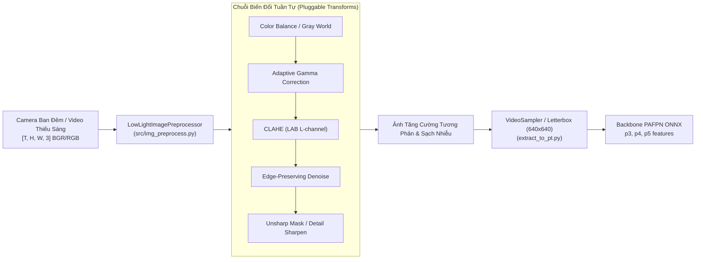
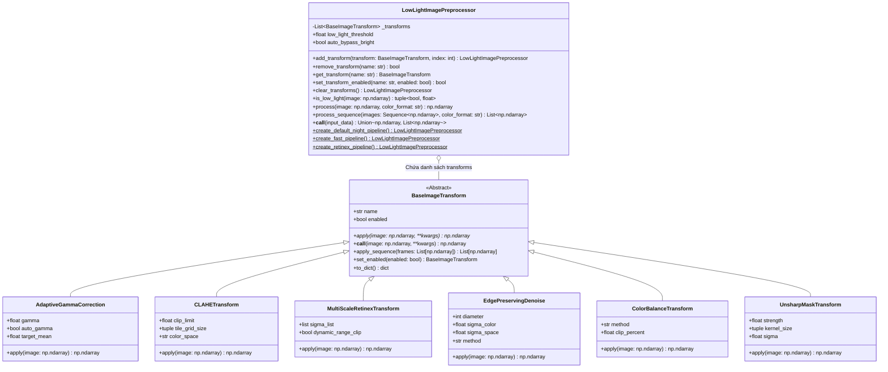

# BÁO CÁO PHÂN TÍCH YÊU CẦU: XÂY DỰNG MODULE TIỀN XỬ LÝ ẢNH THIẾU SÁNG & BAN ĐÊM (LOW-LIGHT / NIGHT IMAGE PREPROCESSING)

**Mã tài liệu:** `analsys_img_preprocess.md`  
**Dự án:** Hệ Thống Nhận Diện Tài Xế Buồn Ngủ (Driver Guardian - Deep GRU / LSTM)  
**Tệp mục tiêu:** [`src/img_preprocess.py`](file:///D:/Project/DATN/driver-guardian/ai/LSTM/src/img_preprocess.py)  
**Ngày thực hiện:** 02/10/2026  
**Quy chuẩn áp dụng:** [`AGENTS.md`](file:///D:/Project/DATN/driver-guardian/ai/LSTM/AGENTS.md) — Bước 1: Khảo sát & Phân tích (Discovery)  

---

## 1. TỔNG QUAN & MỤC TIÊU NHIỆM VỤ (EXECUTIVE SUMMARY)

### 1.1. Yêu cầu của người dùng
Người dùng yêu cầu tạo tệp [`src/img_preprocess.py`](file:///D:/Project/DATN/driver-guardian/ai/LSTM/src/img_preprocess.py) với các mục tiêu cốt lõi:
1. **Đối tượng xử lý:** Ảnh/chuỗi khung hình video chụp tài xế trong điều kiện ban đêm, ánh sáng yếu (low-light, night vision, cabin tối).
2. **Kiến trúc phần mềm:**
   - Các phép biến đổi (transforms) phải được thiết kế dưới dạng **Class độc lập**, tuân thủ một **Interface chuẩn hóa (Abstract Base Class)** được định nghĩa sẵn.
   - Dễ dàng gắn kết, thêm mới (pluggable/extensible), tháo rời, kích hoạt/vô hiệu hóa các phép biến đổi vào lớp tiền xử lý chính mà không phải sửa đổi mã nguồn lõi (tuân thủ nguyên lý *Open/Closed Principle*).
3. **Lớp tiền xử lý chính (Pipeline/Preprocessor):** Đóng vai trò là bộ điều phối (orchestrator) thực thi chuỗi các biến đổi tuần tự trên ảnh đơn lẻ hoặc toàn bộ chuỗi khung hình video clip (video sequence) với hiệu năng cao.

### 1.2. Bối cảnh & Vị trí trong Hệ thống Driver Guardian
Trong bài toán giám sát trạng thái tài xế (Driver Drowsiness Detection), điều kiện ban đêm hoặc khoang cabin thiếu sáng là một trong những thách thức lớn nhất:
- Mắt, lông mi, khóe miệng tài xế bị chìm vào bóng tối, độ tương phản cực thấp khiến mô hình trích xuất đặc trưng (CNN Backbone PAFPN / YOLO) không nhận diện được các chuyển động nhắm mắt (Eye Aspect Ratio - EAR), ngáp (Mouth Aspect Ratio - MAR).
- Cảm biến camera khi quay ban đêm thường tự động đẩy ISO/Gain lên cao, sinh ra nhiễu hạt (sensor noise/chrominance noise). Nếu chỉ kéo sáng đơn thuần (như tăng brightness tuyến tính), nhiễu hạt sẽ bùng nổ, phá vỡ các đặc trưng không gian.

Module [`src/img_preprocess.py`](file:///D:/Project/DATN/driver-guardian/ai/LSTM/src/img_preprocess.py) sẽ đóng vai trò tiền xử lý cấp 0 (Level-0 Image Enhancement) trước khi đưa khung hình vào mô hình trích xuất đặc trưng hoặc tăng cường dữ liệu:



---

## 2. PHÂN TÍCH BÀI TOÁN KỸ THUẬT: ĐẶC TÍNH ẢNH BAN ĐÊM & CÁC GIẢI PHÁP BIẾN ĐỔI

Qua khảo sát dữ liệu thực tế từ các tập dữ liệu buồn ngủ (như SUST, UTA-RLDD, NTHU-DDD) và môi trường xe hơi ban đêm, ảnh thiếu sáng có các đặc trưng bệnh lý sau:

### 2.1. Phân tích hiện tượng quang học trong cabin ban đêm
| Hiện tượng | Nguyên nhân vật lý | Hệ quả với mô hình AI | Giải pháp xử lý kỹ thuật |
| :--- | :--- | :--- | :--- |
| **Độ sáng thấp, histogram co cụm về mức 0** | Thiếu nguồn sáng khả kiến, chỉ có ánh sáng yếu từ bảng taplo hoặc đèn đường le lói | Mất toàn bộ chi tiết mắt, lông mày, viền môi | Cân bằng histogram cục bộ (CLAHE), Gamma thích nghi (Adaptive Gamma) |
| **Nhiễu hạt cảm biến (High ISO Noise)** | Camera khuếch đại tín hiệu điện tử (analog/digital gain) trong điều kiện thiếu photon | Khi kéo sáng, nhiễu hạt bị khuếch đại làm sai lệch feature maps của CNN | Lọc khử nhiễu bảo toàn cạnh (Bilateral Filter / Fast NLM) |
| **Ám màu (Color Cast)** | Đèn đường natri (vàng cam), đèn LED cabin (xanh/đỏ) | Sai lệch phân bố màu da mặt, giảm độ phân giải biên | Cân bằng trắng Gray-World, White Balance tự động |
| **Mất độ sắc nét đường biên (Edge Blur)** | Tốc độ màn trập (shutter speed) bị hạ thấp gây motion blur nhẹ + khử nhiễu làm mờ biên | Khó xác định trạng thái mở/khép của mí mắt | Tăng cường viền Unsharp Masking |
| **Ánh sáng chiếu không đồng đều (Non-uniform illumination)** | Ánh sáng hắt từ 1 bên cửa kính, bên còn lại tối đen | Mô hình bị thiên lệch (bias) sang bên sáng hơn | Phân rã phản xạ Retinex (MSR/SSR), chuẩn hóa trường chiếu sáng |

### 2.2. Danh mục các phép biến đổi đề xuất (Pluggable Transforms Catalog)

1. **`AdaptiveGammaCorrection` (Hiệu chỉnh Gamma Thích ứng):**
   - Công thức phi tuyến: $I_{\text{out}} = 255 \times \left(\frac{I_{\text{in}}}{255}\right)^\gamma$.
   - Tính toán $\gamma$ tự động dựa trên độ sáng trung bình $L_{\text{mean}}$ của ảnh:
     $$\gamma = \frac{\ln(0.5)}{\ln(L_{\text{mean}} / 255 + \epsilon)}$$
   - Khi ảnh rất tối ($L_{\text{mean}} \approx 30$), $\gamma < 1.0$ (kéo sáng mạnh vùng tối mà không làm cháy vùng sáng). Khi ảnh đã đủ sáng, $\gamma \approx 1.0$ (giữ nguyên).

2. **`CLAHETransform` (Cân bằng Histogram Cục bộ Giới hạn Độ tương phản):**
   - Không áp dụng trực tiếp trên RGB (tránh biến dạng màu). Chuyển ảnh sang không gian màu **LAB** (hoặc **YCrCb**).
   - Chỉ áp dụng CLAHE trên kênh $L$ (Luminance) với `clipLimit` (mặc định 2.0 - 3.0) và `tileGridSize` (mặc định $8 \times 8$).
   - Giữ nguyên các kênh màu sắc tố $A, B$ rồi chuyển ngược lại RGB.

3. **`MultiScaleRetinex` / `SingleScaleRetinex` (Tăng cường Retinex Đa tỉ lệ):**
   - Dựa trên mô hình sinh ảnh Retinex: $I(x, y) = R(x, y) \cdot L(x, y)$.
   - Chiếu sáng $L(x, y)$ được ước lượng qua tích chập Gaussian đa tỉ lệ $\sigma \in \{15, 80, 250\}$:
     $$R_{\text{MSR}}(x, y) = \sum_{k=1}^K w_k \left[ \ln I(x, y) - \ln(I(x, y) * G_{\sigma_k}(x, y)) \right]$$
   - Tái tạo chi tiết ở những vùng tối sâu cực kỳ hiệu quả mà các phương pháp tuyến tính không thể làm được.

4. **`EdgePreservingDenoise` (Khử nhiễu Bảo toàn Cạnh viền):**
   - Sử dụng **Bilateral Filter** hoặc **Fast Non-Local Means (NLM)**.
   - Bilateral Filter xét cả khoảng cách không gian (spatial distance) và khoảng cách cường độ sáng (radiometric distance), làm mịn nhiễu ở các mảng phẳng (má, trán) nhưng **bảo tồn tuyệt đối cạnh sắc nét** của mí mắt, con ngươi và khóe môi.

5. **`ColorBalanceTransform` (Cân bằng Màu sắc Gray-World):**
   - Giả định thế giới xám (Gray-World Assumption): trung bình giá trị các kênh $R, G, B$ phải xấp xỉ nhau.
   - Tính hệ số chuẩn hóa cho từng kênh và nhân tỉ lệ, triệt tiêu hiện tượng ám vàng từ đèn đường.

6. **`UnsharpMaskTransform` (Tăng cường Độ sắc nét Biên):**
   - Tạo mặt nạ không sắc nét bằng bộ lọc Gaussian Blur, sau đó cộng ngược độ lệch vào ảnh gốc:
     $$I_{\text{sharp}} = I + \alpha \cdot (I - \text{GaussianBlur}(I, \sigma))$$
   - Giúp đường viền mí mắt và đồng tử nổi bật rõ rệt, hỗ trợ trích xuất đặc trưng chính xác hơn.

7. **`AutoLowLightGate` (Bộ kiểm soát kích hoạt thông minh):**
   - Đo lường độ sáng trung bình $L_{\text{mean}}$ của ảnh.
   - Nếu $L_{\text{mean}} \ge \text{threshold}$ (ảnh ban ngày hoặc đủ sáng), tự động bypass hoặc giảm nhẹ cường độ để tránh hiện tượng cháy sáng (overexposure).

---

## 3. THIẾT KẾ KIẾN TRÚC PHẦN MỀM (SOFTWARE ARCHITECTURE & OOP DESIGN)

Để đáp ứng trọn vẹn yêu cầu *"các phép biến đổi được viết dưới dạng class với interface được định nghĩa sẵn và dễ dàng thêm vào class tiền xử lý ảnh"*, kiến trúc được thiết kế theo các mẫu thiết kế hướng đối tượng chuẩn mực:
- **Strategy Pattern / Command Pattern:** Mỗi phép biến đổi là một Class triển khai chung một Interface.
- **Composite Pattern / Pipeline Pattern:** Lớp tiền xử lý chính nắm giữ một danh sách các biến đổi và thực thi chúng tuần tự.
- **Factory Pattern:** Cung cấp các cấu hình tiền xử lý dựng sẵn (Presets) cho các tình huống khác nhau.

### 3.1. Sơ đồ Lớp (Class Diagram)



### 3.2. Đặc tả Giao diện `BaseImageTransform` (Interface Specification)

```python
class BaseImageTransform(ABC):
    """
    Interface cơ sở trừu tượng cho tất cả các phép biến đổi ảnh.
    
    Mọi phép biến đổi phải kế thừa từ lớp này và hiện thực phương thức apply().
    """
    def __init__(self, name: Optional[str] = None, enabled: bool = True):
        self.name = name or self.__class__.__name__
        self.enabled = enabled

    @abstractmethod
    def apply(self, image: np.ndarray, **kwargs) -> np.ndarray:
        """
        Thực hiện biến đổi trên một ảnh numpy 2D/3D (uint8 hoặc float32).
        
        Args:
            image: Ảnh đầu vào [H, W] hoặc [H, W, C].
        Returns:
            Ảnh sau biến đổi cùng kích thước và dtype.
        """
        pass

    def __call__(self, image: np.ndarray, **kwargs) -> np.ndarray:
        """Gọi trực tiếp instance như một callable object."""
        if not self.enabled:
            return image
        return self.apply(image, **kwargs)

    def apply_sequence(self, frames: List[np.ndarray], **kwargs) -> List[np.ndarray]:
        """Áp dụng biến đổi trên chuỗi khung hình video."""
        if not self.enabled:
            return frames
        return [self.apply(frame, **kwargs) for frame in frames]
```

### 3.3. Đặc tả Lớp Điều Phối `LowLightImagePreprocessor` (Pipeline Orchestrator)

Lớp `LowLightImagePreprocessor` cung cấp giao diện linh hoạt, dễ dàng mở rộng:
1. **Thêm biến đổi:**
   ```python
   preprocessor = LowLightImagePreprocessor()
   # Dễ dàng thêm bất kỳ transform nào (hỗ trợ method chaining):
   preprocessor.add_transform(AdaptiveGammaCorrection(auto_gamma=True)) \
               .add_transform(CLAHETransform(clip_limit=2.5)) \
               .add_transform(EdgePreservingDenoise(diameter=5))
   ```
2. **Quản lý động:**
   ```python
   # Tắt/bật một phép biến đổi mà không cần xóa:
   preprocessor.set_transform_enabled("EdgePreservingDenoise", False)
   
   # Tháo rời một phép biến đổi:
   preprocessor.remove_transform("AdaptiveGammaCorrection")
   ```
3. **Cơ chế Tự động Nhận diện Thiếu sáng (Auto Low-light Gating):**
   - Đo độ sáng trung bình $L_{\text{mean}}$ của ảnh.
   - Nếu $L_{\text{mean}} \ge \text{threshold}$ (ví dụ $L_{\text{mean}} > 80$), hệ thống có thể tự động bỏ qua (bypass) hoặc giảm cường độ, giúp thuật toán hoạt động thông minh cả ngày lẫn đêm mà không gây tác dụng phụ.
4. **Hỗ trợ xử lý đa dạng:**
   - Xử lý ảnh đơn lẻ: `preprocessor.process(frame)`
   - Xử lý chuỗi video: `preprocessor.process_sequence(video_frames)`
   - Tự động nhận diện định dạng màu: Hỗ trợ linh hoạt `RGB` và `BGR`.

---

## 4. CÁC PRESETS DỰNG SẴN (FACTORY PRESETS)

Để thuận tiện cho người dùng và các module khác (như `extract_to_pt.py`), lớp `LowLightImagePreprocessor` sẽ tích hợp sẵn 3 Presets tối ưu:

| Preset | Các Transform thành phần | Mục đích & Đặc tính | Tốc độ / FPS ước tính |
| :--- | :--- | :--- | :--- |
| **`create_default_night_pipeline()`** *(Khuyên dùng)* | 1. `ColorBalanceTransform`<br>2. `AdaptiveGammaCorrection`<br>3. `CLAHETransform`<br>4. `EdgePreservingDenoise`<br>5. `UnsharpMaskTransform` | **Cân bằng tối ưu:** Vừa tăng sáng, cân bằng màu, tăng nét chi tiết mắt/miệng, vừa dập tắt nhiễu hạt | Rất tốt (~30-50 FPS trên CPU) |
| **`create_fast_pipeline()`** | 1. `AdaptiveGammaCorrection`<br>2. `CLAHETransform` | **Siêu tốc:** Tối ưu hóa cho các hệ thống nhúng/Edge Device (Raspberry Pi, Jetson Nano, CPU yếu) | Cực nhanh (>100 FPS) |
| **`create_retinex_pipeline()`** | 1. `ColorBalanceTransform`<br>2. `MultiScaleRetinexTransform`<br>3. `EdgePreservingDenoise`<br>4. `UnsharpMaskTransform` | **Chất lượng cao nhất:** Dành cho các tình huống khoang xe cực tối, ánh sáng gần như bằng 0 | Vừa phải (~15-25 FPS) |

---

## 5. KẾ HOẠCH BẢO ĐẢM CHẤT LƯỢNG & KIỂM THỬ (QUALITY & TESTING CRITERIA)

Tuân thủ nghiêm ngặt Checklist tại Mục 6 trong [`AGENTS.md`](file:///D:/Project/DATN/driver-guardian/ai/LSTM/AGENTS.md):
1. **Kiểm thử tính toàn vẹn Interface (Interface Contract Testing):**
   - Mọi Class con phải kế thừa từ `BaseImageTransform` và override đúng `apply()`.
   - Nếu chưa override `apply()`, Python phải raise `TypeError` ngay khi khởi tạo instance.
2. **Kiểm thử tính tương thích kích thước & kiểu dữ liệu (Shape & Dtype Invariance):**
   - Đầu vào `[H, W, 3]` uint8 $\to$ Đầu ra bắt buộc `[H, W, 3]` uint8, giá trị nằm chặt chẽ trong đoạn $[0, 255]$.
   - Không bị crash khi gặp ảnh đơn sắc 1 kênh `[H, W]` hoặc ảnh rỗng.
3. **Kiểm thử tính năng thêm/xóa/bật/tắt động (Pluggability Testing):**
   - Thêm một Custom Transform mới chỉ với vài dòng code mà không cần can thiệp vào `LowLightImagePreprocessor`.
   - Bật/tắt `enabled = False` đảm bảo ảnh đi qua không bị thay đổi (`np.array_equal` trả về `True`).
4. **Kiểm thử hiệu năng xử lý chuỗi video (Sequence Processing Benchmark):**
   - Đảm bảo thời gian xử lý chuỗi 120 frames (tương đương 1 video clip 12 giây ở 10 FPS) đạt chuẩn thời gian thực ($\ge 30\text{ FPS}$).

---

## 6. ĐỀ XUẤT CÁC CÂU HỎI LẤY Ý KIẾN NGƯỜI DÙNG (FEEDBACK / CLARIFICATIONS)

Trước khi chuyển sang **Bước 2: Lên kế hoạch thực hiện (`../plan/plan_img_preprocess.md`)**, kính mời người dùng xem xét các điểm sau:
1. **Không gian màu mặc định (Color Format):** Mô hình YOLO/PAFPN trong dự án nhận đầu vào là ảnh **RGB** chuẩn PyTorch. Bạn muốn các phép biến đổi nhận mặc định là ảnh `RGB` (thay vì `BGR` của OpenCV) để đồng bộ hoàn toàn với pipeline huấn luyện không? *(Khuyến nghị: Hỗ trợ cả hai với cờ `color_format="RGB"` mặc định).*
2. **Cơ chế Auto Low-Light Gate:** Bạn có muốn mặc định kích hoạt cơ chế tự phát hiện ảnh thiếu sáng (nếu độ sáng trung bình $> \text{threshold}$ thì tự động bypass để bảo vệ ảnh ban ngày không bị cháy sáng), hay luôn luôn thực thi biến đổi cho mọi ảnh đưa vào?
3. **Bộ khử nhiễu (Denoising):** Trong preset mặc định, bạn muốn dùng `BilateralFilter` (rất nhanh, bảo toàn viền mắt tốt) hay `FastNLM` (khử nhiễu mượt hơn nhưng tốn tài nguyên CPU hơn)?
