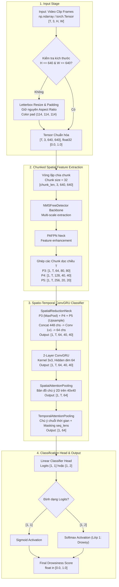
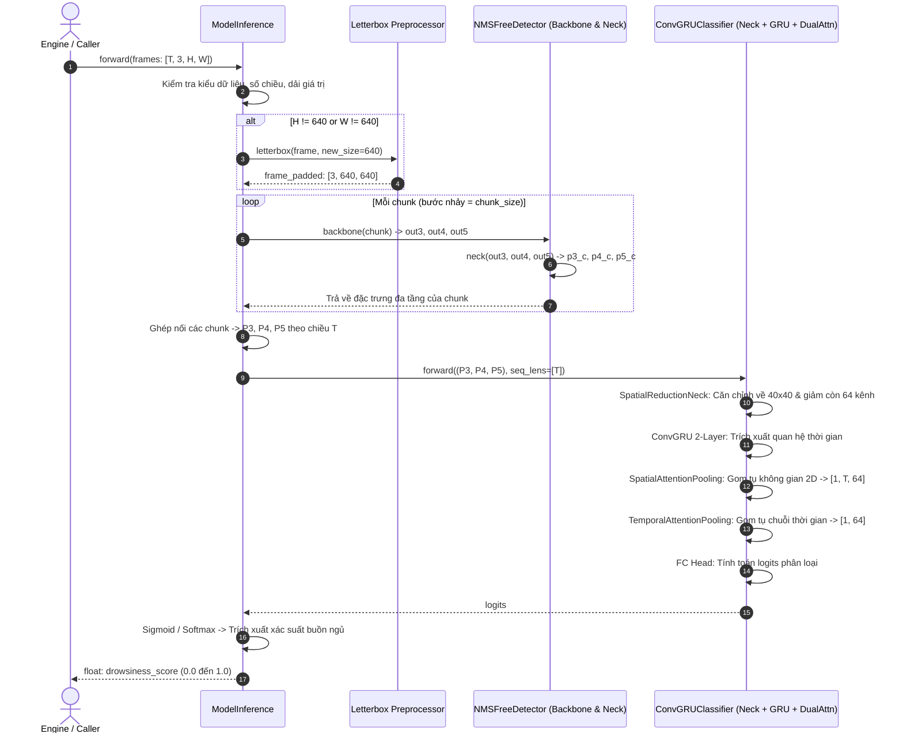

# TÀI LIỆU PHÂN TÍCH YÊU CẦU: TÀI LIỆU HÓA, SƠ ĐỒ HÓA VÀ ĐẶC TẢ LUỒNG MÔ HÌNH MODELINFERENCE

- **Mã yêu cầu**: `DOCS_MODEL_INFERENCE`
- **Tệp phân tích**: `docs/analsys/analsys_model_inference.md`
- **Mục tiêu**: Phân tích toàn diện kiến trúc, các luồng tensor (Tensor Dataflow), cơ chế vận hành, và thiết kế hệ thống tài liệu kỹ thuật + sơ đồ trực quan (Mermaid diagrams, Flowcharts, Sequence Diagrams) cho lớp suy luận đầu-cuối `ModelInference` tại tệp `model_inference.py`.
- **Trạng thái**: Đang chờ người dùng phê duyệt (Bước 1 theo quy trình chuẩn `AGENTS.md`).

---

## 1. YÊU CẦU CỐT LÕI TỪ NGƯỜI DÙNG

Người dùng yêu cầu:
> *"tạo tài liệu, sơ đồ, luồng của model ModelInference ở file @[model_inference.py]"*

### 1.1. Phân rã mục tiêu kỹ thuật
1. **Khảo sát & Phân tích chi tiết lớp `ModelInference`**:
   - Phân tích vai trò của `ModelInference` như một bộ suy luận đầu-cuối (End-to-End Inference Engine) tích hợp giữa mạng thị giác không gian đa tỷ lệ (CNN Backbone + PAFPN Neck từ `NMSFreeDetector`) và mạng chuỗi không gian - thời gian (`ConvGRUClassifier`).
   - Làm rõ cơ chế tiếp nhận đầu vào video thô linh hoạt (numpy ndarray hoặc torch tensor, uint8 hoặc float32, kích thước bất kỳ tự động letterbox về $640 \times 640$).
   - Phân tích cơ chế chia chunk xử lý không gian (`chunk_size`) giúp tối ưu bộ nhớ VRAM khi xử lý các chuỗi video dài.
   - Phân tích luồng tổng hợp đặc trưng không gian đa tầng $P3, P4, P5$ và cơ chế chú ý kép (Dual Attention: Spatial + Temporal) trước khi đưa ra điểm số xác suất ngủ gật cuối cùng.

2. **Xây dựng hệ thống sơ đồ kỹ thuật trực quan (Visual & Flow Diagrams)**:
   - **Sơ đồ kiến trúc tổng thể (High-Level Architecture Diagram)**: Thể hiện mối quan hệ giữa các module cấp cao (Input Video -> Letterbox Preprocessing -> Chunked CNN Extractor -> Multi-Scale Fusion -> Spatio-Temporal ConvGRU -> Dual Attention -> FC Head -> Probability Score).
   - **Sơ đồ chi tiết luồng biến đổi Tensor (Detailed Tensor Shape Flowchart)**: Mô tả chính xác kích thước (shape), kiểu dữ liệu (dtype), dải giá trị (range) và thiết bị (device) tại từng nút trung gian.
   - **Sơ đồ tuần tự xử lý theo Chunk (Chunked Execution Sequence Flow)**: Trực quan hóa vòng lặp `for chunk in sequence` giải phóng áp lực bộ nhớ GPU.
   - **Sơ đồ logic kiểm tra điều kiện & tiền xử lý (Validation & Decision Flowchart)**: Thể hiện cây quyết định kiểm tra tính hợp lệ của input (dimension check, channel check, range check, letterbox aspect ratio padding logic).

3. **Thiết kế tài liệu kỹ thuật hoàn chỉnh (Technical Specification Document)**:
   - Soạn thảo cấu trúc tài liệu chi tiết, chuẩn hóa tài liệu theo định dạng Markdown chuẩn kỹ thuật cho hệ thống Driver Guardian AI.
   - Bổ sung tài liệu tham chiếu API (API Reference) đầy đủ cho các hàm và phương thức: `__init__`, `from_checkpoint`, `forward`, `letterbox`.
   - Cung cấp hướng dẫn sử dụng nhanh (Quickstart Guide), các trường hợp mẫu (Edge cases, Streaming mode, Batch mode) và bảng thông số cấu hình tối ưu.

---

## 2. KHẢO SÁT HIỆN TRẠNG MÃ NGUỒN `model_inference.py`

### 2.1. Cấu trúc tổng quan tệp `model_inference.py`
Tệp gồm hai thành phần cốt lõi:
1. `class ModelInference(nn.Module)`: Lớp đóng gói mô hình suy luận chính.
2. `def letterbox(...)`: Hàm căn chỉnh và đệm viền ảnh giữ nguyên tỷ lệ khung hình.

### 2.2. Thành phần và cơ chế hoạt động của `ModelInference`

#### A. Khởi tạo (`__init__` & `from_checkpoint`)
- **Tự động tải Checkpoint**:
  - Hỗ trợ truyền trực tiếp đối tượng mô hình (`cnn_model`, `conv_gru_model`) hoặc đường dẫn checkpoint (`cnn_path`, `conv_gru_path`).
  - Nếu mô hình chưa được khởi tạo, tự động nạp thông qua classmethod:
    - `ConvGRUClassifier.from_checkpoint(conv_gru_path, map_location=...)`
    - `NMSFreeDetector.from_checkpoint(cnn_path, map_location=..., eval_mode=True)`
- **Tách lọc thành phần trích xuất đặc trưng**:
  - `self.cnn_backbone = self.cnn_model.backbone.eval()`
  - `self.cnn_neck = self.cnn_model.neck.eval()`
  - **Lưu ý quan trọng**: Lớp `DetectHead` của mô hình phát hiện vật thể không được sử dụng ở đây, giúp tiết kiệm đáng kể thời gian tính toán và tài nguyên GPU.
- **Cấu hình thiết bị và Chunking**:
  - Hỗ trợ linh hoạt `cuda` hoặc `cpu`.
  - Tham số `chunk_size` (mặc định = 32) quyết định số lượng frame tối đa đưa vào CNN trong một lượt chạy, ngăn chặn hoàn toàn lỗi CUDA Out-Of-Memory (OOM) khi xử lý video dài (ví dụ $T = 64, 128$).

#### B. Tiền xử lý & Kiểm tra điều kiện đầu vào (`forward`)
- **Đa dạng kiểu dữ liệu đầu vào**:
  - Chấp nhận cả `np.ndarray` và `torch.Tensor`.
  - Tự động kiểm tra số chiều: bắt buộc 4 chiều `[T, 3, H, W]`.
  - Kiểm tra tính hợp lệ: $T > 0$, $H > 0$, $W > 0$, số kênh màu $C = 3$.
  - Kiểm tra miền giá trị: chấp nhận `torch.uint8` [0, 255] hoặc số thực hữu hạn (finite float) [0.0, 1.0].
- **Cơ chế Letterbox tự động**:
  - Nếu $H \ne 640$ hoặc $W \ne 640$ (ví dụ camera gửi về frame kích thước $224 \times 224$ hoặc $1920 \times 1080$), hệ thống tự động gọi hàm `letterbox()` cho từng frame.
  - Tỷ lệ khung hình được giữ nguyên, phần còn thiếu được đệm màu xám tiêu chuẩn `(114, 114, 114)`.
  - Đầu ra sau letterbox được đảm bảo có shape cố định `[T, 3, 640, 640]`.

#### C. Trích xuất đặc trưng CNN theo từng khối (Chunked CNN Extraction)
- Duyệt qua chuỗi video với bước nhảy `chunk_size`:
  $$\text{chunk} = x[i : i + \text{chunk\_size}]$$
- Chuyển dữ liệu sang GPU với cờ `non_blocking=True` để tăng tốc độ nạp dữ liệu.
- Chuẩn hóa tensor: nếu dữ liệu là `uint8`, tự động chia cho 255.0 để đưa về dải $[0.0, 1.0]$.
- Đưa qua `cnn_backbone(chunk)` và `cnn_neck(...)`:
  - $P3$: Độ phân giải $80 \times 80$, số kênh 64.
  - $P4$: Độ phân giải $40 \times 40$, số kênh 128.
  - $P5$: Độ phân giải $20 \times 20$, số kênh 256.
- Ghép nối các chunk lại dọc theo chiều thời gian ($T$):
  - $P3 \in \mathbb{R}^{1 \times T \times 64 \times 80 \times 80}$
  - $P4 \in \mathbb{R}^{1 \times T \times 128 \times 40 \times 40}$
  - $P5 \in \mathbb{R}^{1 \times T \times 256 \times 20 \times 20}$

#### D. Xử lý không gian - thời gian (`ConvGRUClassifier`)
- Đầu vào: Bộ ba đặc trưng $(P3, P4, P5)$ kèm vector độ dài chuỗi $\text{seq\_lens} = [T]$.
- **SpatialReductionNeck**:
  - Căn chỉnh không gian về kích thước đồng nhất $40 \times 40$:
    - $P3$: MaxPool2d (stride=2) $\rightarrow [64, 40, 40]$
    - $P4$: Giữ nguyên $\rightarrow [128, 40, 40]$
    - $P5$: Bilinear Upsample ($2\times$) $\rightarrow [256, 40, 40]$
  - Nối kênh (Concat): $64 + 128 + 256 = 448$ kênh.
  - Tích chập $1 \times 1$ + BatchNorm2d + SiLU: Nén 448 kênh xuống 64 kênh $\rightarrow [T, 64, 40, 40]$.
- **ConvGRU (2 tầng, Kernel 3x3)**:
  - Lan truyền thông tin trạng thái ẩn qua $T$ bước thời gian, bảo toàn thông tin không gian 2D trên bản đồ đặc trưng $40 \times 40$.
- **SpatialAttentionPooling**:
  - Học ma trận trọng số không gian $\alpha_t(x, y)$ tại mỗi frame $t$.
  - Gom tụ có trọng số qua tích phân bề mặt $40 \times 40 \rightarrow$ vector đặc trưng $[T, 64]$.
- **TemporalAttentionPooling**:
  - Sử dụng Dynamic Attention Masking dựa trên $\text{seq\_lens}$ để triệt tiêu frame rác/padding.
  - Tính trọng số thời gian $\beta_t$ cho từng frame $t \in [1, T]$.
  - Gom tụ có trọng số qua toàn bộ clip $\rightarrow$ vector đặc trưng duy nhất $[1, 64]$.
- **Classification Head & Tính xác suất**:
  - Lớp Linear ánh xạ sang logits (shape $[1, 1]$ hoặc $[1, 2]$).
  - Áp dụng `torch.sigmoid(logits)` (nếu 1 output) hoặc `F.softmax(logits, dim=-1)` (nếu 2 outputs).
  - Trích xuất điểm xác suất buồn ngủ của tài xế $\in [0.0, 1.0]$.

---

## 3. THIẾT KẾ HỆ THỐNG SƠ ĐỒ KỸ THUẬT (DIAGRAM ARCHITECTURE)

Trong tài liệu kỹ thuật chính thức, chúng tôi sẽ xây dựng 4 sơ đồ trực quan định dạng Mermaid Markdown:

### 3.1. Sơ đồ 1: Luồng kiến trúc tổng thể (High-Level Architecture Pipeline)

### 3.2. Sơ đồ 2: Sơ đồ chi tiết chuyển đổi kích thước Tensor (Tensor Shape Lifecycle)
Bảng và đồ họa thể hiện hành trình của Tensor qua từng lớp:

| Bước xử lý | Tên Module / Phép toán | Kích thước đầu vào (Shape In) | Kích thước đầu ra (Shape Out) | Kiểu dữ liệu | Thiết bị |
| :--- | :--- | :--- | :--- | :--- | :--- |
| **0. Raw Input** | User Input | `[T, 3, H, W]` | `[T, 3, H, W]` | `uint8` hoặc `float` | CPU / GPU |
| **1. Letterbox** | `letterbox()` | `[T, 3, H, W]` | `[T, 3, 640, 640]` | `uint8` hoặc `float` | CPU |
| **2. Cast & Norm** | `.float() / 255.0` | `[T, 3, 640, 640]` | `[T, 3, 640, 640]` | `torch.float32` [0, 1] | GPU |
| **3. Chunk Slice** | Slicing `[i : i+chunk]` | `[T, 3, 640, 640]` | `[chunk_T, 3, 640, 640]` | `torch.float32` | GPU |
| **4. CNN Backbone**| `self.cnn_backbone` | `[chunk_T, 3, 640, 640]` | `out3, out4, out5` | `torch.float32` | GPU |
| **5. CNN PAFPN** | `self.cnn_neck` | `out3, out4, out5` | P3: `[chunk_T, 64, 80, 80]` P4: `[chunk_T, 128, 40, 40]` P5: `[chunk_T, 256, 20, 20]` | `torch.float32` | GPU |
| **6. Temporal Cat** | `torch.cat().unsqueeze(0)` | Các chunks | P3: `[1, T, 64, 80, 80]` P4: `[1, T, 128, 40, 40]` P5: `[1, T, 256, 20, 20]` | `torch.float32` | GPU |
| **7. Spatial Neck** | `SpatialReductionNeck` | `(P3, P4, P5)` | `[1, T, 64, 40, 40]` | `torch.float32` | GPU |
| **8. ConvGRU** | `ConvGRU` (2 layers) | `[1, T, 64, 40, 40]` | `[1, T, 64, 40, 40]` | `torch.float32` | GPU |
| **9. Spatial Attn**| `SpatialAttentionPooling`| `[1, T, 64, 40, 40]` | `[1, T, 64]` | `torch.float32` | GPU |
| **10. Temporal Attn**| `TemporalAttentionPooling`| `[1, T, 64]` + `seq_lens=[T]` | `[1, 64]` | `torch.float32` | GPU |
| **11. Classifier** | `nn.Linear` (FC Head) | `[1, 64]` | `[1, 2]` hoặc `[1, 1]` | `torch.float32` | GPU |
| **12. Score** | `Sigmoid` / `Softmax` | `[1, 2]` hoặc `[1, 1]` | Scalar `float` | Python `float` | CPU |

### 3.3. Sơ đồ 3: Trình tự thời gian và tương tác giữa các thành phần (Sequence Diagram)

---

## 4. ĐỀ XUẤT CẤU TRÚC TÀI LIỆU KỸ THUẬT ĐẦU RA

Sau khi người dùng phê duyệt tài liệu phân tích này và kế hoạch thực hiện, tài liệu kỹ thuật hoàn chỉnh sẽ được tạo tại thư mục `docs/`:
- **Đường dẫn đề xuất**: `docs/spec_model_inference.md`
- **Các phần nội dung chính**:
  1. **Tổng quan mô hình (Executive Summary)**: Mục đích thiết kế, bài toán phát hiện buồn ngủ thời gian thực của Driver Guardian.
  2. **Kiến trúc hệ thống (System Architecture)**:
     - Sơ đồ kiến trúc Mermaid hoàn chỉnh.
     - Phân tích chi tiết từng khối: CNN Feature Extractor vs Spatio-Temporal Classifier.
  3. **Đặc tả luồng dữ liệu & Tensor (Data & Tensor Flow Specification)**:
     - Bảng kích thước tensor qua từng bước.
     - Cơ chế Letterbox và chuẩn hóa miền giá trị.
     - Cơ chế Chunked Inference và tối ưu hóa VRAM.
  4. **Cơ chế Chú ý Kép (Dual Attention Mechanism)**:
     - Toán học và cơ chế hoạt động của `SpatialAttentionPooling` (tập trung vùng mắt/khóe miệng/tư thế đầu).
     - Toán học và cơ chế hoạt động của `TemporalAttentionPooling` (loại bỏ padding, gán trọng số thời điểm quan trọng).
  5. **Đặc tả API chi tiết (API Reference)**:
     - Phương thức `__init__`: Các tham số, cấu hình mặc định, xử lý fallback thiết bị.
     - Phương thức `from_checkpoint`: Cách tải nhanh mô hình từ tệp `.pt`.
     - Phương thức `forward`: Mô tả chi tiết inputs, outputs, exceptions và ràng buộc giá trị.
     - Hàm `letterbox`: Tham số, cách xử lý định dạng HWC / CHW.
  6. **Hướng dẫn sử dụng và Mẫu mã nguồn (Code Examples & Quickstart)**:
     - Sử dụng trong Engine thời gian thực (Camera streaming).
     - Sử dụng đánh giá hàng loạt (Batch video benchmark).
     - Tích hợp và xử lý ngoại lệ (Exception Handling).
  7. **Hiệu năng & Tối ưu hóa (Performance, Latency & Best Practices)**:
     - Phân tích độ trễ (Latency theo từng chunk_size).
     - Tiêu thụ bộ nhớ GPU (VRAM footprint).
     - Khuyến nghị cấu hình chạy thực tế trên xe hơi / Edge devices.

---

## 5. KẾT LUẬN & ĐỀ XUẤT HÀNH ĐỘNG TIẾP THEO

- Tài liệu phân tích này đã làm rõ toàn bộ cấu trúc, luồng hoạt động, cơ chế toán học và đặc tính kỹ thuật của `ModelInference` tại `model_inference.py`.
- **Hành động đề xuất cho Bước 2 (sau khi được phê duyệt)**:
  - Tạo tệp `docs/plan/plan_model_inference.md` để lập kế hoạch chi tiết từng đầu việc biên soạn tài liệu kỹ thuật, thiết kế các sơ đồ đồ họa và rà soát tính toàn vẹn của mã nguồn.
- **Xin ý kiến người dùng**: Người dùng vui lòng xem xét nội dung phân tích trên. Khi người dùng đồng ý, Agent sẽ tiến hành Bước 2 (Lập kế hoạch).
