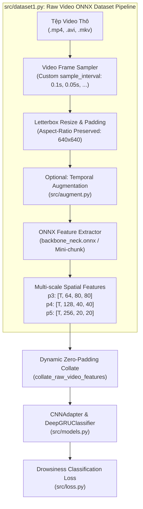

# BÁO CÁO PHÂN TÍCH YÊU CẦU: XÂY DỰNG DATASET NẠP VIDEO THÔ & TRÍCH XUẤT ĐẶC TRƯNG ONNX RUNTIME TRỰC TIẾP

**Mã tài liệu:** `analsys_raw_video_onnx_dataset.md`  
**Dự án:** Hệ Thống Nhận Diện Tài Xế Buồn Ngủ (Driver Guardian - Deep GRU / LSTM)  
**Tệp mục tiêu:** [`src/dataset1.py`](file:///D:/Project/DATN/driver-guardian/ai/LSTM/src/dataset1.py)  
**Mô hình trích xuất:** [`checkpoints/backbone_neck.onnx`](file:///D:/Project/DATN/driver-guardian/ai/LSTM/checkpoints/backbone_neck.onnx)  
**Mô hình hạ tầng:** [`src/models.py`](file:///D:/Project/DATN/driver-guardian/ai/LSTM/src/models.py) (`CNNAdapter`, `DeepGRUClassifier`)  
**Ngày thực hiện:** 03/10/2026  
**Quy chuẩn áp dụng:** [`AGENTS.md`](file:///D:/Project/DATN/driver-guardian/ai/LSTM/AGENTS.md) — Bước 1: Khảo sát & Phân tích (Discovery)  

---

## 1. TỔNG QUAN & MỤC TIÊU NHIỆM VỤ (EXECUTIVE SUMMARY)

### 1.1. Yêu cầu của người dùng
Người dùng yêu cầu tạo tệp [`src/dataset1.py`](file:///D:/Project/DATN/driver-guardian/ai/LSTM/src/dataset1.py) với các mục tiêu cốt lõi:
1. **Đối tượng dữ liệu đầu vào:** Nạp trực tiếp tập dữ liệu chứa **video thô** (raw video files định dạng `.mp4`, `.avi`, `.mkv`...) từ ổ đĩa theo cấu trúc thư mục chuẩn hoặc tệp chỉ mục (manifest CSV/JSON).
2. **Tích hợp ONNX Runtime trực tiếp:** Tích hợp bộ máy suy luận ONNX Runtime (`onnxruntime` / `onnxruntime-gpu`) ngay bên trong luồng dữ liệu của Dataset để trích xuất trực tiếp các bản đồ đặc trưng không gian đa tỷ lệ (`p3`, `p4`, `p5`) từ khung hình video thô mà không cần chạy tiền xử lý trích xuất trước thành file `.h5` hay `.pt`.
3. **Thời gian lấy mẫu tùy chỉnh (Customizable Sampling Time):** Cung cấp tham số cấu hình linh hoạt chu kỳ lấy mẫu khung hình thời gian (`sample_interval`, đơn vị giây, ví dụ 0.1s ~ 10 FPS, 0.05s ~ 20 FPS, 0.2s ~ 5 FPS...) dựa trên FPS gốc của từng video.
4. **Tương thích toàn diện với luồng huấn luyện hiện tại:** Đầu ra của Dataset và hàm gom batch (`collate_fn`) phải tương thích 100% với kiến trúc `CNNAdapter` và `DeepGRUClassifier` trong [`src/models.py`](file:///D:/Project/DATN/driver-guardian/ai/LSTM/src/models.py) thông qua tensor đặc trưng động và tensor `seq_lens`.

### 1.2. So sánh Kiến trúc: Offline Feature Extraction vs. Online Direct Video Dataset

| Tiêu chí | Chế độ Offline HDF5 ([`src/dataset.py`](file:///D:/Project/DATN/driver-guardian/ai/LSTM/src/dataset.py)) | Chế độ Trực tiếp Video Thô ONNX ([`src/dataset1.py`](file:///D:/Project/DATN/driver-guardian/ai/LSTM/src/dataset1.py)) |
| :--- | :--- | :--- |
| **Dữ liệu nguồn** | Tệp HDF5 `.h5` đã trích xuất sẵn (qua `extract_to_pt.py`) | Tệp video thô nguyên bản (`.mp4`, `.avi`, `.mkv`) |
| **Dung lượng lưu trữ đĩa** | Cần hàng chục/trăm GB lưu trữ bản đồ đặc trưng `p3, p4, p5` | Chỉ cần lưu trữ video thô gốc, không tốn thêm dung lượng đĩa |
| **Độ linh hoạt thử nghiệm** | Cố định `sample_interval`, resolution, augmentation | Tùy biến linh hoạt `sample_interval`, augment ngẫu nhiên, thay đổi backbone ONNX ngay lập tức |
| **Tốc độ đọc mỗi epoch** | Cực nhanh (chỉ nạp tensor từ H5 nén vào RAM/GPU) | Phụ thuộc tốc độ decode OpenCV + forward pass ONNX Runtime |
| **Cơ chế tối ưu đề xuất** | Lazy HDF5 file handle + Dynamic padding | **Lazy ONNX Session per-worker + Mini-chunk streaming forward** |
| **Ứng dụng chính** | Huấn luyện quy mô lớn lặp lại nhiều epoch (Final Training) | Thử nghiệm nhanh, tinh chỉnh siêu tham số chu kỳ lấy mẫu, kiểm thử suy luận End-to-End |



---

## 2. KHẢO SÁT & PHÂN TÍCH KỸ THUẬT CHI TIẾT

### 2.1. Cấu trúc Thư mục Video Đầu vào (Dataset Discovery)
Theo đặc tả trong [`docs/struct_dataset.md`](file:///D:/Project/DATN/driver-guardian/ai/LSTM/docs/struct_dataset.md) và cấu hình [`configs/config.py`](file:///D:/Project/DATN/driver-guardian/ai/LSTM/configs/config.py), hệ thống hỗ trợ 3 phương thức quét/nạp dữ liệu video thô:
1. **Quét thư mục phân tầng (Hierarchical Directory Scan):**
   ```text
   dataset_dir/
   ├── train/
   │   ├── 0_alert/    -> Các tệp video nhãn 0 (.mp4, .avi, .mkv)
   │   └── 1_drowsy/   -> Các tệp video nhãn 1 (.mp4, .avi, .mkv)
   └── val/
       ├── 0_alert/    -> Video kiểm định nhãn 0
       └── 1_drowsy/   -> Video kiểm định nhãn 1
   ```
2. **Đọc qua tệp Manifest (CSV / JSON):**
   - Hỗ trợ các tệp tra cứu như `dataset_merged_split.csv`, `dataset_manifest.csv` hoặc file JSON ánh xạ với các trường: `video_id`, `path`, `split` (train/val), `label` (0/1), `source_dataset`, `subject_id`.
3. **Thư mục phẳng kèm bộ chia tập (Flat Folder with Auto Split):**
   - Tự động chia train/val theo tỷ lệ (`train_ratio=0.8`) hoặc gom theo đối tượng (`split_by_subject=True`).

### 2.2. Cơ chế Giải mã Video & Lấy mẫu Khung hình Thời gian Tùy chỉnh (Temporal Sampling)
Khi đọc video thô từ OpenCV (`cv2.VideoCapture`), mỗi video có thể có FPS gốc khác nhau (vd: 25 FPS, 30 FPS, 60 FPS). Để mô hình LSTM/GRU học các đặc trưng biến thiên theo thời gian thực tế (chớp mắt, ngáp, gật đầu), tần số lấy mẫu phải được chuẩn hóa:

1. **Chu kỳ lấy mẫu tùy chỉnh (`sample_interval`):**
   - Người dùng có thể cấu hình `sample_interval` tùy ý (mặc định `0.1` giây, tương ứng $10$ FPS mục tiêu).
   - Bước nhảy chỉ số khung hình (stride step) được tính toán tự động dựa trên FPS gốc:
     $$\text{step} = \max\left(1, \text{round}(\text{fps} \times \text{sample\_interval})\right)$$
   - Ví dụ: 
     - Video 30 FPS với `sample_interval = 0.1s` $\rightarrow \text{step} = 3$ (lấy các frame 0, 3, 6, 9...).
     - Video 60 FPS với `sample_interval = 0.1s` $\rightarrow \text{step} = 6$.
     - Video 25 FPS với `sample_interval = 0.05s` (20 FPS) $\rightarrow \text{step} = \max(1, \text{round}(25 \times 0.05)) = 1$.

2. **Letterbox Image Resizing (Bảo toàn Tỷ lệ Khung hình):**
   - Khung hình video gốc thường có tỷ lệ 16:9 ($1920 \times 1080$, $1280 \times 720$) hoặc 4:3.
   - Resize đơn thuần bằng giãn hình (stretch) sẽ bóp méo khuôn mặt, làm biến dạng tỷ lệ mở mắt EAR và mở miệng MAR.
   - Sử dụng thuật toán `letterbox`: Giữ nguyên tỷ lệ gốc, scale cạnh lớn nhất về $640$, thêm padding màu trung tính $(114, 114, 114)$ vào 2 bên hoặc trên dưới để đạt đúng kích thước $(640, 640)$ theo chuẩn của `backbone_neck.onnx`.

3. **Cắt lát Cửa sổ Thời gian (Temporal Windowing):**
   - Nếu tham số `seq_len` được chỉ định (vd: `seq_len = 120` tương ứng 12 giây):
     - **Tập train:** Cắt ngẫu nhiên một lát cắt độ dài `seq_len` (`window_sampling="random"`).
     - **Tập val:** Cắt chính giữa chuỗi (`window_sampling="center"`).
     - Nếu video ngắn hơn `seq_len`: Giữ nguyên toàn bộ video để hàm `collate_fn` tự động zero-padding hoặc lặp lại frame.
   - Nếu `seq_len = None`: Giữ nguyên toàn bộ chuỗi khung hình thực tế của video.

### 2.3. Tích hợp Mô hình Trích xuất Đặc trưng ONNX Runtime
Mô hình [`checkpoints/backbone_neck.onnx`](file:///D:/Project/DATN/driver-guardian/ai/LSTM/checkpoints/backbone_neck.onnx) là mạng Backbone kết hợp PAFPN Neck:
- **Tên cổng đầu vào (Input):** `images` có kích thước động `[batch_size, 3, 640, 640]`, kiểu dữ liệu `float32`, chuẩn hóa về $[0.0, 1.0]$.
- **Tên cổng đầu ra (Outputs):**
  1. `p3`: Bản đồ đặc trưng không gian độ phân giải cao `[batch_size, 64, 80, 80]`.
  2. `p4`: Bản đồ đặc trưng không gian trung bình `[batch_size, 128, 40, 40]`.
  3. `p5`: Bản đồ đặc trưng ngữ nghĩa mức cao `[batch_size, 256, 20, 20]`.

#### Kỹ thuật Chia nhỏ Mini-Chunk (Streaming Mini-Chunk Inference):
Một video clip 10 giây có thể có $T = 100$ khung hình. Nếu đưa cùng lúc $100$ khung hình kích thước $640 \times 640 \times 3$ vào ONNX Runtime trên GPU, bộ nhớ kích hoạt (activation memory) có thể vượt quá $4 \text{GB} - 6 \text{GB}$ VRAM, gây lỗi tràn bộ nhớ (CUDA Out of Memory).
- **Giải pháp:** Xử lý theo từng mini-chunk kích thước nhỏ (mặc định `chunk_size = 16`).
- Ghép nối các tensor chunk dọc theo trục thời gian $T$ sau khi suy luận.
- Hỗ trợ kiểu dữ liệu `torch.float32` hoặc `torch.float16` để tối ưu bộ nhớ.

---

## 3. CÁC THÁCH THỨC KỸ THUẬT TRỌNG YẾU & GIẢI PHÁP TRIỂN KHAI

### 3.1. Thách thức 1: Xung đột Multi-processing & Serialization trong PyTorch DataLoader (CRITICAL)
- **Bản chất vấn đề:** 
  Đối tượng `onnxruntime.InferenceSession` là một đối tượng C++ (PyBind11 binding). Đối tượng này **KHÔNG THỂ pickle** (`TypeError: cannot pickle 'onnxruntime.capi.onnxruntime_pybind11_state.InferenceSession' object`).
  Khi sử dụng PyTorch `DataLoader` với `num_workers > 0` (đặc biệt trên Windows sử dụng phương thức khởi tạo tiến trình `spawn`), PyTorch sẽ tuần tự hóa (serialize/pickle) toàn bộ instance của `Dataset` để gửi sang các tiến trình con (worker processes). Nếu `InferenceSession` được khởi tạo trong `__init__`, chương trình sẽ sụp đổ ngay lập tức trước khi bắt đầu nạp dữ liệu!
- **Giải pháp thiết kế:**
  1. **Lazy Session Initialization (Khởi tạo Trễ theo Tiến trình):**
     - Trong `__init__`, chỉ lưu trữ các tham số cấu hình: `onnx_model_path`, `device`, `providers`, `chunk_size`, `use_fp16`. Đặt thuộc tính `self._onnx_extractor = None`.
     - Chỉ khởi tạo thực thể `InferenceSession` bên trong hàm nội bộ `_get_extractor()` khi worker process gọi `__getitem__` lần đầu tiên.
     - Triệt tiêu 100% lỗi pickle/serialization trên cả Windows và Linux!
  2. **Worker Init Hook:** Cung cấp hàm `worker_init_fn` để cấu hình seed ngẫu nhiên độc lập cho từng worker process.

### 3.2. Thách thức 2: VRAM Throttling & Đụng độ CUDA Context
- **Bản chất vấn đề:**
  Nếu `DataLoader` chạy với `num_workers = 4` và tất cả các worker đều khởi tạo `InferenceSession` trên cùng một GPU (`CUDAExecutionProvider`), mỗi worker process sẽ chiếm dụng một phần VRAM của GPU và tranh chấp CUDA runtime context, dễ dẫn đến nghẽn (bottleneck) hoặc lỗi OOM.
- **Giải pháp thiết kế:**
  - Cung cấp cơ chế cấu hình Execution Providers linh hoạt:
    - Chế độ khuyến nghị khi chạy GPU: Đặt `num_workers = 0` (chạy trực tiếp trên main thread, GPU tận dụng tối đa băng thông mà không tốn chi phí IPC giữa các process).
    - Hoặc cho phép gán provider: `"cuda"` (với `device_id`), `"cpu"`, hoặc tự động phát hiện (`"auto"`).
    - Khi `num_workers > 0` và người dùng muốn tận dụng CPU cho tiền xử lý, có thể cấu hình `provider="cpu"` cho các worker trích xuất đặc trưng, giải phóng toàn bộ VRAM cho việc huấn luyện GRU/LSTM trên GPU!

### 3.3. Quyết định Thiết kế: Thuần Trích xuất Trực tiếp (Pure Streaming Direct Extraction - Loại bỏ Caching)
- **Quyết định thiết kế (Theo yêu cầu người dùng): KHÔNG sử dụng cơ chế Caching (Loại bỏ hoàn toàn RAM Cache & Disk Cache):**
  - Mục đích cốt lõi của [`src/dataset1.py`](file:///D:/Project/DATN/driver-guardian/ai/LSTM/src/dataset1.py) là phục vụ kiểm thử luồng video thô thực tế theo thời gian thực (End-to-End Raw Video Stream Inference & Online Extraction) hoặc các tác vụ huấn luyện/đánh giá không muốn phụ thuộc vào dữ liệu lưu trữ trung gian.
  - Việc loại bỏ cơ chế Caching đem lại các lợi ích:
    1. **Tiết kiệm tuyệt đối bộ nhớ RAM hệ thống:** Không tích tụ hay phình to hàng chục GB tensor qua các epoch.
    2. **Không sinh tệp rác trên ổ cứng:** Tránh việc tạo thư mục cache tạm, ghi/đọc đĩa tốn kém I/O.
    3. **Mã nguồn tinh gọn & Độc lập:** Loại bỏ các hàm quản lý cache phức tạp (`clear_cache`, hash path, stale cache check), giữ pipeline thuần túy không trạng thái ẩn (stateless data pipeline).
  - Khi cần huấn luyện quy mô lớn lặp lại nhiều epoch với tốc độ tối đa, dự án đã có giải pháp chuyên biệt là chế độ nạp HDF5 tiền xử lý sẵn ([`src/dataset.py`](file:///D:/Project/DATN/driver-guardian/ai/LSTM/src/dataset.py)).

### 3.4. Tinh giản Pipeline: Loại bỏ `src/img_preprocess.py` & Tùy chọn Tăng cường Dữ liệu
- **Quyết định thiết kế (Theo yêu cầu người dùng): KHÔNG tích hợp `src/img_preprocess.py`:**
  - Nhằm tối ưu hóa triệt để thông lượng nạp dữ liệu (data loading throughput), loại bỏ hoàn toàn chi phí tính toán CPU của các bộ lọc tăng cường ảnh (như Retinex, CLAHE, Bilateral Filter) trong luồng trích xuất trực tiếp của Dataset.
  - Các khung hình video gốc sau khi giải mã qua OpenCV và letterbox sẽ được chuẩn hóa $[0.0, 1.0]$ và cấp thẳng vào mô hình ONNX Runtime. Module `src/img_preprocess.py` được giữ độc lập cho các tác vụ xử lý ngoại tuyến hoặc bài toán chuyên biệt khác.
- **Tích hợp Tăng cường Dữ liệu Thời gian tùy chọn ([`src/augment.py`](file:///D:/Project/DATN/driver-guardian/ai/LSTM/src/augment.py)):**
  - Hỗ trợ tham số `augmenter`: Nhận instance của `DetectionAugmenter` (tùy chọn, mặc định `None`).
  - Đảm bảo **Temporal Consistency (Tính nhất quán thời gian)**: Khởi tạo cùng 1 seed ngẫu nhiên cho toàn bộ khung hình trong cùng một clip video, giúp bảo toàn tính liên tục của chuyển động đầu và mắt.

### 3.5. Thách thức 5: Gom Batch Động (Dynamic Zero-Padding Collate)
- Vì mỗi video có độ dài thời lượng $T_i$ khác nhau (khi không cố định `seq_len`), các tensor trả về từ `__getitem__` có độ dài $T_i$ không đồng đều.
- Hàm `collate_raw_video_features`:
  - Tìm độ dài cực đại $T_{\max} = \max_i(T_i)$ trong batch.
  - Cấp phát các tensor zero-padded:
    - $\mathbf{P}_3 \in \mathbb{R}^{B \times T_{\max} \times 64 \times 80 \times 80}$
    - $\mathbf{P}_4 \in \mathbb{R}^{B \times T_{\max} \times 128 \times 40 \times 40}$
    - $\mathbf{P}_5 \in \mathbb{R}^{B \times T_{\max} \times 256 \times 20 \times 20}$
  - Trả về đồng thời tensor `seq_lens` $[B]$ ghi nhận độ dài thực tế của từng mẫu để cơ chế Attention Masking của `TemporalAttentionPooling` trong `src/models.py` triệt tiêu 100% ảnh hưởng của các frame padding!

---

## 4. BẢN VẼ THIẾT KẾ MÃ NGUỒN (CODE ARCHITECTURE SPECIFICATION)

### 4.1. Cấu trúc tổng thể của tệp `src/dataset1.py`
Tệp [`src/dataset1.py`](file:///D:/Project/DATN/driver-guardian/ai/LSTM/src/dataset1.py) sẽ được xây dựng theo chuẩn mực Clean Code, Single Responsibility, Type Hints đầy đủ, gồm 6 phân khu chính:

```text
src/dataset1.py
│
├── 1. Imports, Windows UTF-8 & Environment Setup (CUDA, ORT logging)
│
├── 2. Data Structures & Helper Classes
│   ├── RawVideoSample (dataclass lưu metadata video: path, label, split, duration, fps...)
│   └── letterbox() (hàm resize giữ nguyên aspect ratio chuẩn 640x640)
│
├── 3. ONNX Feature Extractor Engine
│   └── ONNXRawFeatureExtractor
│       ├── __init__(model_path, device, chunk_size, use_fp16)
│       ├── _init_session() (Lazy loading session an toàn đa tiến trình)
│       └── extract_features(frames_rgb) -> (p3, p4, p5)
│
├── 4. PyTorch Dataset Implementation
│   └── RawVideoONNXDataset(Dataset)
│       ├── __init__(dataset_dir, split, sample_interval, seq_len, ...)
│       ├── _discover_samples() (Quét thư mục hoặc manifest CSV/JSON)
│       ├── _sample_and_preprocess_video(video_path) -> List[np.ndarray]
│       ├── __len__()
│       └── __getitem__(idx) -> ((p3, p4, p5), label, seq_len, meta)
│
├── 5. Collate Function & DataLoader Factory
│   ├── collate_raw_video_features(batch) -> ((b_p3, b_p4, b_p5), b_lbl, b_len, b_meta)
│   └── build_raw_video_dataloaders(dataset_dir, train_cfg, ...)
│
└── 6. Verification & Self-Contained Unit Tests (if __name__ == "__main__")
    ├── Test 1: Tạo video mock đa FPS qua cv2.VideoWriter
    ├── Test 2: Kiểm thử giải mã & lấy mẫu với các sample_interval tùy biến (0.1s, 0.05s, 0.2s)
    ├── Test 3: Trích xuất đặc trưng ONNX Runtime (p3, p4, p5 shapes)
    ├── Test 4: Dynamic Zero-Padding Collate & Seq Lens
    ├── Test 5: End-to-End Forward & Backward Pass với CNNAdapter & DeepGRUClassifier
    └── Cleanup môi trường tạm
```

### 4.2. Đặc tả giao diện Lớp `RawVideoONNXDataset`

```python
class RawVideoONNXDataset(Dataset):
    """
    PyTorch Dataset nạp video thô và trích xuất đặc trưng không gian đa tỷ lệ
    (p3, p4, p5) trực tiếp qua mô hình ONNX Runtime.

    Args:
        dataset_dir: Thư mục chứa video hoặc đường dẫn manifest CSV/JSON.
        split: Phân vùng dữ liệu ("train", "val", hoặc "all").
        sample_interval: Chu kỳ thời gian lấy mẫu khung hình (giây), mặc định 0.1s (~10 FPS).
        seq_len: Số lượng khung hình cố định (None = lấy trọn vẹn video clip).
        onnx_model_path: Đường dẫn tệp mô hình ONNX (mặc định "checkpoints/backbone_neck.onnx").
        img_size: Kích thước cạnh ảnh sau letterbox (mặc định 640).
        chunk_size: Kích thước mini-chunk khi suy luận ONNX tránh tràn VRAM (mặc định 16).
        device: Thiết bị thực thi ONNX ("cuda", "cpu", hoặc "auto").
        use_fp16: Sử dụng kiểu dữ liệu float16 (tiết kiệm bộ nhớ).
        augmenter: Đối tượng DetectionAugmenter (tùy chọn).
        video_exts: Bộ đuôi file video hợp lệ ('.mp4', '.avi', '.mkv', '.mov').
        window_sampling: Chiến lược cắt lát thời gian ('random' cho train, 'center' cho val).
    """
```

### 4.3. Đặc tả đầu ra của `__getitem__`
Với mỗi chỉ số `idx`, `__getitem__` trả về một tuple 4 thành phần:
1. `features`: `Tuple[torch.Tensor, torch.Tensor, torch.Tensor]` gồm:
   - `p3`: `torch.Tensor` kích thước $[T, 64, 80, 80]$
   - `p4`: `torch.Tensor` kích thước $[T, 128, 40, 40]$
   - `p5`: `torch.Tensor` kích thước $[T, 256, 20, 20]$
2. `label`: `torch.LongTensor` scalar nhãn phân loại (0 hoặc 1).
3. `seq_len`: `torch.LongTensor` scalar độ dài thực tế của chuỗi ($T$).
4. `meta`: `Dict[str, Any]` lưu thông tin truy vết: `video_id`, `video_path`, `orig_fps`, `sample_interval`, `duration_s`.

---

## 5. KẾ HOẠCH KIỂM THỬ & TIÊU CHÍ NGHIỆM THU (TEST PLAN & ACCEPTANCE CRITERIA)

### 5.1. Kế hoạch kiểm thử (Test Cases)
Để đảm bảo tính độc lập và sẵn sàng chạy ngay trên môi trường bất kỳ, một bộ test mock đầy đủ sẽ được nhúng trong khối `if __name__ == "__main__":` của [`src/dataset1.py`](file:///D:/Project/DATN/driver-guardian/ai/LSTM/src/dataset1.py):
1. **Test Khởi tạo Video Mock đa tần số:** Sinh 2 video clip giả lập (`.mp4`) bằng `cv2.VideoWriter` với FPS khác nhau (30 FPS và 20 FPS).
2. **Test Chu kỳ Lấy mẫu Tùy chỉnh (`sample_interval`):**
   - Lấy mẫu với `sample_interval = 0.1s`: Video 2.0s 30 FPS sinh ra đúng ~20 khung hình.
   - Lấy mẫu với `sample_interval = 0.2s`: Video 2.0s 30 FPS sinh ra đúng ~10 khung hình.
3. **Test Trích xuất Đặc trưng ONNX Trực tiếp:**
   - Đảm bảo đầu ra có đúng 3 tensor: `p3` $[T, 64, 80, 80]$, `p4` $[T, 128, 40, 40]$, `p5` $[T, 256, 20, 20]$.
4. **Test Dynamic Zero-Padding Collate:**
   - Gom batch 2 video có độ dài lệch nhau ($T_1 \ne T_2$), xác nhận tensor batch có shape $[2, T_{\max}, C, H, W]$ và các vị trí padding ngoài $T_i$ có giá trị đúng bằng $0.0$.
5. **Test Forward & Backward End-to-End:**
   - Nạp một batch trực tiếp vào `CNNAdapter` và `DeepGRUClassifier` từ [`src/models.py`](file:///D:/Project/DATN/driver-guardian/ai/LSTM/src/models.py).
   - Xác nhận forward sinh logits $[B, 2]$, loss không NaN, và gradient lan truyền ngược thành công qua toàn bộ mạng.

### 5.2. Tiêu chuẩn tuân thủ Checklist chất lượng (AGENTS.md)
- [x] Sử dụng `pathlib.Path` cho toàn bộ thao tác đường dẫn, tương thích hoàn toàn Windows/Linux.
- [x] Áp dụng Lazy Initialization cho ONNX Runtime để loại trừ 100% lỗi serialization trong multi-processing.
- [x] Type Hints và Docstrings chi tiết theo chuẩn Google Python Style.
- [x] Tích hợp cơ chế dọn dẹp tài nguyên tệp video và bộ nhớ GPU/CPU an toàn.
- [x] Khối `if __name__ == "__main__":` tự tạo dữ liệu mock và tự dọn dẹp sạch sẽ sau khi hoàn tất.

---

## 6. KẾT LUẬN & ĐỀ XUẤT TIẾP THEO

Báo cáo phân tích đã xác định rõ ràng yêu cầu, kiến trúc hệ thống, các rủi ro kỹ thuật (đặc biệt là vấn đề pickle ONNX Session khi dùng đa tiến trình) và phương án giải quyết tối ưu cho [`src/dataset1.py`](file:///D:/Project/DATN/driver-guardian/ai/LSTM/src/dataset1.py).

> [!IMPORTANT]
> **Yêu cầu phê duyệt từ Người dùng (User Approval):**  
> Theo quy chuẩn làm việc tại **Mục 5 của [`AGENTS.md`](file:///D:/Project/DATN/driver-guardian/ai/LSTM/AGENTS.md)**:
> - **Bước 1 (Discovery):** Hoàn thành tài liệu phân tích `analsys_raw_video_onnx_dataset.md`.
> - **Bước 2 (Planning):** Chỉ được thực hiện tạo `../plan/plan_raw_video_onnx_dataset.md` khi người dùng đã xem xét và đồng ý với nội dung phân tích này.
>
> Kính mời bạn xem xét bản phân tích trên. Nếu bạn đồng ý, tôi sẽ tiến hành **Bước 2: Lập kế hoạch chi tiết (`../plan/plan_raw_video_onnx_dataset.md`)**.
