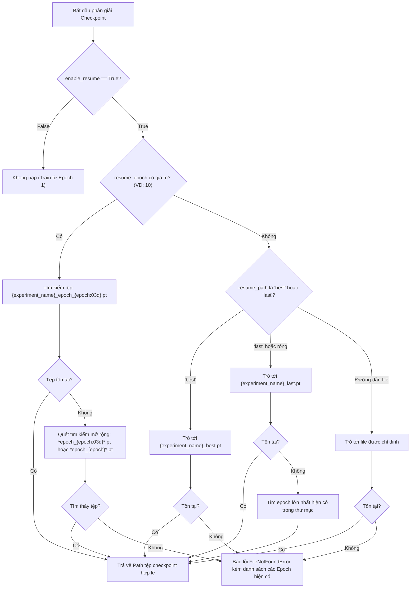

# BÁO CÁO PHÂN TÍCH YÊU CẦU: CƠ CHẾ NẠP LẠI TỪ MỘT EPOCH & LƯU CHECKPOINT TẤT CẢ CÁC EPOCH

**Mã tài liệu:** `analsys_resume_epoch_checkpoint.md`  
**Dự án:** Hệ Thống Nhận Diện Tài Xế Buồn Ngủ (Driver Guardian - Deep GRU / LSTM)  
**Tệp mục tiêu:** [`src/train.py`](file:///D:/Project/DATN/driver-guardian/ai/LSTM/src/train.py), [`configs/config.py`](file:///D:/Project/DATN/driver-guardian/ai/LSTM/configs/config.py), [`configs/config.yaml`](file:///D:/Project/DATN/driver-guardian/ai/LSTM/configs/config.yaml)  
**Ngày thực hiện:** 03/10/2026 (Cập nhật theo góp ý của Người dùng)  
**Quy chuẩn áp dụng:** [`AGENTS.md`](file:///D:/Project/DATN/driver-guardian/ai/LSTM/AGENTS.md) — Bước 1: Khảo sát & Phân tích (Discovery)  

---

## 1. TỔNG QUAN YÊU CẦU CỦA NGƯỜI DÙNG

Người dùng yêu cầu bổ sung các tính năng cốt lõi cho pipeline huấn luyện trong [`src/train.py`](file:///D:/Project/DATN/driver-guardian/ai/LSTM/src/train.py), đồng thời quản lý tập trung qua cấu hình [`configs/config.py`](file:///D:/Project/DATN/driver-guardian/ai/LSTM/configs/config.py) và [`configs/config.yaml`](file:///D:/Project/DATN/driver-guardian/ai/LSTM/configs/config.yaml):

1. **Cơ chế Bật/Tắt nạp lại (Toggle Resume) trong Config:**
   - Cần có **tham số dạng cờ bật/tắt boolean rõ ràng** trong config (ví dụ: `enable_resume: bool = False` hoặc `resume_training: bool = False`) để quyết định việc có nạp lại từ checkpoint/epoch hay không.
   - Khi cờ này là `False`: Pipeline **luôn huấn luyện từ đầu (Epoch 1)** một cách an toàn, ngăn ngừa việc vô tình nạp đè checkpoint khi người dùng muốn chạy thí nghiệm mới.
   - Khi cờ này là `True`: Pipeline sẽ kích hoạt cơ chế nạp lại dựa trên số epoch chỉ định (`resume_epoch`) hoặc checkpoint gần nhất (`last.pt`).

2. **Cơ chế nạp lại từ 1 Epoch bất kỳ (Resume from Specific Epoch):**
   - Bổ sung tham số chỉ định số epoch cụ thể: `resume_epoch: Optional[int] = None` (ví dụ: `resume_epoch: 10`).
   - Tự động tìm kiếm, phân giải tệp checkpoint tương ứng với epoch đó, nạp trọng số mô hình, trạng thái optimizer, scheduler, scaler và tiếp tục huấn luyện liền mạch từ epoch kế tiếp (`resume_epoch + 1`).

3. **Lưu Checkpoint cho tất cả các Epoch (Save All Epoch Checkpoints):**
   - Bổ sung cờ cấu hình `save_all_epochs: bool = True` (mặc định bật).
   - Mỗi epoch hoàn thành đều lưu độc lập thành một tệp `{experiment_name}_epoch_{epoch:03d}.pt`, không tự động xóa bất kỳ epoch nào.

---

## 2. KHẢO SÁT & ĐÁNH GIÁ HIỆN TRẠNG (AS-IS ARCHITECTURE)

Qua rà soát chi tiết mã nguồn trong [`src/train.py`](file:///D:/Project/DATN/driver-guardian/ai/LSTM/src/train.py) và cấu hình [`configs/config.py`](file:///D:/Project/DATN/driver-guardian/ai/LSTM/configs/config.py):

### 2.1. Về cơ chế cấu hình Resume hiện tại
- Trong [`configs/config.py`](file:///D:/Project/DATN/driver-guardian/ai/LSTM/configs/config.py#L111) và [`configs/config.yaml`](file:///D:/Project/DATN/driver-guardian/ai/LSTM/configs/config.yaml#L88):
  ```python
  resume: str = ""  # Đường dẫn file checkpoint để huấn luyện tiếp (rỗng = train từ đầu)
  ```
- **Hạn chế 1 (Thiếu cờ bật/tắt tường minh):** Không có cờ boolean `enable_resume` độc lập. Người dùng phải tự xóa trắng chuỗi `resume: ""` nếu không muốn resume, rất dễ nhầm lẫn.
- **Hạn chế 2 (Không hỗ trợ truyền số epoch):** Không có tham số `resume_epoch: Optional[int]`. Nếu muốn load lại Epoch 10, người dùng buộc phải sao chép đường dẫn dài như `checkpoints/experiments/deepgru_h5train_rawval_epoch_010.pt`.
- **Hạn chế 3 (Không có cơ chế tự động tìm checkpoint theo epoch):** Nếu người dùng gõ số `10`, hệ thống coi đó là đường dẫn file và báo lỗi `FileNotFoundError: Không tìm thấy file checkpoint: 10`.

### 2.2. Về cơ chế lưu trữ Checkpoint hiện tại ([`CheckpointManager.step`](file:///D:/Project/DATN/driver-guardian/ai/LSTM/src/train.py#L549-L620))
- Chỉ lưu định kỳ mỗi 5 epoch (`save_ckpt_interval_epochs = 5`).
- Tự động xóa các checkpoint cũ, chỉ giữ lại 3 tệp (`ckpt_keep_last = 3`).
- Checkpoint chỉ được gọi lưu trong nhánh `if val_metrics is not None:`. Nếu epoch không chạy validation thì không được lưu checkpoint.
- Tệp checkpoint thiếu các trường trạng thái quan trọng: `best_epoch`, `patience_counter`, và thứ tự gán `best_score` bị trễ 1 nhịp so với cập nhật kỷ lục mới.

---

## 3. THIẾT KẾ GIẢI PHÁP CHI TIẾT (TO-BE ARCHITECTURE)

### 3.1. Thiết kế Hệ thống Tham số Cấu hình (Configuration Schema)

Trong [`configs/config.py`](file:///D:/Project/DATN/driver-guardian/ai/LSTM/configs/config.py) và [`configs/config.yaml`](file:///D:/Project/DATN/driver-guardian/ai/LSTM/configs/config.yaml), cấu hình phần Checkpoint sẽ được chuẩn hóa:

```python
# ---- CHECKPOINTS, RESUME & EARLY STOPPING CONFIGURATION ----
save_all_epochs: bool = True           # True: Lưu checkpoint tất cả các epoch | False: Lưu định kỳ
save_ckpt_interval_epochs: int = 1     # Khoảng cách epoch giữa các lần lưu (khi save_all_epochs=False)
ckpt_keep_last: Optional[int] = None   # Số checkpoint giữ lại (None hoặc 0 = giữ toàn bộ)
save_best_only: bool = False           # True: Chỉ lưu best checkpoint

# Cơ chế Bật/Tắt nạp lại (Resume Control):
enable_resume: bool = False            # CỜ BẬT/TẮT: True = Cho phép load lại | False = Train mới từ Epoch 1
resume_epoch: Optional[int] = None     # Số epoch cụ thể cần nạp lại (ví dụ: 10, 15,...)
resume_path: str = ""                  # Đường dẫn tệp .pt cụ thể hoặc bí danh ('last', 'best') nếu không dùng resume_epoch
```

#### Ma trận Hành vi theo Cờ `enable_resume`:
| `enable_resume` | `resume_epoch` | `resume_path` | Hành vi của Hệ thống |
| :---: | :---: | :---: | :--- |
| **`False`** | Bất kỳ | Bất kỳ | **Huấn luyện mới từ Epoch 1** (Khởi tạo lại toàn bộ trọng số & optimizer). |
| **`True`** | `10` | Bất kỳ | Tự động phân giải và nạp checkpoint của **Epoch 10**, tiếp tục huấn luyện từ **Epoch 11**. |
| **`True`** | `None` | `"best"` | Nạp checkpoint tốt nhất `{exp}_best.pt`, tiếp tục từ `best_epoch + 1`. |
| **`True`** | `None` | `""` hoặc `"last"` | Tự động tìm checkpoint gần nhất `{exp}_last.pt` (hoặc epoch lớn nhất hiện có) để tiếp tục. |
| **`True`** | `None` | `"path/to/model.pt"` | Nạp tệp checkpoint theo đường dẫn chỉ định. |

---

### 3.2. Thiết kế Bộ Phân Giải Đường Dẫn Thông Minh (`resolve_checkpoint`)

Xây dựng phương thức [`CheckpointManager.resolve_checkpoint(epoch: Optional[int], path_or_alias: Optional[str]) -> Path`](file:///D:/Project/DATN/driver-guardian/ai/LSTM/src/train.py):



- **Thông báo lỗi hướng dẫn người dùng:** Nếu người dùng đặt `resume_epoch = 15` nhưng thư mục chỉ mới có epoch 1 đến 8:
  ```text
  FileNotFoundError: [CheckpointManager] Không tìm thấy checkpoint cho Epoch 15 trong 'checkpoints/experiments'.
  -> Các checkpoint epoch hiện có sẵn: [Epoch 1, Epoch 2, Epoch 3, Epoch 4, Epoch 5, Epoch 6, Epoch 7, Epoch 8]
  -> Gợi ý: Hãy đặt 'resume_epoch' là một trong các epoch trên hoặc đặt 'enable_resume: false' để train từ đầu.
  ```

---

### 3.3. Thiết kế Lưu Checkpoint Tất Cả Các Epoch (`save_all_epochs`)

1. **Quy tắc đặt tên chuẩn:**
   - Mỗi epoch lưu một tệp: `{checkpoint_dir}/{experiment_name}_epoch_{epoch:03d}.pt`.
   - Luôn cập nhật tệp `{checkpoint_dir}/{experiment_name}_last.pt` (ghi đè trạng thái epoch mới nhất).
   - Khi có kỷ lục mới, cập nhật `{checkpoint_dir}/{experiment_name}_best.pt`.
2. **Nội dung lưu trữ toàn diện trong Checkpoint:**
   ```python
   checkpoint_data = {
       "epoch": epoch,
       "best_epoch": self.best_epoch,
       "best_score": self.best_score,
       "patience_counter": self.patience_counter,
       "model_state_dict": model.state_dict(),
       "optimizer_state_dict": optimizer.state_dict(),
       "scheduler_state_dict": scheduler.state_dict() if scheduler else None,
       "scaler_state_dict": scaler.state_dict() if scaler else None,
       "train_metrics": train_metrics,
       "val_metrics": val_metrics,
       "metrics": val_metrics if val_metrics is not None else train_metrics,
       "config": self.config.to_dict(),
       "timestamp": time.strftime("%Y-%m-%d %H:%M:%S")
   }
   ```
3. **Lưu tại mọi Epoch:**
   - Trong hàm `fit()`, việc lưu checkpoint diễn ra cuối mỗi epoch (kể cả khi epoch đó không chạy validation pass do cấu hình `val_interval_epochs > 1`).

---

### 3.4. Thiết kế Khôi phục Trạng thái Huấn luyện & Lịch sử Đo lường

Khi nạp checkpoint thành công:
1. **Khôi phục mô hình:** `model.load_state_dict(checkpoint["model_state_dict"])`.
2. **Khôi phục Optimizer & Scaler:** `optimizer.load_state_dict(...)`, `scaler.load_state_dict(...)`.
3. **Khôi phục LR Scheduler:** `scheduler.load_state_dict(...)`.
4. **Khôi phục điểm số và bộ đếm Early Stopping:**
   - `start_epoch = checkpoint["epoch"] + 1`
   - `best_epoch = checkpoint.get("best_epoch", checkpoint["epoch"])`
   - `best_score = checkpoint.get("best_score", ...)`
   - `patience_counter = checkpoint.get("patience_counter", 0)`
5. **Đồng bộ hóa Lịch sử Visualizer:**
   - Đọc tệp `training_history.csv` hiện tại, lọc giữ lại các dòng có `epoch <= checkpoint["epoch"]`.
   - Nhờ đó, các biểu đồ chẩn đoán `loss_accuracy_curves.png` tiếp tục vẽ nối tiếp từ epoch 1 mà không bị đứt đoạn hay trùng lặp dữ liệu.

---

### 3.5. Kiểm thử Tự động Xác thực (Dry-Run Verification)

Cập nhật hàm `run_dry_run_test()` trong [`src/train.py`](file:///D:/Project/DATN/driver-guardian/ai/LSTM/src/train.py):
1. **Pha 1 (Lưu toàn bộ):** Huấn luyện 2 epochs với `save_all_epochs=True` -> Xác thực sự tồn tại của cả `..._epoch_001.pt` và `..._epoch_002.pt`.
2. **Pha 2 (Bật/Tắt Resume):**
   - Chạy với `enable_resume=False` -> Kiểm tra hệ thống bỏ qua checkpoint cũ và bắt đầu từ Epoch 1.
   - Chạy với `enable_resume=True, resume_epoch=1` -> Kiểm tra hệ thống nạp thành công Epoch 1 và bắt đầu train tiếp từ Epoch 2.

---

## 4. MA TRẬN SO SÁNH TRƯỚC VÀ SAU CẢI TIẾN

| Tiêu chí | Trước cải tiến | Sau cải tiến |
| :--- | :--- | :--- |
| **Cờ Bật/Tắt Resume trong Config** | ❌ Không có (phải xóa trắng chuỗi `resume: ""`) | ✅ Có cờ `enable_resume: bool` tường minh (bật/tắt an toàn) |
| **Chỉ định số Epoch cần Resume** | ❌ Không hỗ trợ (chỉ nhận đường dẫn file tĩnh) | ✅ Hỗ trợ `resume_epoch: int` (vd: `resume_epoch: 10`) |
| **Lưu Checkpoint các Epoch** | ❌ Chỉ lưu mỗi 5 epochs, chỉ giữ 3 file gần nhất | ✅ Lưu mọi epoch riêng biệt `_epoch_001.pt`, `_epoch_002.pt`... |
| **Bảo toàn dữ liệu cũ** | ❌ Bị xóa tự động qua `unlink()` | ✅ Không xóa bất kỳ epoch nào (`save_all_epochs: True`) |
| **Phân giải lỗi Checkpoint** | ❌ Báo lỗi đơn điệu `FileNotFoundError` | ✅ Tự động in danh sách các epoch hiện có trong thư mục |
| **Khôi phục trạng thái Early Stopping**| ❌ Bị reset `patience_counter=0`, gán sai `best_epoch` | ✅ Khôi phục chính xác 100% `best_epoch`, `patience_counter` |
| **Đồng bộ Lịch sử CSV & Đồ thị** | ❌ Bị đứt đoạn đồ thị | ✅ Tự động lọc và đồng bộ lịch sử từ file CSV cũ |

---

## 5. KẾT LUẬN & ĐỀ XUẤT BƯỚC TIẾP THEO

Bản phân tích đã tích hợp đầy đủ và chính xác yêu cầu của người dùng về:
1. **Cờ bật/tắt `enable_resume`** trong file config.
2. **Tham số chỉ định số epoch cần load lại `resume_epoch`**.
3. **Cơ chế lưu trữ toàn bộ các epoch `save_all_epochs`**.

> [!IMPORTANT]
> **Yêu cầu phê duyệt từ Người dùng (User Approval):**  
> Căn cứ theo quy trình làm việc tại **Mục 5 của [`AGENTS.md`](file:///D:/Project/DATN/driver-guardian/ai/LSTM/AGENTS.md)**:
> - **Bước 1 (Discovery):** Đã cập nhật hoàn thiện tài liệu phân tích [`docs/analsys/analsys_resume_epoch_checkpoint.md`](file:///D:/Project/DATN/driver-guardian/ai/LSTM/docs/analsys/analsys_resume_epoch_checkpoint.md).
> - **Bước 2 (Planning):** Sẽ được lập kế hoạch chi tiết ngay sau khi bạn xác nhận đồng ý với bản phân tích này.
>
> Kính mời bạn xem xét nội dung trên. Khi bạn chấp thuận, tôi sẽ chuyển sang **Bước 2: Lên kế hoạch thực hiện (`docs/plan/plan_resume_epoch_checkpoint.md`)**.
