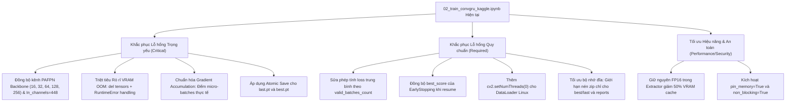

# Báo cáo Phân tích & Đánh giá Chất lượng Mã nguồn: `notebooks/02_train_convgru_kaggle.ipynb`

**Mã tài liệu:** `analsys_review_convgru_kaggle.md`  
**Đối tượng rà soát:** [`notebooks/02_train_convgru_kaggle.ipynb`](file:///D:/Project/DATN/driver-guardian/ai/LSTM/notebooks/02_train_convgru_kaggle.ipynb)  
**Tiêu chuẩn đánh giá:** Code Review & Quality Gates (5 trục: *Correctness, Readability, Architecture, Security, Performance*).  
**Quy chuẩn áp dụng:** [AGENTS.md](file:///D:/Project/DATN/driver-guardian/ai/LSTM/AGENTS.md) — Bước 1: Khảo sát & Phân tích (Discovery).

---

## 1. Bối cảnh & Mục tiêu Đánh giá (Context & Scope)

Tệp [`notebooks/02_train_convgru_kaggle.ipynb`](file:///D:/Project/DATN/driver-guardian/ai/LSTM/notebooks/02_train_convgru_kaggle.ipynb) được xây dựng nhằm cung cấp môi trường huấn luyện độc lập (standalone) cho mô hình không gian - thời gian **`ConvGRUClassifier`** trên nền tảng **Kaggle Notebooks GPU (Tesla T4 / P100 16GB VRAM)**. Notebook tích hợp trích xuất đặc trưng GPU từ trọng số PAFPN của `NMSFreeDetector`, nạp video thô on-the-fly, huấn luyện với Mixed Precision (AMP FP16), cơ chế khôi phục (Resume Training) và đóng gói kết quả.

**Mục tiêu rà soát:**
Kiểm tra toàn diện tất cả các **lỗ hổng tiềm ẩn (bugs, silent failures, tensor mismatches, memory leaks, Kaggle environment pitfalls)** có thể làm sập tiến trình huấn luyện, làm sai lệch gradient/loss hoặc gây suy thoái hiệu năng khi chạy thực tế trên môi trường Kaggle.

---

## 2. Bảng Tổng hợp Phân loại Lỗ hổng (Findings Summary)

| Mức độ | Số lượng | Vấn đề trọng tâm |
|---|:---:|---|
| **Critical** | **4** | (1) Lệch hoàn toàn kích thước kênh PAFPN Backbone & Mismatch trọng số checkpoint gây sập forward pass; (2) Bẫy rò rỉ VRAM khi bắt ngoại lệ CUDA OOM; (3) Sai lệch tỷ trọng Gradient Accumulation cuối epoch & mất gradient khi batch rỗng; (4) Checkpoint không an toàn khi mất kết nối/timeout (thiếu Atomic Save). |
| **Required** | **5** | (1) Tính toán sai lệch Loss trung bình khi có batch bị skip; (2) EarlyStopping mất trạng thái kỷ lục (`best_score`) sau khi Resume; (3) Nguy cơ xung đột luồng OpenCV và tràn `/dev/shm` (2GB) trên Kaggle Linux; (4) Lãng phí VRAM do ép kiểu FP16 $\rightarrow$ FP32 $\rightarrow$ FP16 trong Extractor; (5) Nguy cơ tràn đĩa 20GB `/kaggle/working` khi vừa lưu nhiều checkpoint vừa nén `.zip`. |
| **Consider / Optional** | **4** | (1) Bật `pin_memory = True` và `non_blocking = True` tăng tốc truyền dữ liệu; (2) Bổ sung `try...finally: cap.release()` chống rò rỉ file descriptor video; (3) Khôi phục lịch sử `training_history.csv` khi resume ở session mới; (4) Khuyến cáo an toàn `torch.load(..., weights_only=False)`. |
| **Nit** | **2** | (1) Bổ sung Type Hints và Docstring cho các hàm tiện ích (`collate_video_frames`); (2) Xử lý an toàn Confusion Matrix khi tập Validation có kích thước nhỏ hoặc đơn nhãn. |

---

## 3. Chi tiết Phân tích Lỗ hổng theo 5 Trục Đánh giá

### Trục 1: Tính Đúng đắn & Huấn luyện (Correctness & Training Integrity)

#### 🔴 Lỗ hổng 1.1 [Critical]: Sai lệch Kích thước Kênh PAFPN Backbone & Mismatch Checkpoint làm Sập Forward Pass
- **Vị trí code:** Cell 7, dòng 422–430; kết hợp Cell 10, dòng 606–616 & Cell 11, dòng 694–698.
- **Hiện tượng:**
  Trong Cell 7, phương thức `_load_model()` của `ChunkedBackboneNeckExtractor` hardcode kích thước mạng:
  ```python
  backbone_w = (64, 128, 256, 512, 1024)
  backbone_n = (3, 6, 6, 3)
  neck_n = 3
  c3, c4, c5 = backbone_w[2], backbone_w[3], backbone_w[4]  # c3=256, c4=512, c5=1024
  neck = PAFPN(chs=(c3, c4, c5), n=neck_n)
  ```
  Nhưng trong checkpoint thực tế của dự án (`best.pt` của NMSFreeDetector) và cấu hình chuẩn [`configs/config.yaml`](file:///D:/Project/DATN/driver-guardian/ai/LSTM/configs/config.yaml):
  ```python
  # Metadata thực tế trong best.pt:
  trunk_backbone_w = (16, 32, 64, 128, 256)
  trunk_backbone_n = (1, 2, 2, 1)
  trunk_neck_n = 1
  # => c3=64, c4=128, c5=256 (Tổng kênh: 64 + 128 + 256 = 448)
  ```
- **Hậu quả nghiêm trọng:**
  1. **Lệnh nạp trọng số bị tê liệt:** Khi chạy `model.load_state_dict(filtered_sd, strict=False)`, toàn bộ các trọng số trong checkpoint (với kênh `16, 32, 64...`) bị lệch shape hoàn toàn so với mô hình trong notebook (kênh `64, 128, 256...`). PyTorch sẽ âm thầm bỏ qua hầu hết tất cả các tensor do kích thước không khớp (`size mismatch`), khiến Backbone chạy trên các giá trị trọng số ngẫu nhiên chưa hề được huấn luyện.
  2. **Sập toàn bộ pipeline ở batch đầu tiên (Crash runtime):** Đầu ra của PAFPN trong notebook có số kênh lần lượt là $p_3=256, p_4=512, p_5=1024$. Khi ghép kênh tại `SpatialReductionNeck`, tổng số kênh đưa vào là $256 + 512 + 1024 = 1792$ kênh. Tuy nhiên, `SpatialReductionNeck` được khởi tạo với `in_channels=448`. Mô hình sẽ văng lỗi ngay lập tức:
     `RuntimeError: Given groups=1, weight of size [64, 448, 1, 1], expected input[..., 1792, 40, 40] to have 448 channels, but got 1792 channels instead!`
- **Biện pháp khắc phục (Remedy):**
  - Đồng bộ chuẩn hóa kích thước mạng trong `ChunkedBackboneNeckExtractor`:
    `backbone_w = (16, 32, 64, 128, 256)`, `backbone_n = (1, 2, 2, 1)`, `neck_n = 1`.
  - Hoặc tự động đọc các trường kiến trúc từ `checkpoint.get("metadata", {}).get("architecture")` nếu có trong checkpoint để đảm bảo tương thích tuyệt đối.

---

#### 🔴 Lỗ hổng 1.2 [Critical]: Bẫy Rò rỉ Bộ nhớ VRAM khi Bắt Ngoại lệ CUDA OOM (Memory Leak & Cascading OOM)
- **Vị trí code:** Cell 15, dòng 1269–1274 (`train_epoch`) & dòng 1306–1308 (`validate_epoch`).
- **Hiện tượng:**
  ```python
  except torch.cuda.OutOfMemoryError:
      print(f"[!] Bắt ngoại lệ CUDA OOM tại Batch {batch_idx}. Giải phóng bộ nhớ...")
      torch.cuda.empty_cache()
      self.optimizer.zero_grad()
      continue
  ```
- **Hậu quả:**
  1. Khi ngoại lệ OOM xảy ra, các tensor trung gian có kích thước lớn (`frames`, `labels`, `seq_lens`, `p3`, `p4`, `p5`, `logits`, `raw_loss`, `loss`) và chính đối tượng ngoại lệ cùng stack frame traceback vẫn được giữ trong local scope của hàm.
  2. Lệnh `torch.cuda.empty_cache()` chỉ thu hồi các vùng nhớ không còn biến nào tham chiếu. Vì các tensor vẫn đang còn biến tham chiếu, bộ nhớ VRAM **không thể giải phóng**.
  3. Kết quả là ở batch kế tiếp, VRAM vẫn đang trong tình trạng đầy tải, dẫn đến hiện tượng **OOM liên hoàn (cascading OOM)** ở tất cả các batch còn lại của epoch.
  4. Bắt riêng `torch.cuda.OutOfMemoryError` sẽ bỏ sót các ngoại lệ `RuntimeError: CUDA out of memory` nếu chạy trên các môi trường PyTorch cũ hơn hoặc C++ backend.
- **Biện pháp khắc phục (Remedy):**
  - Mở rộng xử lý ngoại lệ: `except (torch.cuda.OutOfMemoryError, RuntimeError) as e:` kèm kiểm tra `"out of memory" in str(e).lower()`.
  - Xóa tường minh các biến tham chiếu trước khi dọn cache:
    ```python
    self.optimizer.zero_grad()
    try:
        del frames, labels, seq_lens, p3, p4, p5, logits, raw_loss, loss
    except Exception:
        pass
    del e
    torch.cuda.empty_cache()
    ```

---

#### 🔴 Lỗ hổng 1.3 [Critical]: Sai lệch Tỷ trọng Gradient Tích lũy (Gradient Accumulation Bias) & Mất Gradient khi Batch Rỗng
- **Vị trí code:** Cell 15, dòng 1223, 1229–1230, 1242, 1254–1266.
- **Hiện tượng:**
  ```python
  loss = raw_loss / accum_steps
  ...
  if (batch_idx + 1) % accum_steps == 0 or (batch_idx + 1) == len(self.train_loader):
      # Optimizer step
  ```
- **Hậu quả:**
  1. Tại ranh giới cuối epoch, nếu số micro-batches thực tế còn lại $k < \text{accum\_steps}$ (ví dụ còn 1 batch lẻ trong khi `accum_steps = 2`), loss của batch này vẫn bị chia cố định cho 2. Gradient của batch cuối bị thu nhỏ nhân tạo chỉ còn $50\%$, gây méo mó cập nhật trọng số.
  2. Nếu batch cuối cùng của epoch là batch rỗng (`frames.numel() == 0`), lệnh `continue` (dòng 1230) sẽ nhảy thẳng qua ranh giới epoch. Hậu quả là gradient của các batch hợp lệ trước đó đang được tích lũy dở sẽ **không bao giờ được optimizer step**! Bước sang epoch tiếp theo, lệnh `self.optimizer.zero_grad()` ở đầu epoch sẽ xóa sạch các gradient tích lũy này mà không hề cập nhật vào trọng số.
- **Biện pháp khắc phục (Remedy):**
  - Sử dụng biến đếm micro-batch độc lập `accum_count`:
    Chỉ tăng `accum_count` khi batch hợp lệ.
    Tính `is_step_boundary = (accum_count == accum_steps) or ((batch_idx + 1) == len(self.train_loader) and accum_count > 0)`.
    Reset `accum_count = 0` sau mỗi lần `optimizer.step()`.

---

#### 🟠 Lỗ hổng 1.4 [Required]: Tính toán Metric Loss Trung bình Bị Sai lệch khi có Batch Bị Bỏ qua (Deflated Loss)
- **Vị trí code:** Cell 15, dòng 1276 (`train_epoch`) và dòng 1311 (`validate_epoch`).
- **Hiện tượng:**
  ```python
  metrics["loss"] = total_loss / max(1, len(self.train_loader))
  metrics["loss"] = total_loss / max(1, len(self.val_loader))
  ```
- **Hậu quả:**
  - Nếu trong quá trình huấn luyện có các batch bị bỏ qua do video lỗi (`frames.numel() == 0`) hoặc do OOM, `total_loss` chỉ là tổng loss của các batch thực chạy ($N_{valid} < N_{total}$).
  - Việc chia cho tổng số batch dự kiến `len(loader)` khiến giá trị trung bình loss hiển thị bị nhỏ hơn thực tế một cách giả tạo, làm sai lệch đồ thị học tập và tiêu chí đánh giá.
- **Biện pháp khắc phục (Remedy):**
  - Đếm số batch hợp lệ thực tế `valid_batches_count` và chia: `total_loss / max(1, valid_batches_count)`.

---

#### 🟠 Lỗ hổng 1.5 [Required]: EarlyStopping Mất Đồng bộ Trạng thái Kỷ lục (`best_score`) sau khi Resume Training
- **Vị trí code:** Cell 15, dòng 1149–1150 & dòng 1362.
- **Hiện tượng:**
  - Khi resume training từ checkpoint, hàm `load_checkpoint` khôi phục `self.best_val_f1 = ckpt.get("best_val_f1", 0.0)`.
  - Nhưng đối tượng `self.early_stopper` không được đồng bộ giá trị `self.early_stopper.best_score` (vẫn giữ giá trị khởi tạo `-inf`).
- **Hậu quả:**
  - Ở epoch đầu tiên sau khi resume, dù `val_f1` có giảm sút nghiêm trọng (ví dụ chỉ đạt 0.2 trong khi kỷ lục trước đó là 0.85), `early_stopper` vẫn thấy $0.2 > -\infty$, ghi nhận là kỷ lục mới (`improved = True`) và reset bộ đếm `counter = 0`.
  - Cơ chế Early Stopping bị vô hiệu hóa hoặc hoạt động sai hoàn toàn trong các epoch đầu sau khi resume.
- **Biện pháp khắc phục (Remedy):**
  - Cập nhật `self.early_stopper.best_score = self.best_val_f1` ngay sau khi nạp checkpoint trong `load_checkpoint()`.

---

### Trục 2: Kiến trúc & Tương thích Môi trường Kaggle (Architecture & System Design)

#### 🔴 Lỗ hổng 2.1 [Critical]: Nguy cơ Hỏng Checkpoint Toàn diện khi Session Bị Ngắt Đột ngột (Thiếu Atomic Save)
- **Vị trí code:** Cell 15, dòng 1194, 1198, 1206.
- **Hiện tượng:**
  ```python
  torch.save(state, self.ckpt_dir / "last.pt")
  if is_best:
      torch.save(state, self.ckpt_dir / "best.pt")
  ```
- **Hậu quả:**
  1. Trên Kaggle, GPU session có giới hạn tối đa 12 giờ hoặc có thể bị dừng đột ngột do ngắt kết nối mạng, timeout hoặc người dùng cancel session.
  2. Quá trình `torch.save` một checkpoint nặng 50–100MB xuống đĩa cần vài trăm mili-giây đến vài giây. Nếu tiến trình bị kill ngay giữa lúc đang ghi đè vào `last.pt`, file này sẽ bị cắt cụt (truncated/corrupted zip file).
  3. Ở phiên làm việc sau, khi người dùng resume từ `last.pt`, PyTorch sẽ ném ngoại lệ `_pickle.UnpicklingError` hoặc `EOFError`, làm **mất trắng toàn bộ thành quả huấn luyện** của phiên trước!
- **Biện pháp khắc phục (Remedy):**
  - Áp dụng kỹ thuật **Atomic Save** (ghi ra file tạm `.tmp` rồi dùng `os.replace` đổi tên tệp nguyên tử) như đã chuẩn hóa trong [`src/train1.py`](file:///D:/Project/DATN/driver-guardian/ai/LSTM/src/train1.py):
    ```python
    def _atomic_save(self, state: Dict[str, Any], target_path: Path) -> None:
        tmp_path = target_path.with_suffix(f"{target_path.suffix}.tmp")
        torch.save(state, tmp_path)
        tmp_path.replace(target_path)
    ```

---

#### 🟠 Lỗ hổng 2.2 [Required]: Xung đột Đa Luồng OpenCV và Tràn Bộ nhớ Chia sẻ `/dev/shm` (2GB) trên Kaggle Linux
- **Vị trí code:** Cell 4, dòng 114 (`num_workers: int = 2`) & Cell 13, dòng 936–952 (`build_dataloaders`).
- **Hiện tượng:**
  Trong DataLoader của PyTorch trên Linux, mỗi worker được tạo bằng tiến trình fork. Mặc định OpenCV mở đa luồng nội bộ (`cv2.getNumThreads() > 1`).
- **Hậu quả:**
  Khi nhiều tiến trình con của DataLoader cùng gọi `cv2.VideoCapture` và giải mã video, xung đột khóa (thread contention) giữa POSIX threads và tiến trình con dễ gây nghẽn CPU hoặc deadlock.
  Đặc biệt trên Kaggle, dung lượng phân vùng chia sẻ `/dev/shm` chỉ có **2GB**. Việc nhiều worker truyền tải frame đệm lớn dễ dẫn đến lỗi crash phổ biến: `RuntimeError: DataLoader worker (pid ...) was killed by signal: Bus error`.
- **Biện pháp khắc phục (Remedy):**
  - Thêm `worker_init_fn` cho DataLoader để tắt đa luồng cục bộ của OpenCV trong worker:
    ```python
    def worker_init_fn(worker_id: int):
        import cv2
        cv2.setNumThreads(0)
    ```

---

#### 🟠 Lỗ hổng 2.3 [Required]: Nguy cơ Tràn Đĩa Cứng 20GB `/kaggle/working` khi Lưu Checkpoint & Nén Zip
- **Vị trí code:** Cell 4, dòng 162 (`max_keep_ckpts: int = 5`) & Cell 24, dòng 1507–1521 (`zipfile.ZipFile`).
- **Hiện tượng:**
  - Mỗi checkpoint chứa model, optimizer (AdamW lưu 2 bộ đệm momentum cho mỗi tham số), scheduler và scaler, có dung lượng ~80MB - 120MB.
  - Nếu huấn luyện nhiều epoch và lưu nhiều file, thư mục `checkpoints/` có thể chiếm hàng GB.
  - Trong Cell 24, script nén toàn bộ `checkpoints/` vào file `driver_guardian_artifacts.zip` nằm ngay trên `/kaggle/working/`.
- **Hậu quả:**
  Hành động zip nhân đôi dung lượng lưu trữ trên `/kaggle/working`. Nếu không kiểm soát chặt chẽ số lượng checkpoint hoặc dọn dẹp các epoch cũ, ổ đĩa 20GB của Kaggle sẽ bị đầy (`OSError: [Errno 28] No space left on device`), làm crash toàn bộ notebook ở bước cuối cùng.
- **Biện pháp khắc phục (Remedy):**
  - Hàm `_prune_old_checkpoints` cần luôn kích hoạt để giới hạn nghiêm ngặt tối đa 3–5 checkpoint.
  - Trong bước đóng gói zip ở Cell 24, chỉ nén `best.pt`, `last.pt`, `training_history.csv` và các biểu đồ `.png`, tránh nén lặp lại toàn bộ các file `epoch_*.pt` không cần thiết.

---

#### 🟠 Lỗ hổng 2.4 [Required]: Đứt đoạn Biểu đồ Lịch sử Huấn luyện khi Resume ở Session Mới
- **Vị trí code:** Cell 15, dòng 1070–1075 & Cell 21, dòng 1422–1425.
- **Hiện tượng:**
  Khi người dùng chạy ở session Kaggle mới và resume từ một checkpoint tải qua `/kaggle/input/...` (ví dụ Epoch 10):
  Thư mục `/kaggle/working/` lúc này hoàn toàn trống rỗng. `self._init_history_csv()` thấy file `training_history.csv` chưa tồn tại nên tạo mới và chỉ ghi từ Epoch 11 trở đi.
- **Hậu quả:**
  Khi vẽ biểu đồ ở Cell 21 (`df = pd.read_csv(cfg.history_csv_path)`), đồ thị chỉ hiển thị từ Epoch 11 đến 30, toàn bộ thông tin lịch sử từ Epoch 1 đến 10 bị mất, làm hỏng tính trực quan và toàn vẹn của kết quả nghiên cứu.
- **Biện pháp khắc phục (Remedy):**
  - Bổ sung cơ chế: Khi resume, nếu tìm thấy file `training_history.csv` trong thư mục chứa checkpoint đầu vào, tự động sao chép hoặc lọc các dòng lịch sử $\le \text{resume\_epoch}$ sang thư mục làm việc hiện tại.

---

### Trục 3: Độc Lập Mã Nguồn & Tính Dễ Đọc (Readability & Self-Containment)

#### 🟡 Lỗ hổng 3.1 [Consider]: Cell Mã nguồn Quá Dài Làm Giảm Khả Năng Debug Tương Tác
- **Vị trí code:** Cell 6 (định nghĩa Backbone/PAFPN ~200 dòng) và Cell 15 (`KaggleTrainer` ~370 dòng).
- **Hiện tượng:**
  Toàn bộ các logic phức tạp về nạp checkpoint, huấn luyện, validation, early stopping, pruning được nhồi vào một cell duy nhất.
- **Hậu quả:**
  Khi một dòng code trong Cell 15 gặp lỗi (ví dụ lỗi logic nhỏ ở `_prune_old_checkpoints`), người dùng buộc phải re-run lại toàn bộ cell, làm mất state trong kernel hoặc khó định vị traceback.
- **Biện pháp khắc phục (Remedy):**
  - Tách các hàm chức năng độc lập (như `calculate_metrics`, `EarlyStopping`, helper resume) thành các sub-cells rõ ràng theo đúng chuẩn Section 3 AGENTS.md.

---

### Trục 4: Bảo mật & An toàn Dữ liệu (Security)

#### 🟡 Lỗ hổng 4.1 [Consider]: Sử dụng `weights_only=False` trong `torch.load`
- **Vị trí code:** Cell 7, dòng 433; Cell 15, dòng 1133; Cell 22, dòng 1477.
- **Hiện tượng:**
  `torch.load(..., weights_only=False)`
- **Hậu quả:**
  Từ PyTorch 2.6+, cờ `weights_only=False` cho phép pickle thực thi mã tùy ý khi giải nén tệp. Mặc dù việc nạp state của `optimizer` và `scheduler` yêu cầu `weights_only=False`, nhưng đối với Backbone checkpoint (`best.pt` của NMSFreeDetector) chỉ chứa tham số tensor thuần túy, việc dùng `weights_only=False` tạo ra rủi ro an ninh nếu checkpoint được tải từ nguồn công khai không xác thực.
- **Biện pháp khắc phục (Remedy):**
  - Đối với Backbone checkpoint ở Cell 7: Dùng `weights_only=True` (nếu PyTorch version hỗ trợ).
  - Đối với Resume checkpoint ở Cell 15: Giữ `weights_only=False` nhưng bổ sung khối `try...catch` và kiểm tra tệp tin hợp lệ.

---

#### 🟡 Lỗ hổng 4.2 [Consider]: Thiếu `try...finally` Giải Phóng Con Trỏ Video OpenCV
- **Vị trí code:** Cell 13, dòng 846–866 (`_sample_video_frames`).
- **Hiện tượng:**
  Nếu việc đọc frame qua `cv2.resize` hoặc `letterbox` bị ném exception bất ngờ giữa chừng, lệnh `cap.release()` ở cuối hàm sẽ bị bỏ qua.
- **Hậu quả:**
  Khi quét hàng nghìn video lỗi, các con trỏ file descriptor của hệ thống có thể bị rò rỉ (file descriptor leak).
- **Biện pháp khắc phục (Remedy):**
  - Bọc trong khối `try ... finally: cap.release()`.

---

### Trục 5: Hiệu năng & Bộ nhớ (Performance & Optimization)

#### 🟠 Lỗ hổng 5.1 [Required]: Lãng phí VRAM do Chuyển Kiểu FP16 $\rightarrow$ FP32 $\rightarrow$ FP16 trong `ChunkedBackboneNeckExtractor`
- **Vị trí code:** Cell 7, dòng 465–474.
- **Hiện tượng:**
  ```python
  with torch.amp.autocast(device_type="cuda", dtype=torch.float16):
      out3, out4, out5 = self.model(chunk)
  ...
  p3_list.append(out3.float())
  p4_list.append(out4.float())
  p5_list.append(out5.float())
  ```
- **Hậu quả:**
  1. `out3, out4, out5` được sinh ra dưới dạng FP16 từ autocast.
  2. Lệnh `.float()` ép toàn bộ các tensor đặc trưng này thành FP32 và gom thành `p3_flat, p4_flat, p5_flat`.
  3. Kích thước bộ nhớ VRAM để lưu trữ các tensor này trên GPU tăng gấp đôi ($4 \text{ bytes/float}$ thay vì $2 \text{ bytes}$).
  4. Sau đó trong `train_epoch`, các tensor này lại được đưa vào `torch.amp.autocast(dtype=torch.float16)` để tính toán ConvGRU!
- **Biện pháp khắc phục (Remedy):**
  - Giữ nguyên định dạng FP16 cho các tensor đặc trưng nếu đang dùng AMP: `p3_list.append(out3)` (hoặc `.half()`), giúp tiết kiệm ngay ~50% VRAM lưu trữ feature cache trong mỗi batch.

---

#### 🟡 Lỗ hổng 5.2 [Consider]: Chưa Tận dụng `pin_memory = True` và `non_blocking = True`
- **Vị trí code:** Cell 4, dòng 116 (`pin_memory: bool = False`).
- **Hiện tượng:**
  Không ghim bộ nhớ RAM của DataLoader (`pin_memory=False`).
- **Hậu quả:**
  Quá trình truyền batch video từ RAM CPU lên VRAM GPU phải trải qua vùng nhớ đệm trung gian (pageable memory), làm giảm băng thông PCIe và khiến GPU phải chờ đợi DataLoader (GPU starvation).
- **Biện pháp khắc phục (Remedy):**
  - Đặt `pin_memory: bool = True` khi chạy trên GPU, kết hợp `frames.to(self.device, non_blocking=True)` để tối ưu tốc độ nạp dữ liệu.

---

#### 🟢 Lỗ hổng 5.3 [Nit]: Xử lý Thiếu An toàn Biểu đồ Confusion Matrix
- **Vị trí code:** Cell 22, dòng 1481–1487.
- **Hiện tượng:**
  `cm = confusion_matrix(all_targets, all_preds)`
  `sns.heatmap(cm, ..., xticklabels=['0_Alert', '1_Drowsy'])`
- **Hậu quả:**
  Nếu tập validation chỉ có mẫu của 1 lớp (ví dụ trong các test nhanh chỉ có 0_Alert), `cm` sẽ có shape `(1, 1)`. Khi đó `sns.heatmap` sẽ ném lỗi về số lượng tick labels không khớp.
- **Biện pháp khắc phục (Remedy):**
  - Khởi tạo ma trận nhầm lẫn với tham số cố định: `labels=[0, 1]`.

---

## 4. Kế hoạch Khắc phục & Đề xuất Cải tiến

Dưới đây là phương án tái cấu trúc dự kiến cho tệp notebook:



---

## 5. Kết luận & Khuyến nghị Tiếp theo

Tệp [`notebooks/02_train_convgru_kaggle.ipynb`](file:///D:/Project/DATN/driver-guardian/ai/LSTM/notebooks/02_train_convgru_kaggle.ipynb) đã bao quát được luồng xử lý chính nhưng hiện đang chứa **4 lỗi Critical** (đặc biệt là lỗi lệch kênh PAFPN 1792 vs 448 và lỗi rò rỉ VRAM OOM) khiến notebook **chắc chắn sẽ sập ngay ở batch đầu tiên** nếu được đưa lên Kaggle huấn luyện.

> [!IMPORTANT]
> **Tuân thủ AGENTS.md — Bước 1:**
> Báo cáo phân tích đã được cập nhật tại [`docs/analsys/analsys_review_convgru_kaggle.md`](file:///D:/Project/DATN/driver-guardian/ai/LSTM/docs/analsys/analsys_review_convgru_kaggle.md) (đã loại bỏ 1.4 và 1.7 theo yêu cầu).
> Sau khi bạn xem xét và phê duyệt nội dung phân tích này, Agent sẽ tiếp tục chuyển sang **Bước 2: Lập kế hoạch chi tiết (`docs/plan/plan_review_convgru_kaggle.md`)**.
