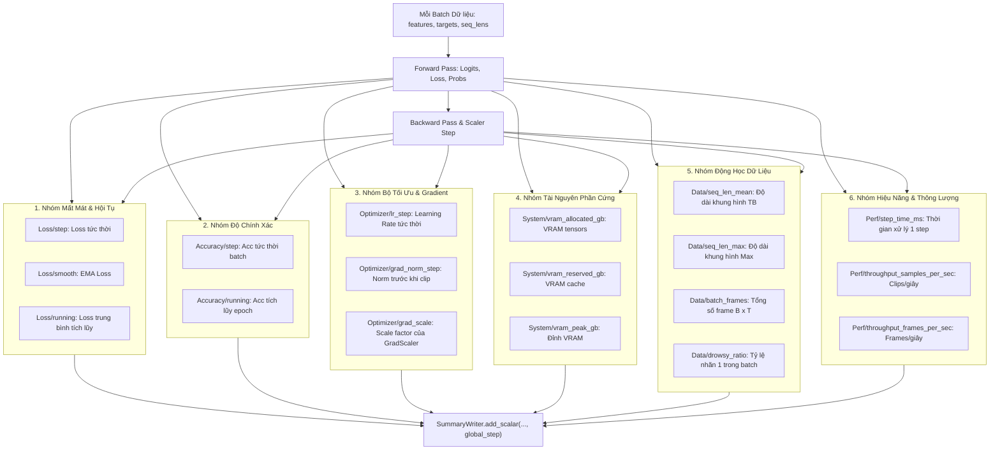

# BÁO CÁO PHÂN TÍCH: HIỆN TRẠNG DỮ LIỆU TENSORBOARD VÀ THIẾT KẾ HỆ THỐNG SỐ ĐO GIÁM SÁT THEO TỪNG STEP (PER-STEP METRICS)

> **Tài liệu:** `docs/analsys/analsys_tensorboard_step_metrics.md`  
> **Nhiệm vụ:** Phân tích dữ liệu quá trình huấn luyện đã lưu trong TensorBoard (`logs/tensorboard/deepgru_h5train_rawval/`), đánh giá hiện tượng mô hình qua các epoch, và thiết kế bổ sung hệ thống chỉ số/số đo chi tiết ở cấp độ từng step (`global_step` / `batch_step`).  
> **Tuân thủ quy trình:** Bước 1 - Khảo sát & Phân tích (Discovery) theo `AGENTS.md`.

---

## 1. Tổng quan & Bối cảnh Khảo sát

### 1.1. Bối cảnh Hệ thống Huấn luyện
Hệ thống phát hiện tài xế buồn ngủ (**Driver Guardian AI**) sử dụng kiến trúc mô hình chuỗi thời gian kết hợp thị giác máy tính:
1. **Bộ trích xuất đặc trưng không gian (Spatial Feature Extractor):** Backbone + PAFPN Neck của mô hình `NMSFreeDetector` (`ai/ObjectDetection_2p6M`), trích xuất 3 tầng đặc trưng $P3, P4, P5$ từ video thô hoặc nạp từ đặc trưng trích xuất sẵn.
2. **Mô hình chuỗi thời gian (Temporal Classifier):** `DeepGRUClassifier` bao gồm `CNNAdapter` (không dùng Global Average Pooling), 2 tầng Bidirectional/Unidirectional GRU, cơ chế `TemporalAttentionPooling` và bộ phân loại tuyến tính nhị phân (`0: Alert`, `1: Drowsy`).

Trong các bài toán xử lý video chuỗi thời gian:
- Mỗi clip video có độ dài khung hình biến thiên $T$ (khi `seq_len: Null`).
- Mỗi epoch huấn luyện kéo dài **hơn 3 giờ đồng hồ** (~11,700 giây/epoch) trên GPU NVIDIA GeForce RTX 3050 Laptop.
- Việc giám sát thời gian thực (Real-time Monitoring) đóng vai trò sống còn để phát hiện sớm các hiện tượng: phân kỳ loss (divergence), bùng nổ đạo hàm (gradient explosion), quá nhiệt, tràn bộ nhớ GPU (CUDA OOM), hoặc mất cân bằng nhãn trước khi lãng phí hàng chục giờ tính toán.

### 1.2. Mục tiêu Phân tích
1. **Khai phá & Đánh giá Dữ liệu TensorBoard hiện có:** Trích xuất toàn bộ dữ liệu sự kiện (`tfevents`) trong `logs/tensorboard/`, giải mã các chỉ số đã lưu, đánh giá hiện tượng mô hình đang gặp phải (Overfitting, Recall quá thấp, v.v.).
2. **Chẩn đoán Hạn chế Kiến trúc Ghi Log Hiện tại:** Chỉ ra lý do vì sao TensorBoard chỉ ghi nhận ở mốc Epoch mà hoàn toàn thiếu vắng dữ liệu theo từng Step, cùng rủi ro mất trắng dữ liệu khi huấn luyện bị gián đoạn giữa chừng.
3. **Bảo toàn Tuyệt đối Cơ chế Giám sát Trung bình theo Epoch (Yêu cầu trọng tâm từ User):** Vẫn giữ nguyên 100% các giá trị mất mát trung bình (`train_loss`, `val_loss`), độ chính xác và các chỉ số chẩn đoán (`F1`, `Recall`, `AUC`, `Gap Loss`) được ghi nhận sau khi kết thúc mỗi Epoch. Các file xuất ra như `training_history.csv` và biểu đồ matplotlib `loss_accuracy_curves.png` tiếp tục hoạt động liền mạch không thay đổi.
4. **Thiết kế Hệ thống Số Đo Toàn diện theo Từng Step (Per-Step Metrics):** Xác định các chỉ số mới cần đo lường tại mỗi batch step (Loss, Accuracy, Learning Rate, GradNorm, VRAM Allocated/Reserved/Peak, Dynamic Sequence Length, Throughput samples/s), xây dựng công thức tính toán và kiến trúc tích hợp an toàn, hiệu quả song song với kiến trúc Epoch-level.

---

## 2. Kết quả Khảo sát Dữ liệu TensorBoard Hiện có

### 2.1. Kiểm kê các Tệp Sự kiện TensorBoard (`tfevents`)
Qua rà soát đĩa cứng tại thư mục `logs/tensorboard/`, hệ thống phát hiện 6 tệp sự kiện:

| Đường dẫn tệp sự kiện | Kích thước | Trạng thái dữ liệu | Diễn giải |
| :--- | :---: | :---: | :--- |
| `logs/tensorboard/deepgru_h5train_rawval/events.out.tfevents.1791047633.*.9472.0` | **1,314 bytes** | **HỢP LỆ (12 tags, 2 steps)** | Phiên huấn luyện chính thức chạy hoàn tất Epoch 1 và Epoch 2. |
| `logs/tensorboard/deepgru_h5train_rawval/events.out.tfevents.1791078895.*.16904.0` | 88 bytes | **RỖNG (0 tags)** | Khởi tạo lúc 08:53:11, bị dừng/crash khi đang chạy dở Epoch 3. |
| `logs/tensorboard/deepgru_h5train_rawval/events.out.tfevents.1791084799.*.18640.0` | 88 bytes | **RỖNG (0 tags)** | Khởi tạo lúc 10:33:18, bị dừng/crash ngay khi khởi động pipeline video thô. |
| `logs/tensorboard/deepgru_h5train_rawval/events.out.tfevents.1791084818.*.11696.0` | 88 bytes | **RỖNG (0 tags)** | Khởi tạo lúc 10:33:37, bị dừng/crash ngay sau khi bắt đầu Epoch 3. |
| `logs/tensorboard/dryrun_test/events.out.tfevents.1791046446.*.10460.1` | 88 bytes | **RỖNG (0 tags)** | Phiên kiểm thử mock-up dryrun. |
| `logs/tensorboard/dryrun_test/events.out.tfevents.1791046446.*.10460.2` | 88 bytes | **RỖNG (0 tags)** | Phiên kiểm thử mock-up dryrun. |

> [!WARNING]
> **Hiện tượng 3 tệp sự kiện bị rỗng (88 bytes):**
> Kích thước 88 bytes chỉ là header khởi tạo phiên làm việc của TensorFlow/PyTorch `SummaryWriter`. Cả 3 lần chạy tiếp theo (`16904`, `18640`, `11696`) đều cố gắng tiếp tục huấn luyện Epoch 3 từ checkpoint `epoch_002.pt`. Tuy nhiên, do mã nguồn hiện tại **chỉ ghi TensorBoard khi kết thúc epoch**, nên khi tiến trình bị ngắt giữa chừng trong lúc đang chạy Epoch 3 (mỗi epoch mất hơn 3 tiếng), **toàn bộ dữ liệu của các step đã tính toán bị mất trắng**, không có bất kỳ số liệu nào được lưu lại!

---

### 2.2. Trích xuất Dữ liệu Định lượng từ Tệp Sự kiện `9472.0`
Trích xuất toàn bộ 12 scalar tags từ tệp `events.out.tfevents.1791047633.hello_my_friend.9472.0`:

| Nhóm chỉ số | Tên Tag trong TensorBoard | Step 1 (Epoch 1) | Step 2 (Epoch 2) | Xu hướng / Độ biến thiên ($\Delta$) |
| :--- | :--- | :---: | :---: | :--- |
| **Huấn luyện (Train)** | `Loss/train` | **0.653846** | **0.519136** | 🔻 **-20.6%** (Loss giảm mạnh, mô hình học tốt trên train) |
| | `Accuracy/train` | **62.23%** (0.6223) | **75.41%** (0.7541) | 🔺 **+13.18%** (Độ chính xác tăng trưởng ấn tượng) |
| | `F1/train` | **0.3990** | **0.6530** | 🔺 **+63.6%** (F1 score tăng vọt trên tập huấn luyện) |
| **Kiểm định (Val)** | `Loss/val` | **0.865142** | **1.317233** | 🔺 **+52.26%** (Loss kiểm định **BÙNG NỔ**, tín hiệu cực xấu) |
| | `Accuracy/val` | **51.95%** (0.5195) | **55.36%** (0.5536) | ⏸️ **Chỉ xấp xỉ 50%** (Gần như đoán ngẫu nhiên trên tập Val) |
| | `F1/val` | **0.2886** | **0.3102** | ⏸️ **Tăng rất chậm** (Thua xa F1 train 0.6530) |
| | `Recall/val_drowsy` | **19.49%** (0.1949) | **20.08%** (0.2008) | ⚠️ **CỰC KỲ THẤP** (Bỏ sót gần 80% trường hợp tài xế buồn ngủ!) |
| | `Precision/val_drowsy` | **55.56%** (0.5556) | **68.21%** (0.6821) | 🔺 Tăng do mô hình chỉ dám dự đoán khi cực kỳ chắc chắn |
| | `AUC/val_roc` | **0.5406** | **0.5505** | ⚠️ **Gần như đoán mò** (Ngưỡng ngẫu nhiên là 0.5000) |
| **Chẩn đoán (Diagnostics)**| `Diagnostics/gap_loss` | **+0.2113** | **+0.7981** | 🚨 **Vượt ngưỡng 0.50**, kích hoạt CẢNH BÁO OVERFITTING |
| **Bộ tối ưu (Optimizer)** | `Optimizer/lr` | **0.001000** | **0.000998** | Cosine Annealing giảm nhẹ theo lịch trình |
| | `Optimizer/grad_norm` | **1.1987** | **1.1515** | Đạo hàm ổn định quanh ngưỡng 1.0 (nhờ gradient clipping) |

---

### 2.3. Phân tích Chuyên sâu Hiện tượng Mô hình qua Dữ liệu TensorBoard

#### 1. Hiện tượng Overfitting cực kỳ nghiêm trọng ngay từ Epoch 2
- Tại Epoch 1: `Train Loss = 0.6538` vs `Val Loss = 0.8651` $\rightarrow$ Gap Loss = `+0.2113`.
- Tại Epoch 2: `Train Loss` giảm xuống `0.5191`, nhưng `Val Loss` tăng vọt lên `1.3172` $\rightarrow$ Gap Loss nhảy vọt lên `+0.7981`.
- **Nguyên nhân:** Mô hình `DeepGRUClassifier` đang ghi nhớ thuộc lòng các mẫu của tập huấn luyện (Train Acc đạt 75.4%), nhưng khả năng tổng quát hóa trên tập kiểm định (Val Acc chỉ 55.4%) bị suy giảm nghiêm trọng. Việc không có cơ chế giám sát loss theo từng step khiến người vận hành không phát hiện được batch nào bắt đầu gây phân kỳ loss trên tập validation.

#### 2. Khủng hoảng Độ nhạy phát hiện buồn ngủ (`Recall = 20.08%`)
- Chỉ số `Recall/val_drowsy` chỉ đạt 0.2008 nghĩa là trong 100 tài xế thực sự buồn ngủ, mô hình chỉ cảnh báo được 20 trường hợp, bỏ sót tới 80 trường hợp.
- Đây là lỗi chí mạng đối với một hệ thống an toàn tính mạng (**Driver Guardian AI**).
- **Nguyên nhân cốt lõi:** Hiện tượng mất cân bằng lớp (Class Imbalance) và việc cấu hình `pos_weight: null` khiến mô hình có xu hướng dự đoán nhãn đa số (`0: Alert`) để giảm thiểu hàm mất mát tổng thể.

#### 3. Khả năng phân biệt xác suất yếu kém (`AUC-ROC = 0.5505`)
- Giá trị AUC-ROC chỉ đạt 0.55 (ngưỡng phân loại ngẫu nhiên là 0.50). Điều này cho thấy không gian đặc trưng giữa Alert và Drowsy trên tập kiểm định bị chồng lấn rất lớn.

---

## 3. Rà soát Mã Nguồn & Hạn chế Cốt lõi của Cơ chế Ghi Log Hiện tại

### 3.1. Phân tích Logic Ghi TensorBoard trong `src/train.py`
Trong tệp `src/train.py`, lớp `TrainingVisualizer` chỉ cung cấp duy nhất một phương thức ghi TensorBoard là `log_epoch()`:
```python
# src/train.py: lines 428-446
if self.tb_writer is not None:
    self.tb_writer.add_scalar("Loss/train", entry["train_loss"], epoch)
    self.tb_writer.add_scalar("Accuracy/train", entry["train_acc"], epoch)
    self.tb_writer.add_scalar("F1/train", entry["train_f1"], epoch)
    self.tb_writer.add_scalar("Optimizer/lr", lr, epoch)
    self.tb_writer.add_scalar("Optimizer/grad_norm", grad_norm, epoch)
    if val_metrics is not None:
        self.tb_writer.add_scalar("Loss/val", entry["val_loss"], epoch)
        # ...
    self.tb_writer.flush()
```

### 3.2. Bảng Đánh giá Các Điểm Nghẽn & Khiếm Khuyết Kiến trúc

| Thành phần | Hiện trạng trong mã nguồn | Đánh giá | Tác động tiêu cực |
| :--- | :--- | :--- | :--- |
| **Trục hoành TensorBoard (X-axis)** | Gán `global_step = epoch` ($1, 2$) | ❌ **SAI CHUẨN** | Mất đi tính liên tục theo thời gian thực của các batch step. |
| **Ghi nhận theo Step trong `train_one_epoch`** | ❌ **HOÀN TOÀN KHÔNG CÓ** | **THIẾU SÓNG CÒN** | Trong suốt 3.25 giờ chạy 1 epoch, TensorBoard hoàn toàn đóng băng không có điểm dữ liệu mới. |
| **Quản lý biến `global_step` toàn cục** | ❌ Không được khai báo hoặc theo dõi | **THIẾU** | Không thể vẽ đường cong liên tục khi chuyển giao giữa các epoch hoặc khi resume từ checkpoint. |
| **Giám sát dao động Loss nội bộ (Loss Spike)** | Chỉ tính trung bình cuối epoch | **KHIẾM KHUYẾT** | Không thể phát hiện batch nào chứa dữ liệu dị biệt (outlier/corrupted frames) gây bùng nổ loss. |
| **Giám sát Gradient Norm theo từng step** | Gom thành list `grad_norms` rồi lấy trung bình | **CHƯA ĐẦY ĐỦ** | Không phát hiện được step nào bị bùng nổ đạo hàm trước khi bị clip. |
| **Giám sát biến thiên VRAM theo từng step** | Chỉ in text trên thanh tqdm | **THIẾU TRỰC QUAN** | Không thể xem biểu đồ tương quan giữa độ dài clip động $T$ và dung lượng VRAM thực tế. |
| **Giám sát Tốc độ Xử lý (Throughput/Latency)** | Chỉ tính tổng thời gian `epoch_time_s` | **THIẾU ĐỊNH LƯỢNG** | Không phát hiện được hiện tượng nghẽn I/O (DataLoader bottleneck) giữa các batch. |

---

## 4. Thiết kế Hệ thống Số Đo Toàn diện theo Từng Step (Per-Step Metrics)

Để giải quyết triệt để các hạn chế trên, hệ thống cần được bổ sung 6 nhóm chỉ số giám sát ở cấp độ từng step:



### 4.1. Chi tiết 6 Nhóm Chỉ số theo Từng Step

#### Nhóm 1: Mất mát & Độ hội tụ tức thời (Loss & Convergence Metrics)
1. **`Loss/train_step`:** Giá trị scalar loss $L_{\text{batch}}$ không scale của batch hiện tại. Giúp quan sát độ nhiễu và dao động tự nhiên giữa các batch.
2. **`Loss/train_smooth` (EMA Loss):** Giá trị làm mượt theo cấp số nhân (Exponential Moving Average):
   $$\text{EMA}_t = \beta \cdot \text{EMA}_{t-1} + (1 - \beta) \cdot L_{\text{batch}} \quad (\text{với } \beta = 0.95)$$
   Giúp loại bỏ dao động ngẫu nhiên, cho phép người dùng nhìn thấy rõ ràng xu hướng hội tụ thực sự của mô hình trên giao diện TensorBoard.
3. **`Loss/train_running`:** Loss trung bình lũy tiến tính từ đầu epoch đến batch hiện tại ($\frac{\sum L \cdot B}{\sum B}$).

#### Nhóm 2: Hiệu năng Phân loại theo Step (Classification Accuracy Metrics)
4. **`Accuracy/train_step`:** Tỷ lệ dự đoán đúng tức thời trong batch: $\frac{\sum (\hat{y} == y)}{B} \times 100\%$.
5. **`Accuracy/train_running`:** Tỷ lệ dự đoán đúng tích lũy từ đầu epoch đến batch hiện tại.

#### Nhóm 3: Tối ưu hóa & Trạng thái Gradients (Optimization & Gradient Safety)
6. **`Optimizer/lr_step`:** Tốc độ học (Learning Rate) tại chính xác step đó. Đặc biệt quan trọng khi sử dụng Warmup hoặc các scheduler biến thiên liên tục theo từng step (`CosineAnnealingWarmRestarts`, `OneCycleLR`).
7. **`Optimizer/grad_norm_preclip`:** Chuẩn L2 của toàn bộ gradients trước khi thực hiện cắt tỉa (`clip_grad_norm_`). Nếu chỉ số này vọt lên hàng chục hoặc hàng trăm, ta phát hiện ngay hiện tượng bùng nổ đạo hàm (Gradient Explosion) tại batch tương ứng.
8. **`Optimizer/grad_scale`:** Giá trị scale hiện tại của `torch.cuda.amp.GradScaler`. Nếu scale bị giảm liên tục (chia đôi), chứng tỏ FP16 đang gặp hiện tượng tràn số (Inf/NaN).

#### Nhóm 4: Tài nguyên Bộ nhớ Đồ họa (Hardware & VRAM Monitoring)
9. **`System/vram_allocated_gb`:** Bộ nhớ VRAM thực tế đang chứa tensors PyTorch.
10. **`System/vram_reserved_gb`:** Bộ nhớ VRAM mà PyTorch Caching Allocator đã bảo lưu từ hệ điều hành.
11. **`System/vram_peak_gb`:** Đỉnh VRAM cao nhất được ghi nhận tại step đó.
12. **`System/vram_percent`:** Tỷ lệ phần trăm VRAM bảo lưu trên tổng dung lượng vật lý của GPU.

#### Nhóm 5: Động học Dữ liệu & Chuỗi Thời gian (Data & Sequence Dynamics)
13. **`Data/seq_len_mean`:** Số khung hình trung bình của các video clip trong batch hiện tại (do `seq_len: Null`).
14. **`Data/seq_len_max`:** Số khung hình lớn nhất trong batch (clip dài nhất quyết định kích thước padding và đỉnh VRAM của batch).
15. **`Data/batch_total_frames`:** Tổng số khung hình $N = \sum_{i=1}^B T_i$ được nạp qua mạng trích xuất đặc trưng `CNNAdapter`.
16. **`Data/batch_drowsy_ratio`:** Tỷ lệ mẫu dương tính (`1: Drowsy`) trong batch: $\frac{\sum y}{B}$. Giúp kiểm tra xem `DataLoader` có chia đều nhãn trong từng batch hay gặp hiện tượng batch thuần một lớp gây chệch gradient.

#### Nhóm 6: Hiệu năng Tính toán & Tốc độ Pipeline (Performance & Throughput)
17. **`Perf/step_time_ms`:** Tổng thời gian thực thi của một step (Data Loading + Forward + Backward + Optimizer step) tính bằng mili-giây.
18. **`Perf/throughput_samples_per_sec`:** Số lượng mẫu (video clips) được xử lý trong một giây: $\frac{B}{\Delta t}$.
19. **`Perf/throughput_frames_per_sec`:** Số lượng khung hình video được trích xuất và huấn luyện trong một giây: $\frac{N_{\text{frames}}}{\Delta t}$.

---

## 5. Thiết kế Kiến trúc Kỹ thuật & Phương án Hiện thực

### 5.1. Cơ chế Quản lý `global_step`
Hiện tại `global_step` bị khuyết thiếu. Cần thiết lập công thức tính toán `global_step` nhất quán:
- Với mỗi batch $k \in [1, N_{\text{batches}}]$ tại epoch $E$:
  $$\text{global\_step} = (E - 1) \times N_{\text{batches}} + k$$
- Khi **Resume** từ checkpoint tại Epoch $E_{\text{resume}}$:
  $$\text{global\_step}_{\text{start}} = (E_{\text{resume}} - 1) \times N_{\text{batches}}$$
- Biến `global_step` được lưu trữ trực tiếp trong `CheckpointManager` cùng với `epoch`, `model_state`, `optimizer_state`, `scaler_state` để đảm bảo khi tiếp tục huấn luyện, đồ thị TensorBoard nối tiếp hoàn hảo mà không bị ghi đè hoặc gấp khúc thời gian.

### 5.2. Tần suất Ghi Log (`log_step_interval`) & Cơ chế Buffer I/O
Nếu ghi log ở **mọi step** ($interval = 1$):
- Tập dữ liệu có $9,866$ mẫu $\rightarrow \approx 616$ batches/epoch $\rightarrow 40$ epochs = $24,640$ steps.
- Việc ghi đĩa ở mọi step có thể gây phân mảnh I/O và làm tệp sự kiện phình to lên hàng trăm MB.
- **Giải pháp tối ưu:**
  - Bổ sung tham số cấu hình: `log_step_interval: int = 5` (hoặc cấu hình thông qua `config.yaml` / `config.py`).
  - Ghi log TensorBoard định kỳ mỗi `log_step_interval` steps, và luôn luôn ghi ở batch cuối cùng của epoch ($k = N_{\text{batches}}$).
  - Tần suất `flush()`: Thực hiện định kỳ mỗi $50$ steps hoặc ở cuối mỗi epoch để đảm bảo hiệu năng đọc/ghi không làm chậm GPU.

### 5.3. Thiết kế Song Hành (Dual-Track Logging): Bảo Toàn 100% Chỉ Số Epoch và Tách Biệt Chỉ Số Step
Để đáp ứng triệt để yêu cầu của người dùng ("vẫn giữ các giá trị loss trung bình sau những epoch"):
- **Kiến trúc Giám sát Kép (Dual-Track Architecture):**
  1. **Luồng Epoch-Level (Bảo toàn nguyên bản):**
     - Vẫn tính toán toàn bộ chỉ số trung bình sau khi duyệt hết các batch trong epoch thông qua `metrics_tracker.compute()`.
     - Ghi nhận `Train Loss` trung bình, `Val Loss` trung bình, `Accuracy`, `F1`, `Recall`, `Precision`, `AUC-ROC`, `AUC-PR`, `Gap Loss`, `LR`, `GradNorm`.
     - Xuất lịch sử đầy đủ ra `logs/training_history.csv`.
     - Vẽ biểu đồ tổng kết `logs/loss_accuracy_curves.png`.
     - Trên TensorBoard: Ghi nhận với trục hoành là `epoch` (hoặc tag `Epoch/...` và các tag tương thích ngược `Loss/train`, `Loss/val`).
  2. **Luồng Step-Level (Bổ sung mới với độ phân giải cao):**
     - Ghi nhận tại các batch step (`global_step`) với tần suất định kỳ `log_step_interval = 5` steps.
     - Sử dụng namespace rõ ràng `Step/...` để không làm rối hoặc đè lên các chỉ số Epoch.

```text
TensorBoard Root
├── Epoch/ (Trục hoành: Epoch 1, 2, 3...)
│   ├── Loss/train (Loss trung bình toàn epoch)
│   ├── Loss/val (Loss trung bình kiểm định)
│   ├── Accuracy/train & Accuracy/val
│   ├── F1/train & F1/val
│   └── Diagnostics/gap_loss
│
└── Step/ (Trục hoành: Global Step 1, 5, 10, ... 600...)
    ├── Loss/train_step (Loss tức thời batch)
    ├── Loss/train_smooth_ema (EMA Loss làm mượt)
    ├── Loss/train_running (Loss trung bình tích lũy trong epoch)
    ├── Accuracy/train_step & Accuracy/train_running
    ├── Optimizer/lr, grad_norm_preclip, grad_scale
    ├── System/vram_allocated_gb, vram_reserved_gb, vram_peak_gb
    ├── Data/seq_len_mean, batch_total_frames, drowsy_ratio
    └── Perf/step_time_ms, throughput_samples_per_sec
```

---

## 6. Đánh giá Rủi ro Kỹ thuật & Biện pháp Phòng ngừa

| Nguy cơ / Rủi ro | Mức độ | Nguyên nhân | Biện pháp Phòng ngừa & Khắc phục |
| :--- | :---: | :--- | :--- |
| **GPU Sync Overhead khi lấy `loss.item()` và `gnorm.item()`** | Trung bình | Gọi `.item()` làm CPU phải chờ GPU tính toán xong (CUDA Synchronization). | Chỉ gọi `.item()` trên các biến vô hướng cần thiết sau khi backward; các phép tính VRAM sử dụng hàm không đồng bộ của PyTorch. |
| **Kích thước file `tfevents` phình to** | Thấp | Ghi quá nhiều scalar ở từng step. | Sử dụng `log_step_interval = 5` hoặc `10`, giúp giảm 80–90% dung lượng đĩa mà vẫn giữ độ phân giải đồ thị rất cao. |
| **Mất đồng bộ `global_step` khi Resume** | Trung bình | Checkpoint cũ không lưu biến `global_step`. | Thiết lập fallback: nếu checkpoint chưa có `global_step`, tự động suy luận: `global_step = (resumed_epoch - 1) * len(train_loader)`. |
| **Treo hoặc lag I/O đĩa** | Thấp | Gọi `tb_writer.flush()` quá thường xuyên. | Chỉ flush sau mỗi $50$ steps và ở biên epoch. |

---

## 7. Kết luận & Đề xuất Bước Tiếp theo (Next Steps)

### 7.1. Kết luận Khảo sát
1. **Dữ liệu TensorBoard hiện có:** Phản ánh chính xác 2 epoch đã hoàn tất, bộc lộ rõ hiện tượng **Overfitting nghiêm trọng** (Gap Loss = 0.7981) và **Recall buồn ngủ quá thấp** (20.08%).
2. **Hạn chế:** TensorBoard chỉ ghi nhận ở mốc Epoch; thiếu vắng dữ liệu theo từng Step khiến không thể quan sát biến động mất mát, gradient norm, VRAM và thông lượng trong suốt hơn 3 tiếng chạy mỗi epoch; đồng thời làm mất dữ liệu khi bị ngắt ở Epoch 3.
3. **Yêu cầu cấp thiết:** Cần mở rộng `TrainingVisualizer` và `DrowsinessTrainer` để tính toán và ghi nhận đầy đủ 6 nhóm chỉ số per-step với cơ chế `global_step` đồng bộ và cấu hình tần suất tối ưu.

### 7.2. Lộ trình Triển khai Đề xuất (Bước 2: Lập Kế hoạch)
Sau khi người dùng xem xét và chấp thuận báo cáo phân tích này, Agent sẽ tiến hành:
1. Soạn thảo tài liệu kế hoạch chi tiết `docs/plan/plan_tensorboard_step_metrics.md` theo quy định tại `AGENTS.md`.
2. Lập danh mục các module mã nguồn cần cập nhật (`configs/config.py`, `configs/config.yaml`, `src/train.py`, `train.py`).
3. Thiết kế chi tiết mã nguồn cho phương thức `log_step()` trong `TrainingVisualizer`, tích hợp tính toán các số đo trong `train_one_epoch()`, và kiểm thử độc lập tính đúng đắn.
