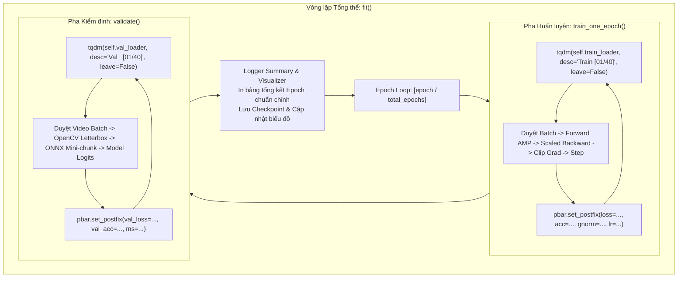

# BÁO CÁO PHÂN TÍCH YÊU CẦU: TÍCH HỢP THANH TIẾN TRÌNH TQDM GIÁM SÁT QUÁ TRÌNH HUẤN LUYỆN & KIỂM ĐỊNH MÔ HÌNH

**Mã tài liệu:** `analsys_train_tqdm.md`  
**Dự án:** Hệ Thống Nhận Diện Tài Xế Buồn Ngủ (Driver Guardian - Deep GRU / LSTM)  
**Tệp mục tiêu:** [`src/train.py`](file:///D:/Project/DATN/driver-guardian/ai/LSTM/src/train.py) & [`train.py`](file:///D:/Project/DATN/driver-guardian/ai/LSTM/train.py)  
**Tệp cấu hình phụ trợ:** [`configs/config.py`](file:///D:/Project/DATN/driver-guardian/ai/LSTM/configs/config.py) & [`configs/config.yaml`](file:///D:/Project/DATN/driver-guardian/ai/LSTM/configs/config.yaml)  
**Ngày thực hiện:** 03/10/2026  
**Quy chuẩn áp dụng:** [`AGENTS.md`](file:///D:/Project/DATN/driver-guardian/ai/LSTM/AGENTS.md) — Bước 1: Khảo sát & Phân tích (Discovery)  

---

## 1. TỔNG QUAN & MỤC TIÊU NHIỆM VỤ (EXECUTIVE SUMMARY)

### 1.1. Yêu cầu của người dùng
Người dùng yêu cầu: *"thêm giám sát quá trình train thông qua tqmd"* (tích hợp thư viện thanh tiến trình `tqdm` để giám sát trực quan quá trình huấn luyện và kiểm định mô hình).

### 1.2. Mục tiêu kỹ thuật cốt lõi
1. **Giám sát Tiến độ Thời gian Thực (Real-time Visual Progress Tracking):**
   - Thay thế cơ chế in text định kỳ thụ động (`log_interval = 10`) bằng **thanh tiến trình động trực quan (Dynamic Progress Bar)** thông qua thư viện chuẩn `tqdm` (phiên bản hiện hữu `4.70.0`).
   - Cung cấp phản hồi trực quan theo thời gian thực: Tỷ lệ hoàn thành (%), số batch đã xử lý / tổng số batch, tốc độ xử lý ($it/s$ hoặc $batches/s$), thời gian đã trôi qua (Elapsed time), và ước tính thời gian hoàn thành còn lại (ETA).
2. **Cập nhật Chỉ số Nhanh (Dynamic Postfix Metrics):**
   - Trong quá trình duyệt batch của **Pha Huấn luyện (Train Loop):** Cập nhật liên tục `loss`, `running_acc`, `grad_norm`, và `learning_rate` trên thanh tiến trình.
   - Trong quá trình duyệt batch của **Pha Kiểm định (Validation Loop):** Cập nhật liên tục `val_loss`, `val_acc`, `latency_ms` (thời gian trích xuất ONNX và forward cho mỗi video clip) nhằm giúp người dùng theo dõi tiến độ nạp và suy luận video thô mà không có cảm giác chương trình bị treo.
3. **Bảo toàn Tính Thẩm mỹ & Không Phá vỡ Định dạng Log (Clean Console Layout):**
   - Thiết lập cấu hình thanh tiến trình thu gọn (`leave=False` cho batch progress bar) để khi kết thúc epoch, thanh tiến trình tự động dọn dẹp nhường chỗ cho dòng log tổng kết epoch chuẩn chỉnh của `logger.info`, không gây hiện tượng nhân bản hoặc vỡ dòng màn hình.
   - Tương thích hai chiều giữa hệ thống ghi log tệp tin (`.log`) và thanh tiến trình hiển thị trên terminal/console.
4. **Quản lý Cấu hình Tập trung qua `configs/config.py` (No CLI):**
   - Thêm tham số `use_tqdm: bool = True` vào [`configs/config.py`](file:///D:/Project/DATN/driver-guardian/ai/LSTM/configs/config.py) để người dùng có thể bật/tắt thanh tiến trình trực tiếp từ cấu hình mà không cần truyền cờ dòng lệnh CLI.
5. **Tương thích Đa Môi trường (Cross-Environment Compatibility):**
   - Sử dụng `from tqdm.auto import tqdm` để tự động tối ưu hóa giao diện hiển thị: dạng widget phong phú trên Jupyter Notebook (`notebooks/03_model_prototyping.ipynb`, Google Colab, Kaggle) hoặc thanh ký tự Unicode chuẩn trên Windows PowerShell / Linux Terminal.

---

## 2. KHẢO SÁT HIỆN TRẠNG & ĐIỂM NGHẼN CẦN NÂNG CẤP

### 2.1. Hiện trạng cơ chế hiển thị trong [`src/train.py`](file:///D:/Project/DATN/driver-guardian/ai/LSTM/src/train.py)
Hiện tại trong [`src/train.py`](file:///D:/Project/DATN/driver-guardian/ai/LSTM/src/train.py):
- **Vòng lặp Train (`train_one_epoch`):**
  ```python
  # Dòng 846 trong src/train.py
  for batch_idx, (features, targets, seq_lens, metas) in enumerate(self.train_loader, start=1):
      ...
      if batch_idx % self.config.log_interval == 0 or batch_idx == total_batches:
          self.logger.info(...)
  ```
  - *Hạn chế:* Log chỉ in cách quãng 10 batch một lần. Người dùng không thấy được thanh % trực quan, không có ETA chính xác, và khi dataset lớn với batch size nhỏ thì khoảng chờ giữa các lần in log tạo cảm giác gián đoạn.
- **Vòng lặp Val (`validate`):**
  ```python
  # Dòng 910 trong src/train.py
  with torch.no_grad():
      for batch_idx, (features, targets, seq_lens, metas) in enumerate(self.val_loader, start=1):
          ...
  ```
  - *Hạn chế:* Tập val nạp video thô qua OpenCV và trích xuất qua ONNX Runtime trực tiếp trên từng clip, tốn từ vài trăm ms đến vài giây mỗi batch. Trong toàn bộ quá trình chạy validation, hoàn toàn **không có bất kỳ thông tin tiến độ nào được hiển thị** cho đến khi val kết thúc. Điều này khiến người dùng dễ lầm tưởng rằng chương trình đang bị treo hoặc crash!

---

## 3. THIẾT KẾ KIẾN TRÚC & GIẢI PHÁP TÍCH HỢP TQDM

### 3.1. Sơ đồ Tương tác Giao diện Huấn luyện Đa tầng với `tqdm`



### 3.2. Chi tiết Thiết kế Các Thanh Tiến Trình

#### 1. Thanh Tiến trình Huấn luyện (Train Progress Bar):
- **Khởi tạo:**
  ```python
  pbar = tqdm(
      self.train_loader,
      desc=f"Train [{epoch:02d}/{self.config.epochs:02d}]",
      total=len(self.train_loader),
      dynamic_ncols=True,
      leave=False,
      disable=not getattr(self.config, "use_tqdm", True),
      file=sys.stdout
  )
  ```
- **Thông số hiển thị thời gian thực (`set_postfix`):**
  - `loss`: Giá trị loss của batch hiện tại (hoặc running loss trung bình).
  - `acc`: Tỷ lệ chính xác running accuracy (%) từ đầu epoch đến batch hiện tại.
  - `gnorm`: Chuẩn Gradient Norm ($\|\nabla \mathbf{W}\|_2$) sau khi cắt dải.
  - `lr`: Tốc độ học hiện tại định dạng khoa học (ví dụ: `1.00e-03`).

#### 2. Thanh Tiến trình Kiểm định Video Thô (Validation Progress Bar):
- **Khởi tạo:**
  ```python
  pbar = tqdm(
      self.val_loader,
      desc=f"Val   [{epoch:02d}/{self.config.epochs:02d}]",
      total=len(self.val_loader),
      dynamic_ncols=True,
      leave=False,
      disable=not getattr(self.config, "use_tqdm", True),
      file=sys.stdout
  )
  ```
- **Thông số hiển thị thời gian thực (`set_postfix`):**
  - `loss`: Giá trị loss kiểm định trung bình lũy tiến.
  - `acc`: Độ chính xác kiểm định trung bình lũy tiến (%).
  - `ms`: Độ trễ xử lý trung bình trên mỗi video clip ($\text{ms/clip}$).

#### 3. Cơ chế Đóng Dọn Dẹp An Toàn (Clean Terminal State):
- Thuộc tính `leave=False`: Sau khi duyệt xong batch cuối cùng của epoch, thanh tiến trình batch sẽ tự động biến mất khỏi dòng hiện tại.
- Kế tiếp, dòng log tổng kết epoch dạng text của `self.logger.info(...)` sẽ được in ra sạch đẹp, giữ cho lịch sử màn hình console không bị rối loạn hoặc trôi dòng.

---

### 3.3. Cập nhật Nguồn Cấu hình Tập trung: [`configs/config.py`](file:///D:/Project/DATN/driver-guardian/ai/LSTM/configs/config.py)
Bổ sung tham số vào phân khu Logging & Diagnostics:
```python
@dataclass
class TrainConfig:
    ...
    # ---- 7. LOGGING, DIAGNOSTICS & VISUALIZATION CONFIGURATION ----
    use_tqdm: bool = True  # Bật/tắt thanh tiến trình giám sát trực quan tqdm
```
Và đồng bộ vào [`configs/config.yaml`](file:///D:/Project/DATN/driver-guardian/ai/LSTM/configs/config.yaml):
```yaml
logging:
  use_tqdm: true
```

---

## 4. CÁC THÁCH THỨC KỸ THUẬT & BIỆN PHÁP XỬ LÝ

| Thách thức kỹ thuật | Nguy cơ tiềm ẩn | Biện pháp giải quyết tối ưu |
| :--- | :--- | :--- |
| **Xung đột Luồng Xuất (I/O Collision)** | `logger.info` in ra đồng thời với `tqdm` làm thanh tiến trình bị nhảy dòng hoặc lặp lại liên tục | Sử dụng `leave=False` cho các vòng lặp batch, chỉ in log tổng kết khi vòng lặp `tqdm` đã đóng hoàn toàn; hoặc dùng `tqdm.write` nếu cần in thông báo đột xuất |
| **Môi trường Non-Interactive / Headless** | Khi chạy trong CI/CD, batch job không có TTY console, `tqdm` có thể sinh hàng ngàn dòng rác | Kiểm tra tự động hoặc cho phép tắt dễ dàng qua cấu hình `use_tqdm: False` |
| **Treo File Handle trên Windows** | Thanh tiến trình giữ luồng `sys.stdout` khi xảy ra exception | Luôn bọc vòng lặp trong khối `try...finally` hoặc sử dụng context manager `with tqdm(...) as pbar:` |

---

## 5. KẾ HOẠCH KIỂM THỬ XÁC MINH (TEST PLAN)

1. **Kiểm thử Khởi tạo Cấu hình:** Xác nhận `TrainConfig` nạp trường `use_tqdm=True` từ cả Python và YAML mà không phát sinh lỗi.
2. **Kiểm thử Hiển thị Thanh Tiến trình Train & Val:** Chạy chế độ `run_dry_run_test()`, quan sát thanh tiến trình cập nhật trơn tru các tham số `loss`, `acc`, `gnorm`, `lr`, `latency`.
3. **Kiểm thử Cơ chế Bật/Tắt:** Đặt `use_tqdm=False`, xác nhận pipeline vẫn chạy bình thường với log dạng văn bản thuần túy.
4. **Kiểm thử Tính Toàn vẹn của Artifacts:** Đảm bảo việc thêm `tqdm` không làm ảnh hưởng đến các file kết quả (`training_history.csv`, `training_summary.json`, các biểu đồ PNG và checkpoint model).

---

## 6. KẾT LUẬN & ĐỀ XUẤT BƯỚC TIẾP THEO

Báo cáo phân tích đã xác định rõ yêu cầu, điểm nghẽn hiện tại và bản thiết kế tích hợp thanh tiến trình `tqdm` toàn diện cho cả pha huấn luyện và kiểm định mô hình.

> [!IMPORTANT]
> **Yêu cầu phê duyệt từ Người dùng (User Approval):**  
> Theo quy chuẩn làm việc tại **Mục 5 của [`AGENTS.md`](file:///D:/Project/DATN/driver-guardian/ai/LSTM/AGENTS.md)**:
> - **Bước 1 (Discovery):** Hoàn thành tài liệu phân tích `docs/analsys_train_tqdm.md`.
> - **Bước 2 (Planning):** Chỉ được thực hiện tạo file `docs/plan_train_tqdm.md` khi người dùng đã xem xét và đồng ý với nội dung phân tích này.
>
> Kính mời bạn xem xét bản phân tích trên. Nếu bạn đồng ý, tôi sẽ tiến hành **Bước 2: Lập kế hoạch chi tiết (`docs/plan_train_tqdm.md`)**.
