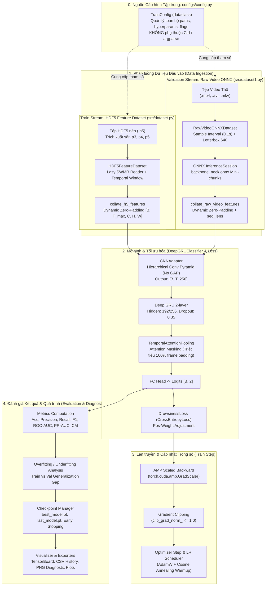

# BÁO CÁO PHÂN TÍCH YÊU CẦU: XÂY DỰNG PIPELINE HUẤN LUYỆN, ĐÁNH GIÁ KẾT QUẢ & QUÁ TRÌNH HUẤN LUYỆN MÔ HÌNH NHẬN DIỆN BUỒN NGỦ

**Mã tài liệu:** `analsys_train_pipeline.md`  
**Dự án:** Hệ Thống Nhận Diện Tài Xế Buồn Ngủ (Driver Guardian - Deep GRU / LSTM)  
**Tệp mục tiêu:** [`train.py`](file:///D:/Project/DATN/driver-guardian/ai/LSTM/train.py)  
**Dataset huấn luyện (Train):** `HDF5FeatureDataset` từ [`src/dataset.py`](file:///D:/Project/DATN/driver-guardian/ai/LSTM/src/dataset.py)  
**Dataset kiểm định (Validation):** `RawVideoONNXDataset` từ [`src/dataset1.py`](file:///D:/Project/DATN/driver-guardian/ai/LSTM/src/dataset1.py)  
**Kiến trúc mô hình:** `DeepGRUClassifier` từ [`src/models.py`](file:///D:/Project/DATN/driver-guardian/ai/LSTM/src/models.py)  
**Hàm mất mát:** `DrowsinessLoss` / `DrowsinessBCELoss` từ [`src/loss.py`](file:///D:/Project/DATN/driver-guardian/ai/LSTM/src/loss.py)  
**Cơ chế cấu hình duy nhất (Single Source of Truth):** [`configs/config.py`](file:///D:/Project/DATN/driver-guardian/ai/LSTM/configs/config.py) (kết hợp đồng bộ [`configs/config.yaml`](file:///D:/Project/DATN/driver-guardian/ai/LSTM/configs/config.yaml))  
**Ngày thực hiện:** 03/10/2026 (Cập nhật phản hồi người dùng: KHÔNG dùng CLI, cấu hình 100% qua `configs/config.py`)  
**Quy chuẩn áp dụng:** [`AGENTS.md`](file:///D:/Project/DATN/driver-guardian/ai/LSTM/AGENTS.md) — Bước 1: Khảo sát & Phân tích (Discovery)  

---

## 1. TỔNG QUAN & MỤC TIÊU NHIỆM VỤ (EXECUTIVE SUMMARY)

### 1.1. Yêu cầu của người dùng & Định hướng Kiến trúc
Người dùng yêu cầu tạo tệp [`train.py`](file:///D:/Project/DATN/driver-guardian/ai/LSTM/train.py) với các mục tiêu cốt lõi:
1. **Huấn luyện mô hình (Model Training):** 
   - Sử dụng **`HDF5FeatureDataset`** tại [`src/dataset.py`](file:///D:/Project/DATN/driver-guardian/ai/LSTM/src/dataset.py) làm tập huấn luyện (Train Dataset). Tận dụng tốc độ nạp siêu tốc từ các bản đồ đặc trưng không gian đa tỷ lệ ($p_3, p_4, p_5$) đã trích xuất sẵn trong tệp HDF5 (`.h5`), hỗ trợ đa tiến trình (`num_workers > 0`) với cơ chế lazy handle và zero-padding batching an toàn.
   - Kiến trúc mô hình lõi: `DeepGRUClassifier` (tích hợp `CNNAdapter`, Deep GRU 2 tầng, `TemporalAttentionPooling`, và FC Head).
   - Hàm mất mát: `DrowsinessLoss` (CrossEntropyLoss với hỗ trợ phân bổ trọng số `pos_weight` khi mất cân bằng dữ liệu) từ [`src/loss.py`](file:///D:/Project/DATN/driver-guardian/ai/LSTM/src/loss.py).
   - Tối ưu hóa: AdamW/SGD với Learning Rate Scheduler (Cosine Annealing có Warmup mềm), Automatic Mixed Precision (AMP FP16) và Gradient Clipping.
2. **Đánh giá kết quả huấn luyện mô hình (Model Evaluation):**
   - Sử dụng **`RawVideoONNXDataset`** tại [`src/dataset1.py`](file:///D:/Project/DATN/driver-guardian/ai/LSTM/src/dataset1.py) làm tập kiểm định (Validation Dataset). Đo lường hiệu năng mô hình trên video thô nguyên bản (`.mp4`, `.avi`, `.mkv`), giải mã khung hình theo chu kỳ lấy mẫu tùy biến (`sample_interval = 0.1s`), letterbox chuẩn 640x640 và trích xuất qua ONNX Runtime trực tiếp để mô phỏng chính xác điều kiện triển khai thực tế.
   - Tính toán đầy đủ hệ thống chỉ số phân loại: Loss, Accuracy, Precision, Recall/Sensitivity (đặc biệt cho lớp buồn ngủ 1_drowsy), Specificity (cho lớp 0_alert), F1-Score (Macro, Weighted, Drowsy), AUC-ROC, AUC-PR, Confusion Matrix và Classification Report.
   - Đo lường độ trễ suy luận (Latency theo ms/sample) và thông lượng (FPS).
3. **Đánh giá quá trình huấn luyện mô hình (Training Process Diagnostics):**
   - Giám sát độ hội tụ qua từng Epoch: Đường cong Train Loss vs. Val Loss, Train F1 vs. Val F1, Train Acc vs. Val Acc nhằm phát hiện kịp thời hiện tượng Overfitting (khoảng cách tổng quát hóa - Generalization Gap) hoặc Underfitting.
   - Theo dõi chuẩn độ dốc Gradient (Gradient Norm) để cảnh báo triệt tiêu (vanishing) hoặc bùng nổ (exploding) gradient.
   - Ghi nhận lịch sử huấn luyện đa kênh: TensorBoard (`SummaryWriter`), tệp log văn bản có cấu trúc (`training.log`), tệp bảng số liệu (`training_history.csv`) và tệp tóm tắt JSON (`training_summary.json`).
   - Tự động xuất biểu đồ trực quan hóa (Diagnostic Plots): Biểu đồ loss/accuracy qua các epoch (`loss_accuracy_curves.png`), ma trận nhầm lẫn chuẩn hóa của epoch tốt nhất (`confusion_matrix_best.png`), đường cong ROC & PR (`roc_pr_curves.png`).
   - Quản lý Checkpoints & Early Stopping: Lưu `best_model.pt` (theo Val F1 hoặc Val Loss), `last_model.pt`, các checkpoint định kỳ, hỗ trợ Resume huấn luyện và kích hoạt Early Stopping khi chỉ số kiểm định không cải thiện sau $N$ epochs (patience).
4. **Quyết định Thiết kế Cốt lõi (User Feedback): KHÔNG DÙNG GIAO DIỆN DÒNG LỆNH (CLI):**
   - Loại bỏ hoàn toàn `argparse` hoặc việc phân tích tham số dòng lệnh phức tạp.
   - Quản lý **100% cấu hình tập trung** qua dataclass `TrainConfig` trong [`configs/config.py`](file:///D:/Project/DATN/driver-guardian/ai/LSTM/configs/config.py). Người dùng chỉ cần mở [`configs/config.py`](file:///D:/Project/DATN/driver-guardian/ai/LSTM/configs/config.py) để tinh chỉnh các siêu tham số, đường dẫn tệp H5, thư mục video validation, số epoch, lr, batch_size... Sau đó chỉ cần chạy trực tiếp `python train.py`.

---

### 1.2. Sơ đồ Kiến trúc Pipeline Huấn luyện & Đánh giá (End-to-End Workflow)



---

## 2. KHẢO SÁT & PHÂN TÍCH KỸ THUẬT CHI TIẾT

### 2.1. Phân tích Dữ liệu Huấn luyện: `HDF5FeatureDataset` ([`src/dataset.py`](file:///D:/Project/DATN/driver-guardian/ai/LSTM/src/dataset.py))
- **Bản chất kỹ thuật:**
  - Tập huấn luyện nạp trực tiếp các bản đồ đặc trưng không gian 4D:
    - $p_3 \in \mathbb{R}^{T \times 64 \times 80 \times 80}$
    - $p_4 \in \mathbb{R}^{T \times 128 \times 40 \times 40}$
    - $p_5 \in \mathbb{R}^{T \times 256 \times 20 \times 20}$
  - Cơ chế **Lazy File Opening per-worker** kết hợp **cờ SWMR (Single-Writer-Multiple-Reader)** trong HDF5 giúp an toàn tuyệt đối khi huấn luyện với `num_workers > 0` trên cả Linux (`fork`) và Windows (`spawn`).
  - Hỗ trợ cắt lát cửa sổ thời gian ngẫu nhiên (`window_sampling="random"`) khi cấu hình `seq_len` cố định (vd: 120 frames), giúp mô hình học đa dạng các phân đoạn thời gian khác nhau trong video.
  - Hỗ trợ tăng cường dữ liệu (`include_augmented=True`), cho phép nạp các bản sao video đã được augment qua [`src/augment.py`](file:///D:/Project/DATN/driver-guardian/ai/LSTM/src/augment.py).
  - Hàm gom batch `collate_h5_features` tự động zero-padding về độ dài lớn nhất $T_{\max}$ trong batch và trả về tensor `seq_lens` $[B]$.

### 2.2. Phân tích Dữ liệu Kiểm định: `RawVideoONNXDataset` ([`src/dataset1.py`](file:///D:/Project/DATN/driver-guardian/ai/LSTM/src/dataset1.py))
- **Bản chất kỹ thuật:**
  - Tập kiểm định đại diện cho dữ liệu suy luận thực tế: video thô nguyên bản (`.mp4`, `.avi`, `.mkv`).
  - Mỗi mẫu được giải mã trực tiếp bằng `cv2.VideoCapture`, lấy mẫu theo chu kỳ thời gian `sample_interval` (mặc định 0.1s, tương ứng 10 FPS), letterbox bảo toàn tỷ lệ khuôn mặt về kích thước $640 \times 640 \times 3$.
  - Trích xuất đặc trưng động (on-the-fly) thông qua mô hình [`checkpoints/backbone_neck.onnx`](file:///D:/Project/DATN/driver-guardian/ai/LSTM/checkpoints/backbone_neck.onnx) theo từng mini-chunk (`chunk_size = 16`) tránh tràn VRAM.
  - Cắt lát thời gian chính giữa (`window_sampling="center"`) khi cấu hình `seq_len` cố định nhằm đảm bảo tính tất định (deterministic) khi đánh giá.
  - Tuyệt đối **KHÔNG sử dụng Augmentation** (`augmenter=None`) và **KHÔNG sử dụng Caching** (stateless data pipeline), bảo đảm 100% không rò rỉ dữ liệu (Zero Data Leakage) và tiết kiệm RAM.

### 2.3. Bảng So sánh Đối chiếu Hai Nguồn Dữ liệu trong Pipeline

| Tiêu chí kỹ thuật | Tập Train (`HDF5FeatureDataset`) | Tập Val (`RawVideoONNXDataset`) |
| :--- | :--- | :--- |
| **Nguồn dữ liệu đầu vào** | Tệp HDF5 `.h5` nén đã trích xuất sẵn | Thư mục video thô (`.mp4`, `.avi`, `.mkv`) |
| **Tốc độ đọc mỗi epoch** | Cực nhanh (~0.05s - 0.2s / batch 64) | Vừa phải (phụ thuộc OpenCV decode + ONNX runtime) |
| **Tăng cường dữ liệu (Augmentation)** | Có (`include_augmented=True`) | Không (`augmenter=None` - chống rò rỉ dữ liệu) |
| **Chiến lược cửa sổ thời gian** | `"random"` (tăng độ bao phủ) | `"center"` (tất định, chuẩn hóa đánh giá) |
| **Số lượng workers tối ưu** | `num_workers = 2` hoặc `4` | `num_workers = 0` (hoặc `1` với CPU provider) |
| **Mục đích trong pipeline** | Tối đa hóa tốc độ cập nhật trọng số | Đo lường độ chính xác thực tế khi triển khai End-to-End |

---

### 2.4. Phân tích Kiến trúc Mô hình Lõi: `DeepGRUClassifier` ([`src/models.py`](file:///D:/Project/DATN/driver-guardian/ai/LSTM/src/models.py))
Kiến trúc mô hình được thiết kế theo nguyên lý tối ưu hóa thông tin không gian - thời gian:
1. **`CNNAdapter` (Không dùng Global Average Pooling - GAP):**
   - Đưa cả 3 tensor $p_3 (64 \times 80 \times 80)$, $p_4 (128 \times 40 \times 40)$, $p_5 (256 \times 20 \times 20)$ về cùng kích thước không gian $40 \times 40$ (thông qua MaxPool2d cho $p_3$ và Bilinear Upsample cho $p_5$).
   - Ghép nối thành tensor 448 kênh tại $40 \times 40$.
   - Đi qua mạng phễu tích chập phân tầng (**Hierarchical Conv Pyramid**):
     - Stage 1: $40 \times 40 \rightarrow 20 \times 20$ (học tương quan cục bộ: mí mắt, vành môi).
     - Stage 2: $20 \times 20 \rightarrow 10 \times 10$ (học tương quan vùng: khoảng cách hai mắt, tam giác mắt - mũi - miệng).
     - Stage 3: $10 \times 10 \rightarrow 5 \times 5$ (học tương quan toàn diện khuôn mặt và góc nghiêng đầu).
     - Stage 4: Tổng hợp lưới $5 \times 5$ về vector đặc trưng kích thước $D = 256$ bằng kernel học được $5 \times 5$ kèm BatchNorm và SiLU.
2. **Deep GRU 2 tầng (Temporal Modeling):**
   - Nhận chuỗi vector $[B, T, 256]$, trích xuất biến thiên thời gian qua 2 tầng GRU xếp chồng với `dropout = 0.35` và `hidden_dim = 192` (hoặc `256`).
3. **`TemporalAttentionPooling` kết hợp Attention Masking:**
   - MLP Attention học trọng số chú ý $\alpha_t \in [0, 1]$ cho từng khung hình.
   - **Attention Masking:** Sử dụng tensor `seq_lens` $[B]$ gán giá trị $-\infty$ (hoặc $-10^9$) vào các khung hình zero-padding trước khi tính Softmax, triệt tiêu 100% gradient rác sinh ra từ padding!
4. **FC Head (Classification Head):**
   - Phân loại 2 lớp: 0 (Tỉnh táo - Alert) và 1 (Buồn ngủ - Drowsy).

---

### 2.5. Phân tích Hàm Mất Mát: `DrowsinessLoss` ([`src/loss.py`](file:///D:/Project/DATN/driver-guardian/ai/LSTM/src/loss.py))
- Chuẩn `CrossEntropyLoss` nhận logits $[B, 2]$ và nhãn mục tiêu $[B]$.
- Hỗ trợ tham số `pos_weight`: Khi tập dữ liệu mất cân bằng (ví dụ số clip alert gấp 2 lần clip drowsy), gán trọng số lớp dương $w_1 = \frac{N_{\text{alert}}}{N_{\text{drowsy}}}$ để mô hình tập trung phạt các lỗi bỏ sót tài xế buồn ngủ (False Negative).

---

## 3. CÁC THÁCH THỨC KỸ THUẬT TRỌNG YẾU & GIẢI PHÁP THIẾT KẾ

### 3.1. Thách thức 1: Lệch pha Tốc độ giữa Train (H5) và Val (Raw Video ONNX)
- **Vấn đề:** 
  - Nạp dữ liệu train từ H5 chỉ mất vài giây mỗi epoch. 
  - Trong khi đó, việc đánh giá tập validation bằng video thô đòi hỏi giải mã OpenCV và chạy ONNX backbone qua từng khung hình, tốn nhiều thời gian hơn đáng kể.
- **Giải pháp:**
  1. Cấu hình tham số **`val_interval_epochs`** trong [`configs/config.py`](file:///D:/Project/DATN/driver-guardian/ai/LSTM/configs/config.py) (mặc định 1 epoch, hoặc cấu hình 2-3 epochs khi train nhanh).
  2. Cung cấp tham số **`val_max_samples`** trong `TrainConfig` (tùy chọn giới hạn số lượng video kiểm định trong quá trình train định kỳ để tiết kiệm thời gian, và đánh giá 100% tập val ở epoch cuối cùng hoặc epoch lưu checkpoint).
  3. Cắt lát cửa sổ thời gian cố định cho tập val (`seq_len = 120` frames, tương đương 12 giây video lấy mẫu 10 FPS) để cố định thời gian suy luận ONNX.

### 3.2. Thách thức 2: Quản lý Bộ nhớ GPU (VRAM) khi Đồng thời Huấn luyện PyTorch và Chạy ONNX Runtime
- **Vấn đề:** 
  - Trong pha Train, PyTorch chiếm dụng VRAM cho mô hình GRU, optimizer states và AMP Scaler.
  - Khi chuyển sang pha Val, nếu `RawVideoONNXDataset` cũng khởi tạo ONNX Session trên cùng GPU (`CUDAExecutionProvider`), có nguy cơ tranh chấp CUDA Context hoặc gây tràn bộ nhớ (CUDA Out of Memory).
- **Giải pháp:**
  1. Tự động gọi `torch.cuda.empty_cache()` và giải phóng bộ nhớ PyTorch không cần thiết trước khi bắt đầu vòng lặp Validation.
  2. Bọc toàn bộ pha Validation trong khối `with torch.no_grad():` để không tích lũy đồ thị tính toán (computation graph).
  3. Sử dụng `chunk_size = 16` trong ONNX inference để kích thước tensor trung gian luôn nhỏ gọn trong giới hạn an toàn ($< 500\text{MB}$).

### 3.3. Thách thức 3: Tối ưu hóa Tiêu chí Dừng sớm (Early Stopping) & Lưu Checkpoint Đa Chiều
- **Vấn đề:** 
  - Nếu chỉ theo dõi đơn thuần Validation Loss để Early Stopping, mô hình có thể dừng sớm khi Validation Loss dao động nhẹ mặc dù chỉ số phân loại thực tế quan trọng nhất (Val F1-Score hoặc Recall của lớp Buồn ngủ) vẫn đang tiếp tục tăng trưởng.
- **Giải pháp:**
  - Hỗ trợ tham số cấu hình **`monitor_metric`** trong [`configs/config.py`](file:///D:/Project/DATN/driver-guardian/ai/LSTM/configs/config.py): Cho phép chọn `"val_f1"` (khuyến nghị cho bài toán mất cân bằng nhãn y sinh / giám sát an toàn), `"val_recall"`, hoặc `"val_loss"`.
  - Hỗ trợ `monitor_mode`: `"max"` (cho F1, Recall, Accuracy) hoặc `"min"` (cho Loss).
  - Checkpoint được lưu trữ đầy đủ:
    - `best_model.pt`: Checkpoint đạt chỉ số theo dõi tốt nhất từ trước đến nay.
    - `last_model.pt`: Checkpoint của epoch gần nhất (cho phép resume bất cứ lúc nào).
    - `checkpoint_epoch_*.pt`: Checkpoint định kỳ theo chu kỳ `save_ckpt_interval_epochs`.
    - Cấu trúc tệp checkpoint chứa: `epoch`, `model_state_dict`, `optimizer_state_dict`, `scheduler_state_dict`, `scaler_state_dict`, `metrics`, `best_score`, `config`.

---

## 4. ĐẶC TẢ HỆ THỐNG ĐÁNH GIÁ (EVALUATION SPECIFICATION)

### 4.1. Đánh giá Kết quả Huấn luyện Mô hình (Model Results Evaluation)
Bao gồm bộ chỉ số định lượng đầy đủ phục vụ báo cáo khoa học và đánh giá an toàn thực tế:

$$\text{Accuracy} = \frac{TP + TN}{TP + TN + FP + FN}$$

$$\text{Precision} = \frac{TP}{TP + FP}, \quad \text{Recall (Sensitivity)} = \frac{TP}{TP + FN}$$

$$\text{Specificity} = \frac{TN}{TN + FP}, \quad \text{F1-Score} = 2 \times \frac{\text{Precision} \times \text{Recall}}{\text{Precision} + \text{Recall}}$$

- **Hệ chỉ số chi tiết:**
  1. **Tập chỉ số nhị phân cho lớp 1 (Drowsy):** Precision, Recall, Specificity, F1-Score (đây là chỉ số then chốt thể hiện khả năng cảnh báo kịp thời tai nạn giao thông).
  2. **Tập chỉ số tổng hợp:** Accuracy, Macro Average F1, Weighted Average F1.
  3. **Đường cong xác suất & Ngưỡng:**
     - **ROC-AUC (Receiver Operating Characteristic - Area Under Curve):** Đánh giá năng lực phân tách tổng thể của mô hình bất kể ngưỡng quyết định.
     - **PR-AUC (Precision-Recall Area Under Curve):** Chỉ số vàng cho tập dữ liệu có sự chênh lệch nhãn.
  4. **Ma trận nhầm lẫn (Confusion Matrix):** Xuất bảng số lượng thực tế và bảng tỷ lệ phần trăm chuẩn hóa:
     - $TN$ (Tỉnh táo đoán đúng Tỉnh táo)
     - $FP$ (Tỉnh táo đoán nhầm Buồn ngủ - Báo động giả)
     - $FN$ (Buồn ngủ đoán nhầm Tỉnh táo - Bỏ sót nguy hiểm)
     - $TP$ (Buồn ngủ đoán đúng Buồn ngủ)
  5. **Đo lường thời gian thực thi (Latency & Throughput):**
     - Thời gian suy luận trung bình trên 1 video clip ($\text{ms/clip}$).
     - Tốc độ xử lý khung hình tương đương ($\text{FPS}$).

### 4.2. Đánh giá Quá trình Huấn luyện Mô hình (Training Process Evaluation & Diagnostics)
Bao gồm các cơ chế chẩn đoán và theo dõi động học huấn luyện qua các epoch:
1. **Chẩn đoán Khoảng cách Tổng quát hóa (Generalization Gap & Overfitting Diagnostics):**
   - Tính toán $\Delta_{\text{loss}} = \mathcal{L}_{\text{val}} - \mathcal{L}_{\text{train}}$ và $\Delta_{\text{f1}} = \text{F1}_{\text{train}} - \text{F1}_{\text{val}}$.
   - Cảnh báo Overfitting khi $\mathcal{L}_{\text{train}}$ tiếp tục giảm nhưng $\mathcal{L}_{\text{val}}$ tăng liên tục qua 3 epochs.
   - Cảnh báo Underfitting khi cả $\mathcal{L}_{\text{train}}$ và $\mathcal{L}_{\text{val}}$ đều dừng ở mức cao và không có xu hướng hội tụ.
2. **Theo dõi Động thái Learning Rate & Sức khỏe Gradient:**
   - Ghi nhận Learning Rate thực tế tại từng epoch/step.
   - Đo lường và ghi nhận chuẩn Gradient Norm ($\|\nabla \mathbf{W}\|_2$) sau khi cắt dải để bảo đảm mạng không gặp hiện tượng tắt dần gradient hoặc bùng nổ gradient.
3. **Lưu trữ Lịch sử Huấn luyện & Tự động Xuất Biểu đồ:**
   - **Tệp `training_history.csv`:** Lưu bảng tiến trình gồm các cột `epoch`, `train_loss`, `train_acc`, `train_f1`, `val_loss`, `val_acc`, `val_f1`, `val_recall`, `val_precision`, `val_auc`, `lr`, `epoch_time_s`.
   - **Tệp `training_summary.json`:** Lưu tóm tắt toàn diện: cấu hình huấn luyện, epoch tốt nhất, các giá trị metric đỉnh, thời gian huấn luyện tổng cộng, lý do dừng (hoàn thành đủ epoch hay kích hoạt early stopping).
   - **Tệp ảnh biểu đồ chẩn đoán tự động (High-resolution PNG):**
     - `loss_accuracy_curves.png`: Đồ thị 2 trục biểu diễn song song Train/Val Loss và Train/Val F1-Score theo Epochs.
     - `confusion_matrix_best.png`: Biểu đồ Heatmap biểu diễn Ma trận nhầm lẫn của checkpoint tốt nhất.
     - `roc_pr_curves.png`: Đồ thị đường cong ROC và PR Curve tại thời điểm kiểm định tốt nhất.

---

## 5. BẢN VẼ THIẾT KẾ CẤU HÌNH & MÃ NGUỒN (CONFIGURATION & ARCHITECTURE DESIGN)

### 5.1. Cơ chế Quản lý Cấu hình 100% qua `configs/config.py` (Single Source of Truth)
Theo yêu cầu trực tiếp từ người dùng, toàn bộ hệ thống loại bỏ giao diện dòng lệnh (CLI/argparse). Tất cả thông số được khai báo, xác thực và quản lý tập trung trong `TrainConfig` tại [`configs/config.py`](file:///D:/Project/DATN/driver-guardian/ai/LSTM/configs/config.py):

```python
@dataclass
class TrainConfig:
    """
    Cấu hình duy nhất và tập trung cho toàn bộ pipeline huấn luyện và đánh giá.
    Người dùng chỉ cần chỉnh sửa trực tiếp các tham số tại file này.
    """
    # ---- 1. DATASET CONFIGURATION (TRAIN: HDF5, VAL: RAW VIDEO ONNX) ----
    train_h5: str = "dataset_features.h5"               # Tệp HDF5 trích xuất sẵn (.h5) cho Train
    train_manifest_csv: Optional[str] = None           # File CSV manifest train (tùy chọn)
    include_augmented_train: bool = True               # Nạp mẫu tăng cường cho train
    
    val_dataset_dir: str = r"D:\Project\AI\dataset\filtered_SUST\in_threshold" # Thư mục video thô Val
    val_manifest: Optional[str] = None                 # Manifest CSV/JSON cho Val (tùy chọn)
    val_batch_size: int = 16                           # Batch size cho Val (ONNX on-the-fly)
    sample_interval: float = 0.1                       # Chu kỳ lấy mẫu video thô (giây, 10 FPS)
    min_frames: int = 10                               # Khung hình tối thiểu mỗi video clip
    seq_len: Optional[int] = None                      # Cắt lát cửa sổ cố định (None = nguyên bản)
    image_size: Tuple[int, int] = (640, 640)           # Kích thước letterbox cho backbone ONNX
    video_exts: Tuple[str, ...] = (".avi", ".mp4", ".mkv")

    # ---- 2. DATALOADER CONFIGURATION ----
    batch_size: int = 32                               # Batch size tập train (HDF5)
    num_workers: int = 2                               # Số worker tiến trình nạp HDF5 train
    val_num_workers: int = 0                           # Số worker tập val (0 để chạy tối ưu với ONNX)
    pin_memory: bool = True
    seed: int = 42

    # ---- 3. MODEL ARCHITECTURE CONFIGURATION ----
    backbone_neck_onnx_path: str = "checkpoints/backbone_neck.onnx"
    cnn_neck_channels: Tuple[int, int, int] = (64, 128, 256)
    spatial_fusion: str = "concat"
    adapter_dropout: float = 0.25
    input_dim: int = 256                               # Chiều ra sau CNNAdapter
    hidden_dim: int = 192                              # Chiều ẩn GRU
    num_layers: int = 2                                # Số tầng Deep GRU
    num_classes: int = 2
    dropout: float = 0.35
    supervision_mode: str = "attention_pooling"

    # ---- 4. LOSS CONFIGURATION ----
    loss_type: str = "ce"
    pos_weight: Optional[float] = None                 # Trọng số bù đắp mất cân bằng nhãn

    # ---- 5. OPTIMIZER, SCHEDULER & HARDWARE ----
    epochs: int = 40
    lr0: float = 1e-3
    lr_min_factor: float = 0.01
    weight_decay: float = 1e-4
    warmup_epochs: float = 1.0
    optimizer: str = "adamw"
    scheduler_type: str = "cosine"
    grad_clip_norm: float = 1.0
    device: str = "cuda"                               # "cuda" hoặc "cpu"
    amp: bool = True                                   # Automatic Mixed Precision FP16

    # ---- 6. CHECKPOINTS, EARLY STOPPING & DIAGNOSTICS ----
    checkpoint_dir: str = "checkpoints/experiments"
    experiment_name: str = "deepgru_h5train_rawval"
    save_ckpt_interval_epochs: int = 5
    resume: str = ""                                   # Đường dẫn file checkpoint nếu muốn train tiếp
    early_stopping: bool = True
    patience: int = 10
    monitor_metric: str = "val_f1"                     # "val_f1", "val_loss", "val_acc", "val_recall"
    monitor_mode: str = "max"                          # "max" hoặc "min"
    
    # ---- 7. LOGGING & ARTIFACT EXPORTS ----
    log_dir: str = "logs"
    tb_log_dir: str = "logs/tensorboard"
    val_interval_epochs: int = 1
    dry_run: bool = False                              # Bật cờ này để chạy test nhanh giả lập
```

---

### 5.2. Cấu trúc tổng thể của tệp [`train.py`](file:///D:/Project/DATN/driver-guardian/ai/LSTM/train.py)

Tệp [`train.py`](file:///D:/Project/DATN/driver-guardian/ai/LSTM/train.py) sẽ được xây dựng theo chuẩn mực Clean Code, Single Responsibility, Type Hints đầy đủ, gồm 6 phân khu chính:

```text
train.py
│
├── 1. Imports, Platform UTF-8, Random Seed & Environment Setup
│   ├── seed_everything(seed=42) (Cố định seed Python, Numpy, PyTorch, CUDA)
│   └── setup_logging(config) -> logging.Logger (Cấu hình ghi log ra file và console)
│
├── 2. Metrics & Process Diagnostics Engine
│   └── Class MetricsTracker
│       ├── update(preds, targets, probs, loss)
│       ├── compute() -> Dict[str, float] (acc, f1, precision, recall, specificity, auc_roc, auc_pr)
│       ├── get_confusion_matrix() -> np.ndarray
│       └── get_classification_report() -> str
│
├── 3. Training Process Visualizer & Artifact Exporter
│   └── Class TrainingVisualizer
│       ├── log_epoch(epoch, train_metrics, val_metrics, lr)
│       ├── save_history_csv(output_path)
│       ├── plot_learning_curves(output_path)
│       ├── plot_confusion_matrix(cm, class_names, output_path)
│       ├── plot_roc_pr(targets, probs, output_path)
│       └── save_summary_json(summary_dict, output_path)
│
├── 4. Checkpoint & Early Stopping Manager
│   └── Class CheckpointManager
│       ├── __init__(config)
│       ├── step(current_metrics, epoch, model, optimizer, scheduler, scaler) -> bool (should_stop)
│       └── load_checkpoint(resume_path, model, optimizer, scheduler, scaler) -> int (start_epoch)
│
├── 5. Core Pipeline Engine: Trainer
│   └── Class DrowsinessTrainer
│       ├── __init__(config)
│       ├── _build_dataloaders() -> (train_loader, val_loader)
│       ├── _build_model_and_criterion()
│       ├── train_one_epoch(epoch) -> Dict[str, float]
│       ├── validate(epoch) -> Dict[str, float]
│       ├── fit() -> Dict[str, Any] (Vòng lặp chính, phối hợp train, val, logging, checkpointing)
│       └── evaluate_final() -> Dict[str, Any]
│
└── 6. Entry Point Execution (if __name__ == "__main__")
    ├── Nạp config trực tiếp từ load_config() / TrainConfig
    └── Khởi chạy trainer.fit() và trainer.evaluate_final()
```

---

## 6. KẾ HOẠCH KIỂM THỬ & TIÊU CHÍ NGHIỆM THU (TEST PLAN & ACCEPTANCE CRITERIA)

### 6.1. Kế hoạch Kiểm thử Độc lập (Self-Contained Verification)
Để đảm bảo mã nguồn [`train.py`](file:///D:/Project/DATN/driver-guardian/ai/LSTM/train.py) vận hành trơn tru và không phụ thuộc vào việc người dùng đã có sẵn hàng trăm gigabyte dữ liệu thực tế hay chưa, một cơ chế kiểm thử tích hợp (Dry-Run Harness) được cấu hình ngay qua tham số `dry_run: bool = True` trong `TrainConfig`:
1. **Kiểm thử Tạo Môi trường Giả lập (Mock Data Harness):**
   - Tự động sinh tệp HDF5 tạm với định dạng tensor $p_3, p_4, p_5$ chuẩn hóa qua hàm `create_mock_h5_dataset` có sẵn trong [`src/dataset.py`](file:///D:/Project/DATN/driver-guardian/ai/LSTM/src/dataset.py).
   - Tự động sinh video thô tạm định dạng `.mp4` qua `cv2.VideoWriter` với các phân tầng nhãn `0_alert/` và `1_drowsy/` để cấp cho `RawVideoONNXDataset`.
2. **Kiểm thử Vòng lặp Huấn luyện (Train Loop Pass):**
   - Chạy 2 epochs kiểm thử: xác nhận tensor được nạp từ H5, đi qua `CNNAdapter`, `DeepGRUClassifier`, tính toán loss, thực hiện `scaler.scale(loss).backward()`, cắt gradient và cập nhật trọng số.
3. **Kiểm thử Vòng lặp Kiểm định (Validation Loop Pass):**
   - Xác nhận video thô được nạp, giải mã khung hình, chạy qua `backbone_neck.onnx` mini-chunk, nạp vào mô hình và tính toán đầy đủ các chỉ số: Loss, Accuracy, F1, Precision, Recall, Specificity, Confusion Matrix, ROC-AUC.
4. **Kiểm thử Quá trình Chẩn đoán & Xuất File (Artifact Exporters):**
   - Xác nhận sinh thành công các tệp: `training_history.csv`, `training_summary.json`, `loss_accuracy_curves.png`, `confusion_matrix_best.png`, `best_model.pt`, `last_model.pt`.
5. **Dọn dẹp An toàn (Cleanup):**
   - Tự động đóng tất cả các file handle HDF5/Video và xóa thư mục tạm sau khi kết thúc quá trình dry-run.

### 6.2. Tiêu chí Chất lượng (AGENTS.md Compliance Checklist)
- [x] Toàn bộ thông số cấu hình được quản lý tập trung qua [`configs/config.py`](file:///D:/Project/DATN/driver-guardian/ai/LSTM/configs/config.py), không phụ thuộc vào giao diện dòng lệnh CLI.
- [x] Toàn bộ đường dẫn file sử dụng `pathlib.Path`, tương thích tuyệt đối Windows và Linux.
- [x] Xử lý ngoại lệ toàn diện tại các bước đọc file, kiểm tra tồn tại mô hình ONNX, nạp checkpoint và ghi tệp.
- [x] Tuyệt đối không rò rỉ dữ liệu (Zero Data Leakage): Tập Train dùng augmentation, tập Val nạp video thô nguyên bản không qua augment, chia tách độc lập.
- [x] Tái lập kết quả (Reproducibility): Hàm `seed_everything(seed=42)` cố định chặt chẽ toàn bộ nguồn ngẫu nhiên.
- [x] Checkpoint và log được tổ chức ngăn nắp vào `checkpoints/` và `logs/`, không commit file rác vào Git.
- [x] Mã nguồn sạch (Clean Code), Type Hints đầy đủ và Docstrings chi tiết theo Google Python Style.

---

## 7. KẾT LUẬN & ĐỀ XUẤT TIẾP THEO

Báo cáo phân tích đã được cập nhật toàn diện theo chỉ đạo của người dùng:
- **Loại bỏ 100% giao diện dòng lệnh (CLI/argparse).**
- **Chuẩn hóa `TrainConfig` tại [`configs/config.py`](file:///D:/Project/DATN/driver-guardian/ai/LSTM/configs/config.py) thành nguồn cấu hình duy nhất (Single Source of Truth).**
- **Định hình hoàn chỉnh kiến trúc `train.py` kết nối `HDF5FeatureDataset` (Train), `RawVideoONNXDataset` (Val), hệ thống đánh giá kết quả và chẩn đoán quá trình huấn luyện.**

> [!IMPORTANT]
> **Yêu cầu phê duyệt từ Người dùng (User Approval):**  
> Theo quy chuẩn làm việc tại **Mục 5 của [`AGENTS.md`](file:///D:/Project/DATN/driver-guardian/ai/LSTM/AGENTS.md)**:
> - **Bước 1 (Discovery):** Đã cập nhật xong tài liệu phân tích `docs/analsys_train_pipeline.md`.
> - **Bước 2 (Planning):** Chỉ được thực hiện tạo file `docs/plan_train_pipeline.md` khi người dùng đã xem xét và đồng ý với nội dung phân tích này.
>
> Kính mời bạn xem xét bản phân tích cập nhật trên. Nếu bạn đồng ý, tôi sẽ tiến hành **Bước 2: Lập kế hoạch chi tiết (`docs/plan_train_pipeline.md`)**.
