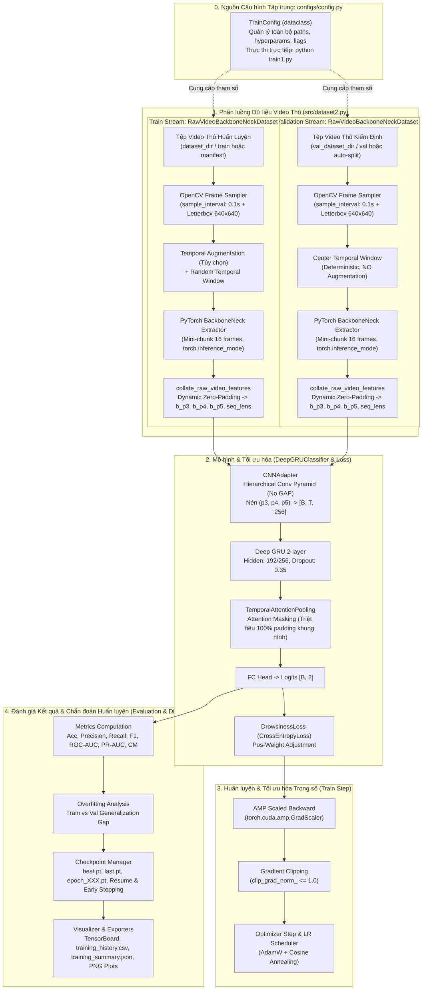

# BÁO CÁO PHÂN TÍCH YÊU CẦU: XÂY DỰNG PIPELINE HUẤN LUYỆN MODEL DEEPGRUCLASSIFIER VỚI DATASET VIDEO THÔ TRÍCH XUẤT PYTORCH BACKBONENECK

**Mã tài liệu:** `analsys_train1.md`  
**Dự án:** Hệ Thống Nhận Diện Tài Xế Buồn Ngủ (Driver Guardian - Deep GRU / LSTM)  
**Tệp mục tiêu:** [`src/train1.py`](file:///D:/Project/DATN/driver-guardian/ai/LSTM/src/train1.py) (kèm tệp thực thi wrapper [`train1.py`](file:///D:/Project/DATN/driver-guardian/ai/LSTM/train1.py) tại thư mục gốc)  
**Tập dữ liệu Huấn luyện & Kiểm định (Train & Val):** `RawVideoBackboneNeckDataset` từ [`src/dataset2.py`](file:///D:/Project/DATN/driver-guardian/ai/LSTM/src/dataset2.py)  
**Kiến trúc mô hình:** `DeepGRUClassifier` từ [`src/models.py`](file:///D:/Project/DATN/driver-guardian/ai/LSTM/src/models.py)  
**Hàm mất mát:** `DrowsinessLoss` / `build_loss` từ [`src/loss.py`](file:///D:/Project/DATN/driver-guardian/ai/LSTM/src/loss.py)  
**Tệp tham chiếu đặt tả yêu cầu ngoài:** [`src/train.py`](file:///D:/Project/DATN/driver-guardian/ai/LSTM/src/train.py)  
**Cơ chế cấu hình duy nhất:** [`configs/config.py`](file:///D:/Project/DATN/driver-guardian/ai/LSTM/configs/config.py) (`TrainConfig` & `load_config()`)  
**Ngày thực hiện:** 04/10/2026  
**Quy chuẩn áp dụng:** [`AGENTS.md`](file:///D:/Project/DATN/driver-guardian/ai/LSTM/AGENTS.md) — Bước 1: Khảo sát & Phân tích (Discovery)  

---

## 1. TỔNG QUAN & MỤC TIÊU NHIỆM VỤ (EXECUTIVE SUMMARY)

### 1.1. Yêu cầu của người dùng
Người dùng yêu cầu tạo tệp `train1.py` với các trọng tâm kỹ thuật:
1. **Huấn luyện mô hình `DeepGRUClassifier`:** Mô hình nhận diện tài xế buồn ngủ được định nghĩa trong [`src/models.py`](file:///D:/Project/DATN/driver-guardian/ai/LSTM/src/models.py), kết hợp `CNNAdapter` (phễu tích chập phân tầng không dùng GAP), Deep GRU 2 tầng và `TemporalAttentionPooling` với Attention Masking.
2. **Nạp dữ liệu Train & Val từ [`src/dataset2.py`](file:///D:/Project/DATN/driver-guardian/ai/LSTM/src/dataset2.py):** Thay vì nạp đặc trưng trích xuất sẵn từ tệp HDF5 (`.h5`) như [`src/train.py`](file:///D:/Project/DATN/driver-guardian/ai/LSTM/src/train.py), cả hai tập Train và Validation trong `train1.py` đều đọc trực tiếp từ video thô (`.mp4`, `.avi`, `.mkv`), giải mã khung hình theo chu kỳ thời gian tùy chỉnh `sample_interval`, căn chỉnh letterbox 640x640 và trích xuất đặc trưng không gian đa tỷ lệ ($p_3, p_4, p_5$) trực tiếp qua mô hình PyTorch native `BackboneNeck` (nạp từ checkpoint `.pt`).
3. **Đặc tả yêu cầu ngoài giống hoàn toàn [`src/train.py`](file:///D:/Project/DATN/driver-guardian/ai/LSTM/src/train.py):** Toàn bộ giao diện cấu hình, cơ chế thực thi, định dạng báo cáo, hệ thống logging, lưu trữ checkpoint, cơ chế resume, vẽ biểu đồ chẩn đoán, và chế độ kiểm thử tự lập (dry-run test) phải tương đồng và đồng bộ với [`src/train.py`](file:///D:/Project/DATN/driver-guardian/ai/LSTM/src/train.py).

---

### 1.2. Bảng so sánh Đối sánh Kỹ thuật: [`src/train.py`](file:///D:/Project/DATN/driver-guardian/ai/LSTM/src/train.py) vs [`src/train1.py`](file:///D:/Project/DATN/driver-guardian/ai/LSTM/src/train1.py)

| Tiêu chí | Pipeline Hiện hữu ([`src/train.py`](file:///D:/Project/DATN/driver-guardian/ai/LSTM/src/train.py)) | Pipeline Mới ([`src/train1.py`](file:///D:/Project/DATN/driver-guardian/ai/LSTM/src/train1.py)) |
| :--- | :--- | :--- |
| **Nguồn dữ liệu Train** | HDF5 Feature Dataset (`HDF5FeatureDataset` từ `src/dataset.py`) | **Raw Video PyTorch BackboneNeck (`RawVideoBackboneNeckDataset` từ `src/dataset2.py`)** |
| **Nguồn dữ liệu Val** | HDF5 Feature Dataset (`HDF5FeatureDataset` từ `src/dataset.py`) | **Raw Video PyTorch BackboneNeck (`RawVideoBackboneNeckDataset` từ `src/dataset2.py`)** |
| **Động cơ trích xuất** | Đã trích xuất trước (Offline Pre-extracted) vào file `.h5` | **Trích xuất trực tiếp online qua PyTorch native `BackboneNeck` (`.pt`)** |
| **Định dạng đầu vào** | Tensor 4D lưu sẵn trong dataset H5 | Video thô (`.mp4`, `.avi`, `.mkv`, `.mov`) giải mã qua OpenCV |
| **Chu kỳ lấy mẫu** | Cố định theo dữ liệu trong file H5 | **Linh hoạt cấu hình qua `sample_interval` (vd: 0.1s ~ 10 FPS, 0.05s ~ 20 FPS)** |
| **Kiến trúc mô hình** | `DeepGRUClassifier` ([`src/models.py`](file:///D:/Project/DATN/driver-guardian/ai/LSTM/src/models.py)) | **`DeepGRUClassifier` ([`src/models.py`](file:///D:/Project/DATN/driver-guardian/ai/LSTM/src/models.py)) (100% Đồng nhất)** |
| **Hàm mất mát** | `DrowsinessLoss` ([`src/loss.py`](file:///D:/Project/DATN/driver-guardian/ai/LSTM/src/loss.py)) | **`DrowsinessLoss` ([`src/loss.py`](file:///D:/Project/DATN/driver-guardian/ai/LSTM/src/loss.py)) (100% Đồng nhất)** |
| **Hàm Gom Batch** | `collate_h5_features` | **`collate_raw_video_features` (Zero-Padding động trục thời gian + `seq_lens`)** |
| **Cấu hình hệ thống** | 100% qua `configs/config.py` (`TrainConfig`) | **100% qua `configs/config.py` (`TrainConfig`), KHÔNG dùng CLI** |
| **Quản lý Checkpoint** | `save_all_epochs`, `last`, `best`, `resume_epoch` | **Đầy đủ cơ chế như `src/train.py` (`save_all_epochs`, `last`, `best`, `resume_epoch`)** |
| **Tạo tác đầu ra** | Logs, CSV history, JSON summary, PNG curves/CM/ROC | **Đầy đủ định dạng và chỉ số tương đương `src/train.py`** |
| **Chế độ Dry-Run** | `run_dry_run_test()` sinh file H5 mock tạm thời | **`run_dry_run_test()` sinh video mock `.mp4` tạm thời qua `cv2.VideoWriter`** |

---

### 1.3. Sơ đồ Luồng Hoạt động (End-to-End Workflow Diagram)



---

## 2. KHẢO SÁT & PHÂN TÍCH KỸ THUẬT CHI TIẾT CÁC THÀNH PHẦN

### 2.1. Phân tích Nguồn Dữ liệu: `RawVideoBackboneNeckDataset` ([`src/dataset2.py`](file:///D:/Project/DATN/driver-guardian/ai/LSTM/src/dataset2.py))
- **Đặc trưng trả về từ mỗi mẫu (`__getitem__`):**
  - `features`: Tuple `(p3, p4, p5)`
    - $p_3 \in \mathbb{R}^{T \times 64 \times 80 \times 80}$
    - $p_4 \in \mathbb{R}^{T \times 128 \times 40 \times 40}$
    - $p_5 \in \mathbb{R}^{T \times 256 \times 20 \times 20}$
  - `label`: `torch.LongTensor` scalar (0: alert, 1: drowsy).
  - `seq_len`: `torch.LongTensor` scalar (số lượng khung hình thực tế $T$ sau lấy mẫu).
  - `meta`: Dict chứa thông tin truy vết (`video_id`, `video_path`, `split`, `fps`, `sample_interval`, `duration_s`, `num_sampled_frames`...).
- **Cơ chế gom batch `collate_raw_video_features`:**
  - Xác định $T_{\max} = \max(\text{seq\_lens})$ trong batch.
  - Cấp phát trước bộ nhớ đệm zero-padded:
    - `b_p3`: $[B, T_{\max}, 64, 80, 80]$
    - `b_p4`: $[B, T_{\max}, 128, 40, 40]$
    - `b_p5`: $[B, T_{\max}, 256, 20, 20]$
  - Trả về tuple chuẩn: `((b_p3, b_p4, b_p5), b_labels, b_seq_lens, b_metas)`.
  - Cấu trúc đầu ra này tương thích **100%** với đầu vào mà `DrowsinessTrainer.train_one_epoch` và `validate` trong [`src/train.py`](file:///D:/Project/DATN/driver-guardian/ai/LSTM/src/train.py) đang tiếp nhận!

---

### 2.2. Phân tích Mô hình: `DeepGRUClassifier` ([`src/models.py`](file:///D:/Project/DATN/driver-guardian/ai/LSTM/src/models.py))
- **Giao diện gọi forward:**
  ```python
  logits = model((p3, p4, p5), seq_lens=seq_lens)
  ```
- **Xử lý Masking trong Attention Pooling:**
  - `TemporalAttentionPooling` nhận `seq_lens` và sinh ra mặt nạ boolean `mask` $[B, T]$:
    ```python
    mask = positions < seq_lens.unsqueeze(1)
    scores = scores.masked_fill(~mask, -1e9)
    weights = F.softmax(scores, dim=-1)
    ```
  - Cơ chế này đảm bảo toàn bộ các khung hình đệm (zero-padded frames sau $T_i$) bị triệt tiêu 100% trọng số attention, không làm sai lệch đặc trưng biểu diễn của chuỗi video.

---

### 2.3. Phân tích Đặt tả Yêu cầu Ngoài (External Specifications) Tương thích [`src/train.py`](file:///D:/Project/DATN/driver-guardian/ai/LSTM/src/train.py)

Tệp [`src/train1.py`](file:///D:/Project/DATN/driver-guardian/ai/LSTM/src/train1.py) phải tuân thủ nghiêm ngặt các đặt tả bên ngoài như sau:

#### A. Kiến trúc Lớp Điều phối & Quản lý
1. **`MetricsTracker`**:
   - Tích lũy nhãn thực tế, nhãn dự đoán, xác suất lớp 1 (Drowsy), tổng loss.
   - Tính toán đầy đủ: Accuracy, F1-Drowsy, F1-Macro, F1-Weighted, Precision, Recall, Specificity, ROC-AUC, PR-AUC.
   - Xuất Confusion Matrix $[2 \times 2]$ và Classification Report chi tiết.
2. **`TrainingVisualizer`**:
   - Tích hợp TensorBoard `SummaryWriter` (ghi nhận loss, metrics, lr, grad_norm, latency).
   - Xuất bảng lịch sử `training_history.csv` qua từng epoch.
   - Xuất tệp tóm tắt chẩn đoán `training_summary.json`.
   - Sinh 3 biểu đồ đồ họa:
     - `loss_accuracy_curves.png`: Đường cong Loss và Accuracy/F1 (Train vs Val), tô màu vùng Overfitting Generalization Gap.
     - `confusion_matrix_best.png`: Ma trận nhầm lẫn của epoch tốt nhất có chú giải chỉ số.
     - `roc_pr_curves.png`: Đường cong ROC (với AUC) và PR Curve (với AP).
   - Hỗ trợ hàm `sync_history_from_csv(resumed_epoch)` để đồng bộ lịch sử biểu đồ khi resume.
3. **`CheckpointManager`**:
   - Cơ chế `save_all_epochs=True`: Lưu độc lập từng epoch `checkpoint_dir / f"{exp_name}_epoch_{epoch:03d}.pt"`.
   - Lưu `checkpoint_dir / f"{exp_name}_last.pt"` và `checkpoint_dir / f"{exp_name}_best.pt"`.
   - Payload checkpoint bao gồm: `epoch`, `model_state_dict`, `optimizer_state_dict`, `scheduler_state_dict`, `scaler_state_dict`, `best_score`, `best_epoch`, `patience_counter`, `config`, `val_metrics`, `timestamp`.
   - Cơ chế nạp checkpoint: `load_checkpoint` hỗ trợ nạp theo số epoch cụ thể (`resume_epoch=X`), nạp theo alias (`'last'`, `'best'`), hoặc đường dẫn file trực tiếp.
   - Tích hợp điều kiện Early Stopping: Dừng sớm sau `patience` epoch nếu `monitor_metric` không cải thiện.
4. **`DrowsinessTrainer1` (hoặc `RawVideoDrowsinessTrainer`)**:
   - `__init__(config: TrainConfig)`: Khởi tạo logger, seed, thiết bị, dataloaders từ `dataset2`, model, loss, optimizer, scheduler, visualizer, checkpoint manager, và tự động xử lý Resume nếu `enable_resume=True`.
   - `train_one_epoch(epoch: int) -> Tuple[Dict[str, float], float]`: Huấn luyện 1 epoch với thanh tiến trình tqdm, AMP FP16, Gradient Clipping, tính Grad Norm.
   - `validate(epoch: int) -> Tuple[Dict[str, float], np.ndarray, List[int], List[float], float]`: Đánh giá tập kiểm định với tqdm, tính toán metrics và đo độ trễ suy luận (ms/clip).
   - `fit() -> Dict[str, Any]`: Vòng lặp điều phối chính qua các epoch.
   - `evaluate_final(fit_results: Dict[str, Any]) -> Dict[str, Any]`: Nạp trọng số tốt nhất `best.pt`, đánh giá lần cuối trên tập val, xuất toàn bộ biểu đồ chẩn đoán và tệp JSON tóm tắt.
   - `close()`: Dọn dẹp an toàn các tài nguyên (TensorBoard writer, CUDA memory, handlers).

#### B. Giao diện Lập trình Cấp cao & Entry Point
- **Hàm `train_pipeline(config=None, enable_resume=None, resume_epoch=None) -> Dict[str, Any]`:**
  - Cho phép gọi thực thi trực tiếp từ script Python khác hoặc Jupyter Notebook mà không cần chạy CLI.
- **Hàm `run_dry_run_test() -> None`:**
  - Chạy mô phỏng kiểm thử toàn diện độc lập khi `config.dry_run=True`.
- **Hàm `main() -> None`:**
  - Điểm khởi chạy mặc định khi thực thi từ dòng lệnh: `python src/train1.py` hoặc `python train1.py`.
- **Tệp wrapper tại thư mục gốc: `train1.py`:**
  - Nhập và tái xuất các thực thể từ `src.train1`, cho phép người dùng chạy trực tiếp `python train1.py` từ thư mục gốc dự án tương tự như `train.py`.

---

## 3. CÁC THÁCH THỨC KỸ THUẬT TRỌNG YẾU & PHƯƠNG ÁN GIẢI QUYẾT

### 3.1. Thách thức 1: Tối ưu Thông lượng và Quản lý VRAM khi Huấn luyện với Video Thô (CRITICAL)
- **Vấn đề:** 
  - Trong `src/train.py`, đặc trưng đã nằm sẵn trên ổ cứng dưới dạng H5, nạp vào RAM/GPU rất nhanh.
  - Trong `src/train1.py`, mỗi batch huấn luyện đều phải:
    1. Đọc video qua OpenCV từ ổ đĩa.
    2. Cắt khung hình theo `sample_interval` và letterbox 640x640.
    3. Chạy forward pass mô hình `BackboneNeck` trên GPU hoặc CPU theo mini-chunk 16 frames.
    4. Gom batch zero-padding và đưa vào `DeepGRUClassifier`.
  - Nếu `BackboneNeck` chạy trên cùng GPU với `DeepGRUClassifier` trong quá trình `train_one_epoch`, VRAM sẽ bị chiếm dụng đồng thời bởi cả 2 mô hình.
- **Giải pháp:**
  1. **Đóng băng BackboneNeck & Chạy trong `torch.inference_mode()`:** BackboneNeck chỉ đóng vai trò bộ trích xuất đặc trưng thuần túy, gradient bị ngắt hoàn toàn (`requires_grad=False`), giải phóng bộ nhớ đồ thị tính toán.
  2. **Mini-Chunk Processing:** Xử lý khung hình từng cụm 16 ảnh (`chunk_size=16`), sau đó đẩy ngay tensor kết quả $p_3, p_4, p_5$ về CPU RAM trong `__getitem__`.
  3. **Tách biệt bộ nhớ Forward:** Chỉ khi chuyển vào `DeepGRUClassifier`, batch mới được `.to(self.device, non_blocking=True)`, giúp VRAM GPU không bị tích lũy đột biến.
  4. **Hỗ trợ `chunk_size` tùy chỉnh trong cấu hình:** Cho phép cấu hình `chunk_size` (vd: 8, 16) phù hợp với GPU 4GB VRAM.

---

### 3.2. Thách thức 2: Đa tiến trình DataLoader trên Windows với CUDA (CUDA IPC Spawning)
- **Vấn đề:**
  - Trên Windows, PyTorch `DataLoader` với `num_workers > 0` sử dụng cơ chế `spawn`. Nếu tiến trình con khởi tạo hoặc tương tác với CUDA context không đúng cách, sẽ phát sinh lỗi `RuntimeError: Cannot re-initialize CUDA in forked/spawned subprocess`.
- **Giải pháp:**
  - `src/dataset2.py` đã giải quyết triệt để vấn đề này thông qua cơ chế **Lazy Model Initialization**: `PyTorchBackboneNeckExtractor` chỉ được khởi tạo trong lần gọi `__getitem__` đầu tiên của chính tiến trình worker đó.
  - Trong `train1.py`, thiết lập cơ chế **Safety Guard** tự động:
    - Nếu chạy trên Windows (`os.name == 'nt'`) và thiết bị trích xuất là CUDA: Khuyến nghị mặc định `num_workers=0` để đạt độ ổn định tuyệt đối và tránh tranh chấp tài nguyên GPU với tiến trình huấn luyện chính.
    - Nếu người dùng cấu hình `num_workers > 0`, kiểm tra cấu hình thiết bị trích xuất hoặc cho phép chạy an toàn với bộ worker_init_fn phù hợp.

---

### 3.3. Thách thức 3: Khả năng Tự động Phân chia Train/Validation Dataset Linh hoạt
- **Vấn đề:**
  - Người dùng có thể cấu hình dữ liệu theo 2 cách:
    - Cách A: Có sẵn thư mục tách biệt `train/` và `val/` (hoặc có cột `split` trong manifest CSV).
    - Cách B: Toàn bộ video nằm trong một thư mục phẳng (hoặc manifest chung không có cột split).
- **Giải pháp:**
  - Trong `DrowsinessTrainer1._build_dataloaders()`, áp dụng logic phân tầng thông minh:
    1. Trước tiên khởi tạo `train_dataset` với `split="train"` và `val_dataset` với `split="val"`.
    2. Nếu `len(val_dataset) == 0` và `len(train_dataset) > 1`: Tự động nạp toàn bộ qua `split="all"` và thực hiện chia tập ngẫu nhiên bảo toàn tỷ lệ `train_ratio` (mặc định 0.8) bằng `torch.utils.data.random_split` có cố định seed tái lập (`torch.Generator().manual_seed(seed)`).
    3. Đảm bảo tập train dùng `window_sampling="random"` kèm bộ tăng cường `augmenter` (nếu cấu hình), trong khi tập val dùng `window_sampling="center"` và tuyệt đối không áp dụng data augmentation để ngăn ngừa rò rỉ dữ liệu (Data Leakage).

---

### 3.4. Thách thức 4: Tự Lập Kiểm Thử Dry-Run Toàn Diện với Mock Video (`run_dry_run_test`)
- **Vấn đề:**
  - Trong `src/train.py`, hàm `run_dry_run_test` tạo file HDF5 giả lập (`create_mock_h5_dataset`).
  - Trong `src/train1.py`, luồng dữ liệu là video thô `.mp4`, do đó kiểm thử dry-run cần tạo các clip video `.mp4` ngắn hợp lệ thông qua OpenCV `cv2.VideoWriter`, giả lập cấu trúc thư mục `train/0_alert`, `train/1_drowsy`, `val/0_alert`, `val/1_drowsy`.
- **Giải pháp:**
  - Xây dựng hàm `run_dry_run_test()` hoàn toàn khép kín:
    1. Tạo thư mục tạm `test_train1_dryrun_...`.
    2. Dùng OpenCV tạo 4 video clips ngắn (màu sắc phân biệt theo nhãn alert/drowsy).
    3. Chạy `DrowsinessTrainer1` trong 2 epochs với `save_all_epochs=True`.
    4. Kiểm tra sự tồn tại và tính hợp lệ của các file checkpoint (`epoch_001.pt`, `epoch_002.pt`, `last.pt`, `best.pt`).
    5. Kiểm tra tính toàn vẹn của `training_history.csv`, `training_summary.json`, và các biểu đồ PNG.
    6. Kiểm tra cơ chế Resume: thử nghiệm nạp lại từ Epoch 1 (tiếp tục tại Epoch 2) và kiểm tra xử lý ngoại lệ khi nạp Epoch không tồn tại.
    7. Tự động dọn dẹp sạch sẽ tài nguyên và thư mục tạm trong khối `finally`.

---

## 4. CHI TIẾT THIẾT KẾ CẤU HÌNH & GIAO DIỆN LẬP TRÌNH

### 4.1. Khung Tham số Cấu hình Tập trung (`TrainConfig`)
Toàn bộ tham số cấu hình được đọc từ [`configs/config.py`](file:///D:/Project/DATN/driver-guardian/ai/LSTM/configs/config.py). `src/train1.py` sử dụng các trường cấu hình tương thích:

```python
# Cấu hình Dữ liệu Video Thô (src/dataset2.py)
dataset_dir: str = r"D:\Project\AI\dataset\filtered_SUST\in_threshold"  # Thư mục chứa video thô
manifest_file: Optional[str] = None                                    # File manifest CSV (nếu có)
val_dataset_dir: Optional[str] = None                                  # Thư mục video validation (None = dùng chung dataset_dir)
val_manifest: Optional[str] = None                                     # File manifest CSV validation
sample_interval: float = 0.1                                           # Chu kỳ lấy mẫu khung hình (giây) -> ~10 FPS
seq_len: Optional[int] = None                                          # Độ dài chuỗi khung hình (None: toàn bộ clip)
min_frames: int = 1                                                    # Số khung hình tối thiểu hợp lệ
chunk_size: int = 16                                                   # Kích thước mini-chunk trích xuất BackboneNeck
train_ratio: float = 0.8                                               # Tỷ lệ phân chia train/val nếu thư mục phẳng

# Cấu hình Mô hình & Trích xuất PyTorch Checkpoint
checkpoint_path: str = DEFAULT_CHECKPOINT_PATH                         # Đường dẫn checkpoint .pt của BackboneNeck
input_dim: int = 256                                                   # Chiều vector sau Spatial CNNAdapter
hidden_dim: int = 192                                                  # Kích thước ẩn của Deep GRU
num_layers: int = 2                                                    # Số tầng Deep GRU
spatial_fusion: str = "concat"                                         # Phương thức dung hợp: concat | attention | sum | mean
dropout: float = 0.35                                                  # Dropout rate
adapter_dropout: float = 0.25                                          # Adapter dropout rate

# Cấu hình Huấn luyện & Checkpoint
batch_size: int = 4                                                    # Batch size cho video thô
val_batch_size: int = 4                                                # Batch size cho val
epochs: int = 40                                                       # Tổng số epoch
lr0: float = 1e-3                                                      # Learning rate ban đầu
optimizer: str = "adamw"                                               # adamw | adam | sgd
scheduler_type: str = "cosine"                                         # cosine | plateau
amp: bool = True                                                       # Automatic Mixed Precision FP16
save_all_epochs: bool = True                                           # Lưu checkpoint cho TẤT CẢ các epoch
enable_resume: bool = False                                            # Cờ kích hoạt tiếp tục huấn luyện
resume_epoch: Optional[int] = None                                     # Số epoch cần resume
experiment_name: str = "deepgru_rawvideo_dataset2"                     # Tên bài thử nghiệm
```

---

### 4.2. Cấu trúc Tệp & Thư mục Dự kiến

```text
D:\Project\DATN\driver-guardian\ai\LSTM/
├── train1.py                        # [MỚI] Điểm thực thi tại thư mục gốc (Entry point wrapper)
├── src/
│   ├── train.py                     # Pipeline huấn luyện hiện hữu (HDF5 Train + HDF5 Val)
│   ├── train1.py                    # [MỚI] Pipeline huấn luyện mới (Dataset2 Raw Video Train & Val)
│   ├── dataset2.py                  # Module dataset nạp video thô & trích xuất PyTorch BackboneNeck
│   ├── models.py                    # DeepGRUClassifier & CNNAdapter
│   └── loss.py                      # DrowsinessLoss
├── docs/
│   ├── analsys/
│   │   └── analsys_train1.md        # [TÀI LIỆU NÀY] Báo cáo phân tích yêu cầu Bước 1
│   ├── plan/
│   │   └── plan_train1.md           # Kế hoạch thực hiện chi tiết Bước 2 (sau khi user duyệt)
│   └── report/
│       └── report_train1.md         # Báo cáo tổng kết nghiệm thu Bước 3
└── logs/
    ├── deepgru_rawvideo_dataset2.log# File ghi log chi tiết
    ├── training_history.csv         # Lịch sử các metrics qua từng epoch
    ├── training_summary.json        # Tóm tắt kết quả cuối cùng
    └── *.png                        # Các biểu đồ chẩn đoán (Loss, Accuracy, CM, ROC/PR)
```

---

## 5. KẾ HOẠCH BƯỚC TIẾP THEO & TIÊU CHUẨN NGHIỆM THU

### 5.1. Quy trình Tuân thủ [`AGENTS.md`](file:///D:/Project/DATN/driver-guardian/ai/LSTM/AGENTS.md)
Theo đúng quy định nghiêm ngặt tại **Mục 5 của AGENTS.md**:
1. **Bước 1 (Hiện tại):** Hoàn thành tài liệu phân tích `docs/analsys/analsys_train1.md`. Chờ phản hồi và sự chấp thuận của Người dùng.
2. **Bước 2 (Sau khi Người dùng chấp thuận):** Xây dựng kế hoạch thực hiện chi tiết trong tệp `docs/plan/plan_train1.md`.
3. **Bước 3 (Sau khi Người dùng duyệt Kế hoạch):** Triển khai mã nguồn [`src/train1.py`](file:///D:/Project/DATN/driver-guardian/ai/LSTM/src/train1.py), [`train1.py`](file:///D:/Project/DATN/driver-guardian/ai/LSTM/train1.py), chạy kiểm thử tự lập dry-run xác thực 100% và xuất báo cáo `docs/report/report_train1.md`.

### 5.2. Tiêu chí Nghiệm thu Chất lượng (Acceptance Criteria)
- [ ] Tệp [`src/train1.py`](file:///D:/Project/DATN/driver-guardian/ai/LSTM/src/train1.py) tích hợp thành công `RawVideoBackboneNeckDataset` và `collate_raw_video_features` từ [`src/dataset2.py`](file:///D:/Project/DATN/driver-guardian/ai/LSTM/src/dataset2.py).
- [ ] Tích hợp mô hình `DeepGRUClassifier` từ [`src/models.py`](file:///D:/Project/DATN/driver-guardian/ai/LSTM/src/models.py) và `DrowsinessLoss` từ [`src/loss.py`](file:///D:/Project/DATN/driver-guardian/ai/LSTM/src/loss.py).
- [ ] Giao diện ngoài, các hàm `train_pipeline`, `main`, bộ `MetricsTracker`, `TrainingVisualizer`, `CheckpointManager` đồng bộ 100% với [`src/train.py`](file:///D:/Project/DATN/driver-guardian/ai/LSTM/src/train.py).
- [ ] Đầy đủ cơ chế `save_all_epochs`, `enable_resume`, `resume_epoch`, và đồng bộ lịch sử.
- [ ] Chế độ kiểm thử dry-run tự lập (`run_dry_run_test`) chạy thành công từ đầu đến cuối không phát sinh bất kỳ lỗi nào.
