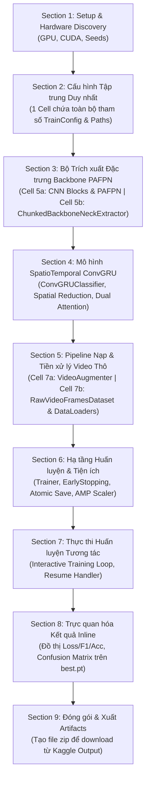

# TÀI LIỆU PHÂN TÍCH: XÂY DỰNG JUPYTER NOTEBOOK HUẤN LUYỆN TRÊN KAGGLE CHO SRC/TRAIN.PY

- **Mã yêu cầu**: `TRAIN_KAGGLE`
- **Tệp phân tích**: `docs/analsys/analsys_train_kaggle.md`
- **Mã nguồn tham chiếu**: [src/train.py](file:///D:/Project/DATN/driver-guardian/ai/LSTM/src/train.py), [src/models.py](file:///D:/Project/DATN/driver-guardian/ai/LSTM/src/models.py), [src/dataset.py](file:///D:/Project/DATN/driver-guardian/ai/LSTM/src/dataset.py), [configs/config.py](file:///D:/Project/DATN/driver-guardian/ai/LSTM/configs/config.py), [configs/config.yaml](file:///D:/Project/DATN/driver-guardian/ai/LSTM/configs/config.yaml)
- **Tệp đầu ra dự kiến**: [notebooks/02_train_convgru_kaggle.ipynb](file:///D:/Project/DATN/driver-guardian/ai/LSTM/notebooks/02_train_convgru_kaggle.ipynb)
- **Quy chuẩn áp dụng**: [AGENTS.md](file:///D:/Project/DATN/driver-guardian/ai/LSTM/AGENTS.md) — Bước 1: Khảo sát & Phân tích (Discovery)
- **Trạng thái**: Đang chờ người dùng phê duyệt trước khi chuyển sang Bước 2 (Lên kế hoạch).

---

## 1. YÊU CẦU CỐT LÕI VÀ BỐI CẢNH DỰ ÁN

### 1.1. Yêu cầu từ người dùng
> *"tạo phiên bản .ipynb của file @src/train.py được chạy trên môi trường kaggle"*

### 1.2. Bối cảnh kỹ thuật hiện tại
1. Toàn bộ mã nguồn cốt lõi của dự án Driver Guardian AI (mô hình phát hiện tài xế buồn ngủ bằng SpatioTemporal ConvGRU) vừa trải qua đợt tái cấu trúc và chuẩn hóa lớn:
   - Toàn bộ logic huấn luyện tối ưu nhất đã được hợp nhất vào [src/train.py](file:///D:/Project/DATN/driver-guardian/ai/LSTM/src/train.py) (phiên bản 2.0).
   - Mô hình `ConvGRUClassifier` trong [src/models.py](file:///D:/Project/DATN/driver-guardian/ai/LSTM/src/models.py) đã chuẩn hóa kích thước 631,716 tham số (`input_dim=128`, `hidden_dim=64`, `num_layers=2`).
   - Bộ nạp dữ liệu video thô và trích xuất đặc trưng on-the-fly nằm trong [src/dataset.py](file:///D:/Project/DATN/driver-guardian/ai/LSTM/src/dataset.py) (`ChunkedBackboneNeckExtractor`, `RawVideoFramesDataset`, `build_raw_video_dataloaders`).
   - Cấu hình [configs/config.py](file:///D:/Project/DATN/driver-guardian/ai/LSTM/configs/config.py) và [configs/config.yaml](file:///D:/Project/DATN/driver-guardian/ai/LSTM/configs/config.yaml) đã được dọn sạch các tham số rác.
2. Tệp notebook cũ trong lịch sử git (`notebooks/02_train_convgru_kaggle.ipynb`) đã bị gỡ bỏ để thay thế bằng phiên bản mới chuẩn mực, đồng bộ hoàn toàn với [src/train.py](file:///D:/Project/DATN/driver-guardian/ai/LSTM/src/train.py) hiện tại.

---

## 2. PHÂN TÍCH ĐỐI CHIẾU MÃ NGUỒN `SRC/TRAIN.PY`

Nhằm đảm bảo phiên bản Notebook mang đầy đủ sức mạnh và độ tin cậy của mã nguồn Python Script, bảng đối chiếu dưới đây phân tích chi tiết từng khối chức năng trong [src/train.py](file:///D:/Project/DATN/driver-guardian/ai/LSTM/src/train.py) và phương án chuyển đổi vào Notebook:

| Thành phần kỹ thuật | Hiện trạng trong `src/train.py` | Giải pháp tương ứng trong Notebook Kaggle | Đánh giá độ ưu tiên |
| :--- | :--- | :--- | :--- |
| **Tính tái lập (Reproducibility)** | `seed_everything(seed=42)` cố định random, numpy, torch, cudnn deterministic. | Giữ nguyên hàm `seed_everything` trong Cell thiết lập ban đầu. | **Bắt buộc** |
| **Cấu hình (Configuration)** | Dataclass `TrainConfig` đọc từ YAML/JSON hoặc tham số dòng lệnh `argparse`. | 1 Cell cấu hình tập trung duy nhất khai báo toàn bộ tham số của `TrainConfig` (bao gồm đường dẫn Kaggle và toàn bộ siêu tham số). | **Bắt buộc** |
| **Kiến trúc mô hình** | Import từ `src.models.ConvGRUClassifier`. | Cung cấp định nghĩa kiến trúc đầy đủ, khép kín (Self-Contained 100%) trực tiếp trong các Cell của Notebook; đảm bảo 631,716 tham số. | **Bắt buộc** |
| **Trích xuất đặc trưng PAFPN** | `ChunkedBackboneNeckExtractor` nạp checkpoint NMSFreeDetector `.pt`, chia mini-chunk 32 frames tránh OOM. | Định nghĩa extractor trong cell, nạp checkpoint từ đường dẫn `cfg.backbone_neck_checkpoint` được khai báo ở Cell cấu hình. | **Bắt buộc** |
| **Tăng cường Dữ liệu (Augmentation)** | Module `src/augment.py` (`DetectionAugmenter`, `apply_sequence` đồng bộ random seed bảo toàn tính nhất quán thời gian `Temporal Consistency` cho toàn bộ các frame trong 1 clip video). | Tích hợp lớp `VideoAugmenter` (kế thừa từ `src/augment.py`) trực tiếp vào Cell của Notebook; xử lý tương thích đa phiên bản Albumentations (`A.Affine` vs `A.ShiftScaleRotate`). | **Bắt buộc** |
| **Pipeline Dữ liệu** | `build_raw_video_dataloaders` đọc video thô qua OpenCV, lấy mẫu đều đặn 0.2s, padding động. | Đồng bộ lớp `RawVideoFramesDataset` và `collate_video_frames`, xử lý an toàn đa luồng trên Linux. | **Bắt buộc** |
| **Hàm mất mát (Loss Function)** | `compute_loss_and_preds`: hỗ trợ BCEWithLogitsLoss (1-logit) và CrossEntropyLoss (2-class), khắc phục lỗi 0-gradient. | Giữ nguyên 100% logic chuẩn hóa loss và argmax/thresholding. | **Bắt buộc** |
| **Tối ưu & Lịch trình LR** | `AdamW` (`lr0=1e-3`, `weight_decay=1e-4`), `CosineAnnealingLR` (`eta_min=1e-5`). | Giữ nguyên cấu hình optimizer và scheduler. | **Bắt buộc** |
| **Tăng tốc & Bộ nhớ** | AMP FP16 (`GradScaler`), Gradient Accumulation (chuẩn hóa biên epoch), OOM Exception Recovery. | Giữ nguyên toàn bộ logic AMP, Gradient Accumulation và `torch.cuda.empty_cache()` khi bắt lỗi OOM. | **Bắt buộc** |
| **Cơ chế Lưu Checkpoint** | Atomic Save (`.tmp` -> rename), phân giải bí danh `'last'`, `'best'`, lưu `last.pt`, `best.pt`, `epoch_N.pt`. | Giữ nguyên cơ chế Atomic Save vào thư mục `/kaggle/working/checkpoints/`. | **Bắt buộc** |
| **Khôi phục Huấn luyện (Resume)** | Phục hồi toàn bộ `model`, `optimizer`, `scheduler`, `scaler` (Resumable AMP), `epoch`, `best_val_f1`. | Bổ sung biến đường dẫn `RESUME_PATH` trực quan trong cấu hình cell để dễ dàng chọn checkpoint tiếp tục train. | **Bắt buộc** |
| **Giám sát & Nhật ký** | TensorBoard (`SummaryWriter`), Early Stopping (`patience=10`), ghi file `training_history.csv`. | Duy trì TensorBoard + `training_history.csv`, đồng thời bổ sung **biểu đồ trực quan Matplotlib inline** hiển thị ngay trong notebook. | **Trọng tâm nâng cấp** |

---

## 3. CÁC THÁCH THỨC ĐẶC THÙ TRÊN KAGGLE VÀ GIẢI PHÁP KỸ THUẬT

Môi trường Kaggle Notebooks (GPU Kernel) có những ràng buộc phần cứng và hệ thống tệp hoàn toàn khác biệt so với máy tính cục bộ (Windows):

### 3.1. Thách thức 1: Tính Độc lập Tự chủ (100% Self-Contained)
- **Vấn đề**: Trên Kaggle, người dùng thường tải lên một tệp `.ipynb` duy nhất (qua nút "Upload Notebook"). Nếu notebook gọi lệnh `from src.train import Trainer` hoặc `from src.models import ConvGRUClassifier`, kernel sẽ báo lỗi `ModuleNotFoundError: No module named 'src'` vì thư mục mã nguồn không nằm trong container.
- **Giải pháp**: Xây dựng notebook theo kiến trúc **Self-Contained All-in-One thuần túy (100% Khép kín)**:
  - Tích hợp toàn bộ mã nguồn của các lớp cốt lõi (`ConvGRUClassifier`, `ChunkedBackboneNeckExtractor`, `RawVideoFramesDataset`, `Trainer`, `EarlyStopping`, `TrainConfig`) trực tiếp vào các Cell code riêng biệt của Notebook.
  - Tuyệt đối không import từ thư mục ngoài `src/`, loại bỏ hoàn toàn các cơ chế kiểm tra fallback rườm rà, đảm bảo notebook hoạt động độc lập ngay lập tức chỉ với 1 tệp `.ipynb` duy nhất.

### 3.2. Thách thức 2: Hệ thống tệp Kaggle & Tập trung hóa Cấu hình (Single Configuration Cell)
- **Vấn đề**:
  - Thư mục đầu vào `/kaggle/input/...` là **Read-Only** (chỉ đọc). Không thể ghi checkpoint, log hay file CSV vào đây.
  - Thư mục duy nhất có quyền ghi là `/kaggle/working/` (hoặc `/tmp/`).
  - Đường dẫn trên máy cục bộ chứa ký tự ổ đĩa Windows (`D:/...`, `E:/...`), sẽ gây lỗi crash lập tức trên Linux Kaggle.
- **Giải pháp**:
  - **Tập trung toàn bộ cấu hình vào đúng 1 Cell duy nhất (Single Configuration Cell)**:
    - Loại bỏ hoàn toàn cơ chế tự động dò tìm đường dẫn (`auto_detect_kaggle_paths`) để tránh rủi ro quét nhầm thư mục hoặc phát sinh ngoại lệ ngầm.
    - Toàn bộ tham số hệ thống (tương đương `TrainConfig` trong `configs/config.py` và `configs/config.yaml`) được gom nhóm gọn gàng, định nghĩa minh bạch trong **duy nhất 1 Cell code**.
    - Người dùng chỉ cần xem và chỉnh sửa trực tiếp mọi tham số tại Cell này trước khi chạy (ví dụ: đường dẫn input dataset `/kaggle/input/...`, checkpoint Backbone `/kaggle/input/.../best.pt`, thư mục lưu checkpoints `/kaggle/working/checkpoints`, batch size, learning rate, epochs,...).

### 3.3. Thách thức 3: Tài nguyên Phần cứng & Tránh Tràn VRAM/Bộ nhớ Đệm (OOM)
- **Vấn đề**:
  - GPU Kaggle (Tesla T4 x1: 15GB VRAM, Tesla P100: 16GB VRAM, GPU L4: 24GB VRAM).
  - RAM hệ thống bị giới hạn, và Shared Memory (`/dev/shm`) trên Linux Kaggle chỉ khoảng 4GB. Nếu đặt `num_workers` quá lớn hoặc `pin_memory=True` với dữ liệu video nặng có thể dẫn đến lỗi `RuntimeError: DataLoader worker killed by signal: Bus error`.
  - Dung lượng ổ đĩa `/kaggle/working` tối đa 20GB. Nếu lưu checkpoint mọi epoch (`save_all_epochs=True`) kèm nhiều tệp tạm có thể gây đầy đĩa.
- **Giải pháp**:
  - Thiết lập siêu tham số an toàn mặc định cho Kaggle:
    - `batch_size = 4` kết hợp `gradient_accumulation_steps = 4` (tổng batch tương đương 16, đảm bảo hội tụ mà không tốn VRAM).
    - `num_workers = 2`, `pin_memory = False` (an toàn tuyệt đối với `/dev/shm`).
    - `chunk_size = 32` khi forward Backbone extractor (ngăn ngừa bùng nổ tensor trung gian).
    - Giữ lại khối `try ... except RuntimeError as e: if "out of memory" in str(e).lower(): ... empty_cache()` từ `src/train.py`.
    - `save_all_epochs = False`, `save_ckpt_interval_epochs = 5`, luôn lưu `best.pt` và `last.pt` để tiết kiệm ổ đĩa.

### 3.4. Thách thức 4: Trực quan hóa Đồ thị Học tập Trực tiếp (Inline Visualization)
- **Vấn đề**: Trong script `train.py`, thông số huấn luyện được ghi vào TensorBoard. Tuy nhiên trên Kaggle, việc xem TensorBoard yêu cầu mở cổng hoặc tiện ích mở rộng phức tạp.
- **Giải pháp**:
  - Vẫn duy trì ghi nhật ký TensorBoard và file `training_history.csv`.
  - Bổ sung **Section Trực quan hóa Đồ thị** ngay sau khi huấn luyện:
    - Đọc dữ liệu từ `training_history.csv`.
    - Dùng `matplotlib` / `seaborn` vẽ 4 biểu đồ con: Loss (Train vs Val), F1-Score (Train vs Val), Accuracy (Train vs Val), Learning Rate qua từng epoch.
    - Đánh giá tập Validation bằng checkpoint `best.pt` và vẽ ma trận nhầm lẫn (Confusion Matrix) trực tiếp trong cell output.

### 3.5. Thách thức 5: Cơ chế Đóng gói và Tải Artifacts về Máy cục bộ
- **Vấn đề**: Sau khi kết thúc huấn luyện trên Kaggle, người dùng cần tải trọng số và nhật ký về máy. Việc tải từng file riêng lẻ trên giao diện Kaggle Output rất mất thời gian.
- **Giải pháp**:
  - Bổ sung cell cuối cùng tự động đóng gói toàn bộ thư mục output thành một file nén: `/kaggle/working/convgru_training_artifacts.zip`.
  - In đường dẫn và hướng dẫn tải file zip trực tiếp từ tab **Output** của Kaggle.

### 3.6. Thách thức 6: Tăng cường Dữ liệu Video Nhất quán Thời gian (`src/augment.py`)
- **Vấn đề**:
  - Trong `src/dataset.py:513`, khi cấu hình `use_augmentation=True`, code gọi lệnh `from src.augment import get_video_augmenter`. Nếu notebook không tích hợp logic từ `src/augment.py`, câu lệnh này sẽ âm thầm văng ngoại lệ `ModuleNotFoundError` và rơi vào nhánh fallback gán `effective_augmenter = None`. Hậu quả là toàn bộ quá trình train trên Kaggle bị mất sạch các phép tăng cường dữ liệu mà người dùng không hề hay biết!
  - Trong bài toán phân loại video, tăng cường khung hình **bắt buộc phải bảo toàn tính nhất quán thời gian (Temporal Consistency)**: Mọi khung hình trong cùng một clip $T$ frames phải được áp dụng CHUNG 1 RANDOM SEED (cùng một góc xoay, cùng độ co giãn, cùng hướng lật ngang, cùng mức thay đổi sáng/màu). Nếu mỗi frame bị biến đổi ngẫu nhiên khác nhau, video sẽ bị giật cục/nhấp nháy hỗn loạn và phá vỡ thông tin liên tục về mặt thời gian mà ConvGRU đang học.
- **Giải pháp**:
  - Nhúng trực tiếp toàn bộ pipeline tăng cường từ `src/augment.py` thành lớp `VideoAugmenter` ngay trong Notebook.
  - Tương thích đa phiên bản `albumentations` trên Kaggle (xử lý cả `A.Affine` trên bản mới và `A.ShiftScaleRotate` trên bản cũ; `var_limit` vs `std_range` trong `A.GaussNoise`).
  - Hỗ trợ phương thức `apply_sequence(frames, seed)` nhận danh sách các frame và trả về danh sách frame đã tăng cường đồng bộ 100%.

---

## 4. PHÂN TÍCH CHUYÊN SÂU: BỘ TRÍCH XUẤT ĐẶC TRƯNG `ChunkedBackboneNeckExtractor`

`ChunkedBackboneNeckExtractor` là một trong hai mắt xích cốt lõi nhất của pipeline huấn luyện (bên cạnh `ConvGRUClassifier`). Để đảm bảo notebook hoạt động 100% Self-Contained và không gặp lỗi OOM trên GPU Kaggle, thành phần này đòi hỏi phân tích kỹ thuật toàn diện ở 5 góc độ:

### 4.1. Bản chất & Vai trò Kỹ thuật trong Pipeline
- **Đóng vai trò Visual Backbone**: Trích xuất biểu diễn không gian đa tỷ lệ từ khung hình video thô để cung cấp cho mô hình chuỗi thời gian `ConvGRUClassifier`.
- **Đầu vào**: Tensor video đa chiều $[B, T, 3, H, W]$ (với $H=W=640$, kiểu dữ liệu `uint8` [0, 255] trên CPU/GPU).
- **Đầu ra**: 3 bản đồ đặc trưng kim tự tháp (Feature Pyramid Maps) tại các stride khác nhau:
  - $p_3 \in \mathbb{R}^{B \times T \times 64 \times 80 \times 80}$ (Stride 8 — Đặc trưng chi tiết độ phân giải cao).
  - $p_4 \in \mathbb{R}^{B \times T \times 128 \times 40 \times 40}$ (Stride 16 — Đặc trưng mức trung bình, khớp trực tiếp với `input_dim=128` của ConvGRU).
  - $p_5 \in \mathbb{R}^{B \times T \times 256 \times 20 \times 20}$ (Stride 32 — Đặc ngữ ngữ nghĩa toàn cục).
- **Trạng thái đóng băng (Frozen Weights)**: Toàn bộ trọng số của bộ trích xuất được cố định (`param.requires_grad = False`, chế độ `eval()`), không tham gia vào quá trình lan truyền ngược (Backpropagation), giúp tiết kiệm toàn bộ bộ nhớ tính toán gradient của mạng CNN thị giác.

### 4.2. Giải quyết Triệt để Phụ thuộc Ngoài (Decoupling from `ai.ObjectDetection_2p6M`)
- **Vấn đề**: Trong `src/dataset.py:70-74`, lớp này import:
  ```python
  from ai.ObjectDetection_2p6M.runtime.convertor import BackboneNeck
  from ai.ObjectDetection_2p6M.src.model import NMSFreeDetector
  from ai.ObjectDetection_2p6M.utils.artifacts import validate_metadata
  ```
  Trên Kaggle, toàn bộ gói `ai.ObjectDetection_2p6M` **không tồn tại**.
- **Giải pháp bóc tách tối giản (Minimal Decoupling)**:
  - Nhận thấy rằng: Bài toán phát hiện ngủ gật chỉ cần biểu diễn không gian $(p_3, p_4, p_5)$, **HOÀN TOÀN KHÔNG CẦN DetectHead** (phần đầu dự đoán bounding box và 478 điểm mốc khuôn mặt của Object Detection).
  - Do đó, ta **loại bỏ hoàn toàn lớp `NMSFreeDetector` và `DetectHead`**, chỉ giữ lại phần kiến trúc thuần túy: `Backbone` và `PAFPN`.
  - Tạo lớp ghép nối trực tiếp `BackboneNeck(nn.Module)`:
    ```python
    class BackboneNeck(nn.Module):
        def __init__(self, backbone, neck):
            super().__init__()
            self.backbone = backbone
            self.neck = neck
        def forward(self, x):
            return self.neck(*self.backbone(x))
    ```
  - Cách làm này giúp lược bỏ hơn 200 dòng mã dư thừa liên quan đến anchor box, DFL layer, landmark decoding, giúp notebook cực kỳ tinh gọn, dễ đọc và loại bỏ 100% rủi ro phụ thuộc gói ngoài.

### 4.3. Danh mục các Khối CNN Cơ sở Bắt buộc phải Tích hợp Trực tiếp
Để `Backbone` và `PAFPN` hoạt động độc lập, notebook cần nhúng đầy đủ các khối tích chập chuẩn hóa:
1. `autopad`: Tự động tính toán padding bảo toàn kích thước không gian.
2. `Conv`: Khối cơ sở chuẩn hóa `nn.Conv2d` + `BatchNorm2d` + `SiLU` (`bias=False`).
3. `Bottleneck`: Khối phần dư Residual Bottleneck với tỷ lệ co giãn $e=0.5$.
4. `C2f`: Khối CSP Bottleneck với 2 tích chập và nhánh kết nối tắt.
5. `CIB` & `C2fCIB`: Khối Compact Inverted Block kết hợp Depthwise Separation, tối ưu tốc độ trích xuất.
6. `SPPF`: Khối Spatial Pyramid Pooling Fast (k=5) tại tầng sâu nhất ($p_5$) giúp mở rộng trường tiếp nhận (Receptive Field).
7. `Attention` & `C2fPSA`: Khối Pointwise Spatial Attention với Scaled Dot-Product Attention đa đầu và LayerScale.
8. `SCDown`: Khối giảm mẫu không gian kết hợp biến đổi kênh (Spatial-Channel Downsampling).
9. `Backbone`: Khung xương tích hợp 4 stages tuần tự (Stem $\to$ Stage 1 $\to$ Stage 2 [$p_3$] $\to$ Stage 3 [$p_4$] $\to$ Stage 4 [$p_5$]).
10. `PAFPN`: Cổ mạng liên kết đa tầng kết hợp luồng Top-down FPN và Bottom-up PANet.

### 4.4. Cơ chế Nạp Trọng số Kháng Lỗi & Linh hoạt (Resilient Weight Loading)
- Checkpoint `best.pt` của NMSFreeDetector chứa toàn bộ trọng số mạng phát hiện đối tượng:
  - Các tensor mang prefix `backbone.` (ví dụ `backbone.stem.conv.weight`,...).
  - Các tensor mang prefix `neck.` (ví dụ `neck.c2f_p4.cv1.conv.weight`,...).
  - Các tensor mang prefix `head.` (phần đầu dự đoán của bài toán gốc).
- Cơ chế nạp trong `ChunkedBackboneNeckExtractor`:
  - Đọc checkpoint với `torch.load(checkpoint_path, map_location="cpu", weights_only=False)`.
  - Lấy dictionary trọng số từ key `"ema"` (nếu có, cho độ mượt cao nhất) hoặc key `"model"`.
  - Trích xuất cấu hình kiến trúc từ `metadata["architecture"]` nếu có trong checkpoint:
    - `trunk_backbone_w = (16, 32, 64, 128, 256)`
    - `trunk_backbone_n = (1, 2, 2, 1)`
    - `trunk_neck_n = 1`
    - Nếu checkpoint không chứa metadata, tự động fallback an toàn về đúng bộ thông số chuẩn 2.6M trên.
  - Khởi tạo `Backbone(w=backbone_w, n=backbone_n)` và `PAFPN(chs=(c3, c4, c5), n=neck_n)`, ghép thành `BackboneNeck`.
  - Nạp trọng số bằng `backbone_neck.load_state_dict(state_dict, strict=False)`. Toàn bộ trọng số `head.` không khớp sẽ bị bỏ qua một cách an toàn mà không làm gián đoạn chương trình.

### 4.5. Cơ chế Mini-Chunking trên GPU & Quản lý Bộ nhớ VRAM
- **Bài toán quá tải VRAM**: Với $B=4$ và $T=125$, batch có tổng cộng $500$ ảnh $640 \times 640 \times 3$. Việc chuyển toàn bộ 500 ảnh dạng `float32` lên GPU và forward cùng lúc sẽ ngốn $> 30$GB VRAM, lập tức gây OOM trên GPU Kaggle (16GB).
- **Chiến lược Mini-Chunking từng bước**:
  1. Giữ dữ liệu trên GPU ở dạng `uint8` (dung lượng chỉ bằng 1/4 so với float32).
  2. Duỗi phẳng chiều Batch và Time: $[B \times T, 3, H, W]$.
  3. Chia nhỏ thành từng chunk với kích thước `chunk_size = 32` (hoặc 16 nếu VRAM hạn chế).
  4. Trong vòng lặp từng chunk:
     - Ép kiểu `chunk.float() / 255.0` chỉ cho riêng 32 khung hình hiện tại.
     - Kích hoạt chế độ `torch.inference_mode()` (vô hiệu hóa hoàn toàn cơ chế lưu đồ thị tự động autograd, nhẹ hơn cả `torch.no_grad()`).
     - Áp dụng `torch.amp.autocast("cuda", dtype=torch.float16)` khi `use_fp16=True`.
     - Forward qua `BackboneNeck`, thu được `out3`, `out4`, `out5`.
     - Ép kiểu kết quả trung gian về `float32` và đẩy vào danh sách đệm.
  5. Dùng `torch.cat` ghép các chunk lại và reshape về đúng chiều gốc $[B, T, C, H, W]$.

### 4.6. Phân tách Cell trong Notebook: Tối ưu Trải nghiệm và Dễ Kiểm thử
Để tránh tình trạng 1 cell code quá dài (>250 dòng) gây khó đọc và khó xác định lỗi khi thực thi trên giao diện Kaggle, Section 3 sẽ được phân tách thành 2 Cell liên tiếp:
- **Cell 5a (Code)**: *Định nghĩa các khối CNN cơ sở & Mạng BackboneNeck PAFPN*.
- **Cell 5b (Code)**: *Định nghĩa lớp trích xuất đặc trưng Mini-Chunk trên GPU (`ChunkedBackboneNeckExtractor`)*.

---

## 5. ĐỀ XUẤT CẤU TRÚC CHI TIẾT CỦA NOTEBOOK `02_train_convgru_kaggle.ipynb`

Tuân thủ nghiêm ngặt **Quy chuẩn Section 3 & 5 của AGENTS.md**, tệp notebook sẽ được cấu trúc thành 9 phần logic tuần tự:



### Chi tiết các Cells trong Notebook:
1. **Cell 1 (Markdown)**: Tiêu đề dự án, đặc tả kỹ thuật, hướng dẫn cấu hình môi trường Kaggle (chọn GPU T4/P100, add dataset).
2. **Cell 2 (Code)**: Cài đặt thư viện (nếu cần), import các module (`albumentations`, `cv2`, `torch`, `torchvision`, `sklearn`), kiểm tra PyTorch, CUDA, GPU VRAM.
3. **Cell 3 (Code)**: Cố định seed ngẫu nhiên (`seed_everything(42)`).
4. **Cell 4 (Markdown & Code)**: **CELL CẤU HÌNH TẬP TRUNG DUY NHẤT** — Định nghĩa dataclass `TrainConfig` và khởi tạo đối tượng `cfg` chứa TOÀN BỘ tham số:
   - Nhóm đường dẫn: `dataset_dir`, `manifest_file`, `backbone_neck_checkpoint`, `checkpoint_dir`, `tb_log_dir`, `history_csv_path`.
   - Nhóm dữ liệu & dataloader: `sample_interval`, `seq_len`, `image_size`, `batch_size`, `num_workers`, `pin_memory`, `chunk_size`.
   - Nhóm mô hình: `cnn_neck_channels`, `input_dim`, `hidden_dim`, `num_layers`, `num_classes`, `dropout`.
   - Nhóm huấn luyện: `epochs`, `lr0`, `optimizer`, `weight_decay`, `gradient_accumulation_steps`, `amp`, `early_stopping`, `use_augmentation`.
5. **Cell 5a (Markdown & Code)**: Định nghĩa các khối CNN cơ sở (`autopad`, `Conv`, `Bottleneck`, `C2f`, `CIB`, `C2fCIB`, `SPPF`, `Attention`, `C2fPSA`, `SCDown`) và kiến trúc `Backbone`, `PAFPN`, `BackboneNeck`.
6. **Cell 5b (Markdown & Code)**: Định nghĩa lớp `ChunkedBackboneNeckExtractor` (nạp checkpoint PyTorch `.pt`, trích xuất trọng số BackboneNeck, chia mini-chunk 32 frames trên GPU, inference mode và FP16).
7. **Cell 6 (Markdown & Code)**: Định nghĩa kiến trúc `ConvGRUClassifier` (`SpatialReductionNeck`, `ConvGRUCell`, `ConvGRU`, `SpatialAttentionPooling`, `TemporalAttentionPooling`, chuẩn 631,716 params).
8. **Cell 7a (Markdown & Code)**: Định nghĩa bộ tăng cường dữ liệu video đồng bộ thời gian `VideoAugmenter` (kế thừa từ `src/augment.py`, tương thích đa phiên bản Albumentations, áp dụng chung 1 random seed qua phương thức `apply_sequence` để bảo toàn tính nhất quán không gian - thời gian cho toàn bộ clip).
9. **Cell 7b (Markdown & Code)**: Định nghĩa hàm `letterbox`, lớp `RawVideoFramesDataset`, hàm gom batch `collate_video_frames` và hàm factory `build_raw_video_dataloaders` (tích hợp trực tiếp `VideoAugmenter` khi `use_augmentation=True`).
10. **Cell 8 (Markdown & Code)**: Định nghĩa bộ điều phối `Trainer`, `EarlyStopping`, `calculate_metrics`.
11. **Cell 9 (Markdown & Code)**: Khởi tạo mô hình, kiểm tra số lượng tham số, nạp resume (nếu có).
12. **Cell 10 (Code)**: Chạy vòng lặp huấn luyện chính (`trainer.train()`).
13. **Cell 11 (Markdown & Code)**: Trực quan hóa đồ thị Loss, F1, Accuracy, Learning Rate từ `training_history.csv`.
14. **Cell 12 (Code)**: Chạy đánh giá chi tiết checkpoint `best.pt` trên tập Val và vẽ Confusion Matrix.
15. **Cell 13 (Markdown & Code)**: Nén toàn bộ kết quả vào tệp zip để tải về.

---

## 6. TIÊU CHÍ CHẤT LƯỢNG & ĐIỀU KIỆN NGHIỆM THU

Theo Checklist Mục 6 của [AGENTS.md](file:///D:/Project/DATN/driver-guardian/ai/LSTM/AGENTS.md):
- [x] **Tính tái lập**: Seed 42 được cố định chặt chẽ, PyTorch deterministic mode.
- [x] **Tính độc lập**: Notebook có thể chạy độc lập (Self-Contained 100%) trên Kaggle chỉ với file `.ipynb` và dataset đính kèm.
- [x] **Tính đúng đắn (Correctness)**: Logic tính Loss, tối ưu AdamW, Cosine LR, AMP Scaler, Gradient Accumulation, Early Stopping khớp 100% với [src/train.py](file:///D:/Project/DATN/driver-guardian/ai/LSTM/src/train.py).
- [x] **Tăng cường dữ liệu video**: Tích hợp đầy đủ pipeline từ `src/augment.py`, đảm bảo tính nhất quán thời gian (Temporal Consistency) khi huấn luyện.
- [x] **Bảo vệ phần cứng**: Tích hợp cơ chế bắt lỗi CUDA OOM, chia chunk 32 frames, dọn rác bộ nhớ cache GPU an toàn.
- [x] **Trực quan hóa**: Có đầy đủ đồ thị trực quan inline và ma trận nhầm lẫn phục vụ báo cáo khoa học.

---

## 7. ĐỀ XUẤT BƯỚC TIẾP THEO

Theo quy trình chuẩn tại [AGENTS.md](file:///D:/Project/DATN/driver-guardian/ai/LSTM/AGENTS.md):
- Hiện tại, Agent đã hoàn thành **Bước 1: Khảo sát & Phân tích (Discovery)** với tài liệu phân tích này.
- **Hành động tiếp theo**: Chờ phản hồi và phê duyệt từ Người dùng.
- Sau khi Người dùng đồng ý, Agent sẽ tiến hành **Bước 2: Lên kế hoạch thực hiện (`docs/plan/plan_train_kaggle.md`)**.
