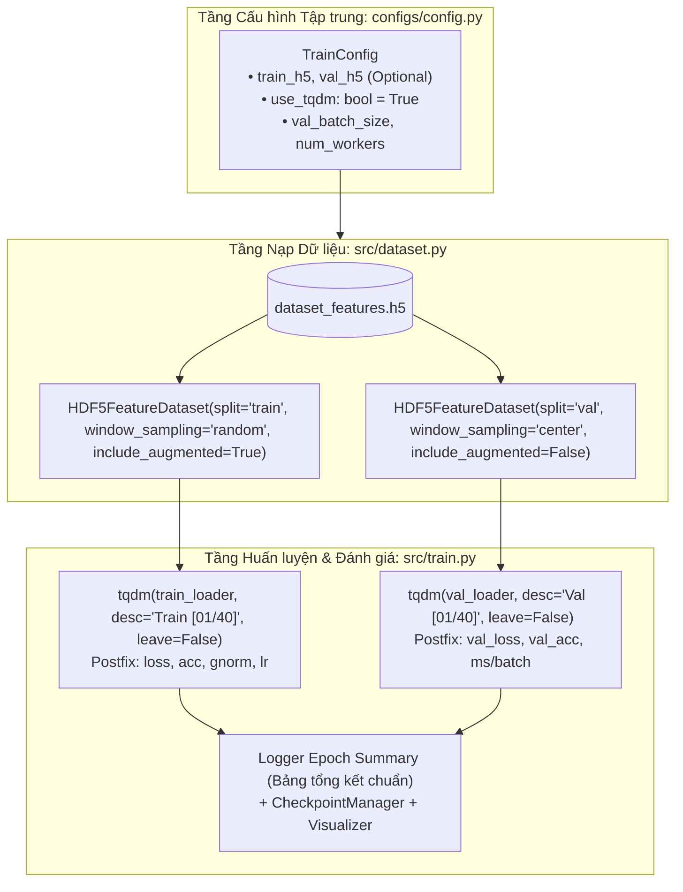

# BÁO CÁO PHÂN TÍCH YÊU CẦU: TÍCH HỢP THANH TIẾN TRÌNH TQDM & CHUYỂN ĐỔI VALIDATION DATASET SANG HDF5FEATUREDATASET

**Mã tài liệu:** `analsys_train_tqdm_val_h5.md`  
**Dự án:** Hệ Thống Nhận Diện Tài Xế Buồn Ngủ (Driver Guardian - Deep GRU / LSTM)  
**Tệp mục tiêu:** [`src/train.py`](file:///D:/Project/DATN/driver-guardian/ai/LSTM/src/train.py) & [`src/dataset.py`](file:///D:/Project/DATN/driver-guardian/ai/LSTM/src/dataset.py)  
**Tệp cấu hình liên quan:** [`configs/config.py`](file:///D:/Project/DATN/driver-guardian/ai/LSTM/configs/config.py) & [`configs/config.yaml`](file:///D:/Project/DATN/driver-guardian/ai/LSTM/configs/config.yaml)  
**Ngày thực hiện:** 03/10/2026  
**Quy chuẩn áp dụng:** [`AGENTS.md`](file:///D:/Project/DATN/driver-guardian/ai/LSTM/AGENTS.md) — Bước 1: Khảo sát & Phân tích (Discovery)  

---

## 1. TỔNG QUAN & MỤC TIÊU NHIỆM VỤ (EXECUTIVE SUMMARY)

### 1.1. Yêu cầu của người dùng
Người dùng yêu cầu thực hiện 2 thay đổi cốt lõi trong pipeline huấn luyện:
1. **Tích hợp giám sát quá trình train qua `tqdm`:** Bổ sung thanh tiến trình trực quan theo thời gian thực cho quá trình huấn luyện và kiểm định mô hình trong [`src/train.py`](file:///D:/Project/DATN/driver-guardian/ai/LSTM/src/train.py).
2. **Đồng bộ hóa Validation Dataset bằng `HDF5FeatureDataset`:** Thay đổi tập kiểm định (Validation Dataset) từ cơ chế suy luận video thô on-the-fly (`RawVideoONNXDataset` từ `src/dataset1.py`) sang nạp trực tiếp các tensor đặc trưng không gian đa tỉ lệ từ tệp HDF5 thông qua lớp [`HDF5FeatureDataset`](file:///D:/Project/DATN/driver-guardian/ai/LSTM/src/dataset.py#L69) trong [`src/dataset.py`](file:///D:/Project/DATN/driver-guardian/ai/LSTM/src/dataset.py).

---

## 2. KHẢO SÁT HIỆN TRẠNG & ĐIỂM NGHẼN KỸ THUẬT (CURRENT STATE AUDIT)

### 2.1. Hiện trạng Quá trình Giám sát (Logging & Progress Monitoring)
Trong [`src/train.py`](file:///D:/Project/DATN/driver-guardian/ai/LSTM/src/train.py):
- **Vòng lặp Huấn luyện (`train_one_epoch` - Dòng 846-887):**
  - Đang sử dụng vòng lặp chuẩn `for batch_idx, (features, targets, seq_lens, metas) in enumerate(self.train_loader, start=1):`.
  - Thông tin chỉ được in định kỳ qua `logger.info` mỗi `log_interval` batch (mặc định 10 batch).
  - *Hạn chế:* Người dùng không quan sát được thanh tiến độ động (%), tốc độ nạp/tính toán ($it/s$), thời gian đã trôi qua (Elapsed Time) và thời gian hoàn thành ước tính (ETA).
- **Vòng lặp Kiểm định (`validate` - Dòng 910-932):**
  - Hoàn toàn không có thanh tiến trình và không có bất kỳ log tiến độ trung gian nào cho tới khi duyệt xong toàn bộ tập kiểm định.
  - Khi tập kiểm định có hàng ngàn mẫu, giao diện console hoàn toàn im lặng, gây hiểu lầm rằng chương trình bị treo (freeze/deadlock).

### 2.2. Hiện trạng Dataset Kiểm định (Validation Dataset)
- Ban đầu dự án thiết kế nạp video thô qua OpenCV và trích xuất qua `backbone_neck.onnx` on-the-fly (`RawVideoONNXDataset`). Tuy nhiên, cách này làm chậm quá trình validation tới hàng trăm lần (mất vài phút tới cả chục phút cho mỗi epoch kiểm định).
- Trong [`src/train.py`](file:///D:/Project/DATN/driver-guardian/ai/LSTM/src/train.py) (dòng 738-765), code đã có bước chuyển đổi sơ khởi sang `HDF5FeatureDataset`, nhưng đang gặp các lỗi và hạn chế nghiêm trọng:
  1. **Lỗi kiểm tra thư mục video thô tồn đọng:** Vẫn giữ đoạn `if not val_dir.exists() and not self.config.val_manifest: raise FileNotFoundError(...)`, gây lỗi chương trình nếu máy tính không có thư mục raw video `val_dataset_dir`.
  2. **In log sai lệch:** In nhầm số lượng mẫu `len(train_dataset)` và nhãn hiển thị `"mẫu huấn luyện"` thay cho `len(val_dataset)` và `"mẫu kiểm định"`.
  3. **Vi phạm chuẩn xác thực (Data Leakage & Sampling Strategy):**
     - Đang để `window_sampling="random"` cho tập Val. Theo nguyên tắc khoa học trong học máy, tập kiểm định phải có tính chất **xác định (deterministic)** và **tái lập (reproducible)**, do đó phải sử dụng `window_sampling="center"` (cắt lát trung tâm) hoặc `"all"` khi `seq_len=None`.
     - Phải đảm bảo `include_augmented=False` để triệt tiêu hoàn toàn nguy cơ rò rỉ dữ liệu tăng cường vào tập validation.
  4. **Tính linh hoạt của cấu hình nguồn HDF5:**
     - Hiện tại chỉ gắn cứng vào `train_h5_path`. Cần hỗ trợ linh hoạt: nếu người dùng cấu hình `val_h5` riêng thì nạp từ `val_h5`, nếu không cấu hình thì tự động tái sử dụng `train_h5` với phân tách `split="val"`.
  5. **Đo lường độ trễ (Latency Metric):**
     - Trong hàm `validate()`, biến `latency_ms` hiện đo thời gian forward của mô hình Deep GRU trên tensor HDF5, nhưng docstring và comment vẫn ghi chú trích xuất ONNX video thô, gây mâu thuẫn thông tin chẩn đoán.
  6. **Đồng bộ hóa khối kiểm thử độc lập (`run_dry_run_test`):**
     - Hiện vẫn đang sinh video giả lập `create_mock_raw_video()` phục vụ cho val video thô. Khi chuyển sang HDF5, khối kiểm thử có thể tận dụng trực tiếp mẫu `split="val"` được sinh bởi `create_mock_h5_dataset()` trong `src/dataset.py`, giúp kiểm thử chạy cực nhanh và độc lập hoàn toàn với codec video hay OpenCV.

---

## 3. THIẾT KẾ GIẢI PHÁP KỸ THUẬT (ARCHITECTURAL DESIGN)

### 3.1. Sơ đồ Kiến trúc Pipeline Cải tiến với TQDM & HDF5 Validation



---

### 3.2. Chi tiết Giải pháp 1: Tích hợp Thanh Tiến trình `tqdm` Toàn diện

1. **Thư viện chuẩn:** Sử dụng `from tqdm.auto import tqdm` để tương thích đồng thời cả giao diện dòng lệnh Windows Terminal / PowerShell và Jupyter Notebook widget.
2. **Thanh tiến trình Pha Huấn luyện (`train_one_epoch`):**
   - Bọc `self.train_loader` bằng `tqdm`:
     ```python
     train_pbar = tqdm(
         self.train_loader,
         desc=f"Train [{epoch:02d}/{self.config.epochs:02d}]",
         total=len(self.train_loader),
         dynamic_ncols=True,
         leave=False,
         disable=not getattr(self.config, "use_tqdm", True),
         file=sys.stdout
     )
     ```
   - Cập nhật thời gian thực qua `train_pbar.set_postfix(...)`:
     - `loss`: Giá trị loss hiện tại (hoặc running loss lũy tiến).
     - `acc`: Tỷ lệ chính xác running accuracy (%) từ đầu epoch.
     - `gnorm`: Gradient Norm sau khi clipping.
     - `lr`: Tốc độ học hiện tại dạng khoa học (`1.00e-03`).
3. **Thanh tiến trình Pha Kiểm định (`validate`):**
   - Bọc `self.val_loader` bằng `tqdm`:
     ```python
     val_pbar = tqdm(
         self.val_loader,
         desc=f"Val   [{epoch:02d}/{self.config.epochs:02d}]",
         total=len(self.val_loader),
         dynamic_ncols=True,
         leave=False,
         disable=not getattr(self.config, "use_tqdm", True),
         file=sys.stdout
     )
     ```
   - Cập nhật thời gian thực qua `val_pbar.set_postfix(...)`:
     - `loss`: Validation loss trung bình lũy tiến.
     - `acc`: Validation accuracy trung bình lũy tiến (%).
     - `ms`: Độ trễ trung bình trên mỗi batch hoặc mẫu ($\text{ms}$).
4. **Cơ chế giữ màn hình sạch (Clean Terminal State):**
   - `leave=False`: Thanh tiến trình tự động biến mất khi hoàn thành epoch, nhường chỗ cho khối log tổng kết epoch dạng text (`self.logger.info`) hiển thị mạch lạc, không làm vỡ giao diện console.

---

### 3.3. Chi tiết Giải pháp 2: Chuẩn hóa Validation Dataset qua `HDF5FeatureDataset`

1. **Khởi tạo Dataset & DataLoader Kiểm định trong `_build_dataloaders()`:**
   - Xác định đường dẫn tệp HDF5 tập kiểm định:
     ```python
     val_h5_str = getattr(self.config, "val_h5", None) or self.config.train_h5
     val_h5_path = Path(val_h5_str)
     if not val_h5_path.exists():
         raise FileNotFoundError(f"Không tìm thấy tệp HDF5 tập validation tại: {val_h5_path.resolve()}")
     ```
   - Khởi tạo đối tượng `HDF5FeatureDataset`:
     ```python
     val_dataset = HDF5FeatureDataset(
         h5_path=val_h5_path,
         manifest_csv=getattr(self.config, "val_manifest_csv", None) or self.config.train_manifest_csv,
         split="val",
         seq_len=self.config.seq_len,
         include_augmented=False,       # Tuyệt đối không dùng data augmentation trên tập Val
         window_sampling="center"       # Lấy cửa sổ trung tâm có tính xác định cao
     )
     self.logger.info(f"    -> Đã nạp thành công {len(val_dataset)} mẫu kiểm định từ tệp HDF5.")
     ```
   - Khởi tạo `DataLoader` tập kiểm định:
     ```python
     val_loader = DataLoader(
         val_dataset,
         batch_size=self.config.val_batch_size,
         shuffle=False,                  # Không shuffle tập kiểm định
         num_workers=self.config.num_workers,
         collate_fn=collate_h5_features, # Gom batch đồng bộ pad tensor không gian (p3, p4, p5)
         pin_memory=self.config.pin_memory if self.device.type == "cuda" else False,
         worker_init_fn=seed_worker,
         drop_last=False
     )
     ```
2. **Cập nhật Cấu hình Tập trung:**
   - Trong [`configs/config.py`](file:///D:/Project/DATN/driver-guardian/ai/LSTM/configs/config.py):
     - Thêm `val_h5: Optional[str] = None` (nếu `None`, tự động trỏ về `train_h5`).
     - Thêm `val_manifest_csv: Optional[str] = None`.
     - Thêm `use_tqdm: bool = True`.
   - Đồng bộ trong [`configs/config.yaml`](file:///D:/Project/DATN/driver-guardian/ai/LSTM/configs/config.yaml).

3. **Tối ưu hóa Khối Kiểm thử Tự động (`run_dry_run_test`):**
   - Loại bỏ hàm sinh video thô giả lập `create_mock_raw_video()`.
   - Sử dụng `create_mock_h5_dataset(mock_h5, mock_csv)` (đã có sẵn 3 mẫu train và 2 mẫu val chuẩn định dạng).
   - Truyền `train_h5=str(mock_h5)`, `val_h5=str(mock_h5)` vào `TrainConfig` dry-run.

---

## 4. MA TRẬN SO SÁNH TRƯỚC VÀ SAU CẢI TIẾN

| Tiêu chí so sánh | Hiện trạng trước thay đổi | Sau khi thực hiện cải tiến |
| :--- | :--- | :--- |
| **Giao diện tiến trình** | In log ngắt quãng mỗi 10 batch, không có % tiến độ hay ETA | Thanh tiến trình `tqdm` động, hiển thị % hoàn thành, tốc độ $it/s$, ETA, cập nhật loss/acc liên tục |
| **Validation Logging** | Hoàn toàn im lặng suốt quá trình validate, dễ tưởng lầm bị treo | Thanh tiến trình `tqdm` cập nhật liên tục từng batch, hiển thị `val_loss`, `val_acc`, `ms/batch` |
| **Validation Dataset** | Code dở dang, check thư mục video thô thừa thãi, log nhầm `train_dataset` | Sử dụng chuẩn hóa `HDF5FeatureDataset(split='val')`, log chính xác số mẫu kiểm định |
| **Tính khoa học của Val** | `window_sampling="random"`, nguy cơ rò rỉ tăng cường | `window_sampling="center"`, `include_augmented=False`, đảm bảo 100% deterministic |
| **Tốc độ Validation** | Hàng chục phút (trích xuất ONNX video thô) | Vài giây đến vài chục giây (nạp tensor trực tiếp từ HDF5 cực nhanh) |
| **Tính an toàn Dry-run** | Cần sinh mock video qua OpenCV, phụ thuộc codec mp4v | Tận dụng mock H5 có sẵn cả train và val, chạy mượt mà trên mọi môi trường (Linux/Windows/CI) |

---

## 5. RỦI RO TIỀM ẨN & KẾ HOẠCH PHÒNG NGỪA (RISK MITIGATION)

| Rủi ro tiềm ẩn | Mức độ | Biện pháp phòng ngừa & Xử lý triệt để |
| :--- | :---: | :--- |
| **Xung đột log giữa `tqdm` và `logger.info`** | Trung bình | Đặt `leave=False` cho batch pbar; chỉ in log tổng kết khi vòng lặp đã kết thúc; hoặc dùng `tqdm.write` nếu có cảnh báo phát sinh giữa chừng. |
| **Môi trường chạy không có TTY (Headless / Non-interactive)** | Thấp | Cung cấp cờ `use_tqdm: bool` trong config; khi `use_tqdm=False`, hệ thống tự động quay về in log qua logger tiêu chuẩn. |
| **Tệp HDF5 không chứa nhóm `val`** | Trung bình | `HDF5FeatureDataset` sẽ kiểm tra và báo lỗi rõ ràng nếu nhóm `val` rỗng; đồng thời cho phép cấu hình `val_h5` riêng biệt nếu train và val nằm ở 2 file khác nhau. |
| **Xung đột đa tiến trình với HDF5** | Thấp | `HDF5FeatureDataset` đã triển khai cơ chế Lazy Opening per-worker kết hợp cờ SWMR (Single-Writer-Multiple-Reader), đảm bảo an toàn tuyệt đối khi `num_workers > 0`. |

---

## 6. KẾ HOẠCH KIỂM THỬ XÁC NHẬN (VERIFICATION PLAN)

1. **Kiểm tra Cú pháp & Tích hợp Config:**
   - Khởi tạo `TrainConfig()` với các tham số mới (`use_tqdm`, `val_h5`), đảm bảo không có lỗi validation hay cú pháp.
2. **Kiểm tra Tải Dữ liệu HDF5 Val:**
   - Khởi tạo độc lập `HDF5FeatureDataset(split="val")` và kiểm tra độ dài, shape của batch `(p3, p4, p5)`, nhãn, và `seq_lens`.
3. **Kiểm thử Tự động Toàn diện (`run_dry_run_test`):**
   - Chạy `python -c "from src.train import run_dry_run_test; run_dry_run_test()"`:
     - Xác nhận thanh `tqdm` hiển thị chuẩn cho cả Train và Val.
     - Xác nhận không phát sinh lỗi OpenCV video thô.
     - Xác nhận xuất đủ 4 tệp artifacts: `training_history.csv`, `training_summary.json`, `loss_accuracy_curves.png`, `confusion_matrix_best.png`.
4. **Kiểm tra Cơ chế Bật/Tắt TQDM:**
   - Thử nghiệm với `use_tqdm=False`, đảm bảo pipeline chạy bình thường không phát sinh ngoại lệ.

---

## 7. KẾT LUẬN & ĐỀ XUẤT BƯỚC TIẾP THEO

Báo cáo phân tích đã xác định toàn diện các yêu cầu, lỗi tồn đọng hiện tại và kiến trúc giải pháp chuẩn hóa cho việc tích hợp `tqdm` cùng `HDF5FeatureDataset` trong [`src/train.py`](file:///D:/Project/DATN/driver-guardian/ai/LSTM/src/train.py).

> [!IMPORTANT]
> **Yêu cầu phê duyệt từ Người dùng (User Approval):**  
> Căn cứ theo quy trình chuẩn tại **Mục 5 của [`AGENTS.md`](file:///D:/Project/DATN/driver-guardian/ai/LSTM/AGENTS.md)**:
> - **Bước 1 (Discovery):** Đã hoàn tất tài liệu phân tích `docs/analsys_train_tqdm_val_h5.md`.
> - **Bước 2 (Planning):** Chỉ được thực hiện khi người dùng đồng ý với nội dung phân tích tại Bước 1.
>
> Xin trân trọng lấy ý kiến từ bạn! Nếu bạn đồng ý với định hướng phân tích này, tôi sẽ tiến hành **Bước 2: Lập kế hoạch chi tiết (`docs/plan_train_tqdm_val_h5.md`)**.
