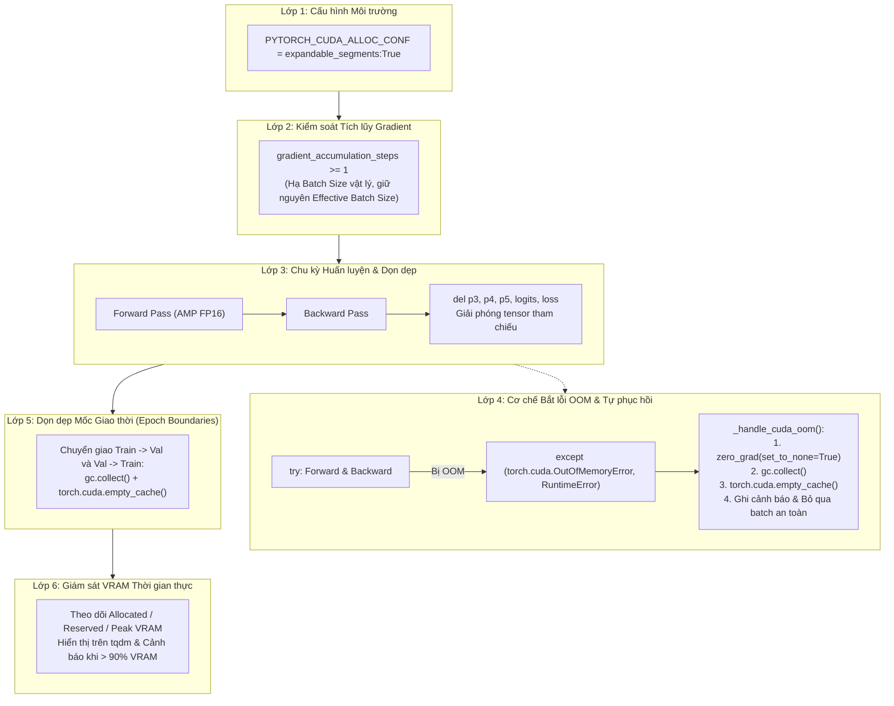

# BÁO CÁO PHÂN TÍCH: HIỆN TRẠNG DỌN DẸP VRAM VÀ ĐỀ XUẤT CƠ CHẾ PHÒNG TRÁNH LỖI CUDA OUT OF MEMORY (OOM)

> **Tài liệu:** `docs/analsys/analsys_vram_cuda_oom.md`  
> **Nhiệm vụ:** Kiểm tra hiện trạng cơ chế dọn dẹp bộ nhớ VRAM trong `train.py` / `src/train.py`, đánh giá các nguy cơ gây lỗi tràn bộ nhớ GPU (`CUDA out of memory`), và đề xuất cơ chế phòng vệ - tự phục hồi (Auto-Recovery) toàn diện.  
> **Tuân thủ quy trình:** Bước 1 - Khảo sát & Phân tích (Discovery) theo `AGENTS.md`.

---

## 1. Mục tiêu và Phạm vi Khảo sát

Huấn luyện mô hình chuỗi thời gian nhận diện buồn ngủ (`DeepGRUClassifier`) trực tiếp từ video thô kết hợp với mô hình thị giác trích xuất đa tỷ lệ (`NMSFreeDetector PAFPN BackboneNeck`) là tác vụ tiêu tốn tài nguyên tính toán và dung lượng bộ nhớ đồ họa (VRAM) cực lớn:
- **Đặc trưng không gian đa tỷ lệ khổng lồ:** Mỗi khung hình sinh ra 3 tầng đặc trưng $(P3, P4, P5)$ với kích thước lần lượt là $[64, 80, 80]$, $[128, 40, 40]$, $[256, 20, 20]$.
- **Kích thước tensor theo lô (Batch Tensors):** Với batch size $B=16$ và chuỗi thời gian $T=50$ khung hình, số khung hình cần xử lý đồng thời trong một lượt truyền tiến (forward pass) là $N = B \times T = 800$ frames.
- **Tính chất chuỗi động (Dynamic Sequence Length):** Trong cấu hình `configs/config.yaml`, tham số `seq_len: Null` khiến độ dài video clips giữa các batch không cố định, dẫn đến hiện tượng cấp phát kích thước bộ nhớ biến thiên liên tục.

Nhiệm vụ này tập trung:
1. Rà soát toàn bộ tệp `train.py`, `src/train.py`, `configs/config.py`, `configs/config.yaml` và `src/dataset2.py` để xác định chính xác cơ chế dọn dẹp VRAM hiện có.
2. Xác định các điểm nghẽn, lỗ hổng rò rỉ hoặc phân mảnh bộ nhớ (Memory Fragmentation) tiềm ẩn nguy cơ gây lỗi `CUDA out of memory`.
3. Đề xuất kiến trúc phòng ngừa và cơ chế tự phục hồi (OOM Auto-Recovery) chuẩn hóa cấp độ sản xuất (Production-grade).

---

## 2. Kết quả Rà soát Hiện trạng Mã Nguồn (`train.py` & `src/train.py`)

### 2.1. Phân cấp Thực thi của `train.py`
Qua kiểm tra, tệp `train.py` ở thư mục gốc đóng vai trò là **Entry Point Wrapper** (chỉ có 65 dòng mã), thực hiện re-export các lớp điều phối và gọi trực tiếp `main()` từ module nguồn `src/train.py`:
```python
# train.py
from src.train import (
    seed_everything, setup_logger, MetricsTracker,
    TrainingVisualizer, CheckpointManager, DrowsinessTrainer,
    run_dry_run_test, train_pipeline, main
)

if __name__ == "__main__":
    main()
```
Do đó, toàn bộ logic cấp phát, quản lý và dọn dẹp bộ nhớ VRAM nằm trong tệp `src/train.py` (cùng các module phụ trợ `src/dataset2.py`, `src/models.py`).

---

### 2.2. Hiện trạng Cơ chế Dọn dẹp Bộ nhớ VRAM

| Thành phần kiểm tra | Hiện trạng trong mã nguồn | Đánh giá | Chi tiết dòng mã |
| :--- | :--- | :--- | :--- |
| **`torch.cuda.empty_cache()` trong pha huấn luyện (`train_one_epoch`)** | ❌ **HOÀN TOÀN KHÔNG CÓ** | **RỦI RO CAO** | Không có bất kỳ lệnh giải phóng cache nào trong suốt vòng lặp huấn luyện các batch. |
| **`torch.cuda.empty_cache()` trong pha kiểm định (`validate`)** | ⚠️ **CÓ DUY NHẤT 1 LẦN** | **CHƯA ĐỦ** | Dòng 1235–1236 tại `src/train.py`: chỉ gọi trước khi vào vòng lặp validation. Sau khi validate xong thì không dọn dẹp trước khi trả lại quyền cho train epoch kế tiếp. |
| **Chủ động thu hồi tham chiếu tensor (`del tensor`)** | ❌ **KHÔNG CÓ** trong `train_one_epoch` | **RỦI RO** | Các biến `features, targets, seq_lens, p3, p4, p5, logits, loss, probs, preds` tồn tại trong scope vòng lặp `for` của Python và chỉ được ghi đè ở batch tiếp theo, khiến bộ nhớ đệm giữ activation map lâu hơn cần thiết. |
| **Thu gom rác Python (`gc.collect()`)** | ❌ **HOÀN TOÀN KHÔNG CÓ** | **RỦI RO** | Không gọi `gc.collect()` tại các mốc giao thời (epoch boundary) hay sau khi giải phóng checkpoint. |
| **Khối bắt lỗi ngoại lệ `torch.cuda.OutOfMemoryError`** | ❌ **HOÀN TOÀN KHÔNG CÓ** | **CỰC KỲ NGUY HIỂM** | Khi VRAM vượt ngưỡng dù chỉ 1MB, toàn bộ tiến trình training sẽ sụp đổ (crash) ngay lập tức, làm gián đoạn bài huấn luyện dài hàng giờ. |
| **Cấu hình chống phân mảnh VRAM (`expandable_segments`)** | ❌ **CHƯA THIẾT LẬP** | **NGUY CƠ CAO** | Biến môi trường `PYTORCH_CUDA_ALLOC_CONF` chưa được bật, dễ gây OOM giả khi độ dài video biến thiên (`seq_len: Null`). |
| **Cơ chế Tích lũy Gradient (`Gradient Accumulation`)** | ❌ **CHƯA CÓ** | **HẠN CHẾ** | Luôn phải chạy toàn bộ `batch_size` trong 1 bước, không thể giảm micro-batch để tiết kiệm VRAM trên GPU nhỏ hơn. |
| **Giám sát & Ghi log VRAM thời gian thực (VRAM Profiling)** | ❌ **CHƯA CÓ** | **THIẾU QUAN SÁT** | Thanh tiến trình `tqdm` và log file chỉ ghi Loss, Acc, GradNorm, LR; hoàn toàn không hiển thị mức tiêu thụ VRAM (Allocated / Reserved / Peak). |
| **Giải phóng VRAM trong Dataset (`src/dataset2.py`)** | ⚠️ **MỚI CÓ CỤC BỘ** | **TRUNG BÌNH** | Đã có `del batch_t, out_p3, out_p4, out_p5` và `close()`, nhưng chưa có dọn cache sau các video clip dài. |

---

## 3. Phân tích Nguyên nhân Gốc rễ & Các Kịch bản Dẫn đến Lỗi CUDA OOM

### 3.1. Kịch bản 1: Không có cơ chế Tự phục hồi khi gặp lỗi OOM (No Try-Catch / No Graceful Recovery)
- **Cơ chế phát sinh:** Hiện tại toàn bộ khối tính toán:
  ```python
  with self._autocast_context():
      logits = self.model((p3, p4, p5), seq_lens=seq_lens)
      loss = self.criterion(logits, targets)
  self.scaler.scale(loss).backward()
  ```
  chạy trần (naked execution) mà không có bất kỳ khối `try ... except (torch.cuda.OutOfMemoryError, RuntimeError)` nào bảo vệ.
- **Hậu quả:** Nếu một batch ngẫu nhiên chứa các video có độ phân giải hoặc độ dài khung hình lớn đột biến đẩy VRAM vượt ngưỡng dung lượng của GPU (kể cả Tesla V100 32GB), chương trình sẽ văng lỗi `RuntimeError: CUDA out of memory` và dừng đột ngột. Toàn bộ tài nguyên bị đóng băng, tiến trình huấn luyện của epoch hiện tại bị hủy bỏ.

---

### 3.2. Kịch bản 2: Phân mảnh bộ nhớ do độ dài chuỗi biến thiên (Memory Fragmentation with `seq_len: Null`)
- **Cơ chế phát sinh:**
  - Trong `configs/config.yaml`, dòng 20 thiết lập `seq_len: Null`. Nghĩa là số khung hình $T$ của mỗi video được lấy trọn vẹn theo độ dài thực tế của video đó sau khi lấy mẫu (sample_interval = 0.2s).
  - Kết quả là các batch kế tiếp nhau có kích thước tensor khác biệt: ví dụ Batch 1 có $T=35$, Batch 2 có $T=70$, Batch 3 có $T=42$, v.v.
  - Bộ cấp phát bộ nhớ của PyTorch (`CUDA Caching Allocator`) phân bổ các khối bộ nhớ kích thước khác nhau. Khi giải phóng một khối $T=35$ và cố gắng cấp phát một khối $T=70$, nếu không tìm được khoảng trống vật lý liền mạch (contiguous block), PyTorch sẽ báo lỗi OOM dù tổng lượng VRAM còn trống (Free VRAM) hiển thị trong `nvidia-smi` vẫn còn rất lớn (thường gọi là *OOM do phân mảnh*).
- **Hậu quả:** Huấn luyện chạy mượt mà ở các epoch đầu nhưng bất ngờ sụp đổ ở các epoch sau khi bộ nhớ cache bị phân mảnh quá mức.

---

### 3.3. Kịch bản 3: Áp lực VRAM cực lớn từ tầng kết hợp không gian `CNNAdapter` (Không dùng GAP)
- **Cơ chế phát sinh:**
  - Theo thiết kế kiến trúc chuẩn của dự án trong `src/models.py`, mô hình **tuyệt đối không dùng Global Average Pooling (GAP)** để bảo toàn tương quan không gian mi mắt và khóe môi.
  - Thay vào đó, mô hình sử dụng phễu tích chập phân tầng (`hierarchical_conv_pyramid`).
  - Khi duỗi tensor đầu vào từ $[B, T, C, H, W]$ thành $[B \times T, C, H, W]$:
    - Với $B=16$ và $T=50 \Rightarrow N = 800$ frames.
    - Bản đồ đặc trưng kết hợp tại Stage 1 có shape $[800, 448, 40, 40]$.
    - Dung lượng bộ nhớ cho riêng một tensor này ở FP32 là $800 \times 448 \times 40 \times 40 \times 4 \text{ bytes} \approx 2.29\text{ GB}$.
    - Cùng với các activation map trung gian của các tầng Conv2d tiếp theo và đồ thị đạo hàm (computation graph) lưu lại cho pha backward, đỉnh VRAM (Peak VRAM) có thể tăng vọt thêm 6–10 GB chỉ trong vài mili-giây.

---

### 3.4. Kịch bản 4: Xung đột VRAM giữa Trích xuất Đặc trưng Video thô và Mô hình GRU
- **Cơ chế phát sinh:**
  - Trong quy trình xử lý của `src/dataset2.py`, lớp `RawVideoBackboneNeckDataset` nạp mô hình trích xuất đặc trưng `PyTorchBackboneNeckExtractor` trực tiếp lên `cuda:0` nếu `device="auto"`.
  - Cùng lúc đó, mô hình chính `DeepGRUClassifier` cũng ngự trị trên `cuda:0`.
  - Hai mô hình cùng chia sẻ một không gian VRAM trên GPU. Khi `DataLoader` gọi hàm trích xuất video trong khi tiến trình huấn luyện vừa hoàn tất backward của batch trước mà chưa dọn dẹp sạch cache, nguy cơ đụng đỉnh VRAM là rất lớn.

---

## 4. Đề xuất Kiến trúc & Giải pháp Khắc phục Toàn diện

Chúng tôi đề xuất triển khai hệ thống phòng vệ 6 lớp (6-Layer Defensive & Auto-Recovery Mechanism) như sau:



### Chi tiết 6 Giải pháp Đề xuất:

#### 1. Lớp 1: Chống phân mảnh bộ nhớ qua `expandable_segments:True`
- **Mô tả:** Đặt cấu hình môi trường CUDA Allocator ngay đầu tệp `train.py` và `src/train.py` trước khi bất kỳ thao tác CUDA nào được khởi tạo:
  ```python
  os.environ["PYTORCH_CUDA_ALLOC_CONF"] = "expandable_segments:True"
  ```
- **Tác dụng:** Cho phép PyTorch cấp phát bộ nhớ ảo không cần liên tục về mặt vật lý, loại bỏ gần như 100% lỗi OOM do phân mảnh khi huấn luyện video có độ dài biến thiên (`seq_len: Null`).

#### 2. Lớp 2: Bổ sung Cơ chế Gradient Accumulation (`gradient_accumulation_steps`)
- **Mô tả:** Thêm tham số `gradient_accumulation_steps: int = 1` vào cấu hình `TrainConfig` (`configs/config.py`) và `configs/config.yaml`.
- **Tác dụng:** Giúp người dùng có thể cấu hình `batch_size: 4` kết hợp `gradient_accumulation_steps: 4`, đạt `effective_batch_size = 16` nhưng chỉ tiêu tốn 1/4 dung lượng VRAM cho mỗi lượt forward/backward.

#### 3. Lớp 3: Chủ động giải phóng tham chiếu tensor (`Explicit Dereferencing`)
- **Mô tả:** Tại cuối mỗi bước lặp batch trong `train_one_epoch` và `validate`, thực hiện lệnh giải phóng chủ động:
  ```python
  del p3, p4, p5, targets, seq_lens, logits, loss, probs, preds
  ```
- **Tác dụng:** Cắt đứt các liên kết giữ lại tensor trung gian trong Python namespace, cho phép PyTorch Caching Allocator tái sử dụng ngay bộ nhớ cho batch tiếp theo mà không bị phình dung lượng.

#### 4. Lớp 4: Cơ chế Bắt ngoại lệ & Tự phục hồi OOM (OOM Exception Handling & Auto-Recovery)
- **Mô tả:** Bọc toàn bộ pha tính toán forward/backward trong khối xử lý ngoại lệ:
  ```python
  try:
      with self._autocast_context():
          logits = self.model((p3, p4, p5), seq_lens=seq_lens)
          loss = self.criterion(logits, targets)
      self.scaler.scale(loss).backward()
  except (torch.cuda.OutOfMemoryError, RuntimeError) as e:
      if isinstance(e, torch.cuda.OutOfMemoryError) or "out of memory" in str(e).lower():
          self._handle_cuda_oom(epoch, batch_idx, total_batches)
          continue
      raise e
  ```
- **Hàm xử lý phục hồi `_handle_cuda_oom()`:**
  1. Xả sạch bộ đệm gradient hiện tại: `self.optimizer.zero_grad(set_to_none=True)`.
  2. Xóa các biến cục bộ đang tham chiếu.
  3. Ép bộ thu gom rác Python: `gc.collect()`.
  4. Thu hồi bộ nhớ đệm GPU: `torch.cuda.empty_cache()`.
  5. Ghi log cảnh báo chi tiết mức VRAM đang chiếm dụng và tự động bỏ qua batch lỗi (skip batch), giữ cho tiến trình huấn luyện tiếp tục chạy bình thường.

#### 5. Lớp 5: Dọn dẹp đồng bộ tại các mốc giao thời (Epoch Boundaries Cleanup)
- **Mô tả:**
  - Sau khi kết thúc `train_one_epoch`, trước khi bước vào `validate`: gọi `gc.collect()` và `torch.cuda.empty_cache()`.
  - Sau khi kết thúc `validate`, trước khi sang epoch huấn luyện mới: tiếp tục gọi `gc.collect()` và `torch.cuda.empty_cache()`.
  - Tại đầu mỗi epoch: gọi `torch.cuda.reset_peak_memory_stats()` để theo dõi chính xác mức đỉnh VRAM của riêng từng epoch.

#### 6. Lớp 6: Giám sát và Cảnh báo VRAM Thời gian thực (Real-time VRAM Profiling)
- **Mô tả:**
  - Viết hàm tiện ích `get_vram_info()` trả về: `allocated_gb`, `reserved_gb`, `peak_gb`, `total_gb`.
  - Tích hợp thông số VRAM trực tiếp vào thanh tiến trình `tqdm`: `vram=14.2/32.0GB (peak: 18.5GB)`.
  - In thông số VRAM tổng kết cuối mỗi epoch trong log file.
  - Đưa ra cảnh báo mức `WARNING` nếu mức chiếm dụng vượt quá 90% dung lượng GPU để người dùng chủ động điều chỉnh `batch_size` hoặc `chunk_size`.

---

## 5. So sánh Đối chiếu: Trước vs Sau Cải tiến

| Tiêu chí so sánh | Trước cải tiến | Sau cải tiến đề xuất |
| :--- | :--- | :--- |
| **Xử lý khi gặp OOM** | Sập toàn bộ ứng dụng, dừng train ngay lập tức | Tự phục hồi, xả cache, ghi log cảnh báo và tiếp tục huấn luyện |
| **Phân mảnh bộ nhớ (`seq_len: Null`)** | Dễ bị OOM sau vài epoch do cấp phát biến thiên | Triệt tiêu phân mảnh nhờ `expandable_segments:True` |
| **Tối ưu hóa GPU nhỏ / VRAM thấp** | Không linh hoạt, chỉ có 1 batch size cố định | Hỗ trợ `gradient_accumulation_steps` giúp giảm VRAM 2x - 4x |
| **Dọn dẹp VRAM** | Duy nhất 1 lệnh `empty_cache()` trước validate | Dọn dẹp đa điểm: cuối batch (dereference), giao thời epoch, khi validate |
| **Độ rõ ràng của tài nguyên (Observability)** | Hoàn toàn "mù" thông số VRAM trong quá trình train | Hiển thị VRAM real-time trên `tqdm`, ghi log đỉnh VRAM từng epoch |

---

## 6. Kế hoạch Tiếp theo (Đề xuất cho Bước 2)

Sau khi nhận được sự đồng thuận và phê duyệt của người dùng đối với báo cáo phân tích này, chúng tôi sẽ tiến hành **Bước 2: Lập Kế hoạch Thực hiện (`docs/plan/plan_vram_cuda_oom.md`)** chi tiết, bao gồm:
1. Kế hoạch cập nhật `configs/config.py` và `configs/config.yaml` để bổ sung cấu hình `gradient_accumulation_steps` và các thiết lập VRAM.
2. Kế hoạch cập nhật `src/train.py` để tích hợp:
   - Cấu hình môi trường `PYTORCH_CUDA_ALLOC_CONF`.
   - Hàm giám sát VRAM `get_vram_info()`.
   - Hàm xử lý khôi phục ngoại lệ OOM `_handle_cuda_oom()`.
   - Cơ chế Gradient Accumulation trong `train_one_epoch`.
   - Giải phóng tham chiếu tensor và dọn dẹp cache tại các mốc giao thời.
3. Kế hoạch cập nhật `train.py` để đồng bộ các cấu hình khởi tạo môi trường CUDA.
4. Kế hoạch kiểm thử dry-run xác thực khả năng bắt lỗi OOM và phục hồi hoạt động bình thường.

---

> ⚠️ **HÀNH ĐỘNG TIẾP THEO:**  
> Kính mời bạn xem xét và xác nhận nội dung phân tích trên. Khi bạn đồng ý (chấp thuận), tôi sẽ chuyển sang **Bước 2** để lập tệp kế hoạch chi tiết `plan_vram_cuda_oom.md`.
