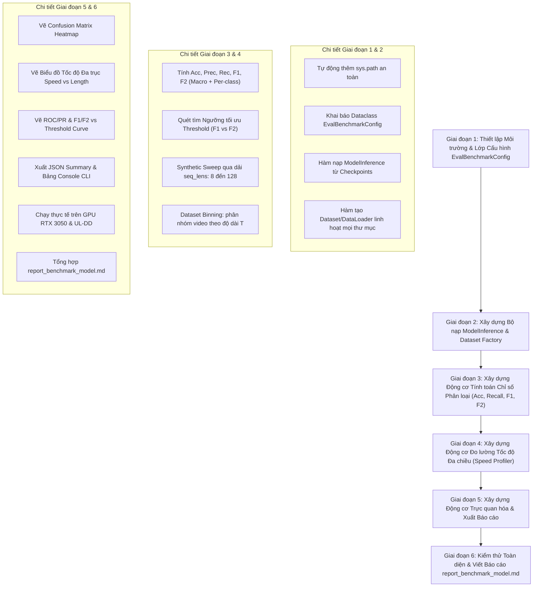

# KẾ HOẠCH TRIỂN KHAI: BENCHMARK MÔ HÌNH MODELINFERENCE (SRC/EVALUATE.PY)

- **Mã kế hoạch**: `PLAN_BENCHMARK_MODEL`
- **Tệp kế hoạch**: `docs/plan/plan_benchmark_model.md`
- **Dựa trên tài liệu phân tích**: [docs/analsys/analsys_benchmark_model.md](file:///D:/Project/DATN/driver-guardian/ai/LSTM/docs/analsys/analsys_benchmark_model.md)
- **Tệp mục tiêu đầu ra**: [src/evaluate.py](file:///D:/Project/DATN/driver-guardian/ai/LSTM/src/evaluate.py)
- **Trạng thái**: Đang chờ người dùng phê duyệt trước khi chuyển sang Bước 3 Thực hiện ([AGENTS.md](file:///D:/Project/DATN/driver-guardian/ai/LSTM/AGENTS.md)).

---

## 1. MỤC TIÊU VÀ NGUYÊN TẮC THIẾT KẾ CỐT LÕI

### 1.1. Mục tiêu trọng tâm
Nâng cấp và tái cấu trúc hoàn chỉnh module [src/evaluate.py](file:///D:/Project/DATN/driver-guardian/ai/LSTM/src/evaluate.py) để:
1. Đánh giá trực tiếp mô hình suy luận tích hợp [`ModelInference`](file:///D:/Project/DATN/driver-guardian/ai/LSTM/model_inference.py#L13-L150) (kết hợp `NMSFreeDetector` và `ConvGRUClassifier`).
2. Đo đạc hệ thống chỉ số phân loại toàn diện: **Accuracy, Recall (Macro & Per-class), F1-Score, F2-Score ($\beta=2$)** và ma trận nhầm lẫn.
3. Đo đạc tốc độ xử lý (Latency ms/clip, ms/frame, FPS) với các độ dài chuỗi khung hình khác nhau theo 2 chế độ:
   - Thử nghiệm tốc độ có kiểm soát (Synthetic/Controlled Sequence Length Sweep) qua các độ dài cố định.
   - Phân tích theo nhóm độ dài thực tế từ video dataset (Dataset Sequence Length Binning).
4. Cho phép người dùng tự do lựa chọn và tùy biến các bộ dữ liệu khác nhau (chỉ định thư mục dataset, file manifest, tập split `val`/`test`/`train`, hoặc nguồn dữ liệu con).
5. Trực quan hóa chuyên nghiệp (Confusion Matrix Heatmap, biểu đồ tốc độ theo độ dài, đường cong ROC/PR, biểu đồ phân tích ngưỡng F1/F2) và xuất báo cáo JSON tổng hợp.

### 1.2. Nguyên tắc thiết kế (Tuân thủ AGENTS.md)
- **Độc lập và linh hoạt**: Cấu hình tập trung qua `@dataclass EvalBenchmarkConfig`, hỗ trợ chạy trực tiếp không cần tham số dòng lệnh phức tạp, đồng thời cho phép override dễ dàng khi import vào Jupyter Notebook.
- **Tương thích đa nền tảng**: Toàn bộ đường dẫn sử dụng `pathlib.Path`, xử lý mã hóa UTF-8 cho console Windows.
- **Tự động cấu hình `sys.path`**: Thêm tự động thư mục gốc `driver-guardian` và `ai/ObjectDetection_2p6M` vào `sys.path` để triệt tiêu lỗi import phụ thuộc (`No module named 'utils'`).
- **An toàn bộ nhớ**: Giữ nguyên cơ chế chia nhỏ `chunk_size` qua Backbone/Neck của `ModelInference`, kiểm soát bắt lỗi OOM và giải phóng cache GPU.
- **Tính tái lập (Reproducibility)**: Cố định seed ngẫu nhiên (`seed_everything(42)`).

---

## 2. LỘ TRÌNH THỰC HIỆN CHI TIẾT (WORKFLOW 6 GIAI ĐOẠN)

---

### GIAI ĐOẠN 1: THIẾT LẬP MÔI TRƯỜNG & KHAI BÁO CẤU HÌNH TẬP TRUNG

- **Nhiệm vụ 1.1**: Chuẩn hóa môi trường thực thi và `sys.path`:
  - Khai báo thêm `PROJECT_ROOT`, `ai/ObjectDetection_2p6M`, `ai/LSTM` vào `sys.path`.
  - Cấu hình hỗ trợ tiếng Việt trên console Windows (`utf-8`).
  - Thiết lập hàm cố định seed `seed_everything(seed=42)` cho Python, NumPy, PyTorch.
- **Nhiệm vụ 1.2**: Xây dựng lớp `@dataclass class EvalBenchmarkConfig`:
  - *Mô hình & Checkpoint*:
    - `cnn_checkpoint_path`: Mặc định `D:/Project/DATN/driver-guardian/ai/checkpoints/model_cnn/best.pt`.
    - `conv_gru_checkpoint_path`: Mặc định `D:/Project/DATN/driver-guardian/ai/checkpoints/model_convgru/best.pt`.
    - `chunk_size`: 32.
    - `device`: `"cuda"` nếu khả dụng, tự động fallback `"cpu"`.
  - *Bộ dữ liệu*:
    - `dataset_dir`: Mặc định `E:/LSTM/UL-DD_Processed` (linh hoạt nhận bất kỳ đường dẫn nào).
    - `manifest_file`: Mặc định `dataset_merged_split.csv` (có thể đặt `None` nếu muốn quét theo cấu trúc thư mục).
    - `split`: Mặc định `"val"`, hỗ trợ `"test"`, `"train"`, `"all"`.
    - `dataset_source`: `"all"`, `"ul-dd"`, `"uta-rldd"`, `"sust"`.
    - `sample_interval`: `0.2` (giây).
    - `seq_len`: `None` (hoặc cố định `int`).
    - `max_eval_samples`: `None` (hoặc `int` để test nhanh).
    - `num_workers`: `0` (an toàn trên Windows).
  - *Benchmark Tốc độ theo Độ dài*:
    - `run_synthetic_speed_benchmark`: `True`.
    - `benchmark_seq_lengths`: `(8, 16, 24, 32, 48, 64, 96, 128)`.
    - `benchmark_img_size`: `640`.
    - `warmup_runs`: `3`.
    - `repeat_runs`: `10`.
  - *Chỉ số & Ngưỡng*:
    - `classification_threshold`: `0.5`.
    - `tune_threshold`: `True` (quét tìm ngưỡng tối ưu cho F1 và F2).
    - `class_names`: `("Alert (Tỉnh táo)", "Drowsy (Buồn ngủ)")`.
  - *Xuất kết quả*:
    - `output_dir`: `"logs/benchmark"`.
    - Cờ vẽ đồ thị: `plot_confusion_matrix`, `plot_speed_curves`, `plot_roc_pr`, `plot_threshold_curves`, `save_json_summary`.

---

### GIAI ĐOẠN 2: BỘ NẠP MÔ HÌNH VÀ BỘ NẠP DỮ LIỆU LINH HOẠT

- **Nhiệm vụ 2.1**: Xây dựng hàm `load_benchmark_model(config: EvalBenchmarkConfig) -> ModelInference`:
  - Khởi tạo an toàn đối tượng `ModelInference` từ `cnn_checkpoint_path` và `conv_gru_checkpoint_path`.
  - Chuyển mô hình sang chế độ `eval()`.
  - Log chi tiết thông tin thiết bị và các đường dẫn checkpoint đã nạp.
- **Nhiệm vụ 2.2**: Xây dựng hàm `build_benchmark_dataset(config: EvalBenchmarkConfig) -> Optional[RawVideoFramesDataset]`:
  - Kiểm tra sự tồn tại của `dataset_dir`. Nếu thư mục không tồn tại, hiển thị cảnh báo và chuyển sang chế độ thuần synthetic benchmark mà không làm dừng đột ngột chương trình.
  - Khởi tạo `RawVideoFramesDataset` với các tham số `split`, `manifest_file`, `sample_interval`, `seq_len`, `img_size=640`.
  - Bổ sung bộ lọc `dataset_source` nếu người dùng chỉ định (ví dụ chỉ lọc clip của `ul-dd`).
  - Hỗ trợ cắt giảm mẫu nếu `config.max_eval_samples` được thiết lập.

---

### GIAI ĐOẠN 3: ĐỘNG CƠ TÍNH TOÁN HỆ THỐNG CHỈ SỐ PHÂN LOẠI (ACC, RECALL, F1, F2)

- **Nhiệm vụ 3.1**: Xây dựng hàm tính toán chỉ số `compute_benchmark_classification_metrics`:
  - **Accuracy**: $Acc = \frac{TP + TN}{TP + TN + FP + FN}$.
  - **Macro & Per-class Precision**: $P = \frac{TP}{TP + FP}$.
  - **Macro & Per-class Recall**: $R = \frac{TP}{TP + FN}$ (Độ nhạy phát hiện buồn ngủ).
  - **Macro & Per-class F1-Score**: $F_1 = 2 \cdot \frac{P \cdot R}{P + R}$.
  - **Macro & Per-class F2-Score**:
    $$F_2 = (1 + 2^2) \cdot \frac{P \cdot R}{2^2 \cdot P + R} = 5 \cdot \frac{P \cdot R}{4P + R}$$
    Đặc biệt tính toán riêng `f2_drowsy` cho lớp Buồn ngủ.
  - **Ma trận nhầm lẫn (Confusion Matrix)**: $2 \times 2$.
  - **ROC-AUC & PR-AUC (Average Precision)**.
- **Nhiệm vụ 3.2**: Xây dựng hàm tối ưu hóa ngưỡng `find_optimal_thresholds(targets, probs)`:
  - Khảo sát 100 ngưỡng từ 0.01 đến 0.99.
  - Xác định $\text{best\_thresh\_f1}$ và $\text{best\_thresh\_f2}$.
  - Trả về danh sách điểm để phục vụ vẽ đồ thị biến thiên ngưỡng.

---

### GIAI ĐOẠN 4: ĐỘNG CƠ ĐO LƯỜNG TỐC ĐỘ ĐA CHIỀU (SPEED PROFILER)

- **Nhiệm vụ 4.1**: Xây dựng hàm `profile_model_speed_sweep(model, config) -> Dict[str, Any]`:
  - Quét qua danh sách `config.benchmark_seq_lengths` (ví dụ: $T \in [8, 16, 24, 32, 48, 64, 96, 128]$).
  - Với mỗi $T$:
    - Tạo tensor đầu vào giả lập `[T, 3, 640, 640]` dạng `uint8` trên CPU/GPU.
    - Chạy `warmup_runs` lần để nạp cache CUDA.
    - Reset bộ nhớ GPU: `torch.cuda.reset_peak_memory_stats()`.
    - Lặp lại `repeat_runs` lần, đo thời gian với `torch.cuda.synchronize()`:
      - `latencies_ms`: Danh sách thời gian thực thi từng lượt.
      - `mean_latency_ms`, `std_latency_ms`.
      - `latency_per_frame_ms = mean_latency_ms / T`.
      - `throughput_fps = (T * 1000.0) / mean_latency_ms`.
      - `peak_vram_mb = torch.cuda.max_memory_allocated() / (1024 * 1024)`.
- **Nhiệm vụ 4.2**: Phân tích theo nhóm độ dài thực tế từ Video Dataset (`analyze_dataset_by_length_bins`):
  - Phân nhóm video theo các khoảng:
    - Bins: $T \le 16$, $16 < T \le 32$, $32 < T \le 64$, $T > 64$.
  - Với mỗi nhóm:
    - Tổng số mẫu video.
    - Thời gian suy luận trung bình (ms/clip).
    - Tốc độ xử lý (FPS).
    - Accuracy, Recall Drowsy, F1-Score, F2-Score.

---

### GIAI ĐOẠN 5: ĐỘNG CƠ TRỰC QUAN HÓA & XUẤT BÁO CÁO

- **Nhiệm vụ 5.1**: Vẽ biểu đồ Ma trận nhầm lẫn (`plot_confusion_matrix`):
  - Heatmap 2x2 với bảng màu Blues sang trọng.
  - Hiển thị cả 2 thông số: Số lượng mẫu tuyệt đối và tỷ lệ chuẩn hóa (%) theo hàng.
  - Hộp tóm tắt: Overall Accuracy, Drowsy Recall, Alert Recall, F1-Score, **F2-Score**.
- **Nhiệm vụ 5.2**: Vẽ biểu đồ khảo sát tốc độ đa trục (`plot_speed_vs_sequence_length`):
  - Lưới 2x2 biểu đồ:
    1. **Clip Latency (ms) vs Sequence Length ($T$)**: Kèm thanh sai số std.
    2. **Throughput (FPS) vs Sequence Length ($T$)**: Kèm đường tham chiếu thời gian thực (ví dụ 30 FPS / 5 FPS).
    3. **Frame Latency (ms/frame) vs Sequence Length ($T$)**: Đánh giá hiệu quả tính toán trên từng frame.
    4. **Peak GPU VRAM (MB) vs Sequence Length ($T$)**: Đánh giá mức độ tiêu thụ bộ nhớ.
- **Nhiệm vụ 5.3**: Vẽ đồ thị ROC & Precision-Recall (`plot_roc_pr_curves`).
- **Nhiệm vụ 5.4**: Vẽ biểu đồ biến thiên ngưỡng quyết định (`plot_threshold_curves`):
  - Trục X: Decision Threshold $[0.0, 1.0]$.
  - Trục Y: F1-Score và F2-Score.
  - Đánh dấu vị trí tối ưu của F1 và F2.
- **Nhiệm vụ 5.5**: Xuất báo cáo JSON `benchmark_summary.json` và in bảng tổng kết định dạng đẹp trên Console.

---

### GIAI ĐOẠN 6: KIỂM THỬ XÁC THỰC & BÁO CÁO TỔNG KẾT

- **Nhiệm vụ 6.1**: Chạy kiểm thử tốc độ Sweep độc lập (Synthetic Speed Benchmark).
- **Nhiệm vụ 6.2**: Chạy kiểm thử đánh giá trên tập dữ liệu thực tế (`val` split từ `E:/LSTM/UL-DD_Processed`).
- **Nhiệm vụ 6.3**: Xác thực toàn bộ các file ảnh và file JSON sinh ra trong `logs/benchmark/`.
- **Nhiệm vụ 6.4**: Lập tài liệu báo cáo tổng hợp [docs/report/report_benchmark_model.md](file:///D:/Project/DATN/driver-guardian/ai/LSTM/docs/report/report_benchmark_model.md).

---

## 3. TIÊU CHÍ CHẤT LƯỢNG NGHIỆM THU (CHECKLIST THEO AGENTS.MD)

- [ ] Đường dẫn tương thích Windows/Linux (`pathlib.Path`).
- [ ] Xử lý ngoại lệ đầy đủ khi đọc video, nạp checkpoint và bắt lỗi tràn bộ nhớ VRAM.
- [ ] Tính toán chính xác công thức $F_2$ ($\beta=2$) và thể hiện rõ nét trên console và đồ thị.
- [ ] Biểu đồ trực quan lưu ở độ phân giải cao (DPI = 300) vào `logs/benchmark/`.
- [ ] File mã nguồn [src/evaluate.py](file:///D:/Project/DATN/driver-guardian/ai/LSTM/src/evaluate.py) có Type Hints và Docstrings chuẩn.
- [ ] Có thể thực thi trực tiếp bằng `python src/evaluate.py` hoặc import vào Jupyter Notebook.
