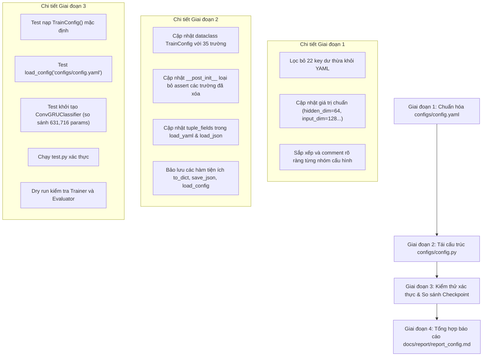

# KẾ HOẠCH TRIỂN KHAI: RÀ SOÁT VÀ CHUẨN HÓA CONFIG.PY VÀ CONFIG.YAML

- **Mã kế hoạch**: `PLAN_CONFIG`
- **Tệp kế hoạch**: `docs/plan/plan_config.md`
- **Dựa trên tài liệu phân tích**: `docs/analsys/analsys_config.md`
- **Mục tiêu**: Lập lộ trình từng bước để tái cấu trúc và chuẩn hóa tệp `configs/config.py` và `configs/config.yaml`, loại bỏ toàn bộ 22 tham số dư thừa, đồng bộ hóa 35 tham số thực tế đang sử dụng, và tiến hành kiểm thử xác thực khớp 100% với mô hình đã huấn luyện (`best.pt`).
- **Trạng thái**: Đang chờ người dùng phê duyệt (Bước 2 theo chuẩn `AGENTS.md`).

---

## 1. MỤC TIÊU VÀ PHẠM VI CÔNG VIỆC

1. **Phạm vi can thiệp chính**:
   - `configs/config.yaml`: Tinh giản và chuẩn hóa cấu trúc YAML.
   - `configs/config.py`: Tái cấu trúc dataclass `TrainConfig`, phương thức `__post_init__`, và các hàm `load_yaml`, `load_json`, `save_json`.
2. **Tiêu chí chuẩn hóa cốt lõi**:
   - Loại bỏ toàn bộ **22 tham số dư thừa** đã xác định ở Bước 1.
   - Giữ lại và tổ chức khoa học **35 tham số thực tế có sử dụng**.
   - Chuẩn hóa các giá trị bị sai lệch:
     - `hidden_dim`: Đặt thành **`64`** (thay vì 128 hay 192), khớp cấu trúc 2 tầng ConvGRU và checkpoint `best.pt`.
     - `input_dim`: Đặt thành **`128`** (thay vì 256), khớp với chiều ra của `SpatialReductionNeck` (`[128, 448, 1, 1]`).
     - `sample_interval`: Đặt thành **`0.2`** (thay vì 0.1).
     - `seq_len`: Đặt thành **`null` / `None`** (dynamic padding clip).
     - `batch_size` & `val_batch_size`: Đặt thành **`4`** (tối ưu VRAM GPU 4GB-6GB).
     - `epochs`: Đặt thành **`20`**.
     - `gradient_accumulation_steps` & `empty_cache_interval`: Đặt thành **`4`**.
3. **Tiêu chuẩn kiểm thử và an toàn**:
   - Giữ nguyên cơ chế **Safety Guard** tự động trên Windows (`num_workers`, `pin_memory`) và GPU VRAM thấp trong `config.py`.
   - Đảm bảo khi khởi tạo `ConvGRUClassifier.from_config(cfg)`, số lượng tham số mô hình đạt chính xác **631,716 tham số**, khớp 100% với checkpoint `best.pt`.
   - Đảm bảo không gây lỗi vỡ logic (breaking changes) đối với `src/train.py`, `src/evaluate.py`, `src/models.py`, `src/dataset.py`, `test.py`.

---

## 2. LỘ TRÌNH THỰC HIỆN CHI TIẾT (WORKFLOW PHÂN KỲ)



---

### GIAI ĐOẠN 1: CHUẨN HÓA TỆP `configs/config.yaml`

- **Nhiệm vụ 1.1: Tinh giản và phân nhóm cấu hình**:
  - **Nhóm 1 (`dataset`)**:
    - Giữ lại: `dataset_dir`, `manifest_file`, `backbone_neck_checkpoint`, `sample_interval`, `seq_len`, `image_size`, `video_exts`, `min_frames`, `use_augmentation`.
    - Loại bỏ: `val_dataset_dir`, `val_manifest`, `train_ratio`, `split_by_subject`.
  - **Nhóm 2 (`dataloader`)**:
    - Giữ lại: `batch_size`, `val_batch_size`, `num_workers`, `val_num_workers`, `pin_memory`, `shuffle`, `seed`, `chunk_size`.
    - Loại bỏ: `drop_last`, `persistent_workers`, `prefetch_factor`.
  - **Nhóm 3 (`model`)**:
    - Giữ lại: `cnn_neck_channels`, `adapter_dropout`, `input_dim`, `hidden_dim`, `num_layers`, `num_classes`, `dropout`, `supervision_mode`.
    - Loại bỏ: `cnn_strides`, `cnn_num_features`, `cnn_out_channels`, `cnn_spatial_size`, `spatial_fusion`, `use_norm`.
    - Điều chỉnh giá trị: `input_dim: 128`, `hidden_dim: 64`.
  - **Nhóm 4 (`loss`)**:
    - Giữ lại: `loss_type`, `bce_eps`, `bce_reduction`, `pos_weight`.
  - **Nhóm 5 (`optimizer`)**:
    - Giữ lại: `epochs`, `lr0`, `lr_min_factor`, `weight_decay`, `optimizer`, `betas`, `momentum`, `grad_clip_norm`, `gradient_accumulation_steps`, `empty_cache_interval`, `use_scheduler`.
    - Loại bỏ: `warmup_epochs`, `scheduler_type`.
  - **Nhóm 6 (`logging`)**:
    - Giữ lại: `tb_log_dir`, `experiment_name`, `checkpoint_dir`, `save_all_epochs`, `save_ckpt_interval_epochs`, `ckpt_keep_last`, `enable_resume`, `resume`, `enable_step_logging`, `log_step_interval`, `early_stopping`, `patience`, `monitor_metric`, `monitor_mode`, `min_delta`, `history_csv_path`.
    - Loại bỏ: `log_dir`, `save_best_only`, `resume_epoch`, `flush_step_interval`, `ema_beta`, `summary_json_path`, `plot_curves_path`, `plot_cm_path`, `plot_roc_path`, `dry_run`.
  - **Nhóm 7 (`runtime`)**:
    - Giữ lại: `device`, `amp`, `val_interval_epochs`, `use_tqdm`.
    - Loại bỏ: `log_interval`.

---

### GIAI ĐOẠN 2: TÁI CẤU TRÚC TỆP `configs/config.py`

- **Nhiệm vụ 2.1: Đồng bộ dataclass `TrainConfig`**:
  - Định nghĩa đúng 35 thuộc tính tương ứng với kiểu dữ liệu Type Hints chuẩn xác (`Tuple`, `Optional`, `Union`, `Path`).
  - Thiết lập giá trị mặc định chuẩn xác:
    - `DEFAULT_DATASET_DIR = "E:/LSTM/data_processed"` (đường dẫn chuẩn trên máy cục bộ; có fallback nếu không tồn tại).
    - `DEFAULT_CHECKPOINT_PATH` trỏ đúng checkpoint `landmark_train/best.pt`.
    - `input_dim: int = 128` (thay vì 256).
    - `hidden_dim: int = 64` (thay vì 192).
    - `sample_interval: float = 0.2` (thay vì 0.1).
    - `seq_len: Optional[int] = None` (thay vì 50).
    - `batch_size: int = 4`, `val_batch_size: int = 4`.
    - `epochs: int = 20`.
    - `gradient_accumulation_steps: int = 4`, `empty_cache_interval: int = 4`.
- **Nhiệm vụ 2.2: Làm sạch phương thức `__post_init__`**:
  - Xóa bỏ các `assert` đối với các trường đã loại bỏ: `flush_step_interval`, `ema_beta`, `resume_epoch`, `persistent_workers`, `prefetch_factor`, `train_ratio`.
  - Giữ lại và tối ưu cơ chế **Safety Guard** tự động trên Windows (`num_workers`, `pin_memory`) và GPU VRAM thấp.
- **Nhiệm vụ 2.3: Chuẩn hóa bộ parser nạp cấu hình (`load_yaml`, `load_json`)**:
  - Cập nhật danh sách `tuple_fields` chỉ gồm các trường đang dùng:
    ```python
    tuple_fields = ["image_size", "video_exts", "cnn_neck_channels", "betas"]
    ```
  - Đảm bảo cơ chế tự động ép kiểu và lọc key thừa (`filtered = {k: v for k, v in ... if k in valid_keys}`) hoạt động trơn tru.

---

### GIAI ĐOẠN 3: KIỂM THỬ XÁC THỰC VÀ BẢO ĐẢM TÍNH KHÔNG PHÁ VỠ (VERIFICATION)

- **Nhiệm vụ 3.1: Kiểm tra nạp cấu hình**:
  - Chạy lệnh kiểm tra nạp `TrainConfig()` mặc định.
  - Chạy lệnh kiểm tra nạp `load_config("configs/config.yaml")`.
  - Đảm bảo số lượng trường sau nạp là đúng 35 trường, không phát sinh lỗi validation.
- **Nhiệm vụ 3.2: Kiểm tra kiến trúc mô hình và tổng số tham số**:
  - Khởi tạo `ConvGRUClassifier.from_config(cfg)`.
  - Tính tổng số tham số `total_params`.
  - So sánh trực tiếp với mô hình nạp từ checkpoint `best.pt`:
    - Mục tiêu: Số tham số phải đạt chính xác **631,716 tham số**.
    - Tensor shape của `spatial_neck` ([128, 448, 1, 1]) và `convgru` ([128, 192, 3, 3]) phải khớp 100%.
- **Nhiệm vụ 3.3: Kiểm tra sự tương thích của toàn hệ thống**:
  - Chạy tệp `test.py`.
  - Kiểm tra khả năng khởi tạo `Trainer(cfg)` trong `src/train.py` (khởi tạo DataLoader, Extractor, Criterion, Optimizer mà không bị thiếu tham số).
  - Kiểm tra khả năng chạy của `src/evaluate.py`.

---

### GIAI ĐOẠN 4: TỔNG HỢP BÁO CÁO KẾT QUẢ (`docs/report/report_config.md`)

- Viết tài liệu báo cáo tổng hợp `docs/report/report_config.md`:
  - Thống kê chi tiết các tham số đã xóa và lý do.
  - So sánh cấu hình Trước vs Sau chuẩn hóa.
  - Kết quả kiểm thử tham số và kiểm tra tương thích mô hình.

---

## 3. CHECKLIST TIÊU CHÍ HOÀN THÀNH (ACCEPTANCE CRITERIA)

- [ ] `configs/config.yaml` và `configs/config.py` chỉ chứa đúng các tham số có sử dụng thực tế (35 tham số).
- [ ] Không còn bất kỳ tham số dư thừa / không sử dụng nào (22 tham số đã được loại bỏ sạch sẽ).
- [ ] Giá trị `input_dim: 128` và `hidden_dim: 64` được đồng bộ chuẩn xác trên cả 2 tệp.
- [ ] Khởi tạo `ConvGRUClassifier.from_config(cfg)` cho ra đúng **631,716 tham số**, khớp 100% với checkpoint `best.pt`.
- [ ] Tệp `test.py` thực thi thành công không phát sinh bất kỳ cảnh báo hoặc lỗi nào.
- [ ] Tệp báo cáo `docs/report/report_config.md` được tạo đầy đủ theo quy chuẩn `AGENTS.md`.
