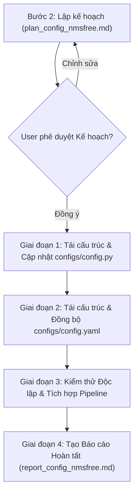

# KẾ HOẠCH TRIỂN KHAI: RÀ SOÁT LỖI ĐƯỜNG DẪN, LOẠI BỎ THAM SỐ THỪA VÀ ĐỒNG BỘ CẤU HÌNH CHO NMSFreeDetector

> **Tài liệu:** `docs/plan/plan_config_nmsfree.md`  
> **Kế thừa từ:** `docs/analsys/analsys_config_nmsfree.md`  
> **Nhiệm vụ:** Lên kế hoạch chi tiết từng bước để chỉnh sửa, tinh gọn và đồng bộ hóa cấu hình hệ thống huấn luyện trực tiếp từ dữ liệu video thô với mô hình `NMSFreeDetector`.  
> **Tuân thủ quy trình:** Bước 2 - Lên kế hoạch thực hiện (Planning) theo `AGENTS.md`.

---

## 1. Mục tiêu Kế hoạch

1. **Khắc phục toàn bộ lỗi đường dẫn**: Loại bỏ các đường dẫn Windows (`E:\...`), sửa đường dẫn thiếu prefix `/home/riftuser/...` cho checkpoint `NMSFreeDetector`, và xóa các đường dẫn tới tệp không tồn tại (`.h5`, `.pt`, `.onnx`).
2. **Loại bỏ triệt để các tham số không hỗ trợ raw video + NMSFreeDetector**: Xóa các trường cấu hình của HDF5, Tensor .pt, ONNX Runtime, và Dummy CNN.
3. **Đồng bộ hóa 100% giữa `configs/config.py` và `configs/config.yaml`**: Cấu trúc 7 nhóm section đồng nhất, khớp 1-1 về tên tham số, kiểu dữ liệu và giá trị mặc định.
4. **Xác thực toàn diện (Comprehensive Verification)**: Đảm bảo cả hai tệp cấu hình nạp thành công, tương thích hoàn toàn với `src/dataset2.py` (`RawVideoBackboneNeckDataset`) và `src/models.py` (`DeepGRUClassifier.from_config`).

---

## 2. Kế hoạch Thực hiện Từng bước (Step-by-Step Action Plan)

### Giai đoạn 1: Tái cấu trúc & Chuẩn hóa `configs/config.py`
- **Nhiệm vụ 1.1:** Dọn dẹp dataclass `TrainConfig`:
  - Xóa bỏ các thuộc tính HDF5: `train_h5`, `val_h5`, `train_manifest_csv`, `val_manifest_csv`, `include_augmented_train`.
  - Xóa bỏ các thuộc tính Tensor .pt: `use_preloaded_pt`, `train_pt`, `val_pt`.
  - Xóa bỏ các thuộc tính ONNX: `backbone_onnx_path`, `backbone_neck_onnx_path`, `cnn_manifest_path`.
  - Xóa bỏ thuộc tính Dummy CNN: `use_dummy_cnn`.
  - Xóa bỏ `cnn_weights_path` (đường dẫn lỗi); chuẩn hóa biến `backbone_neck_checkpoint` thành đường dẫn tuyệt đối mặc định trỏ tới file checkpoint PyTorch thực tế:  
    `/home/riftuser/workspace/driver-guardian/ai/ObjectDetection_2p6M/checkpoints/2bfb6cc36ef5ab822a944006c746e5d348d67e387501c9027df5b957cf124031/de0c5b23e1ae749b972f10cb5f3e21e2ccf37bd334eb7a7c3091c460073ff310/finetune/best.pt`.
  - Chuẩn hóa các trường `dataset_dir`, `manifest_file`, `val_dataset_dir`, `val_manifest`.
- **Nhiệm vụ 1.2:** Tinh chỉnh logic phương thức `__post_init__`:
  - Loại bỏ các đoạn kiểm tra `train_pt`, `val_pt`, và các đường dẫn Kaggle `.pt`.
  - Bổ sung xác thực kiểm tra sự tồn tại của `dataset_dir` và `backbone_neck_checkpoint` (cảnh báo hoặc fallback linh hoạt nếu chạy môi trường khác).
  - Tự động gán `val_dataset_dir = None` nếu để chuỗi rỗng.
- **Nhiệm vụ 1.3:** Tối ưu hóa hàm `load_yaml` và `load_json`:
  - Đảm bảo mapping tự động các trường tuple (`image_size`, `video_exts`, `cnn_neck_channels`, `cnn_strides`, `cnn_spatial_size`, `betas`).
  - Lọc các key không hợp lệ để tránh lỗi khởi tạo.

### Giai đoạn 2: Tái cấu trúc & Đồng bộ hóa `configs/config.yaml`
- **Nhiệm vụ 2.1:** Viết lại toàn bộ `configs/config.yaml` theo 7 nhóm chuẩn:
  1. `dataset`:
     - `dataset_dir`: `"/home/riftuser/.cache/kagglehub/datasets/nyvantran6634/dataset-datn4ni/versions/1/data_processed"`
     - `manifest_file`: `"dataset_merged_split.csv"`
     - `val_dataset_dir`: `null`
     - `val_manifest`: `null`
     - `backbone_neck_checkpoint`: `"/home/riftuser/workspace/driver-guardian/ai/ObjectDetection_2p6M/checkpoints/2bfb6cc36ef5ab822a944006c746e5d348d67e387501c9027df5b957cf124031/de0c5b23e1ae749b972f10cb5f3e21e2ccf37bd334eb7a7c3091c460073ff310/finetune/best.pt"`
     - `sample_interval`: `0.1`
     - `seq_len`: `50`
     - `image_size`: `[640, 640]`
     - `video_exts`: `[".avi", ".mp4", ".mkv", ".mov"]` (đã sửa chính tả `video_exits`)
     - `train_ratio`: `0.8`
     - `split_by_subject`: `true`
     - `min_frames`: `10`
  2. `dataloader`: `batch_size: 16`, `val_batch_size: 16`, `num_workers: 0`, `val_num_workers: 0`, `pin_memory: false`, `shuffle: true`, `drop_last: false`, `persistent_workers: false`, `prefetch_factor: null`, `seed: 42`, `chunk_size: 16`.
  3. `model`: `cnn_neck_channels: [64, 128, 256]`, `cnn_strides: [8, 16, 32]`, `cnn_num_features: 3`, `cnn_out_channels: 448`, `cnn_spatial_size: [20, 20]`, `spatial_fusion: "concat"`, `adapter_dropout: 0.25`, `use_norm: true`, `input_dim: 256`, `hidden_dim: 192`, `num_layers: 2`, `num_classes: 2`, `dropout: 0.35`, `supervision_mode: "attention_pooling"`.
  4. `loss`: `loss_type: "ce"`, `bce_eps: 1.0e-7`, `bce_reduction: "mean"`, `pos_weight: null`.
  5. `optimizer`: `epochs: 40`, `lr0: 0.001`, `lr_min_factor: 0.01`, `weight_decay: 0.0001`, `warmup_epochs: 1.0`, `optimizer: "adamw"`, `betas: [0.9, 0.999]`, `momentum: 0.9`, `grad_clip_norm: 1.0`, `use_scheduler: true`, `scheduler_type: "cosine"`.
  6. `logging`: `tb_log_dir: "logs/tensorboard"`, `log_dir: "logs"`, `experiment_name: "deepgru_raw_nmsfree"`, `checkpoint_dir: "checkpoints/experiments"`, `save_all_epochs: true`, `save_ckpt_interval_epochs: 1`, `save_best_only: false`, `ckpt_keep_last: null`, `enable_resume: false`, `resume_epoch: 2`, `resume: ""`, `early_stopping: true`, `patience: 10`, `monitor_metric: "val_f1"`, `monitor_mode: "max"`, `min_delta: 0.0001`, các file output đồ thị/báo cáo.
  7. `runtime`: `device: "cuda"`, `amp: true`, `log_interval: 10`, `val_interval_epochs: 1`, `use_tqdm: true`.

### Giai đoạn 3: Kiểm thử & Xác thực Tự động (Verification)
- **Nhiệm vụ 3.1: Kiểm thử nạp Config**:
  - Tạo script kiểm thử tự động kiểm tra:
    1. Khởi tạo `TrainConfig()` mặc định từ Python.
    2. Nạp `load_config("configs/config.yaml")`.
    3. Kiểm tra tính tương đồng 100% giữa hai cách nạp (khớp key, khớp value, khớp tuple/list).
- **Nhiệm vụ 3.2: Kiểm thử xác thực Đường dẫn (Path Validation)**:
  - Kiểm tra `Path(cfg.dataset_dir).exists()` -> Kỳ vọng: `True`.
  - Kiểm tra `Path(cfg.backbone_neck_checkpoint).exists()` -> Kỳ vọng: `True`.
  - Kiểm tra cấu trúc `train/`, `val/` và file manifest trong `dataset_dir`.
- **Nhiệm vụ 3.3: Kiểm thử Tương thích Mô hình & Dataloader**:
  - Khởi tạo `DeepGRUClassifier.from_config(cfg)` -> Xác thực không gặp ngoại lệ, đúng số chiều `in_channels` và `hidden_dim`.
  - Kiểm tra các tham số nạp vào `RawVideoBackboneNeckDataset` / `build_raw_video_dataloaders` từ cấu hình đã đồng bộ.

### Giai đoạn 4: Tổng hợp Báo cáo Hoàn tất (Documentation & Reporting)
- Tạo tài liệu `docs/report/report_config_nmsfree.md` ghi nhận đầy đủ:
  - Bảng so sánh Before vs After của cấu hình.
  - Danh sách chi tiết các dòng code và tham số đã sửa/xóa.
  - Log kết quả kiểm thử tự động đạt 100% PASS.

---

## 3. Tiêu chí Đánh giá & Hoàn thành (Checklist)

| Mục kiểm tra | Tiêu chuẩn Đạt (Passing Criteria) |
| :--- | :--- |
| **Không còn lỗi đường dẫn** | Không còn bất kỳ đường dẫn Windows (`E:\...`), không còn đường dẫn tệp không tồn tại (`.pt`, `.h5`, `.onnx`). |
| **Đường dẫn checkpoint chính xác** | `backbone_neck_checkpoint` trỏ đúng file `best.pt` của `NMSFreeDetector` tồn tại 100% trên disk. |
| **Loại bỏ hoàn toàn tham số cũ** | Không còn `train_h5`, `val_h5`, `train_pt`, `val_pt`, `backbone_onnx_path`, `use_dummy_cnn`, v.v. |
| **Đồng bộ tuyệt đối Python & YAML** | Mọi key trong `config.yaml` đều có mặt trong `config.py` và ngược lại; giá trị mặc định đồng nhất. |
| **Sửa lỗi chính tả** | `video_exits` được thay bằng `video_exts`. |
| **Tương thích mô hình** | `DeepGRUClassifier.from_config(cfg)` và `RawVideoBackboneNeckDataset` chạy trơn tru với config mới. |

---

## 4. Đề xuất Bước tiếp theo

Theo quy trình tại Mục 5 của `AGENTS.md`:
> *Agent dừng tại Bước 2 và gửi kế hoạch chi tiết tới Người dùng. Sau khi Người dùng duyệt kế hoạch này, Agent sẽ tiến hành Bước 3 (Thực hiện chỉnh sửa code, kiểm thử và tạo báo cáo `report_config_nmsfree.md`).*
