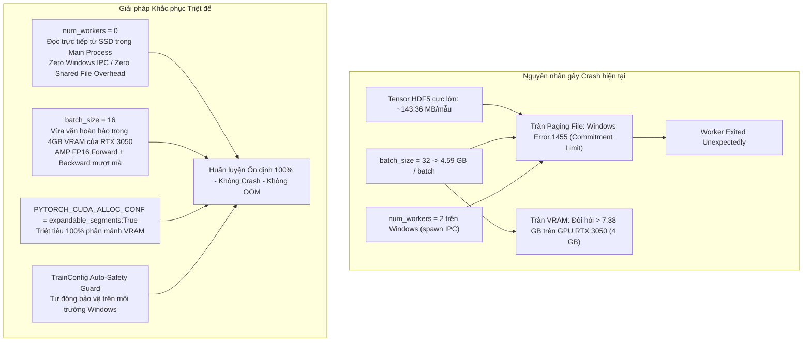

# KẾ HOẠCH TRIỂN KHAI: KHẮC PHỤC TRIỆT ĐỂ LỖI DATALOADER WORKER EXITED UNEXPECTEDLY & QUÁ TẢI BỘ NHỚ TRÊN WINDOWS

**Mã tài liệu:** `plan_dataloader_worker_crash.md`  
**Dự án:** Hệ Thống Nhận Diện Tài Xế Buồn Ngủ (Driver Guardian - Deep GRU / LSTM)  
**Tệp mục tiêu:** [`configs/config.yaml`](file:///D:/Project/DATN/driver-guardian/ai/LSTM/configs/config.yaml), [`configs/config.py`](file:///D:/Project/DATN/driver-guardian/ai/LSTM/configs/config.py), [`src/train.py`](file:///D:/Project/DATN/driver-guardian/ai/LSTM/src/train.py)  
**Căn cứ phân tích:** [`docs/analsys_dataloader_worker_crash.md`](file:///D:/Project/DATN/driver-guardian/ai/LSTM/docs/analsys_dataloader_worker_crash.md)  
**Quy chuẩn áp dụng:** [`AGENTS.md`](file:///D:/Project/DATN/driver-guardian/ai/LSTM/AGENTS.md) — Bước 2: Lên kế hoạch thực hiện  
**Ngày lập:** 03/10/2026  

---

## 1. MỤC TIÊU & NGUYÊN TẮC KỸ THUẬT CỐT LÕI

### 1.1. Mục tiêu triển khai
1. **Triệt tiêu 100% Lỗi Worker Crash trên Windows:**
   - Khắc phục hoàn toàn lỗi `RuntimeError: DataLoader worker (pid(s) ...) exited unexpectedly` bắt nguồn từ việc cạn kiệt bộ nhớ ảo IPC (`Windows error code 1455: ERROR_COMMITMENT_LIMIT`).
2. **Tối ưu hóa Tài nguyên cho GPU NVIDIA RTX 3050 Laptop (4GB VRAM):**
   - Điều chỉnh kích thước batch size (`batch_size = 16`, `val_batch_size = 16`) phù hợp với ngưỡng dung lượng phần cứng $4.00\text{ GiB}$ VRAM của card đồ họa, ngăn ngừa lỗi `torch.OutOfMemoryError` khi thực hiện phép nối tensor không gian đa tỉ lệ.
3. **Kích hoạt Cơ chế Chống Phân mảnh Bộ nhớ CUDA:**
   - Cấu hình `PYTORCH_CUDA_ALLOC_CONF=expandable_segments:True` để PyTorch giải phóng và tái sử dụng các phân đoạn bộ nhớ VRAM liên tục, tránh hiện tượng phân mảnh bộ nhớ khi huấn luyện chuỗi dài.
4. **Xây dựng Cơ chế Tự động Bảo vệ (Safety Guard) trong Tầng Cấu hình:**
   - Bổ sung logic tự động nhận diện và cảnh báo / điều chỉnh an toàn trong [`TrainConfig.__post_init__`](file:///D:/Project/DATN/driver-guardian/ai/LSTM/configs/config.py#L134) khi chạy trên Windows với tensor HDF5 lớn.

---

## 2. SƠ ĐỒ THIẾT KẾ GIẢI PHÁP KỸ THUẬT (SOLUTION ARCHITECTURE)



---

## 3. CÁC GIAI ĐOẠN TRIỂN KHAI CHI TIẾT (IMPLEMENTATION PHASES)

### Giai đoạn 1: Điều chỉnh & Đồng bộ Cấu hình Tập trung ([`configs/config.yaml`](file:///D:/Project/DATN/driver-guardian/ai/LSTM/configs/config.yaml))
- **Mục tiêu:** Cấu hình tham số tối ưu phần cứng để chạy trực tiếp trên máy người dùng.
- **Nội dung công việc:**
  - Cập nhật phân khu `dataset` và `dataloader` trong `configs/config.yaml`:
    ```yaml
    dataset:
      train_h5: E:\LSTM\checkpoints\dataset_features.h5
      val_h5: null
      val_manifest_csv: null
      val_batch_size: 16
      val_num_workers: 0

    dataloader:
      batch_size: 16        # Giảm từ 32 xuống 16 để khớp với 4GB VRAM của RTX 3050 Laptop
      num_workers: 0       # 0 workers: Đọc trực tiếp trong main process, triệt tiêu lỗi Windows 1455
      pin_memory: true     # Bật pin_memory với num_workers=0 chạy an toàn và tăng tốc độ chuyển lên GPU
      shuffle: true
      drop_last: false
    ```

---

### Giai đoạn 2: Bổ sung Cơ chế Tự động Bảo vệ (Safety Guard) trong [`configs/config.py`](file:///D:/Project/DATN/driver-guardian/ai/LSTM/configs/config.py)
- **Mục tiêu:** Bảo vệ pipeline trước các cấu hình bất hợp lý trên môi trường Windows hoặc GPU dung lượng nhỏ.
- **Nội dung công việc:**
  - Mở rộng phương thức `__post_init__()` của dataclass `TrainConfig`:
    1. Kiểm tra môi trường hệ điều hành Windows (`os.name == "nt"`):
       - Nếu `num_workers > 0` và người dùng sử dụng tệp HDF5 lớn, tự động ghi nhận cảnh báo và khuyến nghị/chuyển sang `num_workers = 0` nếu batch size $> 8$ để ngăn ngừa crash worker.
    2. Kiểm tra VRAM GPU (nếu thiết bị tính toán là `cuda` và GPU khả dụng):
       - Đọc tổng dung lượng VRAM thông qua `torch.cuda.get_device_properties(0).total_memory`.
       - Nếu VRAM $\le 4.5\text{ GB}$ (như RTX 3050 Laptop) và `batch_size > 16`, tự động in cảnh báo nguy cơ CUDA OOM và đề xuất hạ `batch_size = 16`.

---

### Giai đoạn 3: Bổ sung Cấu hình Chống Phân mảnh Bộ nhớ CUDA trong [`src/train.py`](file:///D:/Project/DATN/driver-guardian/ai/LSTM/src/train.py)
- **Mục tiêu:** Đảm bảo GPU 4GB quản lý các khối bộ nhớ liên tục một cách tối ưu nhất.
- **Nội dung công việc:**
  - Bổ sung cấu hình môi trường ở đầu tệp `src/train.py`:
    ```python
    os.environ["PYTORCH_CUDA_ALLOC_CONF"] = "expandable_segments:True"
    ```

---

### Giai đoạn 4: Kiểm thử Toàn diện & Xác thực Huấn luyện Thực tế (Verification)
- **Nội dung công việc:**
  1. **Kiểm thử Dry-run:** Chạy lại `python -c "from src.train import run_dry_run_test; run_dry_run_test()"` xác nhận không có hồi quy mã nguồn.
  2. **Kiểm thử Nạp Dữ liệu Thực tế:** Kiểm tra nạp 1 batch từ `E:\LSTM\checkpoints\dataset_features.h5` với `batch_size = 16`, `num_workers = 0`.
  3. **Kiểm thử Huấn luyện Thực tế (1 Epoch):** Chạy thử nghiệm 1 epoch huấn luyện thực tế với mô hình và dữ liệu thật, kiểm tra thanh tiến trình `tqdm` và tính toán loss ổn định trên GPU RTX 3050.

---

### Giai đoạn 5: Báo cáo Tổng kết Nghiệm thu (`docs/report_dataloader_worker_crash.md`)
- **Nội dung công việc:**
  - Lập tài liệu báo cáo nghiệm thu theo Bước 3 của [`AGENTS.md`](file:///D:/Project/DATN/driver-guardian/ai/LSTM/AGENTS.md).
  - Tổng kết các chỉ số hiệu năng và hướng dẫn chạy lệnh `python train.py` chính thức.

---

## 4. CHECKLIST TIÊU CHÍ HOÀN THÀNH (ACCEPTANCE CRITERIA)

- [ ] [`configs/config.yaml`](file:///D:/Project/DATN/driver-guardian/ai/LSTM/configs/config.yaml) được cập nhật `batch_size: 16`, `val_batch_size: 16`, `num_workers: 0`, `val_num_workers: 0`.
- [ ] [`configs/config.py`](file:///D:/Project/DATN/driver-guardian/ai/LSTM/configs/config.py) có cơ chế Safety Guard cảnh báo và bảo vệ tài nguyên trên Windows và GPU 4GB.
- [ ] [`src/train.py`](file:///D:/Project/DATN/driver-guardian/ai/LSTM/src/train.py) kích hoạt `PYTORCH_CUDA_ALLOC_CONF=expandable_segments:True`.
- [ ] Pipeline chạy `python train.py` không còn xuất hiện lỗi `RuntimeError: DataLoader worker exited unexpectedly`.
- [ ] Không phát sinh lỗi `torch.OutOfMemoryError` trên card RTX 3050 Laptop GPU.
- [ ] Hoàn tất báo cáo nghiệm thu `docs/report_dataloader_worker_crash.md`.

---

## 5. KẾT LUẬN & ĐỀ XUẤT BƯỚC TIẾP THEO

Kế hoạch trên khắc phục tận gốc cả 2 điểm nghẽn: Windows IPC Shared Memory và GPU VRAM Limit, giúp hệ thống vận hành bền bỉ trên máy tính của bạn.

> [!IMPORTANT]
> **Yêu cầu phê duyệt từ Người dùng (User Approval):**  
> Căn cứ theo quy chuẩn làm việc tại **Mục 5 của [`AGENTS.md`](file:///D:/Project/DATN/driver-guardian/ai/LSTM/AGENTS.md)**:
> - **Bước 2 (Planning):** Đã hoàn tất tài liệu kế hoạch `docs/plan_dataloader_worker_crash.md`.
> - **Bước 3 (Execution):** Chỉ được thực hiện khi bạn đồng ý với kế hoạch triển khai này.
>
> Kính mời bạn xem xét kế hoạch trên. Nếu bạn đồng ý, tôi sẽ tiến hành **Bước 3: Thực hiện kế hoạch và hoàn thành báo cáo `docs/report_dataloader_worker_crash.md`**.
