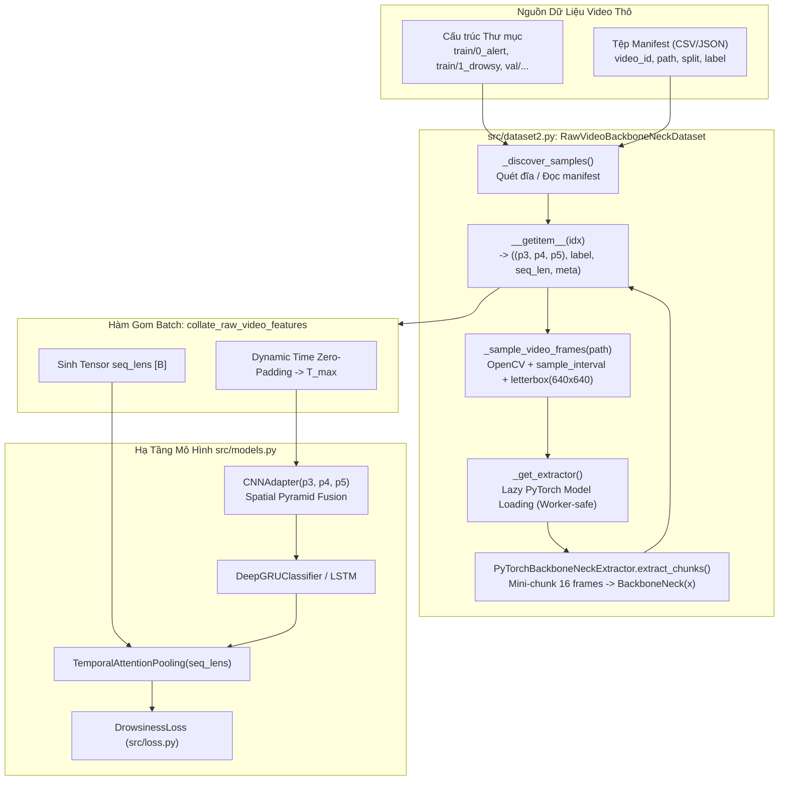

# KẾ HOẠCH TRIỂN KHAI XÂY DỰNG DATASET NẠP VIDEO THÔ & TRÍCH XUẤT ĐẶC TRƯNG PYTORCH BACKBONENECK TRỰC TIẾP

**Mã tài liệu:** `plan_raw_video_backboneneck_dataset.md`  
**Dự án:** Hệ Thống Nhận Diện Tài Xế Buồn Ngủ (Driver Guardian - Deep GRU / LSTM)  
**Tệp mục tiêu:** [`src/dataset2.py`](file:///D:/Project/DATN/driver-guardian/ai/LSTM/src/dataset2.py) & [`src/__init__.py`](file:///D:/Project/DATN/driver-guardian/ai/LSTM/src/__init__.py)  
**Căn cứ phân tích:** [`docs/analsys/analsys_raw_video_backboneneck_dataset.md`](file:///D:/Project/DATN/driver-guardian/ai/LSTM/docs/analsys/analsys_raw_video_backboneneck_dataset.md)  
**Mô hình trích xuất nguồn:** Lớp `BackboneNeck` trong [`D:\Project\DATN\driver-guardian\ai\ObjectDetection_2p6M\runtime\convertor.py`](file:///D:/Project/DATN/driver-guardian/ai/ObjectDetection_2p6M/runtime/convertor.py)  
**Tệp trọng số Checkpoint:** `D:\Project\DATN\driver-guardian\ai\ObjectDetection_2p6M\checkpoints\2bfb6cc36ef5ab822a944006c746e5d348d67e387501c9027df5b957cf124031\de0c5b23e1ae749b972f10cb5f3e21e2ccf37bd334eb7a7c3091c460073ff310\finetune\best.pt`  
**Mô hình tiếp nhận hạ tầng:** [`src/models.py`](file:///D:/Project/DATN/driver-guardian/ai/LSTM/src/models.py) (`CNNAdapter`, `DeepGRUClassifier`)  
**Quy chuẩn áp dụng:** [`AGENTS.md`](file:///D:/Project/DATN/driver-guardian/ai/LSTM/AGENTS.md) — Bước 2: Lên kế hoạch thực hiện  
**Ngày lập:** 04/10/2026  

---

## 1. MỤC TIÊU & NGUYÊN TẮC KỸ THUẬT CỐT LÕI

### 1.1. Mục tiêu triển khai
1. **Xây dựng module [`src/dataset2.py`](file:///D:/Project/DATN/driver-guardian/ai/LSTM/src/dataset2.py) chuẩn công nghiệp:**
   - Cung cấp lớp `RawVideoBackboneNeckDataset` kế thừa từ `torch.utils.data.Dataset`.
   - Nạp trực tiếp video thô (`.mp4`, `.avi`, `.mkv`, `.mov`...) từ ổ đĩa theo cấu trúc thư mục phân tầng (`train/0_alert`, `train/1_drowsy`, `val/...`) hoặc từ tệp chỉ mục manifest (CSV/JSON).
2. **Trích xuất Đặc trưng Trực tiếp qua PyTorch `BackboneNeck` (On-The-Fly PyTorch Extraction):**
   - Tích hợp lớp `BackboneNeck` từ [`D:\Project\DATN\driver-guardian\ai\ObjectDetection_2p6M\runtime\convertor.py`](file:///D:/Project/DATN/driver-guardian/ai/ObjectDetection_2p6M/runtime/convertor.py).
   - Nạp trọng số từ checkpoint `.pt` finetune chính thức, trích xuất chuẩn xác 3 bản đồ đặc trưng không gian:
     - `p3`: $[T, 64, 80, 80]$ (Độ phân giải không gian cao, nắm bắt chi tiết vi mô mắt/miệng)
     - `p4`: $[T, 128, 40, 40]$ (Đặc trưng tỷ lệ trung bình)
     - `p5`: $[T, 256, 20, 20]$ (Đặc trưng ngữ nghĩa toàn cục khuôn mặt và tư thế đầu)
3. **Chu kỳ Lấy mẫu Thời gian Tùy chỉnh (`sample_interval`):**
   - Cho phép người dùng tùy biến chu kỳ thời gian lấy mẫu (ví dụ: `0.1s` ~ 10 FPS, `0.05s` ~ 20 FPS, `0.2s` ~ 5 FPS...).
   - Tự động thích ứng với FPS gốc của từng video: $\text{step} = \max\left(1, \text{round}(\text{fps} \times \text{sample\_interval})\right)$.
   - Căn chỉnh kích thước ảnh qua thuật toán `letterbox` chuẩn 640x640 (giữ nguyên tỷ lệ gốc, đệm viền xám $114$).
4. **An toàn Đa tiến trình & Chống xung đột CUDA Context (Multiprocessing Safe):**
   - Áp dụng mô hình **Lazy Model Instantiation** per-worker process (chỉ khởi tạo thực thể `BackboneNeck` trên thiết bị khi gọi `__getitem__` lần đầu tiên bên trong tiến trình worker).
   - Loại trừ hoàn toàn lỗi CUDA initialization deadlock trên Windows (`spawn`).
5. **Suy luận Mini-Chunk Chống tràn VRAM:**
   - Xử lý chuỗi khung hình theo từng mini-chunk kích thước nhỏ (`chunk_size = 16`) với `torch.inference_mode()`.
   - Hỗ trợ tùy chọn nửa độ chính xác FP16 (`use_fp16=True`) để tiết kiệm tối đa VRAM GPU.
6. **Gom Batch Động & Tương thích Hạ tầng DeepGRU:**
   - Xây dựng hàm `collate_raw_video_features`: tự động Zero-Padding theo trục thời gian về $T_{\max}$ của batch và sinh tensor `seq_lens` $[B]$.
   - Tương thích 100% với [`CNNAdapter`](file:///D:/Project/DATN/driver-guardian/ai/LSTM/src/models.py) và [`DeepGRUClassifier`](file:///D:/Project/DATN/driver-guardian/ai/LSTM/src/models.py).
7. **Tuân thủ Tuyệt đối các Tiêu chí Thiết kế:**
   - **KHÔNG tích hợp `src/img_preprocess.py`:** Loại bỏ chi phí CPU lọc ảnh để tối ưu hóa thông lượng dữ liệu.
   - **KHÔNG sử dụng cơ chế Caching (Loại bỏ RAM/Disk Cache):** Thuần trích xuất streaming không trạng thái ẩn (Stateless Data Pipeline).

---

## 2. KIẾN TRÚC MÃ NGUỒN & SƠ ĐỒ LUỒNG DỮ LIỆU (`src/dataset2.py`)



---

## 3. THIẾT KẾ CHI TIẾT CÁC THÀNH PHẦN

### 3.1. Cấu trúc dữ liệu đại diện mẫu: `RawVideoSample`
```python
@dataclass
class RawVideoSample:
    """Lưu trữ siêu dữ liệu đại diện cho một video clip trong bộ dữ liệu."""
    path: Path              # Đường dẫn tệp video thô (.mp4, .avi, .mkv, .mov)
    video_id: str           # Mã định danh video (vd: "train_0_alert_sust_n_1")
    split: str              # "train", "val" hoặc "all"
    label: int              # 0 (alert) hoặc 1 (drowsy)
    label_name: str         # "0_alert" hoặc "1_drowsy"
    source_dataset: str     # Nguồn ("sust", "uta-rldd", "custom", ...)
    subject_id: Optional[str] = None
```

### 3.2. Lớp Động cơ Trích xuất PyTorch: `PyTorchBackboneNeckExtractor`
- Đóng gói logic nạp checkpoint `.pt`, khởi tạo kiến trúc `NMSFreeDetector`, trích xuất `BackboneNeck` và thực thi forward pass.
- Đóng băng toàn bộ trọng số: `for p in model.parameters(): p.requires_grad = False`.
- Phương thức `extract_chunks(frames_rgb: List[np.ndarray]) -> Tuple[torch.Tensor, torch.Tensor, torch.Tensor]`:
  1. Kiểm tra độ dài $T$. Nếu $T = 0$, trả về các tensor rỗng tương ứng.
  2. Cắt lát chuỗi $T$ khung hình thành từng đoạn nhỏ kích thước `chunk_size` (mặc định 16).
  3. Chuyển đổi numpy RGB $[B_{chunk}, 640, 640, 3] \rightarrow$ PyTorch Tensor $[B_{chunk}, 3, 640, 640]$, chuẩn hóa $[0.0, 1.0]$.
  4. Đưa vào thiết bị (`cuda` hoặc `cpu`) và thực thi suy luận trong khối `with torch.inference_mode():`.
  5. Thu nhận `(p3, p4, p5)` của từng chunk và chuyển về CPU tensor (hoặc giữ trên target dtype/device).
  6. Ghép nối (`torch.cat`) dọc theo trục thời gian $T$, sinh ra:
     - $p3 \in \mathbb{R}^{T \times 64 \times 80 \times 80}$
     - $p4 \in \mathbb{R}^{T \times 128 \times 40 \times 40}$
     - $p5 \in \mathbb{R}^{T \times 256 \times 20 \times 20}$

### 3.3. Lớp PyTorch Dataset: `RawVideoBackboneNeckDataset`
- Kế thừa `torch.utils.data.Dataset`.
- **Tham số khởi tạo:**
  ```python
  def __init__(
      self,
      dataset_dir: Union[str, Path],
      manifest_file: Optional[Union[str, Path]] = None,
      split: str = "train",
      sample_interval: float = 0.1,
      seq_len: Optional[int] = None,
      checkpoint_path: Union[str, Path] = DEFAULT_CHECKPOINT_PATH,
      img_size: int = 640,
      chunk_size: int = 16,
      device: str = "auto",
      device_id: int = 0,
      use_fp16: bool = False,
      augmenter: Optional[Any] = None,
      video_exts: Sequence[str] = (".mp4", ".avi", ".mkv", ".mov"),
      window_sampling: str = "random",
      filter_label: Optional[int] = None,
      min_frames: int = 1,
      target_dtype: torch.dtype = torch.float32
  ) -> None:
  ```
- **Phương thức `__getitem__(self, idx: int)`:**
  1. Lấy mẫu `RawVideoSample` tại vị trí `idx`.
  2. Mở video qua `cv2.VideoCapture`, đọc FPS gốc và tổng số khung hình.
  3. Tính toán bước nhảy `step = max(1, round(fps * sample_interval))`.
  4. Lấy mẫu các khung hình, resize letterbox về $(640, 640)$, chuyển BGR $\rightarrow$ RGB.
  5. Cắt lát thời gian theo `seq_len` (nếu có): random slice cho `train`, center slice cho `val`.
  6. Áp dụng `augmenter` (nếu có) với cùng seed cho toàn bộ khung hình trong video.
  7. Trích xuất đặc trưng qua `self._get_extractor().extract_chunks(frames_rgb)`.
  8. Ép kiểu về `target_dtype` (`torch.float32` hoặc `torch.float16`).
  9. Trả về `((p3, p4, p5), label_t, seq_len_t, meta_dict)`.

### 3.4. Hàm Gom Batch Động: `collate_raw_video_features`
- Nhận danh sách các mẫu từ `DataLoader`.
- Xác định $T_{\max} = \max_i(T_i)$ trong batch.
- Cấp phát các tensor zero-padded:
  - `batch_p3`: $[B, T_{\max}, 64, 80, 80]$
  - `batch_p4`: $[B, T_{\max}, 128, 40, 40]$
  - `batch_p5`: $[B, T_{\max}, 256, 20, 20]$
- Gán lát cắt `b_p[i, :T_i] = sample_p`, phần padding giữ nguyên $0.0$.
- Sinh tensor `seq_lens` $[B]$ và trả về `((batch_p3, batch_p4, batch_p5), batch_labels, seq_lens, batch_metas)`.

### 3.5. Hàm Factory: `build_raw_video_dataloaders`
- Khởi tạo cặp `DataLoader` (`train_loader`, `val_loader`).
- Tự động cấu hình `collate_fn=collate_raw_video_features` và `worker_init_fn` an toàn đa tiến trình.

---

## 4. KẾ HOẠCH TRIỂN KHAI TỪNG BƯỚC (STEP-BY-STEP IMPLEMENTATION PLAN)

### Giai đoạn 1: Xây dựng Module Mã nguồn [`src/dataset2.py`](file:///D:/Project/DATN/driver-guardian/ai/LSTM/src/dataset2.py)
- **Tác vụ 1.1:** Thiết lập môi trường, imports, cấu hình UTF-8 console Windows, bổ sung thư mục dự án cha vào `sys.path` để import `ai.ObjectDetection_2p6M`.
- **Tác vụ 1.2:** Định nghĩa dataclass `RawVideoSample` và hàm tiền xử lý `letterbox()` bảo toàn tỷ lệ khung hình.
- **Tác vụ 1.3:** Xây dựng lớp `PyTorchBackboneNeckExtractor` đóng gói nạp checkpoint, khởi tạo `BackboneNeck`, freeze weights, inference mini-chunk trong `torch.inference_mode()`.
- **Tác vụ 1.4:** Xây dựng lớp `RawVideoBackboneNeckDataset` với cơ chế giải mã OpenCV thích ứng theo `sample_interval` tùy biến, quét cấu trúc phân tầng / manifest, lazy model instantiation.
- **Tác vụ 1.5:** Xây dựng hàm gom batch `collate_raw_video_features` và hàm factory `build_raw_video_dataloaders`.
- **Tác vụ 1.6:** Nhúng bộ kiểm thử tự lập hoàn chỉnh (Self-Contained Unit Tests) trong khối `if __name__ == "__main__":`.

### Giai đoạn 2: Cập nhật Tệp Giao diện [`src/__init__.py`](file:///D:/Project/DATN/driver-guardian/ai/LSTM/src/__init__.py)
- Xuất khẩu các lớp và hàm mới: `RawVideoBackboneNeckDataset`, `PyTorchBackboneNeckExtractor`, cùng các hàm dùng chung để dễ dàng tái sử dụng trong các script huấn luyện.

### Giai đoạn 3: Thực thi Kiểm thử Nghiệm thu Toàn diện (Execution & Verification)
- Chạy trực tiếp `python src/dataset2.py` trong console PowerShell để kiểm thử 5 ca kiểm thử tích hợp:
  1. **Tạo dữ liệu mock:** Sinh video clip giả lập (`.mp4`) với kích thước và FPS khác nhau (30 FPS, 20 FPS).
  2. **Kiểm thử chu kỳ lấy mẫu tùy chỉnh:** Kiểm tra số lượng khung hình trích xuất ứng với `sample_interval = 0.1s` và `0.2s`.
  3. **Kiểm thử mô hình PyTorch BackboneNeck:** Nạp checkpoint finetune thực tế `best.pt`, forward pass và kiểm tra kích thước 3 tensor `p3`, `p4`, `p5`.
  4. **Kiểm thử Dynamic Zero-Padding Collate:** Gom batch 2 video có độ dài lệch nhau, xác nhận tensor batch có shape $[2, T_{\max}, C, H, W]$ và padding bằng 0.
  5. **Kiểm thử End-to-End Training Integration:** Kết nối trực tiếp batch dữ liệu vào [`CNNAdapter`](file:///D:/Project/DATN/driver-guardian/ai/LSTM/src/models.py) và [`DeepGRUClassifier`](file:///D:/Project/DATN/driver-guardian/ai/LSTM/src/models.py), thực hiện forward pass sinh logits $[B, 2]$, tính loss qua [`DrowsinessLoss`](file:///D:/Project/DATN/driver-guardian/ai/LSTM/src/loss.py) và backward pass kiểm tra gradient.
  6. **Dọn dẹp tài nguyên:** Tự động giải phóng file tạm sau khi kiểm thử kết thúc.

### Giai đoạn 4: Tổng kết & Lập Báo cáo Nghiệm thu [`docs/report/report_raw_video_backboneneck_dataset.md`](file:///D:/Project/DATN/driver-guardian/ai/LSTM/docs/report/report_raw_video_backboneneck_dataset.md)
- Tổng hợp toàn bộ quá trình triển khai, kết quả chạy kiểm thử thực tế và bàn giao theo đúng quy chuẩn AGENTS.md.

---

## 5. TIÊU CHÍ NGHIỆM THU (ACCEPTANCE CRITERIA CHECKLIST)

- [ ] Lớp `RawVideoBackboneNeckDataset` nạp được video thô trực tiếp từ cấu trúc thư mục hoặc file manifest.
- [ ] Lớp `PyTorchBackboneNeckExtractor` nạp chính xác trọng số từ checkpoint finetune `best.pt`.
- [ ] Tham số `sample_interval` thích ứng chính xác theo FPS gốc của từng video.
- [ ] Không phụ thuộc vào `src/img_preprocess.py` (loại bỏ theo yêu cầu người dùng).
- [ ] Không sử dụng RAM/Disk cache (thuần streaming direct extraction).
- [ ] Trích xuất chuẩn xác 3 bản đồ đặc trưng: `p3` $[T, 64, 80, 80]$, `p4` $[T, 128, 40, 40]$, `p5` $[T, 256, 20, 20]$.
- [ ] Áp dụng Lazy Loading an toàn tuyệt đối, không phát sinh lỗi CUDA re-initialization deadlock khi sử dụng DataLoader.
- [ ] Hàm `collate_raw_video_features` thực hiện Zero-Padding đúng chuẩn và sinh tensor `seq_lens`.
- [ ] Forward & Backward pass thành công $100\%$ khi kết nối với `DeepGRUClassifier`.
- [ ] Mã nguồn đạt chuẩn Clean Code, Type Hints, Google Docstrings và tương thích chéo nền tảng (`pathlib.Path`).

---

## 6. YÊU CẦU PHÊ DUYỆT TỪ NGƯỜI DÙNG (USER APPROVAL)

> [!IMPORTANT]
> Theo quy chuẩn làm việc tại **Bước 2 của [`AGENTS.md`](file:///D:/Project/DATN/driver-guardian/ai/LSTM/AGENTS.md)**:
> - **Bước 2 (Planning):** Lập kế hoạch chi tiết trong tệp [`docs/plan/plan_raw_video_backboneneck_dataset.md`](file:///D:/Project/DATN/driver-guardian/ai/LSTM/docs/plan/plan_raw_video_backboneneck_dataset.md).
> - **Bước 3 (Execution):** Chỉ được tiến hành thực hiện tạo mã nguồn `src/dataset2.py` và chạy kiểm thử khi người dùng đã xem xét và chấp thuận kế hoạch này.
>
> Kính mời bạn xem xét bản kế hoạch trên. Nếu bạn đồng ý, tôi sẽ lập tức tiến hành **Bước 3: Thực hiện kế hoạch & Tạo báo cáo hoàn tất**!
