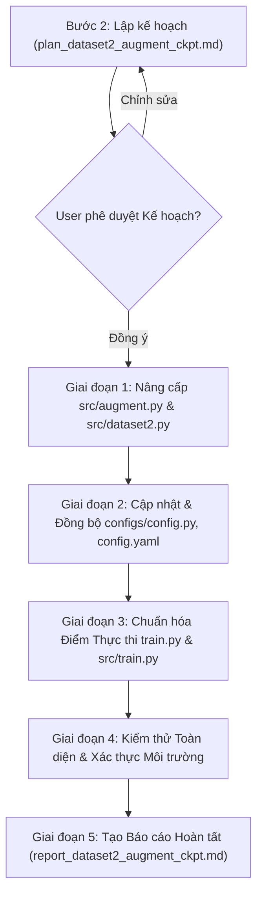

# KẾ HOẠCH TRIỂN KHAI: TÍCH HỢP TĂNG CƯỜNG DỮ LIỆU (src/augment.py & src/dataset2.py), CHUẨN HÓA QUY TRÌNH CHẠY VÀ XÁC THỰC LOAD CHECKPOINT NMSFreeDetector

> **Tài liệu:** `docs/plan/plan_dataset2_augment_ckpt.md`  
> **Kế thừa từ:** `docs/analsys/analsys_dataset2_augment_ckpt.md`  
> **Nhiệm vụ:**
> 1. Hoàn thiện hỗ trợ tăng cường dữ liệu giữa `src/augment.py` và `src/dataset2.py` (khắc phục lỗi crash, bảo toàn temporal consistency qua shared seed, bổ sung cấu hình bật/tắt).
> 2. Chuẩn hóa quy trình chạy trên môi trường máy chủ hiện tại (Ubuntu Linux, GPU NVIDIA Tesla V100-SXM3-32GB), sửa lỗi tệp thực thi chính `train.py`.
> 3. Đảm bảo cấu hình và code luôn nạp đúng, ổn định checkpoint `best.pt` của `NMSFreeDetector`.  
> **Tuân thủ quy trình:** Bước 2 - Lên kế hoạch thực hiện (Planning) theo `AGENTS.md`.

---

## 1. Mục tiêu Kế hoạch

1. **Khắc phục triệt để lỗi Augmentation**:
   - Đồng bộ giao diện (API) giữa `DetectionAugmenter` (`src/augment.py`) và `RawVideoBackboneNeckDataset` (`src/dataset2.py`).
   - Đảm bảo khi áp dụng tăng cường chuỗi video:
     - Giữ nguyên cấu trúc mảng numpy `[H, W, 3]` (không bị bọc trong tuple bboxes/labels).
     - Bảo toàn tính nhất quán thời gian (**Temporal Consistency**) bằng cách dùng chung 1 random seed cho toàn bộ frames trong cùng 1 video clip.
     - Không gây lỗi `ValueError: could not broadcast input array...` khi gọi `np.stack`.
2. **Cấu hình hóa Tăng cường Dữ liệu (Configurable Augmentation)**:
   - Bổ sung tham số `use_augmentation: bool = True` vào `configs/config.py` và `configs/config.yaml`.
   - Cho phép bật/tắt tính năng tăng cường dữ liệu linh hoạt mà không cần sửa code.
3. **Chuẩn hóa Điểm Thực thi Duy nhất (`train.py`)**:
   - Sửa lỗi crash `AttributeError: 'TrainConfig' object has no attribute 'train_h5'` của `train.py` bằng cách hợp nhất pipeline video thô trực tiếp (`src/train1.py`) vào `train.py` và `src/train.py`.
   - Chuẩn hóa lệnh chạy: Người dùng chỉ cần gõ `python train.py` để huấn luyện trên môi trường hiện tại.
4. **Tối ưu hóa Thực thi trên Phần cứng Hiện tại (Linux + Tesla V100)**:
   - Tối ưu DataLoader với `num_workers=2` (song song hóa I/O đọc video qua OpenCV và tính toán GPU).
   - Đảm bảo `amp=True`, `device="cuda"`, `chunk_size=16`, `batch_size=16`.
5. **Duy trì Xác thực Nạp Checkpoint NMSFreeDetector**:
   - Đảm bảo checkpoint `best.pt` tại đường dẫn tuyệt đối chuẩn được nạp chính xác, an toàn lazy initialization qua các workers.

---

## 2. Quy trình Thực hiện Từng bước (Step-by-Step Implementation Plan)

---

### Giai đoạn 1: Nâng cấp & Hoàn thiện Tăng cường Dữ liệu (`src/augment.py` & `src/dataset2.py`)

- **Nhiệm vụ 1.1: Bổ sung phương thức chuỗi chuẩn hóa trong `src/augment.py`:**
  - Thêm phương thức `apply_sequence(self, frames: List[np.ndarray], seed: Optional[int] = None) -> List[np.ndarray]` vào lớp `DetectionAugmenter`.
    - Phương thức này sẽ gọi nội bộ `augment_video(frames, seed=seed)`.
    - Tự động bóc tách chỉ lấy `aug_frames` (danh sách `np.ndarray`), loại bỏ `boxes` và `labels` không dùng trong bài toán phân loại video.
  - Bổ sung hàm factory tiện ích `get_video_augmenter(cfg: Optional[dict] = None) -> DetectionAugmenter`.
  - Đảm bảo console và path tương thích đa nền tảng.

- **Nhiệm vụ 1.2: Nâng cấp khối xử lý Augmentation trong `src/dataset2.py`:**
  - Cập nhật phương thức `RawVideoBackboneNeckDataset.__getitem__` (bước 3 - Temporal Augmentation):
    - Kiểm tra `hasattr(self.augmenter, "apply_sequence")` -> gọi `apply_sequence(frames_rgb, seed=aug_seed)`.
    - Fallback kiểm tra `hasattr(self.augmenter, "augment_video")` -> gọi `augment_video(...)` và bóc tách lấy `res[0]`.
    - Fallback cho callable thông thường: Nếu kết quả trả về là `tuple/list`, trích xuất `res[0]`.
    - Bảo đảm `frames_rgb` luôn là `List[np.ndarray]` với shape `[640, 640, 3]` trước khi đưa vào `extract_chunks`.
  - Cập nhật hàm `build_raw_video_dataloaders`:
    - Bổ sung tham số `use_augmentation: bool = True`.
    - Tự động khởi tạo `DetectionAugmenter` từ `src.augment` cho tập huấn luyện (`train_dataset`) khi `use_augmentation=True` và `augmenter is None`. Tập kiểm định (`val_dataset`) luôn giữ `augmenter=None`.

---

### Giai đoạn 2: Cập nhật & Đồng bộ Cấu hình (`configs/config.py` & `configs/config.yaml`)

- **Nhiệm vụ 2.1: Cập nhật `configs/config.py`:**
  - Bổ sung trường `use_augmentation: bool = True` vào dataclass `TrainConfig` (thuộc Group 1: Dataset Configuration).
  - Tối ưu tham số mặc định cho môi trường hiện tại:
    - `num_workers: int = 2` (hoặc `0` có kiểm soát fallback an toàn).
    - `pin_memory: bool = False`.
  - Cập nhật các hàm `load_yaml`, `load_json`, `to_dict` để tự động xử lý trường `use_augmentation`.

- **Nhiệm vụ 2.2: Cập nhật `configs/config.yaml`:**
  - Thêm trường `use_augmentation: true` vào nhóm `dataset:`.
  - Cập nhật `num_workers: 2` (tận dụng CPU đa luồng trên máy chủ Linux).
  - Giữ nguyên đường dẫn checkpoint `backbone_neck_checkpoint` trỏ tới file `best.pt` đã xác thực.

---

### Giai đoạn 3: Chuẩn hóa Điểm Thực thi Duy nhất (`train.py` & `src/train.py`)

- **Nhiệm vụ 3.1: Hợp nhất pipeline vào `src/train.py`:**
  - Thay thế nội dung cũ của `src/train.py` (vốn phụ thuộc `train_h5`) bằng pipeline hoàn chỉnh của `src/train1.py`.
  - Tích hợp cờ cấu hình `config.use_augmentation`: Truyền `DetectionAugmenter` vào `RawVideoBackboneNeckDataset` khi `config.use_augmentation == True`.
  - Đảm bảo `train_dataset` và `val_dataset` được khởi tạo đúng chuẩn, ghi log rõ ràng về trạng thái bật/tắt của data augmentation.
  - Tích hợp chuẩn hóa `matplotlib.use("Agg")` tránh mọi lỗi liên quan đến GUI headless.

- **Nhiệm vụ 3.2: Chuẩn hóa tệp thực thi `train.py`:**
  - Cập nhật `train.py` ở thư mục gốc để tái xuất (re-export) và thực thi hàm `main()` từ `src/train.py`.
  - Đồng bộ `train1.py` để giữ tính tương thích ngược (backward compatibility) trỏ cùng pipeline.

---

### Giai đoạn 4: Kiểm thử Toàn diện & Xác thực Môi trường (Comprehensive Verification)

- **Nhiệm vụ 4.1: Kiểm thử Unit Test cho Augmentation Pipeline:**
  - Kiểm tra `DetectionAugmenter.apply_sequence` với mảng khung hình kích thước `[640, 640, 3]`.
  - Kiểm tra tính xác định (deterministic) khi truyền cùng một seed.
  - Kiểm tra tính ngẫu nhiên khi không truyền seed.

- **Nhiệm vụ 4.2: Kiểm thử Tích hợp `RawVideoBackboneNeckDataset` + `Augmentation`:**
  - Nạp 1 mẫu video thực tế với `augmenter` bật:
    - Đảm bảo quá trình letterbox -> augment -> BackboneNeck extraction không xảy ra lỗi.
    - Đảm bảo shape đầu ra của `(p3, p4, p5)` chuẩn xác:
      `[T, 64, 80, 80]`, `[T, 128, 40, 40]`, `[T, 256, 20, 20]`.

- **Nhiệm vụ 4.3: Kiểm thử DataLoader Đa luồng (`num_workers=2`):**
  - Chạy `collate_raw_video_features` trên batch thật, xác nhận padding thời gian $T_{max}$ hoạt động trơn tru.

- **Nhiệm vụ 4.4: Kiểm thử Dry-run toàn bộ Pipeline qua `python train.py`:**
  - Chạy thử nghiệm với cờ `dry_run = True` (hoặc 1 epoch nhanh) thông qua lệnh chuẩn: `python train.py`.
  - Xác nhận:
    - Log khởi tạo hiển thị đúng cấu hình thiết bị (Tesla V100), checkpoint `best.pt`, và trạng thái `Augmentation: ENABLED`.
    - Forward pass, backward pass, tính loss, cập nhật optimizer hoạt động 100% không lỗi.

---

### Giai đoạn 5: Tổng hợp Báo cáo Hoàn tất (`docs/report/report_dataset2_augment_ckpt.md`)

- Tạo báo cáo tổng kết chi tiết tại `docs/report/report_dataset2_augment_ckpt.md` và tạo symlink tại thư mục gốc `report_dataset2_augment_ckpt.md`.
- Ghi nhận chi tiết:
  1. Các cải tiến mã nguồn trong `src/augment.py`, `src/dataset2.py`, `configs/config.py`, `configs/config.yaml`, và `train.py`.
  2. Bằng chứng kết quả chạy kiểm thử (Test outputs & Logs).
  3. Hướng dẫn vận hành chuẩn cho người dùng.

---

## 3. Tiêu chuẩn Đánh giá Hoàn thành (Checklist)

| Tiêu chí | Điều kiện Đạt |
| :--- | :--- |
| **Augmentation tương thích 100%** | `DetectionAugmenter.apply_sequence` hoạt động trơn tru, không sinh lỗi `ValueError` hay lệch chiều tensor. |
| **Bảo toàn Temporal Consistency** | Mọi khung hình trong 1 video clip đều được áp dụng chung 1 seed biến đổi thời gian. |
| **Cấu hình bật/tắt linh hoạt** | Có thể bật/tắt augmentation thông qua `use_augmentation` trong YAML / Python dataclass. |
| **Chuẩn hóa lệnh chạy `python train.py`** | Chạy `python train.py` không còn lỗi thiếu `train_h5`, pipeline video thô khởi động ngay lập tức. |
| **Đa tiến trình nạp dữ liệu ổn định** | DataLoader chạy mượt mà với `num_workers=2` trên Linux Tesla V100. |
| **Nạp checkpoint NMSFreeDetector chuẩn** | Trọng số `ema` từ file `best.pt` được nạp đúng vào BackboneNeck, đóng băng gradient. |

---

## 4. Đề xuất Bước tiếp theo

Theo quy trình tại Mục 5 của `AGENTS.md`:
> *Agent dừng tại Bước 2 và gửi kế hoạch chi tiết tới Người dùng. Sau khi Người dùng duyệt kế hoạch này, Agent sẽ tiến hành Bước 3 (Thực hiện theo kế hoạch và tạo báo cáo `report_dataset2_augment_ckpt.md`).*
