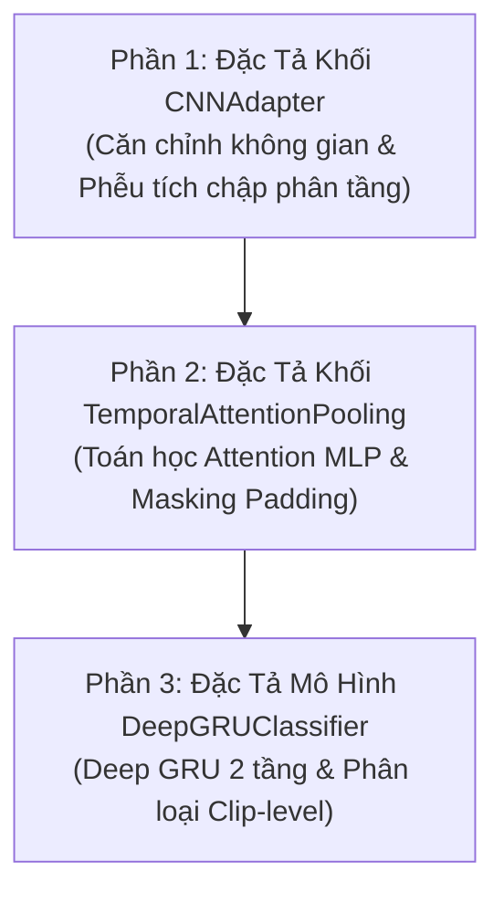

# KẾ HOẠCH TRIỂN KHAI: VIẾT TÀI LIỆU ĐẶC TẢ KỸ THUẬT MÔ HÌNH DEEPGRUCLASSIFIER VÀ CÁC KHỐI LIÊN QUAN

**Mã tài liệu:** `plan_deepgru_spec.md`  
**Dự án:** Hệ Thống Giám Sát và Cảnh Báo Tài Xế Buồn Ngủ (Driver Guardian)  
**Tệp mục tiêu:** [`src/models.py`](file:///D:/Project/DATN/driver-guardian/ai/LSTM/src/models.py)  
**Căn cứ phân tích:** [`docs/analsys/analsys_deepgru_spec.md`](file:///D:/Project/DATN/driver-guardian/ai/LSTM/docs/analsys/analsys_deepgru_spec.md)  
**Quy chuẩn áp dụng:** [`AGENTS.md`](file:///D:/Project/DATN/driver-guardian/ai/LSTM/AGENTS.md) — Bước 2: Lên kế hoạch thực hiện (Cập nhật chuẩn hóa theo chỉ đạo người dùng)  
**Ngày cập nhật:** 03/10/2026  

---

## 1. MỤC TIÊU VÀ ĐỊNH HƯỚNG TỐI GIẢN

Theo chỉ đạo của người dùng:
- **Tập trung vào 3 khối kiến trúc cốt lõi:** Chỉ đặc tả đúng 3 khối kiến trúc trong [`src/models.py`](file:///D:/Project/DATN/driver-guardian/ai/LSTM/src/models.py) theo luồng phân loại Clip-level (Phương án A chuẩn).
- **Ràng buộc nội dung:** Mô tả trực tiếp bản chất toán học, hình học và cơ chế hoạt động của từng khối; tập trung vào kiến trúc tích chập phân tầng và cơ chế gom tụ có trọng số.
- **Loại bỏ các thành phần ngoài lề:** Không đưa vào các nội dung về chunking VRAM, đa dạng hóa giao diện, XAI/weights timeline, chế độ sequence/streaming, factory methods, API reference mở rộng, thống kê FLOPs và xuất khẩu ONNX.

---

## 2. BỐ CỤC CHI TIẾT TÀI LIỆU ĐẶC TẢ KỸ THUẬT

Tài liệu đặc tả sẽ gồm đúng 3 phần tương ứng với 3 khối kiến trúc trong [`src/models.py`](file:///D:/Project/DATN/driver-guardian/ai/LSTM/src/models.py):

---

### PHẦN 1: ĐẶC TẢ CHI TIẾT KHỐI `CNNAdapter` (Spatial Feature Adapter)
1. **Mục tiêu & Bản chất kiến trúc:**
   - Nhiệm vụ chuyển đổi và kết hợp 3 tầng đặc trưng đa tỉ lệ từ Backbone-PAFPN:
     - $p_3$: $[B, T, 64, 80, 80]$ (độ phân giải cao, biên, texture cục bộ).
     - $p_4$: $[B, T, 128, 40, 40]$ (đặc trưng bộ phận: mắt, mũi, miệng).
     - $p_5$: $[B, T, 256, 20, 20]$ (đặc trưng ngữ nghĩa toàn thể khuôn mặt).
   - Cơ chế trích xuất và bảo toàn cấu trúc không gian qua các tầng tích chập có thể học được.
2. **Căn chỉnh không gian (`_align_spatial_features`):**
   - $p_3$ ($80 \times 80$) qua `MaxPool2d(kernel_size=2, stride=2)` $\to 40 \times 40$.
   - $p_4$ ($40 \times 40$) giữ nguyên kích thước.
   - $p_5$ ($20 \times 20$) qua `Upsample(scale_factor=2, mode="bilinear", align_corners=False)` $\to 40 \times 40$.
   - Ghép nối kênh (Concatenation): $64 + 128 + 256 = 448$ kênh tại kích thước không gian $40 \times 40$.
3. **Phễu tích chập phân tầng 4 giai đoạn (`hierarchical_conv_pyramid`):**
   - **Stage 1:** `Conv2d(448, 512, k=3, s=2, p=1)` $\to$ `BatchNorm2d(512)` $\to$ `SiLU` $\to [N, 512, 20, 20]$ (Học tương quan cục bộ mí mắt, vành môi).
   - **Stage 2:** `Conv2d(512, 512, k=3, s=2, p=1)` $\to$ `BatchNorm2d(512)` $\to$ `SiLU` $\to [N, 512, 10, 10]$ (Học tương quan vùng: khoảng cách hai mắt, tam giác mắt - mũi - miệng).
   - **Stage 3:** `Conv2d(512, 512, k=3, s=2, p=1)` $\to$ `BatchNorm2d(512)` $\to$ `SiLU` $\to [N, 512, 5, 5]$ (Học tương quan toàn thể khuôn mặt và góc nghiêng đầu).
   - **Stage 4:** `Conv2d(512, 256, k=5, s=1, p=0)` $\to$ `BatchNorm2d(256)` $\to$ `SiLU` $\to [N, 256, 1, 1]$ (Tổng hợp biểu diễn toàn thể bằng ma trận trọng số $5 \times 5$ học được).
   - **Đầu ra vector:** Squeeze $\to [N, 256]$, qua `Dropout(0.25)` $\to$ Khôi phục chiều thời gian $[B, T, 256]$.

---

### PHẦN 2: ĐẶC TẢ CHI TIẾT KHỐI `TemporalAttentionPooling`
1. **Cơ sở toán học Additive Attention (Bahdanau-style Attention Pooling):**
   - Điểm số chú ý thô:
     $$u_{i, t} = W_2 \tanh(W_1 h_{i, t} + b_1) + b_2$$
     với $W_1 \in \mathbb{R}^{96 \times 192}$, $b_1 \in \mathbb{R}^{96}$, $W_2 \in \mathbb{R}^{1 \times 96}$, $b_2 \in \mathbb{R}^{1}$.
   - Chuẩn hóa xác suất Softmax:
     $$\alpha_{i, t} = \frac{\exp(u_{i, t})}{\sum_{k=1}^T \exp(u_{i, k})}$$
   - Gom tụ đặc trưng đại diện clip:
     $$c_i = \sum_{t=1}^T \alpha_{i, t} h_{i, t} = \text{bmm}(\boldsymbol{\alpha}_i, H_i) \in \mathbb{R}^{192}$$
2. **Cơ chế Masking triệt tiêu Zero-Padding:**
   - Xây dựng boolean mask dựa trên `seq_lens`: $\text{mask}_{i, t} = (t < L_i)$.
   - Gán giá trị âm cực hạn tại các vị trí padding ($t \ge L_i$):
     $$\text{fill\_value} = \begin{cases} -10^4 & \text{nếu dtype} = \text{torch.float16} \\ -10^9 & \text{nếu dtype} = \text{torch.float32} \end{cases}$$
   - Khi đó $\exp(\text{fill\_value}) \approx 0 \implies \alpha_{i, t} = 0.0$ tuyệt đối với mọi $t \ge L_i$.
   - Chứng minh đạo hàm ngược: $\frac{\partial \mathcal{L}}{\partial h_{i, t}} = \mathbf{0.0} \implies$ Triệt tiêu $100\%$ gradient rác từ các khung hình padding.
3. **An toàn số học (Numerical Stability in FP16 / FP32):**
   - Phân tích ngưỡng an toàn tránh tràn số Underflow/Overflow trong môi trường Mixed Precision (AMP / FP16) nhờ ngưỡng $-10^4$ nằm trong dải $[-65504, 65504]$ của half-precision.

---

### PHẦN 3: ĐẶC TẢ CHI TIẾT KHỐI `DeepGRUClassifier`
1. **Kiến trúc chuỗi thời gian Stacked Deep GRU:**
   - Số lớp xếp chồng: 2 lớp `nn.GRU` (`num_layers=2`).
   - Kích thước đầu vào: `input_size=256` (nhận từ `CNNAdapter`).
   - Kích thước không gian ẩn: `hidden_size=192`.
   - Cơ chế cổng GRU (Reset gate $r_t$, Update gate $z_t$, New memory $\tilde{h}_t$, Hidden state $h_t$).
   - Regularization: `dropout=0.35` giữa lớp 1 và lớp 2 chống hiện tượng quá khớp (overfitting).
2. **Luồng phân loại Clip-level hoàn chỉnh (Phương án A chuẩn):**
   - **Bước 1 (Không gian):** Đầu vào chuỗi khung hình đặc trưng đa tỉ lệ $\xrightarrow{\text{CNNAdapter}} X \in \mathbb{R}^{B \times T \times 256}$.
   - **Bước 2 (Thời gian):** $X \xrightarrow{\text{2-layer GRU}} H \in \mathbb{R}^{B \times T \times 192}$.
   - **Bước 3 (Gom tụ chú ý):** $(H, \text{seq\_lens}) \xrightarrow{\text{TemporalAttentionPooling}} c \in \mathbb{R}^{B \times 192}$.
   - **Bước 4 (Phân loại):** $c \xrightarrow{\text{Dropout}(0.35) \to \text{Linear}(192, 2)} \text{logits} \in \mathbb{R}^{B \times 2}$ (Class 0: Tỉnh táo, Class 1: Buồn ngủ).

---

## 3. KẾ HOẠCH HÀNH ĐỘNG BƯỚC 3 (ACTION STEPS)

1. **Bước 3.1: Biên soạn tài liệu đặc tả kỹ thuật:**
   - Tạo file `docs/spec_deepgru_classifier.md` với đúng 3 phần trên, ngôn từ chặt chẽ, chính xác về toán học và mã nguồn.
2. **Bước 3.2: Lập kịch bản kiểm thử độc lập:**
   - Thực thi script `scratch/verify_spec_models.py` kiểm tra forward pass của cả 3 khối và tính triệt tiêu gradient của Masking.
3. **Bước 3.3: Tổng kết báo cáo:**
   - Tạo file `docs/report/report_deepgru_spec.md` theo quy định Bước 3 của [`AGENTS.md`](file:///D:/Project/DATN/driver-guardian/ai/LSTM/AGENTS.md).
