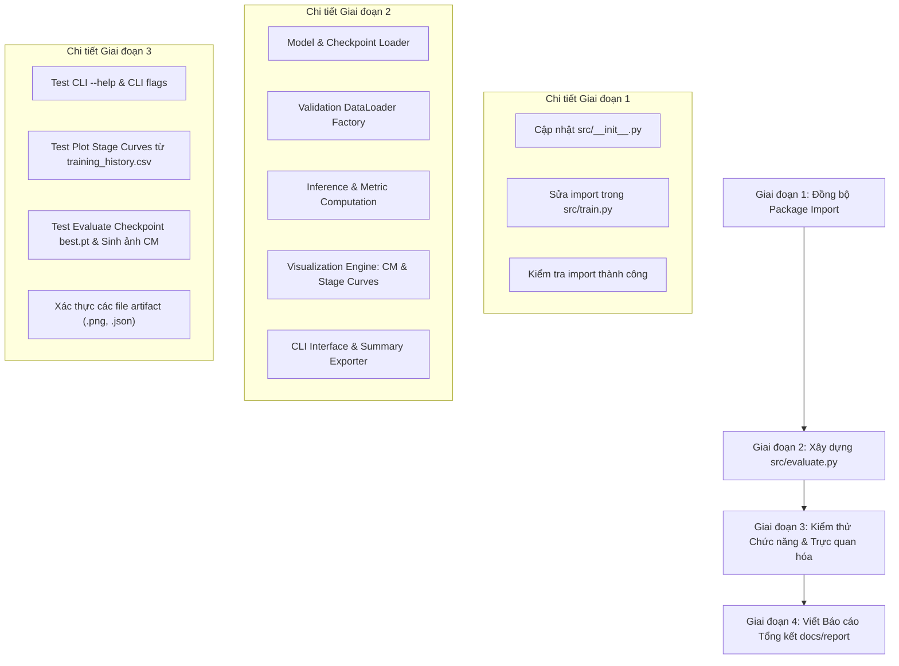

# KẾ HOẠCH TRIỂN KHAI: XÂY DỰNG MODULE ĐÁNH GIÁ VÀ TRỰC QUAN HÓA (SRC/EVALUATE.PY)

- **Mã kế hoạch**: `PLAN_EVAL_CONVGRU`
- **Tệp kế hoạch**: `docs/plan/plan_eval_convgru.md`
- **Dựa trên tài liệu phân tích**: `docs/analsys/analsys_eval_convgru.md`
- **Mục tiêu**: Lập lộ trình từng bước để xây dựng hoàn chỉnh `src/evaluate.py`, khắc phục các lỗi import tồn đọng và kiểm thử trực quan hóa các biểu đồ đánh giá (Ma trận nhầm lẫn, biểu đồ so sánh Loss, Acc, Recall qua mỗi giai đoạn).
- **Trạng thái**: Đang chờ người dùng phê duyệt (Bước 2 theo chuẩn AGENTS.md).

---

## 1. MỤC TIÊU VÀ PHẠM VI CÔNG VIỆC

1. Xây dựng module `src/evaluate.py` đạt chuẩn clean code, modularity, type hints, docstrings chuẩn Google/NumPy theo nguyên tắc `AGENTS.md`.
2. Hỗ trợ đầy đủ các chức năng:
   - Nạp checkpoint của mô hình `ConvGRUClassifier` (`best.pt`, `last.pt`, hoặc `epoch_*.pt`).
   - Khởi tạo DataLoader tập kiểm định (Validation DataLoader) và trích xuất đặc trưng đa tỷ lệ `(p3, p4, p5)` an toàn qua `ChunkedBackboneNeckExtractor`.
   - Tính toán đầy đủ hệ thống chỉ số: Loss, Accuracy, Macro/Per-class Recall, Macro/Per-class Precision, F1-Score, Inference Latency.
   - Vẽ ma trận nhầm lẫn (Confusion Matrix) dạng Heatmap trực quan với nhãn lớp (`Alert` vs `Drowsy`), số lượng mẫu và tỷ lệ phần trăm chuẩn hóa.
   - Vẽ biểu đồ so sánh Loss, Accuracy, Recall, F1 qua mỗi giai đoạn (từ `training_history.csv` và/hoặc quét chuỗi checkpoint epoch).
   - Vẽ đồ thị ROC-AUC và Precision-Recall Curve.
   - Xuất báo cáo tóm tắt ra file JSON và hiển thị định dạng bảng đẹp mắt trên terminal.
3. Đồng bộ hóa các lỗi import trong `src/__init__.py` và `src/train.py` để toàn bộ package hoạt động ổn định.

---

## 2. KẾ HOẠCH THỰC HIỆN CHI TIẾT (WORKFLOW PHÂN KỲ)

---

### GIAI ĐOẠN 1: CHUẨN HÓA MÔI TRƯỜNG & ĐỒNG BỘ IMPORT PACKAGE `SRC`

- **Nhiệm vụ 1.1**: Cập nhật tệp `src/__init__.py`:
  - Khai báo export đúng các module hiện hành:
    - Mô hình: `ConvGRUClassifier`, `SpatialReductionNeck`, `SpatialAttentionPooling`, `TemporalAttentionPooling`.
    - Dữ liệu: `ChunkedBackboneNeckExtractor`, `RawVideoFramesDataset`, `build_raw_video_dataloaders`, `collate_video_frames`.
    - Tiền xử lý ảnh: Các bộ lọc trong `img_preprocess.py` và tăng cường dữ liệu `augment.py`.
    - Huấn luyện: `Trainer`, `EarlyStopping`, `calculate_metrics`.
  - Loại bỏ các tham chiếu đến các tệp không còn tồn tại (`models1`, `dataset1`, `dataset2`, `CNNAdapter`).
- **Nhiệm vụ 1.2**: Chuẩn hóa import trong `src/train.py`:
  - Đổi `from src.models1 import ConvGRUClassifier` thành `from src.models import ConvGRUClassifier`.
  - Đổi `from src.dataset2 import ...` thành `from src.dataset import ...`.
- **Nhiệm vụ 1.3**: Xác thực khả năng import không lỗi:
  - Chạy kiểm tra: `python -c "import src; from src.models import ConvGRUClassifier; from src.dataset import build_raw_video_dataloaders; print('IMPORT OK')"`

---

### GIAI ĐOẠN 2: THIẾT KẾ VÀ XÂY DỰNG `src/evaluate.py`

- **Nhiệm vụ 2.1**: Thiết kế kiến trúc mã nguồn mô-đun:
  - **`seed_everything(seed: int = 42)`**: Đảm bảo tính nhất quán và tái lập kết quả.
  - **`resolve_checkpoint_path(ckpt_path: Union[str, Path], default_dir: Path) -> Path`**: Xử lý đường dẫn linh hoạt (hỗ trợ bí danh `best`, `last`, hoặc đường dẫn tuyệt đối/tương đối).
  - **`load_model_from_checkpoint(checkpoint_path: Path, device: torch.device, config: Optional[TrainConfig] = None) -> Tuple[ConvGRUClassifier, Dict[str, Any]]`**: Nạp an toàn cấu trúc `ConvGRUClassifier` và weights từ checkpoint.
  - **`build_val_dataloader(config: TrainConfig, batch_size: Optional[int] = None, num_workers: int = 0) -> DataLoader`**: Khởi tạo riêng biệt tập validation từ cấu hình video thô hoặc manifest mà không tốn tài nguyên khởi tạo tập huấn luyện.
  - **`evaluate_dataloader(model: nn.Module, extractor: nn.Module, val_loader: DataLoader, criterion: nn.Module, device: torch.device, amp: bool = True) -> Dict[str, Any]`**: Chạy vòng lặp kiểm định, đo latency suy luận, thu thập logits, tính toán nhãn dự đoán và xác suất.
  - **`compute_metrics(targets: np.ndarray, preds: np.ndarray, probs: Optional[np.ndarray] = None) -> Dict[str, Any]`**: Tính toán Accuracy, Macro/Per-class Precision, Macro/Per-class Recall, Macro/Per-class F1, Confusion Matrix, AUC-ROC.

- **Nhiệm vụ 2.2**: Xây dựng Engine trực quan hóa đồ thị (`VisualizerEngine`):
  - **`plot_confusion_matrix(cm: np.ndarray, class_names: List[str], save_path: Path, title: str = "Confusion Matrix - ConvGRUClassifier")`**:
    - Vẽ Heatmap trực quan với màu sắc chuyên nghiệp (Seaborn / Matplotlib).
    - Hiển thị cả 2 thông số trong mỗi ô: Số lượng mẫu (Counts) và Tỷ lệ theo hàng (% Recall).
    - Thêm hộp chú thích các chỉ số chính: Overall Accuracy, Drowsy Recall, Alert Recall, Macro F1.
  - **`plot_stage_metrics(history_csv: Union[str, Path], save_path: Path, best_epoch: Optional[int] = None)`**:
    - Đọc `training_history.csv` chứa các cột `epoch, train_loss, train_acc, train_recall, train_f1, val_loss, val_acc, val_recall, val_f1`.
    - Vẽ lưới biểu đồ 2x2:
      + Ô 1: **Loss Comparison** (Train Loss vs Val Loss qua các giai đoạn/epochs).
      + Ô 2: **Accuracy Comparison** (Train Acc vs Val Acc qua các giai đoạn/epochs).
      + Ô 3: **Recall Comparison** (Train Recall vs Val Recall qua các giai đoạn/epochs - điểm nhấn cốt lõi).
      + Ô 4: **F1-Score & Learning Rate** (Train F1 vs Val F1 và đường suy giảm Learning Rate).
    - Đánh dấu rõ vị trí `Best Epoch` bằng đường gióng dọc màu đỏ đứt nét và ký hiệu nổi bật.
  - **`plot_roc_pr_curves(targets: np.ndarray, probs: np.ndarray, save_path: Path)`**:
    - Vẽ ROC Curve (kèm giá trị AUC) và Precision-Recall Curve (kèm Average Precision).

- **Nhiệm vụ 2.3**: Xây dựng Nơi Tập Trung Các Hằng Số & Tham Số Cấu Hình (`EvalConfig`):
  - **Không sử dụng giao diện dòng lệnh CLI phức tạp**, thay vào đó tập trung toàn bộ tham số vào một nơi cấu hình duy nhất, rõ ràng, dễ dàng chỉnh sửa trực tiếp:
    + Định nghĩa lớp cấu hình `@dataclass class EvalConfig` (hoặc khối hằng số cấu hình tập trung) đặt tại phần đầu file hoặc liên kết với `configs/`:
      * `checkpoint_path: str = "checkpoints/experiments/deepgru_raw_nmsfree/best.pt"` (đường dẫn checkpoint mô hình)
      * `config_yaml_path: str = "configs/config.yaml"` (đường dẫn file cấu hình hệ thống)
      * `history_csv_path: str = "logs/training_history.csv"` (đường dẫn file lịch sử huấn luyện qua các epoch)
      * `output_dir: str = "logs/evaluation"` (thư mục lưu trữ biểu đồ và báo cáo đánh giá)
      * `device: str = "cuda" if torch.cuda.is_available() else "cpu"` (thiết bị tính toán)
      * `batch_size: int = 16` (kích thước batch khi chạy validation)
      * `num_workers: int = 0` (số tiến trình worker nạp dữ liệu)
      * `chunk_size: int = 32` (kích thước chunk khung hình qua Backbone tránh tràn VRAM)
      * `plot_confusion_matrix: bool = True` (bật/tắt vẽ ma trận nhầm lẫn)
      * `plot_stage_metrics: bool = True` (bật/tắt vẽ biểu đồ so sánh Loss, Acc, Recall qua mỗi giai đoạn)
      * `plot_roc_pr: bool = True` (bật/tắt vẽ đồ thị ROC-AUC & PR Curve)
      * `save_json_summary: bool = True` (bật/tắt xuất báo cáo JSON)
      * `eval_all_checkpoints: bool = False` (tùy chọn duyệt đánh giá toàn bộ checkpoint epoch)
      * `class_names: Tuple[str, str] = ("Alert", "Drowsy")` (tên hiển thị các lớp phân loại)
    + Người dùng chỉ cần chỉnh sửa trực tiếp các tham số tại khối `EvalConfig` này rồi chạy đơn giản bằng `python src/evaluate.py`.
    + Đồng thời hỗ trợ gọi hàm `evaluate(config: Optional[EvalConfig] = None)` từ Notebook hoặc script ngoài mà không bị phụ thuộc vào CLI.

---

### GIAI ĐOẠN 3: KIỂM THỬ THỰC TẾ & XÁC THỰC KẾT QUẢ

- **Nhiệm vụ 3.1**: Kiểm thử cú pháp và cấu hình tập trung:
  - Chạy `python -c "from src.evaluate import EvalConfig; print(EvalConfig())"`.
- **Nhiệm vụ 3.2**: Kiểm thử chế độ vẽ biểu đồ tiến trình giai đoạn:
  - Chạy `python src/evaluate.py` với cấu hình mặc định đọc `training_history.csv` và checkpoint `best.pt`.
  - Xác nhận đã sinh file `logs/evaluation/stage_metrics_comparison.png`.
- **Nhiệm vụ 3.3**: Kiểm thử nạp checkpoint `best.pt` của `ConvGRUClassifier`:
  - Thực hiện nạp checkpoint thực tế, forward kiểm định trên tập validation.
  - Xác nhận đã sinh file `logs/evaluation/confusion_matrix.png`, `logs/evaluation/roc_pr_curves.png`, `logs/evaluation/evaluation_summary.json`.
- **Nhiệm vụ 3.4**: Đảm bảo tiêu chuẩn chất lượng:
  - Không rò rỉ bộ nhớ GPU (`torch.cuda.empty_cache()`, `torch.no_grad()`).
  - Hỗ trợ encoding UTF-8 tiếng Việt không lỗi font trên console và ảnh matplotlib.

---

### GIAI ĐOẠN 4: LẬP BÁO CÁO KẾT QUẢ (`docs/report/report_eval_convgru.md`)

- Tổng kết toàn bộ kết quả thực hiện:
  - Danh sách các tệp đã tạo và chỉnh sửa (`src/evaluate.py`, `src/__init__.py`, `src/train.py`).
  - Kết quả kiểm thử các biểu đồ (Confusion Matrix, biểu đồ so sánh Loss, Acc, Recall qua mỗi giai đoạn).
  - Hướng dẫn chi tiết cách chạy lệnh cho các kịch bản khác nhau.

---

## 3. CHECKLIST KIỂM SOÁT TIÊU CHÍ CHẤT LƯỢNG

- [ ] Đường dẫn tương thích đa nền tảng sử dụng `pathlib.Path`.
- [ ] Tuân thủ nguyên tắc Single Responsibility Principle, đầy đủ Type Hints và Docstrings.
- [ ] Tái lập được kết quả với `seed_everything`.
- [ ] Xử lý ngoại lệ đầy đủ khi thiếu file checkpoint, dataset hoặc history CSV.
- [ ] Hình ảnh xuất ra có độ phân giải cao (DPI 300), bố cục rõ ràng, khoa học.

---

## 4. XÁC NHẬN TỪ NGƯỜI DÙNG

Kế hoạch trên đã bao quát toàn bộ yêu cầu của bạn. Xin mời bạn xem xét kế hoạch. Nếu bạn đồng ý, hãy phản hồi để tôi bắt tay vào **Bước 3: Thực hiện kế hoạch**.
