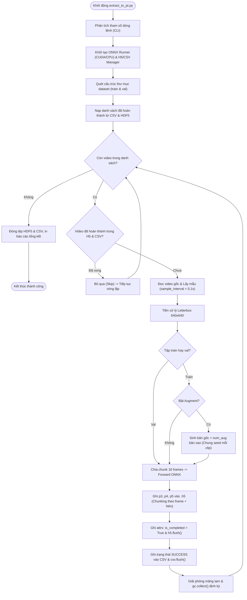

# KẾ HOẠCH TRIỂN KHAI TRÍCH XUẤT ĐẶC TRƯNG DATASET SANG HDF5 (.H5)
**Mã tài liệu:** `plan_extract_to_h5.md`  
**Dự án:** Hệ Thống Nhận Diện Tài Xế Buồn Ngủ (Driver Guardian - Deep LSTM / GRU)  
**Tệp thực thi mục tiêu:** `extract_to_pt.py`  
**Căn cứ phân tích:** [`docs/analsys_extract_to_h5.md`](file:///D:/Project/DATN/driver-guardian/ai/LSTM/docs/analsys_extract_to_h5.md)  
**Quy chuẩn áp dụng:** [`AGENTS.md`](file:///D:/Project/DATN/driver-guardian/ai/LSTM/AGENTS.md) (Bước 2: Lên kế hoạch thực hiện)  
**Ngày lập kế hoạch:** 01/10/2026  

---

## 1. MỤC TIÊU & NGUYÊN TẮC THỰC HIỆN

### 1.1. Mục tiêu cốt lõi
Xây dựng công cụ độc lập `extract_to_pt.py` để trích xuất toàn diện đặc trưng không gian từ tập dữ liệu video chuẩn sang tệp HDF5 (`.h5`) có nén, phục vụ huấn luyện các mô hình chuỗi thời gian (Spatial-Temporal Attention, Deep LSTM/GRU, ConvLSTM).

Các yêu cầu kỹ thuật then chốt:
1. **Định dạng Dataset:** Hỗ trợ cấu trúc thư mục phân tầng theo [`docs/struct_dataset.md`](file:///D:/Project/DATN/driver-guardian/ai/LSTM/docs/struct_dataset.md) (`train/`, `val/`, chứa các thư mục nhãn `0_alert/`, `1_drowsy/`).
2. **Không dùng Spatial Pooling:** Lưu nguyên bản 3 tensor đặc trưng không gian đa tỉ lệ:
   - $P_3 \in \mathbb{R}^{T \times 64 \times 80 \times 80}$ (Độ phân giải $80\times 80$, 64 kênh)
   - $P_4 \in \mathbb{R}^{T \times 128 \times 40 \times 40}$ (Độ phân giải $40\times 40$, 128 kênh)
   - $P_5 \in \mathbb{R}^{T \times 256 \times 20 \times 20}$ (Độ phân giải $20\times 20$, 256 kênh)
3. **Lưu trữ ghi lũy tiến (Appendable HDF5):** Ghi trực tiếp vào 1 tệp `.h5` duy nhất qua `h5py` với chế độ append (`"a"`).
4. **Tối ưu Chunking & Nén:** Áp dụng chunking theo từng frame (`chunks=(1, C, H, W)`) và thuật toán nén `lzf` (hoặc `gzip`), định dạng mặc định `float16` để tối ưu dung lượng và tốc độ nạp dữ liệu.
5. **Tùy biến tốc độ lấy mẫu:** Cho phép tùy chỉnh khoảng thời gian lấy mẫu `--sample_interval` (mặc định: `0.1` giây $\approx$ 10 FPS).
6. **Tăng cường dữ liệu:** Tích hợp `DetectionAugmenter` từ [`src/augment.py`](file:///D:/Project/DATN/driver-guardian/ai/LSTM/src/augment.py) với tính nhất quán thời gian (chung 1 random seed cho toàn bộ frames trong 1 video), chỉ áp dụng cho tập `train`.
7. **Cơ chế phục hồi (Resume) & Truy vết (Tracking):** Tự động phát hiện và bỏ qua các video đã hoàn thành thành công khi chạy lại; tự động ghi nhận nhật ký chi tiết vào tệp CSV truy vết thời gian thực.
8. **Hiển thị tiến độ trực quan qua `tqdm`:** Tích hợp thanh tiến trình đa tầng thời gian thực (Multi-level & Dynamic `tqdm`), hiển thị rõ ràng số video đã xử lý, số video bỏ qua (Skip do Resume), số lượng frame $T$ của clip hiện tại, tốc độ trích xuất (videos/s, it/s), mức tiêu thụ bộ nhớ GPU (VRAM) và thời gian ước tính còn lại (ETA).

---

## 2. THIẾT KẾ CẤU TRÚC MÃ NGUỒN CỦA `extract_to_pt.py`

Tệp `extract_to_pt.py` được thiết kế theo nguyên tắc Single Responsibility & Modular Components:

```text
extract_to_pt.py
│
├── 1. Imports, OS Environment & Encoding Setup
│
├── 2. Data Structures & Metadata Models
│   └── VideoClipItem (dataclass: path, split, label, label_name, video_id, source)
│
├── 3. Video Processing & Sampling Engine
│   ├── letterbox(image, new_size=640) -> np.ndarray
│   └── VideoSampler.sample_frames(video_path, sample_interval) -> (List[np.ndarray], float, float)
│
├── 4. ONNX Inference Engine (Streaming Mini-Chunk)
│   └── ONNXFeatureExtractor:
│       ├── __init__(model_path, device_id)
│       └── extract_chunks(frames_rgb, chunk_size, use_fp16) -> (np.ndarray, np.ndarray, np.ndarray)
│
├── 5. Augmentation Pipeline Adapter
│   └── VideoAugmentationHandler:
│       └── generate_variants(frames_rgb, num_aug, include_original, base_seed)
│
├── 6. HDF5 Storage & Persistence Manager
│   └── HDF5StorageManager:
│       ├── __init__(h5_path, compression, fp16)
│       ├── is_video_completed(split, label_name, video_id) -> bool
│       ├── save_video_features(...) -> bool
│       ├── cleanup_partial_group(group_path)
│       └── close()
│
├── 7. Traceability Manifest Manager (CSV Logger)
│   └── ManifestCSVTracker:
│       ├── __init__(csv_path)
│       ├── get_completed_video_ids() -> Set[str]
│       └── log_record(record_dict)
│
├── 8. Dataset Scanner & Coordinator
│   └── scan_dataset(data_dir, video_exts) -> (List[VideoClipItem], List[VideoClipItem])
│
└── 9. Main Controller & CLI Interface
    └── main() (Argument parsing, progress tracking, gc management, signal handling)
```

---

## 3. CHI TIẾT CÁC MODULE CHỨC NĂNG

### 3.1. Tiền xử lý & Lấy mẫu khung hình (`VideoSampler`)
- **Nguyên lý lấy mẫu:**
  - Video gốc có tốc độ khung hình $FPS_{\text{orig}}$.
  - Với chu kỳ lấy mẫu $\Delta t = \text{sample\_interval}$ (mặc định $0.1s$):
    $$\text{step} = \max(1, \text{round}(FPS_{\text{orig}} \times \Delta t))$$
  - Duyệt tuần tự qua các frame bằng `cv2.VideoCapture`. Chỉ giữ lại các frame tại vị trí chỉ số bội số của $\text{step}$.
  - Mỗi khung hình được đưa qua hàm `letterbox` giữ nguyên tỉ lệ gốc, resize và padding về kích thước chuẩn $(640, 640)$ với màu xám chuẩn YOLO `(114, 114, 114)`.
  - Chuyển không gian màu từ BGR sang RGB.

### 3.2. Động cơ suy luận ONNX (`ONNXFeatureExtractor`)
- **Khởi tạo:**
  - Nạp `checkpoints/backbone_neck.onnx` qua `onnxruntime.InferenceSession`.
  - Ưu tiên `CUDAExecutionProvider` với device index được chỉ định; tự động fallback `CPUExecutionProvider` nếu CUDA không khả dụng.
  - Tự động lấy tên node đầu vào (`images`) và 3 node đầu ra (`p3`, `p4`, `p5`).
- **Streaming Mini-Chunk Forwarding:**
  - Nếu video có $T$ frames (ví dụ $T=150$), việc forward toàn bộ cùng lúc có thể gây tràn VRAM GPU.
  - Chia $T$ frames thành các mini-batches kích thước `chunk_size` (mặc định $16$ frames):
    - Chuẩn hóa: $[B, 3, 640, 640]$, dtype `float32`, miền giá trị $[0.0, 1.0]$.
    - Chạy suy luận: `session.run(['p3', 'p4', 'p5'], {'images': chunk_inputs})`.
    - Kết quả 3 tầng được chuyển đổi ngay sang `np.float16` trên host RAM để giải phóng VRAM tức thì.
  - Nối (concatenate) các chunk dọc theo trục thời gian (axis 0) để tạo thành 3 mảng numpy:
    - $P_3: [T, 64, 80, 80]$
    - $P_4: [T, 128, 40, 40]$
    - $P_5: [T, 256, 20, 20]$

### 3.3. Tích hợp Tăng cường Dữ liệu (`VideoAugmentationHandler`)
- Khởi tạo `DetectionAugmenter(config)` từ [`src/augment.py`](file:///D:/Project/DATN/driver-guardian/ai/LSTM/src/augment.py).
- **Luồng xử lý cho tập `train`:**
  - Nếu `--include_original=True`: Bản gốc được trích xuất với mã hậu tố `_orig`.
  - Tạo `num_aug` bản sao tăng cường cho mỗi video. Mỗi bản sao được cấp một `variant_seed = base_seed + hash(video_id) + aug_idx`.
  - Áp dụng `augmenter.augment_video(frames_rgb, seed=variant_seed)`: Đảm bảo toàn bộ các khung hình trong cùng 1 video biến đổi đồng nhất về góc xoay, độ sáng, tỷ lệ và màu sắc.
  - Đặt tên video tăng cường: `{video_id}_aug{idx:02d}`.
- **Tập `val`:** Luôn giữ 100% dữ liệu gốc, không áp dụng bất kỳ bước augment nào.

### 3.4. Quản lý Lưu trữ HDF5 (`HDF5StorageManager`)
- **Cấu trúc lưu trữ:**
  - Mỗi video được tổ chức thành 1 nhóm HDF5: `/{split}/{label_name}/{video_key}/`.
  - Trong nhóm tạo 3 dataset:
    - `p3`: dtype `float16`, shape `(T, 64, 80, 80)`, `chunks=(1, 64, 80, 80)`, `compression="lzf"` (hoặc `"gzip"`).
    - `p4`: dtype `float16`, shape `(T, 128, 40, 40)`, `chunks=(1, 128, 40, 40)`, `compression="lzf"`.
    - `p5`: dtype `float16`, shape `(T, 256, 20, 20)`, `chunks=(1, 256, 20, 20)`, `compression="lzf"`.
- **Ghi siêu dữ liệu (Attributes):**
  - Gán vào thuộc tính `.attrs` của nhóm:
    `label`, `label_name`, `seq_len`, `sample_interval`, `orig_fps`, `is_augmented`, `aug_seed`, `source_dataset`, `created_at`.
- **Ghi an toàn & Chống lỗi:**
  - Chỉ gán `group.attrs["is_completed"] = True` sau khi cả 3 dataset ghi thành công.
  - Gọi `h5_file.flush()` ngay sau khi hoàn thành mỗi video để cam kết dữ liệu xuống đĩa vật lý.
  - Nếu xảy ra lỗi giữa chừng: tự động gọi `del h5_file[group_path]` để dọn dẹp nhóm hỏng.

### 3.5. Quản lý Truy vết CSV (`ManifestCSVTracker`)
- Mở tệp CSV ở chế độ append, tự động khởi tạo header nếu tệp chưa tồn tại:
  `video_id`, `split`, `label`, `label_name`, `orig_file`, `source_dataset`, `orig_duration_s`, `orig_fps`, `sample_interval`, `num_frames`, `p3_shape`, `p4_shape`, `p5_shape`, `dtype`, `compression`, `is_augmented`, `aug_seed`, `h5_group_path`, `status`, `error_msg`, `timestamp`.
- Đọc nhanh toàn bộ `video_id` đã có `status == "SUCCESS"` vào một `set()` để phục vụ tra cứu $O(1)$ cho cơ chế Resume.
- Ghi nhận trạng thái ngay sau mỗi video clip kèm lệnh `flush()`.

### 3.6. Hiển thị tiến độ thời gian thực qua `tqdm` (Progress Visualization)
- **Thanh tiến trình cấp cao (Split-Level Video Progress):**
  - Sử dụng `tqdm(items, desc=f"[{split.upper()}] Feature Extraction", unit="video", dynamic_ncols=True)` để theo dõi toàn bộ danh sách video trong từng split (`train` và `val`).
  - Hiển thị đầy đủ: Tỷ lệ hoàn thành %, số video đã chạy / tổng số video, tốc độ xử lý `it/s` hoặc `s/it`, thời gian đã chạy và thời gian ước tính còn lại (ETA).
- **Cập nhật trạng thái động (Dynamic Postfix via `set_postfix`):**
  - Sau mỗi video, thanh tiến trình cập nhật các tham số đo lường thực tế:
    ```python
    pbar.set_postfix({
        "video": clip_item.video_id[:16],
        "frames": actual_t,
        "skip": skipped_count,
        "gpu_mb": f"{torch.cuda.memory_allocated() / 1024**2:.0f}" if torch.cuda.is_available() else "N/A"
    })
    ```
- **Thanh tiến trình phụ cấp thấp (Inner Mini-Chunk Forward Progress):**
  - Đối với từng video, khi chạy suy luận qua ONNX Runtime theo các mini-chunk 16 frames, kích hoạt thanh tiến trình phụ lồng nhau:
    `tqdm(range(0, T, chunk_size), desc="  -> Forwarding ONNX Chunks", leave=False, unit="chunk")`
  - Tự động biến mất (`leave=False`) khi video đó hoàn tất, giữ giao diện dòng lệnh gọn gàng và chuyên nghiệp.

---

## 4. QUY TRÌNH THỰC THI & SƠ ĐỒ ĐIỀU PHỐI (WORKFLOW DIAGRAM)



---

## 5. KẾ HOẠCH KIỂM THỬ & XÁC THỰC (VERIFICATION PLAN)

Sau khi hoàn thiện mã nguồn `extract_to_pt.py`, các bài kiểm thử tự động sẽ được thực hiện tuần tự:

| STT | Tên bài kiểm thử | Mục tiêu kiểm tra | Tiêu chí đạt chuẩn |
| :---: | :--- | :--- | :--- |
| **TC-01** | Kiểm tra cú pháp & CLI Help | Kiểm tra import, các cờ lệnh, type hints | `python extract_to_pt.py --help` hiển thị đầy đủ và thoát với mã 0. |
| **TC-02** | Khởi tạo ONNX & Forward Chunk | Kiểm tra khả năng tương thích mô hình ONNX trên GPU CUDA | Forward thành công mini-batch $16 \times 3 \times 640 \times 640$, trả về `p3: [16, 64, 80, 80]`, `p4: [16, 128, 40, 40]`, `p5: [16, 256, 20, 20]`. |
| **TC-03** | Lấy mẫu & Augment Temporal Seed | Kiểm tra tính nhất quán thời gian khi augment video | Tất cả các khung hình trong 1 video áp dụng chính xác cùng 1 phép biến đổi (cùng seed). |
| **TC-04** | Trích xuất thử nghiệm trên dữ liệu mẫu | Chạy thử nghiệm với `--limit 2` trên một số video thực tế | Tạo thành công tệp `.h5` và `.csv` với dữ liệu chuẩn xác, không phát sinh lỗi bộ nhớ. |
| **TC-05** | Xác thực tệp HDF5 đầu ra | Đọc lại tệp `.h5` bằng `h5py` | Kiểm tra đúng cấu trúc `/{split}/{label_name}/{video_id}`, dataset shape khớp với $T$ khung hình, attrs đầy đủ. |
| **TC-06** | Kiểm tra cơ chế Resume | Chạy lại lệnh trích xuất | Hệ thống phát hiện các video đã xử lý ở TC-04 và tự động bỏ qua (Skip) 100%, không trích xuất lại. |

---

## 6. DANH MỤC CÔNG VIỆC TRIỂN KHAI (IMPLEMENTATION CHECKLIST)

- [ ] **Giai đoạn 1: Chuẩn bị & Cấu trúc mã nguồn**
  - [ ] Khởi tạo tệp [`extract_to_pt.py`](file:///D:/Project/DATN/driver-guardian/ai/LSTM/extract_to_pt.py) tại thư mục gốc dự án.
  - [ ] Xây dựng các lớp tiện ích: `letterbox`, `VideoSampler`, `ONNXFeatureExtractor`.
- [ ] **Giai đoạn 2: Tích hợp Augmentation & Storage**
  - [ ] Đấu nối `DetectionAugmenter` từ [`src/augment.py`](file:///D:/Project/DATN/driver-guardian/ai/LSTM/src/augment.py).
  - [ ] Xây dựng `HDF5StorageManager` hỗ trợ nén `lzf`/`gzip` và frame chunking.
  - [ ] Xây dựng `ManifestCSVTracker` cho ghi nhận và phục hồi (Resume).
- [ ] **Giai đoạn 3: Tích hợp CLI & Luồng điều phối chính**
  - [ ] Hoàn thiện hàm `main()` với `argparse`, quản lý tài nguyên RAM/VRAM.
  - [ ] Tích hợp hiển thị tiến độ thời gian thực trực quan qua `tqdm`: Thanh tiến trình phân cấp (Outer video progress & Inner ONNX chunk progress), dynamic `set_postfix` hiển thị GPU VRAM, video id, frame count, skip count và ETA.
  - [ ] Xử lý ngắt tín hiệu an toàn (Graceful exit on `Ctrl+C`).
- [ ] **Giai đoạn 4: Kiểm thử & Nghiệm thu**
  - [ ] Chạy bộ kiểm thử tự động từ TC-01 đến TC-06.
  - [ ] Báo cáo kết quả và tài liệu hướng dẫn sử dụng.

---

## 7. BƯỚC TIẾP THEO (NEXT STEP)

Theo quy trình tại [`AGENTS.md`](file:///D:/Project/DATN/driver-guardian/ai/LSTM/AGENTS.md):
- Bạn vui lòng xem qua bản kế hoạch thực hiện tại tài liệu này.
- Khi bạn chốt và đồng ý với kế hoạch (**Bước 2**), Agent sẽ chuyển sang **Bước 3: Thực hiện kế hoạch**, tiến hành lập trình tệp [`extract_to_pt.py`](file:///D:/Project/DATN/driver-guardian/ai/LSTM/extract_to_pt.py) và chạy các bài kiểm thử xác thực.
