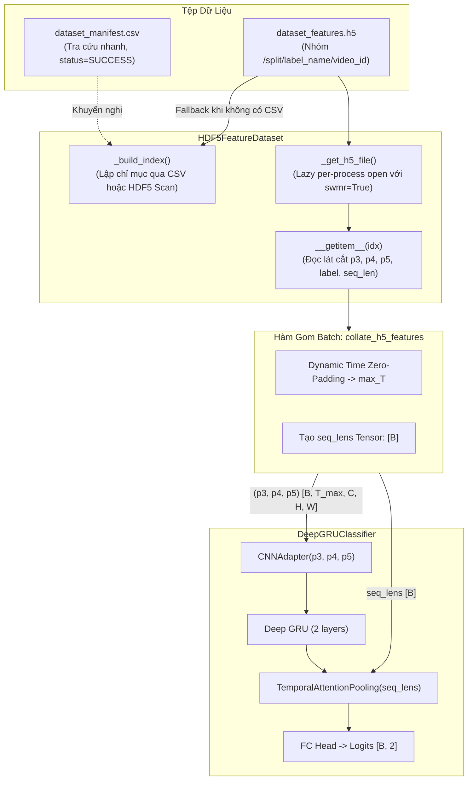

# KẾ HOẠCH TRIỂN KHAI XÂY DỰNG DATASET NẠP ĐẶC TRƯNG HDF5 (.H5) CHO PYTORCH

**Mã tài liệu:** `plan_h5_dataset.md`  
**Dự án:** Hệ Thống Nhận Diện Tài Xế Buồn Ngủ (Driver Guardian - Deep GRU / LSTM)  
**Tệp mục tiêu:** [`src/dataset.py`](file:///D:/Project/DATN/driver-guardian/ai/LSTM/src/dataset.py) & [`src/__init__.py`](file:///D:/Project/DATN/driver-guardian/ai/LSTM/src/__init__.py)  
**Căn cứ phân tích:** [`docs/analsys_h5_dataset.md`](file:///D:/Project/DATN/driver-guardian/ai/LSTM/docs/analsys_h5_dataset.md)  
**Tệp sinh dữ liệu nguồn:** [`extract_to_pt.py`](file:///D:/Project/DATN/driver-guardian/ai/LSTM/extract_to_pt.py)  
**Quy chuẩn áp dụng:** [`AGENTS.md`](file:///D:/Project/DATN/driver-guardian/ai/LSTM/AGENTS.md) — Bước 2: Lên kế hoạch thực hiện  
**Ngày lập:** 02/10/2026  

---

## 1. MỤC TIÊU & NGUYÊN TẮC KỸ THUẬT CỐT LÕI

### 1.1. Mục tiêu triển khai
1. **Xây dựng module [`src/dataset.py`](file:///D:/Project/DATN/driver-guardian/ai/LSTM/src/dataset.py) hoàn chỉnh, chuẩn công nghiệp:**
   - Cung cấp lớp [`HDF5FeatureDataset`](file:///D:/Project/DATN/driver-guardian/ai/LSTM/src/dataset.py) kế thừa từ `torch.utils.data.Dataset`.
   - Nạp trực tiếp dữ liệu đặc trưng không gian đa tỉ lệ nguyên bản (`p3`, `p4`, `p5`) từ tệp `.h5` do [`extract_to_pt.py`](file:///D:/Project/DATN/driver-guardian/ai/LSTM/extract_to_pt.py) trích xuất.
2. **Triệt tiêu hoàn toàn lỗi Deadlock / File Handle Sharing trong môi trường Multi-processing:**
   - Ứng dụng mô hình **Lazy Opening** per worker process kết hợp cờ `swmr=True` (Single-Writer-Multiple-Reader) để vận hành an toàn tuyệt đối khi `num_workers > 0`.
3. **Cơ chế xử lý chuỗi thời gian $T$ biến thiên:**
   - Xây dựng hàm gom batch `collate_h5_features`: tự động Zero-padding theo trục thời gian về $T_{\max}$ của batch và sinh tensor `seq_lens` $[B]$.
   - Tương thích $100\%$ với cơ chế Attention Masking của [`TemporalAttentionPooling`](file:///D:/Project/DATN/driver-guardian/ai/LSTM/src/models.py#L251) trong [`DeepGRUClassifier`](file:///D:/Project/DATN/driver-guardian/ai/LSTM/src/models.py#L290).
4. **Tích hợp sâu với hệ thống cấu hình:**
   - Cung cấp hàm factory `build_h5_dataloaders` tương thích hoàn toàn với [`configs/config.py`](file:///D:/Project/DATN/driver-guardian/ai/LSTM/configs/config.py) (`TrainConfig`).

### 1.2. Các ràng buộc kỹ thuật & Tiêu chí chất lượng
- **Reproducibility (Tính tái lập):** Hỗ trợ `worker_init_fn` gán random seed cho từng worker theo chuẩn PyTorch.
- **Cross-platform Paths:** Sử dụng `pathlib.Path` cho toàn bộ thao tác đường dẫn tệp.
- **Robust Exception Handling:** Kiểm tra tính toàn vẹn của tệp HDF5 (`is_completed`), xử lý ngoại lệ khi tệp thiếu hoặc hỏng.
- **Zero Leakage:** Phân tách rạch ròi giữa các tập `train`, `val`. Không rò rỉ dữ liệu tăng cường vào tập `val`.

---

## 2. CHI TIẾT THIẾT KẾ KIẾN TRÚC MÃ NGUỒN (`src/dataset.py`)



---

### 2.1. Cấu trúc Lớp `HDF5FeatureDataset`

```python
@dataclass
class H5VideoSample:
    """Cấu trúc đại diện cho một mẫu video đã lập chỉ mục."""
    group_path: str        # Đường dẫn nhóm trong H5 (vd: "train/0_alert/train_0_alert_sust_n_1")
    video_id: str          # Mã định danh (vd: "train_0_alert_sust_n_1")
    split: str             # "train" hoặc "val"
    label: int             # 0 hoặc 1
    label_name: str        # "0_alert" hoặc "1_drowsy"
    seq_len: int           # Số khung hình T
    is_augmented: bool     # True nếu là video augment
    source_dataset: str    # "sust", "uta-rldd", ...
    orig_file: str         # Tệp video gốc


class HDF5FeatureDataset(torch.utils.data.Dataset):
    """
    PyTorch Dataset nạp các tensor đặc trưng không gian (p3, p4, p5) trực tiếp từ tệp HDF5.
    Hỗ trợ multiprocessing an toàn, lập chỉ mục linh hoạt, cắt cửa sổ thời gian và in-memory caching.
    """
    def __init__(
        self,
        h5_path: Union[str, Path],
        manifest_csv: Optional[Union[str, Path]] = None,
        split: str = "train",
        seq_len: Optional[int] = None,
        stride: int = 1,
        include_augmented: bool = True,
        source_dataset: Optional[Union[str, List[str]]] = None,
        filter_label: Optional[int] = None,
        min_seq_len: int = 5,
        target_dtype: torch.dtype = torch.float32,
        cache_in_ram: bool = False,
        window_sampling: str = "random",  # "random" cho train, "center" cho val
        transform: Optional[Any] = None
    ) -> None:
        ...
```

#### Phương thức giải quyết Multi-processing (`_get_h5_file`):
```python
    def _get_h5_file(self) -> h5py.File:
        """
        Lazy-loader mở tệp HDF5 per-process an toàn cho PyTorch multi-worker DataLoader.
        Tự động nhận diện khi tiến trình con (worker) được sinh ra để tránh chia sẻ file descriptor.
        """
        curr_pid = os.getpid()
        if self._h5_file is None or self._pid != curr_pid:
            self._pid = curr_pid
            # Mở ở chế độ Read-Only an toàn, SWMR tối ưu truy cập đồng thời
            self._h5_file = h5py.File(str(self.h5_path), mode="r", swmr=True, libver="latest")
        return self._h5_file
```

#### Phương thức lập chỉ mục kép (`_build_index`):
1. **Nhánh 1 (Ưu tiên):** Đọc từ `manifest_csv` nếu tệp tồn tại:
   - Chỉ chọn các dòng có `status == "SUCCESS"`.
   - Lọc theo `split`, `include_augmented`, `source_dataset`, `filter_label`.
2. **Nhánh 2 (Tự động thích ứng):** Nếu không có file CSV:
   - Duyệt cây nhóm `h5_file[split]` theo 2 nhãn `0_alert` và `1_drowsy`.
   - Chỉ chọn nhóm có `attrs.get("is_completed", False) == True`.
3. Sắp xếp danh sách mẫu theo `video_id` để đảm bảo tính tái lập (deterministic order).

#### Xử lý cắt cửa sổ thời gian (Temporal Windowing) trong `__getitem__`:
- Nếu `seq_len` được chỉ định (ví dụ $T_{target}=120$):
  - Khi $T > T_{target}$:
    - Nếu `split == "train"` & `window_sampling == "random"`: chọn ngẫu nhiên vị trí bắt đầu $t_0 \in [0, T - T_{target}]$.
    - Nếu `split == "val"` hoặc `window_sampling == "center"`: chọn vị trí bắt đầu giữa clip $t_0 = (T - T_{target}) // 2$.
    - Đọc trực tiếp lát cắt `p3[t0 : t0 + target_len : stride]`.
  - Khi $T \le T_{target}$: Đọc toàn bộ khung hình có sẵn (hàm gom batch sẽ zero-pad).

---

### 2.2. Chi tiết Hàm Gom Batch: `collate_h5_features`

```python
def collate_h5_features(
    batch: List[Tuple[Tuple[torch.Tensor, torch.Tensor, torch.Tensor], torch.Tensor, torch.Tensor, Dict[str, Any]]]
) -> Tuple[Tuple[torch.Tensor, torch.Tensor, torch.Tensor], torch.Tensor, torch.Tensor, List[Dict[str, Any]]]:
    """
    Hàm gom batch tùy biến thực hiện Zero-Padding theo trục thời gian về độ dài max trong batch.

    Args:
        batch: Danh sách các phần tử trả về từ Dataset:
               [((p3, p4, p5), label, seq_len, meta), ...]

    Returns:
        features: Tuple gồm 3 tensor 5D:
                  - p3_batch: [B, T_max, 64, 80, 80]
                  - p4_batch: [B, T_max, 128, 40, 40]
                  - p5_batch: [B, T_max, 256, 20, 20]
        labels: Tensor 1D [B] (torch.long)
        seq_lens: Tensor 1D [B] (torch.long) chứa độ dài thực tế trước khi padding
        metas: Danh sách B phần tử metadata
    """
```

---

### 2.3. Hàm Khởi tạo Bộ Nạp: `build_h5_dataloaders`

```python
def build_h5_dataloaders(
    h5_path: Union[str, Path],
    manifest_csv: Optional[Union[str, Path]] = None,
    batch_size: int = 64,
    num_workers: int = 4,
    seq_len: Optional[int] = None,
    stride: int = 1,
    include_augmented_train: bool = True,
    pin_memory: bool = True,
    persistent_workers: bool = False,
    cache_in_ram: bool = False,
    seed: int = 42,
    config: Optional[Any] = None
) -> Tuple[DataLoader, DataLoader]:
    """
    Khởi tạo cặp (train_loader, val_loader) chuẩn hóa từ tệp HDF5.
    Hỗ trợ đồng bộ tự động với đối tượng TrainConfig từ configs/config.py.
    """
```

---

## 3. KẾ HOẠCH TRIỂN KHAI THEO TỪNG GIAI ĐOẠN


### Giai đoạn 1: Viết mã nguồn [`src/dataset.py`](file:///D:/Project/DATN/driver-guardian/ai/LSTM/src/dataset.py)
- Định nghĩa dataclass `H5VideoSample`.
- Hiện thực hóa `HDF5FeatureDataset` với cơ chế lazy file handle, dual indexing, temporal slicing, và RAM caching.
- Hiện thực hóa `collate_h5_features` có dynamic zero-padding.
- Hiện thực hóa `build_h5_dataloaders` tích hợp cấu hình `TrainConfig`.
- Viết khối kiểm thử độc lập trong `if __name__ == "__main__":` tự tạo mock HDF5 nhỏ để test toàn diện.

### Giai đoạn 2: Cập nhật gói xuất khẩu [`src/__init__.py`](file:///D:/Project/DATN/driver-guardian/ai/LSTM/src/__init__.py)
- Thêm `HDF5FeatureDataset`, `collate_h5_features`, `build_h5_dataloaders` vào `__all__`.

### Giai đoạn 3: Tạo File .H5 Tạm Chuẩn Hóa & Thực Thi Kiểm Thử Tự Động Chuyên Sâu

#### 3.1. Thiết kế Bộ Sinh Dữ Liệu Tạm Chuẩn Xác (`create_mock_h5_dataset`)
Để phục vụ kiểm thử độc lập mà không cần chờ chạy trích xuất toàn bộ dataset video thật, một bộ tạo dữ liệu tạm sẽ được lập trình để tạo ra một file `.h5` tạm (kèm file `.csv` manifest) tuân thủ chính xác $100\%$ định dạng được tạo bởi [`extract_to_pt.py`](file:///D:/Project/DATN/driver-guardian/ai/LSTM/extract_to_pt.py):

- **Định dạng cấu trúc cây HDF5 tạm:**
  - Nhóm `train/0_alert/train_0_alert_sust_n_1`: $T = 25$ frames.
  - Nhóm `train/0_alert/train_0_alert_sust_n_1_aug01`: $T = 25$ frames (`is_augmented = True`, `aug_seed = 101`).
  - Nhóm `train/1_drowsy/train_1_drowsy_sust_d_1`: $T = 40$ frames (thử nghiệm độ dài chuỗi lệch nhau).
  - Nhóm `val/0_alert/val_0_alert_sust_n_2`: $T = 30$ frames.
  - Nhóm `val/1_drowsy/val_1_drowsy_sust_d_2`: $T = 15$ frames.
- **Quy chuẩn tensor trong từng nhóm:**
  - `p3`: kiểu `np.float16`, kích thước $[T, 64, 80, 80]$, chunks `(1, 64, 80, 80)`, nén `lzf`.
  - `p4`: kiểu `np.float16`, kích thước $[T, 128, 40, 40]$, chunks `(1, 128, 40, 40)`, nén `lzf`.
  - `p5`: kiểu `np.float16`, kích thước $[T, 256, 20, 20]$, chunks `(1, 256, 20, 20)`, nén `lzf`.
- **Đầy đủ siêu dữ liệu (`attrs`):**
  - `label` (0 hoặc 1), `label_name` ("0_alert" hoặc "1_drowsy"), `seq_len` ($T$), `sample_interval` (0.1), `orig_fps` (30.0), `orig_duration_s` ($T \times 0.1$), `is_augmented` (bool), `aug_seed` (int), `source_dataset` ("sust"), `orig_file` ("mock.mp4"), `created_at` ("2026-10-02 10:00:00"), và cờ giao dịch `is_completed = True`.
- **Tệp CSV Manifest đi kèm:**
  - Chứa đúng 21 trường như `CSV_FIELDNAMES` của `extract_to_pt.py`, bao gồm `status="SUCCESS"` và `h5_group_path`.
- **Cơ chế Dọn dẹp Tự động (Cleanup Fixture):**
  - Sử dụng `tempfile.TemporaryDirectory()` hoặc dọn dẹp file `.h5` và `.csv` tạm sau khi toàn bộ bài test chạy xong, đảm bảo không rác đĩa.

#### 3.2. Quy trình Thực thi Kiểm thử Tự động qua File .H5 Tạm
- **Test 1: Mock Data Verification & Indexing Test:**
  - Nạp tệp `.h5` tạm cùng file `.csv`: kiểm tra lập chỉ mục đúng 3 mẫu train, 2 mẫu val.
  - Xóa file `.csv` và nạp chỉ qua tệp `.h5`: kiểm tra nhánh quét cây HDF5 tự động nạp chính xác các mẫu có `is_completed=True`.
- **Test 2: Lazy Opening & Multiprocessing Test (`num_workers=2`):**
  - Tạo `DataLoader(dataset, batch_size=2, num_workers=2)` trên hệ điều hành Windows.
  - Lặp qua dataloader, xác minh không xảy ra deadlock, không lỗi xung đột file descriptor giữa các worker process.
- **Test 3: Dynamic Zero-Padding & Slicing Test:**
  - Ghép các mẫu có $T_1=25$ và $T_2=40$ vào chung 1 batch.
  - Xác nhận batch đầu ra được pad về $T_{\max} = 40$:
    - `p3_batch`: $[2, 40, 64, 80, 80]$
    - `p4_batch`: $[2, 40, 128, 40, 40]$
    - `p5_batch`: $[2, 40, 256, 20, 20]$
    - `seq_lens`: tensor `[25, 40]`.
  - Thử nghiệm cắt lát thời gian cố định: `seq_len = 20`, kiểm tra window slicing hoạt động chuẩn xác.
- **Test 4: End-to-End Forward & Backward Pass:**
  - Chuyển batch từ tệp `.h5` tạm vào mô hình [`DeepGRUClassifier`](file:///D:/Project/DATN/driver-guardian/ai/LSTM/src/models.py#L290).
  - Kiểm tra forward: `logits = model((p3, p4, p5), seq_lens=seq_lens)` $\to$ shape $[2, 2]$.
  - Kiểm tra loss: `loss = loss_fn(logits, labels)` qua [`DrowsinessLoss`](file:///D:/Project/DATN/driver-guardian/ai/LSTM/src/loss.py).
  - Kiểm tra backward: `loss.backward()` tính toán gradient cho toàn bộ mô hình thành công, không gặp NaN/Inf.

### Giai đoạn 4: Lập Báo cáo Nghiệm thu Tổng kết
- Tạo file `docs/report_h5_dataset.md` ghi nhận toàn bộ thông số kỹ thuật, log kết quả kiểm thử trên file `.h5` tạm và xác nhận hoàn thành nhiệm vụ.

---

## 4. DANH MỤC KIỂM THỬ & TIÊU CHÍ HOÀN THÀNH (ACCEPTANCE CRITERIA)

| STT | Tiêu chí kiểm tra | Điều kiện đạt (Pass Criteria) |
| :--- | :--- | :--- |
| 1 | **Tạo file .h5 tạm đúng chuẩn** | Sinh file `.h5` tạm chứa đủ cấu trúc `p3, p4, p5`, `attrs` và chunking chuẩn xác từ `extract_to_pt.py` |
| 2 | **Cơ chế Lập chỉ mục kép** | Hoạt động trơn tru cả khi có `dataset_manifest.csv` lẫn khi tự quét nhóm HDF5 |
| 3 | **Multi-processing Safety** | Không gặp lỗi khi chạy `num_workers=2` trên Windows (lazy file opening per worker) |
| 4 | **Dynamic Zero-Padding** | Batch tensor được pad chuẩn xác theo thời gian, `seq_lens` giữ đúng độ dài ban đầu |
| 5 | **Attention Masking Compatibility** | Tích hợp hoàn hảo với `TemporalAttentionPooling`, triệt tiêu 100% gradient rác từ padding |
| 6 | **End-to-End Backward Pass** | Gradient lan truyền ngược mượt mà qua toàn bộ mạng từ `DrowsinessLoss` đến `CNNAdapter` |
| 7 | **Tuân thủ AGENTS.md** | Đầy đủ Type Hints, Docstrings, sử dụng `pathlib.Path`, không hardcode tham số, dọn dẹp file tạm |

---
*Kế hoạch đã được cập nhật yêu cầu tạo file .h5 tạm chuẩn xác và sẵn sàng để người dùng phê duyệt chuyển sang Bước 3.*
