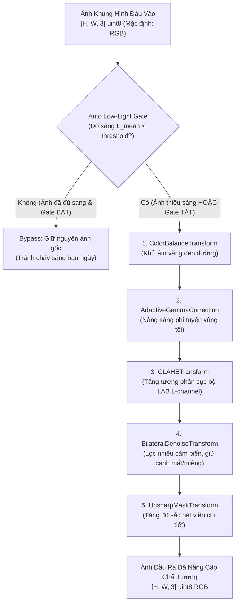

# KẾ HOẠCH TRIỂN KHAI XÂY DỰNG MODULE TIỀN XỬ LÝ ẢNH THIẾU SÁNG & BAN ĐÊM (LOW-LIGHT / NIGHT IMAGE PREPROCESSING)

**Mã tài liệu:** `plan_img_preprocess.md`  
**Dự án:** Hệ Thống Nhận Diện Tài Xế Buồn Ngủ (Driver Guardian - Deep GRU / LSTM)  
**Tệp mục tiêu:** [`src/img_preprocess.py`](file:///D:/Project/DATN/driver-guardian/ai/LSTM/src/img_preprocess.py) & [`src/__init__.py`](file:///D:/Project/DATN/driver-guardian/ai/LSTM/src/__init__.py)  
**Căn cứ phân tích:** [`docs/analsys_img_preprocess.md`](file:///D:/Project/DATN/driver-guardian/ai/LSTM/docs/analsys_img_preprocess.md)  
**Phản hồi & thống nhất từ người dùng:**  
1. Không gian màu mặc định: **RGB** (hỗ trợ chuyển đổi linh hoạt với BGR và bí danh GRB).
2. Cơ chế **Auto Low-Light Gate**: Có thể bật/tắt linh hoạt (`enable_auto_gate: bool`, `gate_threshold: float`).
3. Bộ khử nhiễu: Sử dụng **`BilateralFilter`** (`cv2.bilateralFilter`) nhằm bảo tồn tối đa các cạnh sắc nét của mắt, con ngươi và khóe miệng.
**Quy chuẩn áp dụng:** [`AGENTS.md`](file:///D:/Project/DATN/driver-guardian/ai/LSTM/AGENTS.md) — Bước 2: Lên kế hoạch thực hiện  
**Ngày lập:** 02/10/2026  

---

## 1. MỤC TIÊU & NGUYÊN TẮC KỸ THUẬT

### 1.1. Mục tiêu cốt lõi
1. **Thiết kế kiến trúc Module hóa & Hướng đối tượng chuẩn mực:**
   - Xây dựng giao diện trừu tượng [`BaseImageTransform`](file:///D:/Project/DATN/driver-guardian/ai/LSTM/src/img_preprocess.py) định nghĩa chuẩn phương thức `apply(image: np.ndarray, **kwargs) -> np.ndarray`.
   - Mỗi phép biến đổi là một Class độc lập, có thể dễ dàng khởi tạo, tùy biến siêu tham số, bật/tắt trạng thái hoạt động (`enabled: bool`), và gắn/tháo linh hoạt vào pipeline tiền xử lý.
2. **Hiện thực đầy đủ các phép biến đổi ảnh thiếu sáng chuyên sâu:**
   - **`AdaptiveGammaCorrection`**: Hiệu chỉnh độ sáng phi tuyến tự động thích nghi theo độ sáng trung bình $L_{\text{mean}}$, kéo sáng vùng tối mà không làm cháy vùng sáng.
   - **`CLAHETransform`**: Cân bằng histogram thích nghi cục bộ trên kênh Luminance (không gian màu LAB/YCrCb), làm nổi bật cấu trúc mí mắt, lông mi, miệng.
   - **`BilateralDenoiseTransform`**: Khử nhiễu cảm biến ISO cao ban đêm bằng `cv2.bilateralFilter`, làm mịn vùng má/da nhưng giữ nguyên độ nét cạnh biên quan trọng.
   - **`ColorBalanceTransform`**: Cân bằng màu trắng theo nguyên lý Gray-World khử ám vàng do đèn đường cao áp hoặc đèn xe ngược chiều.
   - **`UnsharpMaskTransform`**: Tăng độ sắc nét các viền chi tiết hỗ trợ trích xuất đặc trưng chính xác hơn.
   - **`MultiScaleRetinexTransform`**: Phân rã phản xạ Retinex đa tỉ lệ Gaussian phục vụ các tình huống môi trường cực tối.
3. **Lớp Điều phối [`LowLightImagePreprocessor`](file:///D:/Project/DATN/driver-guardian/ai/LSTM/src/img_preprocess.py):**
   - Hỗ trợ thêm/xóa/sắp xếp thứ tự các transforms linh hoạt qua Fluent API (Method Chaining).
   - Tích hợp **Auto Low-Light Gate** (có thể bật/tắt): tự động đo độ sáng trung bình, nếu ảnh đã đủ sáng thì bypass nhằm bảo vệ ảnh ban ngày không bị thừa sáng.
   - Cung cấp sẵn 3 Factory Presets: `create_default_night_pipeline()`, `create_fast_pipeline()`, `create_retinex_pipeline()`.
   - Hỗ trợ xử lý cả ảnh đơn lẻ (`process`) và chuỗi khung hình video (`process_sequence`) với chuẩn màu **RGB** mặc định.

---

## 2. KIẾN TRÚC MÃ NGUỒN CHI TIẾT (`src/img_preprocess.py`)

### 2.1. Sơ đồ Luồng Hoạt động (Pipeline Workflow)



---

### 2.2. Đặc tả Giao diện & Các Lớp Thành phần

#### 1. Lớp Cơ sở Trừu tượng: `BaseImageTransform`
```python
class BaseImageTransform(ABC):
    """Giao diện chuẩn cho tất cả các phép biến đổi ảnh."""
    def __init__(self, name: Optional[str] = None, enabled: bool = True):
        self.name = name or self.__class__.__name__
        self.enabled = enabled

    @abstractmethod
    def apply(self, image: np.ndarray, **kwargs) -> np.ndarray:
        """Thực thi biến đổi trên 1 ảnh numpy [H, W, 3] hoặc [H, W]."""
        pass

    def __call__(self, image: np.ndarray, **kwargs) -> np.ndarray:
        if not self.enabled:
            return image
        return self.apply(image, **kwargs)

    def apply_sequence(self, frames: List[np.ndarray], **kwargs) -> List[np.ndarray]:
        if not self.enabled:
            return frames
        return [self.apply(f, **kwargs) for f in frames]

    def set_enabled(self, enabled: bool) -> "BaseImageTransform":
        self.enabled = enabled
        return self
```

#### 2. Các Lớp Biến đổi Cụ thể:
1. **`AdaptiveGammaCorrection(BaseImageTransform)`**:
   - Tham số: `gamma: Optional[float] = None`, `auto_gamma: bool = True`, `target_mean: float = 128.0`, `gamma_range: Tuple[float, float] = (0.2, 1.8)`.
   - Logic: Khi `auto_gamma=True`, tính độ sáng trung bình $L_{\text{mean}}$ trên kênh Y/L, tự động điều chỉnh $\gamma$ để kéo độ sáng về `target_mean`.
2. **`CLAHETransform(BaseImageTransform)`**:
   - Tham số: `clip_limit: float = 2.5`, `tile_grid_size: Tuple[int, int] = (8, 8)`, `color_space: str = "LAB"`.
   - Logic: Chuyển RGB sang LAB, áp dụng `cv2.createCLAHE` lên kênh L, ghép lại và chuyển ngược về RGB.
3. **`BilateralDenoiseTransform(BaseImageTransform)`**:
   - Tham số: `d: int = 5`, `sigma_color: float = 50.0`, `sigma_space: float = 50.0`.
   - Logic: Áp dụng `cv2.bilateralFilter(image, d, sigma_color, sigma_space)`. Khử nhiễu mịn màng mà không làm mất cạnh viền mắt, đồng tử, sống mũi, khóe miệng.
4. **`ColorBalanceTransform(BaseImageTransform)`**:
   - Tham số: `percentile_clip: float = 1.0`.
   - Logic: Cân bằng trắng Gray-World và cân bằng histogram kênh màu, loại bỏ hiện tượng ám màu do đèn đường natri.
5. **`UnsharpMaskTransform(BaseImageTransform)`**:
   - Tham số: `strength: float = 0.5`, `kernel_size: Tuple[int, int] = (5, 5)`, `sigma: float = 1.0`.
   - Logic: $I_{\text{sharp}} = \text{clip}(I + \text{strength} \times (I - \text{GaussianBlur}(I)), 0, 255)$.
6. **`MultiScaleRetinexTransform(BaseImageTransform)`**:
   - Tham số: `sigma_list: List[float] = [15.0, 80.0, 250.0]`, `dynamic_range_clip: bool = True`.
   - Logic: Phân rã Retinex đa tỉ lệ phục vụ môi trường thiếu sáng cực đoan.

#### 3. Lớp Điều phối Pipeline: `LowLightImagePreprocessor`
```python
class LowLightImagePreprocessor:
    def __init__(
        self,
        transforms: Optional[List[BaseImageTransform]] = None,
        default_color_format: str = "RGB",
        enable_auto_gate: bool = True,
        gate_threshold: float = 65.0,
    ):
        ...
```
- **Phương thức Quản lý Transforms (Fluent Interface):**
  - `add_transform(transform: BaseImageTransform, index: Optional[int] = None) -> Self`
  - `remove_transform(name: str) -> bool`
  - `get_transform(name: str) -> Optional[BaseImageTransform]`
  - `set_transform_enabled(name: str, enabled: bool) -> bool`
  - `clear_transforms() -> Self`
  - `list_transforms() -> List[Dict[str, Any]]`
- **Phương thức Xử lý:**
  - `is_low_light(image: np.ndarray, color_format: str = "RGB") -> Tuple[bool, float]`
  - `process(image: np.ndarray, color_format: Optional[str] = None) -> np.ndarray`
  - `process_sequence(images: Sequence[np.ndarray], color_format: Optional[str] = None) -> List[np.ndarray]`
  - `__call__(input_data: Union[np.ndarray, Sequence[np.ndarray]], **kwargs)`
- **Factory Presets:**
  - `create_default_night_pipeline(enable_auto_gate: bool = True)`
  - `create_fast_pipeline(enable_auto_gate: bool = True)`
  - `create_retinex_pipeline(enable_auto_gate: bool = True)`

---

## 3. CÁC BƯỚC THỰC HIỆN CỤ THỂ (ACTION CHECKLIST)

### Bước 2.1: Chuẩn bị & Soát xét phụ thuộc
- Xác nhận các thư viện cần thiết: `cv2`, `numpy`, `typing`, `abc`, `pathlib`, `logging`. Đảm bảo không phát sinh thư viện lạ ngoài `requirements.txt`.

### Bước 2.2: Hiện thực mã nguồn [`src/img_preprocess.py`](file:///D:/Project/DATN/driver-guardian/ai/LSTM/src/img_preprocess.py)
- Triển khai `BaseImageTransform` đầy đủ type hints và docstrings chuẩn Google.
- Triển khai 6 lớp biến đổi: `AdaptiveGammaCorrection`, `CLAHETransform`, `BilateralDenoiseTransform`, `ColorBalanceTransform`, `UnsharpMaskTransform`, `MultiScaleRetinexTransform`.
- Triển khai lớp điều phối `LowLightImagePreprocessor` với đầy đủ cơ chế Auto Low-Light Gate, quản lý linh hoạt, xử lý frame đơn và chuỗi sequence, và 3 factory presets.

### Bước 2.3: Đăng ký Export vào [`src/__init__.py`](file:///D:/Project/DATN/driver-guardian/ai/LSTM/src/__init__.py)
- Export các lớp quan trọng:
  ```python
  from .img_preprocess import (
      BaseImageTransform,
      AdaptiveGammaCorrection,
      CLAHETransform,
      BilateralDenoiseTransform,
      ColorBalanceTransform,
      UnsharpMaskTransform,
      MultiScaleRetinexTransform,
      LowLightImagePreprocessor,
  )
  ```

### Bước 2.4: Kiểm thử Đơn vị & Xác minh Chất lượng (Verification & Unit Testing)
- Tạo kịch bản kiểm thử độc lập chạy kiểm tra:
  1. Kiểm tra khởi tạo và kế thừa interface của tất cả các lớp biến đổi.
  2. Kiểm tra tính toàn vẹn kiểu dữ liệu và kích thước ảnh: đầu vào uint8 RGB $[H, W, 3] \to$ đầu ra uint8 RGB $[H, W, 3]$, giá trị trong đoạn $[0, 255]$.
  3. Kiểm tra tính năng thêm/xóa/bật/tắt động (`enabled=False` trả về ảnh gốc).
  4. Kiểm tra cơ chế **Auto Low-Light Gate**:
     - Khi `enable_auto_gate=True`: Ảnh sáng ban ngày ($L_{\text{mean}} > 65$) được bypass nguyên vẹn; ảnh tối ($L_{\text{mean}} < 65$) được tăng sáng.
     - Khi `enable_auto_gate=False`: Cả ảnh sáng và tối đều đi qua toàn bộ pipeline.
  5. Kiểm tra xử lý chuỗi video `process_sequence` và đo tốc độ xử lý FPS.

### Bước 2.5: Xây dựng Jupyter Notebook Trực quan hóa & Demo ([`notebooks/01_demo_img_preprocess.ipynb`](file:///D:/Project/DATN/driver-guardian/ai/LSTM/notebooks/01_demo_img_preprocess.ipynb))
- Xây dựng notebook mẫu theo đúng chuẩn `AGENTS.md` (đặt seed, hiển thị trực quan Trước/Sau, so sánh biểu đồ Histogram và độ sáng).
- Demo trực quan trên ảnh thực tế `docs/images/img.png` và video thực tế `docs/video/video.mp4`.
- Trực quan hóa từng phép biến đổi thành phần và so sánh 3 Presets (`default`, `fast`, `retinex`).
- Demo cơ chế Auto Low-Light Gate bật/tắt trên các điều kiện sáng khác nhau.

### Bước 2.6: Lập Báo cáo Hoàn thành [`docs/report_img_preprocess.md`](file:///D:/Project/DATN/driver-guardian/ai/LSTM/docs/report_img_preprocess.md)
- Tổng hợp toàn bộ công việc đã thực hiện, kết quả benchmark và hướng dẫn sử dụng mẫu.

---

## 4. KẾ HOẠCH BÀN GIAO & TÍCH HỢP HỆ THỐNG

Theo yêu cầu điều chỉnh từ người dùng:
1. **Độc lập với Offline Data Pipeline:** Không tích hợp trực tiếp vào [`extract_to_pt.py`](file:///D:/Project/DATN/driver-guardian/ai/LSTM/extract_to_pt.py) để bảo toàn tính nguyên bản của pipeline trích xuất đặc trưng hiện tại. Module `src/img_preprocess.py` hoạt động hoàn toàn độc lập, dạng thư viện plug-and-play.
2. **Notebook Trực quan hóa & Demo ([`notebooks/01_demo_img_preprocess.ipynb`](file:///D:/Project/DATN/driver-guardian/ai/LSTM/notebooks/01_demo_img_preprocess.ipynb)):** Cung cấp môi trường trực quan đầy đủ để người dùng thử nghiệm, tinh chỉnh siêu tham số và đánh giá chất lượng các bộ lọc tiền xử lý trên ảnh và video thực tế.
3. **Sẵn sàng cho Online Inference (Camera Real-time):** Dễ dàng import vào luồng camera trực tiếp (`webcam/in-cabin camera`) để tiền xử lý khung hình trước khi inference.
