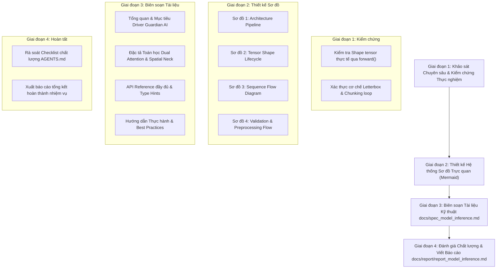

# KẾ HOẠCH TRIỂN KHAI: TÀI LIỆU HÓA, SƠ ĐỒ HÓA VÀ ĐẶC TẢ LUỒNG MÔ HÌNH MODELINFERENCE

- **Mã kế hoạch**: `PLAN_DOCS_MODEL_INFERENCE`
- **Tệp kế hoạch**: `docs/plan/plan_model_inference.md`
- **Dựa trên tài liệu phân tích**: [docs/analsys/analsys_model_inference.md](file:///D:/Project/DATN/driver-guardian/ai/LSTM/docs/analsys/analsys_model_inference.md)
- **Tệp mục tiêu đầu ra**: 
  - Tài liệu đặc tả kỹ thuật: `docs/spec_model_inference.md`
  - Báo cáo tổng kết thực hiện: `docs/report/report_model_inference.md`
- **Trạng thái**: Đang chờ người dùng phê duyệt trước khi chuyển sang Bước 3 Thực hiện ([AGENTS.md](file:///D:/Project/DATN/driver-guardian/ai/LSTM/AGENTS.md)).

---

## 1. MỤC TIÊU VÀ NGUYÊN TẮC THIẾT KẾ CỐT LÕI

### 1.1. Mục tiêu trọng tâm
Xây dựng bộ tài liệu kỹ thuật toàn diện, hệ thống sơ đồ trực quan và đặc tả luồng xử lý chi tiết cho lớp suy luận đầu-cuối [`ModelInference`](file:///D:/Project/DATN/driver-guardian/ai/LSTM/model_inference.py#L13-L150) tại tệp [`model_inference.py`](file:///D:/Project/DATN/driver-guardian/ai/LSTM/model_inference.py):
1. **Đặc tả kiến trúc hệ thống 2 tầng (Two-Stage Unified Architecture)**:
   - Tầng 1: Mạng thị giác trích xuất đặc trưng không gian đa tỷ lệ ($P3, P4, P5$) sử dụng Backbone & PAFPN Neck của `NMSFreeDetector`.
   - Tầng 2: Mạng chuỗi không gian - thời gian [`ConvGRUClassifier`](file:///D:/Project/DATN/driver-guardian/ai/LSTM/src/models.py#L341-L430) tích hợp cổ giảm kênh [`SpatialReductionNeck`](file:///D:/Project/DATN/driver-guardian/ai/LSTM/src/models.py#L46-L100) (448 $\rightarrow$ 64 kênh) và cơ chế chú ý kép ([`SpatialAttentionPooling`](file:///D:/Project/DATN/driver-guardian/ai/LSTM/src/models.py#L210-L294) + [`TemporalAttentionPooling`](file:///D:/Project/DATN/driver-guardian/ai/LSTM/src/models.py#L296-L340)).
2. **Trực quan hóa bằng hệ thống sơ đồ Mermaid đa góc nhìn**:
   - Sơ đồ kiến trúc tổng thể (High-Level Architecture Pipeline).
   - Sơ đồ luồng dữ liệu & biến đổi kích thước Tensor qua từng lớp (Detailed Tensor Shape Lifecycle Flowchart).
   - Sơ đồ tương tác tuần tự thời gian giữa các thành phần (Sequence Diagram).
   - Sơ đồ logic kiểm tra điều kiện dữ liệu và cơ chế Letterbox (Decision & Validation Flowchart).
3. **Đặc tả API tham chiếu và hướng dẫn tích hợp**:
   - Mô tả chi tiết các phương thức: `__init__`, `from_checkpoint`, `forward`, `letterbox`.
   - Cung cấp kịch bản thực tế: Tích hợp Engine thời gian thực (Camera streaming), đánh giá video hàng loạt (Batch video evaluation), cơ chế bắt lỗi an toàn.
4. **Kiểm chứng tính toàn vẹn (Verification & Sanity Check)**:
   - Chạy script kiểm thử thực tế mô phỏng dòng dữ liệu video qua `ModelInference` để xác thực 100% tính chính xác của các kích thước tensor và luồng dữ liệu mô tả trong tài liệu.

### 1.2. Nguyên tắc thiết kế (Tuân thủ AGENTS.md)
- **Chuẩn hóa tài liệu kỹ thuật**: Định dạng Markdown chuyên nghiệp theo chuẩn GitHub Flavored Markdown, tương thích hiển thị Mermaid trên GitHub/IDE.
- **Tính chính xác và khả năng tái lập**: Mọi kích thước tensor, số kênh, công thức toán học và siêu tham số mặc định phải khớp tuyệt đối với mã nguồn tại [`model_inference.py`](file:///D:/Project/DATN/driver-guardian/ai/LSTM/model_inference.py) và [`src/models.py`](file:///D:/Project/DATN/driver-guardian/ai/LSTM/src/models.py).
- **Liên kết mã nguồn rõ ràng**: Tạo liên kết clickable dạng `file:///` đến từng hàm, class và dòng mã nguồn tương ứng.

---

## 2. LỘ TRÌNH TRIỂN KHAI CHI TIẾT (WORKFLOW 4 GIAI ĐOẠN)

---

### GIAI ĐOẠN 1: KHẢO SÁT CHUYÊN SÂU & KIỂM CHỨNG THỰC NGHIỆM

- **Nhiệm vụ 1.1**: Rà soát các tham số cấu hình, đường dẫn checkpoints và phương thức nạp trọng số trong `model_inference.py`.
- **Nhiệm vụ 1.2**: Chạy kiểm chứng thực nghiệm bằng đoạn mã Python mô phỏng (Sanity Check script):
  - Chạy thử nghiệm với tensor giả lập `[T=16, 3, 224, 224]` dạng `uint8` để xác thực luồng qua `letterbox` $\rightarrow$ `chunking` $\rightarrow$ `P3, P4, P5` $\rightarrow$ `ConvGRUClassifier` $\rightarrow$ scalar score.
  - In và ghi nhận chính xác shape tại từng nút mạng để đưa số liệu thực tế 100% vào tài liệu đặc tả.

---

### GIAI ĐOẠN 2: THIẾT KẾ HỆ THỐNG SƠ ĐỒ TRỰC QUAN (MERMAID)

- **Nhiệm vụ 2.1**: Xây dựng **Sơ đồ 1: Luồng kiến trúc tổng thể (Architecture Pipeline Flowchart)**:
  - Phân vùng trực quan thành 4 Subgraph:
    1. Input & Preprocessing Stage
    2. Chunked Spatial Feature Extraction (Backbone & PAFPN Neck)
    3. Spatio-Temporal Temporal Modeling (SpatialReductionNeck, ConvGRU, Dual Attention)
    4. Prediction Head & Output Score
- **Nhiệm vụ 2.2**: Xây dựng **Sơ đồ 2: Vòng đời kích thước Tensor (Detailed Tensor Lifecycle & Shape Transformations)**:
  - Sơ đồ dạng bảng và Graph chi tiết từ đầu vào `[T, 3, H, W]` qua các bước tiền xử lý, chia chunk `[chunk_size, 3, 640, 640]`, trích xuất `out3, out4, out5`, ghép nối `[1, T, C, H, W]`, nén qua `SpatialReductionNeck` thành `[1, T, 64, 40, 40]`, qua `SpatialAttentionPooling` thành `[1, T, 64]`, qua `TemporalAttentionPooling` thành `[1, 64]`, đến logits và scalar score.
- **Nhiệm vụ 2.3**: Xây dựng **Sơ đồ 3: Sơ đồ tuần tự (Sequence Diagram)**:
  - Trực quan hóa tương tác giữa Client/Engine, `ModelInference`, `Letterbox`, `CNN Backbone/Neck`, và `ConvGRUClassifier`.
- **Nhiệm vụ 2.4**: Xây dựng **Sơ đồ 4: Cây quyết định và kiểm tra tính hợp lệ (Validation & Decision Flowchart)**:
  - Thể hiện các điều kiện rẽ nhánh: numpy vs tensor, kiểm tra 4 chiều, kiểm tra $C=3$, kiểm tra uint8 vs float finite, kiểm tra kích thước $H, W$ cần letterbox hay giữ nguyên, định dạng logits 1 output (Sigmoid) vs 2 outputs (Softmax).

---

### GIAI ĐOẠN 3: BIÊN SOẠN TÀI LIỆU KỸ THUẬT `DOCS/SPEC_MODEL_INFERENCE.MD`

Tài liệu được xây dựng với cấu trúc chuyên nghiệp, phân tách thành các chương rõ ràng:
1. **Chương 1: Giới thiệu & Tổng quan**:
   - Mục đích thiết kế trong hệ thống Driver Guardian.
   - Nguyên lý hoạt động kết hợp Thị giác không gian (Spatial Vision) và Mô hình hóa chuỗi thời gian (Temporal Dynamics).
2. **Chương 2: Sơ đồ kiến trúc & Luồng dữ liệu**:
   - Tích hợp toàn bộ 4 sơ đồ Mermaid đã thiết kế ở Giai đoạn 2.
   - Bảng tra cứu kích thước Tensor chi tiết.
3. **Chương 3: Phân tích chi tiết các khối chức năng**:
   - Cơ chế tiền xử lý & Letterbox: Thuật toán bảo toàn tỷ lệ khung hình, đệm canvas.
   - Khối trích xuất không gian Chunked CNN: Cơ chế chia nhỏ theo `chunk_size` chống tràn bộ nhớ GPU, tối ưu `torch.inference_mode()` và `non_blocking=True`.
   - Cổ giảm kênh đa tỷ lệ [`SpatialReductionNeck`](file:///D:/Project/DATN/driver-guardian/ai/LSTM/src/models.py#L46-L100): Cơ chế căn chỉnh kích thước không gian đa tỷ lệ và nén 448 kênh $\rightarrow$ 64 kênh.
   - Mạng chuỗi thời gian [`ConvGRU`](file:///D:/Project/DATN/driver-guardian/ai/LSTM/src/convgru.py#L143-L300): Bảo toàn không gian 2D trên lưới $40 \times 40$ qua các bước thời gian.
   - Cơ chế Chú ý Kép (Dual Attention Mechanism): Công thức toán học của [`SpatialAttentionPooling`](file:///D:/Project/DATN/driver-guardian/ai/LSTM/src/models.py#L210-L294) và [`TemporalAttentionPooling`](file:///D:/Project/DATN/driver-guardian/ai/LSTM/src/models.py#L296-L340) với dynamic masking.
   - Đầu phân loại và tính xác suất buồn ngủ.
4. **Chương 4: Đặc tả API tham chiếu (API Reference)**:
   - Chi tiết từng hàm, phương thức, tham số (Type hints, Default values, Docstrings, Exceptions).
5. **Chương 5: Hướng dẫn sử dụng & Mẫu mã nguồn (Quickstart & Code Recipes)**:
   - Mẫu 1: Tải nhanh mô hình từ checkpoint `.pt`.
   - Mẫu 2: Suy luận từ mảng numpy khung hình camera (Streaming/Engine loop).
   - Mẫu 3: Xử lý video độ phân giải bất kỳ và độ dài biến thiên.
6. **Chương 6: Phân tích hiệu năng & Khuyến nghị triển khai**:
   - Lựa chọn `chunk_size` tối ưu trên GPU 4GB, 6GB, 8GB+.
   - Khuyến nghị tần suất lấy mẫu FPS khi lắp đặt trên camera xe hơi thực tế.

---

### GIAI ĐOẠN 4: KIỂM TRA CHẤT LƯỢNG & TỔNG HỢP BÁO CÁO `REPORT_MODEL_INFERENCE.MD`

- **Nhiệm vụ 4.1**: Rà soát đối chiếu tài liệu theo bảng tiêu chí chất lượng (Checklist) của `AGENTS.md`.
- **Nhiệm vụ 4.2**: Tạo file `docs/report/report_model_inference.md` tổng hợp toàn bộ các kết quả thực hiện, các file đã sinh ra, tóm tắt các sơ đồ và hướng dẫn cách tra cứu tài liệu.

---

## 3. CHECKLIST NGHIỆM THU THEO QUY CHUẨN `AGENTS.MD`

- [ ] Toàn bộ sơ đồ Mermaid hiển thị chính xác, không phát sinh lỗi cú pháp cú pháp parse.
- [ ] Mọi đường dẫn trong tài liệu tương thích đa nền tảng và có liên kết trực tiếp (`file:///`).
- [ ] Kích thước Tensor tại các bước được kiểm chứng trùng khớp với mã nguồn thực tế.
- [ ] Tài liệu `docs/spec_model_inference.md` hoàn chỉnh, mạch lạc, sẵn sàng phục vụ báo cáo Đồ án tốt nghiệp và bàn giao kỹ thuật.
- [ ] Báo cáo tổng kết `docs/report/report_model_inference.md` được khởi tạo đầy đủ.
