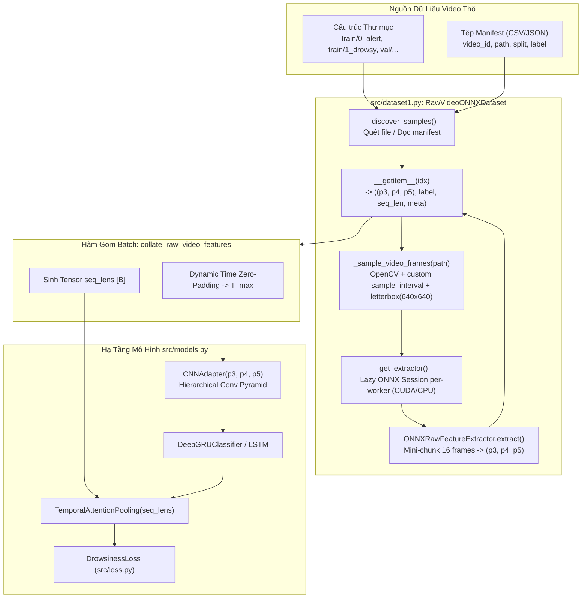

# KẾ HOẠCH TRIỂN KHAI XÂY DỰNG DATASET NẠP VIDEO THÔ & TRÍCH XUẤT ĐẶC TRƯNG ONNX RUNTIME TRỰC TIẾP

**Mã tài liệu:** `plan_raw_video_onnx_dataset.md`  
**Dự án:** Hệ Thống Nhận Diện Tài Xế Buồn Ngủ (Driver Guardian - Deep GRU / LSTM)  
**Tệp mục tiêu:** [`src/dataset1.py`](file:///D:/Project/DATN/driver-guardian/ai/LSTM/src/dataset1.py) & [`src/__init__.py`](file:///D:/Project/DATN/driver-guardian/ai/LSTM/src/__init__.py)  
**Căn cứ phân tích:** [`docs/analsys_raw_video_onnx_dataset.md`](file:///D:/Project/DATN/driver-guardian/ai/LSTM/docs/analsys_raw_video_onnx_dataset.md)  
**Mô hình trích xuất:** [`checkpoints/backbone_neck.onnx`](file:///D:/Project/DATN/driver-guardian/ai/LSTM/checkpoints/backbone_neck.onnx)  
**Quy chuẩn áp dụng:** [`AGENTS.md`](file:///D:/Project/DATN/driver-guardian/ai/LSTM/AGENTS.md) — Bước 2: Lên kế hoạch thực hiện  
**Ngày lập:** 03/10/2026  

---

## 1. MỤC TIÊU & NGUYÊN TẮC KỸ THUẬT CỐT LÕI

### 1.1. Mục tiêu triển khai
1. **Xây dựng module [`src/dataset1.py`](file:///D:/Project/DATN/driver-guardian/ai/LSTM/src/dataset1.py) chuẩn công nghiệp:**
   - Cung cấp lớp `RawVideoONNXDataset` kế thừa từ `torch.utils.data.Dataset`.
   - Nạp trực tiếp video thô (`.mp4`, `.avi`, `.mkv`...) từ ổ đĩa theo cấu trúc phân tầng (`train/0_alert`, `train/1_drowsy`, `val/...`) hoặc từ tệp chỉ mục manifest (CSV/JSON).
2. **Tích hợp Động cơ Suy luận ONNX Runtime Trực tiếp (On-The-Fly Extraction):**
   - Tích hợp mô hình Backbone+PAFPN Neck ([`checkpoints/backbone_neck.onnx`](file:///D:/Project/DATN/driver-guardian/ai/LSTM/checkpoints/backbone_neck.onnx)) trích xuất trực tiếp 3 tensor bản đồ đặc trưng không gian:
     - `p3`: $[T, 64, 80, 80]$ (Độ phân giải cao, biên cạnh chi tiết)
     - `p4`: $[T, 128, 40, 40]$ (Đặc trưng trung gian)
     - `p5`: $[T, 256, 20, 20]$ (Đặc trưng ngữ nghĩa toàn cục khuôn mặt)
3. **Chu kỳ Lấy mẫu Thời gian Tùy chỉnh (`sample_interval`):**
   - Cho phép người dùng tùy biến chu kỳ thời gian giữa 2 khung hình lấy mẫu (ví dụ: `0.1s` ~ 10 FPS, `0.05s` ~ 20 FPS, `0.2s` ~ 5 FPS...).
   - Tự động thích ứng với FPS gốc của từng video: $\text{step} = \max\left(1, \text{round}(\text{fps} \times \text{sample\_interval})\right)$.
   - Căn chỉnh kích thước ảnh qua thuật toán `letterbox` chuẩn 640x640 (giữ nguyên tỷ lệ gốc, đệm màu xám $114$).
4. **Triệt tiêu Hoàn toàn Lỗi Serialization / Deadlock trong PyTorch Multi-processing:**
   - Ứng dụng mô hình **Lazy Session Initialization** per-worker process (chỉ khởi tạo `InferenceSession` khi gọi `__getitem__` bên trong worker).
   - Triệt tiêu lỗi `TypeError: cannot pickle 'InferenceSession'` khi `num_workers > 0`.
5. **Gom Batch Động & Tương thích Hạ tầng:**
   - Xây dựng hàm `collate_raw_video_features`: tự động Zero-Padding theo trục thời gian về $T_{\max}$ của batch và sinh tensor `seq_lens` $[B]$.
   - Tương thích 100% với [`CNNAdapter`](file:///D:/Project/DATN/driver-guardian/ai/LSTM/src/models.py#L9) và [`DeepGRUClassifier`](file:///D:/Project/DATN/driver-guardian/ai/LSTM/src/models.py#L137).
6. **Tuân thủ Tuyệt đối các Quyết định Thiết kế từ Người dùng:**
   - **KHÔNG tích hợp `src/img_preprocess.py`:** Giữ pipeline tinh gọn, giải phóng CPU, tối đa hóa thông lượng đọc video.
   - **KHÔNG sử dụng cơ chế Caching (Loại bỏ RAM/Disk Cache):** Thuần trích xuất động streaming trực tiếp (Stateless), tiết kiệm 100% RAM và không sinh tệp rác.

---

## 2. KIẾN TRÚC MÃ NGUỒN & THIẾT KẾ MODULE (`src/dataset1.py`)



---

## 3. THIẾT KẾ CHI TIẾT CÁC THÀNH PHẦN

### 3.1. Cấu trúc dữ liệu đại diện mẫu: `RawVideoSample`
```python
@dataclass
class RawVideoSample:
    """Lưu trữ siêu dữ liệu đại diện cho một video clip trong bộ dữ liệu."""
    path: Path              # Đường dẫn tệp video thô
    video_id: str           # Mã định danh video (vd: "train_0_alert_sust_n_1")
    split: str              # "train" hoặc "val"
    label: int              # 0 (alert) hoặc 1 (drowsy)
    label_name: str         # "0_alert" hoặc "1_drowsy"
    source_dataset: str     # Nguồn ("sust", "uta-rldd", "vbddd", ...)
    subject_id: Optional[str] = None
```

### 3.2. Lớp Động cơ Trích xuất ONNX: `ONNXRawFeatureExtractor`
- Quản lý `InferenceSession` với các Provider ưu tiên: `CUDAExecutionProvider` $\rightarrow$ `CPUExecutionProvider`.
- Hỗ trợ lazy initialization để đảm bảo an toàn tuyệt đối khi pickle `Dataset` qua các tiến trình con.
- Phương thức `extract_chunks(frames_rgb, chunk_size=16, use_fp16=False)`:
  - Chia nhỏ mảng khung hình $T \times [3, 640, 640]$ thành các mini-chunk kích thước `chunk_size` (mặc định 16).
  - Chuẩn hóa $[0.0, 1.0]$, cấp vào ONNX và ghép nối dọc trục thời gian thành 3 tensor:
    - $p3 \in \mathbb{R}^{T \times 64 \times 80 \times 80}$
    - $p4 \in \mathbb{R}^{T \times 128 \times 40 \times 40}$
    - $p5 \in \mathbb{R}^{T \times 256 \times 20 \times 20}$

### 3.3. Lớp PyTorch Dataset: `RawVideoONNXDataset`
- Kế thừa `torch.utils.data.Dataset`.
- **Tham số khởi tạo:**
  ```python
  def __init__(
      self,
      dataset_dir: Union[str, Path],
      manifest_file: Optional[Union[str, Path]] = None,
      split: str = "train",
      sample_interval: float = 0.1,
      seq_len: Optional[int] = None,
      onnx_model_path: Union[str, Path] = "checkpoints/backbone_neck.onnx",
      img_size: int = 640,
      chunk_size: int = 16,
      device: str = "auto",
      use_fp16: bool = False,
      augmenter: Optional[Any] = None,
      video_exts: Tuple[str, ...] = (".mp4", ".avi", ".mkv", ".mov"),
      window_sampling: str = "random",
      filter_label: Optional[int] = None
  ) -> None:
  ```
- **Phương thức `__getitem__(self, idx: int)`:**
  1. Lấy thông tin mẫu `RawVideoSample` tại vị trí `idx`.
  2. Mở video qua `cv2.VideoCapture`, đọc FPS gốc và tổng số frame.
  3. Tính toán bước nhảy `step = max(1, round(fps * sample_interval))`.
  4. Lấy mẫu các frame, resize letterbox về $(640, 640)$, chuyển BGR $\rightarrow$ RGB.
  5. Cắt lát thời gian theo `seq_len` (nếu có): random slice cho `train`, center slice cho `val`.
  6. Áp dụng `augmenter` (nếu có) với cùng seed cho toàn bộ frame trong clip.
  7. Trích xuất qua `self._get_extractor().extract_chunks(frames)`.
  8. Chuyển đổi sang `torch.Tensor` (float32 hoặc float16).
  9. Trả về `((p3, p4, p5), label_tensor, seq_len_tensor, meta_dict)`.

### 3.4. Hàm Gom Batch Động: `collate_raw_video_features`
- Nhận danh sách các mẫu từ `DataLoader`.
- Xác định $T_{\max} = \max_i(T_i)$ trong batch hiện tại.
- Cấp phát zero tensor cho batch:
  - `batch_p3`: $[B, T_{\max}, 64, 80, 80]$
  - `batch_p4`: $[B, T_{\max}, 128, 40, 40]$
  - `batch_p5`: $[B, T_{\max}, 256, 20, 20]$
- Gán lát cắt dữ liệu `p[i, :T_i] = sample_p`, phần còn lại từ $T_i \rightarrow T_{\max}$ giữ nguyên giá trị 0.0.
- Sinh tensor `seq_lens`: `torch.LongTensor` $[B]$ chứa độ dài thực tế.
- Trả về `((batch_p3, batch_p4, batch_p5), batch_labels, seq_lens, batch_metas)`.

### 3.5. Hàm Factory: `build_raw_video_dataloaders`
- Nhận cấu hình từ `TrainConfig` ([`configs/config.py`](file:///D:/Project/DATN/driver-guardian/ai/LSTM/configs/config.py)) hoặc các tham số tùy chọn.
- Khởi tạo 2 DataLoader cho `train` và `val`.
- Tự động cấu hình `collate_fn=collate_raw_video_features` và `worker_init_fn` an toàn.

---

## 4. KẾ HOẠCH TRIỂN KHAI TỪNG BƯỚC (STEP-BY-STEP IMPLEMENTATION PLAN)

Kế hoạch thực hiện gồm 4 giai đoạn cụ thể:

### Giai đoạn 1: Xây dựng Module Mã nguồn [`src/dataset1.py`](file:///D:/Project/DATN/driver-guardian/ai/LSTM/src/dataset1.py)
- **Tác vụ 1.1:** Thiết lập môi trường, imports, kiểm tra CUDA/ORT DLLs trên Windows, và cấu hình encoding UTF-8.
- **Tác vụ 1.2:** Định nghĩa dataclass `RawVideoSample` và hàm tiền xử lý `letterbox()`.
- **Tác vụ 1.3:** Xây dựng lớp `ONNXRawFeatureExtractor` hỗ trợ lazy loading, mini-chunking và tự động dò GPU/CPU provider.
- **Tác vụ 1.4:** Xây dựng lớp `RawVideoONNXDataset` với cơ chế đọc video OpenCV thích nghi theo `sample_interval` tùy chỉnh, temporal window slicing và multiprocessing safety.
- **Tác vụ 1.5:** Xây dựng hàm `collate_raw_video_features` và hàm factory `build_raw_video_dataloaders`.
- **Tác vụ 1.6:** Nhúng bộ kiểm thử tự lập hoàn chỉnh (Self-Contained Unit Tests) trong khối `if __name__ == "__main__":`.

### Giai đoạn 2: Cập nhật Tệp Giao diện [`src/__init__.py`](file:///D:/Project/DATN/driver-guardian/ai/LSTM/src/__init__.py)
- Xuất khẩu các lớp và hàm mới: `RawVideoONNXDataset`, `collate_raw_video_features`, `build_raw_video_dataloaders`, `ONNXRawFeatureExtractor`.

### Giai đoạn 3: Thực thi Kiểm thử Nghiệm thu Toàn diện (Execution & Verification)
- Chạy trực tiếp `python src/dataset1.py` để kiểm thử toàn diện:
  1. **Khởi tạo video mock:** Sinh các video clip giả lập (`.mp4`) với kích thước và FPS khác nhau (30 FPS, 20 FPS).
  2. **Kiểm thử chu kỳ lấy mẫu tùy chỉnh:** Xác nhận `sample_interval = 0.1s` và `0.2s` trích xuất đúng số khung hình tỷ lệ thuận với thời lượng video.
  3. **Kiểm thử suy luận ONNX:** Kiểm tra tính đúng đắn của 3 tensor `p3`, `p4`, `p5` sinh ra từ [`checkpoints/backbone_neck.onnx`](file:///D:/Project/DATN/driver-guardian/ai/LSTM/checkpoints/backbone_neck.onnx).
  4. **Kiểm thử gom batch động:** Xác nhận batch tensor được zero-pad về $T_{\max}$ và các frame ngoài $T_i$ có giá trị bằng $0.0$.
  5. **Kiểm thử tích hợp End-to-End:** Kết nối trực tiếp một batch vào [`CNNAdapter`](file:///D:/Project/DATN/driver-guardian/ai/LSTM/src/models.py#L9) và [`DeepGRUClassifier`](file:///D:/Project/DATN/driver-guardian/ai/LSTM/src/models.py#L137), thực hiện Forward Pass (sinh logits $[B, 2]$) và Backward Pass qua [`DrowsinessLoss`](file:///D:/Project/DATN/driver-guardian/ai/LSTM/src/loss.py).
  6. **Dọn dẹp môi trường tạm:** Tự động giải phóng file tạm sau khi kiểm thử kết thúc.

### Giai đoạn 4: Tổng kết & Lập Báo cáo [`docs/report_raw_video_onnx_dataset.md`](file:///D:/Project/DATN/driver-guardian/ai/LSTM/docs/report_raw_video_onnx_dataset.md)
- Tổng hợp toàn bộ kết quả kiểm thử, hình ảnh cấu trúc, tài liệu hướng dẫn sử dụng và bàn giao cho người dùng theo đúng quy chuẩn AGENTS.md.

---

## 5. TIÊU CHÍ NGHIỆM THU (ACCEPTANCE CRITERIA CHECKLIST)

- [ ] Lớp `RawVideoONNXDataset` nạp được video thô từ cấu trúc thư mục hoặc file manifest.
- [ ] Tham số `sample_interval` hoạt động chính xác theo thời gian thực (tự động tính step theo FPS gốc).
- [ ] Không phụ thuộc vào `src/img_preprocess.py` (loại bỏ hoàn toàn theo yêu cầu người dùng).
- [ ] Không sử dụng RAM/Disk cache (thuần streaming direct extraction).
- [ ] Trích xuất chuẩn xác 3 bản đồ đặc trưng: `p3` $[T, 64, 80, 80]$, `p4` $[T, 128, 40, 40]$, `p5` $[T, 256, 20, 20]$.
- [ ] Không bị lỗi pickle khi chạy PyTorch DataLoader với `num_workers > 0`.
- [ ] Hàm `collate_raw_video_features` thực hiện Zero-Padding đúng chuẩn và sinh `seq_lens`.
- [ ] Forward & Backward pass thành công $100\%$ khi kết nối với `DeepGRUClassifier`.
- [ ] Mã nguồn đạt chuẩn Clean Code, Type Hints, Docstrings và tương thích chéo nền tảng (`pathlib.Path`).

---

## 6. YÊU CẦU PHÊ DUYỆT TỪ NGƯỜI DÙNG (USER APPROVAL)

> [!IMPORTANT]
> Theo quy chuẩn làm việc tại **Bước 2 của [`AGENTS.md`](file:///D:/Project/DATN/driver-guardian/ai/LSTM/AGENTS.md)**:
> - **Bước 2 (Planning):** Lập kế hoạch chi tiết trong tệp `plan_raw_video_onnx_dataset.md`.
> - **Bước 3 (Execution):** Chỉ được tiến hành thực hiện tạo mã nguồn `src/dataset1.py` và chạy kiểm thử khi người dùng đã xem xét và chấp thuận kế hoạch này.
>
> Kính mời bạn xem xét bản kế hoạch trên. Nếu bạn đồng ý, tôi sẽ lập tức tiến hành **Bước 3: Thực hiện kế hoạch & Tạo báo cáo hoàn tất**!
