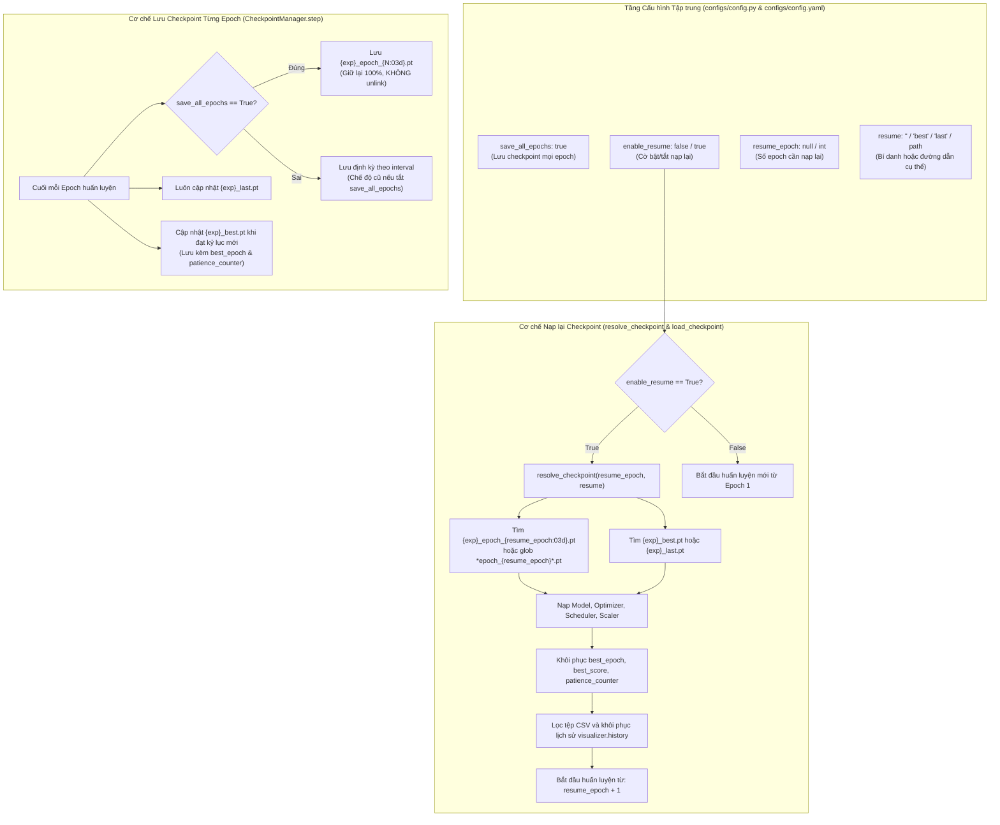

# KẾ HOẠCH TRIỂN KHAI: CƠ CHẾ NẠP LẠI TỪ MỘT EPOCH & LƯU CHECKPOINT TẤT CẢ CÁC EPOCH

**Mã tài liệu:** `plan_resume_epoch_checkpoint.md`  
**Dự án:** Hệ Thống Nhận Diện Tài Xế Buồn Ngủ (Driver Guardian - Deep GRU / LSTM)  
**Tệp mục tiêu:** [`configs/config.py`](file:///D:/Project/DATN/driver-guardian/ai/LSTM/configs/config.py), [`configs/config.yaml`](file:///D:/Project/DATN/driver-guardian/ai/LSTM/configs/config.yaml), [`src/train.py`](file:///D:/Project/DATN/driver-guardian/ai/LSTM/src/train.py)  
**Căn cứ phân tích:** [`docs/analsys/analsys_resume_epoch_checkpoint.md`](file:///D:/Project/DATN/driver-guardian/ai/LSTM/docs/analsys/analsys_resume_epoch_checkpoint.md)  
**Quy chuẩn áp dụng:** [`AGENTS.md`](file:///D:/Project/DATN/driver-guardian/ai/LSTM/AGENTS.md) — Bước 2: Lên kế hoạch thực hiện  
**Ngày lập:** 03/10/2026  

---

## 1. MỤC TIÊU & NGUYÊN TẮC KỸ THUẬT CỐT LÕI

### 1.1. Mục tiêu triển khai
1. **Lưu Checkpoint Độc Lập Cho TẤT CẢ Các Epoch (`save_all_epochs: bool = True`):**
   - Đảm bảo mỗi epoch hoàn thành đều được lưu thành tệp `{experiment_name}_epoch_{epoch:03d}.pt`.
   - Vô hiệu hóa tính năng tự động xóa tệp cũ (`unlink()`), bảo toàn 100% trọng số của mọi epoch đã trải qua.
   - Luôn duy trì đồng bộ tệp `{experiment_name}_last.pt` và `{experiment_name}_best.pt`.
   - Lưu trữ checkpoint cuối mỗi epoch độc lập với việc có chạy validation hay không (khi `val_interval_epochs > 1`).
2. **Cung cấp Cờ Bật/Tắt Tường Minh trong Cấu hình (`enable_resume: bool`):**
   - Khi `enable_resume: false`: Huấn luyện luôn khởi tạo từ đầu (Epoch 1), ngăn chặn việc vô tình nạp đè checkpoint cũ khi người dùng muốn chạy thí nghiệm mới.
   - Khi `enable_resume: true`: Cho phép pipeline nạp lại trạng thái từ checkpoint để tiếp tục huấn luyện.
3. **Cung cấp Cơ chế Nạp lại từ 1 Epoch Bất kỳ (`resume_epoch: Optional[int]`):**
   - Cho phép chỉ định trực tiếp số epoch (ví dụ `resume_epoch: 10`).
   - Tự động tìm kiếm, phân giải tệp checkpoint tương ứng, nạp mô hình, optimizer, scheduler, scaler và bắt đầu huấn luyện từ Epoch 11.
4. **Bộ Phân Giải Checkpoint Thông Minh (`resolve_checkpoint`):**
   - Hỗ trợ số epoch (`int`, chuỗi số `"10"`, tiền tố `"epoch_10"`), bí danh nhanh (`"best"`, `"last"`), và đường dẫn tệp cụ thể.
   - Liệt kê danh sách các epoch sẵn có trong thư mục nếu người dùng truyền epoch không tồn tại.
5. **Đồng bộ hóa Trạng thái Toàn Vẹn & Lịch sử Đo lường (Loss/Accuracy History):**
   - Khôi phục chính xác `best_epoch`, `best_score`, `patience_counter` (sửa lỗi gán sai `best_epoch = epoch` hiện tại).
   - Tự động nạp và lọc lại `training_history.csv` để đồ thị huấn luyện được hiển thị nối tiếp liên tục.

---

## 2. SƠ ĐỒ THIẾT KẾ GIẢI PHÁP KỸ THUẬT (SOLUTION ARCHITECTURE)



---

## 3. CÁC GIAI ĐOẠN TRIỂN KHAI CHI TIẾT (IMPLEMENTATION PHASES)

### Giai đoạn 1: Chuẩn hóa & Mở rộng Tham số Cấu hình
- **Tệp chỉnh sửa:** [`configs/config.py`](file:///D:/Project/DATN/driver-guardian/ai/LSTM/configs/config.py) và [`configs/config.yaml`](file:///D:/Project/DATN/driver-guardian/ai/LSTM/configs/config.yaml).
- **Nội dung công việc:**
  1. Trong [`TrainConfig`](file:///D:/Project/DATN/driver-guardian/ai/LSTM/configs/config.py):
     - Thêm trường `save_all_epochs: bool = True` (mặc định bật).
     - Thêm trường `enable_resume: bool = False` (mặc định tắt, muốn resume phải bật `True`).
     - Thêm trường `resume_epoch: Optional[int] = None` (số epoch chỉ định).
     - Cập nhật trường `ckpt_keep_last: Optional[int] = None` (cho phép None hoặc 0 để không xóa).
  2. Trong [`configs/config.yaml`](file:///D:/Project/DATN/driver-guardian/ai/LSTM/configs/config.yaml):
     - Đồng bộ phân khu `logging` (hoặc `checkpoints`):
       ```yaml
       save_all_epochs: true
       enable_resume: false
       resume_epoch: null
       resume: ""
       ```
  3. Bổ sung logic kiểm tra tính hợp lệ trong `TrainConfig.__post_init__`:
     - Nếu `resume_epoch is not None`: Đảm bảo `resume_epoch >= 1`.
     - Nếu `enable_resume is False` nhưng `resume_epoch` hoặc `resume` có giá trị: In thông báo nhắc nhở rằng cơ chế nạp lại đang bị tắt và sẽ huấn luyện từ đầu.

---

### Giai đoạn 2: Nâng cấp lớp `CheckpointManager` trong [`src/train.py`](file:///D:/Project/DATN/driver-guardian/ai/LSTM/src/train.py)
- **Tệp chỉnh sửa:** [`src/train.py`](file:///D:/Project/DATN/driver-guardian/ai/LSTM/src/train.py) (khối định nghĩa `CheckpointManager`).
- **Nội dung công việc:**
  1. **Xây dựng phương thức `resolve_checkpoint_path(...)`:**
     - Đầu vào: `epoch: Optional[int] = None`, `target: Optional[str] = None`.
     - Logic tìm kiếm:
       - Ưu tiên 1: Nếu `epoch` được cung cấp (int hoặc chuỗi số):
         - Tìm file: `{checkpoint_dir}/{experiment_name}_epoch_{epoch:03d}.pt`.
         - Nếu không thấy, tìm file: `{checkpoint_dir}/*epoch_{epoch:03d}*.pt` hoặc `{checkpoint_dir}/*epoch_{epoch}*.pt`.
       - Ưu tiên 2: Nếu `target` là `"best"` -> `{checkpoint_dir}/{experiment_name}_best.pt`.
       - Ưu tiên 3: Nếu `target` là `"last"` hoặc rỗng:
         - Kiểm tra `{checkpoint_dir}/{experiment_name}_last.pt`.
         - Nếu không có, tự động quét tìm checkpoint có số epoch lớn nhất hiện có trong thư mục.
       - Ưu tiên 4: Nếu `target` là chuỗi đường dẫn tệp cụ thể -> Kiểm tra tồn tại.
     - Xử lý ngoại lệ thân thiện: Nếu không tìm thấy, quét toàn bộ tệp `.pt` trong thư mục checkpoint, parse ra danh sách các epoch hiện có và raise `FileNotFoundError` kèm danh sách epoch để người dùng lựa chọn.
  2. **Cải tiến phương thức `step(...)`:**
     - Sửa lỗi thứ tự cập nhật: Đánh giá `is_best` và cập nhật `self.best_score`, `self.best_epoch` **trước khi** đóng gói `checkpoint_data`.
     - Bổ sung `best_epoch`, `best_score`, `patience_counter`, `train_metrics`, `val_metrics` vào `checkpoint_data`.
     - Logic lưu tệp:
       - Luôn lưu `{experiment_name}_last.pt`.
       - Nếu `is_best == True`: Lưu `{experiment_name}_best.pt`.
       - Nếu `self.config.save_all_epochs == True`:
         - Lưu `{experiment_name}_epoch_{epoch:03d}.pt` tại **mọi epoch**.
         - **Tuyệt đối không xóa** checkpoint cũ.
       - Nếu `self.config.save_all_epochs == False`: Giữ nguyên logic lưu theo `save_ckpt_interval_epochs` và `ckpt_keep_last`.
  3. **Cải tiến phương thức `load_checkpoint(...)`:**
     - Hỗ trợ tham số `checkpoint_target: Optional[Union[str, Path, int]] = None`, `resume_epoch: Optional[int] = None`.
     - Phân giải đường dẫn qua `resolve_checkpoint_path`.
     - Nạp an toàn: `torch.load(..., map_location="cpu")` rồi đưa vào thiết bị của mô hình.
     - Khôi phục đầy đủ:
       - `model.load_state_dict(...)`
       - `optimizer.load_state_dict(...)`
       - `scheduler.load_state_dict(...)` (nếu có)
       - `scaler.load_state_dict(...)` (nếu có)
       - `self.best_score = checkpoint.get("best_score", self.best_score)`
       - `self.best_epoch = checkpoint.get("best_epoch", checkpoint.get("epoch", 0))`
       - `self.patience_counter = checkpoint.get("patience_counter", 0)`
     - Trả về `start_epoch = checkpoint["epoch"] + 1`.

---

### Giai đoạn 3: Tích hợp vào `DrowsinessTrainer` và Vòng lặp Huấn luyện [`fit()`](file:///D:/Project/DATN/driver-guardian/ai/LSTM/src/train.py#L974)
- **Tệp chỉnh sửa:** [`src/train.py`](file:///D:/Project/DATN/driver-guardian/ai/LSTM/src/train.py).
- **Nội dung công việc:**
  1. Trong `DrowsinessTrainer.__init__`:
     - Kiểm tra cờ `config.enable_resume`:
       ```python
       if self.config.enable_resume:
           self.start_epoch = self.checkpoint_manager.load_checkpoint(
               checkpoint_target=self.config.resume,
               resume_epoch=self.config.resume_epoch,
               model=self.model,
               optimizer=self.optimizer,
               scheduler=self.scheduler,
               scaler=self.scaler
           )
           # Đồng bộ lịch sử visualizer từ file CSV cũ
           self.visualizer.sync_history_from_csv(self.start_epoch - 1)
       else:
           self.start_epoch = 1
           self.logger.info("[*] Chế độ huấn luyện mới từ đầu (enable_resume=False). Bắt đầu từ Epoch 1.")
       ```
  2. Bổ sung phương thức `sync_history_from_csv(...)` trong `TrainingVisualizer`:
     - Nếu tệp `training_history.csv` đã tồn tại, đọc lại các dòng có `epoch <= resumed_epoch`, nạp vào `self.history`.
     - Khi tiếp tục huấn luyện, đồ thị `loss_accuracy_curves.png` được vẽ liền mạch từ Epoch 1 đến Epoch hiện tại.
  3. Trong vòng lặp `fit()`:
     - Đảm bảo việc lưu checkpoint diễn ra tại **mọi epoch**, bất kể `val_interval_epochs` là bao nhiêu:
       ```python
       # Gọi checkpoint_manager.step với train_metrics và val_metrics (nếu có)
       should_stop = self.checkpoint_manager.step(
           train_metrics=train_metrics,
           val_metrics=val_metrics,
           epoch=epoch,
           model=self.model,
           optimizer=self.optimizer,
           scheduler=self.scheduler,
           scaler=self.scaler
       )
       ```

---

### Giai đoạn 4: Cập nhật Hàm Kiểm thử Tự động `run_dry_run_test()`
- **Tệp chỉnh sửa:** [`src/train.py`](file:///D:/Project/DATN/driver-guardian/ai/LSTM/src/train.py).
- **Nội dung công việc:**
  - Nâng cấp `run_dry_run_test()` để kiểm thử tự động toàn diện:
    1. **Test 1 - Lưu Tất Cả Checkpoints:** Chạy 2 epochs với `save_all_epochs=True` -> Xác thực sự tồn tại của cả `dryrun_test_epoch_001.pt` và `dryrun_test_epoch_002.pt`.
    2. **Test 2 - Cờ Bật/Tắt `enable_resume=False`:** Chạy với `enable_resume=False, resume_epoch=1` -> Xác thực hệ thống vẫn bắt đầu từ Epoch 1 (không nạp lại).
    3. **Test 3 - Nạp lại từ Epoch 1 (`enable_resume=True, resume_epoch=1`):** Khởi tạo trainer mới -> Xác thực `start_epoch == 2`, nạp thành công trọng số và tiếp tục train Epoch 2.
    4. **Test 4 - Ngoại lệ thân thiện:** Thử nạp `resume_epoch=99` không tồn tại -> Xác thực văng `FileNotFoundError` với thông báo chứa danh sách các epoch có sẵn `[1, 2]`.

---

### Giai đoạn 5: Tổng hợp & Lập Báo cáo Kết quả (`docs/report/report_resume_epoch_checkpoint.md`)
- **Tệp tạo mới:** `docs/report/report_resume_epoch_checkpoint.md`.
- **Nội dung công việc:**
  - Tổng hợp chi tiết mã nguồn đã điều chỉnh trong [`src/train.py`](file:///D:/Project/DATN/driver-guardian/ai/LSTM/src/train.py), [`configs/config.py`](file:///D:/Project/DATN/driver-guardian/ai/LSTM/configs/config.py), và [`configs/config.yaml`](file:///D:/Project/DATN/driver-guardian/ai/LSTM/configs/config.yaml).
  - Kết quả chạy kiểm thử tự động `run_dry_run_test()`.
  - Hướng dẫn chi tiết cách người dùng bật/tắt và chọn epoch trong thực tế.

---

## 4. CHECKLIST TIÊU CHÍ HOÀN THÀNH (ACCEPTANCE CRITERIA)

- [ ] [`configs/config.py`](file:///D:/Project/DATN/driver-guardian/ai/LSTM/configs/config.py) có các trường: `save_all_epochs`, `enable_resume`, `resume_epoch`.
- [ ] [`configs/config.yaml`](file:///D:/Project/DATN/driver-guardian/ai/LSTM/configs/config.yaml) đồng bộ đầy đủ các trường mới.
- [ ] Lớp `CheckpointManager` có hàm `resolve_checkpoint_path()` hỗ trợ tìm kiếm epoch thông minh và in danh sách epoch sẵn có khi lỗi.
- [ ] Mọi epoch đều được lưu thành tệp `{experiment_name}_epoch_{epoch:03d}.pt` khi `save_all_epochs=True`.
- [ ] Checkpoint lưu đầy đủ `best_epoch`, `best_score`, `patience_counter`, `train_metrics`, `val_metrics`.
- [ ] Khi `enable_resume=False`, pipeline luôn train từ Epoch 1.
- [ ] Khi `enable_resume=True, resume_epoch=N`, pipeline nạp đúng checkpoint Epoch N và bắt đầu train từ Epoch N+1.
- [ ] Đồ thị `loss_accuracy_curves.png` và file CSV lịch sử được đồng bộ liền mạch khi nạp lại.
- [ ] `run_dry_run_test()` vượt qua 100% các bài kiểm thử nạp/lưu checkpoint.
- [ ] Tạo báo cáo tổng kết hoàn thành tại `docs/report/report_resume_epoch_checkpoint.md`.

---

## 5. KẾT LUẬN & ĐỀ XUẤT BƯỚC TIẾP THEO

Kế hoạch trên đảm bảo giải quyết trọn vẹn và an toàn 100% yêu cầu của người dùng, giữ vững tính toàn vẹn của mã nguồn hiện có và mở rộng tính linh hoạt tối đa khi huấn luyện mô hình.

> [!IMPORTANT]
> **Yêu cầu phê duyệt từ Người dùng (User Approval):**  
> Căn cứ theo quy chuẩn làm việc tại **Mục 5 của [`AGENTS.md`](file:///D:/Project/DATN/driver-guardian/ai/LSTM/AGENTS.md)**:
> - **Bước 2 (Planning):** Đã hoàn tất tài liệu kế hoạch `docs/plan/plan_resume_epoch_checkpoint.md`.
> - **Bước 3 (Execution):** Chỉ được thực hiện khi bạn đồng ý với kế hoạch triển khai này.
>
> Kính mời bạn xem xét kế hoạch trên. Nếu bạn đồng ý, tôi sẽ tiến hành **Bước 3: Thực hiện kế hoạch (chỉnh sửa mã nguồn, chạy kiểm thử và lập báo cáo `docs/report/report_resume_epoch_checkpoint.md`)**.
