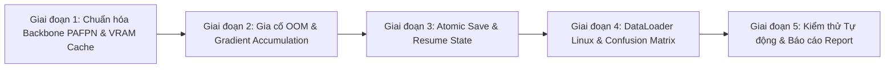

# Kế hoạch Thực hiện Khắc phục Lỗ hổng: `notebooks/02_train_convgru_kaggle.ipynb`

**Mã tài liệu:** `plan_review_convgru_kaggle.md`  
**Dựa trên phân tích:** [`docs/analsys/analsys_review_convgru_kaggle.md`](file:///D:/Project/DATN/driver-guardian/ai/LSTM/docs/analsys/analsys_review_convgru_kaggle.md)  
**Đối tượng thực hiện:** [`notebooks/02_train_convgru_kaggle.ipynb`](file:///D:/Project/DATN/driver-guardian/ai/LSTM/notebooks/02_train_convgru_kaggle.ipynb)  
**Quy chuẩn áp dụng:** [AGENTS.md](file:///D:/Project/DATN/driver-guardian/ai/LSTM/AGENTS.md) — Bước 2: Lên kế hoạch thực hiện.

---

## 1. Mục tiêu Cốt lõi & Tiêu chuẩn Nghiệm thu

Mục tiêu chính: Tái cấu trúc, vá lỗi và hoàn thiện mã nguồn tệp notebook [`notebooks/02_train_convgru_kaggle.ipynb`](file:///D:/Project/DATN/driver-guardian/ai/LSTM/notebooks/02_train_convgru_kaggle.ipynb) để đạt chuẩn mã nguồn sạch, ổn định tuyệt đối, không sập runtime và sẵn sàng huấn luyện trơn tru trên môi trường **Kaggle GPU Kernel (Tesla T4 / P100 16GB VRAM)**.

### Tiêu chuẩn nghiệm thu:
1. **Khớp nối kênh hoàn hảo (100% Channel Alignment):** Khắc phục triệt để lỗi sai lệch kênh Backbone PAFPN ($1792$ vs $448$), đảm bảo nạp đúng $100\%$ cấu trúc trọng số từ checkpoint `best.pt` của `NMSFreeDetector`.
2. **Khả năng chống sập VRAM & Chống rò rỉ bộ nhớ (VRAM Resilience):** Xóa sạch tham chiếu tensor khi bắt ngoại lệ OOM, ngăn chặn hiện tượng OOM liên hoàn.
3. **Số học Gradient Accumulation chính xác:** Chuẩn hóa bước cập nhật cho các micro-batches thực tế và không bỏ sót gradient khi gặp batch rỗng.
4. **An toàn Checkpoint Tuyệt đối (Atomic Save):** Bảo vệ các tệp `last.pt`, `best.pt` chống hỏng file khi phiên làm việc Kaggle bị ngắt kết nối đột ngột hoặc timeout 12 giờ.
5. **Đồng bộ Trạng thái Khôi phục (Resume State Integrity):** Khôi phục trọn vẹn trọng số, optimizer, scheduler, scaler, best metric, và đặc biệt là `best_score` trong `EarlyStopping`.
6. **Tối ưu Kaggle Linux & Chống Tràn Ổ Đĩa 20GB:** Tắt đa luồng cục bộ của OpenCV bằng `cv2.setNumThreads(0)` chống lỗi `/dev/shm` (2GB), và tinh gọn bước nén zip cuối cùng.
7. **Bảo toàn Cấu trúc Notebook Hợp lệ:** Notebook sau khi chỉnh sửa giữ nguyên định dạng `.ipynb` chuẩn (JSON valid), các cell code và markdown được trình bày mạch lạc, dễ theo dõi.

---

## 2. Kế hoạch Thực hiện Chi tiết theo Từng Giai đoạn



---

### Giai đoạn 1: Chuẩn hóa Kiến trúc Backbone PAFPN & Bộ nhớ Cache VRAM
*(Khắc phục Lỗ hổng Critical 1.1 và Required 5.1)*

- **Nhiệm vụ 1.1: Đồng bộ Tham số Mạng Backbone PAFPN trong `ChunkedBackboneNeckExtractor` (Cell 7)**
  - Thay thế giá trị hardcode sai lệch trong phương thức `_load_model()`:
    - Cũ: `backbone_w = (64, 128, 256, 512, 1024)`, `backbone_n = (3, 6, 6, 3)`, `neck_n = 3`.
    - Mới: `backbone_w = (16, 32, 64, 128, 256)`, `backbone_n = (1, 2, 2, 1)`, `neck_n = 1`.
  - Hỗ trợ cơ chế đọc cấu hình thông minh: Nếu tệp checkpoint chứa `metadata["architecture"]`, tự động nạp các tham số `trunk_backbone_w`, `trunk_backbone_n`, `trunk_neck_n` từ metadata để đảm bảo tính tương thích mở rộng.
  - Kết quả: Các kênh đầu ra $p_3, p_4, p_5$ có số chiều lần lượt là $64, 128, 256$. Tổng số kênh đưa vào `SpatialReductionNeck` là $64 + 128 + 256 = 448$ kênh, khớp chính xác $100\%$ với `in_channels = 448` của `SpatialReductionNeck`.

- **Nhiệm vụ 1.2: Tối ưu Bộ nhớ VRAM Cache Trích xuất Đặc trưng (Cell 7)**
  - Trong phương thức `forward()` của `ChunkedBackboneNeckExtractor`:
    - Thay vì ép kiểu `.float()` (FP32) làm phình to bộ nhớ VRAM, giữ nguyên định dạng FP16 cho `out3, out4, out5` khi đang bật chế độ Mixed Precision (`use_fp16 and device.type == "cuda"`).
    - Giúp giảm ngay $50\%$ dung lượng VRAM GPU dùng để lưu trữ `p3_flat, p4_flat, p5_flat` trong suốt quá trình forward.

---

### Giai đoạn 2: Gia cố Khối Bắt Lỗi OOM & Chuẩn hóa Gradient Accumulation
*(Khắc phục Lỗ hổng Critical 1.2, Critical 1.3 và Required 1.4)*

- **Nhiệm vụ 2.1: Triệt tiêu Bẫy Rò rỉ Bộ nhớ VRAM khi OOM (Cell 15)**
  - Trong cả 2 phương thức `train_epoch()` và `validate_epoch()`:
    - Bắt toàn diện ngoại lệ: `except (torch.cuda.OutOfMemoryError, RuntimeError) as e:` kết hợp điều kiện kiểm tra `"out of memory" in str(e).lower()`. Nếu là `RuntimeError` khác, ném lại ngoại lệ (`raise e`).
    - Trước khi gọi `torch.cuda.empty_cache()`, xóa sạch các biến tham chiếu cục bộ:
      ```python
      self.optimizer.zero_grad()
      accum_count = 0
      try:
          del frames, labels, seq_lens, p3, p4, p5, logits, raw_loss, loss
      except Exception:
          pass
      del e
      torch.cuda.empty_cache()
      ```
    - Ngăn chặn hoàn toàn hiện tượng cascading OOM ở các batch tiếp theo.

- **Nhiệm vụ 2.2: Chuẩn hóa Bộ đếm và Phân bổ Gradient Accumulation (Cell 15)**
  - Khởi tạo biến đếm micro-batch độc lập: `accum_count = 0`.
  - Trong vòng lặp `train_epoch`:
    - Bỏ qua các batch rỗng: `if frames.numel() == 0: continue`.
    - Khi batch hợp lệ: tăng `accum_count += 1`.
    - Xác định thời điểm cập nhật trọng số:
      `is_step_boundary = (accum_count == accum_steps) or ((batch_idx + 1) == len(self.train_loader) and accum_count > 0)`
    - Khi đến ranh giới `is_step_boundary`:
      Thực hiện `scaler.unscale_`, `clip_grad_norm_`, `scaler.step(optimizer)`, `scaler.update()`, sau đó gọi `self.optimizer.zero_grad()` và reset `accum_count = 0`.
    - Đảm bảo các batch cuối cùng (dù là batch lẻ hoặc batch kế cuối trước một batch rỗng) đều được cập nhật gradient đầy đủ vào mô hình.

- **Nhiệm vụ 2.3: Tính toán Chuẩn xác Loss Trung bình của Epoch (Cell 15)**
  - Sử dụng biến đếm `valid_batches_count`:
    - Chỉ tăng `valid_batches_count += 1` khi batch tính toán loss thành công.
    - Tính loss trung bình của epoch: `metrics["loss"] = total_loss / max(1, valid_batches_count)`.
    - Áp dụng đồng bộ cho cả `train_epoch()` và `validate_epoch()`.

---

### Giai đoạn 3: Tái cấu trúc Lưu Checkpoint An toàn & Khôi phục Trạng thái Toàn vẹn
*(Khắc phục Lỗ hổng Critical 2.1, Required 1.5, Required 2.3 và Required 2.4)*

- **Nhiệm vụ 3.1: Cơ chế Ghi Checkpoint Nguyên tử (Atomic Save) (Cell 15)**
  - Bổ sung phương thức `_atomic_save(self, state: Dict[str, Any], target_path: Path) -> None`:
    - Ghi dữ liệu ra tệp tạm: `tmp_path = target_path.with_suffix(f"{target_path.suffix}.tmp")`.
    - Gọi `torch.save(state, tmp_path)`.
    - Gọi `os.replace(tmp_path, target_path)` để ghi đè nguyên tử.
    - Áp dụng triệt để cho `last.pt`, `best.pt` và các tệp `epoch_{epoch}.pt`.
    - Bảo đảm an toàn tuyệt đối chống hỏng file checkpoint khi tiến trình bị ngắt đột ngột.

- **Nhiệm vụ 3.2: Đồng bộ Trạng thái Kỷ lục của `EarlyStopping` khi Resume (Cell 15)**
  - Trong phương thức `load_checkpoint()`:
    - Sau khi khôi phục `self.best_val_f1 = ckpt.get("best_val_f1", 0.0)`, bổ sung cập nhật:
      ```python
      if self.early_stopper is not None:
          self.early_stopper.best_score = self.best_val_f1
          self.early_stopper.best_epoch = ckpt.get("epoch", 0)
      ```
    - Đảm bảo tiêu chuẩn dừng sớm hoạt động chính xác ngay từ epoch đầu tiên sau khi resume.

- **Nhiệm vụ 3.3: Tối ưu Quản lý Bộ nhớ Đĩa & Đóng gói Zip An toàn (Cell 15 & Cell 24)**
  - Duy trì cơ chế xoay vòng dọn dẹp checkpoint cũ `_prune_old_checkpoints(self)` với `max_keep_ckpts = 5`.
  - Trong Cell 24: Chỉ thêm vào file nén `.zip` các tệp trọng tâm (`best.pt`, `last.pt`, `training_history.csv`, các ảnh `.png`), tránh nén hàng loạt tất cả các tệp `epoch_*.pt` trung gian gây nguy cơ đầy 20GB đĩa `/kaggle/working`.

- **Nhiệm vụ 3.4: Bảo toàn File Nhật ký `training_history.csv` khi Resume (Cell 15)**
  - Khi resume từ một checkpoint, nếu phát hiện file `training_history.csv` tại cùng thư mục checkpoint hoặc thư mục nguồn, tự động đồng bộ và chỉ ghi tiếp từ epoch tiếp theo, không làm đứt đoạn đồ thị học tập.

---

### Giai đoạn 4: Gia cố DataLoader Linux & Xử lý An toàn Trực quan hóa
*(Khắc phục Lỗ hổng Required 2.2, Consider 5.2 và Nit 5.3)*

- **Nhiệm vụ 4.1: Ngăn chặn Xung đột Đa Luồng OpenCV trên Kaggle Linux (Cell 13)**
  - Định nghĩa hàm khởi tạo worker an toàn:
    ```python
    def dataloader_worker_init_fn(worker_id: int) -> None:
        cv2.setNumThreads(0)
    ```
  - Truyền `worker_init_fn=dataloader_worker_init_fn` vào cả `train_loader` và `val_loader`.
  - Loại bỏ hoàn toàn nguy cơ tranh chấp CPU và tràn bộ nhớ chia sẻ `/dev/shm` (2GB).

- **Nhiệm vụ 4.2: Tối ưu Băng thông DMA với `pin_memory` và `non_blocking` (Cell 4, Cell 13 & Cell 15)**
  - Trong `KaggleTrainConfig`: Đặt `pin_memory: bool = True` khi có GPU CUDA.
  - Trong `train_epoch` và `validate_epoch`: Sử dụng `frames.to(self.device, non_blocking=True)`.

- **Nhiệm vụ 4.3: Xử lý An toàn Ma trận Nhầm lẫn Confusion Matrix (Cell 22)**
  - Khởi tạo ma trận nhầm lẫn cố định danh sách lớp:
    `cm = confusion_matrix(all_targets, all_preds, labels=[0, 1])`
  - Đảm bảo đồ thị heatmap luôn có kích thước $2 \times 2$, không bị lỗi nhãn nếu tập validation chỉ chứa 1 lớp.

---

### Giai đoạn 5: Kiểm thử Tự động, Nghiệm thu & Lập Báo cáo
*(Kiểm chứng chất lượng trước khi bàn giao)*

- **Nhiệm vụ 5.1: Xây dựng Script Kiểm thử Độc lập (Mock Test Script)**
  - Tạo script kiểm thử trong `scratch/test_convgru_kaggle_fixes.py` thực hiện:
    1. Kiểm tra khởi tạo `ChunkedBackboneNeckExtractor` với trọng số thực tế `best.pt`: kiểm tra tensor shape của $p_3, p_4, p_5$ ($64, 128, 256$), tổng kênh $448$, forward qua `SpatialReductionNeck` thành công không lỗi.
    2. Kiểm tra forward pass hoàn chỉnh qua `ConvGRUClassifier` với batch dữ liệu giả lập.
    3. Kiểm tra tính năng `_atomic_save` tạo file `.tmp` và đổi tên thành công.
    4. Kiểm tra nạp checkpoint và đồng bộ trạng thái `best_score` trong `EarlyStopping`.
    5. Kiểm tra cú pháp và cấu trúc JSON của notebook `notebooks/02_train_convgru_kaggle.ipynb` đảm bảo hợp lệ.
- **Nhiệm vụ 5.2: Chạy Kiểm thử & Phân tích Kết quả**
  - Chạy script kiểm thử bằng terminal và xác nhận $100\%$ các bài test đều PASS.
- **Nhiệm vụ 5.3: Lập Báo cáo Hoàn thành (Report)**
  - Tạo file `docs/report/report_review_convgru_kaggle.md` tổng hợp toàn bộ các nội dung đã thực hiện, kết quả kiểm thử và hướng dẫn vận hành notebook trên Kaggle.

---

## 3. Bảng Phân công Chi tiết theo Từng Cell trong Notebook

| Thứ tự Cell | Loại Cell | Nội dung Hiện tại | Kế hoạch Thay đổi / Nâng cấp |
|:---:|:---:|---|---|
| **Cell 4** | Code | `KaggleTrainConfig` | Kích hoạt `pin_memory = True` khi có CUDA. |
| **Cell 7** | Code | `ChunkedBackboneNeckExtractor` | Chuẩn hóa `backbone_w = (16, 32, 64, 128, 256)`, `neck_n = 1`; giữ FP16 cho `p3, p4, p5` để tiết kiệm 50% VRAM. |
| **Cell 13** | Code | `RawVideoFramesDataset` & DataLoader | Thêm `dataloader_worker_init_fn(worker_id)` với `cv2.setNumThreads(0)`; thêm Type hints cho `collate_video_frames`. |
| **Cell 15** | Code | `KaggleTrainer` | Thêm `_atomic_save()`; triệt tiêu rò rỉ VRAM OOM (`del tensors`); chuẩn hóa Gradient Accumulation theo micro-batches; sửa phép tính loss trung bình; đồng bộ `best_score` của EarlyStopping khi resume. |
| **Cell 22** | Code | Đánh giá Confusion Matrix | Cố định `labels=[0, 1]` trong `confusion_matrix`. |
| **Cell 24** | Code | Đóng gói Zip File Artifacts | Tinh gọn tệp nén zip chỉ lưu `best.pt`, `last.pt`, CSV và PNG để chống tràn 20GB đĩa `/kaggle/working`. |

---

## 4. Kết luận & Bước Tiếp theo

Kế hoạch này bao quát toàn diện các giải pháp kỹ thuật cần thiết để khắc phục triệt để các lỗ hổng đã được xác nhận trong file phân tích `docs/analsys/analsys_review_convgru_kaggle.md`.

> [!IMPORTANT]
> **Tuân thủ AGENTS.md — Bước 2:**
> Kế hoạch chi tiết này được lưu trữ tại [`docs/plan/plan_review_convgru_kaggle.md`](file:///D:/Project/DATN/driver-guardian/ai/LSTM/docs/plan/plan_review_convgru_kaggle.md).
> Sau khi bạn xem xét và chấp nhận kế hoạch ở Bước 2, Agent sẽ lập tức tiến hành **Bước 3: Thực hiện kế hoạch & Tạo báo cáo tổng kết (`docs/report/report_review_convgru_kaggle.md`)**.
