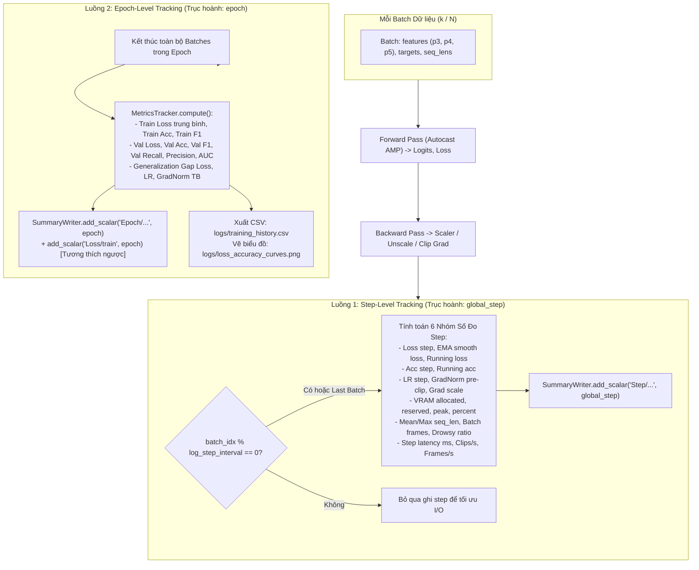
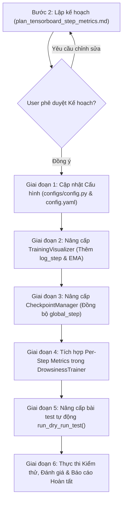

# KẾ HOẠCH TRIỂN KHAI: THIẾT KẾ VÀ TÍCH HỢP HỆ THỐNG SỐ ĐO GIÁM SÁT THEO TỪNG STEP (PER-STEP METRICS) TRÊN TENSORBOARD

> **Tài liệu:** `docs/plan/plan_tensorboard_step_metrics.md`  
> **Kế thừa từ:** `docs/analsys/analsys_tensorboard_step_metrics.md`  
> **Nhiệm vụ:** Thiết lập kiến trúc Giám sát Kép (Dual-Track Monitoring) trên TensorBoard: **Bảo toàn 100% các giá trị trung bình sau mỗi Epoch** (Epoch-level metrics, CSV history, loss/accuracy curves), đồng thời **bổ sung toàn diện 6 nhóm số đo cấp độ từng Step** (Per-step metrics: Loss tức thời, Smooth EMA Loss, Running Loss, Batch/Running Accuracy, Step LR, GradNorm pre-clip, Grad Scale, VRAM Real-time, Dynamic Sequence Dynamics, Pipeline Throughput), hoàn thiện cơ chế đồng bộ biến `global_step` và bộ đệm I/O chống nghẽn đĩa.  
> **Tuân thủ quy trình:** Bước 2 - Lên kế hoạch thực hiện (Planning) theo `AGENTS.md`.

---

## 1. Mục tiêu và Nguyên tắc Triển khai

### 1.1. Mục tiêu Cốt lõi
1. **Bảo toàn Tuyệt đối Cơ chế Giám sát Trung bình theo Epoch (Yêu cầu trọng tâm từ User):**
   - Vẫn duy trì nguyên vẹn việc tính toán và ghi nhận các chỉ số trung bình toàn epoch (`train_loss`, `val_loss`, `train_acc`, `val_acc`, `train_f1`, `val_f1`, `val_precision`, `val_recall`, `val_specificity`, `val_auc_roc`, `val_auc_pr`, `gap_loss`, `gap_f1`, `epoch_time_s`).
   - Giữ nguyên các tệp xuất ra phục vụ báo cáo và luận văn: `logs/training_history.csv`, `logs/training_summary.json`, `logs/loss_accuracy_curves.png`, `logs/confusion_matrix_best.png`, `logs/roc_pr_curves.png`.
   - Giữ nguyên tính tương thích ngược của các scalar tag epoch trên TensorBoard (`Loss/train`, `Loss/val`, `Accuracy/train`, `Accuracy/val`, v.v.).

2. **Xây dựng Hệ thống Giám sát Phân giải Cao theo Từng Step (Per-Step Metrics):**
   - Giám sát thời gian thực mọi biến động trong quá trình huấn luyện mà không cần chờ 3.25 giờ để hết 1 epoch.
   - Ghi nhận đầy đủ 6 nhóm chỉ số kỹ thuật: Mất mát tức thời & EMA Loss, Độ chính xác phân loại, Trạng thái tối ưu & Gradient Norm trước khi clip, Tài nguyên VRAM phần cứng (Allocated/Reserved/Peak), Động học chuỗi khung hình video thô ($T$ động), và Thông lượng thực thi (Latency ms/step, Throughput samples/s, frames/s).

3. **Cơ chế Quản lý Biến `global_step` Liền Mạch & An toàn khi Resume:**
   - Đảm bảo biến `global_step` tăng tịnh tiến liên tục qua các epoch:
     $$\text{global\_step} = (E - 1) \times N_{\text{batches}} + k$$
   - Lưu trữ `global_step` vào payload checkpoint (`.pt`).
   - Khi tiếp tục huấn luyện (`enable_resume: true`), khôi phục chính xác `global_step` từ checkpoint hoặc tự động suy luận an toàn nếu checkpoint cũ chưa có trường này.

4. **Tối ưu Hiệu năng I/O (I/O Buffer & Configurable Intervals):**
   - Tránh việc ghi đĩa ở từng step gây thắt cổ chai GPU thông qua tham số cấu hình:
     - `log_step_interval: int = 5` (ghi mỗi 5 steps và luôn ghi ở batch cuối cùng của epoch).
     - `flush_step_interval: int = 50` (xả đệm SummaryWriter xuống đĩa định kỳ mỗi 50 steps và tại biên epoch).

5. **Xác thực Tự động (Automated Dry-Run Verification):**
   - Cập nhật hàm `run_dry_run_test()` để kiểm tra tự động việc tạo log TensorBoard, kiểm tra tính đúng đắn của dữ liệu scalar tags cả 2 cấp độ (Epoch và Step), đảm bảo 0 lỗi crash và 0 rò rỉ bộ nhớ.

---

## 2. Kiến trúc Giám sát Kép (Dual-Track Logging Architecture)

Hệ thống ghi log TensorBoard sẽ vận hành theo mô hình phân tách namespace rõ ràng:



### 2.1. Cấu trúc Cây Thư mục Scalar Tags trên TensorBoard

```text
TensorBoard SummaryWriter
│
├── Epoch/ (Trục hoành: Epoch 1, 2, 3...) [BẢO TOÀN NGUYÊN BẢN]
│   ├── Loss/Train                          # Loss trung bình tập huấn luyện
│   ├── Loss/Val                            # Loss trung bình tập kiểm định
│   ├── Accuracy/Train                      # Accuracy trung bình huấn luyện
│   ├── Accuracy/Val                        # Accuracy trung bình kiểm định
│   ├── F1_Drowsy/Train & F1_Drowsy/Val     # F1 score tài xế buồn ngủ
│   ├── Precision_Drowsy/Val                # Precision phát hiện buồn ngủ
│   ├── Recall_Drowsy/Val                   # Recall phát hiện buồn ngủ
│   ├── Specificity_Alert/Val               # Specificity nhận diện tỉnh táo
│   ├── AUC_ROC/Val & AUC_PR/Val            # Diện tích dưới đường cong ROC & PR
│   ├── Diagnostics/Generalization_Gap_Loss # Khoảng cách Val Loss - Train Loss
│   ├── LearningRate                        # Tốc độ học tại cuối epoch
│   └── GradNorm                            # Gradient Norm trung bình epoch
│
└── Step/ (Trục hoành: Global Step 1, 5, 10, ... 616...) [BỔ SUNG MỚI]
    ├── Loss/
    │   ├── train_step                      # Loss tức thời của batch hiện tại
    │   ├── train_smooth_ema                # EMA Loss làm mượt (beta = 0.95)
    │   └── train_running                   # Loss trung bình tích lũy trong epoch
    ├── Accuracy/
    │   ├── train_step                      # Accuracy tức thời của batch hiện tại (%)
    │   └── train_running                   # Accuracy tích lũy từ đầu epoch (%)
    ├── Optimizer/
    │   ├── lr_step                         # Learning rate tại step hiện tại
    │   ├── grad_norm_preclip               # Chuẩn L2 của gradients trước khi clip
    │   └── grad_scale                      # Hệ số tỷ lệ GradScaler (AMP FP16)
    ├── System/
    │   ├── vram_allocated_gb               # VRAM thực tế tensors chiếm dụng (GB)
    │   ├── vram_reserved_gb                # VRAM caching allocator giữ (GB)
    │   ├── vram_peak_gb                    # Đỉnh VRAM cao nhất ghi nhận (GB)
    │   └── vram_percent                    # Phần trăm VRAM sử dụng / Tổng VRAM
    ├── Data/
    │   ├── seq_len_mean                    # Độ dài khung hình trung bình trong batch
    │   ├── seq_len_max                     # Độ dài khung hình lớn nhất trong batch
    │   ├── batch_total_frames              # Tổng số frame video trong batch
    │   └── drowsy_ratio                    # Tỷ lệ nhãn dương (Buồn ngủ) trong batch
    └── Perf/
        ├── step_time_ms                    # Thời gian xử lý 1 step (mili-giây)
        ├── throughput_samples_per_sec      # Tốc độ huấn luyện (video clips / giây)
        └── throughput_frames_per_sec       # Tốc độ xử lý khung hình (frames / giây)
```

---

## 3. Quy trình Triển khai Chi tiết theo Từng Giai đoạn



---

### Giai đoạn 1: Cập nhật Cấu hình Tập trung (`configs/config.py` & `configs/config.yaml`)

#### 1.1. Cập nhật `configs/config.py` (`TrainConfig`)
Bổ sung các tham số mới vào nhóm cấu hình giám sát & ghi log:
```python
# Cấu hình tần suất và cơ chế ghi nhận log cấp độ Step
enable_step_logging: bool = True  # Bật/tắt tính toán và ghi nhận per-step metrics lên TensorBoard
log_step_interval: int = 5  # Số batch steps giữa các lần ghi TensorBoard (mặc định = 5)
flush_step_interval: int = 50  # Số batch steps giữa các lần flush đĩa SummaryWriter (mặc định = 50)
ema_beta: float = 0.95  # Hệ số làm mượt hàm mất mát Exponential Moving Average (EMA)
```
- Bổ sung validation ràng buộc trong `TrainConfig.__post_init__`:
  ```python
  assert self.log_step_interval >= 1, "log_step_interval phải >= 1"
  assert self.flush_step_interval >= 1, "flush_step_interval phải >= 1"
  assert 0.0 < self.ema_beta < 1.0, "ema_beta phải nằm trong khoảng (0, 1)"
  ```

#### 1.2. Cập nhật `configs/config.yaml`
Thêm các khóa cấu hình tương ứng trong section `logging:`:
```yaml
logging:
  tb_log_dir: "logs/tensorboard"
  log_dir: "logs"
  experiment_name: "deepgru_raw_nmsfree"
  checkpoint_dir: "checkpoints/experiments"
  save_all_epochs: true
  save_ckpt_interval_epochs: 1
  save_best_only: false
  ckpt_keep_last: null
  enable_resume: false
  resume_epoch: null
  resume: ""
  
  # Cấu hình Giám sát Phân giải cao theo từng Step (Per-Step Metrics)
  enable_step_logging: true
  log_step_interval: 5
  flush_step_interval: 50
  ema_beta: 0.95
```

---

### Giai đoạn 2: Nâng cấp `TrainingVisualizer` trong `src/train.py`

#### 2.1. Quản lý trạng thái EMA Loss trong `TrainingVisualizer`
Bổ sung thuộc tính `_ema_loss: Optional[float] = None` trong `TrainingVisualizer.__init__()`.
Cung cấp phương thức làm mượt:
```python
def update_ema_loss(self, current_loss: float, beta: float = 0.95) -> float:
    if self._ema_loss is None:
        self._ema_loss = current_loss
    else:
        self._ema_loss = beta * self._ema_loss + (1.0 - beta) * current_loss
    return self._ema_loss
```

#### 2.2. Xây dựng phương thức `log_step()`
Thêm phương thức `log_step(self, global_step: int, metrics: Dict[str, float]) -> None`:
- Ghi nhận tất cả các scalar có trong từ điển `metrics` vào TensorBoard với trục hoành là `global_step`.
- Định tuyến các tag vào đúng cấu trúc phân cấp:
  - `Step/Loss/train_step`, `Step/Loss/train_smooth_ema`, `Step/Loss/train_running`
  - `Step/Accuracy/train_step`, `Step/Accuracy/train_running`
  - `Step/Optimizer/lr_step`, `Step/Optimizer/grad_norm_preclip`, `Step/Optimizer/grad_scale`
  - `Step/System/vram_allocated_gb`, `Step/System/vram_reserved_gb`, `Step/System/vram_peak_gb`, `Step/System/vram_percent`
  - `Step/Data/seq_len_mean`, `Step/Data/seq_len_max`, `Step/Data/batch_total_frames`, `Step/Data/drowsy_ratio`
  - `Step/Perf/step_time_ms`, `Step/Perf/throughput_samples_per_sec`, `Step/Perf/throughput_frames_per_sec`

#### 2.3. Bổ sung phương thức `flush()`
Cung cấp phương thức `flush(self) -> None`:
```python
def flush(self) -> None:
    """Xả bộ đệm ghi sự kiện TensorBoard xuống đĩa cứng."""
    if self.tb_writer is not None:
        try:
            self.tb_writer.flush()
        except Exception:
            pass
```

#### 2.4. Bảo toàn phương thức `log_epoch()`
Giữ nguyên 100% logic của `log_epoch()`, ghi đầy đủ các scalar tag Epoch như trước đây để đảm bảo giao diện đồ thị Epoch và tệp `training_history.csv` hoàn toàn không bị ảnh hưởng.

---

### Giai đoạn 3: Nâng cấp `CheckpointManager` trong `src/train.py`

#### 3.1. Lưu `global_step` vào Checkpoint
Trong phương thức `CheckpointManager.step()`:
- Bổ sung tham số `global_step: int = 0`.
- Đưa `global_step` vào từ điển `checkpoint_data`:
  ```python
  checkpoint_data: Dict[str, Any] = {
      "epoch": epoch,
      "global_step": global_step,
      "best_epoch": self.best_epoch,
      # ...
  }
  ```

#### 3.2. Khôi phục `global_step` khi Resume
Trong phương thức `CheckpointManager.load_checkpoint()`:
- Đọc giá trị `global_step` từ checkpoint đã nạp:
  ```python
  resumed_global_step = checkpoint.get("global_step", None)
  ```
- Trả về tuple hoặc lưu trực tiếp vào thuộc tính của manager để `DrowsinessTrainer` khôi phục:
  ```python
  self.last_resumed_global_step = resumed_global_step
  ```
- Nếu `resumed_global_step is None` (áp dụng cho các checkpoint cũ được tạo trước khi nâng cấp):
  - Tự động fallback: `fallback_step = resumed_epoch * total_batches`.
  - Ghi log thông báo chi tiết cho người vận hành.

---

### Giai đoạn 4: Tích hợp Tính toán & Ghi nhận Số Đo Step trong `DrowsinessTrainer`

#### 4.1. Khởi tạo & Đồng bộ `self.global_step`
Trong `DrowsinessTrainer.__init__()`:
```python
self.global_step = 0
if enable_resume and hasattr(self.checkpoint_manager, "last_resumed_global_step"):
    if self.checkpoint_manager.last_resumed_global_step is not None:
        self.global_step = self.checkpoint_manager.last_resumed_global_step
        self.logger.info(f"    [+] Đã khôi phục biến global_step = {self.global_step} từ checkpoint.")
    else:
        # Fallback tính theo số epoch đã hoàn tất
        num_batches = len(self.train_loader) if hasattr(self, "train_loader") else 0
        self.global_step = (self.start_epoch - 1) * num_batches
        self.logger.info(f"    [*] Checkpoint cũ không có global_step, tự động ước tính global_step = {self.global_step}.")
```

#### 4.2. Tính toán & Ghi nhận trong `train_one_epoch()`
Tại mỗi batch trong vòng lặp huấn luyện của `train_one_epoch(self, epoch: int)`:
1. **Tăng biến đếm bước:** `self.global_step += 1`.
2. **Đo thời gian:** Ghi nhận mốc thời gian bắt đầu batch `step_start_time = time.perf_counter()`.
3. **Thu thập thông tin Gradients:**
   - Lấy `grad_norm_preclip = float(gnorm.item())` tại thời điểm cắt tỉa đạo hàm.
   - Lấy giá trị `grad_scale = float(self.scaler.get_scale())` nếu đang sử dụng AMP.
4. **Tính toán Động học Dữ liệu (Sequence & Data Dynamics):**
   - `seq_lens_list = seq_lens.tolist()`
   - `seq_len_mean = float(np.mean(seq_lens_list))`
   - `seq_len_max = float(np.max(seq_lens_list))`
   - `batch_total_frames = int(np.sum(seq_lens_list))`
   - `drowsy_ratio = float((targets == 1).sum().item()) / float(max(1, targets.numel()))`
5. **Đo lường Thông lượng & Độ trễ (Throughput & Latency):**
   - `step_duration_s = max(1e-5, time.perf_counter() - step_start_time)`
   - `step_time_ms = step_duration_s * 1000.0`
   - `samples_per_sec = float(p3.size(0)) / step_duration_s`
   - `frames_per_sec = float(batch_total_frames) / step_duration_s`
6. **Thu thập Chỉ số VRAM (System Resources):**
   - Sử dụng `get_vram_info(self.device)` để lấy:
     - `vram_allocated_gb`, `vram_reserved_gb`, `vram_peak_gb`, `vram_percent`.
7. **Cập nhật EMA Loss & Ghi nhận TensorBoard:**
   - Điều kiện ghi: `(batch_idx % self.config.log_step_interval == 0) or (batch_idx == total_batches)`.
   - Tính `smooth_loss = self.visualizer.update_ema_loss(loss_val, beta=self.config.ema_beta)`.
   - Đóng gói từ điển `step_metrics` và gọi:
     ```python
     self.visualizer.log_step(self.global_step, step_metrics)
     ```
8. **Xả bộ đệm đĩa (Flush):**
   - Gọi `self.visualizer.flush()` nếu `batch_idx % self.config.flush_step_interval == 0` hoặc khi kết thúc epoch.

---

### Giai đoạn 5: Đồng bộ `train.py` & Nâng cấp Bài Test Tự động `run_dry_run_test()`

1. **Đồng bộ hóa trong `train.py`:**
   - Đảm bảo các hàm tiện ích và biến môi trường luôn sẵn sàng.
2. **Nâng cấp `run_dry_run_test()` trong `src/train.py`:**
   - Bổ sung tham số cấu hình:
     - `enable_step_logging=True`
     - `log_step_interval=1` (để mọi step trong bài dryrun đều được ghi nhận)
     - `flush_step_interval=2`
   - Bổ sung các bước kiểm tra (Asserts) tự động sau khi chạy xong `trainer.fit()`:
     - Kiểm tra thư mục TensorBoard có tệp sự kiện hợp lệ (`events.out.tfevents.*`).
     - Đọc nội dung tệp sự kiện bằng `tensorboard.backend.event_processing.event_accumulator.EventAccumulator` (hoặc PyTorch Event Reader).
     - Kiểm tra sự hiện diện của ít nhất một scalar thuộc namespace `Step/Loss/train_step` và `Step/System/vram_allocated_gb`.
     - Kiểm tra sự hiện diện của scalar `Epoch/Loss/Train` (hoặc `Loss/Train`).
     - Kiểm tra checkpoint lưu giữ đúng trường `global_step`.
   - In thông báo xác nhận thành công rực rỡ nếu toàn bộ các bài kiểm tra đều vượt qua.

---

### Giai đoạn 6: Thực thi Kiểm thử, Đánh giá Kết quả & Lập Báo cáo Hoàn tất

1. Chạy bài kiểm thử dry-run trực tiếp:
   ```powershell
   python -c "from src.train import run_dry_run_test; run_dry_run_test()"
   ```
2. Kiểm tra tính toàn vẹn của mã nguồn: không sinh cảnh báo deprecation, không lỗi cú pháp, tương thích Windows/Linux.
3. Soạn thảo tài liệu báo cáo nghiệm thu hoàn tất `docs/report/report_tensorboard_step_metrics.md` theo quy định tại `AGENTS.md`.

---

## 4. Bảng Kế hoạch Phân rã Công việc & Thời gian Dự kiến

| Giai đoạn | Công việc Cụ thể | Tệp Tác động | Sản phẩm Đầu ra | Thời gian Dự kiến |
| :---: | :--- | :--- | :--- | :---: |
| **Giai đoạn 1** | Bổ sung tham số cấu hình Step Logging & Validation | `configs/config.py`<br/>`configs/config.yaml` | Cấu hình tập trung `log_step_interval`, `flush_step_interval`, `enable_step_logging`, `ema_beta` | 15 phút |
| **Giai đoạn 2** | Thêm phương thức `log_step`, `flush`, `update_ema_loss` | `src/train.py` (`TrainingVisualizer`) | `TrainingVisualizer` hỗ trợ ghi nhận kép đa tầng | 25 phút |
| **Giai đoạn 3** | Lưu và khôi phục `global_step` trong Checkpoint | `src/train.py` (`CheckpointManager`) | Checkpoint `.pt` chứa `global_step`, hỗ trợ resume liền mạch đồ thị | 20 phút |
| **Giai đoạn 4** | Tính toán & ghi nhận 6 nhóm chỉ số trong vòng lặp batch | `src/train.py` (`DrowsinessTrainer`) | `train_one_epoch()` đo lường và phát scalar sang TensorBoard định kỳ | 35 phút |
| **Giai đoạn 5** | Nâng cấp test case dry-run xác thực tự động | `src/train.py` (`run_dry_run_test`) | Bài test độc lập kiểm tra tệp sự kiện và checkpoint | 20 phút |
| **Giai đoạn 6** | Chạy kiểm thử tự động & Soạn thảo báo cáo nghiệm thu | `docs/report/report_tensorboard_step_metrics.md` | Báo cáo hoàn tất Bước 3 theo `AGENTS.md` | 20 phút |
| **TỔNG CỘNG** | **Quy trình Hoàn thiện Toàn diện Hệ thống Step Metrics** | **4 tệp cốt lõi** | **Hệ thống giám sát Real-time chuẩn mực** | **~2 giờ 15 phút** |

---

## 5. Tiêu chí Nghiệm thu Chất lượng (Checklist Tuân thủ `AGENTS.md`)

Trước khi kết thúc Bước 3, hệ thống phải đáp ứng 100% các tiêu chí sau:

- [ ] **Bảo toàn 100% Epoch-Level Metrics:** Giá trị trung bình của từng epoch (`train_loss`, `val_loss`, `accuracy`, `f1`, `gap_loss`, v.v.) tiếp tục được ghi nhận đầy đủ, không thay đổi khuôn mẫu dữ liệu của `training_history.csv` và `loss_accuracy_curves.png`.
- [ ] **Đầy đủ 6 Nhóm Chỉ số Step-Level:** TensorBoard hiển thị rõ ràng 6 thư mục con trong namespace `Step/` (`Loss/`, `Accuracy/`, `Optimizer/`, `System/`, `Data/`, `Perf/`).
- [ ] **Không gây CUDA Sync Bottleneck:** Các phép trích xuất số liệu không gọi `.item()` trên các tensor trung gian không cần thiết, đảm bảo luồng pipeline GPU chạy với tốc độ tối đa.
- [ ] **Khả năng Resume Liền Mạch:** Khi huấn luyện tiếp tục từ checkpoint, trục hoành `global_step` không bị reset về 0 mà vẽ tiếp nối liên tục từ step cuối cùng của epoch trước.
- [ ] **Chống Nghẽn I/O:** Tần suất ghi nhận tuân thủ đúng `log_step_interval = 5` và `flush_step_interval = 50`, giúp kích thước file `tfevents` gọn gàng, không gây giật lag ổ cứng.
- [ ] **Kiểm thử Tự động 100% Thành công:** Bài test `run_dry_run_test()` thực thi trơn tru từ đầu đến cuối mà không phát sinh bất kỳ ngoại lệ nào.
- [ ] **Đường dẫn Chuẩn Đa Nền tảng:** Sử dụng `pathlib.Path` cho toàn bộ các thao tác thư mục và tệp tin.

---

## 6. Đề xuất Thực hiện Tiếp theo

Tài liệu kế hoạch này đã sẵn sàng để người dùng xem xét:
- **Nếu Quý người dùng chấp thuận kế hoạch này:** Agent sẽ tiến hành **Bước 3: Thực hiện kế hoạch**, bắt đầu cập nhật cấu hình và mã nguồn từ Giai đoạn 1 đến Giai đoạn 6, sau đó biên soạn báo cáo nghiệm thu `docs/report/report_tensorboard_step_metrics.md`.
- **Nếu cần điều chỉnh:** Người dùng có thể yêu cầu thay đổi bất kỳ tham số, tên tag, hoặc tần suất ghi nhận nào trước khi tiến hành viết code.
