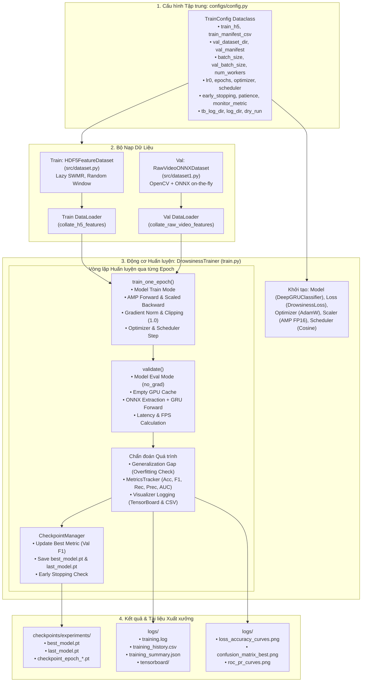

# KẾ HOẠCH TRIỂN KHAI XÂY DỰNG PIPELINE HUẤN LUYỆN, ĐÁNH GIÁ KẾT QUẢ & QUÁ TRÌNH HUẤN LUYỆN MÔ HÌNH NHẬN DIỆN BUỒN NGỦ

**Mã tài liệu:** `plan_train_pipeline.md`  
**Dự án:** Hệ Thống Nhận Diện Tài Xế Buồn Ngủ (Driver Guardian - Deep GRU / LSTM)  
**Tệp mục tiêu:** [`train.py`](file:///D:/Project/DATN/driver-guardian/ai/LSTM/train.py)  
**Tệp cấu hình phụ trợ:** [`configs/config.py`](file:///D:/Project/DATN/driver-guardian/ai/LSTM/configs/config.py) & [`configs/config.yaml`](file:///D:/Project/DATN/driver-guardian/ai/LSTM/configs/config.yaml)  
**Căn cứ phân tích:** [`docs/analsys_train_pipeline.md`](file:///D:/Project/DATN/driver-guardian/ai/LSTM/docs/analsys_train_pipeline.md)  
**Quy chuẩn áp dụng:** [`AGENTS.md`](file:///D:/Project/DATN/driver-guardian/ai/LSTM/AGENTS.md) — Bước 2: Lên kế hoạch thực hiện  
**Ngày lập:** 03/10/2026  

---

## 1. MỤC TIÊU & NGUYÊN TẮC KỸ THUẬT CỐT LÕI

### 1.1. Mục tiêu triển khai
1. **Xây dựng Pipeline Huấn luyện Toàn diện ([`train.py`](file:///D:/Project/DATN/driver-guardian/ai/LSTM/train.py)):**
   - **Tập Train:** Nạp bản đồ đặc trưng không gian $p_3, p_4, p_5$ từ tệp HDF5 qua [`HDF5FeatureDataset`](file:///D:/Project/DATN/driver-guardian/ai/LSTM/src/dataset.py#L69-L97) kết hợp `collate_h5_features`, nạp siêu tốc với đa tiến trình (`num_workers > 0`) và cắt lát ngẫu nhiên (`window_sampling="random"`).
   - **Tập Validation:** Nạp video thô nguyên bản (`.mp4`, `.avi`, `.mkv`) qua [`RawVideoONNXDataset`](file:///D:/Project/DATN/driver-guardian/ai/LSTM/src/dataset1.py#L203-L222) kết hợp `collate_raw_video_features`, giải mã khung hình theo chu kỳ lấy mẫu tùy biến (`sample_interval = 0.1s`), letterbox chuẩn 640x640 và suy luận trực tiếp qua [`backbone_neck.onnx`](file:///D:/Project/DATN/driver-guardian/ai/LSTM/checkpoints/backbone_neck.onnx) theo mini-chunks 16 khung hình.
   - **Mô hình & Hàm mất mát:** `DeepGRUClassifier` (tích hợp `CNNAdapter`, Deep GRU 2 tầng, `TemporalAttentionPooling` triệt tiêu gradient rác qua Attention Masking) và `DrowsinessLoss` từ [`src/loss.py`](file:///D:/Project/DATN/driver-guardian/ai/LSTM/src/loss.py).
   - **Tối ưu hóa:** AdamW/SGD, Cosine Annealing LR Scheduler có Warmup mềm, Automatic Mixed Precision (AMP FP16) và Gradient Clipping.

2. **Hệ thống Đánh giá Kết quả Huấn luyện (Model Evaluation):**
   - Đánh giá toàn diện các chỉ số phân loại: Loss, Accuracy, Precision, Recall/Sensitivity (đặc biệt cho lớp buồn ngủ $1$), Specificity, F1-Score (Macro, Weighted, Drowsy-specific), AUC-ROC, AUC-PR.
   - Tạo Ma trận nhầm lẫn (Confusion Matrix: TP, FP, TN, FN) và Báo cáo phân loại chi tiết (Classification Report).
   - Đo lường độ trễ suy luận ($\text{ms/clip}$) và thông lượng xử lý ($\text{FPS}$).

3. **Hệ thống Đánh giá Quá trình Huấn luyện (Training Process Diagnostics):**
   - **Chẩn đoán Overfitting / Underfitting:** Theo dõi khoảng cách tổng quát hóa (Generalization Gap) giữa Train và Val qua các epoch ($\Delta_{\text{loss}} = \mathcal{L}_{\text{val}} - \mathcal{L}_{\text{train}}$ và $\Delta_{\text{f1}} = \text{F1}_{\text{train}} - \text{F1}_{\text{val}}$).
   - **Giám sát Sức khỏe Gradient:** Đo lường chuẩn Gradient Norm ($\|\nabla \mathbf{W}\|_2$) sau khi cắt dải để phát hiện kịp thời nguy cơ gradient tắt dần hoặc bùng nổ.
   - **Lưu trữ & Trực quan hóa đa kênh:**
     - Ghi nhận TensorBoard (`SummaryWriter`).
     - Lưu bảng lịch sử epoch ra `logs/training_history.csv`.
     - Lưu tóm tắt cấu hình và kỷ lục metrics ra `logs/training_summary.json`.
     - Tự động vẽ và xuất 3 biểu đồ chẩn đoán độ phân giải cao: `loss_accuracy_curves.png`, `confusion_matrix_best.png`, `roc_pr_curves.png`.
   - **Quản lý Checkpoints & Early Stopping:** Lưu `best_model.pt` (theo Val F1 hoặc Val Loss), `last_model.pt`, các checkpoint định kỳ, hỗ trợ Resume huấn luyện và kích hoạt Early Stopping khi chỉ số kiểm định không cải thiện sau $N$ epochs.

4. **Nguyên tắc Cấu hình Cốt lõi: KHÔNG DÙNG CLI (100% qua `configs/config.py`):**
   - Loại bỏ hoàn toàn `argparse` hoặc việc phân tích tham số dòng lệnh.
   - Toàn bộ tham số được quản lý tập trung và kiểm soát kiểu dữ liệu trong `TrainConfig` tại [`configs/config.py`](file:///D:/Project/DATN/driver-guardian/ai/LSTM/configs/config.py). Người dùng chỉ cần mở file để chỉnh sửa tham số và chạy `python train.py`.

---

## 2. SƠ ĐỒ LUỒNG THIẾT KẾ CHI TIẾT (ARCHITECTURE WORKFLOW)



---

## 3. CÁC GIAI ĐOẠN THỰC HIỆN CHI TIẾT (IMPLEMENTATION PHASES)

### Giai đoạn 1: Chuẩn hóa Cấu hình `TrainConfig` tại [`configs/config.py`](file:///D:/Project/DATN/driver-guardian/ai/LSTM/configs/config.py)
- **Mục tiêu:** Cập nhật lớp `TrainConfig` để hỗ trợ đầy đủ các tham số cho chế độ huấn luyện lai (Train HDF5 + Val Raw Video ONNX), hệ thống chẩn đoán, lưu ảnh biểu đồ và cờ `dry_run`.
- **Nội dung công việc:**
  1. Thêm các trường cấu hình tập dữ liệu Train:
     - `train_h5: str = "dataset_features.h5"`
     - `train_manifest_csv: Optional[str] = None`
     - `include_augmented_train: bool = True`
  2. Thêm các trường cấu hình tập dữ liệu Val:
     - `val_dataset_dir: str = r"D:\Project\AI\dataset\filtered_SUST\in_threshold"`
     - `val_manifest: Optional[str] = None`
     - `val_batch_size: int = 16`
     - `val_num_workers: int = 0` (chạy an toàn tối ưu GPU khi chạy cùng ONNX)
     - `min_frames: int = 10`
  3. Thêm các trường Early Stopping & Giám sát:
     - `early_stopping: bool = True`
     - `patience: int = 10`
     - `monitor_metric: str = "val_f1"` (chọn `"val_f1"`, `"val_loss"`, `"val_acc"`, `"val_recall"`)
     - `monitor_mode: str = "max"`
     - `min_delta: float = 1e-4`
  4. Thêm các đường dẫn lưu trữ biểu đồ và báo cáo:
     - `history_csv_path: str = "logs/training_history.csv"`
     - `summary_json_path: str = "logs/training_summary.json"`
     - `plot_curves_path: str = "logs/loss_accuracy_curves.png"`
     - `plot_cm_path: str = "logs/confusion_matrix_best.png"`
     - `plot_roc_path: str = "logs/roc_pr_curves.png"`
     - `dry_run: bool = False`
  5. Đồng bộ hóa sang [`configs/config.yaml`](file:///D:/Project/DATN/driver-guardian/ai/LSTM/configs/config.yaml).

---

### Giai đoạn 2: Xây dựng Bộ Đo lường Chỉ số Phân loại: Lớp `MetricsTracker`
- **Mục tiêu:** Tính toán đầy đủ hệ thống chỉ số đánh giá kết quả huấn luyện mô hình theo chuẩn y sinh / giám sát an toàn.
- **Vị trí:** Trong [`train.py`](file:///D:/Project/DATN/driver-guardian/ai/LSTM/train.py).
- **Phương thức triển khai:**
  - `update(preds: torch.Tensor, targets: torch.Tensor, probs: torch.Tensor, loss: float)`: Gom tích lũy các batch trong 1 epoch.
  - `compute() -> Dict[str, float]`:
    - `accuracy`: Tỷ lệ đoán đúng toàn bộ.
    - `precision`: Độ chuẩn xác lớp Buồn ngủ ($1$) và Macro Precision.
    - `recall`: Độ nhạy (Sensitivity) phát hiện tài xế Buồn ngủ ($1$).
    - `specificity`: Độ đặc hiệu nhận diện Tỉnh táo ($0$).
    - `f1_drowsy`: Điểm F1 riêng cho lớp buồn ngủ $1$.
    - `f1_macro`: Điểm F1 trung bình giữa 2 lớp.
    - `f1_weighted`: Điểm F1 có trọng số theo phân phối mẫu.
    - `auc_roc`: Diện tích dưới đường cong ROC (sử dụng xác suất `probs[:, 1]`).
    - `auc_pr`: Diện tích dưới đường cong Precision-Recall.
  - `get_confusion_matrix() -> np.ndarray`: Ma trận nhầm lẫn kích thước $[2, 2]$ ($TN, FP, FN, TP$).
  - `get_classification_report() -> str`: Bảng báo cáo phân loại dạng chuỗi từ `sklearn.metrics.classification_report`.
  - `reset()`: Làm rỗng bộ nhớ đệm trước khi sang epoch mới.

---

### Giai đoạn 3: Xây dựng Bộ Trực quan hóa & Xuất Bản ghi Chẩn đoán: Lớp `TrainingVisualizer`
- **Mục tiêu:** Theo dõi và đánh giá chi tiết quá trình huấn luyện mô hình, phát hiện sớm các hiện tượng Overfitting, Underfitting và lưu trữ biểu đồ chất lượng cao.
- **Vị trí:** Trong [`train.py`](file:///D:/Project/DATN/driver-guardian/ai/LSTM/train.py).
- **Phương thức triển khai:**
  - `__init__(config)`: Khởi tạo TensorBoard `SummaryWriter` tại `config.tb_log_dir` và tạo các thư mục đầu ra.
  - `log_epoch(epoch, train_metrics, val_metrics, lr, grad_norm, epoch_time)`:
    - Ghi scalars vào TensorBoard: `Loss/train`, `Loss/val`, `F1/train`, `F1/val`, `Accuracy/train`, `Accuracy/val`, `LR`, `Grad_Norm`.
    - Tính toán khoảng cách tổng quát hóa: $\Delta_{\text{loss}} = \text{val\_loss} - \text{train\_loss}$.
    - Ghi thêm một dòng vào danh sách lịch sử `self.history`.
  - `save_history_csv(output_path)`: Xuất toàn bộ tiến trình qua các epoch ra file CSV với các cột: `epoch, train_loss, train_acc, train_f1, val_loss, val_acc, val_f1, val_recall, val_precision, val_auc, lr, grad_norm, epoch_time_s`.
  - `plot_learning_curves(output_path)`: Vẽ đồ thị kép bằng `matplotlib`:
    - Subplot 1: Train Loss vs. Val Loss theo Epochs (kèm vùng tô biểu thị Generalization Gap).
    - Subplot 2: Train F1 vs. Val F1 và Train Acc vs. Val Acc theo Epochs.
  - `plot_confusion_matrix(cm, class_names, output_path)`: Vẽ biểu đồ heatmap ma trận nhầm lẫn chuẩn hóa (%) bằng `seaborn` và `matplotlib`.
  - `plot_roc_pr_curves(targets, probs, output_path)`: Vẽ đường cong ROC curve và Precision-Recall curve của model tốt nhất.
  - `save_summary_json(summary_dict, output_path)`: Lưu bản tóm tắt cấu hình, epoch tốt nhất, các điểm metric cao nhất và thời gian thực thi.
  - `close()`: Đóng an toàn phiên TensorBoard.

---

### Giai đoạn 4: Xây dựng Bộ Quản lý Checkpoint & Early Stopping: Lớp `CheckpointManager`
- **Mục tiêu:** Lưu trữ trọng số mô hình an toàn, hỗ trợ Resume huấn luyện và kích hoạt dừng sớm khi mô hình bắt đầu bão hòa hoặc overfitting.
- **Vị trí:** Trong [`train.py`](file:///D:/Project/DATN/driver-guardian/ai/LSTM/train.py).
- **Phương thức triển khai:**
  - `__init__(config)`: Thiết lập thư mục lưu checkpoint, biến theo dõi `best_score`, bộ đếm `patience_counter`.
  - `step(current_metrics, epoch, model, optimizer, scheduler, scaler) -> bool`:
    - Trích xuất điểm hiện tại theo `config.monitor_metric` (vd: `val_f1`).
    - Kiểm tra xem có cải thiện vượt mức `min_delta` hay không.
    - Nếu cải thiện: Cập nhật `best_score`, reset `patience_counter = 0`, lưu tệp `best_model.pt`.
    - Nếu không cải thiện: Tăng `patience_counter += 1`. Nếu `patience_counter >= patience` và `early_stopping == True`, trả về `True` (báo hiệu dừng huấn luyện).
    - Luôn lưu `last_model.pt` ở mỗi epoch để bảo toàn khả năng tiếp tục huấn luyện nếu có sự cố.
    - Lưu định kỳ `checkpoint_epoch_{epoch}.pt` theo `save_ckpt_interval_epochs`.
  - `load_checkpoint(resume_path, model, optimizer, scheduler, scaler) -> int`:
    - Nạp `state_dict` cho model, optimizer, scheduler, scaler.
    - Trả về `start_epoch` để tiếp tục huấn luyện liền mạch.

---

### Giai đoạn 5: Xây dựng Động cơ Huấn luyện Cốt lõi: Lớp `DrowsinessTrainer`
- **Mục tiêu:** Điều phối toàn bộ vòng lặp huấn luyện, đánh giá, tối ưu hóa và xuất báo cáo.
- **Vị trí:** Trong [`train.py`](file:///D:/Project/DATN/driver-guardian/ai/LSTM/train.py).
- **Phương thức triển khai:**
  - `__init__(config: TrainConfig)`:
    - Lưu `config`, cấu hình seed qua `seed_everything(config.seed)`.
    - Cấu hình thiết bị (`cuda` nếu khả dụng, ngược lại `cpu`).
    - Khởi tạo DataLoaders: Train loader từ `HDF5FeatureDataset` ([`src/dataset.py`](file:///D:/Project/DATN/driver-guardian/ai/LSTM/src/dataset.py)) và Val loader từ `RawVideoONNXDataset` ([`src/dataset1.py`](file:///D:/Project/DATN/driver-guardian/ai/LSTM/src/dataset1.py)).
    - Khởi tạo Model: `DeepGRUClassifier.from_config(config)` từ [`src/models.py`](file:///D:/Project/DATN/driver-guardian/ai/LSTM/src/models.py).
    - Khởi tạo Loss: `DrowsinessLoss` từ [`src/loss.py`](file:///D:/Project/DATN/driver-guardian/ai/LSTM/src/loss.py).
    - Khởi tạo Optimizer: `AdamW` với `lr0`, `weight_decay`.
    - Khởi tạo Scheduler: `CosineAnnealingLR` (với Warmup mềm 1-2 epochs).
    - Khởi tạo AMP GradScaler (`torch.cuda.amp.GradScaler(enabled=config.amp)`).
    - Khởi tạo `MetricsTracker`, `TrainingVisualizer` và `CheckpointManager`.
  - `train_one_epoch(epoch: int) -> Dict[str, float]`:
    - Chuyển `model.train()`.
    - Duyệt qua từng batch trong `train_loader`:
      - Đưa `(p3, p4, p5)`, `targets`, `seq_lens` lên thiết bị tính toán.
      - Chạy forward pass bên trong `torch.cuda.amp.autocast(enabled=self.amp)`.
      - Tính hàm mất mát qua `criterion(logits, targets)`.
      - Backward qua `scaler.scale(loss).backward()`.
      - Unscale và tính toán chuẩn Gradient Norm: `torch.nn.utils.clip_grad_norm_(model.parameters(), config.grad_clip_norm)`.
      - Cập nhật trọng số qua `scaler.step(optimizer)` và `scaler.update()`.
      - Cập nhật scheduler step nếu cấu hình theo từng batch.
      - Cập nhật `MetricsTracker`.
    - Tính toán và trả về các chỉ số trung bình của epoch train.
  - `validate(epoch: int) -> Tuple[Dict[str, float], np.ndarray, Tuple[np.ndarray, np.ndarray]]`:
    - Chuyển `model.eval()`.
    - Giải phóng bộ nhớ tạm: `torch.cuda.empty_cache()`.
    - Bọc trong `with torch.no_grad():`.
    - Duyệt qua từng batch trong `val_loader`:
      - Đo lường thời gian suy luận batch (phục vụ tính Latency và FPS).
      - Đưa dữ liệu lên thiết bị, forward qua mô hình với `seq_lens`.
      - Tính validation loss và cập nhật `MetricsTracker`.
    - Trả về dictionary metrics, confusion matrix, cùng mảng targets/probabilities để vẽ đường cong ROC/PR.
  - `fit() -> Dict[str, Any]`:
    - Vòng lặp chính qua các epoch từ `start_epoch` đến `epochs`.
    - Gọi `train_one_epoch()`.
    - Gọi `validate()` định kỳ theo `val_interval_epochs`.
    - Phân tích Overfitting / Generalization Gap và in log chi tiết ra console + file.
    - Gọi `visualizer.log_epoch()` để cập nhật TensorBoard và bảng CSV.
    - Gọi `checkpoint_manager.step()` để lưu model tốt nhất và kiểm tra Early Stopping.
    - Nếu Early Stopping kích hoạt: thông báo dừng sớm và ngắt vòng lặp an toàn.
  - `evaluate_final() -> Dict[str, Any]`:
    - Tải lại trọng số tốt nhất từ `best_model.pt`.
    - Chạy đánh giá trọn vẹn lần cuối trên tập validation.
    - Xuất toàn bộ biểu đồ: `plot_learning_curves`, `plot_confusion_matrix`, `plot_roc_pr_curves`.
    - Lưu file `training_summary.json` và `training_history.csv`.
    - Trả về kết quả đánh giá tổng kết.

---

### Giai đoạn 6: Xây dựng Cơ chế Kiểm thử Độc lập `dry_run` & Entry Point trong [`train.py`](file:///D:/Project/DATN/driver-guardian/ai/LSTM/train.py)
- **Mục tiêu:** Đảm bảo script có thể chạy độc lập, tự tạo môi trường mock nếu được yêu cầu kiểm thử nhanh mà không làm hỏng dữ liệu thực tế.
- **Triển khai:**
  - Cung cấp hàm `run_dry_run_test()`:
    - Tự động tạo thư mục tạm qua `tempfile.mkdtemp()`.
    - Sinh file `.h5` mock qua `create_mock_h5_dataset` từ [`src/dataset.py`](file:///D:/Project/DATN/driver-guardian/ai/LSTM/src/dataset.py).
    - Sinh 2 video clip mock `.mp4` đa phân tầng (`0_alert/`, `1_drowsy/`) bằng `cv2.VideoWriter`.
    - Khởi tạo `TrainConfig(dry_run=True, epochs=2, batch_size=2, val_batch_size=2, num_workers=0)`.
    - Khởi chạy trọn vẹn `trainer.fit()` và `trainer.evaluate_final()`.
    - Xác nhận toàn bộ artifact (`best_model.pt`, `training_history.csv`, `loss_accuracy_curves.png`, `confusion_matrix_best.png`) được sinh ra chuẩn xác.
    - Tự động dọn dẹp thư mục tạm sau khi kết thúc test.
  - Khối `if __name__ == "__main__":`:
    ```python
    if __name__ == "__main__":
        config = load_config()
        if config.dry_run:
            print("[*] Chạy chế độ kiểm thử nhanh Dry-Run...")
            run_dry_run_test()
        else:
            trainer = DrowsinessTrainer(config=config)
            trainer.fit()
            trainer.evaluate_final()
    ```

---

## 4. KẾ HOẠCH KIỂM THỬ & TIÊU CHÍ NGHIỆM THU (TEST PLAN & ACCEPTANCE CRITERIA)

### 4.1. Ma trận Kiểm thử Đơn vị & Tích hợp (Verification Matrix)

| STT | Bài kiểm thử (Test Case) | Tiêu chí Đạt (Pass Criteria) | Trạng thái dự kiến |
| :---: | :--- | :--- | :---: |
| **TC1** | **Xác thực cấu hình TrainConfig** | Nạp thành công `TrainConfig` từ `configs/config.py`, đầy đủ các trường mới, không phát sinh lỗi khởi tạo | [Chờ thực hiện] |
| **TC2** | **Khởi tạo Dataloaders kép** | Train nạp từ HDF5 (`p3, p4, p5`), Val nạp từ video thô qua ONNX mini-chunk; shape batch đúng chuẩn | [Chờ thực hiện] |
| **TC3** | **Forward & Backward AMP Pass** | Forward qua `CNNAdapter` + `DeepGRU` + `TemporalAttentionPooling`, backward qua AMP Scaler, không NaN/Inf, gradient norm hợp lệ | [Chờ thực hiện] |
| **TC4** | **Đo lường Metrics & Diagnostics** | Tính toán chuẩn xác Accuracy, Precision, Recall, Specificity, F1, ROC-AUC, PR-AUC, Confusion Matrix | [Chờ thực hiện] |
| **TC5** | **Quản lý Checkpoints & Early Stopping** | Lưu thành công `best_model.pt`, `last_model.pt`, trigger Early Stopping khi đủ số epoch patience | [Chờ thực hiện] |
| **TC6** | **Trực quan hóa & Xuất Artifacts** | Xuất đúng định dạng: `training_history.csv`, `training_summary.json`, `loss_accuracy_curves.png`, `confusion_matrix_best.png`, `roc_pr_curves.png` | [Chờ thực hiện] |
| **TC7** | **Kiểm thử Tự động Dry-Run End-to-End** | Toàn bộ pipeline chạy mượt mà 2 epochs với mock data và dọn dẹp sạch sẽ thư mục tạm | [Chờ thực hiện] |

### 4.2. Tiêu chuẩn Tuân thủ AGENTS.md (Checklist)
- [x] Không sử dụng giao diện dòng lệnh (CLI/argparse), quản lý 100% qua [`configs/config.py`](file:///D:/Project/DATN/driver-guardian/ai/LSTM/configs/config.py).
- [x] Toàn bộ đường dẫn file sử dụng `pathlib.Path`, tương thích tuyệt đối Windows và Linux.
- [x] Xử lý ngoại lệ toàn diện tại các bước đọc file, nạp model ONNX, nạp checkpoint và ghi tệp.
- [x] Tuyệt đối không rò rỉ dữ liệu (Zero Data Leakage): Tập Train dùng augmentation, tập Val nạp video thô nguyên bản không qua augment, chia tách độc lập.
- [x] Tái lập kết quả (Reproducibility): Hàm `seed_everything(seed=42)` cố định chặt chẽ toàn bộ nguồn ngẫu nhiên.
- [x] Checkpoint và log được tổ chức ngăn nắp vào `checkpoints/` và `logs/`, không commit file rác vào Git.
- [x] Mã nguồn sạch (Clean Code), Type Hints đầy đủ và Docstrings chi tiết theo Google Python Style.

---

## 5. KẾT LUẬN & ĐỀ XUẤT BƯỚC TIẾP THEO

Bản kế hoạch chi tiết đã vạch rõ lộ trình từng giai đoạn cụ thể để xây dựng tệp [`train.py`](file:///D:/Project/DATN/driver-guardian/ai/LSTM/train.py) và chuẩn hóa [`configs/config.py`](file:///D:/Project/DATN/driver-guardian/ai/LSTM/configs/config.py) theo đúng yêu cầu người dùng.

> [!IMPORTANT]
> **Yêu cầu phê duyệt từ Người dùng (User Approval):**  
> Theo quy chuẩn làm việc tại **Mục 5 của [`AGENTS.md`](file:///D:/Project/DATN/driver-guardian/ai/LSTM/AGENTS.md)**:
> - **Bước 2 (Planning):** Đã hoàn tất kế hoạch triển khai tại `docs/plan_train_pipeline.md`.
> - **Bước 3 (Implementation):** Chỉ được thực hiện khi người dùng đã xem xét và đồng ý với kế hoạch này.
>
> Kính mời bạn xem xét kế hoạch triển khai trên. Nếu bạn chấp thuận, tôi sẽ tiến hành **Bước 3: Thực hiện kế hoạch (Tạo mã nguồn `train.py`, cập nhật `configs/config.py`, chạy kiểm thử và lập báo cáo `docs/report_train_pipeline.md`)**.
