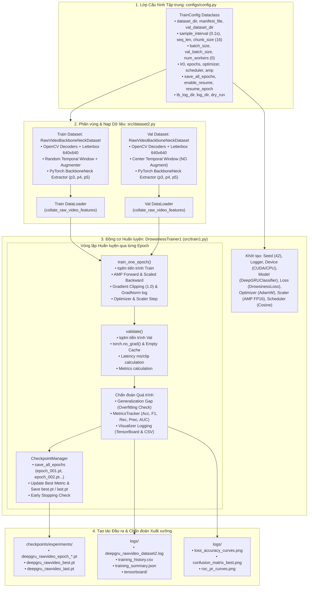

# KẾ HOẠCH TRIỂN KHAI XÂY DỰNG PIPELINE HUẤN LUYỆN MODEL DEEPGRUCLASSIFIER VỚI DATASET VIDEO THÔ TRÍCH XUẤT PYTORCH BACKBONENECK

**Mã tài liệu:** `plan_train1.md`  
**Dự án:** Hệ Thống Nhận Diện Tài Xế Buồn Ngủ (Driver Guardian - Deep GRU / LSTM)  
**Tệp mục tiêu chính:** [`src/train1.py`](file:///D:/Project/DATN/driver-guardian/ai/LSTM/src/train1.py)  
**Tệp thực thi wrapper tại thư mục gốc:** [`train1.py`](file:///D:/Project/DATN/driver-guardian/ai/LSTM/train1.py)  
**Tập dữ liệu nạp (Train & Val):** `RawVideoBackboneNeckDataset` & `collate_raw_video_features` từ [`src/dataset2.py`](file:///D:/Project/DATN/driver-guardian/ai/LSTM/src/dataset2.py)  
**Kiến trúc mô hình:** `DeepGRUClassifier` từ [`src/models.py`](file:///D:/Project/DATN/driver-guardian/ai/LSTM/src/models.py)  
**Tệp cấu hình tập trung:** [`configs/config.py`](file:///D:/Project/DATN/driver-guardian/ai/LSTM/configs/config.py) (`TrainConfig`)  
**Tệp tham chiếu đặt tả ngoài:** [`src/train.py`](file:///D:/Project/DATN/driver-guardian/ai/LSTM/src/train.py)  
**Căn cứ phân tích:** [`docs/analsys/analsys_train1.md`](file:///D:/Project/DATN/driver-guardian/ai/LSTM/docs/analsys/analsys_train1.md)  
**Quy chuẩn áp dụng:** [`AGENTS.md`](file:///D:/Project/DATN/driver-guardian/ai/LSTM/AGENTS.md) — Bước 2: Lên kế hoạch thực hiện  
**Ngày lập:** 04/10/2026  

---

## 1. MỤC TIÊU & NGUYÊN TẮC KỸ THUẬT CỐT LÕI

### 1.1. Mục tiêu triển khai
1. **Xây dựng Pipeline Huấn luyện Mô hình Video Thô Toàn diện ([`src/train1.py`](file:///D:/Project/DATN/driver-guardian/ai/LSTM/src/train1.py)):**
   - **Tập Train & Val:** Nạp dữ liệu hoàn toàn từ [`src/dataset2.py`](file:///D:/Project/DATN/driver-guardian/ai/LSTM/src/dataset2.py) qua lớp `RawVideoBackboneNeckDataset`:
     - Giải mã video thô (`.mp4`, `.avi`, `.mkv`, `.mov`) trực tiếp qua OpenCV.
     - Lấy mẫu khung hình theo chu kỳ thời gian tùy chỉnh `sample_interval` (vd: 0.1s ~ 10 FPS, 0.05s ~ 20 FPS).
     - Resize ảnh giữ nguyên tỷ lệ qua Letterbox chuẩn 640x640.
     - Trích xuất đặc trưng không gian đa tỷ lệ ($p_3, p_4, p_5$) trực tiếp qua mô hình PyTorch native `BackboneNeck` nạp từ checkpoint `.pt`.
     - Gom batch động qua `collate_raw_video_features` với cơ chế Zero-Padding dọc theo trục thời gian và sinh tensor `seq_lens`.
   - **Mô hình & Hàm mất mát:** `DeepGRUClassifier` (tích hợp `CNNAdapter`, Deep GRU 2 tầng, `TemporalAttentionPooling` với Attention Masking) từ [`src/models.py`](file:///D:/Project/DATN/driver-guardian/ai/LSTM/src/models.py) và `DrowsinessLoss` từ [`src/loss.py`](file:///D:/Project/DATN/driver-guardian/ai/LSTM/src/loss.py).
   - **Tối ưu hóa:** AdamW/SGD, Cosine Annealing LR Scheduler có Warmup mềm, Automatic Mixed Precision (AMP FP16) và Gradient Clipping.

2. **Bảo đảm 100% Đặt tả Yêu cầu Ngoài giống [`src/train.py`](file:///D:/Project/DATN/driver-guardian/ai/LSTM/src/train.py):**
   - **Cấu hình tập trung:** Quản lý 100% qua dataclass `TrainConfig` trong [`configs/config.py`](file:///D:/Project/DATN/driver-guardian/ai/LSTM/configs/config.py), **KHÔNG DÙNG CLI / argparse**.
   - **Bộ theo dõi & Đánh giá kết quả (MetricsTracker):** Tính toán Loss, Accuracy, F1-Drowsy, F1-Macro, F1-Weighted, Precision, Recall, Specificity, ROC-AUC, PR-AUC, Confusion Matrix và Classification Report.
   - **Bộ chẩn đoán & Trực quan hóa (TrainingVisualizer):** Ghi log TensorBoard, lưu bảng lịch sử `training_history.csv`, lưu tóm tắt JSON `training_summary.json`, và tự động xuất 3 đồ thị PNG chẩn đoán chất lượng cao (`loss_accuracy_curves.png`, `confusion_matrix_best.png`, `roc_pr_curves.png`).
   - **Quản lý Checkpoints & Khôi phục (CheckpointManager):** Lưu `save_all_epochs=True` từng epoch riêng biệt, lưu `last.pt`, `best.pt`, cơ chế Resume an toàn từ epoch cụ thể (`enable_resume=True`, `resume_epoch=X`), đồng bộ hóa lịch sử đồ thị, và Early Stopping theo dõi `monitor_metric`.
   - **Chế độ Kiểm thử Tự lập Toàn diện (run_dry_run_test):** Tự động sinh video mock giả lập qua OpenCV, chạy 2 epoch, kiểm tra checkpoints, verify metrics và kiểm tra logic khôi phục Resume hoàn toàn khép kín.

3. **Cung cấp Tệp Thực thi Wrapper tại Thư mục Gốc ([`train1.py`](file:///D:/Project/DATN/driver-guardian/ai/LSTM/train1.py)):**
   - Tương tự như cặp [`src/train.py`](file:///D:/Project/DATN/driver-guardian/ai/LSTM/src/train.py) và [`train.py`](file:///D:/Project/DATN/driver-guardian/ai/LSTM/train.py) hiện hữu, tạo [`train1.py`](file:///D:/Project/DATN/driver-guardian/ai/LSTM/train1.py) tại thư mục gốc để re-export và cho phép người dùng chạy trực tiếp `python train1.py`.

---

## 2. SƠ ĐỒ LUỒNG THIẾT KẾ CHI TIẾT (ARCHITECTURE WORKFLOW)

---

## 3. CÁC GIAI ĐOẠN THỰC HIỆN CHI TIẾT (IMPLEMENTATION PHASES)

### Giai đoạn 1: Chuẩn hóa Cấu hình `TrainConfig` tại [`configs/config.py`](file:///D:/Project/DATN/driver-guardian/ai/LSTM/configs/config.py)
- **Mục tiêu:** Kiểm tra và đảm bảo các trường tham số cấu hình cần thiết cho `dataset2.py` và `train1.py` đã sẵn sàng và tương thích:
  - `dataset_dir`: Đường dẫn thư mục chứa video thô.
  - `manifest_file`: File manifest CSV (nếu có).
  - `sample_interval`: Chu kỳ lấy mẫu khung hình thời gian (mặc định 0.1s ~ 10 FPS).
  - `chunk_size`: Kích thước mini-chunk khi trích xuất đặc trưng qua BackboneNeck (mặc định 16).
  - `checkpoint_path`: Đường dẫn tệp trọng số PyTorch `.pt` của mô hình `BackboneNeck` (mặc định trỏ tới `DEFAULT_CHECKPOINT_PATH`).
  - `train_ratio`: Tỷ lệ chia tập huấn luyện khi nạp từ thư mục phẳng (mặc định 0.8).
  - `save_all_epochs`: Cờ lưu toàn bộ checkpoint từng epoch (mặc định `True`).
  - `enable_resume`: Cờ bật/tắt tiếp tục huấn luyện (mặc định `False`).
  - `resume_epoch`: Số epoch cần resume lại (mặc định `None`).

---

### Giai đoạn 2: Xây dựng Module Lõi [`src/train1.py`](file:///D:/Project/DATN/driver-guardian/ai/LSTM/src/train1.py)
Tệp `src/train1.py` sẽ được cấu trúc hóa theo 7 phân đoạn chức năng chuyên biệt:

#### Phân đoạn 1: Thiết lập Tái lập & Logging Hệ thống
- `seed_everything(seed: int = 42)`: Cố định seed cho random, numpy, torch CPU/CUDA, thiết lập `cudnn.deterministic = True`.
- `setup_logger(log_dir: Union[str, Path], experiment_name: str) -> logging.Logger`: Cấu hình logger ghi đồng thời ra màn hình console và file `.log` hỗ trợ định dạng UTF-8 tiếng Việt chuẩn mực.

#### Phân đoạn 2: Bộ Đo lường & Đánh giá Chỉ số (`MetricsTracker`)
- Kế thừa và đồng bộ 100% từ cấu trúc chuẩn của `src/train.py`:
  - Gom các batch: `targets`, `preds`, `probs_drowsy`, `total_loss`, `correct_samples`.
  - Tính toán tổng hợp: `accuracy`, `precision`, `recall`, `specificity`, `f1` (lớp Drowsy), `f1_macro`, `f1_weighted`, `auc_roc`, `auc_pr`.
  - Phương thức xuất `get_confusion_matrix()` và `get_classification_report()`.

#### Phân đoạn 3: Bộ Trực quan hóa & Xuất Báo cáo Chẩn đoán (`TrainingVisualizer`)
- Khởi tạo TensorBoard `SummaryWriter` nếu cấu hình `tb_log_dir`.
- `log_epoch()`: Tính toán chỉ số khoảng cách tổng quát hóa:
  $$\text{gap\_loss} = \mathcal{L}_{\text{val}} - \mathcal{L}_{\text{train}}$$
  $$\text{gap\_f1} = \text{F1}_{\text{train}} - \text{F1}_{\text{val}}$$
- `sync_history_from_csv(resumed_epoch: int)`: Đọc và đồng bộ lại lịch sử từ `training_history.csv` khi người dùng tiếp tục huấn luyện (Resume).
- Các hàm xuất đồ thị chẩn đoán (sử dụng matplotlib backend `Agg`):
  - `export_plots()`: Xuất biểu đồ loss/acc (`loss_accuracy_curves.png`).
  - `export_confusion_matrix()`: Vẽ ma trận nhầm lẫn chuẩn hóa (`confusion_matrix_best.png`).
  - `export_roc_pr_curves()`: Vẽ đường cong ROC và Precision-Recall (`roc_pr_curves.png`).
  - `export_summary_json()`: Xuất bản tóm tắt kết quả huấn luyện JSON (`training_summary.json`).

#### Phân đoạn 4: Bộ Quản lý Checkpoints & Early Stopping (`CheckpointManager`)
- `resolve_checkpoint_path()`: Phân giải đường dẫn checkpoint theo số epoch cụ thể (`epoch_005.pt`), bí danh (`'last'`, `'best'`), hoặc đường dẫn tuyệt đối.
- `save_checkpoint()`:
  - Khi `save_all_epochs=True`: Lưu `f"{experiment_name}_epoch_{epoch:03d}.pt"` cho mọi epoch.
  - Luôn cập nhật `f"{experiment_name}_last.pt"`.
  - Nếu chỉ số `monitor_metric` đạt kỷ lục mới: Cập nhật `f"{experiment_name}_best.pt"`.
  - Kiểm tra điều kiện Dừng sớm (Early Stopping) sau `patience` epoch liên tiếp không cải thiện.
- `load_checkpoint()`: Khôi phục toàn bộ trạng thái `model_state_dict`, `optimizer_state_dict`, `scheduler_state_dict`, `scaler_state_dict`, `best_score`, `best_epoch`, `patience_counter`, trả về `start_epoch = epoch_nạp + 1`.

#### Phân đoạn 5: Động cơ Huấn luyện Video Thô (`DrowsinessTrainer1`)
- **Khởi tạo (`__init__`):**
  - Tải cấu hình, khởi tạo logger, thiết bị (`cuda` / `cpu`), khởi tạo AMP `GradScaler`.
  - Khởi tạo kiến trúc `DeepGRUClassifier.from_config(config)`.
  - Khởi tạo hàm mất mát `build_loss(config)` (`DrowsinessLoss`).
  - Khởi tạo Optimizer (`AdamW` / `Adam` / `SGD`) và Scheduler (`CosineAnnealingLR` / `ReduceLROnPlateau`).
  - Khởi tạo `CheckpointManager` và xử lý khôi phục tự động nếu `enable_resume=True`.
- **Khởi tạo DataLoaders (`_build_dataloaders`):**
  - Sử dụng [`RawVideoBackboneNeckDataset`](file:///D:/Project/DATN/driver-guardian/ai/LSTM/src/dataset2.py#L328-L677) từ [`src/dataset2.py`](file:///D:/Project/DATN/driver-guardian/ai/LSTM/src/dataset2.py):
    - Tập train: `split="train"`, `window_sampling="random"`, hỗ trợ augmenter.
    - Tập val: `split="val"`, `window_sampling="center"`, không áp dụng augmentation.
  - Tự động chia tỷ lệ ngẫu nhiên qua `torch.utils.data.random_split` nếu thư mục dữ liệu phẳng hoặc tập val chưa được phân vùng riêng biệt.
  - Gom batch bằng hàm gom động `collate_raw_video_features`.
- **Huấn luyện một epoch (`train_one_epoch`):**
  - Thanh tiến trình `tqdm` hiển thị Loss, Acc, GradNorm, LR.
  - Forward qua `model((p3, p4, p5), seq_lens=seq_lens)` dưới ngữ cảnh AMP FP16.
  - Scaled Backward, Unscale, Cắt gradient (`clip_grad_norm_ <= 1.0`), Optimizer Step.
- **Kiểm định một epoch (`validate`):**
  - Thanh tiến trình `tqdm`, `torch.no_grad()`, đo độ trễ suy luận chính xác ($\text{ms/clip}$).
- **Vòng lặp điều phối (`fit`):**
  - Điều phối `train_one_epoch` $\rightarrow$ `validate` $\rightarrow$ Cập nhật Scheduler $\rightarrow$ Ghi log & Trực quan hóa $\rightarrow$ Quản lý Checkpoints $\rightarrow$ Kiểm tra Early Stopping.
- **Đánh giá tổng kết cuối cùng (`evaluate_final`):**
  - Nạp lại trọng số tốt nhất từ `best.pt`, đánh giá toàn diện lần cuối, xuất báo cáo Classification Report và toàn bộ các biểu đồ chẩn đoán PNG.

#### Phân đoạn 6: Chế độ Kiểm thử Tự lập Khép kín (`run_dry_run_test`)
- Tự động sinh thư mục tạm thời qua `tempfile.mkdtemp`.
- Tạo 4 tệp video clip giả lập (`.mp4`) bằng OpenCV `cv2.VideoWriter` (2 train clips, 2 val clips với các màu sắc và độ dài khung hình khác nhau).
- Khởi tạo `DrowsinessTrainer1` chạy mô phỏng 2 epochs (`dry_run=True`, `save_all_epochs=True`).
- Xác thực sự tồn tại và tính hợp lệ của các tệp:
  - `epoch_001.pt`, `epoch_002.pt`, `last.pt`, `best.pt`.
  - `training_history.csv`, `training_summary.json`, và 3 file ảnh biểu đồ PNG.
- Kiểm tra cơ chế Resume: nạp lại từ Epoch 1 (bắt đầu lại tại Epoch 2) và kiểm tra xử lý ngoại lệ thân thiện khi nạp epoch không tồn tại.
- Dọn dẹp an toàn tài nguyên và thư mục tạm thời.

#### Phân đoạn 7: Giao diện Hàm Cấp cao & Điểm Thực thi
- `train_pipeline(config=None, enable_resume=None, resume_epoch=None) -> Dict[str, Any]`: Cho phép gọi từ script khác hoặc Jupyter Notebook.
- `main()`: Điểm khởi chạy mặc định khi thực thi trực tiếp qua terminal.

---

### Giai đoạn 3: Xây dựng Tệp Thực thi Wrapper tại Thư mục Gốc [`train1.py`](file:///D:/Project/DATN/driver-guardian/ai/LSTM/train1.py)
- Tương tự như [`train.py`](file:///D:/Project/DATN/driver-guardian/ai/LSTM/train.py) hiện hữu tại thư mục gốc:
  - Cấu hình console Windows UTF-8.
  - Bổ sung thư mục gốc vào `sys.path`.
  - Re-export toàn bộ các hàm và lớp từ `src.train1`:
    - `seed_everything`, `setup_logger`, `MetricsTracker`, `TrainingVisualizer`, `CheckpointManager`, `DrowsinessTrainer1`, `run_dry_run_test`, `train_pipeline`, `main`.
  - Khối `if __name__ == "__main__": main()`.

---

### Giai đoạn 4: Kiểm thử Tự động & Xác thực Chất lượng (Verification)
1. **Kiểm thử Cú pháp & Tương thích Import:**
   - Kiểm tra import không xung đột giữa `src.train1`, `src.dataset2`, `src.models`, `src.loss`, `configs.config`.
2. **Thực thi Kiểm thử Khép kín Dry-Run Test:**
   - Chạy lệnh: `python src/train1.py` với cờ `dry_run=True` (hoặc gọi trực tiếp `run_dry_run_test()`).
   - Kiểm tra xác nhận toàn bộ 8 bước kiểm thử dry-run đạt chuẩn 100%.
3. **Thực thi Kiểm thử Wrapper tại Thư mục Gốc:**
   - Chạy lệnh: `python train1.py` ở chế độ dry-run để đảm bảo tệp wrapper hoạt động hoàn hảo.

---

### Giai đoạn 5: Tổng kết & Tạo Báo cáo Nghiệm thu [`docs/report/report_train1.md`](file:///D:/Project/DATN/driver-guardian/ai/LSTM/docs/report/report_train1.md)
- Tổng hợp toàn bộ các kết quả đạt được, cấu trúc mã nguồn đã tạo, kết quả kiểm thử dry-run, bảng đối sánh kỹ thuật và hướng dẫn sử dụng chi tiết cho người dùng.

---

## 4. BẢNG PHÂN RÃ CÔNG VIỆC (WORK BREAKDOWN STRUCTURE - WBS)

| Bước | Hạng mục thực hiện | Tệp tác động | Trạng thái dự kiến |
| :---: | :--- | :--- | :---: |
| **B1** | Khảo sát & Phân tích yêu cầu | `docs/analsys/analsys_train1.md` | ✅ **Đã hoàn thành** |
| **B2** | Lập kế hoạch thực hiện chi tiết | `docs/plan/plan_train1.md` | 🔄 **Đang trình duyệt** |
| **B3.1** | Đồng bộ & Chuẩn hóa tham số cấu hình | `configs/config.py` | ⏳ Chờ duyệt B2 |
| **B3.2** | Hiện thực hóa module huấn luyện lõi | `src/train1.py` | ⏳ Chờ duyệt B2 |
| **B3.3** | Hiện thực hóa tệp wrapper thư mục gốc | `train1.py` | ⏳ Chờ duyệt B2 |
| **B3.4** | Chạy kiểm thử tự lập Dry-Run (Mock Video) | `src/train1.py` & `train1.py` | ⏳ Chờ duyệt B2 |
| **B3.5** | Lập báo cáo kết quả hoàn thành nhiệm vụ | `docs/report/report_train1.md` | ⏳ Chờ duyệt B2 |

---

## 5. TIÊU CHUẨN NGHIỆM THU (ACCEPTANCE CRITERIA CHECKLIST)

- [ ] Đường dẫn file tương thích đa nền tảng (`pathlib.Path` / `os.path.join`).
- [ ] Console Windows in tiếng Việt UTF-8 mượt mà không lỗi font/charmap.
- [ ] Tích hợp trơn tru với `RawVideoBackboneNeckDataset` và `collate_raw_video_features` từ `src/dataset2.py`.
- [ ] Tích hợp chính xác với `DeepGRUClassifier` từ `src/models.py` và `DrowsinessLoss` từ `src/loss.py`.
- [ ] Đặc tả yêu cầu ngoài (MetricsTracker, Visualizer, CheckpointManager, Resume, Early Stopping, CSV, JSON, PNG plots) đồng nhất 100% với `src/train.py`.
- [ ] Khối kiểm thử tự lập `run_dry_run_test()` hoàn tất thành công từ đầu đến cuối, xác thực đầy đủ cả 4 file checkpoint, các file đồ thị, bảng CSV, tóm tắt JSON và cơ chế Resume.
