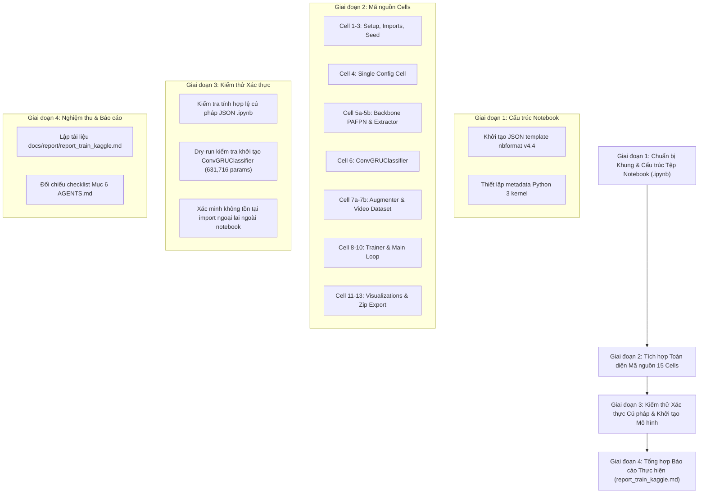

# KẾ HOẠCH TRIỂN KHAI: XÂY DỰNG JUPYTER NOTEBOOK HUẤN LUYỆN TRÊN KAGGLE CHO SRC/TRAIN.PY

- **Mã kế hoạch**: `PLAN_TRAIN_KAGGLE`
- **Tệp kế hoạch**: `docs/plan/plan_train_kaggle.md`
- **Dựa trên tài liệu phân tích**: [docs/analsys/analsys_train_kaggle.md](file:///D:/Project/DATN/driver-guardian/ai/LSTM/docs/analsys/analsys_train_kaggle.md)
- **Tệp mục tiêu đầu ra**: [notebooks/02_train_convgru_kaggle.ipynb](file:///D:/Project/DATN/driver-guardian/ai/LSTM/notebooks/02_train_convgru_kaggle.ipynb)
- **Trạng thái**: Đang chờ người dùng phê duyệt trước khi chuyển sang Bước 3 Thực hiện ([AGENTS.md](file:///D:/Project/DATN/driver-guardian/ai/LSTM/AGENTS.md)).

---

## 1. MỤC TIÊU VÀ NGUYÊN TẮC THIẾT KẾ CỐT LÕI

### 1.1. Mục tiêu trọng tâm
Xây dựng một tệp Jupyter Notebook hoàn chỉnh, đạt chuẩn mã nguồn sạch và tính tái lập cao ([notebooks/02_train_convgru_kaggle.ipynb](file:///D:/Project/DATN/driver-guardian/ai/LSTM/notebooks/02_train_convgru_kaggle.ipynb)), tương đương hoàn toàn với pipeline trong [src/train.py](file:///D:/Project/DATN/driver-guardian/ai/LSTM/src/train.py) (v2.0), được thiết kế tối ưu và chuyên biệt hóa cho môi trường **Kaggle GPU Kernel (Tesla T4 / P100 16GB VRAM, Ubuntu Linux)**.

### 1.2. Các nguyên tắc thiết kế bắt buộc
1. **Kiến trúc Self-Contained 100% Khép kín**:
   - Tuyệt đối không import từ thư mục ngoài `src/` hoặc `ai/ObjectDetection_2p6M/`.
   - Toàn bộ các định nghĩa lớp, hàm tiện ích, bộ tăng cường dữ liệu, bộ trích xuất đặc trưng và pipeline huấn luyện được tích hợp đầy đủ, trực tiếp trong các Cell code tuần tự.
   - Người dùng chỉ cần upload duy nhất file `.ipynb` lên Kaggle cùng dataset là có thể bấm chạy ngay.
2. **1 Cell Cấu hình Tập trung Duy nhất (Single Configuration Cell)**:
   - Gom toàn bộ tham số của `TrainConfig` (tương đương [configs/config.py](file:///D:/Project/DATN/driver-guardian/ai/LSTM/configs/config.py) và [configs/config.yaml](file:///D:/Project/DATN/driver-guardian/ai/LSTM/configs/config.yaml)) vào 1 Cell code duy nhất.
   - Khai báo tường minh tất cả các đường dẫn (`dataset_dir`, `backbone_neck_checkpoint`, `checkpoint_dir`,...) và siêu tham số huấn luyện/mô hình để người dùng dễ dàng theo dõi và tùy chỉnh.
3. **Bóc tách Tối giản cho `ChunkedBackboneNeckExtractor`**:
   - Chỉ nhúng phần `Backbone` và `PAFPN` phục vụ trích xuất đặc trưng $(p_3, p_4, p_5)$, lược bỏ hoàn toàn `DetectHead` của bài toán Object Detection.
   - Nạp trọng số thông minh từ `best.pt` (lọc các khóa `backbone.` và `neck.`, bỏ qua `head.`), áp dụng mini-chunk 32 khung hình trên GPU kết hợp FP16 autocast để không bao giờ chạm trần VRAM.
4. **Tăng cường Dữ liệu Video Nhất quán Thời gian (Temporal Consistency từ `src/augment.py`)**:
   - Nhúng lớp `VideoAugmenter` sử dụng Albumentations với cơ chế đồng bộ 1 random seed duy nhất cho tất cả các frames trong cùng một clip video (`apply_sequence`).
   - Xử lý tương thích mềm dẻo đa phiên bản Albumentations trên Kaggle (`A.Affine` vs `A.ShiftScaleRotate`, `var_limit` vs `std_range`).
5. **Trực quan hóa Đồ thị Học tập & Xuất Artifacts Inline**:
   - Vẽ trực tiếp biểu đồ Loss, F1, Accuracy, Learning Rate từ `training_history.csv` bằng `matplotlib`/`seaborn`.
   - Đánh giá Confusion Matrix trên tập Validation bằng `best.pt`.
   - Đóng gói toàn bộ checkpoints và logs thành file ZIP để tải về chỉ với 1 cú click.

---

## 2. CẤU TRÚC CHI TIẾT TỪNG CELL TRONG NOTEBOOK

Notebook sẽ được phân chia thành **9 Sections** với **15 Cells** được tổ chức khoa học:

| STT Cell | Loại Cell | Tiêu đề / Nội dung chính | Mô tả chi tiết logic & Mã nguồn tích hợp |
| :---: | :---: | :--- | :--- |
| **Cell 1** | Markdown | **Driver Guardian AI — ConvGRU Training Pipeline (Kaggle Edition)** | Giới thiệu bài toán, đặc tả kỹ thuật mô hình, hướng dẫn cấu hình môi trường Kaggle (chọn GPU T4/P100, cách add dataset video và checkpoint Backbone). |
| **Cell 2** | Code | **Environment Setup & Imports** | Cài đặt các thư viện bổ sung nếu cần (`pip install -q albumentations`), import các module chuẩn (`torch`, `cv2`, `albumentations`, `numpy`, `sklearn`, `matplotlib`, `seaborn`, `tqdm`). Kiểm tra thông tin GPU, VRAM và phiên bản PyTorch. |
| **Cell 3** | Code | **Reproducibility: Random Seed Fixing** | Hàm `seed_everything(seed=42)` cố định toàn bộ hạt giống ngẫu nhiên cho Python, NumPy, PyTorch (manual seed & CUDA seed, CUDNN deterministic). |
| **Cell 4** | Markdown & Code | **Section 2: Cấu hình Hệ thống Tập trung Duy nhất (`TrainConfig`)** | Khai báo Dataclass `TrainConfig` và đối tượng `cfg`:  • *Paths*: `dataset_dir = "/kaggle/input/uldd-processed"`, `manifest_file = "dataset_merged_split.csv"`, `backbone_neck_checkpoint = "/kaggle/input/.../best.pt"`, `checkpoint_dir = "/kaggle/working/checkpoints"`, `tb_log_dir = "/kaggle/working/logs"`, `history_csv_path = "/kaggle/working/logs/training_history.csv"`.  • *Data*: `sample_interval=0.2`, `seq_len=None`, `batch_size=4`, `num_workers=2`, `pin_memory=False`, `chunk_size=32`.  • *Model*: `cnn_neck_channels=(64, 128, 256)`, `input_dim=128`, `hidden_dim=64`, `num_layers=2`, `num_classes=2`, `dropout=0.35`.  • *Train*: `epochs=20`, `lr0=0.001`, `optimizer="adamw"`, `weight_decay=0.0001`, `gradient_accumulation_steps=4`, `amp=True`, `early_stopping=True`, `patience=10`. |
| **Cell 5a** | Markdown & Code | **Section 3: Các Khối CNN Cơ sở & Kiến trúc BackboneNeck PAFPN** | Định nghĩa các khối mạng chuẩn hóa: `autopad`, `Conv`, `Bottleneck`, `C2f`, `CIB`, `C2fCIB`, `SPPF`, `Attention`, `C2fPSA`, `SCDown`. Định nghĩa lớp `Backbone` (4 stages, w=(16, 32, 64, 128, 256), n=(1, 2, 2, 1)), lớp `PAFPN` (chs=(64, 128, 256), n=1) và module kết hợp `BackboneNeck`. |
| **Cell 5b** | Code | **Section 3: Lớp Trích xuất Đặc trưng Mini-Chunk GPU (`ChunkedBackboneNeckExtractor`)** | Triển khai `ChunkedBackboneNeckExtractor`: nạp trọng số từ checkpoint `best.pt` qua `load_state_dict(strict=False)` (lọc `backbone.` và `neck.`), đóng băng toàn bộ tham số (`requires_grad=False`, `eval()`). Vòng lặp chia mini-chunk 32 frames trên GPU, ép kiểu `uint8` sang `float32`, kích hoạt `torch.inference_mode()` và AMP FP16. Trả về $(p_3, p_4, p_5)$. |
| **Cell 6** | Markdown & Code | **Section 4: Kiến trúc Không gian - Thời gian `ConvGRUClassifier`** | Định nghĩa đầy đủ: `SpatialReductionNeck` (nén 448 $\to$ 128 kênh không gian $40 \times 40$), `ConvGRUCell`, `ConvGRU` (2 tầng, hidden_dim=64), `SpatialAttentionPooling`, `TemporalAttentionPooling`, và lớp `ConvGRUClassifier` hoàn chỉnh (chuẩn hóa đúng 631,716 tham số). |
| **Cell 7a** | Markdown & Code | **Section 5: Bộ Tăng cường Chuỗi Video Nhất quán Thời gian (`VideoAugmenter`)** | Tích hợp từ `src/augment.py`: Định nghĩa lớp `VideoAugmenter` dựa trên Albumentations (`HorizontalFlip`, `ShiftScaleRotate`/`Affine`, `RandomBrightnessContrast`, `HueSaturationValue`, `GaussNoise`, `Blur`). Triển khai hàm `apply_sequence(frames, seed)` dùng chung 1 random seed duy nhất cho tất cả các frames của clip video. |
| **Cell 7b** | Code | **Section 5: Pipeline Nạp & Tiền xử lý Video Thô (`RawVideoFramesDataset` & DataLoaders)** | Triển khai: hàm `letterbox(image, 640)`, lớp `RawVideoFramesDataset` (quét thư mục/manifest, giải mã video bằng OpenCV, lấy mẫu đều đặn 0.2s, tích hợp `VideoAugmenter` cho tập train, tạo tensor uint8 trên CPU), hàm `collate_video_frames` (padding động chuỗi thời gian) và hàm factory `build_raw_video_dataloaders`. |
| **Cell 8** | Markdown & Code | **Section 6: Hạ tầng Huấn luyện & Tiện ích Giám sát (`Trainer`)** | Định nghĩa hàm `calculate_metrics` (acc, recall, macro f1), lớp `EarlyStopping`. Định nghĩa lớp `Trainer`: khởi tạo DataLoader, Extractor, ConvGRUClassifier, Loss (`CrossEntropyLoss` / `BCEWithLogitsLoss`), AdamW optimizer, CosineAnnealingLR scheduler, AMP GradScaler, cơ chế Atomic Save checkpoint (`last.pt`, `best.pt`, `epoch_N.pt`), xử lý bắt lỗi OOM an toàn và ghi nhận `training_history.csv`. |
| **Cell 9** | Markdown & Code | **Section 7: Khởi tạo Hệ thống & Kiểm tra Tham số** | Khởi tạo đối tượng `Trainer(cfg)`, in chi tiết cấu hình và tổng số tham số mô hình (xác nhận 631,716 params). Hỗ trợ nạp lại checkpoint nếu biến `cfg.enable_resume = True` hoặc đường dẫn `RESUME_PATH` được chỉ định. |
| **Cell 10** | Code | **Section 7: Thực thi Vòng lặp Huấn luyện Tương tác** | Chạy hàm `trainer.train()`. Hiển thị thanh tiến trình `tqdm` trực quan qua từng epoch, in bảng số liệu chi tiết (Train Loss, Val Loss, Val F1, Val Acc, Learning Rate, Time elapsed) và cập nhật thời gian thực vào `training_history.csv`. |
| **Cell 11** | Markdown & Code | **Section 8: Trực quan hóa Đồ thị Học tập Inline** | Đọc dữ liệu từ `training_history.csv`, sử dụng `matplotlib` và `seaborn` vẽ 4 biểu đồ con hiển thị sắc nét ngay trong output notebook:  1. Train Loss vs Val Loss qua các epoch.  2. Train F1 vs Val F1.  3. Train Acc vs Val Acc.  4. Biểu đồ suy giảm Learning Rate. |
| **Cell 12** | Code | **Section 8: Đánh giá Toàn diện Mô hình Tối ưu (`best.pt`) & Confusion Matrix** | Tải checkpoint `best.pt`, chạy đánh giá kiểm định trên toàn bộ tập Validation, in Classification Report (Precision, Recall, F1 từng lớp) và vẽ biểu đồ nhiệt Ma trận Nhầm lẫn (Confusion Matrix Heatmap). |
| **Cell 13** | Markdown & Code | **Section 9: Đóng gói Artifacts & Tải về Máy tính** | Tự động nén toàn bộ thư mục output (checkpoints `best.pt`, `last.pt`, `training_history.csv`, các hình ảnh đồ thị biểu đồ) thành file zip `/kaggle/working/convgru_training_artifacts.zip`. Cung cấp liên kết tải về trực tiếp từ giao diện Kaggle Output. |

---

## 3. LỘ TRÌNH THỰC HIỆN CHI TIẾT (WORKFLOW 4 GIAI ĐOẠN)

### Chi tiết từng giai đoạn:

#### Giai đoạn 1: Khởi tạo Khung Tệp Notebook
- Tạo file [notebooks/02_train_convgru_kaggle.ipynb](file:///D:/Project/DATN/driver-guardian/ai/LSTM/notebooks/02_train_convgru_kaggle.ipynb) với định dạng chuẩn Jupyter Notebook `nbformat: 4`, `nbformat_minor: 4`, metadata kernel `python3`.

#### Giai đoạn 2: Tích hợp Mã nguồn Từng Cell
- Xây dựng nội dung cho 15 cells (gồm cả markdown hướng dẫn và code thực thi) theo đúng bảng đặc tả tại Mục 2.
- Đảm bảo type hints, docstrings chuẩn và comment giải thích chi tiết bằng tiếng Việt.

#### Giai đoạn 3: Kiểm thử Xác thực & Đo lường
- Viết script kiểm tra tự động:
  1. Đọc và parse cú pháp JSON của tệp `.ipynb`.
  2. Trích xuất code từ các cell và chạy thử nghiệm cục bộ (Syntax Check & Smoke Test).
  3. Khởi tạo thử mô hình `ConvGRUClassifier` với config mặc định để xác nhận kích thước tham số khớp 100% (631,716 params).
  4. Quét AST mã nguồn trong notebook để khẳng định không còn bất kỳ câu lệnh `import src.*` hoặc `import ai.*` nào.

#### Giai đoạn 4: Hoàn thiện Báo cáo Thực hiện
- Soạn thảo tài liệu nghiệm thu [docs/report/report_train_kaggle.md](file:///D:/Project/DATN/driver-guardian/ai/LSTM/docs/report/report_train_kaggle.md).
- Rà soát toàn bộ Checklist Mục 6 của [AGENTS.md](file:///D:/Project/DATN/driver-guardian/ai/LSTM/AGENTS.md).

---

## 4. KẾ HOẠCH KIỂM THỬ VÀ ĐÁNH GIÁ RỦI RO (TESTING & RISK MITIGATION)

| Rủi ro kỹ thuật tiềm ẩn | Mức độ | Biện pháp phòng ngừa & Xử lý trong Kế hoạch |
| :--- | :---: | :--- |
| **Lỗi cú pháp định dạng JSON khi tạo file .ipynb** | Cao | Sử dụng thư viện `json` chuẩn của Python để serialize notebook dictionary, xác thực lại bằng `json.loads` và `nbformat`. |
| **Lệch cấu trúc số lượng tham số ConvGRU (không khớp 631,716)** | Trung bình | Kiểm tra chặt chẽ các siêu tham số tại Cell 4 và Cell 6 (`input_dim=128`, `hidden_dim=64`, `num_layers=2`, `cnn_neck_channels=(64, 128, 256)`). Có assert kiểm tra số lượng tham số ngay tại Cell 9. |
| **Xung đột phiên bản Albumentations trên Kaggle** | Trung bình | Tại Cell 7a, bọc các hàm wrapper kiểm tra linh hoạt `hasattr(A, "Affine")` và inspect signature của `A.GaussNoise` để tương thích cả bản cũ và mới. |
| **Tràn bộ nhớ GPU OOM khi chạy Backbone trên Kaggle** | Cao | Tại Cell 5b, bắt buộc sử dụng `chunk_size = 32`, ép kiểu `uint8` sang `float32` từng chunk, chạy trong `torch.inference_mode()` và AMP FP16. Giữ nguyên khối bắt ngoại lệ OOM dọn cache trong `Trainer`. |
| **Vượt quá hạn ngạch ổ đĩa 20GB trên Kaggle** | Thấp | Cấu hình mặc định `save_all_epochs = False`, `save_ckpt_interval_epochs = 5`, chỉ lưu `best.pt` và `last.pt`, dọn dẹp các checkpoint tạm thời. |

---

## 5. CHECKLIST NGHIỆM THU (THEO CHECKLIST MỤC 6 AGENTS.MD)

- [ ] Đường dẫn tương thích đa nền tảng, sử dụng `pathlib.Path` và đường dẫn chuẩn của Kaggle (`/kaggle/input`, `/kaggle/working`).
- [ ] 100% Self-Contained: Hoạt động trơn tru không phụ thuộc vào bất kỳ module ngoài nào (`src`, `ai.ObjectDetection_2p6M`).
- [ ] Khớp 100% logic với [src/train.py](file:///D:/Project/DATN/driver-guardian/ai/LSTM/src/train.py) (Loss, Optimizer AdamW, Cosine LR, AMP Scaler, Early Stopping, Atomic Save).
- [ ] Khớp 100% kiến trúc `ConvGRUClassifier` (631,716 tham số).
- [ ] Tích hợp đầy đủ tăng cường dữ liệu video đồng bộ thời gian từ [src/augment.py](file:///D:/Project/DATN/driver-guardian/ai/LSTM/src/augment.py).
- [ ] Bắt lỗi OOM và giải phóng cache GPU an toàn.
- [ ] Có đầy đủ trực quan hóa biểu đồ inline và ma trận nhầm lẫn.
- [ ] Có cell nén file zip kết quả xuất phục vụ tải về.
- [ ] Tạo báo cáo tổng kết [docs/report/report_train_kaggle.md](file:///D:/Project/DATN/driver-guardian/ai/LSTM/docs/report/report_train_kaggle.md).

---

## 6. ĐỀ XUẤT BƯỚC TIẾP THEO

- Hiện tại, Agent đã hoàn thành **Bước 2: Lên kế hoạch thực hiện**.
- **Hành động tiếp theo**: Chờ phản hồi và phê duyệt từ Người dùng đối với tệp [docs/plan/plan_train_kaggle.md](file:///D:/Project/DATN/driver-guardian/ai/LSTM/docs/plan/plan_train_kaggle.md).
- Sau khi Người dùng đồng ý, Agent sẽ bắt đầu **Bước 3: Thực hiện kế hoạch** (khởi tạo tệp [notebooks/02_train_convgru_kaggle.ipynb](file:///D:/Project/DATN/driver-guardian/ai/LSTM/notebooks/02_train_convgru_kaggle.ipynb), kiểm thử và viết báo cáo [docs/report/report_train_kaggle.md](file:///D:/Project/DATN/driver-guardian/ai/LSTM/docs/report/report_train_kaggle.md)).
