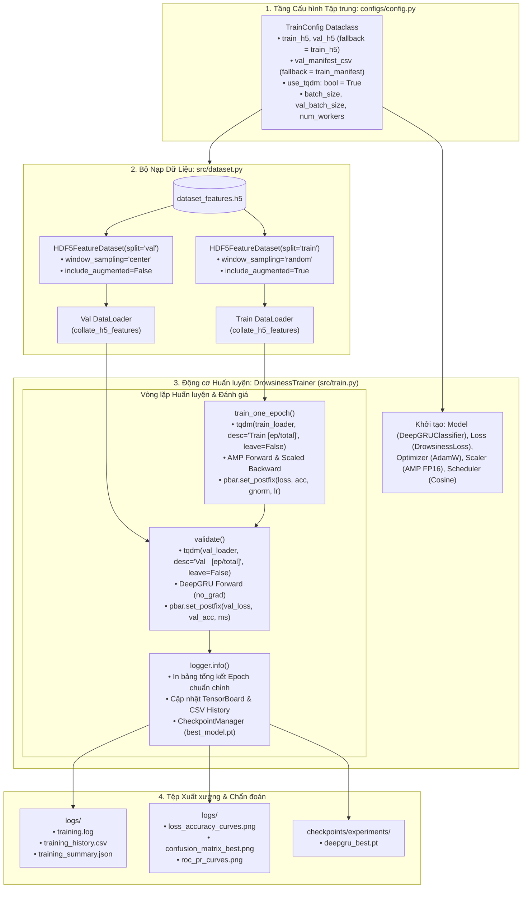

# KẾ HOẠCH TRIỂN KHAI: TÍCH HỢP THANH TIẾN TRÌNH TQDM & CHUYỂN ĐỔI VALIDATION DATASET SANG HDF5FEATUREDATASET

**Mã tài liệu:** `plan_train_tqdm_val_h5.md`  
**Dự án:** Hệ Thống Nhận Diện Tài Xế Buồn Ngủ (Driver Guardian - Deep GRU / LSTM)  
**Tệp mục tiêu:** [`src/train.py`](file:///D:/Project/DATN/driver-guardian/ai/LSTM/src/train.py) & [`src/dataset.py`](file:///D:/Project/DATN/driver-guardian/ai/LSTM/src/dataset.py)  
**Tệp cấu hình phụ trợ:** [`configs/config.py`](file:///D:/Project/DATN/driver-guardian/ai/LSTM/configs/config.py) & [`configs/config.yaml`](file:///D:/Project/DATN/driver-guardian/ai/LSTM/configs/config.yaml)  
**Căn cứ phân tích:** [`docs/analsys_train_tqdm_val_h5.md`](file:///D:/Project/DATN/driver-guardian/ai/LSTM/docs/analsys_train_tqdm_val_h5.md)  
**Quy chuẩn áp dụng:** [`AGENTS.md`](file:///D:/Project/DATN/driver-guardian/ai/LSTM/AGENTS.md) — Bước 2: Lên kế hoạch thực hiện  
**Ngày lập:** 03/10/2026  

---

## 1. MỤC TIÊU & NGUYÊN TẮC KỸ THUẬT CỐT LÕI

### 1.1. Mục tiêu triển khai
1. **Tích hợp Thanh Tiến trình `tqdm` Giám sát Thời gian Thực:**
   - Nâng cấp hai vòng lặp cốt lõi trong [`src/train.py`](file:///D:/Project/DATN/driver-guardian/ai/LSTM/src/train.py): Pha huấn luyện ([`train_one_epoch`](file:///D:/Project/DATN/driver-guardian/ai/LSTM/src/train.py#L846)) và Pha kiểm định ([`validate`](file:///D:/Project/DATN/driver-guardian/ai/LSTM/src/train.py#L893)).
   - Cập nhật liên tục tỷ lệ hoàn thành (%), tốc độ xử lý ($it/s$), thời gian đã chạy, ước tính thời gian còn lại (ETA), cùng các chỉ số chẩn đoán: `loss`, `acc`, `gnorm`, `lr`, `val_loss`, `val_acc`, `latency_ms`.
   - Đảm bảo thanh tiến trình tự thu gọn (`leave=False`) khi hết epoch, giữ console luôn ngăn nắp và sạch đẹp.
2. **Đồng bộ hóa Tập Kiểm định với [`HDF5FeatureDataset`](file:///D:/Project/DATN/driver-guardian/ai/LSTM/src/dataset.py#L69):**
   - Loại bỏ hoàn toàn sự phụ thuộc vào giải mã video thô và trích xuất ONNX on-the-fly (`RawVideoONNXDataset`), chuyển hẳn sang nạp tensor đặc trưng không gian đa tỉ lệ $(p_3, p_4, p_5)$ từ tệp HDF5.
   - Sửa toàn bộ các lỗi tồn đọng: Xóa kiểm tra thư mục video thô thừa thãi, sửa lỗi in nhầm số lượng mẫu `len(train_dataset)`, áp dụng `window_sampling="center"` và `include_augmented=False` để đảm bảo 100% tính xác định và triệt tiêu nguy cơ rò rỉ dữ liệu (Data Leakage).
   - Sử dụng hàm gom batch [`collate_h5_features`](file:///D:/Project/DATN/driver-guardian/ai/LSTM/src/dataset.py#L427) đồng bộ cho cả tập Train và Val.
3. **Quản lý Cấu hình Tập trung (No CLI):**
   - Bổ sung `use_tqdm: bool = True`, `val_h5: Optional[str] = None` và `val_manifest_csv: Optional[str] = None` vào [`configs/config.py`](file:///D:/Project/DATN/driver-guardian/ai/LSTM/configs/config.py) và [`configs/config.yaml`](file:///D:/Project/DATN/driver-guardian/ai/LSTM/configs/config.yaml).
4. **Tối ưu hóa Khối Kiểm thử Độc lập (`run_dry_run_test`):**
   - Sử dụng dữ liệu HDF5 mock có sẵn cả split `"train"` và `"val"` từ [`create_mock_h5_dataset`](file:///D:/Project/DATN/driver-guardian/ai/LSTM/src/dataset.py#L593), loại bỏ hàm tạo video MP4 giả lập, giúp test thực thi siêu tốc trong vài giây.

---

## 2. SƠ ĐỒ THIẾT KẾ KIẾN TRÚC & LUỒNG THỰC THI (WORKFLOW ARCHITECTURE)



---

## 3. CÁC GIAI ĐOẠN TRIỂN KHAI CHI TIẾT (IMPLEMENTATION PHASES)

### Giai đoạn 1: Bổ sung & Chuẩn hóa Cấu hình Tập trung
- **Tệp chỉnh sửa:**
  1. [`configs/config.py`](file:///D:/Project/DATN/driver-guardian/ai/LSTM/configs/config.py)
  2. [`configs/config.yaml`](file:///D:/Project/DATN/driver-guardian/ai/LSTM/configs/config.yaml)
- **Nội dung công việc:**
  - Thêm thuộc tính vào phân khu cấu hình dữ liệu của `TrainConfig`:
    ```python
    val_h5: Optional[str] = None  # Đường dẫn tệp HDF5 cho tập val (None: dùng chung train_h5)
    val_manifest_csv: Optional[str] = None  # File manifest CSV cho tập val (tùy chọn)
    ```
  - Thêm thuộc tính vào phân khu cấu hình chẩn đoán & hiển thị:
    ```python
    use_tqdm: bool = True  # Bật/tắt thanh tiến trình trực quan tqdm
    ```
  - Trong hàm `__post_init__()`: Tự động xác định đường dẫn `val_h5` nếu để trống (`if not self.val_h5: self.val_h5 = self.train_h5`).
  - Cập nhật tệp YAML [`configs/config.yaml`](file:///D:/Project/DATN/driver-guardian/ai/LSTM/configs/config.yaml) đồng bộ các trường trên.

---

### Giai đoạn 2: Tái cấu trúc Bộ nạp Dữ liệu Kiểm định trong [`src/train.py`](file:///D:/Project/DATN/driver-guardian/ai/LSTM/src/train.py)
- **Vị trí chỉnh sửa:** Phương thức `_build_dataloaders()` trong lớp `DrowsinessTrainer`.
- **Nội dung công việc:**
  1. Loại bỏ hoàn toàn khối mã kiểm tra thư mục video thô tồn đọng:
     ```python
     # XÓA BỎ HOÀN TOÀN:
     # val_dir = Path(self.config.val_dataset_dir)
     # if not val_dir.exists() ...
     ```
  2. Triển khai khởi tạo chuẩn hóa cho `HDF5FeatureDataset` tập Validation:
     ```python
     val_h5_path = Path(self.config.val_h5 or self.config.train_h5)
     if not val_h5_path.exists():
         raise FileNotFoundError(f"Không tìm thấy tệp HDF5 tập validation tại: {val_h5_path.resolve()}")

     val_dataset = HDF5FeatureDataset(
         h5_path=val_h5_path,
         manifest_csv=self.config.val_manifest_csv or self.config.train_manifest_csv,
         split="val",
         seq_len=self.config.seq_len,
         stride=1,
         include_augmented=False,       # Chống rò rỉ dữ liệu tăng cường
         window_sampling="center"       # Tính xác định cao
     )
     self.logger.info(f"    -> Đã nạp thành công {len(val_dataset)} mẫu kiểm định từ tệp HDF5: {val_h5_path.name}")
     ```
  3. Cấu hình `val_loader` tối ưu:
     ```python
     val_loader = DataLoader(
         val_dataset,
         batch_size=self.config.val_batch_size,
         shuffle=False,
         num_workers=self.config.val_num_workers if hasattr(self.config, "val_num_workers") else self.config.num_workers,
         collate_fn=collate_h5_features,
         pin_memory=self.config.pin_memory if self.device.type == "cuda" else False,
         worker_init_fn=seed_worker,
         drop_last=False
     )
     ```

---

### Giai đoạn 3: Tích hợp Thanh Tiến trình `tqdm` Đa tầng
- **Tệp chỉnh sửa:** [`src/train.py`](file:///D:/Project/DATN/driver-guardian/ai/LSTM/src/train.py)
- **Nội dung công việc:**
  1. Thêm import an toàn: `from tqdm.auto import tqdm`.
  2. Nâng cấp phương thức `train_one_epoch(epoch: int)`:
     - Khởi tạo `tqdm` bọc quanh `self.train_loader`:
       ```python
       use_tqdm = getattr(self.config, "use_tqdm", True)
       pbar = tqdm(
           self.train_loader,
           desc=f"Train [{epoch:02d}/{self.config.epochs:02d}]",
           total=len(self.train_loader),
           dynamic_ncols=True,
           leave=False,
           disable=not use_tqdm,
           file=sys.stdout
       )
       ```
     - Trong vòng lặp batch:
       - Sau mỗi bước tối ưu, tính toán độ chính xác running accuracy và cập nhật `pbar.set_postfix`:
         ```python
         pbar.set_postfix(
             loss=f"{loss.item():.4f}",
             acc=f"{temp_acc * 100:.1f}%",
             gnorm=f"{gnorm.item():.3f}",
             lr=f"{current_lr:.2e}"
         )
         ```
       - Đảm bảo nếu `not use_tqdm`, vẫn duy trì cơ chế in log định kỳ qua `logger.info` mỗi `log_interval` batch như trước.
  3. Nâng cấp phương thức `validate(epoch: int)`:
     - Khởi tạo `tqdm` bọc quanh `self.val_loader`:
       ```python
       val_pbar = tqdm(
           self.val_loader,
           desc=f"Val   [{epoch:02d}/{self.config.epochs:02d}]",
           total=len(self.val_loader),
           dynamic_ncols=True,
           leave=False,
           disable=not use_tqdm,
           file=sys.stdout
       )
       ```
     - Cập nhật thời gian thực qua `val_pbar.set_postfix`:
       ```python
       running_loss = self.metrics_tracker.running_loss / max(1, self.metrics_tracker.total_samples)
       running_acc = self.metrics_tracker.correct_samples / max(1, self.metrics_tracker.total_samples) * 100.0
       val_pbar.set_postfix(
           val_loss=f"{running_loss:.4f}",
           val_acc=f"{running_acc:.1f}%",
           ms=f"{latency_ms:.1f}"
       )
       ```
     - Cập nhật docstring và comment trong `validate()` phản ánh chuẩn nạp tensor từ HDF5.

---

### Giai đoạn 4: Chuẩn hóa Khối Kiểm thử Tự động [`run_dry_run_test`](file:///D:/Project/DATN/driver-guardian/ai/LSTM/src/train.py#L1143)
- **Tệp chỉnh sửa:** [`src/train.py`](file:///D:/Project/DATN/driver-guardian/ai/LSTM/src/train.py)
- **Nội dung công việc:**
  1. Loại bỏ hàm phụ trợ `create_mock_raw_video()`.
  2. Tận dụng `create_mock_h5_dataset(mock_h5, mock_csv)` (vốn đã tạo sẵn 3 mẫu train và 2 mẫu val chuẩn định dạng).
  3. Cấu hình `TrainConfig` cho dry-run với:
     ```python
     cfg = TrainConfig(
         train_h5=str(mock_h5),
         val_h5=str(mock_h5),
         train_manifest_csv=str(mock_csv),
         val_manifest_csv=str(mock_csv),
         use_tqdm=True,
         ...
     )
     ```
  4. Thực thi dry-run và kiểm tra việc xuất xưởng đầy đủ 4 artifacts đầu ra (`history.csv`, `summary.json`, `curves.png`, `cm.png`).

---

### Giai đoạn 5: Kiểm thử Toàn diện & Báo cáo Nghiệm thu (Verification & Reporting)
- **Nội dung công việc:**
  1. Chạy dry-run test trực tiếp:
     ```powershell
     python -c "from src.train import run_dry_run_test; run_dry_run_test()"
     ```
  2. Kiểm thử kiểm tra tương thích ngược khi tắt `use_tqdm=False`.
  3. Kiểm tra tính toàn vẹn của tệp log và các biểu đồ đầu ra.
  4. Lập báo cáo tổng kết hoàn tất nhiệm vụ: `docs/report_train_tqdm_val_h5.md` theo Bước 3 của `AGENTS.md`.

---

## 4. CHECKLIST TIÊU CHÍ HOÀN THÀNH (ACCEPTANCE CRITERIA)

- [ ] [`TrainConfig`](file:///D:/Project/DATN/driver-guardian/ai/LSTM/configs/config.py#L14) có đầy đủ `val_h5`, `val_manifest_csv`, `use_tqdm` và đồng bộ với [`configs/config.yaml`](file:///D:/Project/DATN/driver-guardian/ai/LSTM/configs/config.yaml).
- [ ] Vòng lặp `train_one_epoch` hiển thị thanh `tqdm` với đầy đủ `loss`, `acc`, `gnorm`, `lr`.
- [ ] Vòng lặp `validate` hiển thị thanh `tqdm` với đầy đủ `val_loss`, `val_acc`, `latency_ms`.
- [ ] `val_dataset` nạp 100% qua [`HDF5FeatureDataset`](file:///D:/Project/DATN/driver-guardian/ai/LSTM/src/dataset.py#L69) với `window_sampling="center"` và `include_augmented=False`.
- [ ] Không còn bất kỳ mã kiểm tra thư mục video thô tồn đọng nào trong `_build_dataloaders()`.
- [ ] Hàm `run_dry_run_test()` chạy thành công 100% không phát sinh lỗi, tạo đủ 4 artifacts.
- [ ] Hoàn thành báo cáo nghiệm thu `docs/report_train_tqdm_val_h5.md`.

---

## 5. KẾT LUẬN & ĐỀ XUẤT BƯỚC TIẾP THEO

Kế hoạch triển khai đã chi tiết hóa từng giai đoạn thay đổi, từ tầng cấu hình đến tầng nạp dữ liệu và giao diện giám sát tiến trình.

> [!IMPORTANT]
> **Yêu cầu phê duyệt từ Người dùng (User Approval):**  
> Căn cứ theo quy chuẩn làm việc tại **Mục 5 của [`AGENTS.md`](file:///D:/Project/DATN/driver-guardian/ai/LSTM/AGENTS.md)**:
> - **Bước 2 (Planning):** Đã hoàn tất tài liệu kế hoạch `docs/plan_train_tqdm_val_h5.md`.
> - **Bước 3 (Execution):** Chỉ được thực hiện khi người dùng đồng ý với kế hoạch triển khai này.
>
> Kính mời bạn xem xét kế hoạch trên. Nếu bạn đồng ý, tôi sẽ tiến hành **Bước 3: Thực hiện kế hoạch và hoàn thành báo cáo `docs/report_train_tqdm_val_h5.md`**.
