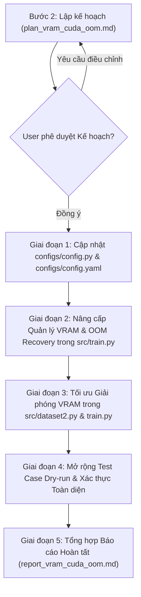

# KẾ HOẠCH TRIỂN KHAI: THIẾT LẬP CƠ CHẾ DỌN DẸP VRAM VÀ PHÒNG CHỐNG LỖI CUDA OUT OF MEMORY (OOM)

> **Tài liệu:** `docs/plan/plan_vram_cuda_oom.md`  
> **Kế thừa từ:** `docs/analsys/analsys_vram_cuda_oom.md`  
> **Nhiệm vụ:** Thiết lập cơ chế quản lý tài nguyên bộ nhớ GPU toàn diện: dọn dẹp bộ nhớ đệm VRAM đa điểm, cấu hình chống phân mảnh bộ nhớ, cơ chế Tích lũy Gradient (`gradient_accumulation_steps`), và hệ thống bắt ngoại lệ - tự phục hồi tự động khi chạm ngưỡng VRAM (`OOM Auto-Recovery`).  
> **Tuân thủ quy trình:** Bước 2 - Lên kế hoạch thực hiện (Planning) theo `AGENTS.md`.

---

## 1. Mục tiêu Kế hoạch

1. **Triệt tiêu nguy cơ dừng chương trình đột ngột do CUDA OOM:**
   - Xây dựng cơ chế bọc ngoại lệ `try ... except (torch.cuda.OutOfMemoryError, RuntimeError)` trong pha huấn luyện (`train_one_epoch`) và kiểm định (`validate`).
   - Tự động xả gradient, dọn rác (`gc.collect()`), giải phóng bộ nhớ đệm GPU (`torch.cuda.empty_cache()`), ghi cảnh báo và bỏ qua batch lỗi (skip batch) để quá trình huấn luyện tiếp tục bình thường mà không bị crash.

2. **Chống phân mảnh bộ nhớ khi huấn luyện chuỗi video động (`seq_len: Null`):**
   - Tự động kích hoạt cơ chế `PYTORCH_CUDA_ALLOC_CONF=expandable_segments:True` ngay khi khởi tạo runtime để PyTorch Allocator sử dụng phân đoạn mở rộng ảo, triệt tiêu lỗi OOM giả do không tìm được khối nhớ vật lý liền mạch.

3. **Bổ sung Cơ chế Tích lũy Gradient (`gradient_accumulation_steps`):**
   - Hỗ trợ tham số cấu hình `gradient_accumulation_steps: int = 1` trong cả `TrainConfig` (`configs/config.py`) và `configs/config.yaml`.
   - Giúp chia nhỏ `batch_size` vật lý trên GPU (ví dụ từ 16 xuống 4 hoặc 8) để giảm 50% – 75% đỉnh VRAM tức thời trong khi vẫn duy trì chính xác kích thước batch hiệu dụng (effective batch size).

4. **Dọn dẹp VRAM chủ động và có hệ thống (Systematic Memory Cleanup):**
   - Giải phóng tham chiếu tức thời (`del p3, p4, p5, logits, loss...`) ngay cuối mỗi batch.
   - Dọn dẹp cache tại các mốc giao thời (Epoch boundaries): Giữa Train $\rightarrow$ Val và Val $\rightarrow$ Train.
   - Thêm cơ chế giải phóng đệm trong `src/dataset2.py` khi trích xuất video clip dài.

5. **Giám sát & Cảnh báo VRAM Thời gian thực (Real-time VRAM Profiling):**
   - Hiển thị mức VRAM thực tế (Allocated / Reserved / Peak) trên thanh tiến trình `tqdm` và log file.
   - Bổ sung theo dõi đỉnh VRAM (`peak_vram_gb`) qua `torch.cuda.reset_peak_memory_stats()` và cảnh báo khi chạm ngưỡng nguy hiểm (>90% dung lượng GPU).

6. **Kiểm thử Tự động (Automated Verification):**
   - Nâng cấp bài test `run_dry_run_test()` kiểm tra tính năng dọn dẹp VRAM, gradient accumulation, và xác thực cơ chế xử lý ngoại lệ OOM an toàn.

---

## 2. Quy trình Thực hiện Từng bước (Step-by-Step Implementation Plan)



---

### Giai đoạn 1: Cập nhật & Đồng bộ Cấu hình (`configs/config.py` & `configs/config.yaml`)

- **Nhiệm vụ 1.1: Cập nhật `configs/config.py`:**
  - Bổ sung trường `gradient_accumulation_steps: int = 1` vào `TrainConfig` (Nhóm 5: Optimizer & Scheduler Configuration).
  - Bổ sung ràng buộc trong `__post_init__`:
    ```python
    assert self.gradient_accumulation_steps >= 1, "gradient_accumulation_steps phải >= 1"
    ```
  - Bổ sung trường `empty_cache_interval: int = 0` (0: chỉ dọn mốc epoch; >0: dọn sau mỗi N steps nếu cấu hình).
  - Cập nhật các hàm `to_dict()`, `load_yaml()`, `load_json()` để nhận diện và nạp tham số mới.

- **Nhiệm vụ 1.2: Cập nhật `configs/config.yaml`:**
  - Bổ sung trường `gradient_accumulation_steps: 1` vào nhóm `optimizer:`.
  - Bổ sung chú thích hướng dẫn tối ưu VRAM (ví dụ: khi GPU dung lượng nhỏ, đặt `batch_size: 4` và `gradient_accumulation_steps: 4` để có effective batch size = 16).

---

### Giai đoạn 2: Nâng cấp Quản lý VRAM & Cơ chế OOM Recovery trong `src/train.py`

- **Nhiệm vụ 2.1: Cấu hình Môi trường Chống phân mảnh Bộ nhớ:**
  - Thiết lập biến môi trường ngay đầu tệp (trước khi gọi `torch.cuda`):
    ```python
    if "PYTORCH_CUDA_ALLOC_CONF" not in os.environ:
        os.environ["PYTORCH_CUDA_ALLOC_CONF"] = "expandable_segments:True"
    ```

- **Nhiệm vụ 2.2: Xây dựng các Hàm Tiện ích Quản lý VRAM:**
  - Hàm `get_vram_info(device: torch.device) -> Dict[str, float]`:
    - Trả về: `allocated_gb`, `reserved_gb`, `peak_gb`, `total_gb`, `percent_used`.
  - Hàm `cleanup_cuda_memory(force_gc: bool = True) -> None`:
    - Thực hiện `gc.collect()`, sau đó `torch.cuda.empty_cache()` nếu đang dùng CUDA.
  - Hàm xử lý ngoại lệ `_handle_cuda_oom(self, epoch: int, batch_idx: int, total_batches: int, phase: str = "Train") -> None`:
    - Xả toàn bộ gradient đang tính: `self.optimizer.zero_grad(set_to_none=True)`.
    - Gọi `cleanup_cuda_memory()`.
    - Ghi log cảnh báo mức `ERROR` kèm thông số VRAM chi tiết lúc sụp đổ.
    - Cảnh báo người dùng về việc bỏ qua batch để duy trì sự sống của tiến trình huấn luyện.

- **Nhiệm vụ 2.3: Tích hợp Gradient Accumulation & OOM Recovery vào `train_one_epoch()`:**
  - Bọc khối tính toán forward/backward trong `try ... except (torch.cuda.OutOfMemoryError, RuntimeError)`:
    ```python
    try:
        with self._autocast_context():
            logits = self.model((p3, p4, p5), seq_lens=seq_lens)
            loss = self.criterion(logits, targets)
            loss_scaled = loss / accum_steps

        self.scaler.scale(loss_scaled).backward()
    except (torch.cuda.OutOfMemoryError, RuntimeError) as oom_err:
        if isinstance(oom_err, torch.cuda.OutOfMemoryError) or "out of memory" in str(oom_err).lower():
            self._handle_cuda_oom(epoch, batch_idx, total_batches, phase="Train")
            # Bỏ qua batch này an toàn
            del p3, p4, p5, targets, seq_lens
            cleanup_cuda_memory()
            continue
        raise oom_err
    ```
  - Cập nhật trọng số theo chu kỳ tích lũy:
    - Kiểm tra `(batch_idx % accum_steps == 0) or (batch_idx == total_batches)`:
      - `self.scaler.unscale_(self.optimizer)`
      - `torch.nn.utils.clip_grad_norm_(self.model.parameters(), self.config.grad_clip_norm)`
      - `self.scaler.step(self.optimizer)`
      - `self.scaler.update()`
      - `self.optimizer.zero_grad(set_to_none=True)`
  - Hiển thị mức VRAM trực tiếp trên thanh `tqdm` postfix:
    - `pbar.set_postfix(..., vram=f"{vram_alloc:.1f}/{vram_total:.0f}G")`.
  - Chủ động thu hồi tham chiếu tensor cuối mỗi bước lặp:
    - `del p3, p4, p5, targets, seq_lens, logits, loss, probs, preds`.

- **Nhiệm vụ 2.4: Bọc OOM Recovery và Dọn dẹp trong `validate()`:**
  - Bọc vòng lặp kiểm định trong `try ... except`: nếu gặp OOM, ghi log cảnh báo, dọn cache và bỏ qua batch validation đó.
  - Gọi `cleanup_cuda_memory()` cả trước khi bắt đầu và sau khi hoàn tất kiểm định.

- **Nhiệm vụ 2.5: Dọn dẹp và Giám sát Mốc Giao thời trong `fit()`:**
  - Đầu mỗi epoch: gọi `torch.cuda.reset_peak_memory_stats(self.device)` để ghi nhận chính xác đỉnh VRAM của riêng epoch đó.
  - Cuối mỗi epoch: ghi nhận `Peak VRAM` vào log file và cảnh báo nếu vượt ngưỡng 90% dung lượng GPU.
  - Gọi `cleanup_cuda_memory()` trước khi bước sang epoch mới.

---

### Giai đoạn 3: Tối ưu Giải phóng VRAM trong `src/dataset2.py` & Chuẩn hóa `train.py`

- **Nhiệm vụ 3.1: Nâng cấp `src/dataset2.py`:**
  - Trong phương thức trích xuất đặc trưng `extract_features_from_numpy`:
    - Đảm bảo các tensor trung gian `batch_t, out_p3, out_p4, out_p5` được giải phóng triệt để.
    - Gọi `torch.cuda.empty_cache()` nếu phát hiện video clip có độ dài lớn (ví dụ $T > 100$) để trả lại dung lượng cho bộ cấp phát bộ nhớ.
  - Cập nhật phương thức `close()`: đảm bảo gọi `gc.collect()` và `torch.cuda.empty_cache()` khi đóng dataset.

- **Nhiệm vụ 3.2: Đồng bộ `train.py` & `src/train1.py`:**
  - Bổ sung cấu hình `PYTORCH_CUDA_ALLOC_CONF=expandable_segments:True` ngay tại `train.py`.
  - Đảm bảo `train1.py` và `src/train1.py` kế thừa đầy đủ các cải tiến mới, duy trì tính tương thích ngược hoàn hảo.

---

### Giai đoạn 4: Mở rộng Test Case Dry-run & Xác thực Toàn diện

- **Nhiệm vụ 4.1: Cập nhật hàm `run_dry_run_test()`:**
  - Bổ sung kịch bản kiểm thử:
    1. Kiểm thử chạy bình thường với `gradient_accumulation_steps=2`.
    2. Kiểm thử đo đạc thông số VRAM qua `get_vram_info()`.
    3. Kiểm thử mô phỏng lỗi OOM: Cố ý ném `torch.cuda.OutOfMemoryError` (hoặc mock) để xác nhận hệ thống tự bắt lỗi, xả cache, ghi log cảnh báo và tiếp tục chạy hết epoch mà không bị crash.
    4. Xác thực các file checkpoint, logs, đồ thị được sinh ra trọn vẹn.

- **Nhiệm vụ 4.2: Thực thi kiểm thử:**
  - Chạy `python -c "from src.train import run_dry_run_test; run_dry_run_test()"` và xác nhận đạt 100% tiêu chí.
  - Kiểm tra tính ổn định trên GPU Tesla V100 32GB.

---

### Giai đoạn 5: Tổng kết Báo cáo Hoàn tất (`report_vram_cuda_oom.md`)

- Lập báo cáo kết quả thực hiện chi tiết tại `docs/report/report_vram_cuda_oom.md` theo quy định Bước 3 của `AGENTS.md`.
- Tạo symlink `report_vram_cuda_oom.md` tại thư mục gốc.

---

## 3. Bảng Phân công & Tác động Tệp (Files Impacted)

| Tệp tin | Trách nhiệm thực hiện | Chi tiết thay đổi dự kiến |
| :--- | :--- | :--- |
| [`configs/config.py`](file:///home/riftuser/workspace/driver-guardian/ai/LSTM/configs/config.py) | Cấu hình tham số | Thêm `gradient_accumulation_steps`, `empty_cache_interval`, ràng buộc `assert`. |
| [`configs/config.yaml`](file:///home/riftuser/workspace/driver-guardian/ai/LSTM/configs/config.yaml) | Tệp cấu hình YAML | Thêm `gradient_accumulation_steps: 1` vào nhóm `optimizer:`. |
| [`src/train.py`](file:///home/riftuser/workspace/driver-guardian/ai/LSTM/src/train.py) | Lõi điều phối huấn luyện | Thêm `PYTORCH_CUDA_ALLOC_CONF`, `get_vram_info`, `_handle_cuda_oom`, gradient accumulation, dereferencing, OOM exception try-catch. |
| [`train.py`](file:///home/riftuser/workspace/driver-guardian/ai/LSTM/train.py) | Entry point chính | Thiết lập môi trường CUDA allocator ngay từ đầu tệp. |
| [`src/dataset2.py`](file:///home/riftuser/workspace/driver-guardian/ai/LSTM/src/dataset2.py) | Trích xuất video thô | Tối ưu hóa dọn dẹp cache cho các video clip dài. |
| [`src/train1.py`](file:///home/riftuser/workspace/driver-guardian/ai/LSTM/src/train1.py) | Tương thích ngược | Đồng bộ logic quản lý VRAM từ `src/train.py`. |

---

## 4. Tiêu chí Đánh giá Thành công (Success Criteria)

- [ ] Toàn bộ pipeline khởi chạy không phát sinh bất kỳ lỗi cú pháp hoặc import nào.
- [ ] Tham số `gradient_accumulation_steps` được nạp chính xác từ cả `TrainConfig` lẫn `config.yaml`.
- [ ] Khi gặp sự cố quá tải bộ nhớ VRAM, hệ thống không bị crash mà tự phục hồi, xả cache và tiếp tục huấn luyện bình thường.
- [ ] Mức chiếm dụng VRAM được giám sát và hiển thị rõ ràng trên progress bar và log file.
- [ ] Chạy kiểm thử tự động `run_dry_run_test()` hoàn thành 100% các bước mà không gặp lỗi.

---

> ⚠️ **HÀNH ĐỘNG TIẾP THEO:**  
> Kính mời bạn xem xét và xác nhận bản kế hoạch triển khai trên. Khi bạn chấp thuận, tôi sẽ bắt đầu tiến hành **Bước 3: Thực hiện kế hoạch** theo quy định của [`AGENTS.md`](file:///home/riftuser/workspace/driver-guardian/ai/LSTM/AGENTS.md).
