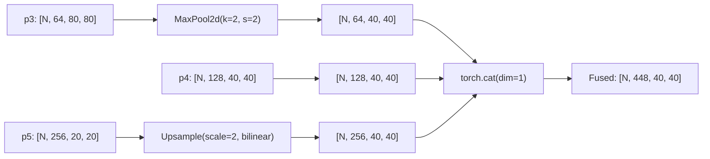
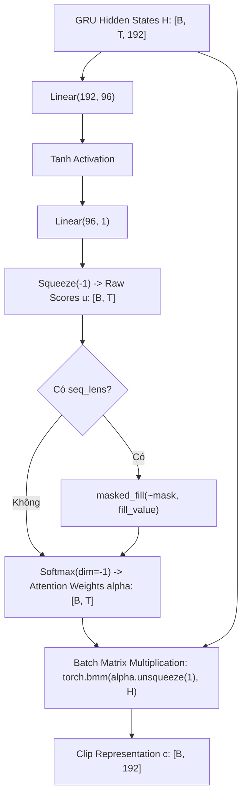
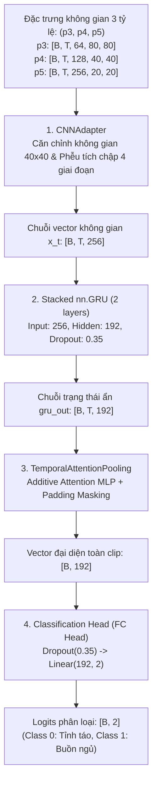

# TÀI LIỆU ĐẶC TẢ KỸ THUẬT: MÔ HÌNH DEEPGRUCLASSIFIER VÀ CÁC KHỐI LIÊN QUAN

**Mã tài liệu:** `spec_deepgru_classifier.md`  
**Dự án:** Hệ Thống Giám Sát và Cảnh Báo Tài Xế Buồn Ngủ (Driver Guardian)  
**Tệp mã nguồn:** [`src/models.py`](file:///D:/Project/DATN/driver-guardian/ai/LSTM/src/models.py)  
**Các khối đặc tả:** [`CNNAdapter`](file:///D:/Project/DATN/driver-guardian/ai/LSTM/src/models.py#L9-L269), [
`TemporalAttentionPooling`](file:///D:/Project/DATN/driver-guardian/ai/LSTM/src/models.py#L270-L308), [
`DeepGRUClassifier`](file:///D:/Project/DATN/driver-guardian/ai/LSTM/src/models.py#L309-L457)  
**Phiên bản chuẩn:** v1.0 (Clip-level Drowsiness Classification)

---

## MỤC LỤC

1. [Phần 1: Đặc Tả Chi Tiết Khối CNNAdapter (Spatial Feature Adapter)](#phần-1-đặc-tả-chi-tiết-khối-cnnadapter-spatial-feature-adapter)
    - 1.1. Mục tiêu và bản chất kiến trúc
    - 1.2. Căn chỉnh không gian đa tỷ lệ
    - 1.3. Phễu tích chập phân tầng 4 giai đoạn
2. [Phần 2: Đặc Tả Chi Tiết Khối TemporalAttentionPooling](#phần-2-đặc-tả-chi-tiết-khối-temporalattentionpooling)
    - 2.1. Cơ sở toán học Additive Attention
    - 2.2. Cơ chế Masking triệt tiêu Zero-Padding
    - 2.3. Xử lý ổn định số học trong Half-Precision (FP16 / FP32)
3. [Phần 3: Đặc Tả Chi Tiết Khối DeepGRUClassifier](#phần-3-đặc-tả-chi-tiết-khối-deepgruclassifier)
    - 3.1. Kiến trúc chuỗi thời gian Stacked Deep GRU
    - 3.2. Luồng phân loại Clip-level chuẩn hóa (End-to-End Flow)

---

---

## PHẦN 1: ĐẶC TẢ CHI TIẾT KHỐI `CNNAdapter` (SPATIAL FEATURE ADAPTER)

### 1.1. Mục tiêu và bản chất kiến trúc

Khối [`CNNAdapter`](file:///D:/Project/DATN/driver-guardian/ai/LSTM/src/models.py#L9-L269) đảm nhận nhiệm vụ chuyển đổi
và kết hợp 3 tầng bản đồ đặc trưng không gian đa tỷ lệ trích xuất từ Backbone-PAFPN thành vector đặc trưng không gian cô
đọng $x_t \in \mathbb{R}^{256}$ cho từng khung hình $t$:

- $p_3 \in \mathbb{R}^{B \times T \times 64 \times 80 \times 80}$: Đặc trưng độ phân giải cao, lưu trữ chi tiết biên,
  góc cạnh và cấu trúc bề mặt (texture) cục bộ.
- $p_4 \in \mathbb{R}^{B \times T \times 128 \times 40 \times 40}$: Đặc trưng mức độ vừa, đại diện cho các bộ phận khuôn
  mặt (mắt, mũi, miệng).
- $p_5 \in \mathbb{R}^{B \times T \times 256 \times 20 \times 20}$: Đặc trưng ngữ nghĩa cấp cao toàn khuôn mặt ở độ phân
  giải thấp.

Thay vì nén phẳng làm mất tương quan tọa độ, kiến trúc sử dụng **Phễu tích chập phân tầng (Hierarchical Convolutional
Pyramid)** để học mối liên hệ hình học giữa các bộ phận trên khuôn mặt qua các bước trượt tích chập có thể học được.

---

### 1.2. Căn chỉnh không gian đa tỷ lệ (`_align_spatial_features`)

Trước khi hợp nhất kênh, 3 tầng đặc trưng được đưa về cùng một kích thước không gian chuẩn là lưới trung
gian $40 \times 40$:

1. **Căn chỉnh tầng $p_3$:** Áp dụng phép lấy mẫu giảm `nn.MaxPool2d(kernel_size=2, stride=2)`:
   $$[N, 64, 80, 80] \xrightarrow{\text{MaxPool2d}} [N, 64, 40, 40]$$
2. **Căn chỉnh tầng $p_4$:** Giữ nguyên kích thước gốc:
   $$[N, 128, 40, 40]$$
3. **Căn chỉnh tầng $p_5$:** Áp dụng phép nội suy song tuyến tính
   `nn.Upsample(scale_factor=2, mode="bilinear", align_corners=False)`:
   $$[N, 256, 20, 20] \xrightarrow{\text{Bilinear Upsample}} [N, 256, 40, 40]$$
4. **Hợp nhất kênh (Channel Concatenation):**
   Ghép nối 3 tensor dọc theo trục kênh:
   $$\text{Fused} = \text{Concat} ([p_3^{\text{align}}, p_4^{\text{align}}, p_5^{\text{align}}], \text{dim}=1) \in \mathbb{R}^{N \times 448 \times 40 \times 40}$$
   với $N = B \times T$ và tổng số kênh $C_{\text{total}} = 64 + 128 + 256 = 448$.

---

### 1.3. Phễu tích chập phân tầng 4 giai đoạn (`hierarchical_conv_pyramid`)

Sau khi ghép nối kênh, khối `hierarchical_conv_pyramid` tiến hành trích xuất phân tầng từ tương quan cục bộ đến toàn thể
khuôn mặt qua 4 giai đoạn tích chập liên tiếp:

| Giai đoạn             | Thao tác và Lớp mạng (Sub-layer)                                                            | Kích thước Tensor đầu ra | Vai trò trích xuất hình học                                                                                                                              |
|:----------------------|:--------------------------------------------------------------------------------------------|:-------------------------|:---------------------------------------------------------------------------------------------------------------------------------------------------------|
| **Đầu vào**           | Tensor ghép kênh đa tỉ lệ                                                                   | $[N, 448, 40, 40]$       | Biểu diễn không gian hợp nhất 3 tỷ lệ                                                                                                                    |
| **Stage 1**           | `Conv2d(448, 512, k=3, s=2, p=1, bias=False)` `BatchNorm2d(512)` `SiLU(inplace=True)` | $[N, 512, 20, 20]$       | **Học tương quan cục bộ:** Mép mi mắt trên/dưới, nếp nhăn đuôi mắt, vành môi và mép miệng.                                                               |
| **Stage 2**           | `Conv2d(512, 512, k=3, s=2, p=1, bias=False)` `BatchNorm2d(512)` `SiLU(inplace=True)` | $[N, 512, 10, 10]$       | **Học tương quan vùng:** Khoảng cách tương đối giữa hai mắt, tam giác hình học giữa hai mắt và chóp mũi, độ mở của miệng so với sống mũi.                |
| **Stage 3**           | `Conv2d(512, 512, k=3, s=2, p=1, bias=False)` `BatchNorm2d(512)` `SiLU(inplace=True)` | $[N, 512, 5, 5]$         | **Học tương quan toàn thể khuôn mặt:** Tư thế đầu, trục nghiêng của khuôn mặt và hướng nhìn của tài xế.                                                  |
| **Stage 4**           | `Conv2d(512, 256, k=5, s=1, p=0, bias=False)` `BatchNorm2d(256)` `SiLU(inplace=True)` | $[N, 256, 1, 1]$         | **Tổng hợp biểu diễn toàn thể:** Sử dụng ma trận trọng số $5 \times 5$ học được để tổng hợp toàn bộ lưới $5 \times 5$ về một điểm duy nhất $1 \times 1$. |
| **Squeeze & Dropout** | `x.squeeze(-1).squeeze(-1)` `Dropout(p=0.25)`                                            | $[N, 256]$               | Thu gọn số chiều thành vector đặc trưng, áp dụng regularization chống quá khớp.                                                                          |

Cuối cùng, tensor được chuyển đổi định dạng để khôi phục cấu trúc chuỗi thời gian:
$$X = \text{Reshape} ([N, 256]) \in \mathbb{R}^{B \times T \times 256}$$

---

## PHẦN 2: ĐẶC TẢ CHI TIẾT KHỐI `TemporalAttentionPooling`

### 2.1. Cơ sở toán học Additive Attention (Bahdanau-style Attention Pooling)

Khối [`TemporalAttentionPooling`](file:///D:/Project/DATN/driver-guardian/ai/LSTM/src/models.py#L270-L308) nhận đầu vào
là chuỗi các trạng thái ẩn thời gian từ GRU:
$$H = [h_1, h_2, \dots, h_T] \in \mathbb{R}^{B \times T \times D} \quad (D = 192)$$
cùng vector độ dài thực tế của từng clip trong batch:
$$\text{seq\_lens} = [L_1, L_2, \dots, L_B] \in \mathbb{N}^B \quad (1 \le L_i \le T)$$

Khối thực hiện gom tụ chuỗi trạng thái thành vector đại diện clip $c_i \in \mathbb{R}^D$ qua các bước tính toán sau:

1. **Tính điểm chú ý thô (Raw Attention Scores):**
   Mạng nơ-ron truyền thẳng 2 tầng (MLP) ánh xạ từng trạng thái ẩn $h_{i, t}$ thành một giá trị vô hướng $u_{i, t}$:
   $$u_{i, t} = W_2 \tanh (W_1 h_{i, t} + b_1) + b_2$$
   Trong đó:
    - $W_1 \in \mathbb{R}^{\frac{D}{2} \times D} = \mathbb{R}^{96 \times 192}$, $b_1 \in \mathbb{R}^{96}$
    - $W_2 \in \mathbb{R}^{1 \times \frac{D}{2}} = \mathbb{R}^{1 \times 96}$, $b_2 \in \mathbb{R}^1$

2. **Chuẩn hóa xác suất Softmax:**
   $$\alpha_{i, t} = \frac{\exp (u_{i, t})}{\sum_{k=1}^T \exp (u_{i, k})} \in [0, 1], \quad \sum_{t=1}^T \alpha_{i, t} = 1.0$$

3. **Gom tụ có trọng số chú ý (Weighted Sum Aggregation):**
   $$c_i = \sum_{t=1}^T \alpha_{i, t} h_{i, t} = \text{bmm} (\boldsymbol{\alpha}_i, H_i) \in \mathbb{R}^{192}$$
   với $\boldsymbol{\alpha}_i \in \mathbb{R}^{1 \times T}$ và $H_i \in \mathbb{R}^{T \times 192}$.

---

## PHẦN 3: ĐẶC TẢ CHI TIẾT KHỐI `DeepGRUClassifier`

### 3.1. Kiến trúc chuỗi thời gian Stacked Deep GRU

Khối [`DeepGRUClassifier`](file:///D:/Project/DATN/driver-guardian/ai/LSTM/src/models.py#L309-L457) sử dụng mạng nơ-ron
hồi quy có cổng (Gated Recurrent Unit - GRU) gồm 2 tầng xếp chồng (`num_layers=2`):

- Kích thước vector đầu vào: `input_size=256` (nhận trực tiếp từ `CNNAdapter`).
- Kích thước không gian trạng thái ẩn: `hidden_size=192`.
- Định dạng dữ liệu: `batch_first=True` ($[B, T, D]$).

Tại mỗi bước thời gian $t$, mỗi ô GRU cập nhật trạng thái ẩn $h_t$ dựa trên đầu vào hiện tại $x_t$ và trạng thái trước
đó $h_{t-1}$:

1. **Cổng đặt lại (Reset Gate $r_t$):**
   $$r_t = \sigma (W_{ir} x_t + b_{ir} + W_{hr} h_{t-1} + b_{hr})$$
2. **Cổng cập nhật (Update Gate $z_t$):**
   $$z_t = \sigma (W_{iz} x_t + b_{iz} + W_{hz} h_{t-1} + b_{hz})$$
3. **Trạng thái ẩn ứng viên (Candidate Hidden State $n_t$):**
   $$n_t = \tanh (W_{in} x_t + b_{in} + r_t \odot (W_{hn} h_{t-1} + b_{hn}))$$
4. **Trạng thái ẩn mới (New Hidden State $h_t$):**
   $$h_t = (1 - z_t) \odot n_t + z_t \odot h_{t-1}$$

Giữa tầng 1 và tầng 2 của GRU được tích hợp lớp ngắt kết nối ngẫu nhiên `dropout=0.35` để giảm tương thuộc và ngăn chặn
quá khớp (overfitting) trên dữ liệu chuỗi thời gian.

---

### 3.2. Luồng phân loại Clip-level chuẩn hóa (End-to-End Flow)

Trong chế độ phân loại mặc định (Phương án A - Clip-level), luồng xử lý toàn bộ mô hình được chuẩn hóa theo 4 bước liên
tục:

1. **Bước 1: Chuyển đổi đặc trưng không gian đa tỷ lệ:**
   Chuỗi đặc trưng không gian $(p_3, p_4, p_5)$ đi qua `spatial_adapter` (`CNNAdapter`):
   $$(p_3, p_4, p_5) \xrightarrow{\text{spatial\_adapter}} X \in \mathbb{R}^{B \times T \times 256}$$
2. **Bước 2: Mô hình hóa động học thời gian qua Deep GRU:**
   Chuỗi vector $X$ được truyền qua 2 tầng GRU:
   $$X \xrightarrow{\text{gru}} H \in \mathbb{R}^{B \times T \times 192}$$
3. **Bước 3: Gom tụ biểu diễn clip có trọng số chú ý:**
   Chuỗi trạng thái ẩn $H$ cùng thông tin độ dài thực tế `seq_lens` được đưa vào `temporal_pooling`:
   $$(H, \text{seq\_lens}) \xrightarrow{\text{temporal\_pooling}} c \in \mathbb{R}^{B \times 192}$$
4. **Bước 4: Phân loại hành vi buồn ngủ (FC Head):**
   Vector đại diện clip $c$ đi qua khối nơ-ron kết nối đầy đủ:
   $$\text{logits} = W_{\text{fc}} \cdot (\text{Dropout}_{0.35} (c)) + b_{\text{fc}} \in \mathbb{R}^{B \times 2}$$
   Trong đó:
    - $W_{\text{fc}} \in \mathbb{R}^{2 \times 192}, b_{\text{fc}} \in \mathbb{R}^2$
    - Chỉ số lớp $0$: Tài xế tỉnh táo (Alert).
    - Chỉ số lớp $1$: Tài xế có dấu hiệu buồn ngủ (Drowsy).

---

## TỔNG KẾT BẢNG THÔNG SỐ ĐẶC TẢ KỸ THUẬT

| Thông số kỹ thuật                    | Giá trị chuẩn hóa                        | Mô tả                                                                                   |
|:-------------------------------------|:-----------------------------------------|:----------------------------------------------------------------------------------------|
| **Kênh đầu vào không gian**          | $(64, 128, 256)$                         | Số kênh tương ứng của $p_3, p_4, p_5$                                                   |
| **Độ phân giải trung gian**          | $40 \times 40$                           | Lưới không gian căn chỉnh chuẩn sau MaxPool/Upsample                                    |
| **Kênh ghép nối phân tầng**          | $448$                                    | $64 + 128 + 256$ kênh                                                                   |
| **Số tầng Phễu tích chập**           | $4$ giai đoạn                            | Stage 1 ($512$), Stage 2 ($512$), Stage 3 ($512$), Stage 4 ($256$, kernel $5 \times 5$) |
| **Chiều vector đặc trưng ($x_t$)**   | $256$                                    | Kích thước đầu ra của `CNNAdapter` và đầu vào của GRU                                   |
| **Số lớp GRU**                       | $2$ lớp xếp chồng                        | Stacked Deep GRU                                                                        |
| **Kích thước không gian ẩn ($h_t$)** | $192$                                    | Hidden dimension của GRU và Attention Pooling                                           |
| **Cơ chế Pooling thời gian**         | Additive Attention MLP                   | Tích hợp Zero-Padding Masking và thích ứng FP16/FP32                                    |
| **Tỷ lệ Dropout**                    | Adapter: $0.25$, GRU: $0.35$, FC: $0.35$ | Regularization ngăn chặn quá khớp                                                       |
| **Số lớp phân loại đầu ra**          | $2$                                      | Lớp 0: Alert, Lớp 1: Drowsy                                                             |
