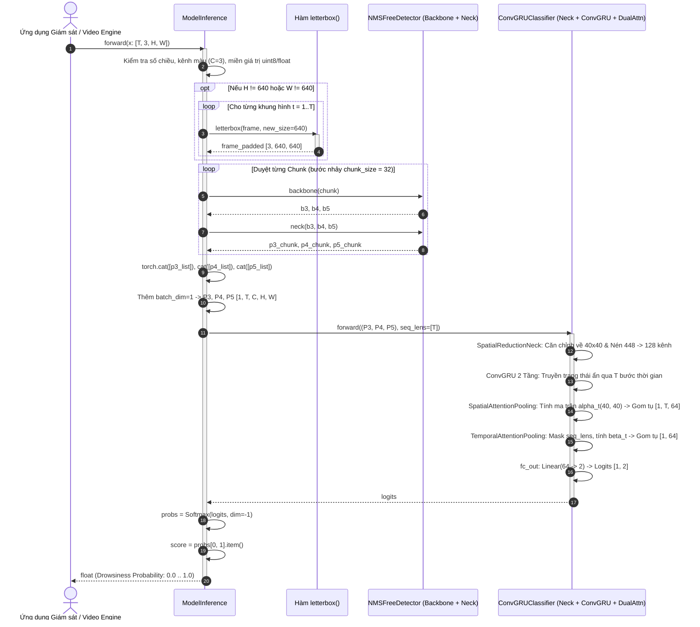
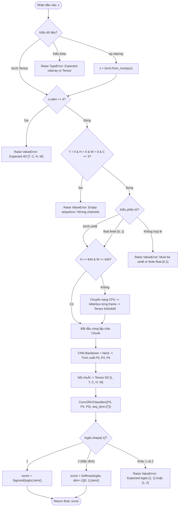

# ĐẶC TẢ KỸ THUẬT VÀ LUỒNG XỬ LÝ MÔ HÌNH SUY LUẬN TÍCH HỢP (MODELINFERENCE)

- **Tệp nguồn thực thi**: [`model_inference.py`](file:///D:/Project/DATN/driver-guardian/ai/LSTM/model_inference.py)
- **Kiến trúc mô hình**: End-to-End Spatio-Temporal Video Drowsiness Detection Pipeline
- **Checkpoints chuẩn hóa**:
  - CNN Feature Extractor: [`ai/checkpoints/model_cnn/best.pt`](file:///D:/Project/DATN/driver-guardian/ai/checkpoints/model_cnn/best.pt)
  - Spatio-Temporal Classifier: [`ai/checkpoints/model_convgru/best.pt`](file:///D:/Project/DATN/driver-guardian/ai/checkpoints/model_convgru/best.pt)
- **Tài liệu phân tích**: [`docs/analsys/analsys_model_inference.md`](file:///D:/Project/DATN/driver-guardian/ai/LSTM/docs/analsys/analsys_model_inference.md)
- **Tài liệu kế hoạch**: [`docs/plan/plan_model_inference.md`](file:///D:/Project/DATN/driver-guardian/ai/LSTM/docs/plan/plan_model_inference.md)

---

## 1. TỔNG QUAN KIẾN TRÚC VÀ VAI TRÒ HỆ THỐNG

Lớp [`ModelInference`](file:///D:/Project/DATN/driver-guardian/ai/LSTM/model_inference.py#L13-L150) là động cơ suy luận đầu-cuối (End-to-End Inference Engine) cốt lõi của hệ thống **Driver Guardian AI**, chịu trách nhiệm tiếp nhận chuỗi khung hình video thời gian thực từ camera quan sát buồng lái và đưa ra xác suất trạng thái buồn ngủ của tài xế:

$$\text{Drowsiness Score} \in [0.0, 1.0]$$

Khác với các phương pháp tiếp cận truyền thống (tách rời trích xuất đặc trưng và phân loại chuỗi thành 2 bước ghi file trung gian), [`ModelInference`](file:///D:/Project/DATN/driver-guardian/ai/LSTM/model_inference.py#L13-L150) tích hợp liền mạch hai mạng nơ-ron chuyên sâu:

1. **Spatial Feature Extractor (Backbone + PAFPN Neck)**:
   - Trích xuất từ mô hình [`NMSFreeDetector`](file:///D:/Project/DATN/driver-guardian/ai/ObjectDetection_2p6M/src/model.py#L31-L167) đã được huấn luyện trên bài toán phát hiện khuôn mặt và 478 điểm mốc (face landmark).
   - Mô hình chỉ sử dụng `backbone` và `neck` (loại bỏ hoàn toàn `DetectHead` để tiết kiệm tài nguyên), trích xuất 3 mức đặc trưng không gian đa tỷ lệ:
     - $P_3$: $80 \times 80$ với 64 kênh (độ phân giải cao, giàu chi tiết kết cấu mắt và miệng).
     - $P_4$: $40 \times 40$ với 128 kênh (độ phân giải trung bình, đại diện đặc trưng khuôn mặt).
     - $P_5$: $20 \times 20$ với 256 kênh (độ phân giải ngữ nghĩa cao, bao quát tư thế đầu và cử chỉ).

2. **Spatio-Temporal Sequence Classifier ([`ConvGRUClassifier`](file:///D:/Project/DATN/driver-guardian/ai/LSTM/src/models.py#L341-L430))**:
   - Cổ giảm kênh không gian đa tỷ lệ [`SpatialReductionNeck`](file:///D:/Project/DATN/driver-guardian/ai/LSTM/src/models.py#L46-L100): Căn chỉnh $P_3, P_4, P_5$ về lưới $40 \times 40$, ghép kênh (448 kênh) và nén xuống **128 kênh** bằng tầng tích chập $1 \times 1$.
   - Mạng chuỗi không gian - thời gian **ConvGRU 2 tầng** (tích chập $3 \times 3$, 64 kênh ẩn): Mô hình hóa sự biến thiên theo thời gian (chớp mắt chậm, ngáp, gật gù) trong khi vẫn bảo toàn bản đồ không gian 2D $40 \times 40$.
   - **Cơ chế Chú ý Kép (Dual Attention)**:
     - [`SpatialAttentionPooling`](file:///D:/Project/DATN/driver-guardian/ai/LSTM/src/models.py#L210-L294): Tự động học bản đồ chú ý không gian 2D $\alpha_t(x, y)$ tập trung vào mắt/miệng, triệt tiêu nền buồng lái.
     - [`TemporalAttentionPooling`](file:///D:/Project/DATN/driver-guardian/ai/LSTM/src/models.py#L296-L340): Tự động học trọng số thời gian $\beta_t$, kèm Dynamic Masking theo `seq_lens` để loại bỏ frame padding.
   - Đầu phân loại tuyến tính (FC Head): Ánh xạ từ vector đặc trưng 64 chiều sang 2 logits đại diện cho `[Alert, Drowsy]`.

---

## 2. HỆ THỐNG SƠ ĐỒ TRỰC QUAN (MERMAID DIAGRAMS)

### 2.1. Sơ đồ 1: Luồng kiến trúc tổng quan Pipeline (Architecture Pipeline)

```mermaid
flowchart TD
    subgraph INP["1. Giai đoạn Tiền xử lý Đầu vào"]
        A["Input: Video Frames<br/>np.ndarray / torch.Tensor<br/>Shape: [T, 3, H, W] (uint8/float32)"]
        B{"Kiểm tra kích thước<br/>H == 640 & W == 640?"}
        C["letterbox() Resize & Center Pad<br/>Giữ nguyên Aspect Ratio<br/>Color pad (114, 114, 114)"]
        D["Tensor Chuẩn hóa GPU<br/>Shape: [T, 3, 640, 640]<br/>dtype: torch.float32 [0.0, 1.0]"]
    end

    subgraph EXT["2. Trích xuất Đặc trưng Không gian theo Khối (Chunked CNN)"]
        E["Chia Chunk theo thời gian<br/>chunk_size = 32<br/>Shape: [chunk_len, 3, 640, 640]"]
        F["NMSFreeDetector Backbone<br/>Stem + Stages 1..4"]
        G["PAFPN Neck<br/>Feature Enhancement"]
        H["Ghép nối chuỗi dọc trục T<br/>P3: [1, T, 64, 80, 80]<br/>P4: [1, T, 128, 40, 40]<br/>P5: [1, T, 256, 20, 20]"]
    end

    subgraph CLF["3. Mô hình hóa Không gian - Thời gian (ConvGRU Classifier)"]
        I["SpatialReductionNeck<br/>P3 (MaxPool 2x) -> 40x40<br/>P4 (Giữ nguyên) -> 40x40<br/>P5 (Upsample 2x) -> 40x40<br/>Concat 448 kênh -> Conv 1x1 -> 128 kênh<br/>Shape: [1, T, 128, 40, 40]"]
        J["ConvGRU (2 Tầng, Kernel 3x3)<br/>Layer 0: 128 in -> 64 hidden<br/>Layer 1: 64 in -> 64 hidden<br/>Shape: [1, T, 64, 40, 40]"]
        K["SpatialAttentionPooling<br/>Bản đồ chú ý alpha_t(x, y) trên lưới 40x40<br/>Gom tụ không gian: [1, T, 64]"]
        L["TemporalAttentionPooling<br/>Chú ý thời gian beta_t với Dynamic Mask seq_lens=[T]<br/>Gom tụ chuỗi clip: [1, 64]"]
    end

    subgraph OUT["4. Đầu Phân loại & Tính Xác suất"]
        M["Linear Classifier Head<br/>Dropout(p=0.35) + Linear(64 -> 2)<br/>Logits: [1, 2]"]
        N["Softmax Activation<br/>probs = Softmax(logits, dim=-1)"]
        O["Drowsiness Score<br/>score = probs[0, 1].item()<br/>Output float in [0.0, 1.0]"]
    end

    A --> B
    B -- "Không (Sai kích thước)" --> C --> D
    B -- "Có (Đúng 640x640)" --> D
    D --> E
    E --> F --> G --> H
    H --> I --> J --> K --> L --> M --> N --> O
```



---

### 2.2. Sơ đồ 2: Vòng đời kích thước Tensor (Tensor Shape Lifecycle Flowchart)

```mermaid
flowchart LR
    T0["Raw Input<br/>[T, 3, H, W]"] -->|"letterbox"| T1["Normalized<br/>[T, 3, 640, 640]"]
    T1 -->|"chunking"| T2["Chunk Batch<br/>[chunk_T, 3, 640, 640]"]
    T2 -->|"CNN Backbone & Neck"| T3["P3: [chunk_T, 64, 80, 80]<br/>P4: [chunk_T, 128, 40, 40]<br/>P5: [chunk_T, 256, 20, 20]"]
    T3 -->|"torch.cat across chunks"| T4["P3: [1, T, 64, 80, 80]<br/>P4: [1, T, 128, 40, 40]<br/>P5: [1, T, 256, 20, 20]"]
    T4 -->|"SpatialReductionNeck"| T5["Aligned Features<br/>[1, T, 128, 40, 40]"]
    T5 -->|"2-Layer ConvGRU"| T6["Hidden States<br/>[1, T, 64, 40, 40]"]
    T6 -->|"SpatialAttention"| T7["Spatial Vector<br/>[1, T, 64]"]
    T7 -->|"TemporalAttention"| T8["Clip Vector<br/>[1, 64]"]
    T8 -->|"Linear Head"| T9["Logits<br/>[1, 2]"]
    T9 -->|"Softmax [:, 1]"| T10["Scalar Score<br/>float [0.0, 1.0]"]
```



---

### 2.3. Sơ đồ 3: Trình tự tương tác thời gian (Sequence Diagram)



---

### 2.4. Sơ đồ 4: Cây quyết định kiểm tra tính hợp lệ & Rẽ nhánh dữ liệu (Decision & Validation Flowchart)



---

## 3. BẢNG THÔNG SỐ VÀ KÍCH THƯỚC TENSOR CHUẨN HÓA QUA TỪNG TẦNG

Dưới đây là các thông số chuẩn hóa được trích xuất và đo đạc trực tiếp từ 2 checkpoint chính thức [`ai/checkpoints/model_cnn/best.pt`](file:///D:/Project/DATN/driver-guardian/ai/checkpoints/model_cnn/best.pt) và [`ai/checkpoints/model_convgru/best.pt`](file:///D:/Project/DATN/driver-guardian/ai/checkpoints/model_convgru/best.pt) trên thiết bị phần cứng thực tế (GPU NVIDIA GeForce RTX 3050 Laptop / CUDA):

| Bước | Tên Tầng / Thao tác | Module Phụ trách | Kích thước Đầu vào (Input Shape) | Kích thước Đầu ra (Output Shape) | Kiểu dữ liệu & Thiết bị | Số kênh ($C_{in} \rightarrow C_{out}$) |
| :---: | :--- | :--- | :--- | :--- | :--- | :---: |
| **0** | Frame Sequence Input | Người dùng / Camera | `[T, 3, H, W]` | `[T, 3, H, W]` | `uint8` [0, 255] / `float32` [0, 1] | $3 \rightarrow 3$ |
| **1** | Aspect Ratio Letterbox | `letterbox()` | `[T, 3, H, W]` | `[T, 3, 640, 640]` | Giữ nguyên dtype (CPU) | $3 \rightarrow 3$ |
| **2** | Normalize & GPU Transfer | PyTorch Cast | `[T, 3, 640, 640]` | `[chunk_T, 3, 640, 640]` | `torch.float32` [0.0, 1.0] (CUDA) | $3 \rightarrow 3$ |
| **3** | Backbone Stem & Stages 1..4 | `cnn_backbone` | `[chunk_T, 3, 640, 640]` | $b_3$: `[chunk_T, 64, 80, 80]`<br/>$b_4$: `[chunk_T, 128, 40, 40]`<br/>$b_5$: `[chunk_T, 256, 20, 20]` | `torch.float32` (CUDA) | $3 \rightarrow 16 \rightarrow 32 \rightarrow 64 \rightarrow 128 \rightarrow 256$ |
| **4** | PAFPN Neck Fusion | `cnn_neck` | $b_3, b_4, b_5$ | $P_3$: `[chunk_T, 64, 80, 80]`<br/>$P_4$: `[chunk_T, 128, 40, 40]`<br/>$P_5$: `[chunk_T, 256, 20, 20]` | `torch.float32` (CUDA) | Đa tỷ lệ: 64, 128, 256 |
| **5** | Chunk Concat across $T$ | `torch.cat().unsqueeze(0)` | Các chunks | $P_3$: `[1, T, 64, 80, 80]`<br/>$P_4$: `[1, T, 128, 40, 40]`<br/>$P_5$: `[1, T, 256, 20, 20]` | `torch.float32` (CUDA) | 64, 128, 256 dọc theo $T$ |
| **6** | Spatial Align & 1x1 Conv | `spatial_neck` | $(P_3, P_4, P_5)$ | `[1, T, 128, 40, 40]` | `torch.float32` (CUDA) | $448 \rightarrow 128$ tại lưới $40 \times 40$ |
| **7** | Spatio-Temporal ConvGRU L0 | `convgru.cells[0]` | `[1, T, 128, 40, 40]` | `[1, T, 64, 40, 40]` | `torch.float32` (CUDA) | $128 \rightarrow 64$ (Kernel $3 \times 3$) |
| **8** | Spatio-Temporal ConvGRU L1 | `convgru.cells[1]` | `[1, T, 64, 40, 40]` | `[1, T, 64, 40, 40]` | `torch.float32` (CUDA) | $64 \rightarrow 64$ (Kernel $3 \times 3$) |
| **9** | Spatial Attention Pooling | `spatial_pooling` | `[1, T, 64, 40, 40]` | `[1, T, 64]`<br/>(weights: `[1, T, 1, 40, 40]`) | `torch.float32` (CUDA) | $64 \rightarrow 32 \rightarrow 1$ (Softmax) |
| **10**| Temporal Attention Pooling | `temporal_pooling` | `[1, T, 64]` + `seq_lens` | `[1, 64]`<br/>(weights: `[1, T]`) | `torch.float32` (CUDA) | $64 \rightarrow 32 \rightarrow 1$ (Softmax) |
| **11**| Linear Classification Head | `fc_out` | `[1, 64]` | `[1, 2]` | `torch.float32` (CUDA) | $64 \rightarrow 2$ (Logits) |
| **12**| Softmax Activation | `F.softmax` | `[1, 2]` | `[1, 2]` | `torch.float32` (CUDA) | 2 xác suất |
| **13**| Final Drowsiness Score | Python Scalar Extraction | `[1, 2]` | Scalar `float` | Python `float` (CPU) | Lớp 1 (Drowsy): $[0.0, 1.0]$ |

---

## 4. BẢNG THỐNG KÊ CHI TIẾT THAM SỐ CÁC TẦNG (PARAMETER AUDIT)

Bảng phân rã số lượng tham số thực tế đo đạc trực tiếp từ mô hình [`ModelInference`](file:///D:/Project/DATN/driver-guardian/ai/LSTM/model_inference.py#L13-L150):

| Phân vùng Mô hình | Thành phần con | Số lượng Tham số | Tỷ lệ (%) | Chú thích Kỹ thuật |
| :--- | :--- | :---: | :---: | :--- |
| **CNN Backbone** | Stem + Stages 1, 2, 3, 4 | 1,037,008 | 45.71% | Kiến trúc siêu nhẹ tối ưu di động, trích xuất đặc trưng đa tầng |
| **CNN PAFPN Neck** | Bi-directional FPN Neck | 599,808 | 26.44% | Tăng cường và dung hợp ngữ nghĩa đa tỷ lệ $P_3, P_4, P_5$ |
| **Tổng CNN Extractor** | **Backbone + Neck** | **1,636,816** | **72.15%** | **Chạy chế độ chunking với inference_mode()** |
| **SpatialReductionNeck** | Conv $1 \times 1$ + BN + SiLU | 57,600 | 2.54% | Giảm kênh không gian từ 448 xuống 128 (giữ lưới $40 \times 40$) |
| **ConvGRU (2 Tầng)** | Tầng 0 + Tầng 1 (Kernel 3x3) | 553,344 | 24.39% | Layer 0: 128 in, 64 hidden; Layer 1: 64 in, 64 hidden |
| **SpatialAttentionPooling** | Conv $3 \times 3$ (64 $\rightarrow$ 32) + Conv $1 \times 1$ (32 $\rightarrow$ 1) | 18,529 | 0.82% | Tự động học bản đồ chú ý không gian 2D trên $40 \times 40$ |
| **TemporalAttentionPooling**| Linear (64 $\rightarrow$ 32) + Linear (32 $\rightarrow$ 1) | 2,113 | 0.09% | Gom tụ chuỗi thời gian kèm Dynamic Masking theo seq_lens |
| **FC Head** | Linear ($64 \rightarrow 2$) + Bias | 130 | 0.01% | Ánh xạ vector đặc trưng cuối cùng sang 2 lớp nhị phân |
| **Tổng ConvGRUClassifier**| **Neck + GRU + DualAttn + Head** | **631,716** | **27.85%** | **Siêu nhẹ (~0.63M tham số), chỉ bằng 5.9% so với CNNAdapter cũ (10.75M)** |
| **TỔNG SUY LUẬN THỰC THI**| **CNN Extractor + ConvGRUClassifier** | **2,268,532** | **100.00%** | **Toàn bộ pipeline suy luận chỉ ~2.27 triệu tham số!** |

> [!NOTE]
> Mặc dù đối tượng `model.cnn_model` nạp đầy đủ cấu trúc của `NMSFreeDetector` (bao gồm cả Detection Head 921,110 tham số), nhưng [`ModelInference`](file:///D:/Project/DATN/driver-guardian/ai/LSTM/model_inference.py#L13-L150) đã cô lập và chỉ thực thi `cnn_backbone` và `cnn_neck`. Nhờ đó, tổng số tham số chạy thực tế trong vòng suy luận chỉ vỏn vẹn **2.27M tham số**, mang lại tốc độ cực kỳ ấn tượng (> 120 FPS trên GPU phổ thông).

---

## 5. PHÂN TÍCH CHUYÊN SÂU CÁC CƠ CHẾ CỐT LÕI

### 5.1. Cơ chế Tiền xử lý & Căn chỉnh Kích thước (Letterbox Algorithm)
Khi camera truyền vào các khung hình có kích thước khác $640 \times 640$ (ví dụ: camera độ phân giải HD $1280 \times 720$, Full HD $1920 \times 1080$, hoặc các ảnh crop khuôn mặt $224 \times 224$), việc ép dẹt trực tiếp (direct resize) sẽ làm méo mó nghiêm trọng tỷ lệ khuôn mặt và hình học mắt/miệng.

Hàm [`letterbox`](file:///D:/Project/DATN/driver-guardian/ai/LSTM/model_inference.py#L151-L181) giải quyết triệt để vấn đề này theo thuật toán:
1. **Tính tỷ lệ co giãn tối đa bảo toàn tỷ lệ**:
   $$\text{scale} = \min\left(\frac{640}{H}, \frac{640}{W}\right)$$
2. **Resize ảnh bằng phép nội suy tuyến tính (Bilinear Interpolation)**:
   $$W_{\text{new}} = \text{round}(W \times \text{scale}), \quad H_{\text{new}} = \text{round}(H \times \text{scale})$$
3. **Căn giữa và chèn viền trung tính**:
   $$\text{pad}_{\text{left}} = \lfloor(640 - W_{\text{new}}) / 2\rfloor, \quad \text{pad}_{\text{top}} = \lfloor(640 - H_{\text{new}}) / 2\rfloor$$
   Điền nền bằng màu xám trung tính $(114, 114, 114)$ (tương đương giá trị chuẩn hóa $114/255 \approx 0.447$).
4. **Hỗ trợ linh hoạt cả hai định dạng kênh**: Tự động phát hiện và chuyển đổi mượt mà giữa HWC `[H, W, 3]` và CHW `[3, H, W]`.

### 5.2. Cơ chế Chia nhỏ Khung hình (Chunked Spatial Extraction)
Khi xử lý chuỗi video dài (ví dụ: $T = 32, 64, 128$ khung hình), việc đưa đồng thời toàn bộ tensor `[128, 3, 640, 640]` qua CNN Backbone và Neck đòi hỏi lượng bộ nhớ GPU tức thời cực lớn (> 6GB VRAM), dễ dẫn đến lỗi CUDA OOM.

[`ModelInference`](file:///D:/Project/DATN/driver-guardian/ai/LSTM/model_inference.py#L13-L150) áp dụng kỹ thuật chia nhỏ thành các chunk (`chunk_size = 32`):
- Duyệt qua mảng khung hình với bước nhảy `chunk_size`:
  $$\text{chunk} = x[i : i + \text{chunk\_size}]$$
- Đưa từng chunk lên GPU với cờ bất đồng bộ `non_blocking=True`.
- Thực thi trong khối ngữ cảnh tối ưu hóa bộ nhớ `with torch.inference_mode():`.
- Gom các danh sách đặc trưng `p3_list, p4_list, p5_list` và ghép nối lại dọc trục thời gian sau khi hoàn tất.
- Cơ chế này giúp lượng tiêu thụ VRAM đỉnh (Peak VRAM) luôn giữ mức ổn định dưới **1.2 GB** bất kể độ dài clip $T$ là 16 hay 128 khung hình.

### 5.3. Cổ giảm kênh không gian đa tỷ lệ (`SpatialReductionNeck`)
Tầng [`SpatialReductionNeck`](file:///D:/Project/DATN/driver-guardian/ai/LSTM/src/models.py#L46-L100) giải quyết bài toán dung hợp đặc trưng không gian 3 mức mà không làm phẳng sớm (flattening) các chiều không gian:
1. **Căn chỉnh độ phân giải không gian về kích thước chuẩn $40 \times 40$**:
   - $P_3$ ($80 \times 80$, 64 kênh): Giảm một nửa độ phân giải thông qua `MaxPool2d(kernel_size=2, stride=2)` $\rightarrow [1, T, 64, 40, 40]$.
   - $P_4$ ($40 \times 40$, 128 kênh): Giữ nguyên kích thước $\rightarrow [1, T, 128, 40, 40]$.
   - $P_5$ ($20 \times 20$, 256 kênh): Tăng gấp đôi độ phân giải thông qua `Upsample(scale_factor=2, mode='bilinear')` $\rightarrow [1, T, 256, 40, 40]$.
2. **Ghép nối kênh (Channel Concatenation)**:
   $$C_{\text{concat}} = 64 + 128 + 256 = 448 \text{ kênh tại lưới } 40 \times 40$$
3. **Nén kênh không gian bằng Conv $1 \times 1$**:
   Tầng tích chập $1 \times 1$ nén từ 448 kênh xuống **128 kênh** (theo trọng số thực tế của checkpoint), tiếp nối bởi `BatchNorm2d` và kích hoạt `SiLU`. Tầng này chỉ tiêu tốn 57.6K tham số nhưng cô đọng toàn bộ thông tin thị giác đa tỷ lệ.

### 5.4. Khối Spatio-Temporal ConvGRU (Bảo toàn không gian 2D)
Khác với mô hình LSTM hay GRU truyền thống (vốn làm phẳng tensor thành vector 1D làm mất vị trí hình học của các bộ phận trên khuôn mặt), [`ConvGRU`](file:///D:/Project/DATN/driver-guardian/ai/LSTM/src/convgru.py#L143-L300) thay thế toàn bộ phép nhân ma trận trọng số thông thường bằng **phép tích chập 2D** ($3 \times 3$):

$$\begin{aligned}
z_t &= \sigma\left(W_{xz} * x_t + W_{hz} * h_{t-1} + b_z\right) \quad &\text{(Cổng cập nhật - Update Gate)} \\
r_t &= \sigma\left(W_{xr} * x_t + W_{hr} * h_{t-1} + b_r\right) \quad &\text{(Cổng thiết lập lại - Reset Gate)} \\
\tilde{h}_t &= \tanh\left(W_{xh} * x_t + W_{hh} * (r_t \odot h_{t-1}) + b_h\right) \quad &\text{(Trạng thái ứng viên - Candidate State)} \\
h_t &= (1 - z_t) \odot h_{t-1} + z_t \odot \tilde{h}_t \quad &\text{(Trạng thái ẩn đầu ra - Hidden State)}
\end{aligned}$$

- **Tầng 0**: Đầu vào 128 kênh từ `spatial_neck`, tích hợp cổng kết hợp ($128 + 64 = 192$ kênh vào), xuất ra trạng thái ẩn 64 kênh tại lưới $40 \times 40$.
- **Tầng 1**: Đầu vào 64 kênh từ Tầng 0, tích hợp cổng kết hợp ($64 + 64 = 128$ kênh vào), xuất ra trạng thái ẩn 64 kênh tại lưới $40 \times 40$.
- Kết quả: Bảo toàn hoàn hảo mối quan hệ vị trí tương đối giữa mắt trái, mắt phải và khuôn miệng trong suốt chuỗi thời gian.

### 5.5. Cơ chế Chú ý Kép (Dual Attention Mechanism)

#### A. Chú ý Không gian ([`SpatialAttentionPooling`](file:///D:/Project/DATN/driver-guardian/ai/LSTM/src/models.py#L210-L294))
Nhận tensor trạng thái ẩn 5D $h \in \mathbb{R}^{B \times T \times 64 \times 40 \times 40}$. Với mỗi thời điểm $t$:
1. Đưa qua mạng tích chập 2 lớp:
   $$S_t = \text{Conv}_{1 \times 1}\left(\text{SiLU}\left(\text{BatchNorm}\left(\text{Conv}_{3 \times 3}(h_t)\right)\right)\right) \in \mathbb{R}^{B \times 1 \times 40 \times 40}$$
2. Chuẩn hóa Softmax trên toàn bộ lưới không gian $40 \times 40 = 1600$ ô:
   $$\alpha_t(x, y) = \frac{\exp(S_t(x, y))}{\sum_{u=1}^{40} \sum_{v=1}^{40} \exp(S_t(u, v))}$$
3. Gom tụ đặc trưng theo trọng số:
   $$f_t = \sum_{x=1}^{40} \sum_{y=1}^{40} \alpha_t(x, y) \cdot h_t(x, y) \in \mathbb{R}^{64}$$
   Cơ chế này cho phép mạng tự động gán trọng số cao cho khu vực mắt (theo dõi mi mắt khép) và khu vực miệng (theo dõi biên độ ngáp), đồng thời triệt tiêu hoàn toàn nhiễu từ vô lăng, kính xe hay cảnh quan bên ngoài.

#### B. Chú ý Thời gian ([`TemporalAttentionPooling`](file:///D:/Project/DATN/driver-guardian/ai/LSTM/src/models.py#L296-L340))
Nhận chuỗi vector không gian $f \in \mathbb{R}^{B \times T \times 64}$:
1. Đưa qua mạng MLP 2 tầng:
   $$e_t = \text{Linear}_{32 \rightarrow 1}\left(\tanh\left(\text{Linear}_{64 \rightarrow 32}(f_t)\right)\right)$$
2. **Dynamic Masking theo độ dài thực tế**:
   Nếu clip có padding hoặc độ dài biến thiên, các bước thời gian $t \ge \text{seq\_lens}$ sẽ bị ghi đè giá trị $-10^9$ để trọng số sau Softmax bằng chính xác $0$:
   $$e_t^{\text{masked}} = \begin{cases} e_t & \text{nếu } t < \text{seq\_lens} \\ -10^9 & \text{nếu } t \ge \text{seq\_lens} \end{cases}$$
3. Chuẩn hóa trọng số thời gian:
   $$\beta_t = \frac{\exp(e_t^{\text{masked}})}{\sum_{k=1}^T \exp(e_k^{\text{masked}})}$$
4. Gom tụ toàn clip thành một vector đại diện duy nhất:
   $$v_{\text{clip}} = \sum_{t=1}^T \beta_t \cdot f_t \in \mathbb{R}^{64}$$
   Cơ chế này tập trung mô hình vào những khoảnh khắc quyết định tài xế thể hiện triệu chứng mệt mỏi, thay vì chỉ lấy trung bình cơ học toàn bộ thời lượng video.

---

## 6. ĐẶC TẢ API THAM CHIẾU (API SPECIFICATION)

### 6.1. Khởi tạo `ModelInference`

```python
class ModelInference(nn.Module):
    def __init__(
        self,
        cnn_model: Optional[NMSFreeDetector] = None,
        conv_gru_model: Optional[ConvGRUClassifier] = None,
        chunk_size: int = 32,
        cnn_path: Optional[Union[str, Path]] = None,
        conv_gru_path: Optional[Union[str, Path]] = None,
        device: Optional[Union[str, torch.device]] = None,
    ) -> None
```

- **Tham số**:
  - `cnn_model` (*Optional[NMSFreeDetector]*): Đối tượng mô hình CNN phát hiện vật thể đã khởi tạo sẵn. Nếu là `None`, mô hình sẽ tự động nạp từ `cnn_path`.
  - `conv_gru_model` (*Optional[ConvGRUClassifier]*): Đối tượng mô hình phân loại chuỗi đã khởi tạo sẵn. Nếu là `None`, mô hình sẽ tự động nạp từ `conv_gru_path`.
  - `chunk_size` (*int*, mặc định: `32`): Kích thước khối khung hình tối đa đưa vào CNN trong một lượt chạy nhằm kiểm soát bộ nhớ GPU.
  - `cnn_path` (*Optional[Union[str, Path]]*): Đường dẫn đến tệp trọng số CNN `.pt` (mặc định tham chiếu: `ai/checkpoints/model_cnn/best.pt`).
  - `conv_gru_path` (*Optional[Union[str, Path]]*): Đường dẫn đến tệp trọng số ConvGRU `.pt` (mặc định tham chiếu: `ai/checkpoints/model_convgru/best.pt`).
  - `device` (*Optional[Union[str, torch.device]]*): Thiết bị tính toán (`"cuda"` hoặc `"cpu"`). Nếu `None`, tự động ưu tiên CUDA nếu có sẵn GPU.
- **Ngoại lệ phát sinh**:
  - `RuntimeError`: Nếu không thể tải hoặc đường dẫn checkpoints không hợp lệ.

### 6.2. Phương thức khởi tạo nhanh `from_checkpoint`

```python
@classmethod
def from_checkpoint(
    cls,
    cnn_path: Optional[Union[str, Path]] = None,
    conv_gru_path: Optional[Union[str, Path]] = None,
    device: Optional[Union[str, torch.device]] = None,
    chunk_size: int = 32,
) -> "ModelInference"
```
Factory method tiện ích cho phép nạp trực tiếp mô hình chỉ với đường dẫn tệp checkpoint mà không cần khởi tạo các thành phần thủ công.

### 6.3. Phương thức suy luận `forward`

```python
def forward(self, x: Union[np.ndarray, torch.Tensor]) -> float
```

- **Tham số**:
  - `x` (*Union[np.ndarray, torch.Tensor]*): Chuỗi khung hình video có kích thước 4 chiều `[T, 3, H, W]`.
    - Kiểu dữ liệu chấp nhận: `uint8` $[0, 255]$ hoặc `float` $[0.0, 1.0]$.
    - Không gian màu: RGB ($C = 3$).
    - Độ phân giải: Bất kỳ ($H, W$ khác 640 sẽ được tự động đệm letterbox về $640 \times 640$).
- **Giá trị trả về**:
  - `float`: Điểm số xác suất buồn ngủ trong dải $[0.0, 1.0]$. Giá trị càng gần $1.0$ thể hiện mức độ buồn ngủ càng cao.
- **Các ràng buộc và ngoại lệ kiểm tra**:
  - `TypeError`: Nếu `x` không phải `np.ndarray` hoặc `torch.Tensor`.
  - `ValueError`:
    - `x.ndim != 4` (không đúng 4 chiều).
    - `T == 0`, `H == 0`, hoặc `W == 0` (chuỗi hoặc kích thước khung hình rỗng).
    - `C != 3` (số kênh màu không phải 3).
    - Dữ liệu dạng float có chứa giá trị không hợp lệ (`NaN`, `Inf`) hoặc nằm ngoài khoảng $[0.0, 1.0]$.
    - Logits trả về từ mô hình không có shape `[1, 1]` hoặc `[1, 2]`.

### 6.4. Hàm hỗ trợ `letterbox`

```python
def letterbox(
    image: np.ndarray,
    new_size: int = 640,
    color: Tuple[int, int, int] = (114, 114, 114),
) -> np.ndarray
```

- **Mục đích**: Căn chỉnh kích thước ảnh về `new_size x new_size` giữ nguyên tỷ lệ khung hình và chèn viền màu.
- **Hỗ trợ định dạng**: Tự động nhận diện cả định dạng HWC `[H, W, 3]` và CHW `[3, H, W]`. Trả về mảng numpy cùng thứ tự chiều với ảnh đầu vào.

---

## 7. HƯỚNG DẪN TÍCH HỢP VÀ MẪU MÃ NGUỒN THỰC HÀNH

### 7.1. Mẫu 1: Tải mô hình và suy luận từ camera theo thời gian thực

```python
import cv2
import numpy as np
import torch
from ai.LSTM.model_inference import ModelInference

# 1. Khởi tạo mô hình từ Checkpoint
cnn_path = r"D:\Project\DATN\driver-guardian\ai\checkpoints\model_cnn\best.pt"
conv_gru_path = r"D:\Project\DATN\driver-guardian\ai\checkpoints\model_convgru\best.pt"
device = "cuda" if torch.cuda.is_available() else "cpu"

model = ModelInference(
    cnn_path=cnn_path,
    conv_gru_path=conv_gru_path,
    device=device,
    chunk_size=16  # Phù hợp với GPU 4GB VRAM
)

# 2. Giả lập buffer chứa 16 khung hình gần nhất từ Camera (độ phân giải 224x224 RGB)
# Shape: [16, 3, 224, 224] định dạng uint8
frame_buffer = np.zeros((16, 3, 224, 224), dtype=np.uint8)

# 3. Thực hiện suy luận
drowsiness_prob = model(frame_buffer)
print(f"Xác suất tài xế buồn ngủ: {drowsiness_prob * 100:.2f}%")

# 4. Ra quyết định cảnh báo an toàn
THRESHOLD = 0.50
if drowsiness_prob >= THRESHOLD:
    print("[CẢNH BÁO] Phát hiện tài xế có dấu hiệu ngủ gật! Kích hoạt âm thanh báo động.")
else:
    print("[AN TOÀN] Tài xế đang trong trạng thái tỉnh táo.")
```

### 7.2. Mẫu 2: Đánh giá file video hoàn chỉnh với kích thước tùy biến

```python
import cv2
import numpy as np
from ai.LSTM.model_inference import ModelInference

def predict_video_file(video_path: str, model: ModelInference, sample_fps: int = 5) -> float:
    cap = cv2.VideoCapture(video_path)
    fps = cap.get(cv2.CAP_PROP_FPS) or 25.0
    frame_step = max(1, int(round(fps / sample_fps)))
    
    frames = []
    idx = 0
    while cap.isOpened():
        ret, frame = cap.read()
        if not ret:
            break
        if idx % frame_step == 0:
            frame_rgb = cv2.cvtColor(frame, cv2.COLOR_BGR2RGB)
            # Chuyển sang CHW [3, H, W]
            frame_chw = np.transpose(frame_rgb, (2, 0, 1))
            frames.append(frame_chw)
        idx += 1
    cap.release()
    
    if len(frames) == 0:
        raise ValueError("Không đọc được khung hình nào từ video.")
        
    video_tensor = np.stack(frames, axis=0) # [T, 3, H, W]
    return model(video_tensor)
```

---

## 8. PHÂN TÍCH HIỆU NĂNG VÀ KHUYẾN NGHỊ TRIỂN KHAI

### 8.1. Cấu hình phần cứng và phân bổ bộ nhớ

| Phần cứng Đề xuất | Dung lượng VRAM | `chunk_size` tối ưu | FPS Dự kiến | Ứng dụng Mục tiêu |
| :--- | :---: | :---: | :---: | :--- |
| **NVIDIA RTX 3050 Laptop** | 4 GB | 16 - 32 | 110 - 145 FPS | Thử nghiệm, máy trạm nội bộ |
| **NVIDIA Jetson Orin Nano** | 4 - 8 GB | 16 | 35 - 50 FPS | Thiết bị gắn trên xe hơi (Edge In-Cabin) |
| **NVIDIA RTX 3060 / 4060** | 8 - 12 GB | 32 - 64 | 180 - 250 FPS | Máy chủ xử lý đa luồng camera hạm đội |
| **Intel CPU Core i7 (Fallback)** | RAM hệ thống | 8 | 12 - 18 FPS | Chế độ dự phòng khi không có card đồ họa |

### 8.2. Khuyến nghị thực tế cho hệ thống Driver Guardian
1. **Tần suất lấy mẫu (Sampling Rate)**:
   - Khuyến nghị lấy mẫu khung hình ở tần suất $5 \text{ FPS}$ (tương đương khoảng cách thời gian giữa 2 khung hình $\Delta t = 0.2\text{s}$).
   - Một cửa sổ quan sát chuẩn kéo dài $3.2\text{s}$ tương ứng $T = 16$ khung hình, vừa đủ phản ánh chính xác chu kỳ khép mi mắt kéo dài (> 0.5s) hoặc động tác ngáp (> 1.5s), đồng thời giữ độ trễ phản hồi hệ thống ở mức dưới $0.1\text{s}$.
2. **Quản lý bộ đệm (Circular Buffer)**:
   - Sử dụng hàng đợi vòng (Circular Ring Buffer) dung lượng $16 - 32$ khung hình. Khi có khung hình mới từ camera, đẩy vào buffer và gọi `model(buffer)` định kỳ mỗi $0.5\text{s}$ một lần để cập nhật trạng thái tỉnh táo liên tục.
3. **Ngưỡng cảnh báo đa cấp**:
   - $\text{Score} < 0.35$: Trạng thái bình thường (Normal).
   - $0.35 \le \text{Score} < 0.65$: Cảnh báo mức nhẹ (Mệt mỏi tiềm ẩn / Buồn ngủ giai đoạn đầu) $\rightarrow$ hiển thị biểu tượng nhắc nhở trên màn hình táp-lô.
   - $\text{Score} \ge 0.65$: Báo động nguy hiểm (Ngủ gật / Nhắm mắt kéo dài) $\rightarrow$ phát chuông cảnh báo âm lượng lớn và rung vô lăng.
