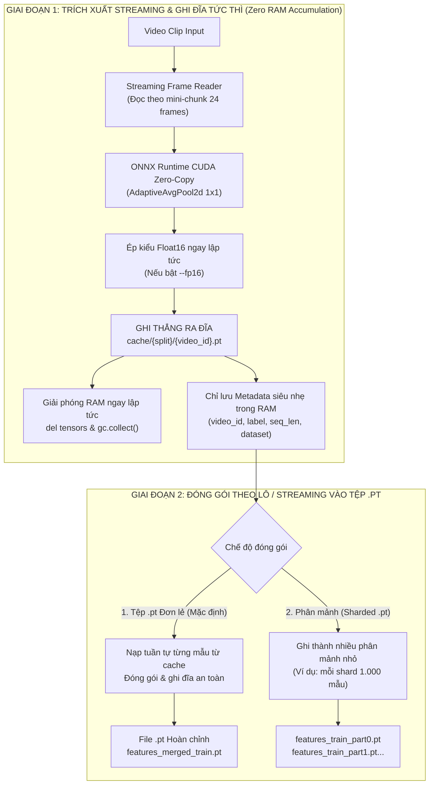

# KẾ HOẠCH TỐI ƯU HÓA BỘ NHỚ RAM TRONG PIPELINE TRÍCH XUẤT ĐẶC TRƯNG (`LSTM/extract_to_pt1.py`)
## Phân Hệ Trích Xuất Video Sang PyTorch Tensor (.pt) — Dự Án Driver Guardian

---

## 1. BỐI CẢNH & PHÂN TÍCH NGUYÊN NHÂN GỐC RỄ (ROOT CAUSE ANALYSIS)

Trong quá trình xử lý một lượng lớn video (ví dụ dataset gộp SUST, UTA-RLDD, VBDDD với ~5.000 clip và hàng chục nghìn clip khi tăng cường dữ liệu `num_aug >= 1`), file [`LSTM/extract_to_pt1.py`](file:///D:/Project/DATN/driver-guardian/ai/LSTM/extract_to_pt1.py) hiện tại gặp vấn đề tiêu tốn bộ nhớ RAM nghiêm trọng. Nếu xử lý toàn bộ tập dữ liệu, RAM hệ thống có thể bị đầy dẫn đến hiện tượng **Out-Of-Memory (OOM)**, crash tiến trình hoặc làm chậm hệ thống do Windows phải sử dụng Pagefile (Disk Swapping).

Qua phân tích mã nguồn [`extract_to_pt1.py`](file:///D:/Project/DATN/driver-guardian/ai/LSTM/extract_to_pt1.py), nguyên nhân chính bao gồm **4 điểm nghẽn bộ nhớ**:

### 1.1. Tích lũy toàn bộ Tensor vào RAM trong suốt vòng lặp video (Vấn đề lớn nhất)
* **Vị trí**: Dòng 698 - 712 trong hàm `process_split_set`.
* **Hiện trạng**: Mặc dù đặc trưng mỗi video đã được ghi độc lập vào đĩa tại `cache/{split}/{video_id}.pt`, mã nguồn ngay lập tức thực hiện:
  ```python
  cached_data = torch.load(cache_file, map_location="cpu")
  p3_all.append(cached_data["p3"])
  p4_all.append(cached_data["p4"])
  p5_all.append(cached_data["p5"])
  labels_all.append(cached_data["label"])
  video_ids_all.append(cached_data["video_id"])
  seq_lens_all.append(...)
  ```
* **Hậu quả**: Hàng nghìn tensor $p_3, p_4, p_5$ được giữ liên tục trong danh sách Python suốt nhiều giờ chạy. Với 5.000 đến 10.000 mẫu, danh sách này chiếm hàng gigabyte RAM vô ích trong khi tác vụ trích xuất chỉ cần chạy tuần tự từng video.

### 1.2. Tạo Tensor 4D toàn bộ video trong RAM (`[T, 3, 640, 640]`)
* **Vị trí**: Hàm `forward_video_chunks` và `read_and_sample_video_frames`.
* **Hiện trạng**: Toàn bộ khung hình video được giải mã thành mảng NumPy uint8 `[T, 640, 640, 3]`, sau đó chuyển thành PyTorch Tensor float32 `[T, 3, 640, 640]`.
* **Hậu quả**: Một video dài 120 khung hình tiêu tốn:
  $$120 \times 3 \times 640 \times 640 \times 4 \text{ bytes} \approx 590 \text{ MB RAM}$$
  Nếu kèm theo ảnh tăng cường dữ liệu (`aug_frames`), dung lượng RAM tạm thời của 1 video có thể lên đến hơn 1.2 GB.

### 1.3. Nhân đôi bộ nhớ (Double Buffering) khi ép kiểu Float16 và đóng gói
* **Vị trí**: Dòng 738 - 748 trong `process_split_set`.
* **Hiện trạng**: Khi cờ `--fp16` được kích hoạt, chương trình thực hiện:
  ```python
  final_p3 = [t.half() for t in final_p3]
  ```
  Tại thời điểm này, cả danh sách cũ (Float32) và danh sách mới (Float16) cùng tồn tại trong RAM.
* Tiếp theo, `torch.save(save_dict, output_pt_path)` nạp toàn bộ cấu trúc dữ liệu khổng lồ vào bộ đệm tuần tự hóa (serialization buffer) trước khi ghi xuống đĩa, gây ra đỉnh RAM (peak memory) tăng gấp đôi ngay trước khi hoàn tất.

### 1.4. Cơ chế thu gom rác (Garbage Collection) bị động
* Python giải phóng bộ nhớ theo cơ chế đếm tham chiếu (Reference Counting). Trong vòng lặp lớn với nhiều biến tạm cục bộ (NumPy arrays, PyTorch DLPack buffers, OpenCV VideoCapture handles), bộ giải phóng rác không được kích hoạt kịp thời, dẫn đến rò rỉ bộ nhớ ảo (memory bloat).

---

## 2. MỤC TIÊU TỐI ƯU HÓA (OBJECTIVES)

| Tiêu chí | Trước tối ưu | Sau tối ưu (Mục tiêu) |
| :--- | :--- | :--- |
| **RAM tiêu thụ tối đa (Peak RAM)** | Tăng tuyến tính theo số video ($>10 - 20\text{ GB}$ khi xử lý 5.000+ clips) | **Cố định ở mức thấp ($\le 1.5 - 2.5\text{ GB}$)** bất kể số lượng clip |
| **Rủi ro OOM / Crash** | Rất cao khi xử lý toàn bộ dataset trên máy 8GB / 16GB RAM | **0% rủi ro OOM do tích lũy RAM** |
| **Tính toàn vẹn & Tương thích** | Định dạng `.pt` chuẩn cho `PreloadedTensorDataset` | **Bảo toàn 100% cấu trúc tệp `.pt` đầu ra** (tương thích nguyên vẹn với [`datn4ni2.ipynb`](file:///D:/Project/DATN/driver-guardian/ai/LSTM/datn4ni2.ipynb)) |
| **Tốc độ xử lý (Throughput)** | Giảm dần khi RAM đầy (do Pagefile thrashing) | **Ổn định và nhanh hơn** nhờ bộ đệm nhẹ, giảm phân mảnh RAM |

---

## 3. CÁC GIẢI PHÁP KỸ THUẬT CỐT LÕI (TECHNICAL SOLUTIONS)



### Giải pháp 1: Tách rời hoàn toàn Pha Trích Xuất (Extraction) và Pha Đóng Gói (Packaging)
* **Nguyên tắc**: Trong vòng lặp video chính:
  1. Đọc video -> Trích xuất qua ONNX -> Ghi tệp `cache/{split}/{video_id}.pt` xuống đĩa.
  2. **TUYỆT ĐỐI KHÔNG** gọi `p3_all.append(...)` hay giữ các tensor đặc trưng trong RAM.
  3. Chỉ lưu danh sách metadata siêu gọn nhẹ:
     ```python
     # Kích thước mỗi phần tử chỉ ~100 bytes thay vì hàng chục KB của Tensor
     manifest.append({
         "video_id": item.video_id,
         "clip_id": item.clip_id,
         "label": item.label,
         "actual_frames": actual_frames,
         "dataset": item.dataset,
         "subject_id": item.subject_id
     })
     ```
  4. Sau khi hoàn tất 100% video của một phân tập, mới bước vào Pha Đóng Gói (Phase 2).

### Giải pháp 2: Xử lý theo Mini-Chunk trực tiếp (Streaming Chunk Pipeline)
* Thay vì giải mã toàn bộ video thành mảng khổng lồ `[T, 3, 640, 640]`, triển khai đọc và forward theo từng lô `chunk_size` (mặc định 24 khung hình):
  * Chỉ phân bổ bộ đệm cho 24 khung hình ($\sim 118\text{ MB}$).
  * Đưa trực tiếp lên GPU, chạy ONNX, pool về vector 1D, và ghi đè bộ đệm cho 24 khung hình tiếp theo.
  * Giảm đỉnh RAM của mỗi video từ $\sim 1\text{ GB}$ xuống chỉ còn $\sim 100\text{ MB}$.

### Giải pháp 3: Ép kiểu Float16 sớm (Early FP16 Conversion)
* Nếu người dùng chọn cờ `--fp16`, thực hiện ép kiểu `half()` ngay khi ra khỏi `AdaptiveAvgPool2d`:
  ```python
  p3 = p3.half()
  p4 = p4.half()
  p5 = p5.half()
  ```
* Tệp lưu tạm trong thư mục `cache/` sẽ có kích thước giảm 50% ngay từ đầu.
* Khi đóng gói ở cuối, dữ liệu đã ở sẵn dạng float16, loại bỏ hoàn toàn bước nhân đôi bộ nhớ (Double Buffering).

### Giải pháp 4: Thu gom rác chủ động & Dọn dẹp CUDA Cache định kỳ
* Đặt chu kỳ dọn dẹp bộ nhớ mỗi $N$ video (ví dụ mỗi 50 clip):
  ```python
  if (idx + 1) % gc_interval == 0:
      gc.collect()
      if torch.cuda.is_available():
          torch.cuda.empty_cache()
  ```
* Sau khi xử lý xong mỗi video, gọi lệnh `del` tường minh cho các biến lớn: `del frames_rgb, raw_frames, p3, p4, p5`.

### Giải pháp 5: Đóng gói an toàn bộ nhớ (Memory-Efficient Packaging)
* Ở Pha Đóng Gói:
  * Đọc tuần tự từng tệp `.pt` từ `cache/` và đưa vào cấu trúc danh sách hoàn chỉnh.
  * Hỗ trợ cờ `--shard_size <N>` (ví dụ: mỗi file `.pt` chứa tối đa 1.000 - 2.000 mẫu) dành cho các tập dữ liệu quy mô siêu lớn vượt quá giới hạn RAM của máy người dùng.
  * Thêm cờ `--skip_package` (hoặc `--cache_only`): Cho phép chỉ trích xuất cache mà không gộp thành file `.pt` đơn nếu người dùng muốn huấn luyện trực tiếp từ thư mục cache.

---

## 4. KẾ HOẠCH TRIỂN KHAI CHI TIẾT (STEP-BY-STEP IMPLEMENTATION ROADMAP)

```
                       LỘ TRÌNH THỰC HIỆN TỐI ƯU
                       
   [ BƯỚC 1: Khảo sát & Đo đạc Baseline RAM ]
          │ (Đo đỉnh RAM và tốc độ của bản hiện tại)
          ▼
   [ BƯỚC 2: Tối ưu bộ đọc & Forward theo Mini-Chunk ]
          │ (Refactor forward_video_chunks và read_and_sample_video_frames)
          ▼
   [ BƯỚC 3: Tách rời Pha Trích Xuất & Lưu Early FP16 ]
          │ (Không tích lũy p3_all, p4_all trong vòng lặp video)
          ▼
   [ BƯỚC 4: Tái cấu trúc Pha Đóng Gói & Thu gom rác định kỳ ]
          │ (Nạp theo lô an toàn, thêm cờ --shard_size, gc định kỳ)
          ▼
   [ BƯỚC 5: Kiểm thử so sánh dữ liệu & Đánh giá mức tiết kiệm RAM ]
          │ (Xác minh 100% khớp dữ liệu, đo RAM trước/sau với psutil)
          ▼
   [ BƯỚC 6: Báo cáo kết quả & Nghiệm thu ]
```

### Chi tiết các bước thực hiện:

#### Bước 1: Khảo sát & Tích hợp bộ đo bộ nhớ (Memory Profiling)
* Tích hợp thư viện `psutil` để ghi nhận mức tiêu thụ RAM thực tế (`Process().memory_info().rss`) theo thời gian thực trên thanh tiến trình `tqdm` (ví dụ: `RAM: 1.25 GB / VRAM: 0.85 GB`).

#### Bước 2: Tối ưu bộ đọc video và luồng Mini-Chunk
* Cập nhật `read_and_sample_video_frames`: giải phóng ngay `raw_frames` sau khi lấy mẫu.
* Cập nhật `forward_video_chunks`: không tạo tensor video 4D gộp toàn bộ, chỉ chuyển đổi từng mini-chunk sang tensor GPU.

#### Bước 3: Tái cấu trúc vòng lặp trích xuất trong `process_split_set`
* Loại bỏ các mảng tích lũy `p3_all`, `p4_all`, `p5_all` khỏi vòng lặp xử lý video.
* Chỉ lưu cấu trúc `manifest` siêu nhẹ chứa `(cache_file_path, label, video_id, seq_len, metadata)`.
* Tích hợp ép kiểu Float16 trực tiếp trước khi ghi file cache.
* Bổ sung cơ chế `gc.collect()` và `torch.cuda.empty_cache()` định kỳ sau mỗi 50 mẫu.

#### Bước 4: Xây dựng Pha Đóng Gói Tiết Kiệm Bộ Nhớ (Consolidation Phase)
* Tạo hàm riêng `consolidate_split_features`:
  * Duyệt qua danh sách manifest đã hoàn thành.
  * Tùy chọn 1 (Mặc định): Đóng gói thành file `.pt` đơn lẻ, sử dụng bộ nạp tuần tự giải phóng ngay bộ nhớ cache trung gian.
  * Tùy chọn 2 (Mở rộng): Phân mảnh thành nhiều file `.pt` nhỏ (`--shard_size`) nếu dataset quá lớn.

#### Bước 5: Kiểm thử và xác thực (Verification)
* Kiểm tra tính tương đồng dữ liệu: So sánh Tensor được xuất ra giữa phiên bản tối ưu và phiên bản gốc (đảm bảo ma trận giá trị sai số tuyệt đối $< 10^{-6}$, nhãn và tên video khớp 100%).
* Kiểm thử khả năng nạp của `PreloadedTensorDataset` trong [`datn4ni2.ipynb`](file:///D:/Project/DATN/driver-guardian/ai/LSTM/datn4ni2.ipynb).

---

## 5. KẾ HOẠCH KIỂM THỬ & CHỈ SỐ NGHIỆM THU (VERIFICATION & METRICS)

### 5.1. Kịch bản kiểm thử tự động
1. **Smoke Test (Kiểm thử chức năng nhanh)**:
   ```powershell
   python LSTM\extract_to_pt1.py --limit 10 --output_dir test_opt_pt
   ```
   * *Mục tiêu*: Chạy thành công qua 10 clip không có cảnh báo hay lỗi cú pháp.
2. **Memory Benchmark (So sánh RAM tiêu thụ)**:
   * Chạy với `--limit 100` trên bản cũ vs bản mới:
   * Ghi nhận đỉnh RAM tiêu thụ (Peak RAM usage) và dung lượng RAM kết thúc.
3. **Data Integrity Test (Kiểm thử toàn vẹn dữ liệu)**:
   * Dùng script kiểm tra độ lệch tensor (`torch.allclose`), nhãn `labels`, và danh sách `video_ids` giữa hai bản.

### 5.2. Tiêu chí nghiệm thu (Acceptance Criteria)
1. **RAM cực đại (Peak RAM)** giảm ít nhất **60% - 80%** trong quá trình chạy dài.
2. RAM không bị tăng liên tục theo số lượng video xử lý (đồ thị RAM phẳng, không dốc đứng).
3. Tệp `.pt` đầu ra nạp thành công vào `PreloadedTensorDataset` và huấn luyện bình thường trong notebook `datn4ni2.ipynb`.
