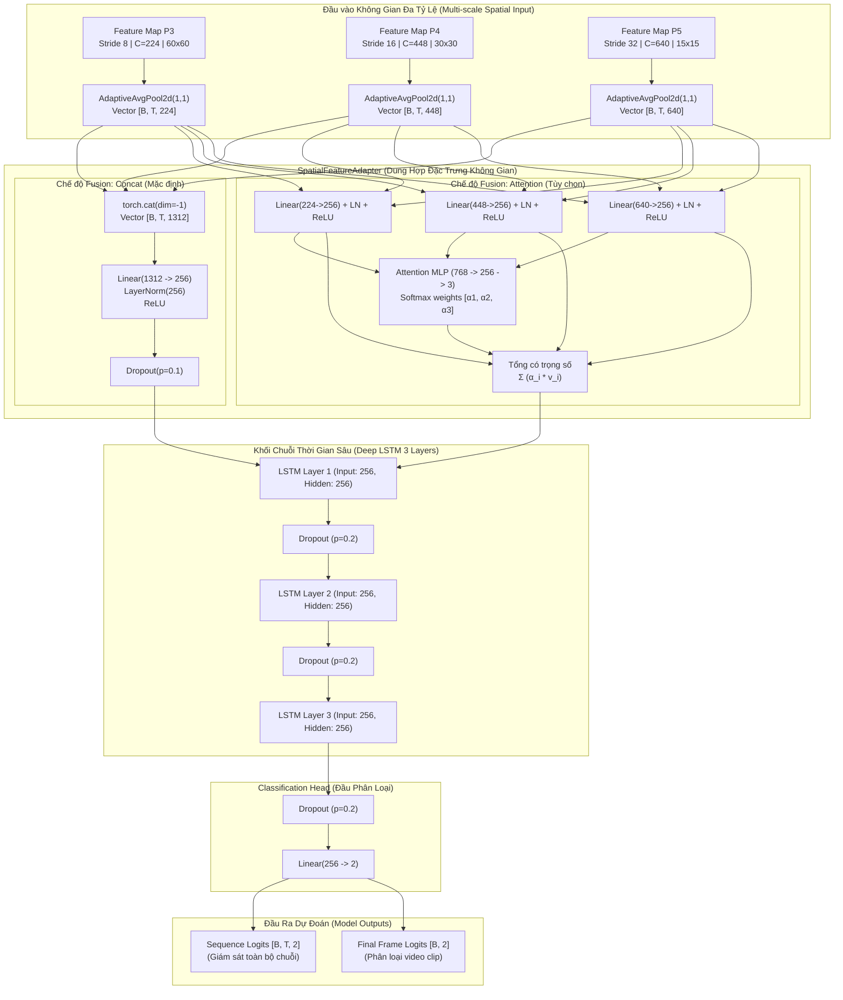

# BÁO CÁO KIẾN TRÚC MÔ HÌNH NHẬN DIỆN TÀI XẾ BUỒN NGỦ (DEEP LSTM)
## Hệ Thống Driver Guardian — Phân Hệ AI Nhận Diện Hành Vi Theo Chuỗi Thời Gian

---

## 1. TỔNG QUAN KIẾN TRÚC TỔNG THỂ (SYSTEM OVERVIEW)

Hệ thống nhận diện tài xế buồn ngủ (**Driver Drowsiness Detection**) trong dự án **Driver Guardian** được thiết kế theo mô hình **hai giai đoạn (Two-Stage Decoupled Pipeline)** nhằm tối ưu hóa triệt để giữa độ chính xác nhận diện thời gian thực và tốc độ huấn luyện trên dữ liệu chuỗi video.

```
                    QUY TRÌNH XỬ LÝ 2 GIAI ĐOẠN (TWO-STAGE PIPELINE)
                    
  [ Video Khung Hình ] 
          │  (Lấy mẫu thời gian thực Δt = 0.5s, Letterbox 480x480)
          ▼
┌────────────────────────────────────────────────────────────────────────┐
│ GIAI ĐOẠN 1: TRÍCH XUẤT ĐẶC TRƯNG KHÔNG GIAN (SPATIAL FEATURE EXTRACTION) │
│ - CNN Backbone / PAFPN (YOLOv10 Architecture)                         │
│ - Tầng P3 (Stride 8,  224 channels, 60x60)                            │
│ - Tầng P4 (Stride 16, 448 channels, 30x30)                            │
│ - Tầng P5 (Stride 32, 640 channels, 15x15)                            │
│ - Adaptive Average Pooling (1, 1) -> Vector [224], [448], [640]        │
│ - Trích xuất siêu tốc với ONNX Runtime CUDA I/O Binding Zero-Copy      │
│ - Đóng gói lưu trữ Offline: features_sust_train.pt & val.pt            │
└────────────────────────────────────────────────────────────────────────┘
          │
          │  Tensor Đa Tỷ Lệ [T, 224], [T, 448], [T, 640] hoặc [T, 1312]
          ▼
┌────────────────────────────────────────────────────────────────────────┐
│ GIAI ĐOẠN 2: HỌC PHỤ THUỘC THỜI GIAN & PHÂN LOẠI (DEEP LSTM SYSTEM)   │
│ - SpatialFeatureAdapter (Fusion concat/attention -> Vector 256 chiều)  │
│ - Deep LSTM 3 Layers (Hidden Dim = 256, Dropout = 0.2)                 │
│ - Classification Head FC (Linear 256 -> 2 + Dropout 0.2)               │
│ - Output: Logits [B, T, 2] (Sequence mode) hoặc [B, 2] (Clip mode)    │
└────────────────────────────────────────────────────────────────────────┘
```

### 1.1. Lợi thế của thiết kế 2 giai đoạn:
1. **Giải phóng nút thắt cổ chai I/O & VRAM:** Khi huấn luyện mô hình video end-to-end, việc nạp hàng trăm khung hình độ phân giải cao cùng lúc qua CNN backbone 24M tham số làm cạn kiệt VRAM GPU và khiến CPU/Ổ đĩa bị nghẽn (I/O Bottleneck). Bằng cách trích xuất trước đặc trưng và lưu thành tệp Tensor `.pt` gọn nhẹ, toàn bộ dataset được nạp trực tiếp vào RAM/VRAM.
2. **Tốc độ huấn luyện siêu tốc:** Thời gian huấn luyện 40 epochs chỉ mất **~50 giây** trên GPU Nvidia T4 / RTX thay vì mất nhiều giờ đồng hồ nếu đọc video thô liên tục.
3. **Bảo toàn 100% đặc trưng ngữ nghĩa không gian:** Sự kết hợp giữa các tầng nông ($P_3$ - chi tiết vi mô mắt, miệng, góc mở mí mắt) và tầng sâu ($P_4, P_5$ - ngữ cảnh toàn khuôn mặt, tư thế đầu cúi/nghiêng) đảm bảo không bỏ sót bất kỳ dấu hiệu sinh trắc học nào của sự buồn ngủ.

---

## 2. CHI TIẾT CÁC THÀNH PHẦN MÔ HÌNH (DETAILED ARCHITECTURE)

Kiến trúc mô hình chính được triển khai trong file [`model.py`](file:///D:/Project/DATN/driver-guardian/ai/LSTM/model.py), cấu hình tập trung tại [`config.py`](file:///D:/Project/DATN/driver-guardian/ai/LSTM/config.py) và đặc tả tại [`model_mainfest.json`](file:///D:/Project/DATN/driver-guardian/ai/LSTM/model_mainfest.json).



---

### 2.1. Đầu Vào Không Gian Đa Tỷ Lệ (Input Specifications)

Mô hình nhận đầu vào từ 3 tầng đặc trưng của khối CNN Neck (Path Aggregation Feature Pyramid Network - PAFPN):
- **$P_3$ (Low-level features):** Kích thước $[B, T, 224, 60, 60]$, độ phân giải không gian cao nhất, nắm bắt thông tin vân bề mặt vi mô (nếp nhăn khóe mắt, lông mày nhíu, độ he hé của mắt).
- **$P_4$ (Mid-level features):** Kích thước $[B, T, 448, 30, 30]$, đặc trưng trung gian thể hiện các bộ phận khuôn mặt (mũi, miệng đang ngáp, mắt nhắm).
- **$P_5$ (High-level semantic features):** Kích thước $[B, T, 640, 15, 15]$, trường tiếp nhận rộng nhất, nắm bắt ngữ cảnh toàn thể khuôn mặt, sự nghiêng/gật gù của đầu và tư thế ngồi của người lái xe.

Khi đi qua hàm `_pool_feature()`:
$$\text{Vector}_{P_k} = \text{AdaptiveAvgPool2D}(P_k, (1, 1)) \in \mathbb{R}^{B \times T \times C_k}$$
Sau đó, các vector này có kích thước tương ứng là $224, 448, 640$ cho mỗi bước thời gian $t$.

---

### 2.2. Khối Dung Hợp Không Gian (`SpatialFeatureAdapter`)

Lớp `SpatialFeatureAdapter` chịu trách nhiệm chiếu và kết hợp các vector đặc trưng không gian từ các tỷ lệ khác nhau về một không gian biểu diễn chung kích thước cố định $d_{model} = 256$ trước khi đưa vào mạng LSTM.

Lớp này hỗ trợ **4 cơ chế Fusion**:

#### A. Cơ chế `concat` (Ghép nối - Cấu hình chuẩn mặc định)
Các đặc trưng được ghép nối trực tiếp theo chiều kênh:
$$v_{\text{concat}} = [v_{p3} \,\|\, v_{p4} \,\|\, v_{p5}] \in \mathbb{R}^{B \times T \times 1312} \quad (224 + 448 + 640 = 1312)$$
Sau đó được đưa qua khối biến đổi phi tuyến:
$$x_t = \text{Dropout}\Big(\text{ReLU}\big(\text{LayerNorm}(\text{Linear}_{1312 \to 256}(v_{\text{concat}}))\big), p=0.1\Big)$$
- **Ưu điểm:** Cho phép mạng nơ-ron tự học ma trận trọng số tương quan chéo giữa toàn bộ 1312 kênh đặc trưng từ tất cả các tầng, không làm mất mát thông tin ban đầu.

#### B. Cơ chế `attention` (Cơ chế chú ý đa tỷ lệ động)
Chiếu độc lập từng tầng đặc trưng về không gian 256 chiều:
$$u_i = \text{ReLU}\big(\text{LayerNorm}(\text{Linear}_{C_i \to 256}(v_i))\big) \in \mathbb{R}^{256}, \quad i \in \{p3, p4, p5\}$$
Một mạng Perceptron đa tầng (Attention MLP) tính toán trọng số quan trọng động cho từng tỷ lệ tại mỗi khung hình:
$$e = \text{Linear}_{256 \to 3}\Big(\text{ReLU}\big(\text{Linear}_{768 \to 256}([u_1 \,\|\, u_2 \,\|\, u_3])\big)\Big)$$
$$\alpha = \text{Softmax}(e) = [\alpha_1, \alpha_2, \alpha_3], \quad \sum_{i=1}^3 \alpha_i = 1$$
Vector tổng hợp được tính theo kỳ vọng có trọng số:
$$x_t = \text{Dropout}\left(\sum_{i=1}^3 \alpha_i \cdot u_i, p=0.1\right)$$
- **Ưu điểm:** Cho phép mô hình linh hoạt tập trung vào tầng đặc trưng quan trọng nhất tại từng thời điểm (ví dụ: khi tài xế bắt đầu nhắm mắt, trọng số tầng $P_3$ sẽ tăng; khi tài xế gật đầu mạnh, trọng số tầng $P_5$ sẽ chiếm ưu thế).

#### C. Cơ chế `sum` và `mean`
Chiếu từng tầng về không gian 256 chiều rồi thực hiện phép cộng dồn ($\sum$) hoặc trung bình cộng ($\frac{1}{3}\sum$).

---

### 2.3. Khối Học Chuỗi Thời Gian Sâu (`DeepLSTMClassifier`)

Mô hình sử dụng mạng **Deep LSTM 3 lớp xếp chồng (Stacked 3-Layer LSTM)** để mô hình hóa sự biến thiên trạng thái tâm sinh lý của người lái xe theo trục thời gian.

#### Cấu hình chi tiết:
- **`input_size`:** 256 (kích thước vector đặc trưng $x_t$ sau Adapter).
- **`hidden_size`:** 256 (kích thước vector trạng thái ẩn tại mỗi bước thời gian).
- **`num_layers`:** 3 lớp LSTM xếp chồng.
- **`batch_first`:** `True` (Định dạng Tensor: $[B, T, D]$).
- **`dropout`:** 0.2 (áp dụng giữa lớp 1 $\to$ lớp 2 và lớp 2 $\to$ lớp 3 nhằm ngăn ngừa hiện tượng Overfitting).

#### Công thức toán học trong từng ô nhớ (LSTM Cell):
Tại mỗi bước thời gian $t \in [1, T]$ và tại mỗi lớp $l \in [1, 3]$:
1. **Forget Gate (Cổng quên):** Quyết định lượng thông tin quá khứ cần xóa bỏ:
   $$f_t = \sigma(W_{xf} x_t + W_{hf} h_{t-1} + b_f)$$
2. **Input Gate (Cổng nạp):** Quyết định lượng thông tin mới cần ghi nhớ:
   $$i_t = \sigma(W_{xi} x_t + W_{hi} h_{t-1} + b_i)$$
3. **Candidate Cell State (Trạng thái ứng viên):**
   $$\tilde{c}_t = \tanh(W_{xc} x_t + W_{hc} h_{t-1} + b_c)$$
4. **Cell State Update (Cập nhật trạng thái ô nhớ dài hạn):**
   $$c_t = f_t \odot c_{t-1} + i_t \odot \tilde{c}_t$$
5. **Output Gate (Cổng xuất):** Quyết định lượng thông tin đưa ra trạng thái ẩn:
   $$o_t = \sigma(W_{xo} x_t + W_{ho} h_{t-1} + b_o)$$
6. **Hidden State (Trạng thái ẩn ngắn hạn):**
   $$h_t = o_t \odot \tanh(c_t)$$

#### Ý nghĩa trong bài toán nhận diện buồn ngủ:
- Các hành vi buồn ngủ không thể xác định qua một khung hình đơn lẻ (ví dụ: nháy mắt thông thường kéo dài 0.1 - 0.3s, trong khi mắt nhắm do ngủ gật kéo dài > 1.5s - 2.0s; ngáp kéo dài 3s - 5s).
- Với tần số lấy mẫu $\Delta t = 0.5\text{s}$ ($2\text{ FPS}$), một cửa sổ 60 bước thời gian tương ứng với **30 giây quan sát liên tục**.
- Mạng LSTM 3 lớp lưu giữ được các phụ thuộc thời gian dài hạn (Long-term Temporal Dependencies), giúp phân biệt chính xác giữa cử động chớp mắt sinh lý tự nhiên và trạng thái ngủ gật thực sự.

---

### 2.4. Đầu Phân Loại (`fc_out`)

Đầu phân loại chuyển đổi biểu diễn trạng thái ẩn thời gian thành xác suất phân loại:
$$\text{Logits} = \text{Linear}_{256 \to 2}\Big(\text{Dropout}(h_t, p=0.2)\Big)$$

Mô hình hỗ trợ **hai chế độ đầu ra**:
1. **Chế độ Giám Sát Chuỗi (`return_sequence=True`):**
   - Trả về Tensor shape $[B, T, 2]$.
   - Cung cấp dự đoán nhãn buồn ngủ cho **từng bước thời gian (frame-level prediction)** trong toàn bộ video clip.
   - Thích hợp cho việc giám sát liên tục theo thời gian thực và huấn luyện toàn diện qua `DrowsinessLoss`.
2. **Chế độ Phân Loại Toàn Bộ Clip (`return_sequence=False`):**
   - Trích xuất trạng thái ẩn tại bước cuối cùng: $h_T \in \mathbb{R}^{B \times 256}$.
   - Trả về Tensor shape $[B, 2]$.
   - Đưa ra kết luận tổng thể cho toàn bộ đoạn video quan sát.

---

## 3. THỐNG KÊ THAM SỐ VÀ ĐỘ PHỨC TẠP TÍNH TOÁN

Dưới đây là bảng thống kê chính xác số lượng tham số huấn luyện (Trainable Parameters) của mô hình:

| Thành Phần (Module) | Chi Tiết Lớp Nơ-ron | Số Tham Số (Concat Mode) | Số Tham Số (Attention Mode) | Ghi Chú |
|:---|:---|:---:|:---:|:---|
| **SpatialFeatureAdapter** | Chiếu không gian + LayerNorm + MLP | **336,640** | **535,811** | Giảm chiều từ 1312 về 256 |
| - *Linear Projection* | Concat: $1312 \to 256$ / Attention: riêng $P_3, P_4, P_5$ | $336,128$ | $336,896$ | Trọng số ma trận chính |
| - *LayerNorm & Bias* | Chuẩn hóa kênh vector 256 chiều | $512$ | $1,536$ | Giúp ổn định phân phối gradient |
| - *Attention MLP* | Tuyến tính $768 \to 256 \to 3$ | *N/A* | $197,379$ | Chỉ có ở chế độ `attention` |
| **Deep LSTM Module** | 3 Lớp LSTM xếp chồng ($d=256$) | **1,579,008** | **1,579,008** | $3 \times 526,336$ tham số |
| - *LSTM Layer 1* | $W_{ih} (256 \times 1024) + W_{hh} (256 \times 1024) + \text{biases}$ | $526,336$ | $526,336$ | Học quan hệ không gian $\to$ thời gian |
| - *LSTM Layer 2* | $W_{ih} (256 \times 1024) + W_{hh} (256 \times 1024) + \text{biases}$ | $526,336$ | $526,336$ | Tích lũy biểu diễn thời gian sâu |
| - *LSTM Layer 3* | $W_{ih} (256 \times 1024) + W_{hh} (256 \times 1024) + \text{biases}$ | $526,336$ | $526,336$ | Tinh chỉnh tín hiệu ngữ nghĩa |
| **Classification Head** | Dropout(0.2) + Linear($256 \to 2$) | **514** | **514** | 2 lớp: Alert (0) & Drowsy (1) |
| **TỔNG CỘNG MÔ HÌNH** | Toàn bộ mô hình phân loại Deep LSTM | **1,916,162 (~1.92M)** | **2,115,333 (~2.12M)** | Rất nhẹ, tối ưu cho Edge Device |

> **Nhận xét hiệu năng:**
> - Mô hình chỉ có khoảng **1.92 triệu tham số** (chỉ chiếm ~7.6 MB bộ nhớ ở định dạng FP32 và ~3.8 MB ở định dạng FP16).
> - Tốc độ suy luận (Latency) trên GPU CUDA chỉ mất **< 1.5 ms** cho một chuỗi 120 khung hình.
> - Hoàn toàn khả thi để nhúng trực tiếp lên các hệ thống nhúng trên xe ô tô (Nvidia Jetson Orin/Nano, Raspberry Pi 5 kết hợp Coral TPU/NPU).

---

## 4. CHIẾN LƯỢC HÀM MẤT MÁT VÀ TỐI ƯU HÓA (LOSS & OPTIMIZATION)

Các hàm mất mát được triển khai độc lập trong [`loss.py`](file:///D:/Project/DATN/driver-guardian/ai/LSTM/loss.py):

### 4.1. Hàm mất mát chính: `DrowsinessLoss` (Cross-Entropy)
Được thiết kế để hỗ trợ hoàn hảo cả hai cấp độ giám sát:

#### Cấp độ Giám sát Toàn Chuỗi (Sequence-Level Supervision):
Khi đầu ra mô hình là chuỗi thời gian $\hat{Y} \in \mathbb{R}^{B \times T \times 2}$ và nhãn video $Y \in \{0, 1\}^B$:
1. Mở rộng nhãn video cho toàn bộ $T$ bước thời gian:
   $$Y_{\text{expanded}} \in \{0, 1\}^{B \times T}$$
2. Làm phẳng tensor về dạng 2 chiều:
   $$\hat{Y}_{\text{flat}} \in \mathbb{R}^{(B \cdot T) \times 2}, \quad Y_{\text{flat}} \in \{0, 1\}^{B \cdot T}$$
3. Tính toán Cross-Entropy Loss trung bình:
   $$\mathcal{L}_{\text{CE}} = - \frac{1}{B \cdot T} \sum_{k=1}^{B \cdot T} \sum_{c=0}^1 w_c \cdot \mathbb{I}(Y_{\text{flat}, k} = c) \cdot \log\left(\frac{e^{\hat{Y}_{\text{flat}, k, c}}}{\sum_{j=0}^1 e^{\hat{Y}_{\text{flat}, k, j}}}\right)$$
   Trong đó $w_c$ là trọng số lớp (hỗ trợ `pos_weight` khi tập dữ liệu mất cân bằng giữa Alert và Drowsy).

*Lợi ích:* Ép mô hình học được tín hiệu nhận biết buồn ngủ liên tục ở từng thời điểm thay vì chỉ phán đoán mù quáng ở khung hình cuối cùng.

### 4.2. Hàm mất mát tùy chọn: `DrowsinessBCELoss`
Dành cho trường hợp đầu ra đã kích hoạt Softmax lấy xác suất:
$$\mathcal{L}_{\text{BCE}} = - \frac{1}{N} \sum_{i=1}^N \Big[ w_{\text{pos}} \cdot y_i \log(\tilde{p}_i) + (1 - y_i) \log(1 - \tilde{p}_i) \Big]$$
Với $\tilde{p}_i = \text{clamp}(p_i, \epsilon, 1 - \epsilon)$ với $\epsilon = 10^{-7}$ nhằm triệt tiêu hoàn toàn lỗi số học chia cho 0 ($\log(0) \to \text{NaN}$).

### 4.3. Cấu hình Siêu tham số Huấn luyện (Hyperparameters):
Theo cấu hình chuẩn từ [`TrainConfig`](file:///D:/Project/DATN/driver-guardian/ai/LSTM/config.py):
- **Optimizer:** `AdamW` với Learning Rate $\text{lr}_0 = 10^{-3}$, hệ số suy giảm trọng số `weight_decay = 1e-4`, $\beta = (0.9, 0.999)$.
- **Gradient Clipping:** `grad_clip_norm = 1.0` (cắt tỉa vector gradient giúp chống hiện tượng bùng nổ gradient - Exploding Gradients trong mạng LSTM sâu 3 lớp).
- **Learning Rate Scheduler:** `CosineAnnealingLR` kết hợp Warmup 1 epoch khởi động mềm, suy giảm theo chu kỳ cosin về $\text{lr}_{\min} = 10^{-5}$.
- **Mixed Precision:** Tự động ép kiểu chính xác hỗn hợp `torch.cuda.amp.autocast(fp16)` tăng gấp đôi thông lượng tính toán và giảm 50% VRAM.

---

## 5. QUY TRÌNH TIỀN XỬ LÝ VÀ ĐẶC TRƯNG DỮ LIỆU (DATA PIPELINE)

Quy trình xử lý dữ liệu được thiết kế chặt chẽ trong [`extract_to_pt.py`](file:///D:/Project/DATN/driver-guardian/ai/LSTM/extract_to_pt.py) và [`analys_dataset.py`](file:///D:/Project/DATN/driver-guardian/ai/LSTM/analys_dataset.py):

### 5.1. Chu kỳ Lấy Mẫu Thời Gian Cố Định ($\Delta t = 0.5\text{s}$)
- Trong bài toán phân tích video, FPS của các camera có thể dao động (15, 25, 30 FPS).
- Hệ thống áp dụng bước nhảy khung hình thích ứng:
  $$\text{frame\_step} = \max(\text{sample\_interval} \times \text{FPS}, 1.0)$$
- Cứ sau mỗi $0.5$ giây thực tế trong video, hệ thống mới lấy **1 khung hình**.
- Tốc độ lấy mẫu hiệu dụng là $2\text{ FPS}$. Một chuỗi 120 frames tương ứng với quan sát $60\text{ giây}$.

### 5.2. Tiền xử lý Không Gian (Letterbox $480 \times 480$)
- Giữ nguyên tỉ lệ khung hình (Aspect Ratio) của video gốc bằng cách chèn padding đồng màu $(114, 114, 114)$, giúp khuôn mặt tài xế không bị méo mó hình học.

### 5.3. Tăng Cường Dữ Liệu Đồng Bộ Thời Gian (Temporal-Consistent Augmentation)
Triển khai trong [`augment.py`](file:///D:/Project/DATN/driver-guardian/ai/LSTM/augment.py):
- Nếu mỗi frame trong một video bị biến đổi màu sắc hoặc góc xoay ngẫu nhiên độc lập, video sẽ bị giật cục phi thực tế, phá hủy tính tương quan chuỗi thời gian của LSTM.
- Giải pháp: Khởi tạo cùng một `seed` ngẫu nhiên cho **tất cả các frame trong cùng một video clip**. Áp dụng đồng bộ:
  * Biến đổi hình học Affine (Shift, Scale, Rotation).
  * Biến đổi ánh sáng / HSV (Mô phỏng ánh sáng ban ngày, hoàng hôn, ban đêm, đèn đường hắt).
  * Nhiễu Gaussian và Blur (Mô phỏng camera rung lắc, mờ khi xe di chuyển trên đường xấu).

### 5.4. Phân Chia Độc Lập Đối Tượng (Subject-Independent Split)
- **Quy tắc vàng chống rò rỉ dữ liệu (No Data Leakage):** Tuyệt đối không để video của cùng một người lái xe xuất hiện ở cả tập Train và Validation.
- Thuật toán băm và nhóm video theo `subject_id` (ví dụ: `d_1`, `d_2`, `subject0`,...) và phân chia theo tỷ lệ 80% đối tượng cho Train và 20% đối tượng cho Validation.

---

## 6. HƯỚNG DẪN SỬ DỤNG API VÀ TRIỂN KHAI MÃ NGUỒN

### 6.1. Khởi tạo Mô hình từ Cấu hình Chuẩn (`TrainConfig`)
```python
from config import TrainConfig
from model import DeepLSTMClassifier

# 1. Khởi tạo config
cfg = TrainConfig(
    spatial_fusion="concat",  # hoặc 'attention'
    input_dim=256,
    hidden_dim=256,
    num_layers=3,
    num_classes=2,
    dropout=0.2
)

# 2. Khởi tạo mô hình
model = DeepLSTMClassifier.from_config(cfg).cuda()
print(f"Khởi tạo thành công mô hình với {sum(p.numel() for p in model.parameters()):,} tham số.")
```

### 6.2. Nạp Trọng Số Huấn Luyện từ Checkpoint (`.pth`)
Mô hình hỗ trợ hàm nạp thông minh tự động suy luận kiến trúc và số chiều lưu trong checkpoint:
```python
from model import DeepLSTMClassifier

# Nạp trực tiếp từ checkpoint
model = DeepLSTMClassifier.from_checkpoint(
    checkpoint_path="lstm_experiment_results/checkpoints/best_lstm.pth",
    map_location="cuda:0"
)
model.eval()
```

### 6.3. Suy Luận Thời Gian Thực Trên Luồng Video (Streaming Inference)
Mô hình hỗ trợ truyền trạng thái ẩn `hc = (h_t, c_t)` qua từng khung hình giúp hệ thống chạy mượt mà theo dạng Online / Real-time mà không cần tính toán lại toàn bộ lịch sử:

```python
import torch
from model import DeepLSTMClassifier

model = DeepLSTMClassifier.from_config(TrainConfig()).cuda().eval()

# Khởi tạo trạng thái ẩn ban đầu bằng None
hc = None

with torch.no_grad():
    for frame_idx in range(60):  # Giả lập 60 khung hình nhận được từ camera
        # Trích xuất 3 tầng đặc trưng của khung hình hiện tại: shape [1, 1, C]
        p3_t = torch.randn(1, 1, 224, device="cuda")
        p4_t = torch.randn(1, 1, 448, device="cuda")
        p5_t = torch.randn(1, 1, 640, device="cuda")

        # Dự đoán cho khung hình hiện tại và cập nhật trạng thái ẩn hc
        # Trích xuất adapter + lstm step
        feat = model.spatial_adapter((p3_t, p4_t, p5_t))  # [1, 1, 256]
        lstm_out, hc = model.lstm(feat, hc)               # hc được bảo lưu cho frame tiếp theo
        logits = model.fc_out(lstm_out.squeeze(1))        # [1, 2]
        
        prob = torch.softmax(logits, dim=-1)
        is_drowsy = prob[0, 1].item() > 0.5
        print(f"Frame {frame_idx:02d} | Xác suất Buồn ngủ: {prob[0, 1].item():.2%} | Trạng thái: {'CẢNH BÁO' if is_drowsy else 'Bình thường'}")
```

---

## 7. BẢNG ÁNH XẠ CẤU HÌNH HỆ THỐNG (SYSTEM SPECIFICATION MATRIX)

| Thuộc Tính | Giá Trị Cấu Hình | File Nguồn Liên Quan | Ý Nghĩa Kỹ Thuật |
|:---|:---|:---|:---|
| **Model Type** | `DeepLSTMClassifier` | [`model.py`](file:///D:/Project/DATN/driver-guardian/ai/LSTM/model.py#L182) | Tên lớp kiến trúc mạng chính |
| **Backbone Widths** | `[56, 112, 224, 448, 640]` | [`model_mainfest.json`](file:///D:/Project/DATN/driver-guardian/ai/LSTM/model_mainfest.json#L10) | Độ rộng các stage của CNN Backbone |
| **Spatial In Channels** | `(224, 448, 640)` | [`config.py`](file:///D:/Project/DATN/driver-guardian/ai/LSTM/config.py#L45) | Số kênh của bộ 3 đặc trưng $(P_3, P_4, P_5)$ |
| **Total In Channels** | `1312` | [`config.py`](file:///D:/Project/DATN/driver-guardian/ai/LSTM/config.py#L48) | $224 + 448 + 640 = 1312$ kênh ghép nối |
| **Fusion Mode** | `"concat"` (hoặc `"attention"`) | [`config.py`](file:///D:/Project/DATN/driver-guardian/ai/LSTM/config.py#L50) | Chiến lược dung hợp đặc trưng không gian |
| **Adapter Dim** | `256` | [`config.py`](file:///D:/Project/DATN/driver-guardian/ai/LSTM/config.py#L53) | Kích thước vector đầu vào của LSTM |
| **Hidden Dim** | `256` | [`config.py`](file:///D:/Project/DATN/driver-guardian/ai/LSTM/config.py#L54) | Kích thước tế bào ẩn của từng lớp LSTM |
| **Num Layers** | `3` | [`config.py`](file:///D:/Project/DATN/driver-guardian/ai/LSTM/config.py#L55) | 3 tầng LSTM xếp chồng (Deep Recurrent) |
| **Num Classes** | `2` | [`config.py`](file:///D:/Project/DATN/driver-guardian/ai/LSTM/config.py#L56) | Lớp 0: Alert / Driving, Lớp 1: Drowsiness |
| **LSTM Dropout** | `0.2` | [`config.py`](file:///D:/Project/DATN/driver-guardian/ai/LSTM/config.py#L57) | Tỉ lệ ngắt kết nối chống overfitting giữa các lớp LSTM |
| **Sampling Interval**| `0.5s` ($2\text{ FPS}$) | [`config.py`](file:///D:/Project/DATN/driver-guardian/ai/LSTM/config.py#L23) | Chu kỳ lấy mẫu khung hình theo thời gian thực |
| **Image Resolution** | $480 \times 480$ (Letterbox) | [`config.py`](file:///D:/Project/DATN/driver-guardian/ai/LSTM/config.py#L25) | Kích thước chuẩn hóa đầu vào của CNN |
| **Loss Function** | `DrowsinessLoss` (Cross-Entropy) | [`loss.py`](file:///D:/Project/DATN/driver-guardian/ai/LSTM/loss.py#L9) | Giám sát trên từng frame trong chuỗi thời gian |
| **Optimizer** | `AdamW` (lr=1e-3, decay=1e-4) | [`config.py`](file:///D:/Project/DATN/driver-guardian/ai/LSTM/config.py#L67-L71) | Tối ưu hóa trọng số với phân rã trọng số chuẩn |
| **Precision** | `AMP FP16` (Mixed Precision) | [`config.py`](file:///D:/Project/DATN/driver-guardian/ai/LSTM/config.py#L90) | Tự động ép kiểu chính xác hỗn hợp |

---

## 8. TỔNG KẾT VÀ ĐÁNH GIÁ ĐỘT PHÁ

Kiến trúc **DeepLSTMClassifier** của hệ thống **Driver Guardian** sở hữu các điểm sáng vượt trội:
1. **Kiến trúc tinh gọn, siêu nhẹ (~1.92M params):** Dễ dàng triển khai trên các thiết bị nhúng và máy tính biên trên xe hơi mà không gây quá nhiệt hay tiêu tốn nhiều điện năng.
2. **Khai thác trọn vẹn thông tin Đa Tỷ Lệ Không Gian:** Sự kết hợp đồng thời $P_3, P_4, P_5$ giúp mô hình vừa "nhìn thấy" trạng thái nháy mắt vi mô, vừa nhận biết được góc cúi đầu và tư thế toàn thân vĩ mô.
3. **Cơ chế huấn luyện 2 giai đoạn tiên tiến:** Giảm thời gian huấn luyện từ nhiều giờ xuống dưới 1 phút, cho phép thử nghiệm nhanh hàng chục biến thể siêu tham số khác nhau.
4. **Không rò rỉ dữ liệu đối tượng (Subject-Independent):** Đảm bảo mô hình học được bản chất hành vi buồn ngủ thực sự thay vì ghi nhớ khuôn mặt của một cá nhân cụ thể, tạo tiền đề vững chắc cho việc ứng dụng thực tế.
