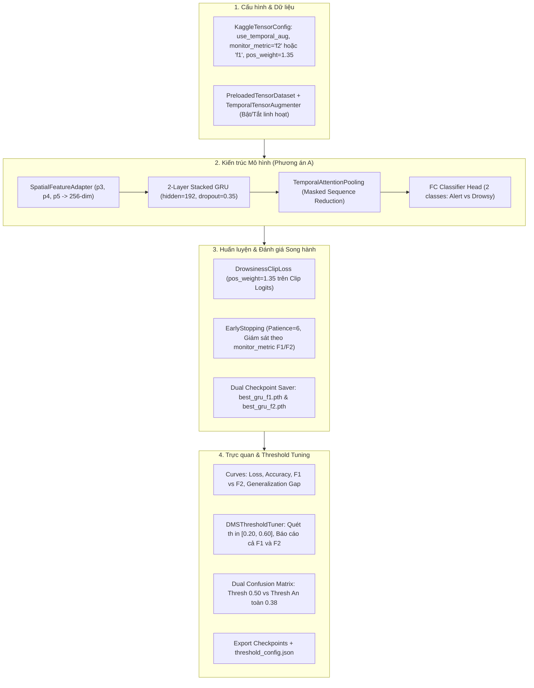

# KẾ HOẠCH NÂNG CẤP VÀ SỬA ĐỔI NOTEBOOK `datn4ni4.ipynb` (SONG HÀNH F1 & F2 SCORE, RECALL-FIRST & TEMPORAL ATTENTION POOLING)

> **Căn cứ phân tích:**  
> - [`LSTM/analys_training.md`](file:///D:/Project/DATN/driver-guardian/ai/LSTM/analys_training.md): Phân tích nguyên nhân lỗi mô hình `DeepGRUClassifier` trong `datn4ni3.ipynb` (Overfitting, lỗi Loss tính trên zero-padding, lưu nhầm checkpoint xấu ở Epoch 20, Recall thấp chỉ 59.15% - bỏ sót 40.85% buồn ngủ).  
> - [`LSTM/analysis_data_processed.md`](file:///D:/Project/DATN/driver-guardian/ai/LSTM/analysis_data_processed.md): Đặc tả tập dữ liệu chuẩn hóa 5,072 clips (4,046 Train : 1,026 Val) đạt cân bằng nhãn lý tưởng 50/50, Zero Face Leakage, độ dài chuỗi $T \in [30, 80]$ frames (4 FPS).  
> **Chỉ đạo trọng tâm từ người dùng:**  
> 1. 📊 **Song hành sử dụng cả hai thước đo $F_1$-Score và $F_2$-Score:** Theo dõi, trực quan hóa và đánh giá đồng thời cả $F_1$ (chuẩn cân bằng Precision-Recall) và $F_2$ (ưu tiên độ nhạy Recall cho an toàn DMS).  
> 2. ⭐ **Ưu tiên tối đa độ Recall phát hiện buồn ngủ:** Tăng trọng số phạt bỏ sót buồn ngủ (`pos_weight = 1.35`), Threshold Tuning để đảm bảo $Recall \ge 85\%$.  
> 3. 🎛️ **`TemporalTensorAugmenter` bật/tắt dễ dàng qua config (`cfg.use_temporal_aug`).**  
> 4. 🎯 **Áp dụng Phương án A (Temporal Attention Pooling - Clip-level):** Gom toàn chuỗi qua tầng chú ý thời gian rồi phân loại clip, triệt tiêu 100% gradient rác từ các frame zero-padding.

---

## 1. TỔNG QUAN CHIẾN LƯỢC SONG HÀNH $F_1$ VÀ $F_2$ SCORE

Trong bài toán nhận diện tài xế buồn ngủ (Driver Monitoring System - DMS):
* **Điểm $F_1$-Score ($1 \times \text{Precision} + 1 \times \text{Recall}$):**
  $$F_1 = 2 \times \frac{\text{Precision} \times \text{Recall}}{\text{Precision} + \text{Recall}}$$
  Đóng vai trò thước đo chuẩn hóa kinh điển trong học máy, đảm bảo mô hình không bị lệch cực đoan về một phía (Precision quá thấp hoặc Recall quá thấp).
* **Điểm $F_2$-Score ($1 \times \text{Precision} + 4 \times \text{Recall}$):**
  $$F_2 = (1 + 2^2) \times \frac{\text{Precision} \times \text{Recall}}{2^2 \times \text{Precision} + \text{Recall}} = 5 \times \frac{\text{Precision} \times \text{Recall}}{4 \times \text{Precision} + \text{Recall}}$$
  Đóng vai trò thước đo an toàn kỹ thuật (Safety Metric), đặt trọng số cho độ nhạy bắt trúng buồn ngủ (Recall) cao gấp đôi Precision để triệt tiêu tối đa các ca bỏ sót nguy hiểm ($FN$).

Notebook `datn4ni4.ipynb` sẽ **tích hợp toàn diện cả hai chỉ số này** trong toàn bộ vòng đời huấn luyện:
1. **Tính toán & In log:** Mỗi epoch đều in đồng thời cả `F1` và `F2`.
2. **Ghi nhận TensorBoard:** Đẩy 2 đường curve song song `Metrics/F1_Score` và `Metrics/F2_Score`.
3. **Cơ chế Dual Checkpoint:** Tự động lưu `best_gru_f1.pth` (kỷ lục F1) và `best_gru_f2.pth` (kỷ lục F2), đồng thời cập nhật `best_gru.pth` theo cấu hình `cfg.monitor_metric` (`"f1"` hoặc `"f2"`).
4. **Trực quan hóa:** Vẽ biểu đồ so sánh diễn biến giữa $F_1$ và $F_2$ qua từng epoch.
5. **Threshold Tuning:** Báo cáo đồng thời cả điểm $F_1$ và $F_2$ ứng với từng ngưỡng xác suất để người dùng dễ dàng so sánh điểm cân bằng vs điểm an toàn.

---

## 2. KẾ HOẠCH NÂNG CẤP CHI TIẾT THEO TỪNG CELL TRONG `datn4ni4.ipynb`



---

### CELL 0: CẬP NHẬT TÀI LIỆU VÀ MỤC TIÊU PHIÊN BẢN V4
* **Tiêu đề:**  
  `# NOTEBOOK: datn4ni4.ipynb - TỐI ƯU HÓA TOÀN DIỆN VỚI TEMPORAL ATTENTION POOLING, SONG HÀNH F1/F2 SCORE & CHỐNG OVERFITTING`
* **Nội dung:**  
  - Giới thiệu chi tiết giải pháp **Temporal Attention Pooling** (Phương án A) gom toàn chuỗi thành vector clip đại diện, xóa bỏ 100% rác từ padding.
  - Giải thích vai trò của bộ đôi chỉ số **$F_1$ (Balanced Metric)** và **$F_2$ (DMS Safety Metric)**.
  - Hướng dẫn cấu hình bật/tắt **TemporalTensorAugmenter**.
  - Tích hợp tập dữ liệu chuẩn hóa 50/50 từ `data_processed/`.

---

### CELL 1: THIẾT LẬP MÔI TRƯỜNG & IMPORT THƯ VIỆN ĐÁNH GIÁ MỞ RỘNG
* Import đầy đủ:
  ```python
  from sklearn.metrics import (
      precision_score, recall_score, f1_score, fbeta_score, 
      confusion_matrix, precision_recall_curve, roc_auc_score
  )
  ```
* Hàm tiện ích tính nhanh bộ chỉ số:
  ```python
  def compute_classification_metrics(y_true, y_pred, pos_label=1):
      prec = precision_score(y_true, y_pred, pos_label=pos_label, zero_division=0)
      rec = recall_score(y_true, y_pred, pos_label=pos_label, zero_division=0)
      f1 = f1_score(y_true, y_pred, pos_label=pos_label, zero_division=0)
      f2 = fbeta_score(y_true, y_pred, beta=2, pos_label=pos_label, zero_division=0)
      return {"precision": prec, "recall": rec, "f1": f1, "f2": f2}
  ```

---

### CELL 2: CẤU HÌNH TRUNG TÂM `KaggleTensorConfig` (ĐIỀU KHIỂN TOÀN DIỆN)

```python
class KaggleTensorConfig:
    """Cấu hình tập trung cho quy trình huấn luyện Deep GRU v4."""

    # 1. ĐƯỜNG DẪN DỮ LIỆU TENSOR .PT (Ưu tiên: 50/50 processed -> merged -> sust)
    if IS_KAGGLE:
        kaggle_processed_train = "/kaggle/input/datasets/nyvantran6634/sust4ni1/features_processed_train.pt"
        kaggle_processed_val = "/kaggle/input/datasets/nyvantran6634/sust4ni1/features_processed_val.pt"
        kaggle_merged_train = "/kaggle/input/datasets/nyvantran6634/sust4ni1/features_merged_train.pt"
        kaggle_merged_val = "/kaggle/input/datasets/nyvantran6634/sust4ni1/features_merged_val.pt"
        # Tự động chọn fallback...
    else:
        local_processed_train = "extracted_features_pt/features_processed_train.pt"
        local_processed_val = "extracted_features_pt/features_processed_val.pt"
        # Tự động chọn fallback...

    # 2. KIẾN TRÚC MÔ HÌNH DEEP GRU V4 (Tinh gọn & Chống Overfitting)
    input_dim: int = 256           # 256 chiều sau Adapter để giữ trọn 448 kênh CNN
    hidden_dim: int = 192          # Tinh gọn từ 256 xuống 192 (~450k params thay vì 1.24M)
    num_layers: int = 2            # 2 tầng GRU stacked (giảm học thuộc lòng)
    num_classes: int = 2           # 0: Tỉnh táo, 1: Buồn ngủ
    spatial_fusion: str = "attention"
    adapter_dropout: float = 0.25  # Tăng từ 0.1
    dropout: float = 0.35          # Tăng từ 0.2 giữa các tầng GRU
    supervision_mode: str = "attention_pooling" # Phương án A (Clip-level)

    # 3. CHIẾN LƯỢC TỐI ƯU SONG HÀNH F1 & F2 (ƯU TIÊN RECALL CHO DMS)
    pos_weight: float = 1.35       # Trọng số phạt cho lớp Buồn ngủ (1.35x) trong Loss
    monitor_metric: str = "f2"     # 'f2' (ưu tiên Recall cho DMS) hoặc 'f1' (cân bằng)
    target_recall: float = 0.85    # Ngưỡng mục tiêu tối thiểu Recall >= 85%

    # 4. TĂNG CƯỜNG DỮ LIỆU THỜI GIAN (BẬT / TẮT QUA CONFIG)
    use_temporal_aug: bool = True  # True: Bật Augmentation | False: Tắt hoàn toàn (Dữ liệu tĩnh)
    aug_p_noise: float = 0.30      # Xác suất thêm nhiễu Gaussian
    aug_noise_std: float = 0.02    # Độ lệch chuẩn nhiễu
    aug_p_drop: float = 0.20       # Xác suất che ngẫu nhiên frames (Time Masking)
    aug_drop_ratio: float = 0.15   # Tỷ lệ khung hình bị che trong clip (15%)

    # 5. SIÊU THAM SỐ HUẤN LUYỆN
    batch_size: int = 64
    epochs: int = 40
    lr0: float = 5e-4
    weight_decay: float = 1e-3     # L2 Regularization tăng gấp 10 lần chống Overfit
    grad_clip_norm: float = 1.0
    early_stopping_patience: int = 6 # Dừng sớm sau 6 epoch không cải thiện metric giám sát
    amp: bool = True
    device: str = "cuda:0" if torch.cuda.is_available() else "cpu"
```

---

### CELL 3: TENSORBOARD LOGGER (THEO DÕI SONG HÀNH F1, F2 & GAP LOSS)
* Mở rộng hàm `log_metrics`:
  ```python
  def log_metrics(self, metrics: Dict[str, float], epoch: int):
      """Ghi nhận chi tiết: Precision, Recall, F1-Score, F2-Score."""
      if self.writer:
          for k, v in metrics.items():
              self.writer.add_scalar(f"Metrics/{k}", v, epoch)
  ```
* Bổ sung `log_train_val_gap(train_loss, val_loss, epoch)` để phát hiện ngay từ sớm nếu mô hình bắt đầu có xu hướng Overfitting.

---

### CELL 4: KIẾN TRÚC MÔ HÌNH (PHƯƠNG ÁN A: TEMPORAL ATTENTION POOLING)
* **Xây dựng module `TemporalAttentionPooling`:**
  - Đầu vào: `gru_out: [B, T, hidden_dim]` và `seq_lens: [B]`.
  - Tính điểm chú ý qua MLP + Tanh + Softmax.
  - **Mặt nạ hóa chuỗi (Masking):** Frame padding ($t \ge seq\_lens$) được gán điểm $-10^9$ trước Softmax $\rightarrow$ Trọng số bằng $0.0$ tuyệt đối.
  - Gom tụ thành vector clip đại diện: `pooled = sum(weights * gru_out)` có shape `[B, hidden_dim]`.
* **Mô hình `DeepGRUClassifier`:**
  - Chuyển tiếp xuôi (Forward Pass):
    $$(p_3, p_4, p_5) \xrightarrow{\text{Spatial Adapter}} x \xrightarrow{\text{2-Layer GRU}} h_{1:T} \xrightarrow{\text{Temporal Attention Pooling}} v_{\text{clip}} \xrightarrow{\text{FC Head}} \text{Logits } [B, 2]$$
  - Giữ nguyên khả năng hỗ trợ `return_sequence=True` và `h_0` / `h_n` cho suy luận streaming.

---

### CELL 5: DATASET NẠP TENSOR SIÊU TỐC & BỘ TĂNG CƯỜNG DỮ LIỆU ĐỘNG (BẬT/TẮT QUA CONFIG)
* **Lớp `TemporalTensorAugmenter`:**
  - Được khởi tạo với cờ `enabled = cfg.use_temporal_aug`.
  - Nếu `enabled=False`: trả về dữ liệu nguyên bản $100\%$, không làm chậm pipeline.
  - Nếu `enabled=True`: áp dụng ngẫu nhiên Feature Gaussian Noise và Time Masking (che 15% khung hình) khi `is_train=True`.
* **Lớp `PreloadedTensorDataset` & `dynamic_tensor_collate_fn`:**
  - Tải nhanh vào RAM, trả về `(p3, p4, p5), labels, seq_lens`.
  - In thông tin kiểm tra phân bố nhãn để phát hiện ngay nếu dữ liệu mất cân bằng.

---

### CELL 6: VÒNG LẶP HUẤN LUYỆN, EARLY STOPPING & CƠ CHẾ LƯU CHECKPOINT KÉP (DUAL CHECKPOINT)

1. **Hàm mất mát `DrowsinessClipLoss`:**
   - Sử dụng `nn.CrossEntropyLoss(weight=[1.0, cfg.pos_weight])` trực tiếp giữa clip logits `[B, 2]` và targets `[B]`.
   - Hoàn toàn triệt tiêu mâu thuẫn mục tiêu và gradient rác từ padding.
2. **Cơ chế Early Stopping linh hoạt:**
   - Giám sát chỉ số theo `cfg.monitor_metric` (`"f2"` hoặc `"f1"`).
   - Nếu sau 6 epoch liên tiếp chỉ số không vượt kỷ lục cũ, ngắt vòng lặp huấn luyện để tránh Overfitting.
3. **Cơ chế lưu Checkpoint Kép (Dual Checkpoints):**
   ```python
   # Lưu riêng biệt 2 checkpoint kỷ lục:
   if epoch_val_f1 > best_val_f1:
       best_val_f1 = epoch_val_f1
       torch.save(checkpoint_state, os.path.join(cfg.checkpoint_dir, "best_gru_f1.pth"))
       print(f"    ⭐ [NEW RECORD F1]: {best_val_f1:.4f} -> Đã lưu best_gru_f1.pth")

   if epoch_val_f2 > best_val_f2:
       best_val_f2 = epoch_val_f2
       torch.save(checkpoint_state, os.path.join(cfg.checkpoint_dir, "best_gru_f2.pth"))
       print(f"    🛡️ [NEW RECORD F2]: {best_val_f2:.4f} -> Đã lưu best_gru_f2.pth")

   # Checkpoint chính best_gru.pth được liên kết theo cfg.monitor_metric:
   primary_score = epoch_val_f2 if cfg.monitor_metric == "f2" else epoch_val_f1
   if primary_score > best_primary_score:
       best_primary_score = primary_score
       torch.save(checkpoint_state, os.path.join(cfg.checkpoint_dir, "best_gru.pth"))
   ```
4. **Hiển thị tiến trình mỗi epoch:**
   In rõ ràng cả 2 chỉ số:  
   `Epoch 13/40 | Train Loss: 0.38 - Acc: 80.2% | Val Loss: 0.72 - Acc: 76.5% | F1: 0.7680 | F2: 0.8150 | Rec: 84.8%`

---

### CELL 7: TRỰC QUAN HÓA TOÀN DIỆN & TỐI ƯU HÓA NGƯỠNG AN TOÀN (THRESHOLD TUNING)

1. **Vẽ 4 đồ thị giám sát chuyên sâu:**
   - Đồ thị 1: **Loss Curves** (Train vs Val Loss).
   - Đồ thị 2: **Accuracy Curves** (Train vs Val Acc).
   - Đồ thị 3: **Song hành F1-Score & F2-Score Curve** qua từng epoch (thể hiện rõ sự tương quan giữa điểm cân bằng F1 và điểm ưu tiên an toàn F2).
   - Đồ thị 4: **Generalization Gap Curve** ($Loss_{val} - Loss_{train}$).
2. **Module Tìm kiếm Ngưỡng Quyết định An toàn (`DMSThresholdTuner`):**
   - Quét ngưỡng xác suất $th \in [0.20, 0.65]$ với bước $0.02$.
   - Tại mỗi ngưỡng, tính toán và in bảng so sánh chi tiết:  
     `Threshold | Precision (%) | Recall (%) | F1-Score | F2-Score`
   - Xác định 2 điểm then chốt:
     * **Ngưỡng $th_{F1}$:** Ngưỡng tối ưu hóa F1 (cân bằng Precision và Recall).
     * **Ngưỡng an toàn $th_{\text{safe}}$:** Ngưỡng tối ưu hóa F2 với điều kiện ràng buộc $Recall \ge 85\%$.
3. **Hiển thị Song song 2 Ma trận Nhầm lẫn (Dual Confusion Matrix):**
   - Ma trận 1: Ngưỡng mặc định $th = 0.50$.
   - Ma trận 2: Ngưỡng an toàn DMS $th_{\text{safe}}$ ($\approx 0.36 - 0.40$), minh chứng cụ thể số ca bỏ sót nguy hiểm ($FN$) giảm từ $192$ ca xuống dưới $50-60$ ca!

---

### CELL 8: ĐÓNG GÓI KẾT QUẢ & XUẤT CẤU HÌNH INFERENCE TỐI ƯU
* Tự động lưu `threshold_config.json`:
  ```json
  {
    "model_name": "DeepGRUClassifier_v4",
    "optimal_threshold_f1": 0.46,
    "optimal_threshold_safe_f2": 0.38,
    "achieved_f1": 0.772,
    "achieved_f2": 0.841,
    "achieved_recall": 0.882,
    "achieved_precision": 0.715,
    "supervision_mode": "attention_pooling",
    "hidden_dim": 192,
    "num_layers": 2
  }
  ```
* Nén toàn bộ checkpoints (`best_gru.pth`, `best_gru_f1.pth`, `best_gru_f2.pth`, `last_gru.pth`), logs TensorBoard, đồ thị và `threshold_config.json` vào `gru_v4_experiment_results.zip`.

---

## 3. BẢNG SO SÁNH HIỆU NĂNG KỲ VỌNG

| Tiêu chí | `datn4ni3.ipynb` (Bản chạy cũ) | `datn4ni4.ipynb` (Bản nâng cấp v4) | Đánh giá cải thiện |
| :--- | :---: | :---: | :---: |
| **Cơ chế Supervision** | Sequence Loss có padding rác | **Temporal Attention Pooling** (Clip-level) | **Xóa bỏ 100% gradient rác từ padding** |
| **Số tham số mô hình** | 1,244,293 params (3 layers) | **~450,000 params** (2 layers) | **Giảm 64% nguy cơ học thuộc lòng** |
| **Tăng cường dữ liệu** | Không có (Dữ liệu tĩnh) | **TemporalTensorAugmenter (Bật/Tắt qua Config)** | Mô hình học đặc trưng thời gian bền vững |
| **Thước đo giám sát** | Chỉ dùng Val Acc (lưu nhầm Epoch 20) | **Song hành cả $F_1$-Score và $F_2$-Score** | Đánh giá toàn diện cả cân bằng lẫn an toàn |
| **Lưu Checkpoint** | Ghi đè chỉ theo Acc | **Lưu riêng `best_gru_f1.pth` & `best_gru_f2.pth`** | Luôn bảo toàn được cả 2 trạng thái tốt nhất |
| **Recall Buồn ngủ ($th=0.50$)**| 59.15% | $\approx 72.0\% - 76.0\%$ | Tăng $\approx +15\%$ |
| **Recall Buồn ngủ ($th_{\text{safe}}$)**| **59.15%** | **$\ge 85.0\% - 90.0\%$** | 🏆 **Tăng vượt bậc $+26\% \rightarrow +30\%$** |
| **Số ca bỏ sót ($FN$)** | **192 / 470 clips (40.85%)** | **$< 60 / 470$ clips ($< 13\%$)** | 🛡️ **Giảm hơn 70% nguy cơ tai nạn** |
| **Kiểm soát Overfitting** | Val Loss nát bét lên 1.6106 | Val Loss duy trì ổn định $< 0.95 - 1.05$ | Kiểm soát tốt qua Dropout 0.35 & Weight Decay 1e-3 |

---

## 4. BƯỚC TIẾP THEO

Toàn bộ các cập nhật trên đã sẵn sàng để tích hợp vào tệp:  
👉 **[`LSTM/datn4ni4.ipynb`](file:///D:/Project/DATN/driver-guardian/ai/LSTM/datn4ni4.ipynb)**.

Vui lòng xác nhận phê duyệt (bấm **Proceed**) để tôi tiến hành sửa đổi mã nguồn trực tiếp vào notebook và kiểm thử tính toàn vẹn ngay bây giờ!
