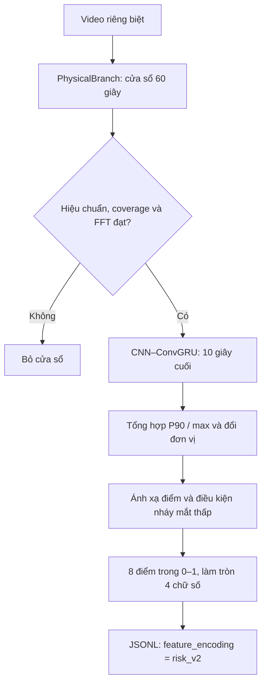

# Chuẩn hóa điểm nguy hiểm — risk_v2

Giữ nguyên 8 đặc trưng. `DEFAULT_RISK_CONFIG` trong [engine.py](engine.py) chứa bộ ngưỡng người dùng cung cấp; khối chạy chính lấy bản sao `RISK_CONFIG` và truyền vào `Engine`. Có thể ghi đè từng mục qua `risk_config`. Cửa sổ mặc định 60 giây, stride 10 giây; CNN–ConvGRU chỉ xử lý 10 giây cuối, 5 FPS.

`Metric.docx` là tài liệu nguồn về metric. Bộ cấu hình do người dùng chốt bổ sung các mốc định lượng và quy tắc tổng hợp; không xem mọi mốc dưới đây là ngưỡng đã được tài liệu nghiên cứu xác nhận. Điểm biểu diễn mức nguy hiểm theo cấu hình, không phải xác suất được hiệu chuẩn.

## Công thức và đơn vị

Với ngưỡng `safe`, `danger`:

```text
risk(x) = clip((x - safe) / (danger - safe), 0, 1)
```

| Đặc trưng | Giá trị thô dùng tính điểm | Điểm 0 | Điểm 1 |
| --- | --- | --- | --- |
| `blink_frequency` | Lần/phút | 15–20 | ≤4 hoặc ≥35, có điều kiện cho nhánh thấp |
| `blink_duration` | P90 thời lượng nháy mắt hợp lệ, ms | ≤400 | ≥800 |
| `perclos` | Tỷ lệ thời gian mắt đóng sâu, 0–1 | ≤0,05 | ≥0,15 |
| `yawn_frequency` | Ngáp/phút; sự kiện dài ít nhất 4 giây | 0 | ≥2 |
| `nod_duration` | Thời lượng gật hợp lệ lớn nhất, giây | ≤0,5 | ≥2 |
| `nod_frequency` | Gật/phút; sự kiện dài ít nhất 0,8 giây | 0 | ≥3 |
| `dominant_head_motion_frequency` | Tần số trội FFT pitch có dấu, Hz | 0,05–0,20 | 0 hoặc ≥0,60 theo đường cong; chỉ áp dụng khi chuyển động tin cậy |
| `cnn_lstm_score` | Điểm lớp 1 của mạng | 0 | 1 |

PERCLOS từ PhysicalBranch có đơn vị phần trăm, nên chia 100 trước khi áp ngưỡng. Thời lượng FSM là ms; riêng `nod_duration` chia 1.000 trước khi tính điểm. P90 dùng nội suy tuyến tính mặc định của NumPy; không có sự kiện hợp lệ thì thời lượng bằng 0. Chỉ làm tròn 4 chữ số sau khi tính điểm và áp điều kiện.

Tần suất dùng số sự kiện hợp lệ chia độ dài cửa sổ rồi nhân 60. Mất tín hiệu không làm giảm mẫu số này; coverage tối thiểu giúp hạn chế nhưng không bù số sự kiện bị bỏ lỡ. Lịch sử thời lượng chọn theo thời điểm sự kiện kết thúc trong cửa sổ.

## Nháy mắt: hai nhánh và điều kiện mắt

Nội suy tuyến tính qua `(4,1), (15,0), (20,0), (35,1)`, bão hòa ngoài hai đầu. Khi tần suất dưới 15 và `gate_low_with_eye_metrics=True`:

```text
blink_risk = base_blink_risk * max(perclos_risk, blink_duration_risk)
```

Ví dụ 4 lần/phút, PERCLOS 10% và P90 nháy mắt ≤400 ms: điểm nháy mắt là `1 × max(0,5; 0) = 0,5`. Nếu cả hai điểm mắt bằng 0 thì nhánh thấp bằng 0. Nhánh trên 20 lần/phút không bị giảm theo điều kiện này. Đây là cách triển khai điều kiện phối hợp mắt; cấu hình boolean không tự xác định một công thức duy nhất.

## FFT và độ tin cậy

Nội suy tuyến tính qua `(0,1), (0.05,0), (0.20,0), (0.60,1)`. Ví dụ 0,025 Hz → 0,5; 0,10 Hz → 0; 0,40 Hz → 0,5.

FFT dùng pitch có dấu, trừ trung bình, cửa sổ Hann và đỉnh phổ khác DC. Cửa sổ riêng dài đủ 60 giây. Mất pitch hoặc gián đoạn >0,25 giây xóa chuỗi liên tục; biên độ đỉnh–đỉnh phải >0,1°. Tần số và độ phân giải phải hữu hạn, dương, thời gian quan sát liên tục phải đủ cửa sổ cấu hình.

Với `require_reliable_motion=True`, thiếu chuyển động đủ tin cậy khiến **cả mẫu bị loại** trước khi chạy mạng. Đầu đứng yên không được gán tần số 0 rồi biến thành điểm nguy hiểm 1. Nếu chủ động tắt điều kiện này, tín hiệu FFT không tin cậy được cho điểm 0; cần cân nhắc ý nghĩa khi tạo dữ liệu. Đường cong tần số thấp chỉ áp dụng với tần số dương đo được.

## Sự kiện và giới hạn bộ phát hiện

`min_event_sec` được truyền xuống FSM, không chỉ dùng ở phép chuẩn hóa. Ngáp hợp lệ dài 4–7,5 giây; gật hợp lệ dài 0,8–3,5 giây. Ngưỡng tối đa hiện có của bộ phát hiện được giữ nguyên. Nháy mắt hợp lệ dài 100–2.000 ms. Sự kiện chưa kết thúc hoặc vượt ngưỡng tối đa không được tính vào tần suất/lịch sử thời lượng. Vì thế điểm thời lượng không thay thế phép theo dõi trạng thái kéo dài; PERCLOS vẫn theo dõi thời gian đóng mắt.

Bộ phát hiện góc đầu, EAR/MAR và hiệu chuẩn giữ nguyên. Thay ngưỡng điểm không tương đương thay bộ phát hiện. FSM cho phép dung sai 0,000001 ms tại biên thời lượng để tránh loại nhầm sự kiện vì sai số số thực.

## Luồng xuất dữ liệu



Mỗi video tạo mới bộ đo và buffer, không nối sự kiện hay frame giữa hai video. Các điều kiện readiness và coverage tối thiểu 80% vẫn áp dụng.

Output mặc định là `drowsiness_risk.jsonl`, có `feature_encoding="risk_v2"`. TrainingSystem chấp nhận từng phiên bản `scale_v1`, `risk_v1`, `risk_v2` riêng biệt và từ chối trộn chúng trong một dataset. Dòng cũ thiếu metadata được xem là `scale_v1`. Cần tạo lại dữ liệu từ video để có P90, max và bộ lọc sự kiện mới; không thể chuyển chính xác chỉ từ các điểm JSONL cũ. Các lần chạy với cấu hình tùy chỉnh cũng cần lưu riêng cấu hình, vì `risk_v2` không chứa hash cấu hình.
