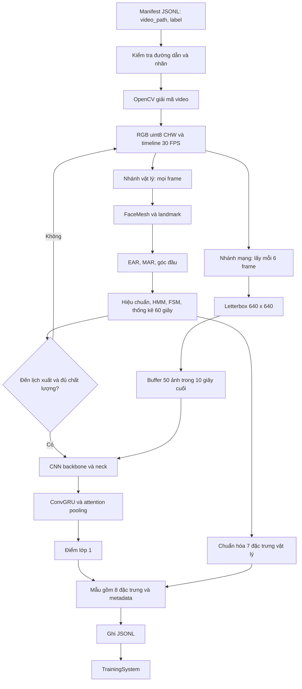
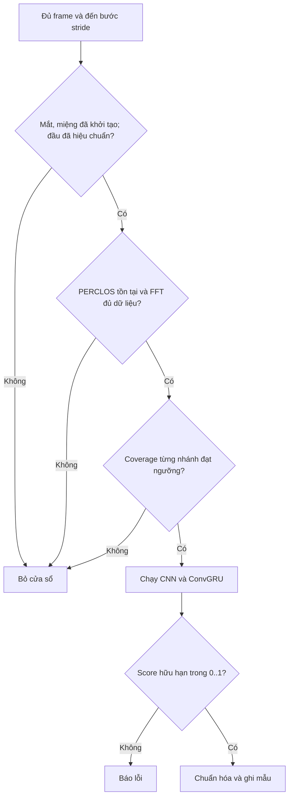

# DataSystem — Hệ thống tạo dữ liệu đặc trưng buồn ngủ

## 1. Mục đích và phạm vi

DataSystem đọc video và nhãn từ manifest JSONL, trích xuất **7 đặc trưng vật lý + 1 điểm CNN–ConvGRU**, sau đó ghi từng mẫu thành một dòng JSONL cho `TrainingSystem`.

Một mẫu mặc định mô tả cửa sổ video 60 giây. Nhánh vật lý cập nhật ở 30 FPS; nhánh mạng dùng 50 ảnh ở 5 FPS trong **10 giây cuối** của cửa sổ. Các cửa sổ dịch 10 giây mỗi lần.

Mã không huấn luyện lại CNN/ConvGRU, không tự gán nhãn và không xác nhận người trong video thực sự buồn ngủ. Nhãn đầu ra được giữ nguyên từ manifest. Các đặc trưng đã chuẩn hóa là đầu vào cho bước tối ưu tiếp theo, không phải tất cả đều là xác suất.

## 2. Thành phần

| Tệp/thành phần | Vai trò |
| --- | --- |
| `loadvideo2handle.py` | Giải mã video, chuyển BGR → RGB, đưa video về timeline FPS đích |
| `engine.py` | Điều phối hai nhánh, quản lý cửa sổ và lịch sử sự kiện, lọc chất lượng, chuẩn hóa, ghi JSONL |
| `neuralnetwork.py` | Tìm checkpoint, nạp CNN và ConvGRU, letterbox ảnh, suy luận điểm lớp 1 |
| `physicalbranch.py` | Import `CameraMetrics`; cung cấp lớp tiện ích `VideoMetrics` để lấy kết quả cuối của một chuỗi frame |
| `../../PhysicalBranch/camera_metrics.py` | FaceMesh, EAR/MAR, góc đầu, hiệu chuẩn, kết hợp các bộ đo thời gian |
| `../../PhysicalBranch/adaptive_hmm_fsm.py` | HMM thích nghi và bộ đếm sự kiện mắt/miệng |
| `../../PhysicalBranch/temporal_metrics.py` | FSM, tỷ lệ theo thời gian và phân tích chuyển động đầu bằng FFT |
| `tests/test_data_system.py` | Kiểm thử hồi quy DataSystem |

`Engine` gọi trực tiếp `CameraMetrics`, không gọi `VideoMetrics.process()`. `VideoMetrics` chỉ trả trạng thái cuối chuỗi; nó không tạo bộ mẫu cửa sổ trượt.

## 3. Sơ đồ tổng thể



Hai nhánh dùng chung frame đã giải mã. CNN chỉ chạy khi đến lịch xuất một cửa sổ đạt điều kiện chất lượng. Video được đọc tuần tự; lịch sử HMM và baseline đầu được giữ giữa các cửa sổ cùng video, nhưng được tạo mới khi chuyển video.

## 4. Đầu vào và quy ước nhãn

Manifest: mỗi dòng không trống phải là một JSON object.

```json
{"video_path": "Fold1_part1/01/0.mov", "label": 0}
{"video_path": "Fold1_part1/01/5.mov", "label": 1}
{"video_path": "Fold1_part1/01/10.MOV", "label": 1}
```

- `video_path`: chuỗi đường dẫn tương đối, tính từ `video_root`. Đường dẫn tuyệt đối hoặc đường dẫn thoát khỏi root bị từ chối, kể cả qua symlink.
- `label`: số nguyên `0` hoặc `1`; không nhận chuỗi `"1"`, boolean hoặc nhãn gốc `5`, `10`.
- Manifest hiện tại gộp mức `5` và `10` thành lớp `1`; mức `0` thành lớp `0`. Đây là lựa chọn nhị phân của bộ dữ liệu này. Engine không suy ra nhãn từ tên file.
- Một nhãn video được gán cho mọi cửa sổ của video đó; chưa có annotation riêng cho từng thời điểm.

Kiểm tra manifest trong phiên rà soát: **182 dòng, 60 nhãn 0 và 122 nhãn 1**, không thiếu file, không trùng đường dẫn. Tên file khớp quy ước gộp nhãn trên. Điều này kiểm chứng tính nhất quán manifest, không kiểm chứng nhãn hành vi bằng quan sát thủ công.

## 5. Đọc video và lấy mẫu thời gian

`read_video(path, target_fps=30)` trả về:

```text
(frame, timestamp)
frame: numpy.ndarray, uint8, RGB, [3, H, W]
timestamp: giây, bắt đầu từ 0, tăng theo index / target_fps
```

Quy trình:

1. Kiểm tra FPS đích và FPS nguồn là số hữu hạn, lớn hơn 0.
2. Đọc timestamp nguồn bằng `CAP_PROP_POS_MSEC`.
3. Trừ timestamp đầu tiên để chuẩn hóa mốc thời gian về 0. Timestamp đầu âm vẫn được hỗ trợ.
4. Nếu hai timestamp đầu đều bằng 0, xem backend không cung cấp timeline và dùng `frame_index / source_fps` cho video đó.
5. Ngoài chế độ thay thế trên, timestamp nguồn không hữu hạn hoặc không tăng sẽ gây lỗi.
6. Mỗi mốc lấy mẫu dùng ảnh nguồn gần nhất ở trước hoặc đúng mốc đó. Không dùng ảnh tương lai và không nội suy nội dung ảnh.
7. Khoảng tồn tại của frame cuối được ước lượng thêm `1 / source_fps`, để không bỏ mất frame cuối khi tăng FPS.
8. Giải phóng `VideoCapture` khi kết thúc hoặc xảy ra lỗi.

Ví dụ video 2 FPS chuyển thành 4 FPS:

```text
Thời gian đích:  0.00   0.25   0.50   0.75
Ảnh được dùng:     A      A      B      B
```

Đưa video nguồn thấp FPS lên 30 FPS chỉ lặp ảnh; không tạo thêm thông tin chuyển động. Trường hợp timestamp không có và video thực tế có FPS biến thiên không thể phục hồi chính xác chỉ từ FPS trung bình. `cap.read()` thất bại giữa video hiện được xử lý như kết thúc luồng; chưa phân biệt chắc chắn EOF với file bị lỗi giải mã một phần.

## 6. Cửa sổ và hai tốc độ FPS

| Tham số | Mặc định | Ý nghĩa |
| --- | --- | --- |
| `fps` | 30 | Timeline chung và tốc độ xử lý nhánh vật lý |
| `window_sec` | 60 | Độ dài cửa sổ vật lý, 1.800 frame |
| `stride_sec` | 10 | Khoảng dịch giữa hai cửa sổ, 300 frame |
| `neural_sec` | 10 | Độ dài đoạn đưa vào ConvGRU |
| `neural_fps` | 5 | 5 ảnh/giây, cách nhau 0,2 giây |
| `neural_size` | 640 | Kích thước letterbox trước khi lưu buffer mạng |
| `min_observed_ratio` | 0,8 | Tỷ lệ thời gian quan sát tối thiểu cho mắt, miệng và đầu |
| `device` | `None` | Tự chọn CUDA nếu có; có thể truyền `"cpu"` |
| `cnn_path` | `None` | Đường dẫn checkpoint CNN; `None` dùng cơ chế tìm tự động |
| `conv_gru_path` | `None` | Đường dẫn checkpoint ConvGRU; `None` dùng cơ chế tìm tự động |
| `chunk_size` | 32 | Số ảnh mỗi lượt chạy CNN backbone/neck |
| `scales` | `SCALES` | Ghi đè các thang chuẩn hóa theo tên đặc trưng |

Với mặc định, cứ mỗi 6 frame của timeline 30 FPS sẽ giữ 1 frame cho mạng. Buffer mạng chứa tối đa 50 ảnh.

```text
Cửa sổ vật lý         Frame mạng tương ứng
[ 0, 60) giây         50.0, 50.2, ..., 59.8
[10, 70) giây         60.0, 60.2, ..., 69.8
[20, 80) giây         70.0, 70.2, ..., 79.8
```

Đây là lịch xét xuất, không đảm bảo mỗi mốc đều có một dòng đầu ra. Video ngắn hơn một cửa sổ không tạo mẫu. Cửa sổ cuối chưa đầy bị bỏ.

Với `N` frame đầu ra bộ đọc, số cửa sổ được xét là:

```text
0                                           nếu N < window_frames
1 + floor((N - window_frames) / stride_frames)  nếu N >= window_frames
```

Số dòng thực tế có thể thấp hơn do lọc chất lượng.

Ràng buộc cấu hình: FPS và kích thước ảnh là số nguyên dương; `neural_fps` phải chia hết `fps`; cửa sổ và stride phải khớp lưới lấy mẫu; đoạn mạng không dài hơn cửa sổ vật lý. Mặc định `640` và `5 FPS` khớp checkpoint hiện tại; đổi checkpoint cần đối chiếu lại cấu hình huấn luyện.

### Quy ước biên thời gian

Metadata `[start_second, end_second)` biểu diễn cửa sổ **frame**. Frame cuối có timestamp `end_second - 1/fps`; các chỉ số vật lý được lấy tại timestamp này.

FSM giữ sự kiện hoàn tất trong `(t - window_sec, t]`. Trên lưới đều, đó là các mốc sự kiện thuộc cửa sổ frame. Tỷ lệ như PERCLOS được tích phân từ các khoảng giữa hai lần quan sát đến `t`, nên biên thống kê liên tục sớm hơn biên metadata tối đa một bước frame, khoảng 33,3 ms ở 30 FPS. Không diễn giải đây là phép đo liên tục chính xác đến mili giây.

Cửa sổ FFT được đặt thành `(window_frames - 1) / fps`, tức khoảng 59,9667 giây: đó là khoảng thời gian từ ảnh đầu đến ảnh cuối của 1.800 ảnh.

## 7. Nhánh vật lý

### 7.1. Khuôn mặt và tín hiệu cơ sở

`CameraMetrics` dùng MediaPipe FaceMesh với tối đa một khuôn mặt, `refine_landmarks=True`, ngưỡng detection/tracking mặc định 0,6.

Với sáu điểm cấu thành mắt hoặc miệng:

```text
aspect_ratio = (||p1 - p5|| + ||p2 - p4||) / (2 * ||p0 - p3||)
```

EAR là trung bình tỷ lệ của hai mắt; MAR là tỷ lệ miệng. Tín hiệu không hợp lệ hoặc không tìm thấy mặt được biểu diễn bằng `None`.

Mắt và miệng khởi tạo từ **450 quan sát hợp lệ** ở cấu hình 30 FPS, tương đương khoảng 15 giây nếu tín hiệu liên tục. Các mẫu khởi tạo có thể tích lũy lâu hơn khi mất mặt. HMM phân biệt trạng thái mắt mở/đóng và miệng nghỉ/mở; FSM xác nhận sự kiện theo thời lượng.

### 7.2. Sự kiện và thời lượng

| Sự kiện | Điều kiện thời lượng mặc định |
| --- | --- |
| Chớp mắt | 100–2.000 ms |
| Ngáp | 3.500–7.500 ms |
| Gật đầu | 800–3.500 ms |

Sự kiện chỉ được đếm khi kết thúc và đã quan sát được trạng thái nghỉ để khởi động FSM. Mất tín hiệu hoặc khoảng cách quan sát lớn hơn 0,25 giây hủy sự kiện đang dở. Một lần đóng mắt quá dài không được tính là chớp mắt hợp lệ, nhưng vẫn có thể đóng góp vào PERCLOS.

Tần suất sự kiện:

```text
rate_per_minute = số sự kiện hoàn tất trong cửa sổ * 60 / window_sec
```

Mẫu số là toàn bộ độ dài cửa sổ, không phải riêng thời gian quan sát hợp lệ. Điều kiện coverage hạn chế tác động của mất tín hiệu, nhưng không bù hoàn toàn số sự kiện có thể đã bị bỏ lỡ.

`blink_duration` và `nod_duration` là trung bình thời lượng của các sự kiện hợp lệ **kết thúc trong cửa sổ**. Một sự kiện có thể bắt đầu trước biên cửa sổ; thời lượng của nó vẫn được giữ nguyên. Không có sự kiện thì thời lượng trung bình bằng 0.

### 7.3. PERCLOS

Ngưỡng mắt đóng sâu được tính từ baseline EAR mở và tham chiếu đóng:

```text
threshold = EAR_open - 0.8 * (EAR_open - EAR_closed_reference)
active = EAR <= threshold
PERCLOS (%) = 100 * thời gian active / thời gian mắt quan sát hợp lệ
```

Các khoảng mất tín hiệu không được xem là mắt mở và không nằm trong mẫu số. Khi chưa có khoảng quan sát hợp lệ, PERCLOS là `None` và cửa sổ bị loại.

### 7.4. Gật đầu và chuyển động đầu

Góc đầu được ước lượng từ landmark. Baseline tư thế trung tính lấy từ 30 mẫu hợp lệ đầu tiên, dùng trung vị sau xử lý góc vòng. Góc sử dụng tiếp theo là góc tương đối với baseline.

Gật đầu dùng hysteresis theo pitch: vào trạng thái gật khi vượt 14°, giữ trạng thái đến khi không còn vượt 8°. Mặc định `nod_direction=None` dùng trị tuyệt đối pitch, nên không phân biệt cúi và ngửa. Tư thế ban đầu không trung tính có thể làm lệch baseline; cần kiểm chứng trên video thực tế khi đánh giá độ chính xác hành vi.

Tần số chuyển động đầu dùng chuỗi pitch liên tục đủ dài: nội suy theo timestamp, trừ trung bình, áp dụng cửa sổ Hann, tìm đỉnh phổ FFT khác DC. Nếu biên độ peak-to-peak không vượt 0,1°, coi như không có chuyển động đáng kể và xuất tần số 0 sau bước kiểm tra đủ dữ liệu.

Mất pitch hoặc khoảng thời gian gián đoạn lớn hơn 0,25 giây làm xóa chuỗi FFT. Sau đó phải tích lũy lại gần 60 giây liên tục. Đây là điều kiện mạnh hơn yêu cầu coverage 80%.

## 8. Điều kiện xuất một mẫu



Coverage mặc định yêu cầu từng giá trị `eye_observed_sec`, `mouth_observed_sec`, `head_observed_sec` đạt ít nhất `60 * 0.8 = 48 giây`.

Trong điều kiện liên tục, cửa sổ `[0,60)` thường bị loại: HMM cần khoảng 15 giây khởi tạo, còn khoảng 45 giây quan sát mắt/miệng. Cửa sổ `[10,70)` mới có thể đạt điều kiện. Mất tín hiệu có thể làm mốc đầu ra đầu tiên muộn hơn.

`min_observed_ratio=0` chỉ bỏ ngưỡng coverage; **không** bỏ các điều kiện khởi tạo, PERCLOS và FFT. `head_motion_frequency_hz=None` chỉ được chuyển thành 0 khi `head_motion_resolution_hz` đã có giá trị, nghĩa là FFT đủ dữ liệu nhưng chuyển động quá nhỏ. Chưa đủ chuỗi FFT sẽ bị loại, không tạo giá trị 0 giả.

Hiện bộ lọc bỏ cửa sổ không đạt mà không ghi một dòng lý do riêng vào JSONL. Vì vậy cần theo dõi số dòng đầu ra; file rỗng không tự động đồng nghĩa với video không buồn ngủ.

## 9. Nhánh CNN–ConvGRU

```mermaid
flowchart LR
    A[50 ảnh RGB uint8] --> B[Letterbox 640 x 640]
    B --> C[float32 chia 255]
    C --> D[CNN backbone]
    D --> E[CNN neck: P3, P4, P5]
    E --> F[Ghép chiều thời gian]
    F --> G[Spatial neck và ConvGRU]
    G --> H[Spatial và temporal attention pooling]
    H --> I[Logits của một clip]
    I --> J[Softmax lớp 1 hoặc sigmoid]
```



- Letterbox giữ tỷ lệ ảnh, resize một lần tới kích thước đích và thêm viền màu `(114,114,114)`. Không ép méo ảnh thành vuông.
- Ảnh `uint8` được chia 255 trước CNN. Ảnh float phải hữu hạn và thuộc `[0,1]`; viền float dùng `114/255`.
- Backbone/neck chạy theo chunk mặc định 32 ảnh. Các feature map của toàn bộ đoạn vẫn được giữ để ghép chuỗi cho ConvGRU; chunking không giới hạn toàn bộ bộ nhớ của mô hình.
- Detection head và NMS của CNN không được gọi; mạng dùng đặc trưng đa tỷ lệ, không crop mặt theo bounding box.
- `seq_lens=[T]`, với `T=50` ở cấu hình mặc định.
- Chỉ nhận logits `[1,2]` cho softmax hoặc `[1,1]` cho sigmoid. Logits nhiều lớp hoặc theo từng frame bị từ chối.
- Mô hình chạy `eval()` và `torch.inference_mode()`; không cập nhật trọng số khi tạo dữ liệu.
- Tên trường `cnn_lstm_score` được giữ để tương thích `TrainingSystem`; kiến trúc thực tế là **ConvGRU**, không phải LSTM.

### Checkpoint hiện tại

Hai checkpoint được tìm thấy tại:

```text
ai/OptimalAlgorithsm/model_cnn/best.pt
ai/OptimalAlgorithsm/model_convgru/best.pt
```

`_resolve_checkpoint()` tìm ở các thư mục cha của DataSystem và các vị trí `ai/checkpoints`, `checkpoints`, sau đó mới xét working directory. `NeuralNetwork` cũng nhận `cnn_path` và `conv_gru_path` để chỉ định rõ đường dẫn.

Cấu hình lưu trong checkpoint ConvGRU hiện tại:

```text
sample_interval = 0.2
image_size = (640, 640)
num_classes = 2
supervision_mode = attention_pooling
```

Vì thế mạng dùng 5 FPS. Đưa 30 FPS vào cùng checkpoint làm thay đổi tốc độ chuyển động theo bước thời gian so với huấn luyện. Pipeline huấn luyện lấy ảnh theo bước frame xấp xỉ 0,2 giây; DataSystem lấy theo timeline chuẩn hóa. Hai cách có thể khác chút ít ở nguồn FPS biến thiên.

Kiểm tra trọng số bằng `strict=True` đã xác nhận toàn bộ CNN **backbone**, **neck** và ConvGRU khớp checkpoint. Detection head của CNN khác phiên bản checkpoint nhưng không tham gia phép suy luận này. Các hàm nạp model gốc dùng `strict=False`; khi thay checkpoint cần kiểm tra lại các phần thực sự sử dụng, không chỉ dựa vào việc khởi tạo model thành công.

## 10. Đặc trưng đầu ra và chuẩn hóa

Công thức chung cho bảy đặc trưng vật lý:

```text
normalized = round(clip(raw_value / scale, 0, 1), 4)
```

| Trường | Giá trị thô | Scale |
| --- | --- | ---: |
| `blink_frequency` | Chớp mắt/phút | 30 |
| `blink_duration` | Trung bình thời lượng chớp mắt, ms | 2.000 |
| `perclos` | Tỷ lệ đóng mắt sâu, % | 100 |
| `yawn_frequency` | Ngáp/phút | 5 |
| `nod_duration` | Trung bình thời lượng gật đầu, ms | 3.500 |
| `nod_frequency` | Gật đầu/phút | 5 |
| `dominant_head_motion_frequency` | Tần số pitch trội, Hz | 2 |
| `cnn_lstm_score` | Điểm dự đoán lớp 1 | Không chia scale; làm tròn 4 chữ số |

Ví dụ `blink_frequency=0.5` tương ứng 15 lần/phút nếu chưa bão hòa. Giá trị 1 có thể là đúng scale hoặc lớn hơn scale vì clipping. Các scale là tham chiếu cấu hình, **chưa được hiệu chuẩn thành ngưỡng sinh lý hoặc xác suất buồn ngủ**. Tần số đầu cao hơn không tự động chứng minh mức buồn ngủ cao hơn.

Mỗi dòng gồm đúng tám đặc trưng trên và metadata:

| Metadata | Ý nghĩa |
| --- | --- |
| `source_video` | Đường dẫn tương đối như manifest |
| `start_second` | Mốc đầu cửa sổ frame |
| `end_second` | `start_second + window_sec` |
| `label` | Nhãn nguyên `0/1` từ manifest |

JSONL không lưu feature thô, coverage, subject ID riêng hoặc hash checkpoint. Có thể suy ra subject từ cấu trúc đường dẫn hiện tại, nhưng Engine không thực hiện bước đó. Cần lưu cấu hình và phiên bản checkpoint đi kèm mỗi lần tạo bộ dữ liệu để tái lập kết quả.

## 11. Cách chạy

Chạy từ thư mục gốc repository với môi trường đã có các dependency của dự án: NumPy, OpenCV, PyTorch và MediaPipe có API `mp.solutions.face_mesh`. Import gói `ai.LSTM.src` còn kéo theo dependency huấn luyện/đánh giá; xem `ai/LSTM/requirements.txt`.

### Tạo file mới qua Python

```python
from ai.OptimalAlgorithsm.DataSystem.engine import Engine

engine = Engine(
    video_root="ai/OptimalAlgorithsm/UTA-RLDD",
    fps=30,
    window_sec=60,
    stride_sec=10,
    neural_sec=10,
    neural_fps=5,
    neural_size=640,
    min_observed_ratio=0.8,
    device="cpu",  # Bỏ tham số này để tự chọn CUDA nếu có.
)
count = engine.run(
    "ai/OptimalAlgorithsm/UTA-RLDD/dataset.jsonl",
    "ai/OptimalAlgorithsm/drowsiness_verified.jsonl",
    strict=True,
)
print(f"Đã ghi {count} mẫu")
```

`run()` mở output ở chế độ `w`: **ghi đè nếu tệp đã tồn tại**, không resume hoặc append. Input và output cùng đường dẫn bị từ chối. Ví dụ dùng tên mới để không ghi đè dữ liệu trước khi kiểm chứng.

`strict=True` dừng ở lỗi đầu tiên. Mặc định `strict=False` ghi lỗi có số dòng ra stderr và tiếp tục dòng manifest tiếp theo. Dòng JSONL trống được bỏ qua. Output được flush từng mẫu; nếu video lỗi sau khi đã xuất một số cửa sổ, các mẫu trước lỗi vẫn còn trong file. Chưa có rollback theo video hoặc cơ chế chống trùng khi manifest lặp video.

### Lấy mẫu từ một video

```python
samples = engine.process_video("Fold1_part1/01/0.mov", label=0)
try:
    first = next(samples, None)
    print(first)
finally:
    samples.close()
```

Đóng generator khi dừng đọc sớm để giải phóng FaceMesh và bộ đọc video.

Có thể chạy `python -m ai.OptimalAlgorithsm.DataSystem.engine`. Cấu hình chạy tập trung trong khối `if __name__ == "__main__":` của `engine.py`:

- `INPUT_JSONL`, `VIDEO_ROOT`, `OUTPUT_JSONL`: nguồn và đích dữ liệu.
- `CNN_PATH`, `CONV_GRU_PATH`: checkpoint cụ thể, được truyền qua `Engine` vào `NeuralNetwork`. Đường dẫn được chỉ định nhưng không tồn tại sẽ báo lỗi, không tự chuyển sang checkpoint khác.
- `FPS`, `WINDOW_SEC`, `STRIDE_SEC`: timeline và cửa sổ vật lý.
- `NEURAL_SEC`, `NEURAL_FPS`, `NEURAL_SIZE`: đoạn ảnh đầu vào mạng.
- `CHUNK_SIZE`, `DEVICE`: số ảnh mỗi lượt CNN và thiết bị suy luận.
- `MIN_OBSERVED_RATIO`, `FEATURE_SCALES`, `STRICT`: lọc chất lượng, thang chuẩn hóa và xử lý lỗi. `FEATURE_SCALES` lấy bản sao của bộ `SCALES` mặc định; có thể sửa các khóa tại đây.

Khối này dùng đường dẫn tuyệt đối, cần chỉnh khi chạy trên máy khác. Kiểm tra `OUTPUT_JSONL` trước khi chạy vì tệp đã tồn tại sẽ bị ghi đè. Các giá trị mặc định của API `Engine` vẫn dùng được khi import từ mã Python khác.

### Môi trường không dùng âm thanh

Trong môi trường rà soát, import MediaPipe bị kẹt ở `sounddevice` → `PortAudio` khi khởi tạo hệ thống âm thanh. DataSystem không dùng microphone. Để kiểm thử video độc lập với dependency âm thanh tùy chọn, tiến trình thử nghiệm vô hiệu hóa import `sounddevice` **trước khi import MediaPipe**:

```python
import sys
sys.modules["sounddevice"] = None

from ai.OptimalAlgorithsm.DataSystem.engine import Engine
```

Đây là thiết lập riêng cho tiến trình chỉ xử lý video, không phải sửa dependency hay giả lập FaceMesh. Nó khiến chức năng ghi âm của MediaPipe không khả dụng trong tiến trình đó. Không đưa thiết lập này vào ứng dụng cần âm thanh. Nếu môi trường import MediaPipe bình thường thì không cần dùng.

## 12. Kiểm thử và mức độ kiểm chứng

Từ repository root:

```bash
MPLCONFIGDIR=/tmp/driver-guardian-mpl OMP_NUM_THREADS=4 \
python -m unittest discover -s ai/OptimalAlgorithsm/DataSystem/tests -v

python -m unittest discover -s ai/PhysicalBranch/tests -v
```

Kiểm thử DataSystem bao gồm: cùng FPS không lặp sai frame; tăng/giảm FPS; frame cuối; timestamp thiếu, âm, đi qua 0 và không tăng; giữ tỷ lệ ảnh và màu viền float; cấu hình/nhãn không hợp lệ; JSONL strict/continue; kiểu ảnh uint8/float16/float32/bfloat16; chuyển logits thành điểm nhị phân; lịch cửa sổ, buffer 5 FPS và điều kiện chất lượng.

Kiểm thử PhysicalBranch bao gồm FSM, thời lượng sự kiện, mất tín hiệu, PERCLOS theo khoảng thời gian, hiệu chuẩn đầu, FFT và cửa sổ độc lập. Đây là kiểm thử logic; chưa thay thế đánh giá trên landmark và nhãn sự kiện được gán thủ công.

Kết quả rà soát cuối:

| Hạng mục | Kết quả |
| --- | --- |
| DataSystem | 11 kiểm thử đạt |
| PhysicalBranch | 18 kiểm thử đạt |
| Trọng số CNN backbone/neck và ConvGRU | Khớp toàn bộ khóa với `strict=True` |
| Pipeline trên video thật | Chạy đủ 2.100 frame đầu ra, tương đương 70 giây ở 30 FPS |
| Cửa sổ `[0,60)` | Bị loại đúng: mắt/miệng mới quan sát 45 giây; FFT chưa đủ chuỗi |
| Cửa sổ `[10,70)` | Được xuất: mắt/miệng quan sát 55 giây, đầu 60 giây, FFT đủ dữ liệu |

Video thử là `Fold1_part1/01/0.mov`, nhãn 0, dùng CPU. Bộ đọc thật được giới hạn ở 2.100 frame để kiểm tra hai mốc xuất đầu tiên; không giả lập landmark hoặc đầu ra mạng. Chỉ dependency âm thanh tùy chọn bị vô hiệu hóa như hướng dẫn ở trên.

Mẫu thực tế thu được:

```json
{
  "blink_frequency": 0.0333,
  "blink_duration": 0.05,
  "perclos": 0.0006,
  "yawn_frequency": 0.0,
  "nod_duration": 0.9333,
  "nod_frequency": 0.2,
  "dominant_head_motion_frequency": 0.0083,
  "cnn_lstm_score": 0.0063,
  "source_video": "Fold1_part1/01/0.mov",
  "start_second": 10.0,
  "end_second": 70.0,
  "label": 0
}
```

Kết quả này xác nhận luồng đọc video → FaceMesh → đặc trưng → CNN–ConvGRU → mẫu dữ liệu hoạt động với video thử. Chưa chạy lại toàn bộ 182 video, chưa đánh giá độ chính xác của các sự kiện bằng annotation và chưa tái tạo file dữ liệu cũ.

## 13. Những điểm cần giữ khi tạo bộ dữ liệu huấn luyện

1. **Tạo lại dữ liệu cũ.** File `drowsiness_sample.jsonl` hiện có 103 dòng với toàn bộ `cnn_lstm_score=0.5`. Không có đủ bằng chứng để xác định nguyên nhân từ file đó, nhưng chưa thể dùng nó như bằng chứng mạng đang suy luận đúng. Phiên rà soát không ghi đè file này.
2. **Tách tập theo người/video trước khi đánh giá.** Cửa sổ 60 giây dịch 10 giây chồng lấn 50 giây. Chia ngẫu nhiên theo dòng có thể đưa gần như cùng nội dung vào train và test. Với UTA-RLDD nên giữ toàn bộ video cùng subject trong cùng nhóm; DataSystem chưa tự chia tập.
3. **Theo dõi tỷ lệ cửa sổ bị loại.** Điều kiện FFT gần 60 giây liên tục có thể loại nhiều video khó. Cần báo cáo số mẫu theo lớp/subject và coverage để nhận biết thiên lệch do chất lượng theo dõi.
4. **Kiểm chứng calibration trên video thực tế.** Tư thế ban đầu, mắt đã nhắm, kính, che khuất, góc quay và ảnh lặp do FPS thấp có thể làm thay đổi phép đo.
5. **Không đồng nhất chạy đúng với dự đoán đúng.** Muốn kết luận độ chính xác cần tập kiểm thử độc lập, nhãn phù hợp cho từng cửa sổ và đối chiếu sự kiện với annotation. Bộ kiểm thử phần mềm không cung cấp accuracy/precision/recall hành vi.
6. **Lưu provenance.** Ghi phiên bản mã, đường dẫn/hash checkpoint, tham số Engine, manifest và log tạo dữ liệu. Kiểm tra checkpoint có từng được huấn luyện trên các subject dùng để đánh giá hay không.
