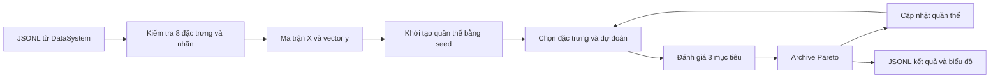

# TrainingSystem — Tối ưu trọng số và chọn đặc trưng

## Phạm vi

TrainingSystem tối ưu một vector `[w1, ..., w8, T_cls]` trong `[0,1]^9` từ dữ liệu JSONL do DataSystem tạo. Hệ thống không huấn luyện lại CNN hoặc ConvGRU.

`engine.py` và `metaheuristic.py` hiện là file rỗng. Bốn thuật toán được chạy riêng: `cmdpsofs.py`, `IBGWO4.py`, `MOHHO.py`, `NSPSOFS.py`. Các triển khai là biến thể liên tục, đa mục tiêu theo mô tả trong mã; kiểm thử phần mềm không xác nhận chúng tái hiện nguyên vẹn các bài báo tham chiếu.

## Luồng xử lý



Tám đặc trưng và thứ tự được xác định trong `fitnessFunction.FEATURES`. Mỗi giá trị phải hữu hạn, trong `[0,1]`; nhãn JSONL phải là số nguyên `0` hoặc `1`. Dòng trống được bỏ qua; bản ghi sai báo đường dẫn và số dòng. Dataset rỗng bị từ chối. `feature_encoding` hỗ trợ `scale_v1`, `risk_v1`, `risk_v2`; thiếu trường này được xem là `scale_v1`. Không trộn các phiên bản trong một dataset. Chuẩn hóa hiện tại của DataSystem là `risk_v2`, dùng cấu hình điểm nguy hiểm trong `DataSystem/NORMALIZATION.md`.

Đặc trưng `j` được chọn khi `wj >= 0.5`. Chỉ các đặc trưng được chọn tham gia dự đoán:

```text
weighted_mean: score = sum(Xj * wj) / sum(wj)
noisy_or:      score = 1 - product(1 - Xj * wj)
y_pred = 1 nếu score >= T_cls, ngược lại là 0
```

Đây là hai quy tắc kết hợp điểm; `noisy_or` không tự bảo đảm score là xác suất đã hiệu chuẩn. Nếu không chọn đặc trưng nào, Fitness trả toàn nhãn 0; các optimizer gán mục tiêu phạt `[1,1,1]` cho nghiệm đó.

Ba mục tiêu cùng được tối thiểu hóa:

```text
[1 - recall, 1 - precision, số đặc trưng được chọn / 8]
```

Nếu mẫu số recall hoặc precision bằng 0 thì chỉ số tương ứng được đặt bằng 0. Mục tiêu phạt của nghiệm không chọn đặc trưng không được diễn giải thành số đặc trưng thực tế; log và biểu đồ đếm số đặc trưng trực tiếp từ candidate.

Archive giữ các nghiệm không bị trội trong tập đang xét, loại vị trí trùng và giới hạn kích thước theo crowding distance. Archive có giới hạn không bảo đảm chứa mọi nghiệm Pareto từng gặp. NSPSOFS lấy leader từ quần thể; archive của nó phục vụ báo cáo. Các thuật toán còn lại sử dụng archive trong quá trình tìm kiếm theo logic riêng.

## Cách chạy

Chạy từ thư mục gốc repository, sau khi DataSystem đã hoàn tất ghi dữ liệu:

```bash
python -m ai.OptimalAlgorithsm.TrainingSystem.cmdpsofs
python -m ai.OptimalAlgorithsm.TrainingSystem.IBGWO4
python -m ai.OptimalAlgorithsm.TrainingSystem.MOHHO
python -m ai.OptimalAlgorithsm.TrainingSystem.NSPSOFS
```

Mỗi file có `DATA_PATH`, `OUTPUT_DIR`, `FITNESS_METHOD` và `CONFIG` trong khối `__main__`. Đường dẫn đầu vào mặc định là `ai/OptimalAlgorithsm/drowsiness_sample.jsonl`.

Mặc định IBGWO4 dùng `weighted_mean`, ba thuật toán khác dùng `noisy_or`. Khi so sánh thuật toán cần đặt cùng hàm fitness, cùng tập dữ liệu và kiểm soát seed/ngân sách đánh giá. Một generation của các thuật toán có thể đánh giá số candidate khác nhau. `generations` hiện bao gồm quần thể khởi tạo: cấu hình 100 ghi 100 mốc và thực hiện 99 bước cập nhật.

Logger tạo `config.json`, `population_log.jsonl`, `generation_log.jsonl`, `pareto_archive.jsonl` và sáu biểu đồ PNG. Khởi tạo logger làm rỗng các file log JSONL cũ trong cùng thư mục. Dùng thư mục output riêng cho mỗi lần chạy nếu cần giữ kết quả trước đó.

## Kết quả rà soát và sửa lỗi

| Vấn đề | Xử lý |
| --- | --- |
| Bốn entrypoint trỏ tới `drowsiness_hard_200.jsonl` đã bị xóa | Chuyển sang output DataSystem hiện tại |
| NaN ở candidate không bị từ chối | Kiểm tra tính hữu hạn trước dự đoán |
| Nhãn phân số hoặc vượt miền bị ép về `int8`, làm sai đánh giá | Kiểm tra nhãn nhị phân và chiều dữ liệu trước ép kiểu, kể cả ở constructor optimizer |
| Dữ liệu rỗng, sai số cột, feature ngoài miền hoặc không hữu hạn | Báo lỗi thay vì tiếp tục tối ưu |
| `predict()` có thể gọi nhầm phương thức nội bộ qua tên tùy ý | Chỉ cho phép `weighted_mean` và `noisy_or` |
| CMDPSOFS chưa kiểm tra cấu hình | Kiểm tra kích thước quần thể, số generation, archive, hệ số và số chiều |
| Số lượng dạng float được các cấu hình khác chấp nhận | Yêu cầu số nguyên cho các kích thước |
| Mục tiêu không đổi vẫn tạo biên crowding vô hạn, thiên lệch chọn/truncate | Bỏ qua mục tiêu có span bằng 0 hoặc quá nhỏ |
| Trộn `float32`/`float64` khi gộp archive gây giữ trùng và so sánh không nhất quán | Chuẩn hóa kiểu trước khi gộp, kiểm tra shape và giá trị hữu hạn |
| `RunLogger.save_config()` không serialize được `Path` | Chuyển đường dẫn thành chuỗi |
| Log không nêu rõ phạm vi đánh giá | Thêm `evaluation_scope`: chỉ dữ liệu tối ưu, chưa có đánh giá độc lập |

Kiểm thử:

```bash
MPLCONFIGDIR=/tmp/driver-guardian-mpl MPLBACKEND=Agg \
python -m unittest discover -s ai/OptimalAlgorithsm/TrainingSystem/tests -v
```

Bộ kiểm thử có 10 ca, gồm công thức dự đoán, confusion matrix biết trước, dữ liệu lỗi, crowding, Pareto sorting/archive và cấu hình. Ca tích hợp chạy **4 thuật toán × 2 hàm fitness × 2 lần cùng seed**, kiểm tra tái lập, miền nghiệm, tính lại mục tiêu và nội dung JSONL đầu ra.

Kết quả: cả 10 ca đều đạt. Lần chạy thử trên dữ liệu thực dùng một bản đọc vào RAM gồm **851 mẫu** (323 nhãn 0, 528 nhãn 1), cùng `noisy_or`, quần thể 8, 5 mốc generation, archive tối đa 12. Cả bốn thuật toán hoàn tất; mỗi thuật toán xuất 12 nghiệm và 6 biểu đồ. Mục tiêu của từng nghiệm đã được tính lại để đối chiếu, đồng thời kiểm tra không có nghiệm trong archive trội hơn nghiệm khác. Đây là lần chạy thử tính đúng của pipeline, không phải thí nghiệm tối ưu đầy đủ. Kết quả thử được lưu riêng trong `/tmp`, không ghi đè thư mục `output` hiện có.

## Giới hạn đánh giá còn tồn tại

- **Chưa có train/validation/test độc lập.** `load_jsonl()` chỉ trả `X, y`, bỏ metadata `source_video`. Recall/precision trong output là kết quả trên chính dữ liệu dùng tối ưu, không phải hiệu năng tổng quát hóa.
- Cửa sổ DataSystem chồng lấn 50 giây khi dùng cấu hình 60/10. Muốn đánh giá độc lập phải chia theo subject/video và giữ metadata; chia ngẫu nhiên theo dòng dễ làm cùng nội dung xuất hiện ở cả train/test.
- `best_recall`, `best_precision`, `min_num_features` trong log generation là **các cực trị riêng** của archive, có thể thuộc các nghiệm khác nhau. Không ghép chúng thành thành tích của một mô hình. Muốn xem một nghiệm cụ thể, đọc cùng một dòng trong `pareto_archive.jsonl`.
- Bộ kiểm thử xác nhận logic và khả năng chạy; chưa chứng minh hội tụ tối ưu, độ chính xác ngoài tập tối ưu hoặc tương đương thuật toán gốc trong bài báo.
- Dataset đang được DataSystem ghi tiếp sẽ thay đổi giữa các lần chạy. Cần chốt một bản dữ liệu hoàn chỉnh và lưu cùng cấu hình để so sánh thí nghiệm.
