# TÀI LIỆU KIẾN TRÚC MÔ HÌNH SUY LUẬN (INFERENCE MODEL ARCHITECTURE)
## Hệ Thống Driver Guardian — Nhận Diện Trạng Thái Buồn Ngủ Của Tài Xế (Driver Drowsiness Detection)

---

## 1. TỔNG QUAN MÔ HÌNH CHÍNH (EXECUTIVE ARCHITECTURE OVERVIEW)

Mô hình suy luận chính (**Driver Guardian Inference Network**) là sự kết hợp đồng bộ giữa mạng tích chập trích xuất đặc trưng không gian siêu nhẹ (**CNN Spatial Trunk** từ `NMSFreeDetector` thuộc `ObjectDetection_2p6M`) và mạng học phụ thuộc chuỗi thời gian sâu (**Deep LSTM System** từ `LSTM`).

Mô hình nhận đầu vào là một chuỗi video khung hình thời gian thực với kích thước **$[bz, T, 3, 640, 640]$**, trích xuất các đặc trưng khuôn mặt đa tỷ lệ (mắt, miệng, hướng đầu), nén không gian bằng phép toán **Adaptive Average Pooling 2D**, dung hợp đặc trưng qua **Spatial Feature Adapter**, và dự đoán trạng thái buồn ngủ/tỉnh táo thông qua mạng **Deep Stacked LSTM 3 Layers**.

```
                           SƠ ĐỒ KHÁI QUÁT DÒNG DỮ LIỆU (HIGH-LEVEL DATAFLOW)

   Video Clip Đầu Vào
  [bz, T, 3, 640, 640]
          │
          │ (Time-Folding: gập trục thời gian -> [bz*T, 3, 640, 640])
          ▼
┌────────────────────────────────────────────────────────────────────────────────────────┐
│ 1. BACKBONE (NMSFreeDetector Trunk - ~1.04M params)                                    │
│    - Stem (Conv 3 -> 16, s=2)                                                          │
│    - Stage 1 (Conv 16 -> 32, C2f n=1)                                                  │
│    - Stage 2 (Conv 32 -> 64, C2f n=2)                       -> P3_bb [bz*T, 64, 80, 80]│
│    - Stage 3 (SCDown 64 -> 128, C2fCIB n=2)                -> P4_bb [bz*T, 128, 40, 40]│
│    - Stage 4 (SCDown 128 -> 256, C2fCIB, SPPF, C2fPSA n=2) -> P5_bb [bz*T, 256, 20, 20]│
└────────────────────────────────────────────────────────────────────────────────────────┘
          │
          │ Bộ 3 bản đồ đặc trưng: (P3_bb, P4_bb, P5_bb)
          ▼
┌────────────────────────────────────────────────────────────────────────────────────────┐
│ 2. NECK (PAFPN của NMSFreeDetector - ~0.60M params)                                    │
│    - Top-Down FPN: Upsample + Concat + C2f(384->128) + Upsample + Concat + C2f(192->64) │
│    - Bottom-Up PAN: Down Conv(s=2) + Concat + C2fCIB + SCDown(s=2) + Concat + C2fCIB   │
│    - Đầu ra Neck: P3_out [bz*T, 64, 80, 80], P4_out [bz*T, 128, 40, 40], P5_out [256] │
└────────────────────────────────────────────────────────────────────────────────────────┘
          │
          │ (P3_out, P4_out, P5_out)
          ▼
┌────────────────────────────────────────────────────────────────────────────────────────┐
│ 3. ADAPTIVE AVERAGE POOLING 2D & UN-FOLDING (0 params)                                 │
│    - F.adaptive_avg_pool2d(P_k, (1, 1)) -> Vector đặc trưng không gian toàn cục        │
│    - Khôi phục cấu trúc chuỗi thời gian:                                              │
│      v_p3: [bz, T, 64]  |  v_p4: [bz, T, 128]  |  v_p5: [bz, T, 256]                   │
│    - (Tổng số kênh nối tiếp: 64 + 128 + 256 = 448 kênh)                                │
└────────────────────────────────────────────────────────────────────────────────────────┘
          │
          │ Bộ vector chuỗi thời gian đa tỷ lệ (v_p3, v_p4, v_p5)
          ▼
┌────────────────────────────────────────────────────────────────────────────────────────┐
│ 4. DEEP LSTM CLASSIFIER SYSTEM (~1.69M params)                                         │
│    - 4.1. SpatialFeatureAdapter: Dung hợp (Concat / Attention) -> [bz, T, 256]         │
│    - 4.2. Stacked 3-Layer LSTM (Hidden Dim = 256, Dropout = 0.2) -> [bz, T, 256]      │
│    - 4.3. Classification Head: Linear(256 -> 2) + Dropout(0.2)                        │
└────────────────────────────────────────────────────────────────────────────────────────┘
          │
          ▼
    ĐẦU RA DỰ ĐOÁN
    - Sequence Mode: [bz, T, 2] (Giám sát liên tục từng khung hình)
    - Clip Mode:     [bz, 2]    (Phân loại trạng thái tổng thể video clip)
```

---

## 2. QUY CÁCH ĐẦU VÀO VÀ ĐẦU RA (I/O SPECIFICATION)

### 2.1. Định dạng Tensor Đầu vào (Model Input)
* **Kích thước (Shape):** `[bz, T, 3, 640, 640]`
  * `bz` (Batch Size): Số lượng video clip xử lý đồng thời trong một mẻ (ví dụ: $1, 2, 4$).
  * `T` (Time Steps / Sequence Length): Số lượng khung hình liên tiếp trong một cửa sổ quan sát (ví dụ: $T = 60$ khung hình lấy mẫu với chu kỳ $\Delta t = 0.5\text{s}$, tương ứng $30$ giây quan sát liên tục).
  * `3` (Channels): 3 kênh màu RGB chuẩn hóa về dải $[0.0, 1.0]$.
  * `640, 640` (Height, Width): Độ phân giải khung hình sau khi áp dụng thuật toán tiền xử lý **Letterbox** (bảo toàn tỉ lệ gốc và bổ sung đệm màu xám $114$).

### 2.2. Định dạng Tensor Đầu ra (Model Output)
* **Sequence Logits (`return_sequence=True`):** `[bz, T, 2]`
  * Dự đoán xác suất cho từng bước thời gian $t \in [1, T]$ trong clip.
  * Phù hợp cho việc theo dõi biểu đồ buồn ngủ liên tục theo thời gian thực (Real-time Continuous Monitoring).
* **Final Frame / Clip Logits (`return_sequence=False`):** `[bz, 2]`
  * Dự đoán xác suất dựa trên trạng thái ẩn cuối cùng $h_T$ của mạng LSTM.
  * Phù hợp cho việc đưa ra quyết định cảnh báo tổng kết clip.
* **Không gian nhãn (2 classes):**
  * `Class 0`: Tỉnh táo / Bình thường (Alert / Normal).
  * `Class 1`: Buồn ngủ / Mất tập trung (Drowsy / Inattentive).

---

## 3. SƠ ĐỒ CHI TIẾT KIẾN TRÚC MÔ HÌNH (MERMAID ARCHITECTURE DIAGRAM)

```mermaid
flowchart TD
    subgraph InputStage["GIAI ĐOẠN 0: ĐẦU VÀO CHUỖI VIDEO"]
        raw_in["Đầu vào video: [bz, T, 3, 640, 640]"]
        fold_op["Time-Folding (Gập chiều thời gian)<br/>Reshape: [bz * T, 3, 640, 640]"]
        raw_in --> fold_op
    end

    subgraph BackboneStage["GIAI ĐOẠN 1: NMSFreeDetector BACKBONE (~1.04M Params)"]
        direction TB
        stem["Stem:<br/>Conv2D(3 -> 16, k=3, s=2) + BN + SiLU<br/>Output: [bz*T, 16, 320, 320]"]
        
        stage1["Stage 1:<br/>Conv2D(16 -> 32, k=3, s=2) + BN + SiLU<br/>C2f(32 -> 32, n=1, shortcut=True)<br/>Output: [bz*T, 32, 160, 160]"]
        
        stage2["Stage 2 (P3 Backbone - Stride 8):<br/>Conv2D(32 -> 64, k=3, s=2) + BN + SiLU<br/>C2f(64 -> 64, n=2, shortcut=True)<br/>Output: P3_bb [bz*T, 64, 80, 80]"]
        
        stage3["Stage 3 (P4 Backbone - Stride 16):<br/>SCDown(64 -> 128, k=3, s=2)<br/>C2fCIB(128 -> 128, n=2, shortcut=True)<br/>Output: P4_bb [bz*T, 128, 40, 40]"]
        
        stage4["Stage 4 (P5 Backbone - Stride 32):<br/>SCDown(128 -> 256, k=3, s=2)<br/>C2fCIB(256 -> 256, n=1, large_kernel=7x7)<br/>SPPF(256 -> 256, k=5)<br/>C2fPSA(256 -> 256, n=2, Multi-Head Attention)<br/>Output: P5_bb [bz*T, 256, 20, 20]"]

        fold_op --> stem --> stage1 --> stage2 --> stage3 --> stage4
    end

    subgraph NeckStage["GIAI ĐOẠN 2: NMSFreeDetector NECK (PAFPN) (~0.60M Params)"]
        direction TB
        subgraph TopDown["Đường Lan Truyền Từ Trên Xuống (Top-Down FPN)"]
            up_p5["Upsample Nearest 2x<br/>[bz*T, 256, 40, 40]"]
            cat_p4["torch.cat([up_p5, P4_bb], dim=1)<br/>Kênh: 256 + 128 = 384"]
            c2f_td4["C2f(384 -> 128, n=1, shortcut=True)<br/>Output: P4_td [bz*T, 128, 40, 40]"]
            up_p4["Upsample Nearest 2x<br/>[bz*T, 128, 80, 80]"]
            cat_p3["torch.cat([up_p4, P3_bb], dim=1)<br/>Kênh: 128 + 64 = 192"]
            c2f_td3["C2f(192 -> 64, n=1, shortcut=False)<br/>Output: P3_out [bz*T, 64, 80, 80]"]
            
            up_p5 --> cat_p4 --> c2f_td4 --> up_p4 --> cat_p3 --> c2f_td3
        end

        subgraph BottomUp["Đường Lan Truyền Từ Dưới Lên (Bottom-Up PAN)"]
            down_n3["Conv2D(64 -> 64, k=3, s=2)<br/>[bz*T, 64, 40, 40]"]
            cat_n4["torch.cat([down_n3, P4_td], dim=1)<br/>Kênh: 64 + 128 = 192"]
            c2f_bu4["C2fCIB(192 -> 128, n=1, shortcut=True)<br/>Output: P4_out [bz*T, 128, 40, 40]"]
            down_n4["SCDown(128 -> 128, k=3, s=2)<br/>[bz*T, 128, 20, 20]"]
            cat_n5["torch.cat([down_n4, P5_bb], dim=1)<br/>Kênh: 128 + 256 = 384"]
            c2f_bu5["C2fCIB(384 -> 256, n=1, large_kernel=7x7)<br/>Output: P5_out [bz*T, 256, 20, 20]"]

            down_n3 --> cat_n4 --> c2f_bu4 --> down_n4 --> cat_n5 --> c2f_bu5
        end

        stage4 --> up_p5
        stage3 --> cat_p4
        stage2 --> cat_p3
        c2f_td3 --> down_n3
        c2f_td4 --> cat_n4
        stage4 --> cat_n5
    end

    subgraph PoolingStage["GIAI ĐOẠN 3: NÉN KHÔNG GIAN THÍCH ỨNG & TÁI CẤU TRÚC THỜI GIAN"]
        pool_p3["adaptive_avg_pool2d(P3_out, (1, 1))<br/>-> Reshape: [bz, T, 64]"]
        pool_p4["adaptive_avg_pool2d(P4_out, (1, 1))<br/>-> Reshape: [bz, T, 128]"]
        pool_p5["adaptive_avg_pool2d(P5_out, (1, 1))<br/>-> Reshape: [bz, T, 256]"]

        c2f_td3 --> pool_p3
        c2f_bu4 --> pool_p4
        c2f_bu5 --> pool_p5
    end

    subgraph DeepLSTMStage["GIAI ĐOẠN 4: HỆ THỐNG DEEP LSTM CLASSIFIER (~1.69M Params)"]
        direction TB
        subgraph Adapter["4.1. SpatialFeatureAdapter"]
            subgraph ConcatMode["Chế độ Concat (Chuẩn mặc định)"]
                concat_vec["torch.cat([v_p3, v_p4, v_p5], dim=-1)<br/>Shape: [bz, T, 448] (64 + 128 + 256)"]
                linear_proj["Linear(448 -> 256) + LayerNorm(256) + ReLU + Dropout(0.1)<br/>Output: x_t [bz, T, 256]"]
                concat_vec --> linear_proj
            end
            
            subgraph AttentionMode["Chế độ Attention (Tùy chọn đa tỷ lệ)"]
                proj_heads["Linear(c_i -> 256) + LN + ReLU riêng cho từng scale"]
                attn_gate["Attention MLP(768 -> 256 -> 3) + Softmax -> Trọng số [α1, α2, α3]"]
                weighted_sum["Tổng có trọng số: Σ α_i * u_i -> [bz, T, 256]"]
                proj_heads --> attn_gate --> weighted_sum
                proj_heads --> weighted_sum
            end
        end

        subgraph LSTMBlocks["4.2. Stacked 3-Layer Deep LSTM (1.58M Params)"]
            lstm_l1["LSTM Layer 1 (Input: 256, Hidden: 256, batch_first=True)"]
            drop_l1["Dropout (p=0.2)"]
            lstm_l2["LSTM Layer 2 (Input: 256, Hidden: 256, batch_first=True)"]
            drop_l2["Dropout (p=0.2)"]
            lstm_l3["LSTM Layer 3 (Input: 256, Hidden: 256, batch_first=True)"]
            
            linear_proj --> lstm_l1
            weighted_sum --> lstm_l1
            lstm_l1 --> drop_l1 --> lstm_l2 --> drop_l2 --> lstm_l3
        end

        subgraph HeadBlock["4.3. Classification Head"]
            fc_drop["Dropout (p=0.2)"]
            fc_linear["Linear(256 -> 2)"]
            lstm_l3 --> fc_drop --> fc_linear
        end
    end

    pool_p3 & pool_p4 & pool_p5 --> concat_vec
    pool_p3 & pool_p4 & pool_p5 --> proj_heads

    subgraph OutputStage["GIAI ĐOẠN 5: ĐẦU RA DỰ ĐOÁN"]
        seq_out["Sequence Logits: [bz, T, 2]<br/>(Giám sát liên tục theo thời gian thực)"]
        clip_out["Clip/Final Logits: [bz, 2]<br/>(Đưa ra quyết định theo từng clip)"]
        fc_linear --> seq_out
        fc_linear --> clip_out
    end
```



---

## 4. BẢNG BIẾN ĐỔI KÍCH THƯỚC TENSOR CHI TIẾT (STEP-BY-STEP TENSOR FLOW)

Giả sử đầu vào có kích thước mẻ $bz = 2$ và chiều dài chuỗi $T = 60$ ($N = bz \times T = 120$ khung hình).

| STT | Tầng / Khối Xử Lý (Layer/Block) | Kích thước Tensor Đầu vào | Kích thước Tensor Đầu ra | Stride Tương Ứng | Ý Nghĩa Ngữ Nghĩa Của Đặc Trưng |
|:---:|:---|:---:|:---:|:---:|:---|
| **0** | **Video Clip Input** | — | $[bz, T, 3, 640, 640]$ | 1 | Chuỗi video 640x640 sau tiền xử lý Letterbox |
| **0.1** | **Time-Folding (Reshape)** | $[bz, T, 3, 640, 640]$ | $[120, 3, 640, 640]$ | 1 | Gập trục thời gian để đưa vào CNN trích xuất 2D |
| **1.1** | `Backbone.stem` (Conv 3 $\to$ 16, s=2) | $[120, 3, 640, 640]$ | $[120, 16, 320, 320]$ | 2 | Hạ mẫu ban đầu, trích xuất cạnh và màu sắc thô |
| **1.2** | `Backbone.stage1` (Conv + C2f n=1) | $[120, 16, 320, 320]$ | $[120, 32, 160, 160]$ | 4 | Tinh chỉnh đặc trưng kết cấu cơ sở |
| **1.3** | `Backbone.stage2` (Conv + C2f n=2) | $[120, 32, 160, 160]$ | $[120, 64, 80, 80]$ | 8 | **Đặc trưng vi mô $P_3^{\text{bb}}$**: Mí mắt, đồng tử, góc mở mắt |
| **1.4** | `Backbone.stage3` (SCDown + C2fCIB n=2) | $[120, 64, 80, 80]$ | $[120, 128, 40, 40]$ | 16 | **Đặc trưng trung bình $P_4^{\text{bb}}$**: Miệng ngáp, mũi, gò má |
| **1.5** | `Backbone.stage4` (SCDown + C2fCIB + SPPF + C2fPSA) | $[120, 128, 40, 40]$ | $[120, 256, 20, 20]$ | 32 | **Đặc trưng vĩ mô $P_5^{\text{bb}}$**: Toàn bộ đầu, góc nghiêng/gật đầu |
| **2.1** | `Neck.up` ($P_5^{\text{bb}}$) | $[120, 256, 20, 20]$ | $[120, 256, 40, 40]$ | 16 | Nội suy gần nhất x2 phóng to ngữ cảnh sâu |
| **2.2** | `Neck` Concat 1 + `c2f_p4` | $[120, 384, 40, 40]$ | $[120, 128, 40, 40]$ | 16 | $P_4^{\text{td}}$: Dung hợp ngữ cảnh toàn đầu vào vùng miệng |
| **2.3** | `Neck.up` ($P_4^{\text{td}}$) | $[120, 128, 40, 40]$ | $[120, 128, 80, 80]$ | 8 | Nội suy gần nhất x2 lan truyền xuống vùng mắt |
| **2.4** | `Neck` Concat 2 + `c2f_p3` | $[120, 192, 80, 80]$ | $[120, 64, 80, 80]$ | 8 | **$P_3^{\text{out}}$ (Neck Output 1)**: Mắt được làm giàu ngữ cảnh |
| **2.5** | `Neck.down3` + Concat 3 + `c2f_n4` | $[120, 192, 40, 40]$ | $[120, 128, 40, 40]$ | 16 | **$P_4^{\text{out}}$ (Neck Output 2)**: Dung hợp ngược từ mắt lên |
| **2.6** | `Neck.down4` + Concat 4 + `c2f_n5` | $[120, 384, 20, 20]$ | $[120, 256, 20, 20]$ | 32 | **$P_5^{\text{out}}$ (Neck Output 3)**: Toàn đầu bổ sung chi tiết mắt |
| **3.1** | `adaptive_avg_pool2d` trên $P_3^{\text{out}}$ | $[120, 64, 80, 80]$ | $[120, 64, 1, 1]$ | — | Nén thông tin không gian vùng mắt về vector 64 chiều |
| **3.2** | `adaptive_avg_pool2d` trên $P_4^{\text{out}}$ | $[120, 128, 40, 40]$ | $[120, 128, 1, 1]$ | — | Nén thông tin không gian vùng miệng về vector 128 chiều |
| **3.3** | `adaptive_avg_pool2d` trên $P_5^{\text{out}}$ | $[120, 256, 20, 20]$ | $[120, 256, 1, 1]$ | — | Nén thông tin không gian toàn đầu về vector 256 chiều |
| **3.4** | **Time-Unfolding (Reshape lại chuỗi)** | $[bz \cdot T, C, 1, 1]$ | $\begin{matrix} v_3 \in [bz, T, 64] \\ v_4 \in [bz, T, 128] \\ v_5 \in [bz, T, 256] \end{matrix}$ | — | Khôi phục thứ tự thời gian cho từng khung hình |
| **4.1** | `CNNAdapter` (Concat Mode) | $v_3, v_4, v_5$ | $[bz, T, 448]$ | — | Ghép nối toàn bộ 448 kênh đa tỷ lệ |
| **4.2** | `Linear + LayerNorm + ReLU + Dropout` | $[bz, T, 448]$ | $[bz, T, 256]$ | — | Chiếu về không gian biểu diễn ẩn chung $d = 256$ |
| **4.3** | `Deep LSTM` (3 lớp xếp chồng) | $[bz, T, 256]$ | $[bz, T, 256]$ | — | Mô hình hóa quy luật diễn biến theo thời gian |
| **4.4** | `fc_out` (Sequence Mode) | $[bz, T, 256]$ | $[bz, T, 2]$ | — | **Dự đoán nhãn theo từng khung hình liên tục** |
| **4.5** | `fc_out` (Clip Mode: chọn frame cuối) | $[bz, 256]$ | $[bz, 2]$ | — | **Dự đoán nhãn tổng quát cho toàn bộ video clip** |

---

## 5. CHI TIẾT CÁC THÀNH PHẦN KIẾN TRÚC MÔ TẢ THEO MÃ NGUỒN

### 5.1. Khối Thân Mạng Backbone của NMSFreeDetector
Mã nguồn định nghĩa trong `ObjectDetection_2p6M/src/backbone_neck.py`:
* **Cấu hình tham số độ rộng & độ sâu:**
  * Độ rộng các tầng (`backbone_w`): `(16, 32, 64, 128, 256)`
  * Số lượng khối Bottleneck lặp lại (`backbone_n`): `(1, 2, 2, 1)`
* **Các khối cấu thành:**
  * **`Conv(c1, c2, k, s)`**: Bao gồm `Conv2d` (không dùng bias) + `BatchNorm2d` + kích hoạt `SiLU`.
  * **`C2f(c1, c2, n, shortcut)`**: Khối Faster CSP Bottleneck với 2 nhánh (nhánh shortcut bảo toàn thông tin và chuỗi Bottlenecks tinh lọc đặc trưng).
  * **`SCDown(c1, c2, k=3, s=2)`**: Khối hạ mẫu tách biệt (Spatial and Channel Downsampling), kết hợp `Conv 1x1` để thay đổi số kênh và `Depthwise Conv 3x3 (stride=2)` để hạ mẫu không gian, giúp giảm đáng kể tham số và FLOPs so với tích chập thông thường.
  * **`C2fCIB`**: Biến thể C2f tích hợp khối **Compact Inverted Bottleneck (CIB)**. Tại tầng sâu nhất ($P_5$), khối sử dụng **`large_kernel=True`** với kích thước nhân tích chập lớn $7 \times 7$ nhằm mở rộng tối đa vùng thụ cảm (Receptive Field).
  * **`SPPF(256, 256, k=5)`**: Spatial Pyramid Pooling Fast, thực hiện liên tiếp các phép `MaxPool2d(5, stride=1, padding=2)` nhằm trích xuất thông tin ngữ cảnh đa kích thước mà không làm giảm độ phân giải.
  * **`C2fPSA(256, 256, n=2)`**: Pointwise Spatial Attention, áp dụng cơ chế tự chú ý **Multi-Head Self-Attention (4 heads)** kết hợp LayerScale và mạng FFN truyền thẳng, giúp mô hình tập trung chú ý vào các vùng quan trọng nhất trên khuôn mặt tài xế (mắt, miệng).

---

### 5.2. Khối Cổ Mạng Neck của NMSFreeDetector (`PAFPN`)
Mã nguồn định nghĩa trong `ObjectDetection_2p6M/src/backbone_neck.py`:
* **Cấu hình tham số:**
  * Số kênh đầu vào (`chs`): `(64, 128, 256)` tương ứng với $(P_3^{\text{bb}}, P_4^{\text{bb}}, P_5^{\text{bb}})$.
  * Số khối lặp lại (`neck_n`): `1`.
* **Cơ chế hoạt động 2 chiều:**
  1. **Top-Down FPN Pathway:** Lan truyền ngữ nghĩa bậc cao từ tầng sâu ($P_5^{\text{bb}}$) xuống các tầng nông ($P_4^{\text{bb}}, P_3^{\text{bb}}$) bằng phép nội suy tăng mẫu $2\times$ (`Upsample nearest`) và nối kênh (`torch.cat`), đưa qua khối `C2f` để khử nhiễu ngữ nghĩa.
  2. **Bottom-Up PAN Pathway:** Lan truyền ngược chi tiết không gian độ phân giải cao từ tầng nông ($P_3^{\text{out}}$) ngược lên các tầng sâu ($P_4^{\text{out}}, P_5^{\text{out}}$) qua khối tích chập hạ mẫu `down3 = Conv(64, 64, 3, 2)` và `down4 = SCDown(128, 128, 3, 2)`, đưa qua khối `C2fCIB` với nhân lớn $7 \times 7$.
* **Đầu ra của Neck:**
  $$\mathbf{P}_3^{\text{out}} \in \mathbb{R}^{(bz \cdot T) \times 64 \times 80 \times 80}, \quad \mathbf{P}_4^{\text{out}} \in \mathbb{R}^{(bz \cdot T) \times 128 \times 40 \times 40}, \quad \mathbf{P}_5^{\text{out}} \in \mathbb{R}^{(bz \cdot T) \times 256 \times 20 \times 20}$$

---

### 5.3. Phép Nén Không Gian Thích Ứng (`F.adaptive_avg_pool2d`)
Sau khi thu được 3 bản đồ đặc trưng từ Neck, mô hình áp dụng phép nén trung bình toàn cục không gian (Global Spatial Adaptive Average Pooling) để chuyển đổi bản đồ đặc trưng 2D thành vector biểu diễn 1D:
$$\mathbf{v}_{P_k}^{(t)} = \text{AdaptiveAvgPool2D}\left(\mathbf{P}_k^{\text{out}(t)}, (1, 1)\right) \in \mathbb{R}^{(bz \cdot T) \times C_k \times 1 \times 1}$$

Sau đó làm phẳng (Flatten) và tái định hình khôi phục trục thời gian:
$$\mathbf{v}_3 \in \mathbb{R}^{bz \times T \times 64}, \quad \mathbf{v}_4 \in \mathbb{R}^{bz \times T \times 128}, \quad \mathbf{v}_5 \in \mathbb{R}^{bz \times T \times 256}$$

* **Lý do lựa chọn Adaptive Average Pooling:**
  * Giúp mô hình độc lập với biến thiên tọa độ dịch chuyển nhẹ của đầu tài xế trong khung hình.
  * Giảm tải $80 \times 80 = 6400$ lần dữ liệu ở tầng $P_3$, $40 \times 40 = 1600$ lần ở tầng $P_4$, và $20 \times 20 = 400$ lần ở tầng $P_5$, giải phóng triệt để áp lực tính toán cho mạng LSTM phía sau.
  * Vector kết quả giữ nguyên tính cô đọng ngữ nghĩa cao nhất của từng vùng đặc trưng.

---

### 5.4. Khối Dung Hợp Đặc Trưng Không Gian (`CNNAdapter`)
Mã nguồn định nghĩa trong `LSTM/model.py`:
Nhận 3 tensor $(\mathbf{v}_3, \mathbf{v}_4, \mathbf{v}_5)$ với tổng số kênh $64 + 128 + 256 = 448$ và chiếu về chiều ẩn $d_{\text{model}} = 256$.

#### A. Chế độ Fusion `concat` (Chuẩn mặc định hệ thống)
* Ghép nối các vector đặc trưng:
  $$\mathbf{v}_{\text{concat}} = [\mathbf{v}_3 \,\|\, \mathbf{v}_4 \,\|\, \mathbf{v}_5] \in \mathbb{R}^{bz \times T \times 448}$$
* Chiếu tuyến tính và chuẩn hóa:
  $$\mathbf{x}_t = \text{Dropout}\left(\text{ReLU}\left(\text{LayerNorm}\left(\mathbf{W}_{\text{proj}} \mathbf{v}_{\text{concat}} + \mathbf{b}_{\text{proj}}\right)\right), p=0.1\right) \in \mathbb{R}^{bz \times T \times 256}$$
* **Ưu điểm:** Cho phép ma trận trọng số $\mathbf{W}_{\text{proj}} \in \mathbb{R}^{256 \times 448}$ học được mối quan hệ tương quan chéo (cross-scale interaction) giữa cử động mắt ($P_3$), mở miệng ($P_4$) và gật đầu ($P_5$).

#### B. Chế độ Fusion `attention` (Chú ý đa tỷ lệ động)
* Chiếu độc lập từng tỷ lệ về không gian 256 chiều:
  $$\mathbf{u}_i = \text{ReLU}\left(\text{LayerNorm}\left(\mathbf{W}_i \mathbf{v}_i + \mathbf{b}_i\right)\right) \in \mathbb{R}^{256}, \quad i \in \{3, 4, 5\}$$
* Mạng Attention MLP tính trọng số động cho từng frame:
  $$\mathbf{e}_t = \mathbf{W}_2 \left(\text{ReLU}\left(\mathbf{W}_1 [\mathbf{u}_3 \,\|\, \mathbf{u}_4 \,\|\, \mathbf{u}_5] + \mathbf{b}_1\right)\right) + \mathbf{b}_2 \in \mathbb{R}^3$$
  $$[\alpha_3, \alpha_4, \alpha_5] = \text{Softmax}(\mathbf{e}_t), \quad \sum_{i} \alpha_i = 1$$
  $$\mathbf{x}_t = \text{Dropout}\left(\sum_{i \in \{3, 4, 5\}} \alpha_i \mathbf{u}_i, p=0.1\right) \in \mathbb{R}^{bz \times T \times 256}$$

---

### 5.5. Khối Chuỗi Thời Gian Sâu (`DeepLSTMClassifier`)
Mã nguồn định nghĩa trong `LSTM/model.py`:
Sử dụng mạng **Deep Stacked LSTM 3 lớp** nhận đầu vào $\mathbf{x} \in \mathbb{R}^{bz \times T \times 256}$:
* **Tham số cấu hình:**
  * `input_size = 256`
  * `hidden_size = 256`
  * `num_layers = 3`
  * `batch_first = True`
  * `dropout = 0.2` (áp dụng giữa Layer 1 $\to$ 2 và Layer 2 $\to$ 3)
* **Công thức cập nhật trong từng ô nhớ (LSTM Cell):**
  Tại bước thời gian $t$ và lớp $l$:
  $$\mathbf{f}_t^{(l)} = \sigma\left(\mathbf{W}_f^{(l)} \mathbf{x}_t^{(l)} + \mathbf{U}_f^{(l)} \mathbf{h}_{t-1}^{(l)} + \mathbf{b}_f^{(l)}\right) \quad \text{(Forget Gate)}$$
  $$\mathbf{i}_t^{(l)} = \sigma\left(\mathbf{W}_i^{(l)} \mathbf{x}_t^{(l)} + \mathbf{U}_i^{(l)} \mathbf{h}_{t-1}^{(l)} + \mathbf{b}_i^{(l)}\right) \quad \text{(Input Gate)}$$
  $$\tilde{\mathbf{c}}_t^{(l)} = \tanh\left(\mathbf{W}_c^{(l)} \mathbf{x}_t^{(l)} + \mathbf{U}_c^{(l)} \mathbf{h}_{t-1}^{(l)} + \mathbf{b}_c^{(l)}\right) \quad \text{(Candidate Cell State)}$$
  $$\mathbf{c}_t^{(l)} = \mathbf{f}_t^{(l)} \odot \mathbf{c}_{t-1}^{(l)} + \mathbf{i}_t^{(l)} \odot \tilde{\mathbf{c}}_t^{(l)} \quad \text{(Cell State)}$$
  $$\mathbf{o}_t^{(l)} = \sigma\left(\mathbf{W}_o^{(l)} \mathbf{x}_t^{(l)} + \mathbf{U}_o^{(l)} \mathbf{h}_{t-1}^{(l)} + \mathbf{b}_o^{(l)}\right) \quad \text{(Output Gate)}$$
  $$\mathbf{h}_t^{(l)} = \mathbf{o}_t^{(l)} \odot \tanh\left(\mathbf{c}_t^{(l)}\right) \quad \text{(Hidden State)}$$

* **Ý nghĩa thực tế:**
  * Phân biệt rõ giữa hiện tượng **chớp mắt sinh lý** (kéo dài ngắn $0.15\text{s} - 0.3\text{s}$) và **nhắm mắt do ngủ gật** (kéo dài $> 1.5\text{s} - 2.0\text{s}$).
  * Bắt kịp quy luật ngáp dài liên tục hoặc hành vi cúi đầu gục xuống vô thức theo diễn biến thời gian.

---

### 5.6. Đầu Phân Loại Dự Đoán (`Classification Head - fc_out`)
Được định nghĩa bởi khối:
```python
self.fc_out = nn.Sequential(
    nn.Dropout(p=0.2),
    nn.Linear(in_features=256, out_features=2)
)
```
* **Chế độ Sequence:**
  $$\mathbf{Logits}_{\text{seq}} = \mathbf{fc\_out}(\mathbf{H}^{(3)}) \in \mathbb{R}^{bz \times T \times 2}$$
* **Chế độ Clip:**
  $$\mathbf{Logits}_{\text{clip}} = \mathbf{fc\_out}\left(\mathbf{h}_T^{(3)}\right) \in \mathbb{R}^{bz \times 2}$$

---

## 6. THỐNG KÊ CHI TIẾT SỐ LƯỢNG THAM SỐ (PARAMETER COUNT BREAKDOWN)

| Thành Phần (Component) | Module Chi Tiết | Số Chiều Đầu Vào $\to$ Đầu Ra | Số Lượng Tham Số (Params) | Tỷ Lệ (%) |
|:---|:---|:---:|:---:|:---:|
| **CNN Backbone** | Stem, Stage 1, Stage 2, Stage 3, Stage 4 | $[3, 640, 640] \to (P_3, P_4, P_5)$ | **1,038,784** (~1.04M) | ~31.1% |
| **CNN Neck** | PAFPN (Top-down FPN + Bottom-up PAN) | $(P_3, P_4, P_5) \to (P_3', P_4', P_5')$ | **602,752** (~0.60M) | ~18.1% |
| **Spatial Pooling** | `F.adaptive_avg_pool2d(1, 1)` | 2D Maps $\to$ 1D Vectors | **0** (Non-parametric) | 0.0% |
| **Feature Adapter** | `CNNAdapter` (Chế độ `concat`) | $448 \to 256$ + LayerNorm(256) | **115,456** (~0.12M) | ~3.5% |
| **Temporal LSTM** | Stacked 3-Layer LSTM (Hidden=256) | $256 \to 256$ (3 Layers) | **1,579,008** (~1.58M) | ~47.3% |
| **Classifier Head** | FC Layer + Dropout(0.2) | $256 \to 2$ | **514** (< 1K) | < 0.1% |
| **TỔNG TOÀN BỘ MÔ HÌNH** | **End-to-End Driver Guardian Inference Model** | **$[bz, T, 3, 640, 640] \to [bz, T, 2]$** | **~3,336,514 (~3.34M)** | **100.0%** |

*(Ghi chú: Nếu sử dụng chế độ `fusion="attention"`, SpatialFeatureAdapter có thêm các nhánh chiếu riêng và Attention MLP, tổng số tham số mô hình tăng thêm ~245K đạt ~3.58M params).*

---

## 7. ĐẶC TÍNH VẬN HÀNH VÀ TRIỂN KHAI SUY LUẬN (INFERENCE DEPLOYMENT)

### 7.1. Chế độ Suy Luận Trực Tiếp End-to-End
Trong chế độ này, mô hình được đóng gói thành một lớp `nn.Module` duy nhất:
* Khung hình video camera được tích lũy vào một hàng đợi vòng (Circular Frame Buffer) kích thước $T = 60$.
* Tại mỗi chu kỳ đánh giá (mỗi $0.5\text{s}$), tensor $[1, 60, 3, 640, 640]$ được truyền xuôi qua toàn bộ mạng để lấy dự đoán thời gian thực.
* Thời gian suy luận dự kiến trên GPU tầm trung (NVIDIA GTX 1650 / RTX 3050): **~15ms - 22ms** cho toàn bộ chuỗi 60 frames (nhờ cơ chế hạ mẫu sớm của Stem và tính toán song song CUDA).

### 7.2. Chế độ Phân Tách Pipeline (Two-Stage Decoupled Streaming Inference)
Để đạt hiệu năng tối đa trên các thiết bị nhúng (NVIDIA Jetson Orin / Raspberry Pi 5 / RK3588):
1. **Trích xuất đặc trưng không gian theo từng frame:**
   * Mỗi khung hình mới đến chỉ cần chạy qua `Backbone + Neck + AdaptiveAvgPool2d` một lần duy nhất, thu được vector $v_t \in \mathbb{R}^{448}$.
   * Tần số chạy trích xuất không gian: $2\text{ FPS}$ (mỗi $0.5\text{s}$ một khung hình).
2. **Cập nhật trạng thái ẩn LSTM (Stateful Streaming Inference):**
   * Đưa vector $v_t$ qua `CNNAdapter` thu được $x_t \in \mathbb{R}^{256}$.
   * Cập nhật bước thời gian của LSTM với trạng thái ẩn được duy trì liên tục:
     $$(\mathbf{h}_t, \mathbf{c}_t) = \text{LSTMCell}(x_t, (\mathbf{h}_{t-1}, \mathbf{c}_{t-1}))$$
   * Dự đoán ngay lập tức qua `fc_out` với độ trễ tính toán cực tiểu: **$< 1\text{ms}$**.
   * Tiết kiệm $98\%$ chi phí tính toán do không cần forward lại 59 khung hình quá khứ.

---

## 8. KẾ HOẠCH ĐÓNG GÓI MODEL THÀNH ĐỊNH DẠNG ONNX FLOAT32 (ONNX FP32 PACKAGING & EXPORT PLAN)

### 8.1. Mục Tiêu & Cơ Sở Lựa Chọn Định Dạng ONNX Float32
Mô hình sau khi huấn luyện trên PyTorch cần được đóng gói sang định dạng chuẩn **ONNX (Open Neural Network Exchange)** với độ chính xác số thực **Float32 (FP32)** nhằm các mục tiêu cốt lõi sau:
1. **Độc lập nền tảng (Platform Agnostic):** Vận hành trực tiếp trên các runtime suy luận hiệu năng cao như **ONNX Runtime (CPU/CUDA/DirectML)**, **TensorRT (NVIDIA)**, **OpenVINO (Intel)** mà không cần cài đặt môi trường PyTorch cồng kềnh.
2. **Bảo toàn 100% độ chính xác (Zero Numerical Precision Degradation):** Định dạng Float32 đóng vai trò là "mô hình chuẩn vàng" (Golden Reference Baseline), giữ nguyên vẹn giá trị weights và activations của checkpoint PyTorch tốt nhất, tránh các lỗi làm tròn (quantization noise) trước khi xem xét lượng tử hóa FP16/INT8.
3. **Tối ưu hóa đồ thị tính toán (Graph Optimization):** Cho phép các runtime thực hiện gộp tầng tích chập với chuẩn hóa (`Conv + BatchNorm` fusion), nén hằng số (Constant Folding) và tối ưu hóa bộ nhớ tạm (Memory Reuse).

---

### 8.2. Hai Chiến Lược Đóng Gói Mô Hình (Dual Packaging Strategies)

Hệ thống Driver Guardian thiết kế **2 phương án đóng gói ONNX Float32 song song** để phục vụ hai kịch bản triển khai khác nhau:

```
                            CHIẾN LƯỢC ĐÓNG GÓI ONNX FLOAT32
                            
┌────────────────────────────────────────────────────────────────────────────────────────┐
│ PHƯƠNG ÁN 1: ĐÓNG GÓI HỢP NHẤT TOÀN DIỆN (END-TO-END ONNX MODEL)                       │
│ File: driver_guardian_end2end.onnx (~13.35 MB)                                         │
│                                                                                        │
│  [bz, T, 3, 640, 640]                                                                  │
│          │                                                                             │
│          ▼                                                                             │
│ ┌──────────────────────────────────────────────────────────────────────────────────┐   │
│ │ Fold(bz*T) ──> Backbone ──> Neck(PAFPN) ──> AdaptiveAvgPool ──> Unfold(bz, T)     │   │
│ │               ──> SpatialAdapter ──> Stacked 3-Layer LSTM ──> FC Head            │   │
│ └──────────────────────────────────────────────────────────────────────────────────┘   │
│          │                                                                             │
│          ▼                                                                             │
│  Logits: [bz, T, 2] (Sequence) hoặc [bz, 2] (Clip)                                     │
│  => Phù hợp: Đánh giá offline, chạy batch trên Server / Cloud, kiểm thử kiểm thử tự động │
└────────────────────────────────────────────────────────────────────────────────────────┘

┌────────────────────────────────────────────────────────────────────────────────────────┐
│ PHƯƠNG ÁN 2: ĐÓNG GÓI PHÂN TÁCH HAI KHỐI (DECOUPLED STREAMING ONNX - KHUYÊN DÙNG EDGE) │
│                                                                                        │
│ ┌──────────────────────────────────────────┐    ┌────────────────────────────────────┐ │
│ │ Khối 1: spatial_extractor.onnx (~6.56MB) │    │ Khối 2: temporal_classifier.onnx   │ │
│ │ (Backbone + Neck + AdaptiveAvgPool)      │    │         (~6.79MB)                  │ │
│ │                                          │    │ (SpatialAdapter + LSTM + FC)       │ │
│ │ Input:  frame [bz, 3, 640, 640]          │    │ Input:  feat [bz, 1, 448]          │ │
│ │ Output: feat  [bz, 448] (v3+v4+v5)       │    │         h_in, c_in [3, bz, 256]    │ │
│ │ Tần số: 2 FPS (mỗi 0.5s / 1 frame)       │───>│ Output: logits [bz, 1, 2]          │ │
│ │                                          │    │         h_out, c_out [3, bz, 256]  │ │
│ │                                          │    │ Độ trễ: < 1ms / bước thời gian     │ │
│ └──────────────────────────────────────────┘    └────────────────────────────────────┘ │
│  => Phù hợp: Thiết bị biên nhúng (Jetson, Raspberry Pi), giảm 98% chi phí tính toán     │
└────────────────────────────────────────────────────────────────────────────────────────┘
```

#### A. Phương Án 1: Mô Hình Hợp Nhất End-to-End (`driver_guardian_end2end.onnx`)
* **Cơ chế:** Toàn bộ chuỗi xử lý từ nhận video 5D `[bz, T, 3, 640, 640]`, gập thời gian, qua Backbone, Neck, Pooling, Adapter, LSTM đến FC Head được đóng gói trong một file đồ thị ONNX duy nhất.
* **Đặc tính Dynamic Axes:**
  * Trục 0: `batch_size` (linh hoạt $1, 2, 4,...$).
  * Trục 1: `seq_len` (linh hoạt độ dài chuỗi $T$, ví dụ: $30, 60, 120$ frames).
* **Ứng dụng:** Dùng cho quá trình Benchmark độ trễ toàn diện, thẩm định chất lượng trên tập dữ liệu kiểm thử (Evaluation/Validation) hoặc chạy suy luận theo từng video clip hoàn chỉnh trên máy chủ trung tâm.

#### B. Phương Án 2: Mô Hình Phân Tách Hai Khối Streaming (Decoupled Streaming ONNX)
* **Khối 1 (`spatial_extractor.onnx`):**
  * Nhận khung hình đơn lẻ $[bz, 3, 640, 640]$.
  * Xuất ra vector đặc trưng không gian gộp $[bz, 448]$.
  * Chỉ chạy 1 lần cho mỗi khung hình mới thu nhận từ camera (tần số $2\text{ FPS}$).
* **Khối 2 (`temporal_classifier.onnx`):**
  * Nhận vector đặc trưng khung hình mới $[bz, 1, 448]$ cùng trạng thái ẩn trước đó $(\mathbf{h}_{t-1}, \mathbf{c}_{t-1}) \in \mathbb{R}^{3 \times bz \times 256}$.
  * Xuất ra logits nhãn tức thời $[bz, 1, 2]$ cùng trạng thái ẩn cập nhật $(\mathbf{h}_t, \mathbf{c}_t) \in \mathbb{R}^{3 \times bz \times 256}$.
* **Lợi ích kỹ thuật:** Giúp hệ thống không phải tính toán lặp lại mạng CNN cho các khung hình quá khứ, giải phóng tối đa tài nguyên NPU/GPU trên xe.

---

### 8.3. Bảng Đặc Tả Kỹ Thuật Đóng Gói ONNX Float32 (ONNX Specifications)

| Thông Số Kỹ Thuật | Phương Án 1 (End-to-End Model) | Phương Án 2 - Khối 1 (Spatial) | Phương Án 2 - Khối 2 (Temporal) |
|:---|:---|:---|:---|
| **Tên file xuất** | `driver_guardian_end2end.onnx` | `spatial_extractor.onnx` | `temporal_classifier.onnx` |
| **Định dạng dữ liệu** | `Float32` (IEEE 754 Single Precision) | `Float32` | `Float32` |
| **ONNX Opset Version** | **Opset 17** (Hỗ trợ LayerNorm, LSTM) | **Opset 17** | **Opset 17** |
| **Tên đầu vào (Inputs)** | `video`: `[bz, T, 3, 640, 640]` | `image`: `[bz, 3, 640, 640]` | `features`: `[bz, 1, 448]`<br/>`h_0`: `[3, bz, 256]`<br/>`c_0`: `[3, bz, 256]` |
| **Trục động (Dynamic Axes)** | `{"video": {0: "batch", 1: "time"}}` | `{"image": {0: "batch"}}` | `{"features": {0: "batch"}, "h_0": {1: "batch"}, "c_0": {1: "batch"}}` |
| **Tên đầu ra (Outputs)** | `logits`: `[bz, T, 2]` | `features`: `[bz, 448]` | `logits`: `[bz, 1, 2]`<br/>`h_n`: `[3, bz, 256]`<br/>`c_n`: `[3, bz, 256]` |
| **Dung lượng file dự kiến** | **~13.35 MB** | **~6.56 MB** | **~6.79 MB** |
| **Số lượng Ops chính** | Conv, Add, Mul, SiLU, MaxPool, MatMul, Softmax, LSTM | Conv, Add, Mul, SiLU, MaxPool, MatMul, Softmax, GlobalAvgPool | MatMul, LayerNormalization, ReLU, LSTM, Gemm |

---

### 8.4. Quy Trình 6 Bước Triển Khai Đóng Gói Chuẩn Hóa (Step-by-Step Roadmap)


#### Bước 1: Chuẩn bị mô hình & Nạp trọng số Checkpoint
* Khởi tạo mô hình hoàn chỉnh và nạp trọng số đã hội tụ từ checkpoint tốt nhất:
  * Trọng số Backbone + Neck từ `ObjectDetection_2p6M/checkpoints/.../best.pt`.
  * Trọng số DeepLSTMClassifier từ `LSTM/checkpoint_best.pt`.
* Đặt toàn bộ mô hình ở chế độ đánh giá: `model.eval()`.
* **Yêu cầu nghiêm ngặt:** Đóng băng toàn bộ tham số (`requires_grad_(False)`), vô hiệu hóa hoàn toàn cơ chế Dropout để đầu ra có tính tất định 100%.

#### Bước 2: Xây dựng các Module Wrapper phục vụ Export
Để loại bỏ các cấu trúc dữ liệu không được ONNX hỗ trợ (như Python `dict`, `tuple` biến thiên, hoặc các cờ điều kiện phức tạp), xây dựng các lớp Wrapper thuần Tensor:

```python
# Minh họa lớp Wrapper xuất End-to-End
class DriverGuardianEnd2EndExportWrapper(nn.Module):
    def __init__(self, trunk_model, lstm_model):
        super().__init__()
        self.backbone = trunk_model.backbone
        self.neck = trunk_model.neck
        self.adapter = lstm_model.spatial_adapter
        self.lstm = lstm_model.lstm
        self.fc = lstm_model.fc_out

    def forward(self, x: torch.Tensor) -> torch.Tensor:
        # x shape: [bz, T, 3, 640, 640]
        bz, t, c, h, w = x.shape
        x_flat = x.view(bz * t, c, h, w)
        
        # 1. Trích xuất đặc trưng không gian
        p3, p4, p5 = self.backbone(x_flat)
        p3, p4, p5 = self.neck(p3, p4, p5)
        
        # 2. Adaptive Average Pooling (1, 1)
        v3 = F.adaptive_avg_pool2d(p3, (1, 1)).view(bz, t, 64)
        v4 = F.adaptive_avg_pool2d(p4, (1, 1)).view(bz, t, 128)
        v5 = F.adaptive_avg_pool2d(p5, (1, 1)).view(bz, t, 256)
        
        # 3. Spatial Adapter Fusion
        feats = torch.cat([v3, v4, v5], dim=-1)  # [bz, t, 448]
        proj = self.adapter.projection(feats)     # [bz, t, 256]
        
        # 4. Deep LSTM
        lstm_out, _ = self.lstm(proj)             # [bz, t, 256]
        
        # 5. Classification Logits
        logits = self.fc(lstm_out)                # [bz, t, 2]
        return logits
```

#### Bước 3: Thực thi xuất PyTorch sang ONNX (`torch.onnx.export`)
* Sử dụng lệnh `torch.onnx.export` với các tham số tối ưu:
  * `opset_version = 17`.
  * `do_constant_folding = True` (gộp sẵn các phép tính hằng số ngay khi export).
  * Khai báo đầy đủ tên `input_names`, `output_names` và từ điển `dynamic_axes`.
  * Thiết lập mẫu Dummy Input đúng định dạng `torch.float32`.

#### Bước 4: Kiểm tra và tối ưu hóa đồ thị ONNX
1. **Kiểm tra tính hợp lệ đồ thị:**
   ```python
   import onnx
   onnx_model = onnx.load("driver_guardian_end2end.onnx")
   onnx.checker.check_model(onnx_model, full_check=True)
   ```
2. **Khôi phục Shape Inference:** Áp dụng `onnx.shape_inference.infer_shapes` để đảm bảo mọi tensor trung gian đều có thông tin shape rõ ràng.
3. **Đơn giản hóa đồ thị với `onnxsim` (ONNX Simplifier):**
   * Loại bỏ các node tính toán thừa (Dead code elimination).
   * Gộp các phép tính `Reshape`, `Transpose`, `Squeeze`, `Unsqueeze` liên tiếp.

#### Bước 5: Kiểm định sai số số học (Numerical Parity & Verification)
So sánh song song kết quả đầu ra giữa **PyTorch nguyên bản** và **ONNX Runtime (CPU & CUDA Execution Providers)** trên 100 mẫu ngẫu nhiên:
* **Chỉ số sai số tuyệt đối lớn nhất (Maximum Absolute Error):**
  $$\Delta_{\max} = \max_{i, j} \left| y_{\text{PyTorch}}^{(i, j)} - y_{\text{ONNX}}^{(i, j)} \right| < 10^{-5}$$
* **Hệ số tương đồng Cosine (Cosine Similarity):**
  $$\text{CosineSim}(y_{\text{PyTorch}}, y_{\text{ONNX}}) > 0.99999$$
* Nếu cả hai tiêu chí trên đạt chuẩn, file ONNX được công nhận đạt trạng thái **Production-Ready**.

#### Bước 6: Đóng gói Metadata & Tạo Manifest (`model_manifest.json`)
Lưu kèm tệp manifest chứa toàn bộ thông số định danh mô hình:
```json
{
  "model_name": "DriverGuardian_End2End",
  "format": "ONNX",
  "precision": "Float32",
  "opset_version": 17,
  "input_shape": ["batch_size", "seq_len", 3, 640, 640],
  "output_shape": ["batch_size", "seq_len", 2],
  "labels": ["Alert", "Drowsy"],
  "sample_interval_sec": 0.5,
  "sha256": "e3b0c44298fc1c149afbf4c8996fb92427ae41e4649b934ca495991b7852b855",
  "date_created": "2026-09-26"
}
```

---

### 8.5. Kế Hoạch Benchmark Đo Đạc Hiệu Năng & Độ Trễ
Sau khi xuất file ONNX Float32 thành công, tiến hành đo kiểm hiệu năng suy luận (Inference Benchmark) theo kịch bản:
* **Phần cứng thử nghiệm:**
  1. *GPU Workstation:* NVIDIA RTX 3060 / 4060 (sử dụng `CUDAExecutionProvider` và I/O Binding).
  2. *Edge Embedded Board:* NVIDIA Jetson Orin Nano / Xavier NX.
  3. *CPU Edge:* Intel Core i5-12400 / ARM Cortex-A76 (Raspberry Pi 5 qua `CPUExecutionProvider`).
* **Các chỉ số cần ghi nhận:**
  * **P50 Latency (ms):** Thời gian xử lý trung vị cho một khung hình / một chuỗi 60 frames.
  * **P99 Latency (ms):** Thời gian xử lý tại phân vị 99% để kiểm soát hiện tượng giật khung hình (frame drop).
  * **RAM / VRAM Footprint (MB):** Mức chiếm dụng bộ nhớ khi nạp đồ thị ONNX.
  * **Throughput (FPS):** Số lượng khung hình xử lý được trong một giây (yêu cầu tối thiểu $> 30\text{ FPS}$ cho toàn hệ thống).

---

## 9. TỔNG KẾT
Kiến trúc mô hình chính kết hợp **Backbone & Neck của NMSFreeDetector** cùng **Adaptive Average Pooling 2D** và **DeepLSTMClassifier** là một thiết kế tối ưu, cân bằng hoàn hảo giữa:
1. **Khả năng biểu diễn:** Trích xuất chi tiết góc mở mí mắt và biểu cảm khuôn mặt từ tầng nông đến tầng sâu qua PAFPN.
2. **Mô hình hóa thời gian dài hạn:** Phân biệt chính xác giữa chớp mắt tự nhiên và ngủ gật nhờ 3 tầng LSTM xếp chồng.
3. **Kích thước siêu nhẹ:** Toàn bộ mô hình chỉ xấp xỉ **$3.34\text{M}$ tham số** (~13.35 MB ở định dạng ONNX Float32).
4. **Sẵn sàng triển khai:** Kế hoạch đóng gói ONNX Float32 chi tiết (bao gồm cả phương án End-to-End và phương án Phân tách 2 giai đoạn) đảm bảo mô hình có thể triển khai mượt mà, đạt độ trễ thời gian thực trên các hệ thống giám sát an toàn xe hơi nhúng (In-Cabin Driver Monitoring System).

