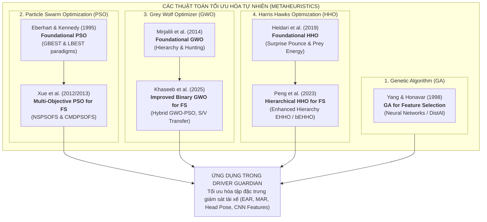
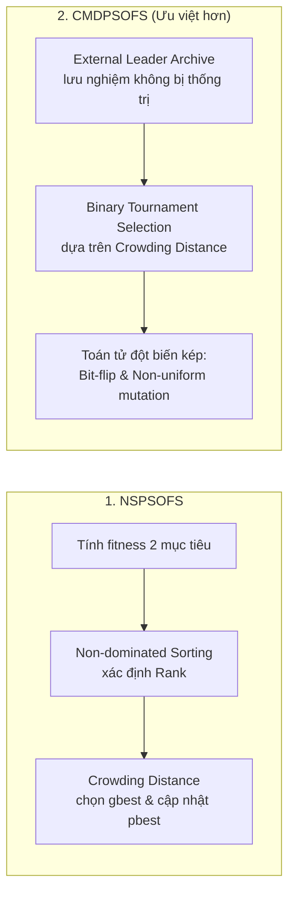
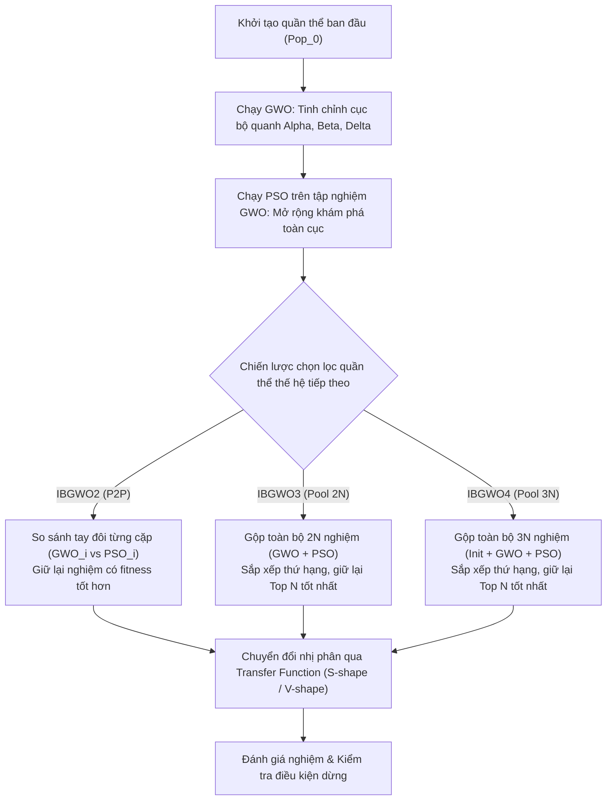
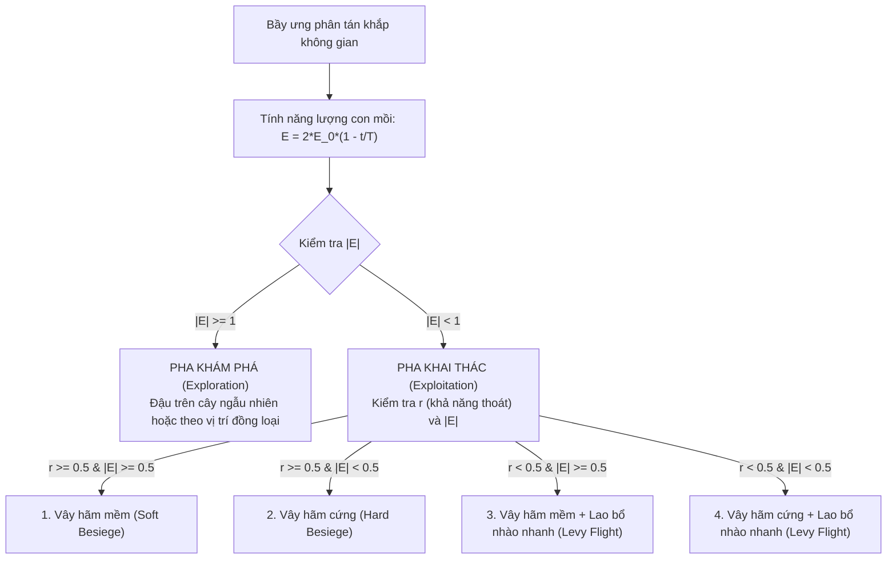
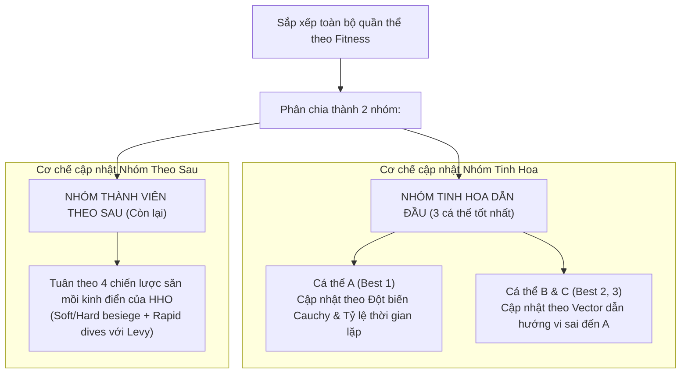
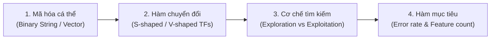
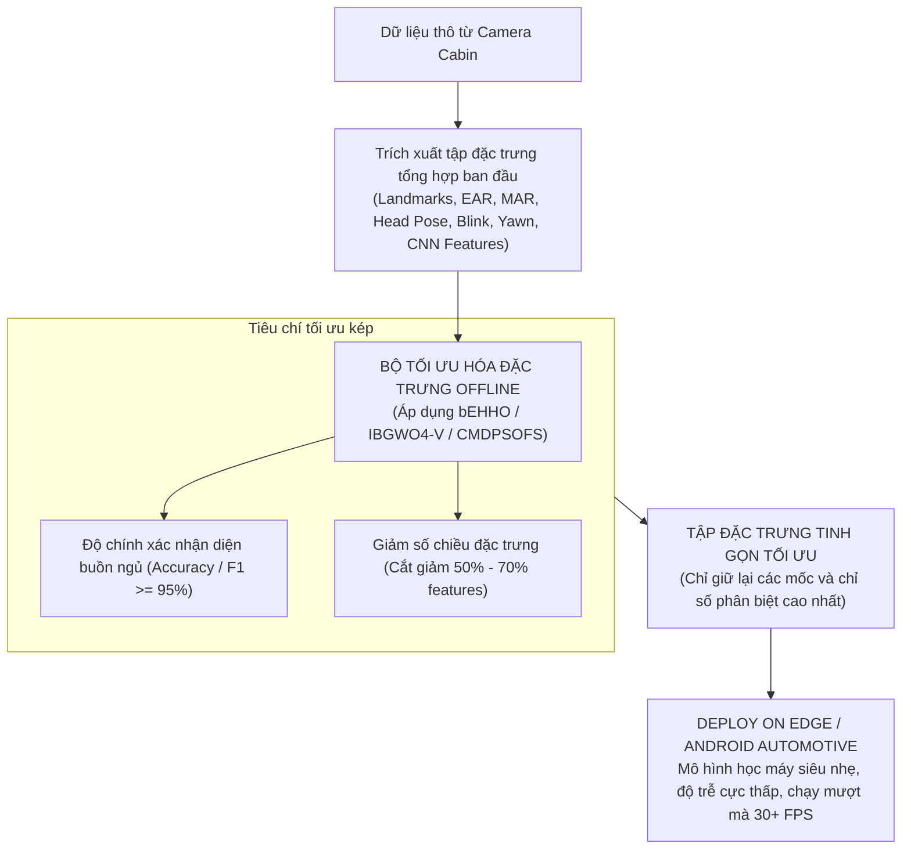

# Tổng Quan Các Nghiên Cứu Tối Ưu Hóa & Lựa Chọn Đặc Trưng (Metaheuristics & Feature Selection)

> **Thư mục lưu trữ tài liệu:** `/home/tranmanhduy/Workspace/ptithcm/driver-guardian/paper/Optimal`  
> **Dự án liên quan:** **Driver Guardian** – Hệ thống giám sát và cảnh báo trạng thái buồn ngủ / mất tập trung của tài xế dựa trên thị giác máy tính và Deep Learning.  
> **Mục tiêu tài liệu:** Tổng hợp, phân tích có hệ thống và đối sánh chuyên sâu 7 công trình khoa học tiêu biểu về các thuật toán tối ưu hóa bầy đàn / tiến hóa (Metaheuristics / Swarm Intelligence & Evolutionary Computation) cùng các biến thể giải bài toán **Lựa chọn tập đặc trưng tối ưu (Feature Subset Selection - FS)** phục vụ tối ưu hóa mô hình học máy và Deep Learning thời gian thực.

---

## 1. Giới thiệu tổng quan & Phân loại bài báo

Bài toán **Lựa chọn đặc trưng (Feature Selection - FS)** là một trong những bước tiền xử lý then chốt trong học máy và nhận dạng mẫu. Với dữ liệu camera giám sát tài xế (các tọa độ landmarks khuôn mặt, góc tư thế đầu, cử động mắt/miệng, tín hiệu quang học...), không gian đặc trưng thường rất lớn, chứa nhiều thông tin nhiễu, dư thừa (redundant) hoặc không liên quan (irrelevant). FS đóng vai trò:
1. **Giảm số chiều dữ liệu (Dimensionality Reduction):** Giảm thiểu chi phí tính toán và độ trễ trích xuất đặc trưng, đáp ứng yêu cầu xử lý thời gian thực (*real-time inference*) trên các thiết bị nhúng / in-vehicle edge computing.
2. **Loại bỏ nhiễu và dữ liệu trùng lặp:** Giúp mô hình tránh hiện tượng quá khớp (*overfitting*), cải thiện độ tổng quát hóa (*generalization ability*).
3. **Nâng cao độ chính xác phân loại:** Giữ lại các đặc trưng mang tính phân biệt cao nhất (salient features) để nhận diện chính xác các trạng thái vi ngủ (microsleep), ngáp, nhắm mắt lâu hay mất tập trung.

Thư mục `Optimal` tập hợp 7 bài báo kinh điển và cập nhật nhất, được cấu trúc theo 4 dòng thuật toán tối ưu hóa tự nhiên chủ đạo:
- **Genetic Algorithm (GA) - Giải thuật di truyền:** Đại diện cho phương pháp tính toán tiến hóa (Evolutionary Computation).
- **Particle Swarm Optimization (PSO) - Tối ưu hóa bầy đàn:** Lấy cảm hứng từ hành vi di chuyển của đàn chim / đàn cá.
- **Grey Wolf Optimizer (GWO) - Tối ưu hóa đàn sói xám:** Mô phỏng cấu trúc phân tầng xã hội và chiến thuật săn mồi của sói xám.
- **Harris Hawks Optimization (HHO) - Tối ưu hóa đàn ưng Harris:** Mô phỏng chiến thuật vồ mồi bất ngờ (surprise pounce) và các kiểu bao vây thích ứng.

Mỗi dòng thuật toán đều có đại diện gồm **công trình nền tảng nguyên bản (Foundational Paper)** và **công trình cải tiến / nhị phân hóa ứng dụng vào Feature Selection (FS Application & Optimization Paper)**.

---

## 2. Bảng tổng hợp đối sánh 7 bài báo

| STT | Tên bài báo / File PDF | Tác giả & Năm | Nơi công bố (Venue) | Loại công trình | Cơ chế / Đóng góp cốt lõi | Bộ dữ liệu thực nghiệm |
| :---: | :--- | :--- | :--- | :--- | :--- | :--- |
| **1** | `GA — Yang & Honavar (1998).pdf` | Jihoon Yang, Vasant Honavar (1998) | *IEEE Intelligent Systems* | Ứng dụng FS (Tiên phong) | Dùng GA dạng Wrapper với mạng nơ-ron kiến thiết nhanh (DistAl); tối ưu đa tiêu chí (độ chính xác + chi phí đặc trưng). | Dữ liệu nhân tạo (13-bit parity), 4 tập UCI (Heart, Ionosphere, Diabetes, Soybean). |
| **2** | `PSO_Eberhart & Kennedy (1995), A New Optimizer Using Particle Swarm Theory.pdf` | Russell Eberhart, James Kennedy (1995) | *IEEE MHS '95 Symposium* | Nền tảng nguyên bản | Khởi xướng giải thuật PSO mô phỏng bầy đàn; công thức cập nhật vận tốc & vị trí qua kinh nghiệm bản thân ($p_{best}$) và bầy đàn ($g_{best}/l_{best}$). | Hàm phi tuyến kinh nghiệm, Schaffer f6, Benchmark mạng nơ-ron. |
| **3** | `PSO_Particle Swarm Optimisation for Feature Selection...pdf` | Bing Xue, Mengjie Zhang, Will N. Browne (2012/2013) | *IEEE Transactions on Cybernetics* | Cải tiến FS (Đa mục tiêu) | Đề xuất 2 thuật toán MO-PSO: **NSPSOFS** (sắp xếp không vượt trội) và **CMDPSOFS** (Archive, Crowding distance, 2 toán tử đột biến). Tìm tập nghiệm Pareto tối ưu. | 12 tập dữ liệu benchmark UCI phân loại đa dạng số chiều. |
| **4** | `GWO_Grey Wolf Optimizer.pdf` | Seyedali Mirjalili, S. M. Mirjalili, Andrew Lewis (2014) | *Advances in Engineering Software* | Nền tảng nguyên bản | Khởi xướng giải thuật GWO dựa trên 4 cấp bậc đàn sói ($\alpha, \beta, \delta, \omega$) và 3 giai đoạn: lùng sục (search), bao vây (encircle), tấn công con mồi (attack). | 29 hàm benchmark toán học, 3 bài toán thiết kế kỹ thuật cơ khí, 1 ứng dụng quang học. |
| **5** | `GWO_Improved_Binary_Grey_Wolf_Optimization_Approaches_.pdf` | Jomana Yousef Khaseeb, Arabi Keshk, Anas Youssef (2025) | *Applied Sciences (MDPI)* | Cải tiến FS (Lai ghép & Nhị phân) | Đề xuất 3 biến thể lai ghép GWO + PSO (IBGWO2 P2P, IBGWO3, IBGWO4) kết hợp các hàm chuyển đổi dạng S-shape và V-shape để phá bẫy cực trị cục bộ. | 9 bộ dữ liệu biểu hiện gen người (High-dimensional microarray gene expression). |
| **6** | `HHO_Heidari et al. (2019), Harris Hawks Optimization: Algorithm and Applications.pdf` | Ali Asghar Heidari, Seyedali Mirjalili, Hossam Faris, et al. (2019) | *Future Generation Computer Systems* | Nền tảng nguyên bản | Khởi xướng giải thuật HHO mô phỏng chiến thuật vồ mồi bất ngờ; chuyển pha dựa trên năng lượng con mồi $E$; 4 chiến lược tấn công tích hợp bước nhảy Lévy. | 29 hàm benchmark toán học (unimodal, multimodal), 6 bài toán kỹ thuật thực tế. |
| **7** | `HHO_Peng et al. (2023), Hierarchical Harris Hawks Optimizer for Feature Selection.pdf` | Lemin Peng, Zhennao Cai, Ali Asghar Heidari, et al. (2023) | *Journal of Advanced Research* | Cải tiến FS (Phân tầng & Nhị phân) | Phát triển **EHHO / bEHHO**: tích hợp cơ chế phân tầng (3 cá thể tinh hoa A, B, C với đột biến Cauchy và vector dẫn hướng) giúp tăng tốc hội tụ và chọn đặc trưng tối thiểu. | CEC2017/2020 benchmark và 30 bộ dữ liệu phân loại UCI. |

---

## 3. Phân tích chi tiết từng bài báo

---

### Paper 1: Feature Subset Selection Using a Genetic Algorithm (Yang & Honavar, 1998)

* **Tên file:** `GA — Yang & Honavar (1998).pdf`
* **Tác giả:** Jihoon Yang, Vasant Honavar
* **Tạp chí:** *IEEE Intelligent Systems and Their Applications*, Vol. 13, No. 2, pp. 44–49, 1998.

#### 1. Động lực & Bài toán giải quyết
* Trong phân loại mẫu, nhiều thuộc tính có thể không liên quan, bị trùng lặp hoặc gây nhiễu, làm phình to không gian tìm kiếm và suy giảm độ chính xác tổng quát hóa (Generalization accuracy).
* Hướng tiếp cận **Wrapper** (sử dụng trực tiếp thuật toán học máy để đánh giá chất lượng tập đặc trưng) cho kết quả tốt hơn **Filter**, nhưng nếu dùng mạng nơ-ron truyền thống huấn luyện bằng Backpropagation thì chi phí tính toán quá đắt đỏ do phải huấn luyện lặp lại hàng trăm cá thể qua nhiều thế hệ.
* **Đóng góp:** Nhóm tác giả kết hợp Genetic Algorithm với một thuật toán học mạng nơ-ron kiến thiết nhanh mang tên **DistAl** (*Distance-based constructive neural network algorithm*), giúp việc đánh giá cá thể trong GA diễn ra cực nhanh mà không cần cấu hình kiến trúc mạng thủ công trước.

#### 2. Cơ chế thuật toán & Mô hình toán học
* **Mã hóa nhiễm sắc thể (Representation):** Chuỗi nhị phân chiều dài $m$ (với $m$ là tổng số đặc trưng). Giá trị `1` biểu thị đặc trưng được chọn, `0` biểu thị đặc trưng bị loại bỏ.
* **Mô hình học máy cơ sở:** DistAl thêm tuần tự các nơ-ron ẩn dạng ngưỡng hình cầu (spherical threshold units) vào mạng để phân tách các mẫu một cách trực tiếp mà không cần lặp lan truyền ngược nhiều vòng.
* **Hàm thích nghi (Fitness Function) kết hợp đa tiêu chí:**
  $$\text{fitness}(x) = \text{accuracy}(x) - \frac{\text{cost}(x)}{\text{accuracy}(x) + 1} + \text{cost}_{\max}$$
  *Trong đó:*
  * $\text{accuracy}(x)$: Tỉ lệ phân loại chính xác trên tập kiểm tra.
  * $\text{cost}(x)$: Tổng chi phí đo lường/thu thập của các đặc trưng trong tập $x$ (nếu không có chi phí đo lường riêng thì $\text{cost}(x)$ chính là số lượng đặc trưng được chọn).
  * $\text{cost}_{\max}$: Cận trên tổng chi phí của toàn bộ thuộc tính, đóng vai trò ngăn chặn các giải pháp tầm thường (ví dụ: tập rỗng có cost = 0 nhưng accuracy cực thấp).
* **Toán tử di truyền:** Chọn lọc dựa trên thứ hạng (Rank-based selection), lai ghép (Crossover) và đột biến (Mutation).

#### 3. Kết quả & Đóng góp
* Đã thử nghiệm trên bài toán nhân tạo *13-bit parity* (chỉ có 3 bit thực sự mang thông tin, 10 bit còn lại là nhiễu/dư thừa). GA đã xác định chính xác 100% đúng 3 bit quan trọng và loại bỏ sạch 10 bit rác.
* Trên 4 tập dữ liệu y sinh/thực tế từ UCI (Cleveland Heart Disease, Ionosphere, Pima Indians Diabetes, Soybean), GA giúp giảm từ **38% đến 78%** số lượng thuộc tính mà vẫn giữ nguyên hoặc nâng cao độ chính xác phân loại so với khi dùng tất cả các thuộc tính ban đầu.

---

### Paper 2: A New Optimizer Using Particle Swarm Theory (Eberhart & Kennedy, 1995)

* **Tên file:** `PSO_Eberhart & Kennedy (1995), A New Optimizer Using Particle Swarm Theory.pdf`
* **Tác giả:** Russell Eberhart, James Kennedy
* **Hội nghị:** *Proceedings of the Sixth International Symposium on Micro Machine and Human Science (MHS '95)*, IEEE, pp. 39–43, 1995.

#### 1. Động lực & Ý tưởng khởi nguồn
* Lấy cảm hứng từ hành vi xã hội của các bầy sinh vật trong tự nhiên: đàn chim kiếm ăn, đàn cá bơi lội phối hợp nhịp nhàng mà không cần sự điều phối trung tâm.
* Khác biệt lớn nhất với GA: GA dựa trên quy luật chọn lọc tự nhiên "kẻ mạnh sinh tồn" (survival of the fittest) kèm các phép lai ghép/đột biến làm biến dạng hoàn toàn thế hệ cũ (phá hủy ký ức lịch sử nếu không có elitism). Trong khi đó, **PSO có bộ nhớ (Memory)**: mỗi hạt nhớ lại vị trí tốt nhất nó từng đi qua ($p_{best}$) và nhận thông tin về vị trí tốt nhất của cả bầy ($g_{best}$).

#### 2. Cơ chế toán học cốt lõi
* Một bầy gồm $N$ hạt trong không gian $D$ chiều. Tại thời điểm $t$, hạt thứ $i$ có:
  * Vị trí: $\vec{X}_i = (x_{i1}, x_{i2}, \dots, x_{iD})$
  * Vận tốc: $\vec{V}_i = (v_{i1}, v_{i2}, \dots, v_{iD})$
  * Vị trí tốt nhất cá nhân từng đạt được: $\vec{P}_i = (p_{i1}, p_{i2}, \dots, p_{iD})$
  * Vị trí tốt nhất toàn bầy: $\vec{P}_g = (p_{g1}, p_{g2}, \dots, p_{gD})$
* **Công thức cập nhật vận tốc & vị trí:**
  $$v_{id}^{(t+1)} = v_{id}^{(t)} + c_1 \cdot \text{rand}_1() \cdot (p_{id} - x_{id}^{(t)}) + c_2 \cdot \text{rand}_2() \cdot (p_{gd} - x_{id}^{(t)})$$
  $$x_{id}^{(t+1)} = x_{id}^{(t)} + v_{id}^{(t+1)}$$
  *Trong đó:*
  * Thành phần $v_{id}^{(t)}$: Quán tính di chuyển cũ.
  * Thành phần $c_1 \cdot \text{rand}_1() \cdot (p_{id} - x_{id}^{(t)})$: Thành phần nhận thức cá nhân (Cognitive component).
  * Thành phần $c_2 \cdot \text{rand}_2() \cdot (p_{gd} - x_{id}^{(t)})$: Thành phần học hỏi xã hội (Social component).
  * $V_{\max}$: Ngưỡng chặn vận tốc nhằm tránh việc hạt văng ra ngoài không gian tìm kiếm.
* Hai mô hình liên kết bầy đàn:
  * **GBEST (Global Best):** Mọi hạt đều kết nối với hạt tốt nhất toàn bầy $\rightarrow$ Hội tụ rất nhanh nhưng dễ mắc kẹt cực trị địa phương.
  * **LBEST (Local Best):** Mỗi hạt chỉ kết nối với $k$ láng giềng kề cận theo tô-pô mạng $\rightarrow$ Duy trì đa dạng cá thể tốt hơn, ít bị bẫy cực trị.

#### 3. Đóng góp & Tầm ảnh hưởng
* Đặt nền móng cho toàn bộ nhánh nghiên cứu **Swarm Intelligence** dựa trên PSO.
* Chứng minh khả năng tối ưu hóa hàm phi tuyến đa chiều vượt trội và đề xuất ứng dụng trực tiếp cho huấn luyện trọng số mạng nơ-ron nhân tạo.

---

### Paper 3: Particle Swarm Optimisation for Feature Selection in Classification: A Multi-Objective Approach (Xue et al., 2012/2013)

* **Tên file:** `PSO_Particle Swarm Optimisation for Feature Selection in Classification: A Multi-Objective Approach.pdf`
* **Tác giả:** Bing Xue, Mengjie Zhang, Will N. Browne
* **Tạp chí:** *IEEE Transactions on Cybernetics*, Vol. 43, No. 6, pp. 1656–1671, December 2013.

#### 1. Động lực & Khoảng trống nghiên cứu
* Lựa chọn đặc trưng về bản chất là một bài toán **tối ưu đa mục tiêu có xung đột (Conflicting Multi-objective Problem)**:
  1. Tối đa hóa hiệu năng phân loại (hoặc tối thiểu hóa tỷ lệ lỗi).
  2. Tối thiểu hóa số lượng đặc trưng được chọn.
* Đa số các nghiên cứu trước đó ép 2 mục tiêu này thành một hàm đơn mục tiêu bằng phương pháp tổng có trọng số (weighted sum), đòi hỏi phải chỉnh siêu tham số trọng số $\alpha, \beta$ bằng tay và chỉ trả về một nghiệm duy nhất.
* **Đóng góp:** Đây là công trình toàn diện đầu tiên nghiên cứu giải thuật **Multi-Objective PSO (MOPSO)** để sinh ra tập nghiệm biên **Pareto Front** chứa các giải pháp không bị thống trị (non-dominated solutions), cho phép người dùng linh hoạt chọn điểm cân bằng tối ưu giữa độ chính xác và số đặc trưng.

#### 2. Hai thuật toán MO-PSO được đề xuất

* **Hai mục tiêu tối ưu:**
  $$f_1 = \text{Classification Error Rate (dùng K-NN với LOOCV)}$$
  $$f_2 = \frac{\text{Số đặc trưng được chọn}}{\text{Tổng số đặc trưng ban đầu}}$$
* **Thuật toán 1 - NSPSOFS (Non-dominated Sorting PSO for FS):**
  * Tích hợp cơ chế phân tầng xếp hạng (Non-dominated sorting) và khoảng cách tập trung (Crowding Distance) từ thuật toán NSGA-II vào PSO.
  * Hạt dẫn đầu ($g_{best}$) được chọn từ các nghiệm thuộc mặt biên Pareto đầu tiên có mật độ thưa nhất để mở rộng không gian tìm kiếm.
* **Thuật toán 2 - CMDPSOFS (Crowding, Mutation, and Dominance PSO for FS):**
  * Sử dụng một tập lưu trữ ngoài (**External Leader Archive**) chuyên lưu các nghiệm không bị thống trị qua các thế hệ.
  * Lựa chọn $g_{best}$ bằng cơ chế đấu bảng nhị phân (Binary tournament selection) dựa trên chỉ số lấn át và khoảng cách đông đúc.
  * **Tích hợp hai toán tử đột biến chuyên biệt:**
    1. *Đột biến trên không gian liên tục (Non-uniform continuous mutation)* giúp hạt nhảy khỏi cực trị địa phương.
    2. *Đột biến trên bit nhị phân (Bit-flip mutation)* tác động trực tiếp lên xác suất chọn/bỏ thuộc tính.

#### 3. Kết quả thực nghiệm
* Đánh giá trên 12 bộ dữ liệu benchmark UCI đối sánh với: SFS, SBS, Single-objective PSO, Two-Stage FS (2SFS) và 3 giải thuật đa mục tiêu tiến hóa nổi tiếng (NSGA-II, SPEA2, PAES).
* Kết quả cho thấy **CMDPSOFS** vượt trội hoàn toàn: tìm ra mặt biên Pareto rộng hơn, đều hơn, đạt độ chính xác phân loại cao hơn với số lượng thuộc tính giảm đáng kể so với tất cả các phương pháp còn lại.

---

### Paper 4: Grey Wolf Optimizer (Mirjalili et al., 2014)

* **Tên file:** `GWO_Grey Wolf Optimizer.pdf`
* **Tác giả:** Seyedali Mirjalili, Seyed Mohammad Mirjalili, Andrew Lewis
* **Tạp chí:** *Advances in Engineering Software*, Vol. 69, pp. 46–61, 2014.

#### 1. Động lực & Cảm hứng sinh học
* Lấy cảm hứng từ loài sói xám (*Canis lupus*), đặc trưng bởi tập tính sống theo bầy đàn có tôn ti trật tự cực kỳ nghiêm ngặt và cơ chế săn mồi tập thể tinh vi.
* **Hệ thống phân tầng lãnh đạo (Leadership Hierarchy):**
  * **Sói Alpha ($\alpha$):** Con đầu đàn (đực hoặc cái), đưa ra mọi quyết định quan trọng (săn mồi, di chuyển bầy, phân chia lãnh thổ).
  * **Sói Beta ($\beta$):** Cấp phó, cố vấn cho $\alpha$ và truyền đạt mệnh lệnh cho các con sói cấp dưới.
  * **Sói Delta ($\delta$):** Lính canh phòng, trinh sát, thợ săn giàu kinh nghiệm; chỉ phục tùng $\alpha$ và $\beta$.
  * **Sói Omega ($\omega$):** Tầng lớp thấp nhất, đóng vai trò giải tỏa căng thẳng trong bầy và ăn thức ăn sau cùng.

#### 2. Mô hình toán học của quá trình săn mồi
Quá trình tối ưu hóa mô phỏng 3 giai đoạn chính:

##### A. Bao vây con mồi (Encircling Prey)
Khoảng cách giữa sói và con mồi được tính theo công thức:
$$\vec{D} = \left| \vec{C} \cdot \vec{X}_p(t) - \vec{X}(t) \right|$$
$$\vec{X}(t+1) = \vec{X}_p(t) - \vec{A} \cdot \vec{D}$$
Trong đó các vector hệ số biến thiên:
$$\vec{A} = 2\vec{a} \cdot \vec{r}_1 - \vec{a}, \quad \vec{C} = 2\vec{r}_2$$
Với $\vec{a}$ giảm tuyến tính từ 2 về 0 qua các vòng lặp, $\vec{r}_1, \vec{r}_2$ là các vector ngẫu nhiên trong khoảng $[0, 1]$.

##### B. Săn lùng & Cập nhật vị trí bầy sói (Hunting Mechanism)
Trong không gian tìm kiếm chưa biết vị trí tối ưu tuyệt đối (con mồi), ba cá thể tốt nhất hiện tại là $\alpha, \beta, \delta$ được giả định là có vị trí gần con mồi nhất. Mọi con sói $\omega$ khác sẽ điều chỉnh vị trí theo trọng tâm của bộ ba này:
$$\begin{cases}
\vec{D}_\alpha = |\vec{C}_1 \cdot \vec{X}_\alpha - \vec{X}|, & \vec{X}_1 = \vec{X}_\alpha - \vec{A}_1 \cdot \vec{D}_\alpha \\
\vec{D}_\beta = |\vec{C}_2 \cdot \vec{X}_\beta - \vec{X}|, & \vec{X}_2 = \vec{X}_\beta - \vec{A}_2 \cdot \vec{D}_\beta \\
\vec{D}_\delta = |\vec{C}_3 \cdot \vec{X}_\delta - \vec{X}|, & \vec{X}_3 = \vec{X}_\delta - \vec{A}_3 \cdot \vec{D}_\delta
\end{cases}$$
$$\vec{X}(t+1) = \frac{\vec{X}_1 + \vec{X}_2 + \vec{X}_3}{3}$$

##### C. Cân bằng Khám phá (Exploration) & Khai thác (Exploitation)
* Khi $|\vec{A}| > 1$: Các cá thể sói tách xa nhau để lùng sục khắp không gian tìm kiếm (Exploration).
* Khi $|\vec{A}| < 1$: Toàn bầy thu hẹp vòng vây và lao vào tấn công con mồi (Exploitation).

#### 3. Kết quả đánh giá
* Đánh giá trên 29 hàm toán học kiểm định (Unimodal, Multimodal, Fixed-dimension Multimodal) và chứng minh hiệu quả vượt trội so với PSO, Gravitational Search Algorithm (GSA), Differential Evolution (DE), Evolutionary Programming (EP).
* Giải thành công 3 bài toán thiết kế cơ khí kinh điển và ứng dụng thiết kế quang học thực tế.

---

### Paper 5: Improved Binary Grey Wolf Optimization Approaches for Feature Selection Optimization (Khaseeb et al., 2025)

* **Tên file:** `GWO_Improved_Binary_Grey_Wolf_Optimization_Approaches_.pdf`
* **Tác giả:** Jomana Yousef Khaseeb, Arabi Keshk, Anas Youssef
* **Tạp chí:** *Applied Sciences (MDPI)*, Vol. 15, No. 2, Article 489, January 2025.

#### 1. Động lực & Thách thức trong bài toán Feature Selection số chiều cao
* GWO nguyên bản được thiết kế cho không gian liên tục. Khi áp dụng cho FS (không gian nhị phân rời rạc $\{0, 1\}$), thuật toán gặp nhược điểm:
  * Khả năng khám phá toàn cục suy giảm, bầy sói dễ bị đồng nhất hóa sớm và **mắc kẹt trong cực trị địa phương (local optima trapping)**.
  * Trên các bộ dữ liệu số chiều cực lớn (như dữ liệu vi mảng gen ung thư - Microarray gene expression với hàng nghìn thuộc tính nhưng chỉ có vài chục mẫu), tỷ lệ nhiễu cực cao khiến GWO đơn thuần hoạt động kém hiệu quả.
* **Đóng góp:** Tác giả kết hợp khả năng khai thác chính xác của GWO với khả năng lùng sục diện rộng của PSO, đề xuất **3 cấu trúc lai ghép cải tiến (IBGWO2, IBGWO3, IBGWO4)** kết hợp cùng 8 hàm chuyển đổi nhị phân (4 dạng S-shape và 4 dạng V-shape).

#### 2. Cơ chế 3 cấu trúc lai ghép đề xuất

* **Hàm chuyển đổi nhị phân (Transfer Functions - TFs):**
  * Dạng chữ S (S-shaped): Biến đổi tọa độ liên tục thành xác suất chọn đặc trưng theo hàm Sigmoid ($S_1 \dots S_4$).
    $$T(x_{id}) = \frac{1}{1 + e^{-x_{id}}}$$
  * Dạng chữ V (V-shaped): Biến đổi theo hàm đối xứng qua trục tung ($V_1 \dots V_4$, ví dụ hàm hyperbolic tangent $T(x_{id}) = |\tanh(x_{id})|$). Dạng V cho phép các thuộc tính có vận tốc thay đổi lớn sẽ dễ bị đảo trạng thái (từ 0 sang 1 hoặc ngược lại), tăng mạnh tính đa dạng.
* **Chiến lược lai ghép:**
  * **IBGWO1 (Baseline):** Đưa toàn bộ nghiệm của GWO làm đầu vào khởi tạo cho PSO.
  * **IBGWO2 (Peer-to-Peer):** So sánh từng nghiệm thứ $i$ giữa GWO và PSO, cá thể nào có fitness tốt hơn sẽ đi tiếp.
  * **IBGWO3 (Double Pool):** Gộp toàn bộ $2N$ nghiệm của GWO và PSO, xếp hạng và lấy $N$ nghiệm tối ưu.
  * **IBGWO4 (Triple Pool):** Gộp $3N$ nghiệm từ cả 3 nguồn (Quần thể gốc ban đầu + Quần thể qua GWO + Quần thể qua PSO), xếp hạng và chắt lọc lấy $N$ nghiệm xuất sắc nhất.

#### 3. Kết quả thực nghiệm
* Đánh giá trên 9 bộ dữ liệu gen ung thư kích thước mẫu nhỏ nhưng số chiều cực lớn (từ 2.000 đến 12.600 thuộc tính).
* **IBGWO4-V** đạt độ chính xác trung bình cao nhất (>95%) đồng thời cắt giảm số lượng thuộc tính nhiều nhất so với 8 thuật toán SOTA khác (BPSO, BGWO, BSSA, BGA, v.v.).
* **Đánh đổi (Trade-off):** Phương pháp đạt kết quả tốt nhất (IBGWO4-V) có độ phức tạp tính toán cao nhất do phải đánh giá và sắp xếp quần thể kích thước $3N$. Trong khi đó, **IBGWO3-S** đạt độ chính xác rất tốt (>90%) với thời gian thực thi cân bằng hơn.

---

### Paper 6: Harris Hawks Optimization: Algorithm and Applications (Heidari et al., 2019)

* **Tên file:** `HHO_Heidari et al. (2019), Harris Hawks Optimization: Algorithm and Applications.pdf`
* **Tác giả:** Ali Asghar Heidari, Seyedali Mirjalili, Hossam Faris, Ibrahim Aljarah, Majdi Mafarja, Huiling Chen
* **Tạp chí:** *Future Generation Computer Systems*, Vol. 97, pp. 849–872, 2019.

#### 1. Động lực & Cảm hứng sinh học
* Lấy cảm hứng từ loài chim ưng Harris (*Parabuteo unicinctus*) sinh sống tại sa mạc khô hạn. Không giống như các loài săn mồi đơn độc khác, chim ưng Harris phối hợp săn mồi theo bầy với chiến thuật nổi tiếng gọi là **"Surprise Pounce" (Cú vồ mồi bất ngờ)**.
* Khi con mồi (như thỏ sa mạc) liên tục đổi hướng và tiêu hao năng lượng, cả đàn ưng sẽ phối hợp thay đổi linh hoạt các kiểu vây hãm: từ vây hãm mềm từ trên cao, lao bổ nhào thăm dò, đến khép chặt vòng vây và tấn công quyết định từ nhiều hướng.

#### 2. Cơ chế toán học & Các pha hoạt động

##### A. Pha khám phá (Exploration - Khi $|E| \ge 1$)
Chim ưng đậu ngẫu nhiên trên các cành cây cao để phát hiện con mồi theo 2 chiến lược:
$$X(t+1) = \begin{cases}
X_{rand}(t) - r_1 |X_{rand}(t) - 2r_2 X(t)| & \text{khi } q \ge 0.5 \\
(X_{rabbit}(t) - X_m(t)) - r_3 (LB + r_4 (UB - LB)) & \text{khi } q < 0.5
\end{cases}$$
Với $X_m(t)$ là tọa độ trung bình của cả bầy ưng.

##### B. Năng lượng đào thoát của con mồi (Prey's Energy)
Năng lượng $E$ giảm dần theo thời gian lặp, đóng vai trò chuyển tiếp từ pha khám phá sang khai thác:
$$E = 2 E_0 \left(1 - \frac{t}{T}\right)$$
Trong đó $E_0 \in [-1, 1]$ biến thiên ngẫu nhiên theo từng vòng lặp.

##### C. Pha khai thác (Exploitation - Khi $|E| < 1$)
Tùy thuộc vào xác suất đào thoát của thỏ $r \in [0, 1]$ và năng lượng còn lại $|E|$:
1. **Vây hãm mềm (Soft Besiege) ($r \ge 0.5, |E| \ge 0.5$):** Con mồi còn nhiều năng lượng, bầy ưng lượn vòng bao vây từ xa để làm mồi kiệt sức.
   $$X(t+1) = \Delta X(t) - E |J \cdot X_{rabbit}(t) - X(t)|$$
   (với $J = 2(1 - r_5)$ là độ bật nhảy ngẫu nhiên của con mồi).
2. **Vây hãm cứng (Hard Besiege) ($r \ge 0.5, |E| < 0.5$):** Con mồi đã kiệt sức, bầy ưng lập tức khép chặt vòng vây tiếp cận sát con mồi.
   $$X(t+1) = X_{rabbit}(t) - E |\Delta X(t)|$$
3. **Vây hãm mềm kết hợp lao bổ nhào nhanh (Soft Besiege with progressive rapid dives) ($r < 0.5, |E| \ge 0.5$):** Con mồi cố gắng né tránh bằng các đường chạy zíc-zắc, chim ưng thực hiện các cú liệng thử nghiệm dựa trên **bước nhảy Lévy (Lévy Flight)** để bao phủ quỹ đạo di chuyển bất thường:
   $$Z = Y + S \times LF(D)$$
4. **Vây hãm cứng kết hợp lao bổ nhào nhanh (Hard Besiege with progressive rapid dives) ($r < 0.5, |E| < 0.5$):** Đòn quyết định khi con mồi kiệt quệ và không còn cơ hội trốn thoát.

#### 3. Kết quả & Tầm ảnh hưởng
* Đánh giá trên 29 bài toán kiểm định và 6 bài toán kỹ thuật thực tế. HHO thể hiện năng lực vượt trội về tốc độ hội tụ và độ mượt của quỹ đạo tìm kiếm so với GA, PSO, BBO, DE, GWO, MVO.

---

### Paper 7: Hierarchical Harris Hawks Optimizer for Feature Selection (Peng et al., 2023)

* **Tên file:** `HHO_Peng et al. (2023), Hierarchical Harris Hawks Optimizer for Feature Selection.pdf`
* **Tác giả:** Lemin Peng, Zhennao Cai, Ali Asghar Heidari, Lejun Zhang, Huiling Chen
* **Tạp chí:** *Journal of Advanced Research*, Vol. 53, pp. 261–278, 2023.

#### 1. Động lực & Khoảng trống nghiên cứu
* Mặc dù HHO có khả năng hội tụ nhanh, nhưng trong các bài toán không gian nhiều chiều hoặc bề mặt hàm mục tiêu phức tạp (như Feature Selection), HHO bộc lộ điểm yếu:
  * Thiếu cơ chế trao đổi thông tin xã hội có cấu trúc giữa các cá thể tốt nhất; mọi cá thể phụ thuộc quá mức vào một con mồi duy nhất ($X_{rabbit}$), dẫn đến mất đa dạng quần thể và dễ kẹt nghiệm cực trị cục bộ.
* **Đóng góp:** Tác giả đề xuất thuật toán **EHHO (Enhanced Hierarchical HHO)** và phiên bản nhị phân **bEHHO**: tích hợp cấu trúc **phân tầng xã hội (Enhanced Hierarchy)** và toán tử **đột biến Cauchy (Cauchy Mutation)** để tối ưu hóa việc chọn tập đặc trưng.

#### 2. Cơ chế phân tầng nâng cao (Enhanced Hierarchy) trong EHHO

* **Xếp hạng & Phân tầng cá thể:** Quần thể được xếp theo fitness, tách 3 cá thể tốt nhất đặt tên là $A, B, C$.
  * **Cập nhật Cá thể $A$ (Cá thể dẫn đầu tuyệt đối):**
    Áp dụng phân phối Cauchy ngẫu nhiên kết hợp với tỷ lệ thời gian lặp còn lại:
    $$X^j_A(t+1) = \begin{cases}
    X^j_{rabbit}(t) & \text{nếu } \tan\left(\pi \cdot (\text{rand} - 0.5)\right) < \left(1 - \frac{t}{\text{MaxFEs}}\right) \\
    X^j_{rabbit}(t) + G \cdot (X^j_m(t) - X^j_n(t)) & \text{trường hợp còn lại}
    \end{cases}$$
    *Ý nghĩa:* Ở các vòng lặp đầu, xác suất đột biến lớn giúp giải thuật thoát khỏi bẫy cực trị địa phương; ở các vòng lặp sau, xác suất đột biến nhỏ dần giúp cá thể $A$ tinh chỉnh hội tụ cực kỳ chính xác.
  * **Cập nhật Cá thể $B$ và $C$:** Học hỏi từ cá thể dẫn đầu $A$ và vị trí trung bình bầy để tạo thành các hướng tìm kiếm bù trừ, không bị dẫm chân lên nhau.
  * **Các cá thể còn lại:** Tiếp tục tuân theo cơ chế săn mồi 4 pha nguyên bản của HHO.
* **Phiên bản nhị phân bEHHO cho Feature Selection:**
  Sử dụng hàm chuyển đổi dạng V (hoặc dạng S) để ánh xạ vector liên tục thành vector nhị phân $\{0, 1\}$.
* **Hàm thích nghi:**
  $$\text{Fitness} = \alpha \cdot \gamma_R(D) + \beta \cdot \frac{|R|}{|C|}$$
  *Trong đó $\gamma_R(D)$ là tỷ lệ lỗi phân loại của mô hình KNN, $|R|$ là số đặc trưng được chọn, $|C|$ là tổng số đặc trưng ban đầu, $\alpha = 0.99, \beta = 0.01$.*

#### 3. Kết quả thực nghiệm
* Kiểm chứng trên 23 hàm chuẩn CEC kinh điển và **30 bộ dữ liệu phân loại UCI**.
* bEHHO đạt thứ hạng 1 về cả hai tiêu chí: **tỷ lệ lỗi phân loại thấp nhất** và **số lượng đặc trưng được chọn ít nhất**, vượt qua tất cả các thuật toán so sánh (bPSO, bGWO, bSSA, bSMA, bHHO nguyên bản).

---

## 4. Tổng kết quy trình ứng dụng Metaheuristics trong Lựa chọn đặc trưng (FS)

Từ các nghiên cứu trên, quy trình chuẩn hóa để áp dụng giải thuật tối ưu bầy đàn vào bài toán Lựa chọn đặc trưng bao gồm 4 bước thiết yếu:

### 1. Mã hóa không gian nghiệm (Solution Representation)
* Không gian bài toán FS là rời rạc: $\vec{X} = [x_1, x_2, \dots, x_D]$ với $x_d \in \{0, 1\}$.
* Hầu hết các thuật toán bầy đàn (PSO, GWO, HHO) hoạt động trên không gian liên tục $\mathbb{R}^D$. Do đó cần bước **nhị phân hóa (Binarization)**.

### 2. Hàm chuyển đổi nhị phân (Transfer Functions - TFs)
* **S-shaped (Sigmoid family):**
  $$T(x_d) = \frac{1}{1 + e^{-x_d}}, \quad X_d^{(t+1)} = \begin{cases} 1 & \text{nếu } \text{rand}() < T(x_d) \\ 0 & \text{ngược lại} \end{cases}$$
* **V-shaped (Tanh family - Khuyên dùng qua các bài báo GWO 2025, EHHO 2023):**
  $$T(x_d) = |\tanh(x_d)|, \quad X_d^{(t+1)} = \begin{cases} 1 - X_d^{(t)} & \text{nếu } \text{rand}() < T(x_d) \\ X_d^{(t)} & \text{ngược lại} \end{cases}$$
  *Ưu thế của hàm V:* Không ép buộc hạt về 0 hay 1 một cách đơn điệu mà cho phép đảo bit khi vận tốc lớn, giúp duy trì áp lực tìm kiếm và tránh bão hòa sớm.

### 3. Thiết kế Hàm thích nghi (Fitness Function Design)
Có 2 trường phái chính:
* **Trường phái Đơn mục tiêu kết hợp (Weighted Sum):**
  $$f = \alpha \cdot \text{ErrorRate} + (1 - \alpha) \cdot \frac{|S|}{|F|}$$
  *Thường chọn $\alpha \in [0.9, 0.99]$ để ưu tiên tuyệt đối độ chính xác phân loại trước, sau đó mới tối thiểu hóa kích thước tập đặc trưng.*
* **Trường phái Đa mục tiêu Pareto (Pareto Dominance - CMDPSOFS):**
  Tối ưu đồng thời $f_1 = \text{ErrorRate}$ và $f_2 = \frac{|S|}{|F|}$. Giữ lại tập các nghiệm không bị thống trị để kỹ sư hệ thống lựa chọn cấu hình phù hợp với từng môi trường phần cứng.

---

## 5. Ý nghĩa & Đề xuất ứng dụng cho dự án Driver Guardian

Hệ thống **Driver Guardian** có nhiệm vụ phát hiện buồn ngủ và mất tập trung của tài xế thông qua luồng video từ camera trong cabin.

### 1. Thách thức đặc thù của dữ liệu Driver Guardian
* **Số chiều đặc trưng lớn:** Khi trích xuất các đặc trưng hình học (68 hoặc 468 facial landmarks từ MediaPipe/Dlib), góc xoay đầu (Pitch, Yaw, Roll), cử động mắt (EAR - Eye Aspect Ratio, PERCLOS, tần số chớp mắt), cử động miệng (MAR - Mouth Aspect Ratio, tần số ngáp) kết hợp cùng chuỗi thời gian (temporal sliding window 30–60 frames) hoặc vector đặc trưng từ CNN/MobileNet, số chiều thuộc tính có thể lên đến hàng trăm hoặc hàng nghìn.
* **Hiện tượng dư thừa & tương quan cao:** Rất nhiều tọa độ mốc khuôn mặt (ví dụ các mốc trên má, mũi) không đóng góp vào việc phân biệt trạng thái tỉnh táo hay buồn ngủ, nhưng lại làm tăng đáng kể chi phí tính toán.
* **Ràng buộc thời gian thực trên thiết bị biên:** Ứng dụng chạy trên Android Automotive hoặc phần cứng nhúng trên xe ô tô đòi hỏi tốc độ xử lý phải đạt **$\ge 25\text{--}30 \text{ FPS}$** với tài nguyên CPU/GPU giới hạn.

### 2. Định hướng áp dụng các thuật toán tối ưu từ 7 bài báo

1. **Giai đoạn tối ưu hóa đặc trưng Offline (Huấn luyện):**
   * Sử dụng thuật toán **bEHHO (Peng et al., 2023)** hoặc **IBGWO4-V (Khaseeb et al., 2025)** để chọn lọc bộ đặc trưng tối ưu từ tập dữ liệu huấn luyện trạng thái tài xế.
   * Với khả năng vượt bẫy cực trị địa phương và hàm chuyển đổi dạng V, các thuật toán này sẽ loại bỏ từ 50% đến 70% các đặc trưng dư thừa/nhiễu.
2. **Lựa chọn cấu hình linh hoạt với CMDPSOFS (Xue et al., 2013):**
   * Sử dụng tiếp cận đa mục tiêu để xây dựng tập Pareto Front. Khi triển khai trên các dòng chip nhúng khác nhau (chip mạnh vs chip yếu), hệ thống có thể chọn ngay tập nghiệm đặc trưng tương ứng mà không cần huấn luyện lại từ đầu.
3. **Hiệu quả đạt được cho Driver Guardian:**
   * **Tăng tốc độ trích xuất và suy luận:** Giảm khối lượng tính toán trên mỗi khung hình, tăng tốc độ FPS cho mô-đun AI.
   * **Tăng độ chính xác & giảm báo động giả (False Alarms):** Loại bỏ nhiễu từ các biểu cảm khuôn mặt tự nhiên không liên quan đến buồn ngủ, giúp cảnh báo kịp thời và tin cậy cho tài xế.

---

## 6. Danh mục trích dẫn tài liệu tham khảo (References)

1. **Yang, J., & Honavar, V. (1998).** Feature subset selection using a genetic algorithm. *IEEE Intelligent Systems and their Applications*, 13(2), 44–49.
2. **Eberhart, R., & Kennedy, J. (1995).** A new optimizer using particle swarm theory. In *MHS'95. Proceedings of the Sixth International Symposium on Micro Machine and Human Science* (pp. 39–43). IEEE.
3. **Xue, B., Zhang, M., & Browne, W. N. (2013).** Particle swarm optimisation for feature selection in classification: A multi-objective approach. *IEEE Transactions on Cybernetics*, 43(6), 1656–1671.
4. **Mirjalili, S., Mirjalili, S. M., & Lewis, A. (2014).** Grey wolf optimizer. *Advances in Engineering Software*, 69, 46–61.
5. **Khaseeb, J. Y., Keshk, A., & Youssef, A. (2025).** Improved binary grey wolf optimization approaches for feature selection optimization. *Applied Sciences*, 15(2), 489.
6. **Heidari, A. A., Mirjalili, S., Faris, H., Aljarah, I., Mafarja, M., & Chen, H. (2019).** Harris hawks optimization: Algorithm and applications. *Future Generation Computer Systems*, 97, 849–872.
7. **Peng, L., Cai, Z., Heidari, A. A., Zhang, L., & Chen, H. (2023).** Hierarchical Harris hawks optimizer for feature selection. *Journal of Advanced Research*, 53, 261–278.
