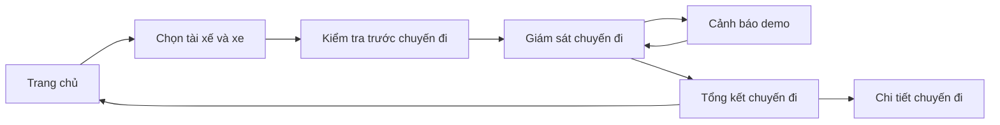
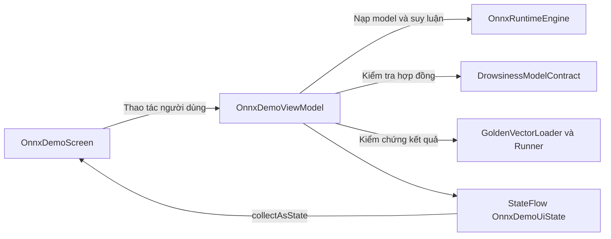

# Driver Guardian — Kiến trúc ứng dụng Android

Ứng dụng Android viết bằng Kotlin và Jetpack Compose, tổ chức trong một module `:app`, với package gốc `com.example.driverguardian`. Mã nguồn chia thành hai phần chính: `ui` phụ trách giao diện và trạng thái hiển thị; `ai` phụ trách tensor, hợp đồng mô hình và suy luận ONNX trên thiết bị.

Hiện tại, các màn hình nghiệp vụ dùng dữ liệu mô phỏng. Màn hình ONNX Demo có ViewModel và runtime riêng; pipeline backbone + neck đã có nhưng chưa nối vào màn hình giám sát chuyến đi.

## 1. Cấu trúc thư mục

```text
android/
├── settings.gradle.kts             # Khai báo module :app và kho dependency
├── build.gradle.kts                # Plugin Android, Kotlin và Compose
├── gradle/                         # Gradle Wrapper
├── scripts/                        # Công cụ tạo dữ liệu tham chiếu backbone + neck
└── app/
    ├── build.gradle.kts            # SDK, cấu hình ứng dụng và dependency
    └── src/
        ├── main/
        │   ├── AndroidManifest.xml
        │   ├── res/values/         # Tên ứng dụng và theme Android
        │   ├── assets/
        │   │   ├── models/         # Mô hình ONNX
        │   │   └── onnx_test_vectors/ # Dữ liệu chuẩn cho ONNX Demo
        │   └── java/com/example/driverguardian/
        │       ├── MainActivity.kt
        │       ├── ui/
        │       │   ├── navigation/ # Route, NavHost và bố cục điều hướng
        │       │   ├── screens/    # Màn hình theo chức năng
        │       │   ├── components/ # Thành phần giao diện dùng chung
        │       │   ├── theme/      # Màu sắc, typography, theme Compose
        │       │   └── mock/       # Kiểu dữ liệu và dữ liệu mô phỏng
        │       └── ai/
        │           ├── detection/ # Pipeline backbone + neck
        │           ├── runtime/   # Session ONNX, metadata, trạng thái và lỗi
        │           ├── tensor/    # Tensor FLOAT, shape, dummy input và preview
        │           ├── contract/drowsiness/ # Hợp đồng mô hình buồn ngủ
        │           └── parity/    # Nạp và so sánh dữ liệu chuẩn
        └── test/                  # Unit test cho các thành phần AI
```

## 2. Giao diện và điều hướng

[MainActivity](app/src/main/java/com/example/driverguardian/MainActivity.kt) là điểm vào duy nhất, khởi tạo Compose theo thứ tự `DriverGuardianTheme → DriverGuardianApp`. Activity được cấu hình hiển thị ngang trong manifest.

[AppNavigation](app/src/main/java/com/example/driverguardian/ui/navigation/AppNavigation.kt) quản lý `NavController`, `SnackbarHostState` và `AppNavHost`. Các route được khai báo trong [Screen](app/src/main/java/com/example/driverguardian/ui/navigation/Screen.kt). Mỗi màn hình nhận callback điều hướng từ NavHost.

- Chiều rộng từ `720.dp`: dùng sidebar; nhỏ hơn: dùng thanh điều hướng dưới.
- Màn hình cảnh báo nguy hiểm ẩn cả hai thanh điều hướng.
- `safeNavigate()` dùng `launchSingleTop` để tránh tạo thêm bản sao của đích đang ở trên cùng back stack.
- `ui/components` cung cấp card, nút, chỉ báo trạng thái và biểu đồ dùng chung; `ui/theme` định nghĩa giao diện sáng/tối.

Luồng chuyến đi được tổ chức như sau:



Các nhóm màn hình còn lại gồm lịch sử chuyến đi, lịch sử cảnh báo, phân tích, cài đặt và thông tin hệ thống. Màn hình hệ thống dẫn tới ONNX Demo. Chi tiết chuyến đi nhận tham số qua route `trip_detail/{id}`.

## 3. Dữ liệu và quản lý trạng thái

Các màn hình nghiệp vụ đọc `MockData` và `AiAnalyticsMockData` trong `ui/mock`. Trạng thái giao diện như bộ lọc, lựa chọn xe và tùy chọn cài đặt được giữ cục bộ bằng state của Compose. Ứng dụng chưa có lớp repository hoặc cơ chế lưu trữ bền vững cho các dữ liệu này.

Riêng ONNX Demo tổ chức theo Screen–ViewModel:



[OnnxDemoViewModel](app/src/main/java/com/example/driverguardian/ui/screens/onnxdemo/OnnxDemoViewModel.kt) điều phối đọc assets trên `Dispatchers.IO`, nạp model và suy luận trên `Dispatchers.Default`. `OnnxDemoUiState` chứa trạng thái runtime, metadata, diagnostics, kết quả suy luận và kết quả kiểm chứng. ViewModel đóng runtime trong `onCleared()`.

## 4. Các thành phần AI

### Runtime ONNX

[OnnxRuntimeEngine](app/src/main/java/com/example/driverguardian/ai/runtime/OnnxRuntimeEngine.kt) quản lý một session đang hoạt động và cung cấp `loadModel()`, `run()`, `close()`. Các thao tác được tuần tự hóa bằng khóa đồng bộ. Kết quả trả về qua `RuntimeResult.Success` hoặc `RuntimeResult.Failure`.

`OnnxModelSession` kiểm tra tên input, kiểu dữ liệu, shape và số phần tử; chuyển `FloatTensor` thành tensor native; thực thi ONNX và sao chép đầu ra về Kotlin. Tensor native và kết quả native được đóng sau mỗi lần chạy. Khi đổi model, engine đóng session cũ và reset diagnostics.

`RuntimeState` gồm `NotLoaded`, `Loading`, `Ready`, `Running`, `Failed`, `Closed`. `RuntimeDiagnostics` lưu phiên bản runtime, tên model, thời gian nạp, thời gian suy luận, số lượt chạy và lỗi gần nhất.

### Tensor

`FloatTensor` chứa shape và mảng `FloatArray`. `TensorShape` kiểm tra kích thước và chống tràn số khi đếm phần tử. `DummyTensorFactory` tạo input toàn số 0 theo metadata, có giới hạn cấp phát và yêu cầu kích thước cụ thể cho chiều động. `TensorPreviewFactory` tạo phần dữ liệu xem trước để hiển thị trên UI.

### Pipeline backbone + neck

[BackboneNeckPipeline](app/src/main/java/com/example/driverguardian/ai/detection/BackboneNeckPipeline.kt) sở hữu một engine riêng, nạp `assets/models/backbone_neck.onnx` và kiểm tra contract trước khi chạy.

| Tensor | Kiểu | Shape |
| --- | --- | --- |
| Input `images` | FLOAT, NCHW | `[B, 3, 640, 640]` |
| Output `p3` | FLOAT, NCHW | `[B, 64, 80, 80]` |
| Output `p4` | FLOAT, NCHW | `[B, 128, 40, 40]` |
| Output `p5` | FLOAT, NCHW | `[B, 256, 20, 20]` |

`B` là batch size dương. Bên gọi cung cấp tensor ảnh RGB đã tiền xử lý và chia 255. Pipeline trả `BackboneNeckFeatures`, gồm toàn bộ ba feature map và thời gian suy luận. Các mảng đầu ra vẫn dùng được sau khi pipeline đóng.

Pipeline chỉ trích xuất đặc trưng; chưa có detection head, giải mã bounding box hoặc nối với camera. Chủ sở hữu giữ pipeline để chạy nhiều lần trên luồng nền và gọi `close()` khi kết thúc vòng đời.

### Hợp đồng mô hình buồn ngủ

`DrowsinessModelContract` tách kiểm tra metadata khỏi ánh xạ ngữ nghĩa của các node:

| Thành phần | Shape FLOAT kỳ vọng |
| --- | --- |
| Chuỗi mắt trái, mắt phải, miệng — mỗi input | `[1, 30, 3, 64, 64]` |
| Chuỗi đặc trưng hình học | `[1, 30, 10]` |
| Xác suất buồn ngủ | `[1, 1]` |

`DrowsinessInputMapping` khai báo tên node cho từng input và output. ONNX Demo hiện dùng `Unresolved`; ba input ảnh cùng shape nên contract không tự suy đoán ý nghĩa của chúng. Thành phần này kiểm tra quy ước tensor, không thực hiện tiền xử lý ảnh hoặc tạo chuỗi khung hình.

### Kiểm chứng số học

`GoldenVectorAssetLoader` đọc manifest và tensor FLOAT32 little-endian từ assets, kiểm tra shape và tên tensor. `GoldenVectorRunner` so sánh đầu ra với dữ liệu chuẩn theo sai số tuyệt đối và tương đối, trả `PASS`, `FAIL`, `ERROR` hoặc `NOT_RUN`. ONNX Demo yêu cầu runtime lấy đầy đủ output khi chạy các phép so sánh này.

## 5. Ranh giới tích hợp hiện tại

Model backbone + neck nằm trong `app/src/main/assets/models`. Model buồn ngủ mà ONNX Demo yêu cầu tại `models/drowsiness_model.onnx` chưa có; `onnx_test_vectors` hiện chưa chứa bộ dữ liệu chuẩn.

Phần AI và giao diện chuyến đi hiện hoạt động tách biệt. Các trạng thái giám sát, cảnh báo và phân tích trên màn hình vẫn lấy từ dữ liệu mô phỏng; chưa có luồng camera → tiền xử lý → suy luận → cập nhật trạng thái chuyến đi.
